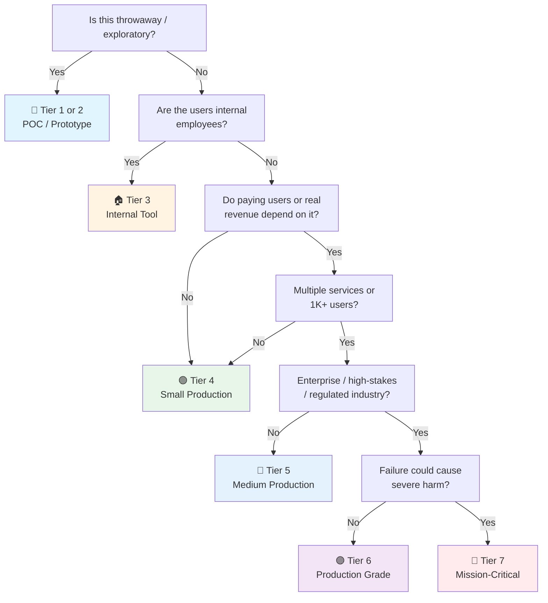

# Database Checklist

> The **data layer** checklist — database design, operations, and performance across all engines.
> Complements [[Release]] (migration gates), [[Security]] (data protection), and the domain checklists (api, batch, microservice, infra).
> Engine-specific companions: [[PostgreSQL]], [[MongoDB]], [[Valkey]] (Redis).
> Framework-agnostic — the principles are the same whether the engine is SQL or NoSQL.
> Last updated: 2026-08-05

---

## 1. Data Modeling & Schema Design

- [ ] **Entity-relationship model exists** — Entities, relationships, cardinality documented before schema DDL. Not "we'll figure it out in queries."
- [ ] **Normalization vs denormalization decided** — 3NF for transactional (OLTP) integrity. Deliberate denormalization for read-heavy (OLAP/reporting) or document-modeled data. Every denormalization has a documented reason.
- [ ] **Keys defined** — Natural vs surrogate keys chosen per table. UUIDs vs auto-increment decided (UUID for distributed/multi-writer, bigint for single-writer simplicity). Primary keys on every table.
- [ ] **Constraints everywhere** — NOT NULL, CHECK, UNIQUE, foreign keys. The database enforces integrity — application code forgets. FK indexes created (see §4).
- [ ] **Data types correct** — Timestamps with timezone (`timestamptz`), not strings. Money as decimal, not float. Dates as dates. Wrong types = silent bugs.
- [ ] **Soft delete vs hard delete** — Chosen per table (audit/regulatory → soft; high-volume/transient → hard). Consistent pattern, not ad-hoc.
- [ ] **Audit columns** — `created_at`, `updated_at` (and `created_by`/`updated_by` where relevant) on tables that need traceability.

## 2. Migrations & Schema Evolution

- [ ] **Migrations versioned** — Alembic / Flyway / Liquibase / Prisma migrations in version control. Applied in order, never edited after release → gate in [[Release]] §4.
- [ ] **No destructive auto-DDL** — No `ddl-auto: update` / `create-drop` / `db.sync()` in production. Migrations are explicit and reviewed.
- [ ] **Expand-contract for breaking changes** — Add column → deploy → backfill → switch code → drop old column. Never one-shot destructive migration.
- [ ] **Downgrade path** — Every migration has a down-migration or documented restore procedure. Tested in staging.
- [ ] **Migrations tested in CI** — Apply migrations from scratch in CI. Catches ordering, missing defaults, and environment drift.

## 3. Backup & Recovery

- [ ] **Backup strategy defined** — Full + incremental/WAL (point-in-time recovery) for relational. Snapshots + oplog/change-stream replay for document. RPO/RTO numbers documented.
- [ ] **Backups tested — restore actually works** — Scheduled restore drills (quarterly minimum). A backup that was never restored is a hope, not a backup.
- [ ] **Backups encrypted** — At rest (KMS/managed keys) and in transit. Off-site or cross-region copy.
- [ ] **Backup retention policy** — Daily/weekly/monthly retention defined (regulatory minimum if applicable). Purge old backups automatically.
- [ ] **Backup monitoring** — Backup job failure alerts. "Last successful backup" check on dashboards. Silent backup failure is a ticking bomb.

## 4. Indexing & Query Performance

- [ ] **Indexes on FK and hot WHERE columns** — Every foreign key indexed. Filter/join columns from real query patterns (not guesses).
- [ ] **Composite indexes match query shape** — Column order matters: equality first, range last. Leftmost-prefix rule understood.
- [ ] **N+1 queries hunted** — `EXPLAIN`/query logs reviewed. ORM lazy loading disabled where it causes N+1 → see engine checklists.
- [ ] **Index bloat managed** — Reindex/rebuild schedule for frequently-updated indexes. Monitor index size vs table size.
- [ ] **Covering indexes for hot paths** — Include columns to avoid table lookups on critical queries. Only for proven hot paths — every index costs writes.
- [ ] **Query plan review** — `EXPLAIN ANALYZE` on slow queries. Sequential scans on large tables flagged.
- [ ] **Slow query log enabled** — Threshold set (e.g. > 100ms), logged centrally, reviewed. The first place to look when something's slow.

## 5. Connection Management

- [ ] **Connection pool configured** — Pool size deliberate (not default unlimited, not 1). `pool_size` / `max_connections` tuned: (CPU cores × 2) + spare is a sane starting point.
- [ ] **No connection leaks** — Sessions closed in `finally`/context managers. Pool exhaustion is a top-3 production outage cause.
- [ ] **Pool monitoring** — Active/idle/waiting connections tracked. Alerts at 80% pool utilization.
- [ ] **Timeouts set** — connect, read, write timeouts on all clients. `statement_timeout` on the server side as a safety net.
- [ ] **Transaction discipline** — Short transactions, no user I/O inside a transaction, `READ COMMITTED` default unless isolation level deliberately chosen.

## 6. Caching Strategy

- [ ] **Cache layers mapped** — Application cache (in-memory) → shared cache ([[Valkey]]/Redis) → database. Each layer's purpose documented.
- [ ] **Cache invalidation designed** — TTL-based, event-driven (pub/sub, CDC), or write-through. Stale data is a product bug — know your tolerance.
- [ ] **Cache stampede protection** — Locking or single-flight on cache miss. Thundering herd on popular keys takes the DB down.
- [ ] **Hot keys identified** — A few keys handling most traffic? Replica reads, local caches, or sharding for hot keys.
- [ ] **Cache hit rate monitored** — Dashboard + alert. Dropping hit rate = invalidation bug or TTL too short.

## 7. Replication & High Availability

- [ ] **HA architecture chosen** — Single-instance + backups (low tier) → primary + replica with failover (medium) → multi-region / active-active (high tier). Matches the tier matrix below.
- [ ] **Replication lag monitored** — Replica lag tracked; alert on drift. Read-your-writes handled (read from primary when consistency matters).
- [ ] **Failover tested** — Chaos/game-day: kill the primary, verify promotion, verify app recovers. Untested failover is fiction.
- [ ] **Split-brain prevented** — Quorum/fencing for multi-node setups. Never two primaries.
- [ ] **Writes scale plan** — If write throughput is the bottleneck: partition/shard BEFORE you need it (hard to retrofit).

## 8. Security & Access Control

- [ ] **Least-privilege accounts** — App connects with its own user, not `root`/`admin`/`postgres`. Read-only replicas for reporting. Grants, not blanket privileges.
- [ ] **No secrets in connection strings** — Credentials from env/vault, never hardcoded → see [[Security]] §4.
- [ ] **TLS for connections** — Client ↔ DB encrypted (`sslmode=require`/equivalent). Internal networks are not inherently trusted.
- [ ] **Network isolation** — DB not internet-exposed. Firewall/VPC/subnet rules. Admin ports closed.
- [ ] **Audit logging** — Who accessed what, when (pgAudit, audit log, change streams). Required for regulated tiers.
- [ ] **Encryption at rest** — Volume/disk encryption or engine-native (TDE). Backup encryption too → [[Security]] §8.

## 9. Observability & Monitoring

- [ ] **Key metrics collected** — Connections, queries/sec, cache hit ratio, replication lag, disk I/O, WAL/oplog growth, table/index bloat.
- [ ] **Alerts configured** — Disk space > 80%, connection pool > 80%, replication lag > threshold, slow query count spike, backup failure.
- [ ] **Dashboards exist** — Engine overview dashboard (Prometheus + Grafana or managed equivalent). Anyone can answer "is the DB healthy?" in 10 seconds.
- [ ] **Capacity planning** — Growth trend reviewed quarterly: disk, memory, connections. Plan before the alarm.

---

## Quick Sanity Check Before Launch

- [ ] Schema matches migration state (no drift)
- [ ] All FKs indexed, hot queries EXPLAIN-analyzed
- [ ] Backup running AND restore tested
- [ ] Connection pool sized and monitored
- [ ] Least-privilege app account, TLS on connections
- [ ] Slow query log on, key alerts armed
- [ ] Cache invalidation verified for the main flows
- [ ] Replication (if any) lag monitored, failover practiced

---

## Project Tier Scoping Matrix

> **How to use this table:** Pick your tier first, then focus only on the sections marked ✅ (required) or 🟡 (recommended). Skip ❌ sections entirely — they'd be over-engineering for your context.
>
> **Legend:** ✅ Required · 🟡 Recommended / partial · ❌ Skip

### Tier Descriptions

| # | Tier | Description | Typical Team | Users | Lifespan |
|---|---|---|---|---|---|
| 1 | 🧪 **POC / Spike** | Validate an idea. Throwaway data. SQLite is fine. | 1 dev | Internal only | Days–weeks |
| 2 | 🔧 **Prototype / MVP** | Waiting for integration or user validation. Might become real. | 1–2 devs | Beta testers | Weeks–months |
| 3 | 🏠 **Internal Tool** | Real users (employees), real data. No external exposure or paying customers. | 1–3 devs | Employees | Ongoing |
| 4 | 🟢 **Small Production** | Single engine, low traffic. Real users, maybe early revenue. | 1–2 devs | < 1K users | Ongoing |
| 5 | 🔵 **Medium Production** | Multiple engines or higher traffic. Real revenue or user base that matters. | 2–5 devs | 1K–100K users | Ongoing |
| 6 | 🟣 **Production Grade** | Full rigor — high-stakes SaaS, enterprise product, or large user base. | 5+ devs | 100K+ users | Long-term |
| 7 | 🔴 **Mission-Critical / Regulated** | Healthcare (HIPAA), finance (PCI-DSS), safety systems. Failure = severe harm. Adds formal verification, regulatory audit. | 10+ devs | Varies | Decades |

### Which Tier Am I?

### Checklist Applicability by Tier

| # | Section | 🧪 POC | 🔧 Prototype | 🏠 Internal | 🟢 Small Prod | 🔵 Medium Prod | 🟣 Production Grade | 🔴 Mission-Critical |
|---|---|:---:|:---:|:---:|:---:|:---:|:---:|:---:|
| 1 | Data Modeling | 🟡 minimal | ✅ | ✅ | ✅ | ✅ | ✅ | ✅ + formal review |
| 2 | Migrations | ❌ SQLite auto | 🟡 simple | ✅ | ✅ | ✅ + expand-contract | ✅ + tested in CI | ✅ + approval |
| 3 | Backup & Recovery | ❌ | 🟡 dump files | ✅ + scheduled | ✅ + restore tested | ✅ + PITR | ✅ + drills | ✅ + regulatory |
| 4 | Indexing & Performance | ❌ | 🟡 PK only | ✅ + hot queries | ✅ + EXPLAIN | ✅ + bloat mgmt | ✅ + query review | ✅ + capacity plan |
| 5 | Connection Management | ❌ | 🟡 default pool | ✅ + sized | ✅ + monitored | ✅ + timeouts | ✅ + pool alerts | ✅ + formal |
| 6 | Caching Strategy | ❌ | ❌ | 🟡 if needed | 🟡 | ✅ + invalidation | ✅ + stampede guard | ✅ + hot-key plan |
| 7 | Replication & HA | ❌ | ❌ | 🟡 if needed | 🟡 replica optional | ✅ + failover tested | ✅ + multi-region | ✅ + active-active |
| 8 | Security & Access | 🟡 local only | 🟡 app user | ✅ + least priv | ✅ + TLS | ✅ + audit logs | ✅ + full hardening | ✅ + regulatory |
| 9 | Observability | ❌ | ❌ | 🟡 basic | ✅ + alerts | ✅ + dashboards | ✅ + capacity planning | ✅ + full stack |

---

## Sources

- Complements [[Release]] (migration gates), [[Security]] (data protection), [[Infrastructure]] (homelab/AWS hosting).
- Engine-specific: [[PostgreSQL]], [[MongoDB]], [[Valkey]].
- Deep references: SQL standard, your Database vault (`F:\obsidian_note\swe-knowledge\computing-foundation-note\Database\`).
