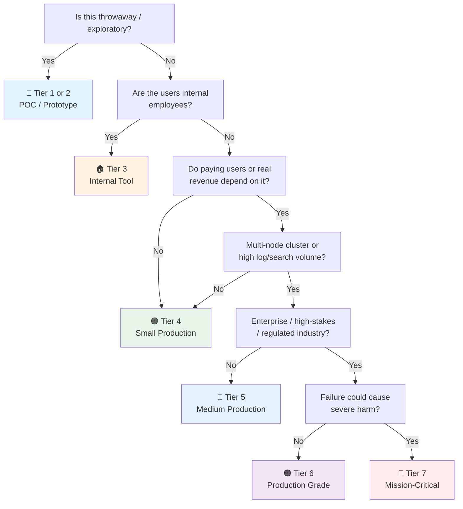

# Elasticsearch / OpenSearch Checklist

> Search & analytics companion to the general [[Database]] checklist.
> Covers Elasticsearch 8.x / OpenSearch 2.x — the standard inverted-index search and log analytics engines.
> Lucene-based: the principles are identical for both; differences noted where they exist.
> Companion to [[PostgreSQL]], [[MongoDB]], and [[Valkey]] for the other engines in the homelab.
> Last updated: 2026-08-07

---

## 1. Cluster Setup & Node Configuration

- [ ] **Version** — Elasticsearch 8.x (or OpenSearch 2.x). `GET /` or `bin/elasticsearch --version` recorded. Upgrade path known (rolling upgrade for minor, full-cluster restart for major).
- [ ] **Node roles assigned** — Dedicated roles: `master` (cluster state), `data` (index storage), `ingest` (preprocessing pipeline), `coordinating` (query fan-out + reduction). No all-roles-on-every-node in production — dedicated masters prevent cluster instability under load.
- [ ] **Master node quorum** — Odd number of dedicated master-eligible nodes (3 minimum for HA). Majority quorum prevents split-brain. Never 2 masters — you can't form a majority.
- [ ] **Heap sized correctly** — JVM heap = 50% of available RAM, capped at ~31 GB (compressed oops threshold). Remaining RAM for the Lucene filesystem cache (OS page cache is critical for search performance). Monitor GC pauses.
- [ ] **`cluster.routing.allocation.awareness`** — Rack/zone awareness configured for multi-AZ deployments. Ensures primary + replica shards are on different failure domains.
- [ ] **Container/Docker notes** — `vm.max_map_count=262144` set on host (Linux kernel param — pods without it crash on startup). Heap size via `ES_JAVA_OPTS` or `OPENSEARCH_JAVA_OPTS` from env. Volume for `/usr/share/elasticsearch/data` → [[Infrastructure]].

## 2. Index Design & Mapping

- [ ] **Mapping defined explicitly, not dynamic** — `dynamic: strict` or `dynamic: false` in production. Dynamic mapping creates guessed types that break at scale (e.g. a `text` field auto-created from one document, then a number comes in and fails). Explicit mapping reviewed and versioned.
- [ ] **Mapping explosion prevented** — Avoid unbounded field counts. Sources: user-generated field names, deeply nested objects, `object` type with high cardinality. Set `index.mapping.total_fields.limit` (default 1000). Each field costs heap memory. Mapping explosion = OOM.
- [ ] **`text` vs `keyword` deliberate** — `text` (analyzed, full-text search) vs `keyword` (exact match, aggregations, sorting). Use multi-field: `"name": { "type": "text", "fields": { "raw": { "type": "keyword" } } }`. Aggregating on `text` without a keyword sub-field fails.
- [ ] **Index templates in place** — Component templates + index templates for time-series/logging. New auto-created indices match patterns and get settings + mappings automatically. No manual `PUT mapping` per index.
- [ ] **Aliases used, never query indices directly** — Write alias + read alias. Reindex to new index, switch alias atomically. Zero-downtime mapping changes. Applications never hardcode index names.
- [ ] **Shard count deliberate** — Over-sharding (too many shards) wastes resources; under-sharding (too few) limits parallelism. Rule of thumb: aim for 20–50 GB per shard. **A shard is a Lucene index — it has overhead.** One shard per CPU core per node is the parallelism ceiling.
- [ ] **Replica count chosen** — 1 replica minimum for HA (survives single-node failure). 0 replicas acceptable during bulk indexing (temporarily). Replicas serve read traffic and survive failures — they're not just backups.

## 3. Indexing & Data Lifecycle

- [ ] **Bulk API for writes** — `POST /_bulk` with batches (5–15 MB typical). Never single-doc `POST /index/_doc` at volume. Bulk reduces round trips by 10–100x.
- [ ] **`refresh_interval` tuned** — Default `1s` (near-real-time). Increase to `30s` or `-1` (disable) during heavy bulk indexing, restore after. Each refresh creates a new Lucene segment — too frequent = segment explosion.
- [ ] **`op_type: create` vs index** — Use `create` to prevent accidental overwrites (fails if `_id` exists). Use `index` (default) for upserts. Decide deliberately.
- [ ] **Index Lifecycle Management (ILM) / ISM policies** — Hot → warm → cold → delete pipeline configured for time-series data. `hot` (write + search), `warm` (search only, force-merged, fewer replicas), `cold` (searchable snapshots), `delete` (purge). Automates retention without manual scripts.
- [ ] **Force merge before read-only** — `POST /index/_forcemerge?max_num_segments=1` before moving to warm tier. Reduces segment count, improves search performance, uses less memory. Do NOT force-merge an index still being written to.
- [ ] **Reindex for mapping changes** — Breaking mapping changes require reindex: create new index → `POST /_reindex` → switch alias. Test reindex time on staging data first. Source pipeline for transformations during reindex.

## 4. Search & Query Performance

- [ ] **Query DSL reviewed for hot paths** — Prefer `filter` context over `query` (must) context. Filters are cacheable and don't contribute to scoring. Use `bool` query with `filter` clauses for exact-match conditions.
- [ ] **`from` + `size` avoided for deep pagination** — `from: 10000` is expensive (coordinates must retrieve and discard 10K docs). Use `search_after` with a sort key for cursor-based pagination, or `scroll` for bulk export (not for real-time requests).
- [ ] **Aggregation cardinality checked** — `terms` aggregation on high-cardinality fields (e.g. user IDs) loads buckets into memory. Set `size` on the agg, use `cardinality` (HyperLogLog) for counts instead of exact terms. High-cardinality aggs = OOM risk.
- [ ] **`profile` API used** — `POST /index/_search?profile=true` to see query planning: which clauses are slow, how much time in Lucene vs coordination. The `EXPLAIN ANALYZE` of Elasticsearch.
- [ ] **Source filtering** — `_source: { includes: [...] }` to return only needed fields. Fetching full `_source` for large documents wastes network and heap. Never store fields you don't need to return.
- [ ] **Fielddata loading disabled** — `text` fields with `fielddata: true` load the inverted index into heap for sorting/aggregations — a known OOM cause. Use keyword sub-fields instead. Monitor `indices.fielddata.memory_size`.

## 5. Storage, Segments & Merge

- [ ] **Segment count monitored** — `GET /_cat/segments/index?v`. Too many segments = slow search (each segment is searched sequentially). Force merge read-only indices to 1 segment.
- [ ] **Merge throttling understood** — `indices.merge.scheduler` controls how merges happen. On SSDs, increase `max_merge_count` and remove throttling. On HDDs, merges thrash the disk.
- [ ] **Store type: hybridfs** — Default for most. `hybridfs` chooses between `niofs` and `mmapfs` per segment. For large indices on machines with plenty of RAM: `mmapfs` leverages the OS page cache directly.
- [ ] **Translog configuration** — `index.translog.durability: request` (default, fsync per request) or `async` (fsync every `sync_interval`). `async` for bulk indexing speed (at risk of losing un-synced data on crash).
- [ ] **Disk-based shard allocation** — `cluster.routing.allocation.disk.watermark.low/high/flood_stage` set. At `flood_stage`, indices go read-only to prevent corruption. Monitor disk before it hits flood.

## 6. Backup & Recovery

- [ ] **Snapshots to object storage** — Register a snapshot repository (S3, GCS, Azure Blob, NFS). `PUT /_snapshot/<repo>` with credentials. Snapshot is incremental — only changed segments are uploaded. Cheaper and faster than `pg_dump` for large indices.
- [ ] **Snapshot schedule** — Automated via ILM or cron. Frequency matches RPO. Repository lifecycle policy purges old snapshots.
- [ ] **Restore tested** — Restore a snapshot to a staging cluster: full restore + search smoke test + document count verification → [[Database]] §3. A snapshot you never restored is fiction.
- [ ] **Searchable snapshots for cold tier** — Move frozen/cold indices to snapshot-backed storage. Index is partially cached on local disk, rest fetched from snapshot on demand. Dramatically reduces local storage cost.
- [ ] **Cluster disaster recovery** — Cross-cluster replication (CCR / OpenSearch replication) for mission-critical: replicate indices to a secondary cluster. Automatic failover to the follower cluster.

## 7. Security & Access Control

- [ ] **Security enabled (not disabled)** — Elasticsearch 8.x enables security by default. OpenSearch: `plugins.security.ssl.transport.*` configured. Never run with `xpack.security.enabled: false` in production → [[Security]] §8.
- [ ] **TLS everywhere** — Transport layer (node-to-node) and HTTP layer (client-to-node). `xpack.security.transport.ssl.enabled: true` + `xpack.security.http.ssl.enabled: true`. Self-signed certs only in dev — use a real CA for production.
- [ ] **Role-based access control (RBAC)** — Roles with index privileges (`read`, `write`, `create_index`, `manage`), scoped by index pattern (`logs-*`, not `*`). App users get least privilege. No `superuser` for applications.
- [ ] **API keys over basic auth** — `POST /_security/api_key` for service-to-service auth. Time-limited, scoped to roles, revocable. Basic auth (`username:password` in header) is legacy.
- [ ] **Document-level security (DLS) / Field-level security (FLS)** — DLS: role queries restrict which documents a user sees (`{"term": {"tenant_id": "acme"}}`). FLS: role restricts which fields are visible (`"excludes": ["ssn"]`). Multi-tenant isolation at the index level.
- [ ] **Audit logging** — `xpack.security.audit.enabled: true` for regulated tiers. Logs authentication, authorization, access denied events. Ship to a separate security cluster (don't audit-log to the same cluster you're auditing).

## 8. Observability & Monitoring

- [ ] **Cluster health monitored** — `GET /_cluster/health`: `green` (all shards allocated), `yellow` (primary allocated, some replicas missing), `red` (some primaries missing — data is at risk). Alert on `red` immediately, `yellow` as a warning.
- [ ] **`_cat` APIs for operational checks** — `_cat/indices?v` (size, docs, health per index), `_cat/shards?v` (shard distribution, relocations), `_cat/nodes?v` (node load, heap, disk), `_cat/thread_pool?v` (queue depth, rejections).
- [ ] **Thread pool rejections monitored** — `search`, `write`, `get` thread pools. Rejections = the cluster can't keep up → requests fail. Alert on rejection rate, not just queue depth.
- [ ] **Heap usage & GC** — Heap > 75% triggers GC pressure; > 85% is critical (approaching OOM). Monitor old-gen GC frequency and duration. Long GC pauses = unresponsive node.
- [ ] **Circuit breakers monitored** — `parent`, `fielddata`, `request` circuit breakers. Tripping = query killed (better than OOM). Repeated trips = queries too expensive or mappings need fixing.
- [ ] **Pending tasks** — `GET /_cluster/pending_tasks`. Master node's task queue. Growing queue = master overwhelmed (often: too many shards, rapid index creation). This is a cluster-stability early warning.
- [ ] **Prometheus exporter** — `elasticsearch_exporter` / `opensearch exporter`: cluster status, shard health, heap, disk, thread pool rejections, indexing/search latency.
- [ ] **Slow logs** — `index.search.slowlog.threshold.query.warn: 2s` + `index.indexing.slowlog.index.warn: 1s`. Slow queries logged centrally, reviewed weekly.

---

## Quick Sanity Check Before Launch

- [ ] Dedicated master nodes (3), odd number for quorum
- [ ] Heap ≤ 31 GB, 50% of RAM, OS cache for the rest
- [ ] Index mappings explicit, `dynamic: strict`, no mapping explosion
- [ ] Shard count deliberate (~20–50 GB per shard), aliases for all access
- [ ] `refresh_interval` tuned (not default `1s` during bulk load)
- [ ] ILM/ISM policy for time-series retention
- [ ] Snapshot repository registered, snapshots scheduled, restore tested
- [ ] Security enabled: TLS transport + HTTP, RBAC, no `superuser` for apps
- [ ] Cluster health dashboard with heap, disk, thread pool rejection alerts
- [ ] No deep pagination (`search_after` instead of `from` + `size`)
- [ ] Circuit breakers monitored, pending tasks watched

---

## Project Tier Scoping Matrix

> **How to use this table:** Pick your tier first, then focus only on the sections marked ✅ (required) or 🟡 (recommended). Skip ❌ sections entirely — they'd be over-engineering for your context.
>
> **Legend:** ✅ Required · 🟡 Recommended / partial · ❌ Skip

### Tier Descriptions

| # | Tier | Description | Typical Team | Users | Lifespan |
|---|---|---|---|---|---|
| 1 | 🧪 **POC / Spike** | Validate a search idea. Single-node Docker. | 1 dev | Internal only | Days–weeks |
| 2 | 🔧 **Prototype / MVP** | Search/logging for a prototype. Might become real. | 1–2 devs | Beta testers | Weeks–months |
| 3 | 🏠 **Internal Tool** | Real search/analytics for employees. | 1–3 devs | Employees | Ongoing |
| 4 | 🟢 **Small Production** | Single cluster, low traffic. Real users, maybe early revenue. | 1–2 devs | < 1K users | Ongoing |
| 5 | 🔵 **Medium Production** | Multi-node cluster, meaningful search traffic or log volume. | 2–5 devs | 1K–100K users | Ongoing |
| 6 | 🟣 **Production Grade** | Full rigor — dedicated masters, ILM, cross-cluster replication. | 5+ devs | 100K+ users | Long-term |
| 7 | 🔴 **Mission-Critical / Regulated** | Healthcare/finance search, audit-heavy logging. | 10+ devs | Varies | Decades |

### Which Tier Am I?

### Checklist Applicability by Tier

| # | Section | 🧪 POC | 🔧 Prototype | 🏠 Internal | 🟢 Small Prod | 🔵 Medium Prod | 🟣 Production Grade | 🔴 Mission-Critical |
|---|---|:---:|:---:|:---:|:---:|:---:|:---:|:---:|
| 1 | Cluster Setup | ❌ single node | 🟡 1 node | ✅ 3 nodes | ✅ + dedicated roles | ✅ + master quorum | ✅ + rack awareness | ✅ + multi-region |
| 2 | Index Design & Mapping | 🟡 defaults | ✅ explicit | ✅ | ✅ + templates | ✅ + aliases + shard sizing | ✅ + mapping explosion control | ✅ + formal review |
| 3 | Indexing & Lifecycle | ❌ | 🟡 bulk API | ✅ + refresh tuning | ✅ + ILM/ISM | ✅ + force merge | ✅ + reindex pipeline | ✅ + formal |
| 4 | Search Performance | ❌ | 🟡 filter context | ✅ + profile | ✅ + no deep pagination | ✅ + agg cardinality | ✅ + source filtering | ✅ + capacity plan |
| 5 | Storage & Segments | ❌ | ❌ | 🟡 segment count | ✅ + translog config | ✅ + merge tuning | ✅ + disk watermarks | ✅ + formal |
| 6 | Backup & Recovery | ❌ | ❌ | 🟡 snapshot repo | ✅ + scheduled snapshots | ✅ + restore tested | ✅ + searchable snapshots | ✅ + CCR |
| 7 | Security | 🟡 local only | 🟡 basic auth | ✅ + TLS | ✅ + RBAC | ✅ + API keys | ✅ + DLS/FLS | ✅ + audit + regulatory |
| 8 | Observability | ❌ | ❌ | 🟡 cluster health | ✅ + heap/disk alerts | ✅ + dashboards | ✅ + circuit breakers | ✅ + full stack |

---

## Sources

- Complements [[Database]] (general), [[Security]] (access control), [[Infrastructure]] (hosting).
- Elasticsearch docs — https://www.elastic.co/guide/en/elasticsearch/reference/current/
- OpenSearch docs — https://opensearch.org/docs/latest/
- Lucene — https://lucene.apache.org/core/
- ILM — https://www.elastic.co/guide/en/elasticsearch/reference/current/index-lifecycle-management.html
