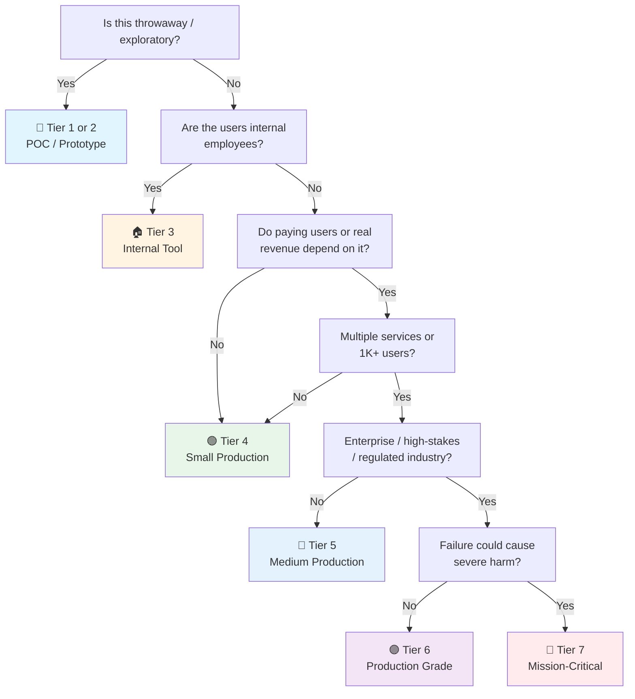

# MongoDB Checklist

> MongoDB companion to the general [[Database]] checklist.
> Covers MongoDB 8.x (current major) — the standard document database.
> Companion to [[PostgreSQL]] and [[Valkey]] for the other engines in the homelab.
> Last updated: 2026-08-07

---

## 1. Setup & Configuration

- [ ] **Version** — MongoDB 8.x (current major). `db.version()` recorded. Upgrade path known.
- [ ] **Deployment type chosen** — Standalone (dev only), Replica Set (minimum for production — transactions require it), or Sharded Cluster (horizontal scale, medium+ only).
- [ ] **Config file** — `mongod.conf` versioned: `storage.dbPath`, `net.port`, `security.authorization: enabled` (never default-open), `replication.replSetName` if replica set.
- [ ] **`mongod` never runs as root** — Dedicated `mongodb` user, restricted dbPath permissions.
- [ ] **Container/Docker notes** — Volume for `/data/db` (never container-local), auth enabled, healthcheck `mongosh --eval "db.runCommand({ping:1})"` → [[Infrastructure]].

## 2. Schema Design & Validation

- [ ] **Document model designed, not dumped** — Embed vs reference decided per relationship:
  - **Embed**: one-to-one, one-to-few, read-together data → fewer round trips
  - **Reference**: one-to-many/many-to-many, large or frequently-changing data
- [ ] **Anti-patterns avoided** — Unbounded arrays (grow forever), massive documents (>16MB limit), deep nesting (>100 levels), embedding data that changes independently.
- [ ] **`$jsonSchema` validators on collections** — MongoDB's primary data quality enforcement. `db.createCollection()` or `collMod` with `validator: { $jsonSchema: { ... } }`. Set `validationLevel` (strict / moderate) and `validationAction` (error / warn). Not optional for any production collection with quality requirements.
- [ ] **Schema versioning** — Documents carry `schemaVersion` field for migrations. Rolling schema evolution (new fields optional, backfill in batches).
- [ ] **`_id` strategy** — Default ObjectId fine for most. Natural keys or UUIDs for distributed/sync scenarios. Shard key must be immutable and high-cardinality (see §6).
- [ ] **Indexes match query patterns** — Every query shape has an index. `explain("executionStats")` culture like `EXPLAIN ANALYZE` in Postgres → [[Database]] §4.
- [ ] **Data types deliberate** — `ISODate` for dates (not strings), `Decimal128` for money (not double), `NumberLong` for big integers.
- [ ] **Time-series collections** — MongoDB 5.0+ `timeseries` collection type for IoT/metrics data. Automatic time-bucket optimization, efficient storage. Use instead of regular collections when `timeField` is the primary access pattern.

## 3. Indexing (MongoDB-Specific)

- [ ] **Single-field indexes** — For equality filters. `db.coll.createIndex({ status: 1 })`.
- [ ] **Compound indexes** — Equality fields first, sort/range last. Leftmost-prefix rule applies (unlike Postgres — Mongo uses ESR: Equality, Sort, Range).
- [ ] **Multikey indexes** — For array fields. One multikey per compound index (limits).
- [ ] **Text indexes** — `{ $text: { $search: ... } }` for full-text. One text index per collection. Not for production search at scale — consider Atlas Search (`$search`) or dedicated search engine.
- [ ] **TTL indexes** — `expireAfterSeconds` for automatic document expiry (sessions, logs, cache, compliance retention). Scheduled deletion without a cron.
- [ ] **Partial / sparse indexes** — `partialFilterExpression` for subsets, `sparse: true` for documents missing the field. Match Postgres partial-index use cases.
- [ ] **Index builds** — `createIndexes` with `background` behavior (builds are non-blocking since 4.2 but still resource-heavy). Rolling builds in sharded clusters.
- [ ] **Index bloat** — `compact` or rebuild indexes on fragmentation. `collStats` `size` vs `storageSize` reviewed.

## 4. Backup & Restore

- [ ] **`mongodump` for logical** — Scheduled for smaller DBs / partial restores. `--gzip --archive` for compressed portable backups.
- [ ] **`mongodump` with oplog** — `--oplog` flag during backup for point-in-time-ish consistency (replica sets).
- [ ] **`mongorestore` tested** — Restore drill quarterly: full restore + validation (`db.collection.validate()`) + app smoke test → [[Database]] §3.
- [ ] **Filesystem snapshot or Atlas/managed backup** — For medium+: consistent snapshots (LVM, EBS) or managed continuous backups.
- [ ] **Backup monitoring** — Backup job failure alerts. "Last successful backup" on dashboards.

## 5. Transactions & Consistency

- [ ] **Multi-document ACID transactions used for atomicity** — Available since 4.0 (replica set) and 4.2 (sharded). For multi-collection writes that must succeed or fail together. Keep transactions short — long transactions hold locks and can abort on conflict.
- [ ] **Write concern deliberate** — `w: "majority"` for durability of important writes. `j: true` for journal acknowledgement. `w: 1` only for low-stakes data. Document per-collection write concern.
- [ ] **Read concern deliberate** — `readConcern: "majority"` where stale reads are unacceptable. `"local"` acceptable for analytics/tolerant read paths. Default is `"local"` — know when you need stronger.
- [ ] **Causal consistency sessions** — `startSession({ causalConsistency: true })` for read-your-writes across replicas. Without this, a read after a write may hit a stale replica. Required for UI flows that immediately re-read after mutation.
- [ ] **Retry on transient errors** — `TransientTransactionError` and `UnknownTransactionCommitResult` retried in application code. Driver-level retry makes transactions robust to elections and failovers.

## 6. Replication & Sharding

- [ ] **Replica Set for production** — 3 members minimum (primary + 2 secondaries), or 3-member with an arbiter for small deployments. Never standalone in production.
- [ ] **Elections & failover** — Heartbeat config reviewed, election timeout understood. Failover drill: `rs.stepDown()` in staging, verify app reconnects.
- [ ] **Sharding only when needed** — Shard key choice matters: high-cardinality, evenly-distributed, matches query patterns. Bad shard key = jumbo chunks + hotshots. Start unsharded; shard when write/scale demands (medium+ tier).
- [ ] **Resharding available (5.0+)** — `reshardCollection` makes shard keys mutable. Use when the original shard key is wrong. Understand the cost: full collection rewrite under the hood. Not a substitute for choosing well the first time.
- [ ] **Balancer monitored** — Chunk migrations tracked; `balancer` window configured. Migrations on hot chunks cause latency spikes.

## 7. Aggregation, Performance & Change Streams

- [ ] **`$lookup` used sparingly** — It's a left outer join; on unsharded collections can be slow. Consider embedding or application-side joins for hot paths.
- [ ] **Aggregation pipeline stage order** — Filter early (`$match` first), project early, limit early. Never `$unwind` before filtering what you can.
- [ ] **`$group` memory** — `allowDiskUse: true` for large groupings; `100MB` memory limit per stage respected.
- [ ] **Cursor discipline** — Batched `batchSize`, `limit` on all queries, no unbounded `find()` returning millions of docs.
- [ ] **`explain` reviewed** — `executionStats` on slow queries: `totalDocsExamined` vs `nReturned` — high ratio = missing/wrong index.
- [ ] **Change streams for CDC / event-driven patterns** — `db.collection.watch()` for real-time CDC, cache invalidation, audit logging, analytics pipelines. Resume tokens for durability. Filter with `$match` pipeline stage to watch only relevant changes. Replaces brittle oplog tailing.

## 8. Connection Management

- [ ] **Connection pool settings deliberate** — Connection string: `maxPoolSize` (default 100), `minPoolSize` (warm connections), `maxIdleTimeMS`, `connectTimeoutMS` (default 30s — often too long), `socketTimeoutMS`. Defaults are not tuned for your workload.
- [ ] **Server-side connection limits** — `net.maxIncomingConnections` (default ~65K, but physical limit is lower). Monitor actual connections vs configured max. Each connection consumes memory.
- [ ] **No connection leaks** — Sessions and cursors closed in `finally`/context managers. Unclosed cursors hold server resources and can exhaust connections.
- [ ] **Read preference set correctly** — `primary` (default, safest), `primaryPreferred`, `secondary` (read scaling, accepts staleness), `secondaryPreferred`, `nearest`. Document per use case — wrong read preference causes stale reads or unnecessary primary load.

## 9. Security (MongoDB)

- [ ] **Authorization enabled** — `security.authorization: enabled` + role-based accounts. App uses a role with least privilege (readWrite on its DB, no clusterAdmin) → [[Security]] §8.
- [ ] **Authentication** — SCRAM-SHA-256 (default) or x.509 / LDAP / Kerberos for enterprise. No plaintext credentials.
- [ ] **TLS enforced** — `net.tls.mode: requireTLS`. `ssl=true` in connection strings. Client certs for service accounts at high tiers.
- [ ] **Network isolation** — Bind to private interface, firewall rules, no internet-exposed mongod. `bindIp` explicit.
- [ ] **Encryption at rest** — MongoDB Enterprise/KMS-managed encryption, or volume-level encryption. Backups encrypted too.
- [ ] **Field-level encryption (FLE)** — For regulated PII: client-side field-level encryption with KMS. The server never sees plaintext → see §10 for privacy details.
- [ ] **Audit log** — `auditLog` enabled for regulated tiers: authentication events, DDL, DML on sensitive collections.

## 10. Privacy & Data Protection

- [ ] **PII fields identified** — Every sensitive field in every collection catalogued (email, phone, national ID, health data, financial data). Document model makes PII spread across nested/embedded fields — audit deeply, not just top-level.
- [ ] **Queryable Encryption (7.0+)** — Server processes equality queries on encrypted fields without decryption. For regulated PII that must be searchable. Equality queries first; range queries in later versions. KMS-managed keys.
- [ ] **CSFLE lifecycle managed** — Client-Side Field-Level Encryption: customer master keys in KMS, data encryption keys per collection, key rotation procedure documented. Application must have key access to read/write — design the key distribution carefully.
- [ ] **Data masking for analytics** — `$redact`, aggregation masking, or dedicated views with masked fields for reporting/analytics copies. Never raw production PII in analytics pipelines.
- [ ] **TTL indexes for compliance retention** — Automatic document expiry for GDPR/PDPA right-to-be-forgotten: set TTL on per-user documents, or track deletion timestamps for batch purge. Document the retention period per data category.
- [ ] **Data subject request procedure** — Can you find and delete a user's data across *all* collections, embedded references, GridFS, and backups? Documented procedure. Test it.

## 11. Data Quality

- [ ] **`$jsonSchema` validators enforced** — `validationLevel: "strict"` for new inserts, `"moderate"` for existing docs. `validationAction: "error"` (reject) for critical data, `"warn"` (log) for migration periods. Review rejected writes.
- [ ] **`collMod` for updating validators** — Add or modify validators on existing collections without recreation. `db.runCommand({ collMod: "coll", validator: {...} })`. Plan for existing invalid documents — they're grandfathered under `"moderate"`.
- [ ] **`db.collection.validate()` scheduled** — Checks for data corruption, index consistency, BSON structure. Run periodically on critical collections. `validate({ full: true })` for deep scan.
- [ ] **Orphaned documents in sharded clusters** — `cleanupOrphaned` run after range deletions. Orphans (documents on wrong shard) cause inconsistent query results. Monitor range deletion queue.
- [ ] **Referential integrity patterns** — No native FK in MongoDB. Use: application-level validation, change-stream reconciliation (watch parent deletes → cascade), or materialized reference patterns. Document the strategy per relationship.
- [ ] **Schema drift monitored** — Track `schemaVersion` distribution across documents. `db.coll.aggregate([{ $group: { _id: "$schemaVersion", count: { $sum: 1 } } }])`. Old versions flagged for backfill.

## 12. Observability (MongoDB)

- [ ] **`db.serverStatus()` metrics** — Opcounters, connections, cache (wiredTiger), page faults, queueing.
- [ ] **Prometheus exporter** — `mongodb_exporter` (percona-mongodb-exporter) or managed: ops/sec, latency, replication lag, cache hit ratio.
- [ ] **Slow query profiling** — `db.setProfilingLevel(1, 100)` or Atlas profiler. Slow queries logged centrally, reviewed weekly.
- [ ] **`currentOp` monitoring** — Long-running operations, lock waits. Alerts on: replication lag > threshold, oplog window shrinking, connections near max.
- [ ] **Capacity trend** — DB size, index size, oplog size trended. Oplog window must cover backup + replica downtime windows.

---

## Quick Sanity Check Before Launch

- [ ] Replica Set configured (3 members), never standalone
- [ ] Authorization enabled, app role least-privilege, no default-open mongod
- [ ] TLS required for connections
- [ ] Every hot query has an index (explain shows low docsExamined/nReturned)
- [ ] Document model reviewed: no unbounded arrays, schemaVersion present
- [ ] `$jsonSchema` validators present on collections with quality requirements
- [ ] Backup scheduled AND restore tested this quarter
- [ ] Write concern majority + journal ack on important writes
- [ ] Transactions used for multi-collection atomicity (if applicable)
- [ ] Connection pool settings deliberate (not driver defaults)
- [ ] Slow query profiling on, metrics exported, alerts armed
- [ ] Shard key (if sharded) immutable, high-cardinality, balanced
- [ ] CSFLE / Queryable Encryption in place for regulated PII

---

## Project Tier Scoping Matrix

> **How to use this table:** Pick your tier first, then focus only on the sections marked ✅ (required) or 🟡 (recommended). Skip ❌ sections entirely — they'd be over-engineering for your context.
>
> **Legend:** ✅ Required · 🟡 Recommended / partial · ❌ Skip

### Tier Descriptions

| # | Tier | Description | Typical Team | Users | Lifespan |
|---|---|---|---|---|---|
| 1 | 🧪 **POC / Spike** | Validate an idea. Standalone mongod is fine. | 1 dev | Internal only | Days–weeks |
| 2 | 🔧 **Prototype / MVP** | Waiting for integration or user validation. Might become real. | 1–2 devs | Beta testers | Weeks–months |
| 3 | 🏠 **Internal Tool** | Real users (employees), real data. No external exposure or paying customers. | 1–3 devs | Employees | Ongoing |
| 4 | 🟢 **Small Production** | Single replica set, low traffic. Real users, maybe early revenue. | 1–2 devs | < 1K users | Ongoing |
| 5 | 🔵 **Medium Production** | Higher traffic or multi-service. Real revenue or user base that matters. | 2–5 devs | 1K–100K users | Ongoing |
| 6 | 🟣 **Production Grade** | Full rigor — high-stakes SaaS, enterprise product, or large user base. | 5+ devs | 100K+ users | Long-term |
| 7 | 🔴 **Mission-Critical / Regulated** | Healthcare (HIPAA), finance (PCI-DSS), safety systems. Failure = severe harm. Adds formal verification, regulatory audit. | 10+ devs | Varies | Decades |

### Which Tier Am I?

### Checklist Applicability by Tier

| # | Section | 🧪 POC | 🔧 Prototype | 🏠 Internal | 🟢 Small Prod | 🔵 Medium Prod | 🟣 Production Grade | 🔴 Mission-Critical |
|---|---|:---:|:---:|:---:|:---:|:---:|:---:|:---:|
| 1 | Setup & Configuration | 🟡 standalone | ✅ + auth | ✅ | ✅ | ✅ | ✅ + full tuning | ✅ + formal |
| 2 | Schema Design & Validation | 🟡 minimal | ✅ | ✅ | ✅ + $jsonSchema | ✅ + schema versioning | ✅ + review | ✅ + formal |
| 3 | Indexing | ❌ PK only | 🟡 hot queries | ✅ + explain | ✅ + compound | ✅ + partial/TTL | ✅ + bloat mgmt | ✅ + capacity plan |
| 4 | Backup & Restore | ❌ | 🟡 mongodump | ✅ + scheduled | ✅ + restore tested | ✅ + snapshots | ✅ + continuous | ✅ + regulatory |
| 5 | Transactions & Consistency | ❌ | ❌ | 🟡 write concern | ✅ + read concern | ✅ + causal consistency | ✅ + retry logic | ✅ + formal |
| 6 | Replication & Sharding | ❌ | ❌ | 🟡 replica set | ✅ + 3 members | ✅ + failover tested | ✅ + shard analysis | ✅ + multi-region |
| 7 | Aggregation & Change Streams | ❌ | 🟡 basic | ✅ + explain | ✅ + profiling | ✅ + pipeline review | ✅ + change streams | ✅ + formal |
| 8 | Connection Management | ❌ | 🟡 defaults | ✅ + pool sized | ✅ + monitored | ✅ + read preference | ✅ + tuned | ✅ + formal |
| 9 | Security | 🟡 local only | 🟡 auth on | ✅ + least priv | ✅ + TLS | ✅ + FLE if PII | ✅ + audit log | ✅ + regulatory |
| 10 | Privacy & Data Protection | ❌ | ❌ | 🟡 PII inventory | ✅ + masking | ✅ + retention TTL | ✅ + Queryable Encryption | ✅ + DSR automation |
| 11 | Data Quality | ❌ | 🟡 $jsonSchema | ✅ + collMod | ✅ + validate() | ✅ + drift monitoring | ✅ + orphan checks | ✅ + formal SLAs |
| 12 | Observability | ❌ | ❌ | 🟡 basic | ✅ + slow query log | ✅ + dashboards | ✅ + oplog watch | ✅ + full stack |

---

## Sources

- Complements [[Database]] (general), [[Release]] (migration gates), [[Security]] (data protection).
- MongoDB 8 docs — https://www.mongodb.com/docs/manual/
- Schema design patterns — https://www.mongodb.com/docs/manual/data-modeling/
- Queryable Encryption — https://www.mongodb.com/docs/manual/core/queryable-encryption/
- Change Streams — https://www.mongodb.com/docs/manual/changeStreams/
