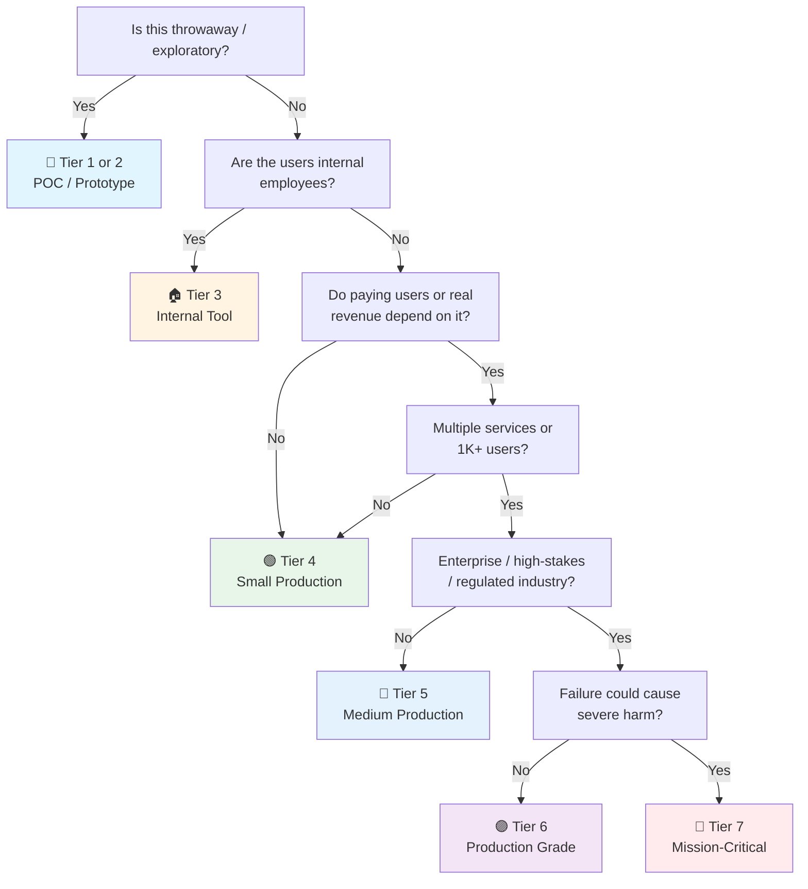

# PostgreSQL Checklist

> PostgreSQL companion to the general [[Database]] checklist.
> Covers PostgreSQL 18 (current major, Nov 2025) — the standard open-source relational engine.
> Companion to [[MongoDB]] and [[Valkey]] for the other engines in the homelab.
> Last updated: 2026-08-07

---

## 1. Setup & Configuration

- [ ] **Version** — PostgreSQL 18 (or current LTS-ish major). `SELECT version();` recorded. Upgrade path known before you need it.
- [ ] **Config tuned** — `shared_buffers` (25% of RAM typical), `work_mem`, `effective_cache_size`, `max_connections` deliberate. Defaults are for laptops → [[Database]] §5.
- [ ] **`hba.conf` locked down** — `pg_hba.conf`: scram-sha-256 auth, no `trust` for anything reachable, restricted source IPs.
- [ ] **`postgresql.conf` review** — `listen_addresses` bound to the right interface, `max_wal_size`/`checkpoint_completion_target` sane, logging configured (see §8).
- [ ] **Extensions pinned** — `CREATE EXTENSION` list documented with versions (pgvector, postgis, uuid-ossp, pg_stat_statements as needed). Extension upgrades tested.
- [ ] **Container/Docker notes** — Volume for `/var/lib/postgresql/data` (never container-local), `POSTGRES_PASSWORD` from env/vault, healthcheck `pg_isready` → [[Infrastructure]].
- [ ] **Major version upgrade path known** — `pg_upgrade --link` (in-place, fast) or logical replication (zero-downtime, cross-version). Extension compatibility checked before upgrade (`pg_extension` → upstream version matrix). Practice in staging — a botched major upgrade is the #1 cause of extended PG downtime.

## 2. Schema & DDL

- [ ] **Migrations via Alembic/Flyway** — Versioned, ordered, reviewed. No `CREATE TABLE IF NOT EXISTS` hacks as "migrations" → [[Database]] §2.
- [ ] **`timestamptz` for all timestamps** — Never `timestamp without time zone` unless the app is single-TZ and you've documented why.
- [ ] **UUIDs vs bigint decided** — `gen_random_uuid()` for distributed/multi-writer; `bigint GENERATED ALWAYS AS IDENTITY` for single-writer. `SERIAL` is legacy.
- [ ] **Enums vs lookup tables** — Native `CREATE TYPE ... AS ENUM` for stable small sets (ALTER TYPE ADD VALUE is transactional-safe since PG12). Lookup tables when values grow or carry metadata.
- [ ] **Generated columns** — `GENERATED ALWAYS AS (...)` for derived data (e.g. `price * quantity`). Never store what you can compute — unless it's a hot path.
- [ ] **Partitioning for large tables** — Native `PARTITION BY RANGE/HASH` when tables exceed ~100GB or queries always filter by the partition key. Partition pruning verified with EXPLAIN. Use `pg_partman` for automated time-partition management (auto-create future partitions, auto-detach old ones).
- [ ] **`pgvector` for AI workloads** — If RAG/embeddings: `vector(1536)` columns + HNSW (recall-tunable via `hnsw_ef_search`, preferred for most cases) or IVFFlat (simpler, less memory, needs `lists` tuning). Benchmark both on your data. See [[AI]] checklist for the application side.
- [ ] **SQL/JSON for structured JSONB** — `JSON_TABLE`, `jsonb_path_query` (SQL/JSON path) for querying nested JSONB. Don't hand-roll `->>` chains for complex extraction — the path engine is faster and more maintainable.

## 3. Indexing (PostgreSQL-Specific)

- [ ] **B-tree defaults verified** — Default index type. Works for equality + range. Composite order: equality → range → sort.
- [ ] **`EXPLAIN ANALYZE` culture** — Every slow query gets explained. Look for: Seq Scan on large tables, Nested Loop on hot paths, missing index hints (pg_hint_plan in dev).
- [ ] **Partial indexes** — `WHERE` clause on the index for hot subsets (e.g. `WHERE status = 'active'` on 5% of rows). Big win for skewed data.
- [ ] **Expression indexes** — `LOWER(email)`, `(data->>'field')` for JSONB hot paths. Must match the query expression exactly.
- [ ] **JSONB with GIN** — `GIN` index for JSONB containment (`@>`) and array operators. B-tree won't help JSONB.
- [ ] **`pg_stat_statements` enabled** — The #1 tool: normalized query stats, identify top-by-total-time queries, track down N+1 and repeated queries.
- [ ] **Index bloat** — `pgstattuple`/`pg_repack`/`pg_squeeze` for online rebuilds without exclusive locks. Scheduled `REINDEX CONCURRENTLY` as alternative. `autovacuum` tuning checked.
- [ ] **`lock_timeout` set** — Alongside `statement_timeout`. `lock_timeout` prevents a query from waiting too long to acquire a lock, stopping cascading blocking. Essential for high-concurrency OLTP.

## 4. Vacuum & Maintenance

- [ ] **Autovacuum running and tuned** — `autovacuum_vacuum_scale_factor`, `autovacuum_analyze_scale_factor` tuned for table size (defaults cause huge tables to vacuum rarely). Check `pg_stat_all_tables` for overdue vacuum.
- [ ] **`vacuum` debt monitored** — `n_dead_tup` vs `n_live_tup` per table. Dead tuple explosion = bloat + index bloat + frozen XID risk.
- [ ] **XID wraparound watch** — `datfrozenxid` age monitored. Emergency vacuum at 70% of 2^31. This takes the DB down if ignored.
- [ ] **`ANALYZE` up to date** — Stats drive the planner. `autoanalyze` on, or scheduled `ANALYZE` after bulk loads.
- [ ] **Bulk load pattern** — `COPY` over INSERT loops, drop indexes before mass load + recreate after, `synchronous_commit = off` only for non-durable bulk.

## 5. Backup & Point-in-Time Recovery

- [ ] **`pg_dump` for logical** — Schema + data dumps scheduled for smaller DBs / partial restores. `pg_dump -Fc` (custom format) for compressible portable backups.
- [ ] **`pg_basebackup` + WAL archiving for PITR** — Physical base backup + continuous `archive_command`/`pgBackRest`/`barman` WAL shipping → restore to any point in time.
- [ ] **pgBackRest or barman considered** — For medium+ tiers, dedicated backup tools beat hand-rolled scripts: retention, verification, parallelism.
- [ ] **Restore tested** — Quarterly restore drill: full restore + `pg_controldata` + consistency checks + app smoke test → [[Database]] §3.
- [ ] **`pg_verifybackup`** — Verify base backups after creation (PG13+). Cheap insurance against silently corrupt backups.

## 6. Replication & HA

- [ ] **Streaming replication** — Primary + hot standby (synchronous_commit = remote_apply for zero-loss if needed). `pg_basebackup` to bootstrap the replica.
- [ ] **Replication slots monitored** — `pg_replication_slots`: lag + `restart_lsn` vs current WAL. A stalled slot grows WAL forever (disk full).
- [ ] **Logical replication for CDC / migration** — Publications/subscriptions (`CREATE PUBLICATION` / `CREATE SUBSCRIPTION`) for: cross-version migration (zero-downtime upgrades), selective table replication, CDC to data warehouse. No DDL, no sequences replicated — handle separately. Know the limitations before relying on it.
- [ ] **Failover solution chosen** — Patroni (self-managed, standard), repmgr, or managed (Cloud SQL/RDS/Aurora). Automatic failover with quorum; never manual-only for medium+.
- [ ] **Read scaling** — Replica for read-only traffic; app routes reads appropriately (read-your-writes handled). Connection pooling per replica.
- [ ] **Failover drill** — Kill primary in staging, verify promotion, verify app reconnect, verify no data loss (or documented acceptable loss).

## 7. Connection Pooling

- [ ] **PgBouncer or managed pool** — PostgreSQL's per-connection process model makes pooling mandatory at scale. Transaction-mode pooling for most apps (session-mode only when session state needed).
- [ ] **Pool sizing** — `max_connections` + PgBouncer `default_pool_size`: (cores × 2) + spare per app instance. Too many connections = context-switch thrash.
- [ ] **`statement_timeout` set** — Server-side safety net (`statement_timeout = '30s'` typical, tune per workload). Kills runaway queries before they pile up.
- [ ] **`idle_in_transaction_session_timeout`** — Prevents abandoned transactions holding locks forever. Production must-have.

## 8. Observability (PostgreSQL)

- [ ] **`pg_stat_statements` on** — Top queries by total time / calls / rows. The first dashboard panel.
- [ ] **`pg_stat_activity` monitoring** — Active queries, long-running transactions, blocked sessions (`pg_locks` joins). Alerts on: long-running query > threshold, lock waits.
- [ ] **Metrics to Prometheus** — `postgres_exporter` (or managed): connections, cache hit ratio, WAL size, replication lag, dead tuples, bloat.
- [ ] **Slow query log** — `log_min_duration_statement = 100` + central log shipping. Reviewed weekly at minimum.
- [ ] **Capacity trend** — Disk, WAL growth, table growth trended quarterly. `pg_database_size()`/`pg_total_relation_size()` snapshots.

## 9. Security (PostgreSQL)

- [ ] **Roles least-privilege** — App role has only needed grants (SELECT/INSERT/UPDATE/DELETE on its schema, no DDL). Read-only reporting role. No app using `postgres` superuser → [[Security]] §8.
- [ ] **TLS enforced** — `ssl = on`, `ssl_min_protocol_version = 'TLSv1.2'`, `hostssl` entries in `pg_hba.conf`. `sslmode=require` in app connection strings.
- [ ] **`pgAudit` for audit trails** — Regulated tiers: `pgaudit` extension logging DDL/DML per role. Logs shipped centrally.
- [ ] **Row-level security (RLS)** — Multi-tenant: `CREATE POLICY` + `SET row_security` — the database enforces tenant isolation, not just the app.
- [ ] **Secrets via vault/env** — Connection strings from env/KMS, never config files in git → [[Security]] §4.

## 10. Privacy & Data Protection

- [ ] **PII columns identified** — Every sensitive column catalogued (email, phone, national ID, health data). `SECURITY LABEL` or comment annotation for classification. Drives access control and masking decisions.
- [ ] **Row-Level Security for PII isolation** — `CREATE POLICY` restricting rows by role/tenant. Users see only their own data even with table-level SELECT. The DB enforces — not the application alone.
- [ ] **Column-level encryption** — `pgcrypto` for sensitive-at-rest columns (`pgp_sym_encrypt`/`pgp_sym_decrypt`). Key management external (KMS/vault), never inline in SQL. Decrypt only in application code with controlled access.
- [ ] **Dynamic data masking** — `postgresql_anonymizer` extension or view-based masking for analytics/reporting copies. Real data stays in base tables; reporting users see masked views. No raw PII in dev/test.
- [ ] **Retention via partitioning** — `DETACH PARTITION` + archive/drop old data. Time-based partitions make compliance retention (GDPR/PDPA "delete after N years") a metadata operation, not a row-by-row `DELETE`.

## 11. Data Quality

- [ ] **CHECK constraints with business rules** — Complex predicates (regex, range checks, conditional logic). `CHECK (price > 0)`, `CHECK (email ~ '^[^@]+@[^@]+$')`. The DB is the last line of defense — application validation alone is insufficient.
- [ ] **Exclusion constraints** — `EXCLUDE USING` prevents overlapping ranges. Booking/schedule conflicts enforced at the DB level, not application-level queries. `EXCLUDE USING gist (daterange(start, "end") WITH &&)`.
- [ ] **Domain types for reusable validation** — `CREATE DOMAIN email_type AS text CHECK (...)`. Apply across tables for consistent validation. Change the domain, change every column.
- [ ] **Validation triggers for cross-table rules** — Business rules the DB can't express declaratively (conditional FK, derived state checks). Trigger + function with `RAISE EXCEPTION` on violation. Documented, tested, not hidden.
- [ ] **Generated columns verified** — `GENERATED ALWAYS AS (...)` columns match the derivation logic. Test that changing inputs updates the generated value. No manual writes to generated columns (impossible by design, but verify the constraint is enforced).
- [ ] **JSONB schema validation** — Application-level JSON Schema validation or CHECK constraints on JSONB structure (`jsonb_typeof`, `?` operator). Complex nested validation: SQL/JSON path predicates in CHECK.

---

## Quick Sanity Check Before Launch

- [ ] `pg_stat_statements` enabled and top queries reviewed
- [ ] `EXPLAIN ANALYZE` done on all hot queries — no Seq Scan on large tables
- [ ] Autovacuum healthy: no table overdue, XID age < 70%
- [ ] Backup runs nightly AND restore tested this quarter
- [ ] Replication lag (if replica) < threshold, slots not stalled
- [ ] PgBouncer sized, `statement_timeout` + `lock_timeout` + `idle_in_transaction_session_timeout` set
- [ ] `pg_hba.conf`: scram auth, no trust, restricted sources
- [ ] TLS enforced, app role least-privilege
- [ ] Slow query log on, disk/WAL growth trend recorded
- [ ] PII columns identified — RLS or masking in place for sensitive data
- [ ] CHECK constraints and exclusion constraints present on business-critical tables
- [ ] Logical replication (if used) tables identified, lag monitored

---

## Project Tier Scoping Matrix

> **How to use this table:** Pick your tier first, then focus only on the sections marked ✅ (required) or 🟡 (recommended). Skip ❌ sections entirely — they'd be over-engineering for your context.
>
> **Legend:** ✅ Required · 🟡 Recommended / partial · ❌ Skip

### Tier Descriptions

| # | Tier | Description | Typical Team | Users | Lifespan |
|---|---|---|---|---|---|
| 1 | 🧪 **POC / Spike** | Validate an idea. Docker Postgres is fine. | 1 dev | Internal only | Days–weeks |
| 2 | 🔧 **Prototype / MVP** | Waiting for integration or user validation. Might become real. | 1–2 devs | Beta testers | Weeks–months |
| 3 | 🏠 **Internal Tool** | Real users (employees), real data. No external exposure or paying customers. | 1–3 devs | Employees | Ongoing |
| 4 | 🟢 **Small Production** | Single instance, low traffic. Real users, maybe early revenue. | 1–2 devs | < 1K users | Ongoing |
| 5 | 🔵 **Medium Production** | Higher traffic or multi-service. Real revenue or user base that matters. | 2–5 devs | 1K–100K users | Ongoing |
| 6 | 🟣 **Production Grade** | Full rigor — high-stakes SaaS, enterprise product, or large user base. | 5+ devs | 100K+ users | Long-term |
| 7 | 🔴 **Mission-Critical / Regulated** | Healthcare (HIPAA), finance (PCI-DSS), safety systems. Failure = severe harm. Adds formal verification, regulatory audit. | 10+ devs | Varies | Decades |

### Which Tier Am I?

### Checklist Applicability by Tier

| # | Section | 🧪 POC | 🔧 Prototype | 🏠 Internal | 🟢 Small Prod | 🔵 Medium Prod | 🟣 Production Grade | 🔴 Mission-Critical |
|---|---|:---:|:---:|:---:|:---:|:---:|:---:|:---:|
| 1 | Setup & Configuration | 🟡 defaults | ✅ + tuned basics | ✅ | ✅ | ✅ | ✅ + upgrade path | ✅ + formal |
| 2 | Schema & DDL | 🟡 minimal | ✅ | ✅ | ✅ | ✅ + partitioning | ✅ + pgvector | ✅ + formal review |
| 3 | Indexing | ❌ PK only | 🟡 hot queries | ✅ + EXPLAIN | ✅ + stat_statements | ✅ + partial/expr | ✅ + bloat mgmt + lock_timeout | ✅ + capacity plan |
| 4 | Vacuum & Maintenance | ❌ | ❌ | 🟡 autovacuum on | ✅ + monitored | ✅ + bloat control | ✅ + XID watch | ✅ + formal |
| 5 | Backup & PITR | ❌ | 🟡 pg_dump | ✅ + scheduled | ✅ + restore tested | ✅ + PITR | ✅ + pgBackRest/barman | ✅ + regulatory |
| 6 | Replication & HA | ❌ | ❌ | 🟡 if needed | 🟡 replica optional | ✅ + failover tested | ✅ + logical repl + Patroni | ✅ + multi-region |
| 7 | Connection Pooling | ❌ | ❌ | 🟡 if needed | ✅ + PgBouncer | ✅ + sized | ✅ + timeouts | ✅ + formal |
| 8 | Observability | ❌ | ❌ | 🟡 basic | ✅ + slow query log | ✅ + dashboards | ✅ + capacity trend | ✅ + full stack |
| 9 | Security | 🟡 local only | 🟡 app user | ✅ + least priv | ✅ + TLS | ✅ + RLS + audit | ✅ + pgAudit | ✅ + regulatory |
| 10 | Privacy & Data Protection | ❌ | ❌ | 🟡 PII inventory | ✅ + RLS for PII | ✅ + masking | ✅ + pgcrypto + anonymizer | ✅ + DSR automation |
| 11 | Data Quality | ❌ | 🟡 CHECK constraints | ✅ + FK checks | ✅ + exclusion constraints | ✅ + domain types | ✅ + validation triggers | ✅ + formal SLAs |

---

## Sources

- Complements [[Database]] (general), [[Release]] (migration gates), [[Security]] (data protection).
- PostgreSQL 18 docs — https://www.postgresql.org/docs/current/
- pgBackRest — https://pgbackrest.org/ · Patroni — https://patroni.readthedocs.io/
- pg_partman — https://github.com/pgpartman/pg_partman
- PostgreSQL Anonymizer — https://postgresql-anonymizer.readthedocs.io/
- pgvector — https://github.com/pgvector/pgvector
