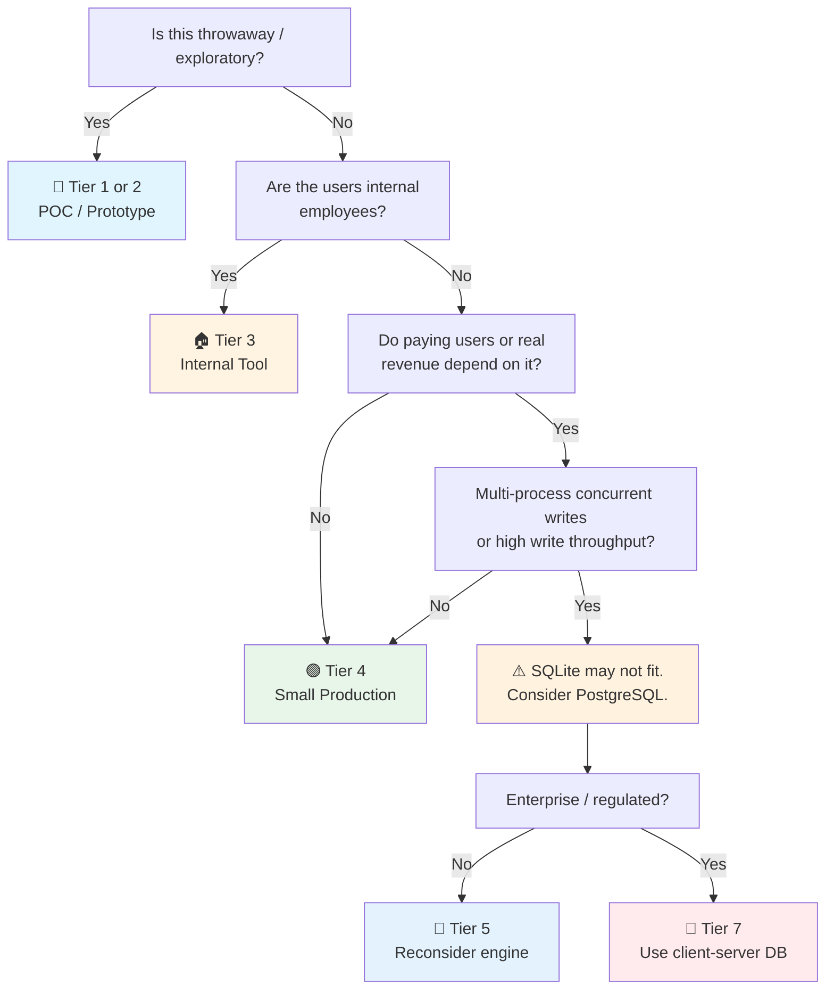

# SQLite Checklist

> Embedded database companion to the general [[Database]] checklist.
> Covers SQLite 3.x (current) — the standard embedded relational database.
> Runs in-process: no server, no network, no DBA. The most widely deployed database in the world.
> Companion to [[PostgreSQL]] (client-server relational), [[MongoDB]], and [[Valkey]] for the other engines in the homelab.
> Last updated: 2026-08-07

---

## 1. Deployment Model & When to Use SQLite

- [ ] **Use case fits SQLite's model** — SQLite is ideal for:
  - Application file format (every app opens a `.db` file)
  - Mobile / edge / IoT (no server process)
  - Embedded systems (kiosks, routers, set-top boxes)
  - Development/testing (fast, zero-config, ephemeral)
  - Single-server internal tools (no concurrent multi-process writes)
  - Read-heavy caches or catalogs (concurrent reads are unlimited)
- [ ] **Use case does NOT fit SQLite** — Avoid when:
  - High-volume concurrent writes from multiple processes/clients
  - Client-server model needed (remote clients connecting over network)
  - Data exceeds available disk on a single machine
  - Multi-writer throughput > ~100 writes/sec sustained
  - You need fine-grained access control (SQLite has no users/roles)
- [ ] **"Serverless" understood** — SQLite is a library linked into the application process. The `.db` file IS the database. There is no server to start, stop, or tune. This is a feature, not a limitation — unless you need multi-client writes.
- [ ] **Distribution model documented** — One `.db` file per app instance? Shared file on NFS? Replicated via app-level sync? The deployment model must be explicit because SQLite offers none of these itself.

## 2. Concurrency & WAL Mode

- [ ] **WAL mode enabled** — `PRAGMA journal_mode = WAL;`. Write-Ahead Logging is the single most important SQLite configuration. Benefits: readers don't block writers, writers don't block readers, crash recovery is robust. Default (`rollback journal`) allows only one writer and blocks all readers during writes. WAL is mandatory for any production use.
- [ ] **Single-writer model understood** — Even in WAL mode, SQLite allows only **one concurrent writer**. Other write transactions wait. This is the fundamental constraint. Design your write patterns: batch writes, short transactions, `BEGIN IMMEDIATE` for write transactions to acquire the write lock early (avoids upgrade deadlock).
- [ ] **`busy_timeout` set** — `PRAGMA busy_timeout = 5000;` (5 seconds). When a writer is blocked by another writer, SQLite waits up to N ms before returning `SQLITE_BUSY`. Without this, concurrent writes fail immediately with `SQLITE_BUSY` errors. 5–10 seconds is a sane default for most apps.
- [ ] **Read concurrency unlimited** — In WAL mode, unlimited concurrent readers. Multiple processes/threads can read simultaneously without blocking each other or the writer. This is why SQLite is excellent for read-heavy workloads.
- [ ] **Multi-process writes avoided or managed** — Multiple processes writing to the same `.db` file: possible with WAL + `busy_timeout`, but throughput is limited by the single-writer lock. For multi-process write scenarios: use a write queue in the application, or switch to a client-server database.
- [ ] **`BEGIN IMMEDIATE` vs `BEGIN DEFERRED`** — `BEGIN DEFERRED` (default) acquires locks lazily — a read transaction can upgrade to a write transaction mid-flight, causing `SQLITE_BUSY` on lock upgrade. `BEGIN IMMEDIATE` acquires the write lock at `BEGIN` — fails fast if locked, avoids mid-transaction deadlocks. Use `IMMEDIATE` when the transaction will write.

## 3. Configuration & PRAGMAs

- [ ] **`synchronous` tuned** — `PRAGMA synchronous = NORMAL;` (WAL mode default recommendation). `FULL` (default) fsyncs on every commit — safest, slowest. `NORMAL` fsyncs at WAL checkpoint — fast and safe enough for most uses (data loss only on OS crash between checkpoints, not on app crash). `OFF` — no fsync, fastest, **data corruption on power loss** (never in production).
- [ ] **`cache_size` set** — `PRAGMA cache_size = -65536;` (64 MB, negative = KB). Default is ~2 MB — too small for production. Increase to use available RAM for the page cache. Monitor with `PRAGMA cache_status;`.
- [ ] **`temp_store = MEMORY`** — `PRAGMA temp_store = 2;` (2 = memory). Temporary tables and intermediate results in RAM, not on disk. Speeds up complex queries and aggregations.
- [ ] **`mmap_size` set** — `PRAGMA mmap_size = 268435456;` (256 MB). Memory-maps the database file for reads, bypassing the page cache for large scans. Dramatically faster for read-heavy workloads on large databases. Set to 0 to disable (default).
- [ ] **`foreign_keys` ON** — `PRAGMA foreign_keys = ON;` — **off by default** (historical compatibility). Without this, FK constraints are not enforced. Set per-connection. This is the most commonly missed SQLite configuration.
- [ ] **`wal_autocheckpoint` tuned** — `PRAGMA wal_autocheckpoint = 1000;` (default: checkpoint every 1000 pages of WAL). When WAL grows beyond this, a checkpoint runs automatically. For write-heavy workloads, increase to reduce checkpoint frequency (checkpoints briefly block). For low-write, default is fine.
- [ ] **`PRAGMA` persistence understood** — Most PRAGMAs are per-connection (must be set every time a connection opens). `journal_mode` and `auto_vacuum` persist in the database file. Set per-connection PRAGMAs in a connection initialization function.

## 4. Schema & Data Types

- [ ] **Flexible typing understood** — SQLite uses **dynamic typing** (type affinity, not strict types). A column declared `INTEGER` can store text — SQLite will try to convert, but won't reject. For strict typing, use `STRICT` tables (SQLite 3.37+): `CREATE TABLE ... STRICT;` enforces declared types. Know which mode your tables use.
- [ ] **No native date type** — SQLite has no `DATE`/`TIMESTAMP` type. Store dates as: ISO-8601 strings (`'2026-08-07T12:00:00Z'`, sortable, human-readable), Unix epoch integers (`1723024800`, compact, fast comparison), or Julian day (for astronomical calculations). Choose one and be consistent.
- [ ] **`WITHOUT ROWID` for specific patterns** — `CREATE TABLE ... WITHOUT ROWID` removes the implicit `rowid` column. Tables are stored as a clustered index on the primary key. Use for: key-value tables (natural PK), tables where the PK is the access pattern. Saves space and improves lookup speed — but loses `rowid`-based operations.
- [ ] **Generated columns** — `GENERATED ALWAYS AS (...) STORED` / `VIRTUAL`. Same as PostgreSQL — compute derived values. `STORED` takes disk space but can be indexed; `VIRTUAL` is computed on read.
- [ ] **FTS5 for full-text search** — `CREATE VIRTUAL TABLE ... USING fts5(content, tokenize = 'porter')`. Trigram tokenizer for CJK/Thai text (`tokenize = 'trigram'`). Lightweight built-in full-text search — no separate search engine needed for small-to-medium datasets.
- [ ] **JSON1 for semi-structured data** — `json_extract()`, `json_each()`, `->`, `->>` operators. Store JSON in a `TEXT` column and query with JSON functions. Good for flexible schemas without a document database.

## 5. Backup & Recovery

- [ ] **Online backup API** — `sqlite3_backup_*()` (C API) or `.backup` CLI command. Copies the database while it's in use (readers/writers continue). The safe way to back up a live database — do NOT copy the `.db` file directly if writes are active (may catch a mid-write state).
- [ ] **`.backup` for CLI / scripts** — `sqlite3 mydb.db ".backup /path/to/backup.db"`. Creates a consistent snapshot. Schedule via cron. Verify backup with `PRAGMA integrity_check` on the backup file.
- [ ] **WAL checkpoint before backup** — `PRAGMA wal_checkpoint(TRUNCATE);` before file-copy backups ensures all WAL data is flushed to the main `.db` file. Otherwise a file copy misses data in the WAL.
- [ ] **`PRAGMA integrity_check`** — Run periodically (weekly for production): `PRAGMA integrity_check;` returns `ok` or a list of problems. Catches corruption from disk errors, OS bugs, or (most commonly) unsafe PRAGMA settings.
- [ ] **Restore tested** — Restore from backup: copy backup file, open with app, run smoke test → [[Database]] §3. Trivial for SQLite — it's just a file copy. But verify integrity after restore.
- [ ] **Disaster recovery plan** — The `.db` file is a single point of failure. If the disk dies, you lose everything unless backed up off-site. Replicate backups to S3 / cloud / another machine. A `.db` file on one disk with no backup is a data-loss incident waiting to happen.

## 6. Performance & Indexing

- [ ] **Indexes on hot queries** — Same principle as Postgres: index WHERE, JOIN, ORDER BY columns. `EXPLAIN QUERY PLAN` to verify index usage. SQLite's query planner is good but simpler than Postgres — help it with good indexes.
- [ ] **`EXPLAIN QUERY PLAN`** — `EXPLAIN QUERY PLAN SELECT ...`. Look for `SEARCH` (index used) vs `SCAN` (full table scan). SQLite doesn't have `EXPLAIN ANALYZE` — the plan shows the intended strategy, not actual execution stats.
- [ ] **Partial indexes** — `CREATE INDEX ... WHERE status = 'active'` — supported and effective for skewed data. Same as Postgres partial indexes.
- [ ] **`ANALYZE` after bulk load** — `ANALYZE;` collects statistics for the query planner. Run after large data loads or schema changes. Stale stats = bad query plans.
- [ ] **Page size matches workload** — `PRAGMA page_size` (default 4096). Larger pages (8192, 16384) for larger databases improve I/O throughput; smaller pages for smaller databases. Must be set before data is inserted (or via VACUUM).

## 7. Application Integration

- [ ] **Connection / statement lifecycle** — Prepare statements once, reuse with parameter binding (`?` / `:name`). Re-preparing statements per call is expensive. Use a statement cache / prepared-statement pool in the application.
- [ ] **Transactions always** — Never do individual INSERTs without a transaction. `BEGIN; INSERT ...; INSERT ...; COMMIT;` is 10–100x faster than auto-commit mode. Batch writes in transactions of 100–10,000 rows.
- [ ] **Parameterized queries** — Use `?` placeholders, never string concatenation. Prevents SQL injection. All SQLite drivers support parameter binding.
- [ ] **Single connection vs connection pool** — Single connection (serialized) for most SQLite apps — the database is in-process, so connection overhead is minimal. For multi-threaded apps: one connection per thread, or a pool with `busy_timeout`. Do NOT share a connection across threads without locking.

## 8. Testing & Development

- [ ] **In-memory database for tests** — `sqlite3::open(':memory:')` — ephemeral, no file I/O, fastest possible tests. Schema is created per-test. Ideal for unit tests. No cleanup needed.
- [ ] **`:memory:` vs file-based for integration tests** — `:memory:` for pure unit tests. File-based (temp dir) for tests that need to survive a connection close/reopen or test backup logic.
- [ ] **Migration testing** — Apply migrations from scratch on a `:memory:` DB in CI. Catches ordering and default-value issues. Same as the client-server DB CI pattern → [[Database]] §2.
- [ ] **Test data from production scrubbed** — Never copy production `.db` file into test environments if it contains PII. Use synthetic data or anonymize via script. A `.db` file is trivially copyable — make sure copies don't leak.

## 9. Security

- [ ] **SQL injection prevention** — Parameterized queries everywhere, no exceptions. SQLite's attack surface is the application layer — there are no network ports to attack, no users to brute-force.
- [ ] **File permissions** — `.db` file permissions restricted. The database file contains all data in plaintext (unless encrypted — see below). OS file permissions are the primary access control.
- [ ] **SEE / SQLCipher for encryption** — SQLite Encryption Extension (SEE, commercial) or SQLCipher (open-source) for encryption at rest. Full-file AES-256 encryption. Required if the `.db` file may leave a controlled environment (laptop, mobile, edge device). Without encryption, anyone with the file has all the data.
- [ ] **WAL file security** — The `-wal` and `-shm` files contain recent uncommitted/committed data. They must have the same permissions as the main `.db` file. Encrypt them too (SQLCipher/SEE handle this automatically).
- [ ] **No secrets in the database** — Don't store API keys, passwords, or tokens in the `.db` file. Use the OS keychain / keystore for secrets. The database is not a vault.

---

## Quick Sanity Check Before Launch

- [ ] WAL mode enabled (`PRAGMA journal_mode = WAL`)
- [ ] `busy_timeout` set (5000+ ms)
- [ ] `synchronous = NORMAL` (not FULL unless data-loss-intolerant)
- [ ] `foreign_keys = ON` (every connection)
- [ ] `cache_size` increased from default
- [ ] All writes in transactions (no auto-commit)
- [ ] `BEGIN IMMEDIATE` for write transactions
- [ ] Indexes on hot queries (`EXPLAIN QUERY PLAN` shows `SEARCH`, not `SCAN`)
- [ ] Backup via `.backup` command or online backup API, tested
- [ ] `PRAGMA integrity_check` scheduled periodically
- [ ] File permissions restricted; SQLCipher/SEE if file may leave controlled environment
- [ ] Deployment model documented (single-instance? replicated? app file format?)

---

## Project Tier Scoping Matrix

> **How to use this table:** Pick your tier first, then focus only on the sections marked ✅ (required) or 🟡 (recommended). Skip ❌ sections entirely — they'd be over-engineering for your context.
>
> **Legend:** ✅ Required · 🟡 Recommended / partial · ❌ Skip

### Tier Descriptions

| # | Tier | Description | Typical Team | Users | Lifespan |
|---|---|---|---|---|---|
| 1 | 🧪 **POC / Spike** | Validate an idea. `:memory:` or file. | 1 dev | Internal only | Days–weeks |
| 2 | 🔧 **Prototype / MVP** | Mobile / edge / desktop app prototype. | 1–2 devs | Beta testers | Weeks–months |
| 3 | 🏠 **Internal Tool** | Single-server internal app. Read-heavy or low-write. | 1–3 devs | Employees | Ongoing |
| 4 | 🟢 **Small Production** | Single-server production app with real users. | 1–2 devs | < 1K users | Ongoing |
| 5 | 🔵 **Medium Production** | Multi-process writes or higher load — **consider migrating to client-server DB**. | 2–5 devs | 1K–100K users | Ongoing |
| 6 | 🟣 **Production Grade** | **Typically not SQLite territory** — edge cases only (embedded, edge computing). | 5+ devs | 100K+ users | Long-term |
| 7 | 🔴 **Mission-Critical / Regulated** | **Not SQLite territory** — regulated data requires audit, RBAC, client-server. | — | — | — |

> **⚠️ SQLite tiering note:** SQLite excels at Tiers 1–4 and struggles at Tiers 5+. If you're at Tier 5+ and still on SQLite, the checklist action item is: **evaluate migrating to [[PostgreSQL]] or another client-server database**. SQLite's single-writer model is a hard scalability ceiling.

### Which Tier Am I?

### Checklist Applicability by Tier

| # | Section | 🧪 POC | 🔧 Prototype | 🏠 Internal | 🟢 Small Prod | 🔵 Medium Prod | 🟣 Edge Cases | 🔴 Not Applicable |
|---|---|:---:|:---:|:---:|:---:|:---:|:---:|:---:|
| 1 | Deployment Model | ✅ :memory: | ✅ file | ✅ | ✅ + documented | ✅ + write-load analysis | 🟡 embedded only | ❌ |
| 2 | Concurrency & WAL | 🟡 WAL on | ✅ WAL + busy_timeout | ✅ + IMMEDIATE | ✅ + write-pattern review | ✅ + queue/batch | 🟡 | ❌ |
| 3 | Configuration & PRAGMAs | 🟡 basic | ✅ + cache_size | ✅ + mmap | ✅ + synchronous + foreign_keys | ✅ + all PRAGMAs | ✅ + tuned | ❌ |
| 4 | Schema & Data Types | 🟡 minimal | ✅ | ✅ + STRICT | ✅ + FTS5/JSON1 | ✅ + WITHOUT ROWID | ✅ + formal review | ❌ |
| 5 | Backup & Recovery | ❌ | 🟡 .backup | ✅ + scheduled | ✅ + integrity_check | ✅ + off-site backup | ✅ + tested | ❌ |
| 6 | Performance & Indexing | ❌ | 🟡 PK only | ✅ + EXPLAIN | ✅ + partial indexes | ✅ + ANALYZE | ✅ + page_size | ❌ |
| 7 | Application Integration | 🟡 | ✅ | ✅ + statement cache | ✅ + transaction batching | ✅ + pool | ✅ + formal | ❌ |
| 8 | Testing & Development | ✅ :memory: | ✅ | ✅ + CI | ✅ + scrubbed prod data | ✅ | ✅ | ✅ |
| 9 | Security | 🟡 file perms | 🟡 + param queries | ✅ + file perms | ✅ + SQLCipher if mobile/edge | ✅ + encryption | ✅ + FIPS | ❌ |

---

## Sources

- Complements [[Database]] (general), [[PostgreSQL]] (client-server counterpart), [[Security]] (file-level security).
- SQLite docs — https://www.sqlite.org/docs.html
- WAL mode — https://www.sqlite.org/wal.html
- PRAGMA reference — https://www.sqlite.org/pragma.html
- SQLCipher — https://www.zetetic.net/sqlcipher/
- Appropriate uses — https://www.sqlite.org/whentouse.html
- Strict tables — https://www.sqlite.org/strict.html
