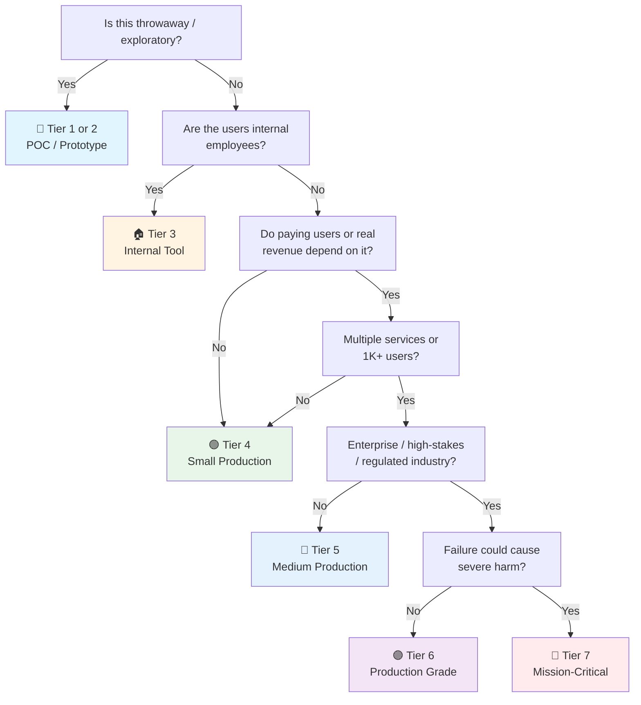

# Valkey (Redis) Checklist

> Valkey companion to the general [[Database]] checklist.
> Covers Valkey 9.x (the Redis fork, current major) — the standard in-memory cache / data store.
> Redis-compatible: every item applies to Redis 7.x too (protocol-identical, config mostly identical).
> Companion to [[PostgreSQL]] and [[MongoDB]] for the other engines in the homelab.
> Last updated: 2026-08-05

---

## 1. Setup & Configuration

- [ ] **Version** — Valkey 9.x (or Redis 7.x for managed/legacy). `INFO server` recorded.
- [ ] **Memory policy chosen** — `maxmemory` set (never unlimited), `maxmemory-policy` deliberate:
  - `allkeys-lru` — general-purpose cache
  - `volatile-lru` — only expire-able keys evicted (data safety)
  - `noeviction` — cache-as-database (returns errors on full — do NOT use for caches)
- [ ] **Persistence decision made** — For pure cache: RDB snapshots optional, AOF off (rebuild from source). For data safety: AOF `everysec` or `appendfsync always` (slow). Document which keys can be lost.
- [ ] **`bind` + `protected-mode`** — Bound to private interface, `protected-mode yes`, never exposed to the internet. Default-open Valkey = instant cryptojacking.
- [ ] **Container/Docker notes** — Volume for data (`/data`), `--requirepass` or ACL from env/vault, healthcheck `redis-cli ping` → [[Infrastructure]].

## 2. Data Modeling (Key Design)

- [ ] **Key naming convention** — `namespace:entity:id:field` (e.g. `user:123:session`, `cache:products:456`). Consistent separators, no ad-hoc names.
- [ ] **Key expiry discipline** — Every cache key has a TTL. `SET key val EX 300` or `EXPIRE`. Key without TTL in a cache = leak.
- [ ] **Data types chosen correctly** —
  - Strings: counters, cached values, tokens
  - Hashes: objects/records (`HSET user:123 name alice`) — partial updates without GET/SET races
  - Lists: queues, recent items (LPUSH/BRPOP)
  - Sets: uniqueness, membership (tags, online users)
  - Sorted sets: leaderboards, rate limiting by time window (ZADD/ZRANGEBYSCORE)
  - Streams: event log / lightweight message bus
- [ ] **Big keys avoided** — Keys > 100KB (or large collections) hurt replication, eviction, and latency. Split or use hashes. `--bigkeys` scan in dev.
- [ ] **Hot keys identified** — A single key serving most traffic (celebrity user, popular product)? Local cache layer or replica reads.

## 3. Caching Patterns (Correct Usage)

- [ ] **Cache-aside (lazy) pattern** — Read: check cache → miss → read DB → set cache. Write: update DB → invalidate cache. The default pattern for most apps → [[Database]] §6.
- [ ] **Cache stampede protection** — On miss: single-flight / lock / probabilistic early expiry. 100 concurrent misses on a cold key = DB meltdown.
- [ ] **Invalidation verified** — Every write path invalidates or updates the right keys. Stale-data bugs are invalidation bugs, not cache bugs.
- [ ] **Serialization consistent** — Same serializer (JSON/MessagePack) everywhere; schema version in cached values for rolling changes.
- [ ] **Cache key includes version** — `cache:products:v2:456` — bump version on schema change instead of flushing everything.
- [ ] **`GET`/`SET` vs `MGET`/`MSET`** — Pipeline or MGET for batch reads. Round trips are the enemy.
- [ ] **Rate limiting via Valkey** — Fixed window (`INCR` + `EXPIRE`) or sliding window (sorted set / `INCRBY` with timestamps). See [[Security]] §2 for auth rate limits.

## 4. Advanced Features (Use When Needed)

- [ ] **Pub/Sub vs Streams** — Pub/Sub: fire-and-forget, no persistence, no replay. Streams: persistent, consumer groups, replay. Choose by durability needs. For jobs/queues, prefer a real queue (see batch checklists).
- [ ] **Lua scripting** — `EVAL` for atomic multi-key operations (compare-and-set, batch updates). Atomicity without transactions. Keep scripts short and tested.
- [ ] **Transactions (MULTI/EXEC)** — For atomic batches (no rollback, no isolation — read the docs). Lua often better.
- [ ] **Sorted-set rate limiting** — Sliding window: `ZREMRANGEBYSCORE` + `ZCARD` + `ZADD` in a Lua script. Precise, slightly more memory.
- [ ] **Distributed locks (Redlock caution)** — For cross-instance mutual exclusion: SET with NX+EX, or Redlock only when correctness-critical AND you understand the trade-offs. Prefer application-level idempotency.

## 5. High Availability & Replication

- [ ] **Replica (replication) configured** — Primary + replica(s) for read scaling and failover. `replicaof` / managed equivalent.
- [ ] **Sentinel for HA (self-managed)** — Valkey Sentinel: monitoring, auto-failover, client discovery. Minimum 3 Sentinel nodes (quorum). This is the self-managed HA answer — or use managed (ElastiCache/Valkey Cloud).
- [ ] **Replication lag monitored** — `INFO replication` `master_repl_offset` vs replica offset. Alert on lag.
- [ ] **Persistence + replication interplay** — Replicas inherit persistence config; promote a replica with AOF on to avoid losing recent writes after failover.
- [ ] **Failover tested** — Kill the primary in staging; verify Sentinel promotes, app reconnects, no split-brain (quorum config reviewed).

## 6. Security (Valkey)

- [ ] **Authentication required** — `requirepass` (single password) or ACLs (per-user, per-command, per-key). ACLs for multi-app instances → [[Security]] §8.
- [ ] **ACL least-privilege** — `ACL SETUSER appuser on >password ~cache:* +@read +@write -@admin -@dangerous`. No default user with all commands.
- [ ] **Dangerous commands disabled** — `rename-command FLUSHALL ""`, `rename-command CONFIG ""` (or ACL-deny) for internet-adjacent instances. `FLUSHALL` in production without warning = data loss.
- [ ] **TLS** — `tls-port` + certs for cross-network connections. `redis-cli --tls`. Internal networks are not inherently trusted.
- [ ] **No secrets in keys/values** — Cache values may include PII; encrypt or exclude sensitive fields → [[Security]] §8.

## 7. Observability (Valkey)

- [ ] **`INFO` metrics collected** — `used_memory`, `mem_fragmentation_ratio`, `evicted_keys`, `expired_keys`, `connected_clients`, `keyspace_hits/misses`.
- [ ] **Prometheus exporter** — `redis_exporter` (or valkey exporter): hit rate, memory, evictions, latency, replication lag.
- [ ] **Slow log** — `slowlog-log-slower-than 10000` (10ms) + `slowlog-max-len`. Review weekly.
- [ ] **Alerts** — Memory > 80% maxmemory, eviction rate spike, hit rate drop, connections near max, replication lag.
- [ ] **`MONITOR` used sparingly** — Debug only, never in production for long (massive overhead).
- [ ] **Capacity trend** — Memory growth vs maxmemory trended. Cache sizing review: hit rate ≥ 95% typical for well-tuned caches.

---

## Quick Sanity Check Before Launch

- [ ] `maxmemory` set, eviction policy deliberate (cache vs data)
- [ ] Every cache key has a TTL; invalidation verified on write paths
- [ ] Auth required — ACLs or requirepass, not default-open
- [ ] Dangerous commands renamed/denied
- [ ] `protected-mode yes`, bound to private interface
- [ ] Persistence choice documented (which keys can be lost)
- [ ] Cache stampede protection on hot keys
- [ ] Replication (if any) lag monitored, failover practiced
- [ ] Metrics exported, memory/eviction alerts armed

---

## Project Tier Scoping Matrix

> **How to use this table:** Pick your tier first, then focus only on the sections marked ✅ (required) or 🟡 (recommended). Skip ❌ sections entirely — they'd be over-engineering for your context.
>
> **Legend:** ✅ Required · 🟡 Recommended / partial · ❌ Skip

### Tier Descriptions

| # | Tier | Description | Typical Team | Users | Lifespan |
|---|---|---|---|---|---|
| 1 | 🧪 **POC / Spike** | Validate an idea. Default install is fine. | 1 dev | Internal only | Days–weeks |
| 2 | 🔧 **Prototype / MVP** | Waiting for integration or user validation. Might become real. | 1–2 devs | Beta testers | Weeks–months |
| 3 | 🏠 **Internal Tool** | Real users (employees), real data. No external exposure or paying customers. | 1–3 devs | Employees | Ongoing |
| 4 | 🟢 **Small Production** | Single instance, low traffic. Real users, maybe early revenue. | 1–2 devs | < 1K users | Ongoing |
| 5 | 🔵 **Medium Production** | Higher traffic or multi-service. Real revenue or user base that matters. | 2–5 devs | 1K–100K users | Ongoing |
| 6 | 🟣 **Production Grade** | Full rigor — high-stakes SaaS, enterprise product, or large user base. | 5+ devs | 100K+ users | Long-term |
| 7 | 🔴 **Mission-Critical / Regulated** | Healthcare (HIPAA), finance (PCI-DSS), safety systems. Failure = severe harm. | 10+ devs | Varies | Decades |

### Which Tier Am I?

### Checklist Applicability by Tier

| # | Section | 🧪 POC | 🔧 Prototype | 🏠 Internal | 🟢 Small Prod | 🔵 Medium Prod | 🟣 Production Grade | 🔴 Mission-Critical |
|---|---|:---:|:---:|:---:|:---:|:---:|:---:|:---:|
| 1 | Setup & Configuration | 🟡 defaults | ✅ + maxmemory | ✅ + policy | ✅ + persistence | ✅ | ✅ + tuned | ✅ + formal |
| 2 | Data Modeling | 🟡 strings only | 🟡 + hashes | ✅ + types | ✅ + TTL | ✅ + big-key audit | ✅ + hot-key plan | ✅ + formal |
| 3 | Caching Patterns | ❌ | 🟡 cache-aside | ✅ | ✅ + invalidation | ✅ + stampede guard | ✅ + versioned keys | ✅ + formal |
| 4 | Advanced Features | ❌ | ❌ | 🟡 if needed | 🟡 | ✅ + Lua | ✅ + streams | ✅ + audit |
| 5 | HA & Replication | ❌ | ❌ | 🟡 if needed | 🟡 replica optional | ✅ + Sentinel | ✅ + failover tested | ✅ + multi-region |
| 6 | Security | 🟡 local only | 🟡 requirepass | ✅ + ACL | ✅ + TLS | ✅ + command deny | ✅ + full hardening | ✅ + regulatory |
| 7 | Observability | ❌ | ❌ | 🟡 basic | ✅ + exporter | ✅ + dashboards | ✅ + slow log review | ✅ + full stack |

---

## Sources

- Complements [[Database]] (general caching strategy §6), [[Security]] (rate limiting, secrets).
- Valkey docs — https://valkey.io/ (Redis-compatible: https://redis.io/docs/)
- redis_exporter — https://github.com/oliver006/redis_exporter
