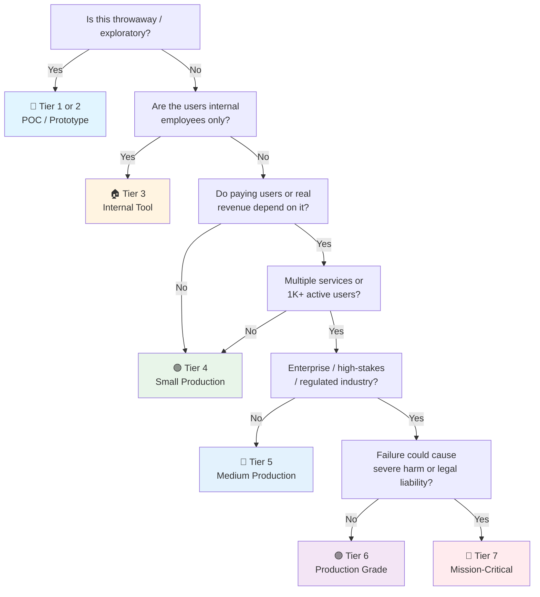

# Accessibility Testing Checklist

> **Accessibility (a11y)** ensures software is usable by people with disabilities — visual, auditory, motor, cognitive, and neurological. WCAG 2.1/2.2 provides the standards; automated tools catch ~30% of issues; manual testing catches the rest.
> Companion to the general [QA checklist](qa.md). Covers web apps, SPAs, and responsive mobile. For WCAG 2.2 AA conformance.
> Last updated: 2026-08-07

---

## 1. WCAG 2.1/2.2 Standards

### POUR Principles

- [ ] **Perceivable** — Information must be presentable in ways users can perceive (not invisible to all senses):
  - Text alternatives for non-text content (SC 1.1.1)
  - Captions and alternatives for time-based media (SC 1.2.1–1.2.9)
  - Content can be presented in different ways without losing structure (SC 1.3.1–1.3.6)
  - Content is easy to see and hear (SC 1.4.1–1.4.13)
- [ ] **Operable** — Interface components must be operable by all users:
  - All functionality available from keyboard (SC 2.1.1–2.1.4)
  - Enough time to read and use content (SC 2.2.1–2.2.10)
  - Content does not cause seizures (SC 2.3.1–2.3.3)
  - Users can easily navigate and find content (SC 2.4.1–2.4.13)
  - Input modalities beyond keyboard (SC 2.5.1–2.5.8)
- [ ] **Understandable** — Information and UI operation must be understandable:
  - Text is readable and understandable (SC 3.1.1–3.1.6)
  - Content appears and operates predictably (SC 3.2.1–3.2.6)
  - Users are helped to avoid and correct mistakes (SC 3.3.1–3.3.6)
- [ ] **Robust** — Content must be robust enough for diverse user agents and assistive technologies:
  - Compatible with current and future tools (SC 4.1.1–4.1.3)

### Conformance Levels

- [ ] **Level A** — Minimum conformance (25 success criteria). Removes critical barriers.
- [ ] **Level AA** — Standard conformance (50 success criteria). Legal requirement in most jurisdictions (ADA, Section 508, EN 301 549, EU Web Accessibility Directive).
- [ ] **Level AAA** — Enhanced conformance (78 success criteria). Aspirational for most; required for some public-sector contexts.

### Key Success Criteria (WCAG 2.2 additions)

- [ ] **SC 2.4.11 Focus Not Obscured (AA)** — When a keyboard-focused element is visible, it is not entirely hidden by author-created content.
- [ ] **SC 2.4.12 Focus Not Obscured (AAA)** — No part of the focused element is hidden.
- [ ] **SC 2.4.13 Focus Appearance (AAA)** — Focus indicator is visible with specific minimum area and contrast.
- [ ] **SC 2.5.7 Dragging Movements (AA)** — All dragging actions have a single-pointer alternative (e.g., click-to-move).
- [ ] **SC 2.5.8 Target Size (AA)** — Interactive targets are at least 24×24 CSS pixels (44×44 for AAA).
- [ ] **SC 3.2.6 Consistent Help (A)** — Help mechanisms (contact, FAQ, chatbot) are in the same location across pages.
- [ ] **SC 3.3.7 Redundant Entry (A)** — Information previously entered is auto-populated or selectable.
- [ ] **SC 3.3.8 Accessible Authentication (AA)** — Authentication does not rely on cognitive tests (e.g., remember passwords without help).

---

## 2. Automated Testing Tools

### axe-core (Browser Extension + npm)

- [ ] **Install axe DevTools extension** — Available for Chrome, Firefox, Edge. Free tier scans full pages; Pro tier adds guided testing.
- [ ] **Install npm package** — for programmatic use:
  ```bash
  npm install --save-dev axe-core
  # or with yarn
  yarn add --dev axe-core
  ```
- [ ] **Configure axe-core rules**:
  ```typescript
  import axe from 'axe-core';

  // Run with specific tags
  const results = await axe.run(document, {
    runOnly: {
      type: 'tag',
      values: ['wcag2a', 'wcag2aa', 'wcag21aa', 'wcag22aa'],
    },
    // Disable specific rules
    rules: {
      'color-contrast': { enabled: true },
      'region': { enabled: false }, // Skip if using iframes
    },
  });

  console.log(`${results.violations.length} violations found`);
  results.violations.forEach(v => {
    console.log(`[${v.impact}] ${v.id}: ${v.description}`);
    v.nodes.forEach(n => console.log(`  - ${n.html}`));
  });
  ```
- [ ] **axe-core result structure** — understand severity levels:
  ```typescript
  interface AxeViolation {
    id: string;            // e.g., 'color-contrast'
    impact: 'minor' | 'moderate' | 'serious' | 'critical';
    description: string;
    helpUrl: string;       // Link toDeque documentation
    nodes: Array<{
      html: string;        // The offending HTML
      target: string[];    // CSS selectors
      failureSummary: string;
    }>;
  }
  ```

### pa11y (CLI + CI)

- [ ] **Install pa11y**:
  ```bash
  npm install --save-dev pa11y
  # CLI usage
  npx pa11y https://example.com
  ```
- [ ] **pa11y configuration file** — `.pa11yci.json`:
  ```json
  {
    "defaults": {
      "standard": "WCAG2AA",
      "runners": ["axe"],
      "wait": 2000,
      "timeout": 30000,
      "chromeLaunchConfig": {
        "args": ["--no-sandbox"]
      }
    },
    "urls": [
      "https://example.com",
      "https://example.com/about",
      "https://example.com/contact",
      {
        "url": "https://example.com/login",
        "actions": [
          "set field #email to test@example.com",
          "set field #password to testpass123",
          "click element #submit",
          "wait for url to be https://example.com/dashboard"
        ]
      }
    ]
  }
  ```
- [ ] **pa11y with authentication** — test behind login:
  ```bash
  npx pa11y https://example.com/dashboard \
    --config .pa11yci.json \
    --standard WCAG2AA \
    --reporter json \
    > pa11y-results.json
  ```
- [ ] **pa11y dashboard** — self-hosted reporting:
  ```bash
  # Docker Compose for pa11y dashboard
  docker run -d \
    --name pa11y-dashboard \
    -p 4000:4000 \
    -e MONGODB_URI=mongodb://mongo:27017/pa11y \
    hargne/pa11y-dashboard
  ```

### Lighthouse (Chrome + CI)

- [ ] **Chrome DevTools** — Audits → Accessibility (built-in, no install needed).
- [ ] **Lighthouse CLI**:
  ```bash
  npm install --save-dev lighthouse
  npx lighthouse https://example.com --only-categories=accessibility --output=json --output-path=./lighthouse-a11y.json
  ```
- [ ] **Lighthouse configuration** — `lighthouserc.js`:
  ```javascript
  module.exports = {
    ci: {
      collect: {
        url: ['https://example.com', 'https://example.com/pricing'],
        numberOfRuns: 3,
        settings: {
          onlyCategories: ['accessibility'],
          preset: 'desktop',
        },
      },
      assert: {
        assertions: {
          'categories:accessibility': {
            minScore: 0.9,
            aggregationMethod: 'median-run',
          },
          'color-contrast': 'error',
          'image-alt': 'error',
          'heading-order': 'warn',
        },
      },
      upload: {
        target: 'temporary-public-storage',
      },
    },
  };
  ```

### WAVE (WebAIM)

- [ ] **WAVE browser extension** — Chrome/Firefox. Visual overlay of errors, alerts, features, structural elements.
- [ ] **WAVE API** — for batch testing:
  ```bash
  # Requires API key from https://wave.webaim.org/api/
  curl "https://wave.webaim.org/api/request?key=YOUR_KEY&url=https://example.com&reporttype=json"
  ```
- [ ] **WAVE interpretation** — focus on Errors (red) and Contrast Errors (dark red) first. Alerts (yellow) are manual-review items. Features (green) confirm correct implementation.

---

## 3. Manual Testing

### Keyboard Navigation (20+ Items)

- [ ] **Tab order follows visual flow** — left-to-right, top-to-bottom, matching the reading order.
- [ ] **Focus indicator visible** — every interactive element shows a clear focus ring/outline on `:focus-visible`.
- [ ] **No keyboard traps** — Tab/Shift+Tab can reach every interactive element and leave every widget.
- [ ] **Skip link present** — "Skip to main content" link is first focusable element, becomes visible on focus.
- [ ] **Skip link works** — Activating skip link moves focus to `<main>` or `#main-content` target.
- [ ] **All links reachable** — Every `<a>` element is reachable via Tab.
- [ ] **All buttons reachable** — Every `<button>` and `role="button"` element is reachable.
- [ ] **Form inputs reachable** — Every `<input>`, `<select>`, `<textarea>` is reachable.
- [ ] **Custom controls reachable** — Widgets built with `<div>` + ARIA are reachable via Tab (tabindex="0").
- [ ] **Enter activates buttons** — Pressing Enter on a focused button triggers its action.
- [ ] **Space activates buttons** — Pressing Space on a focused button triggers its action.
- [ ] **Escape closes modals** — Pressing Escape closes open dialogs/modals/dropdowns.
- [ ] **Arrow keys in menus** — Dropdown menus, tablists, and tree views respond to arrow keys.
- [ ] **Home/End in lists** — Home moves to first item, End to last item in lists/tablists.
- [ ] **Typeahead in selects** — Typing a character in a listbox jumps to items starting with that character.
- [ ] **No focus loss on dynamic updates** — Adding/removing DOM content doesn't cause focus to jump to `<body>`.
- [ ] **Scroll into view on focus** — Focused element scrolls into viewport if it's off-screen.
- [ ] **Tab out of iframes** — Tab can enter and exit embedded iframes.
- [ ] **Browser back works** — Back button returns to correct scroll/focus position (SPA routing).
- [ ] **No `tabindex > 0`** — No element uses positive tabindex values (disrupts natural order).
- [ ] **Off-screen content unreachable** — Hidden elements (`display: none`, `visibility: hidden`) are not focusable.

### Screen Reader Testing

#### NVDA (Windows — most popular, free)

- [ ] **Install NVDA** — Download from https://www.nvaccess.org/download/ (free, open source).
- [ ] **Key commands**:
  - `Insert + N` — NVDA menu
  - `Insert + Space` — Toggle browse/focus mode
  - `H` / `Shift+H` — Next/previous heading
  - `1`–`6` — Headings by level
  - `F` / `Shift+F` — Next/previous form field
  - `L` / `Shift+L` — Next/previous list
  - `T` / `Shift+T` — Next/previous table
  - `D` / `Shift+D` — Next/previous landmark
  - `Insert + Down Arrow` — Read all from current position
  - `Insert + Up Arrow` — Read current line/element

#### VoiceOver (macOS/iOS — built-in)

- [ ] **Enable VoiceOver** — `Cmd + F5` (macOS) or Settings → Accessibility → VoiceOver (iOS).
- [ ] **Key commands (macOS)**:
  - `VO + U` — Rotor (headings, links, form controls, landmarks)
  - `VO + Right/Left` — Next/previous element
  - `VO + Space` — Activate/click current element
  - `VO + Shift + Right/Left` — Enter/exit a region
  - `VO + H` — Jump to next heading
  - `VO + Cmd + H` — Heading rotor
- [ ] **iOS gestures**:
  - Single-finger swipe right/left — Next/previous element
  - Single-finger swipe up/down — Rotor navigation
  - Double-tap — Activate element
  - Three-finger swipe — Scroll

#### TalkBack (Android — built-in)

- [ ] **Enable TalkBack** — Settings → Accessibility → TalkBack (or hold both volume keys).
- [ ] **Gestures**:
  - Single-finger swipe right/left — Next/previous element
  - Single-finger swipe up/down — Change reading granularity
  - Double-tap — Activate element
  - Two-finger swipe down — Read from top
  - Swipe up then right — TalkBack menu

#### Screen Reader Test Checklist

- [ ] **Page title announced** — meaningful, unique per page.
- [ ] **Landmark regions announced** — can navigate between header, nav, main, footer.
- [ ] **Headings navigable** — proper hierarchy announced (heading level 1, 2, 3...).
- [ ] **Images announced** — alt text read for informative images, skipped for decorative (`alt=""`).
- [ ] **Form labels announced** — label text read when input receives focus.
- [ ] **Required state announced** — "required" spoken for mandatory fields.
- [ ] **Error messages announced** — errors read when they appear (live region or focus management).
- [ ] **Dynamic content announced** — ARIA live regions read updates without focus change.
- [ ] **Button states announced** — expanded/collapsed, pressed, checked states read.
- [ ] **Link destinations clear** — link text is descriptive (not "click here").
- [ ] **Tables announced properly** — headers read with each cell, table summary if provided.
- [ ] **Custom widgets announced** — role, name, value, state all communicated correctly.

### 200% Zoom Testing

- [ ] **Browser zoom to 200%** — `Ctrl/Cmd + +` five times. Content reflows without horizontal scrolling.
- [ ] **Text readable** — all text scales proportionally, no text becomes invisible or overlaps.
- [ ] **Interactive elements** — buttons, links, form fields remain clickable and usable.
- [ ] **Layout integrity** — no content is cut off, hidden, or overlapping other content.
- [ ] **Images scale** — images resize or reflow appropriately.
- [ ] **Modals still work** — dialogs open, are scrollable, and close at 200% zoom.
- [ ] **Navigation functional** — menus, sidebars, breadcrumbs remain usable.

### High Contrast Mode

- [ ] **Windows High Contrast** — Settings → Accessibility → Contrast themes. All content visible.
- [ ] **Forced colors mode** — test with `@media (forced-colors: active)`:
  ```css
  @media (forced-colors: active) {
    .custom-button {
      border: 2px solid ButtonText;
      color: ButtonText;
      background: ButtonFace;
    }
    .status-icon {
      forced-color-adjust: none; /* Preserve critical colors */
    }
  }
  ```
- [ ] **Background images** — content over background images is still readable when images are removed.
- [ ] **Borders visible** — all borders, outlines, and separators remain visible.

---

## 4. CI Integration

### Playwright + axe (GitHub Actions)

- [ ] **Install dependencies**:
  ```bash
  npm install --save-dev @playwright/test @axe-core/playwright
  ```
- [ ] **Playwright test file** — `tests/a11y.spec.ts`:
  ```typescript
  import { test, expect } from '@playwright/test';
  import AxeBuilder from '@axe-core/playwright';

  const pages = ['/', '/about', '/pricing', '/contact'];

  for (const path of pages) {
    test(`${path} has no accessibility violations`, async ({ page }) => {
      await page.goto(path);

      const results = await new AxeBuilder({ page })
        .withTags(['wcag2a', 'wcag2aa', 'wcag21aa', 'wcag22aa'])
        .disableRules(['region']) // Skip if using iframes
        .analyze();

      // Generate HTML report artifact
      expect(results.violations).toEqual([]);
    });
  }

  test('authenticated dashboard is accessible', async ({ page }) => {
    await page.goto('/login');
    await page.fill('#email', 'test@example.com');
    await page.fill('#password', process.env.TEST_PASSWORD!);
    await page.click('#submit');
    await page.waitForURL('/dashboard');

    const results = await new AxeBuilder({ page })
      .withTags(['wcag2aa'])
      .analyze();

    expect(results.violations).toEqual([]);
  });
  ```
- [ ] **GitHub Actions workflow** — `.github/workflows/accessibility.yml`:
  ```yaml
  name: Accessibility Tests

  on:
    push:
      branches: [main, develop]
    pull_request:
      branches: [main]
    schedule:
      - cron: '0 6 * * 1'  # Weekly on Monday at 6 AM UTC

  jobs:
    a11y:
      runs-on: ubuntu-latest
      timeout-minutes: 15
      steps:
        - uses: actions/checkout@v4

        - uses: actions/setup-node@v4
          with:
            node-version: 20
            cache: npm

        - run: npm ci
        - run: npx playwright install --with-deps chromium

        - name: Start dev server
          run: npm run dev &
          env:
            DATABASE_URL: ${{ secrets.TEST_DB_URL }}

        - name: Wait for server
          run: npx wait-on http://localhost:3000 --timeout 60000

        - name: Run accessibility tests
          run: npx playwright test tests/a11y.spec.ts
          env:
            TEST_PASSWORD: ${{ secrets.TEST_PASSWORD }}

        - name: Upload report
          if: always()
          uses: actions/upload-artifact@v4
          with:
            name: playwright-a11y-report
            path: playwright-report/
            retention-days: 30
  ```

### Cypress + cypress-axe

- [ ] **Install dependencies**:
  ```bash
  npm install --save-dev cypress cypress-axe axe-core
  ```
- [ ] **Cypress commands** — `cypress/support/commands.ts`:
  ```typescript
  import 'cypress-axe';

  // Custom command for a11y testing
  Cypress.Commands.add('checkA11y', (context?: string) => {
    cy.injectAxe();
    cy.checkA11y(context, {
      includedImpacts: ['critical', 'serious'],
      runOnly: {
        type: 'tag',
        values: ['wcag2a', 'wcag2aa', 'wcag21aa'],
      },
    });
  });
  ```
- [ ] **Cypress test**:
  ```typescript
  describe('Accessibility', () => {
    const pages = ['/', '/about', '/pricing'];

    pages.forEach((page) => {
      it(`${page} passes a11y checks`, () => {
        cy.visit(page);
        cy.checkA11y();
      });
    });

    it('modal dialog is accessible', () => {
      cy.visit('/');
      cy.get('[data-testid="open-modal"]').click();
      cy.checkA11y('[role="dialog"]');
      cy.realPress('Escape');
      cy.get('[role="dialog"]').should('not.exist');
    });
  });
  ```

### pa11y CI with Dashboard

- [ ] **pa11y CI configuration** — `.pa11yci`:
  ```json
  {
    "defaults": {
      "standard": "WCAG2AA",
      "timeout": 30000,
      "wait": 3000,
      "chromeLaunchConfig": {
        "args": ["--no-sandbox", "--disable-gpu"]
      }
    },
    "urls": [
      "http://localhost:3000/",
      "http://localhost:3000/about",
      "http://localhost:3000/pricing",
      "http://localhost:3000/login",
      "http://localhost:3000/signup"
    ]
  }
  ```
- [ ] **GitHub Actions with pa11y**:
  ```yaml
  - name: Install pa11y
    run: npm install --save-dev pa11y pa11y-ci

  - name: Run pa11y CI
    run: |
      npm run dev &
      npx wait-on http://localhost:3000
      npx pa11y-ci --config .pa11yci --json > pa11y-results.json || true

  - name: Check for violations
    run: |
      VIOLATIONS=$(cat pa11y-results.json | jq '[.[].issues[] | select(.typeCode == "error")] | length')
      echo "Found $VIOLATIONS errors"
      if [ "$VIOLATIONS" -gt 0 ]; then exit 1; fi
  ```

### Lighthouse CI with Budget

- [ ] **Budget file** — `lighthouse-budget.json`:
  ```json
  [
    {
      "path": "/*",
      "accessibility": {
        "score": 0.95
      },
      "timings": [
        { "metric": "largest-contentful-paint", "budget": 2500 },
        { "metric": "cumulative-layout-shift", "budget": 0.1 }
      ]
    },
    {
      "path": "/dashboard/*",
      "accessibility": {
        "score": 0.9
      }
    }
  ]
  ```
- [ ] **Scheduled regression runs**:
  ```yaml
  # .github/workflows/a11y-regression.yml
  name: Weekly A11y Regression

  on:
    schedule:
      - cron: '0 2 * * 1,4'  # Monday and Thursday at 2 AM UTC
    workflow_dispatch:         # Allow manual trigger

  jobs:
    regression:
      runs-on: ubuntu-latest
      strategy:
        matrix:
          page: ['/', '/about', '/pricing', '/dashboard', '/settings']
      steps:
        - uses: actions/checkout@v4
        - uses: actions/setup-node@v4
          with:
            node-version: 20
        - run: npm ci
        - run: npm run build
        - run: npm run start &
        - run: npx wait-on http://localhost:3000

        - name: Lighthouse CI
          run: |
            npm install --save-dev @lhci/cli
            npx lhci autorun \
              --collect.url=http://localhost:3000${{ matrix.page }} \
              --collect.numberOfRuns=3 \
              --assert.assertions.categories:accessibility.minScore=0.95 \
              --upload.target=temporary-public-storage

        - name: Notify on failure
          if: failure()
          run: |
            curl -X POST "${{ secrets.SLACK_WEBHOOK }}" \
              -d '{"text":"🚨 A11y regression on ${{ matrix.page }}"}'
  ```

---

## 5. Component-Level Testing

### jest-axe Setup

- [ ] **Install jest-axe**:
  ```bash
  npm install --save-dev jest-axe axe-core
  ```
- [ ] **Custom matcher setup** — `jest.setup.ts`:
  ```typescript
  import { toHaveNoViolations } from 'jest-axe';

  expect.extend(toHaveNoViolations);
  ```
- [ ] **jest config** — `jest.config.ts`:
  ```typescript
  export default {
    setupFilesAfterSetup: ['<rootDir>/jest.setup.ts'],
    testEnvironment: 'jsdom',
  };
  ```

### React Testing Library

- [ ] **Accessible queries** — prefer `getByRole` over `getByTestId`:
  ```typescript
  import { render, screen } from '@testing-library/react';
  import { axe } from 'jest-axe';
  import { Button } from './Button';

  describe('Button', () => {
    it('renders with accessible name', () => {
      render(<Button>Save changes</Button>);
      // getByRole finds buttons by role + accessible name
      expect(screen.getByRole('button', { name: /save changes/i })).toBeInTheDocument();
    });

    it('has no accessibility violations', async () => {
      const { container } = render(<Button>Submit</Button>);
      const results = await axe(container);
      expect(results).toHaveNoViolations();
    });

    it('announces loading state', () => {
      render(<Button loading>Save</Button>);
      const button = screen.getByRole('button', { name: /save/i });
      expect(button).toHaveAttribute('aria-busy', 'true');
      expect(button).toBeDisabled();
    });

    it('associates label with input', () => {
      render(
        <div>
          <label htmlFor="email">Email address</label>
          <input id="email" type="email" />
        </div>
      );
      // getByLabelText finds input by its label text
      expect(screen.getByLabelText('Email address')).toBeInTheDocument();
    });
  });
  ```
- [ ] **RTL priority queries** (in order of preference):
  ```typescript
  // 1. getByRole — best (matches screen reader experience)
  screen.getByRole('button', { name: /submit/i });
  screen.getByRole('heading', { name: /welcome/i });
  screen.getByRole('textbox', { name: /search/i });

  // 2. getByLabelText — great for form inputs
  screen.getByLabelText(/email address/i);

  // 3. getByPlaceholderText — acceptable when no label
  screen.getByPlaceholderText(/enter search term/i);

  // 4. getByText — for non-interactive content
  screen.getByText(/no results found/i);

  // 5. getByAltText — for images
  screen.getByAltText(/company logo/i);

  // 6. getByTitle — last resort (tooltip, iframe title)
  screen.getByTitle(/close dialog/i);

  // ❌ AVOID — getByTestId (not accessible to users)
  ```

### Vue Test Utils

- [ ] **Vue + jest-axe**:
  ```typescript
  import { mount } from '@vue/test-utils';
  import { axe } from 'jest-axe';
  import SearchForm from './SearchForm.vue';

  describe('SearchForm', () => {
    it('has no accessibility violations', async () => {
      const wrapper = mount(SearchForm);
      const results = await axe(wrapper.element);
      expect(results).toHaveNoViolations();
    });

    it('associates label with input', () => {
      const wrapper = mount(SearchForm);
      const input = wrapper.find('input#search');
      const label = wrapper.find('label[for="search"]');
      expect(label.exists()).toBe(true);
      expect(label.text()).toContain('Search');
    });
  });
  ```

### Svelte Testing Library

- [ ] **Svelte + jest-axe**:
  ```typescript
  import { render, screen } from '@testing-library/svelte';
  import { axe } from 'jest-axe';
  import Alert from './Alert.svelte';

  describe('Alert', () => {
    it('has correct ARIA role', () => {
      render(Alert, { props: { type: 'error', message: 'Something went wrong' } });
      expect(screen.getByRole('alert')).toHaveTextContent('Something went wrong');
    });

    it('has no accessibility violations', async () => {
      const { container } = render(Alert, { props: { type: 'warning', message: 'Heads up' } });
      const results = await axe(container);
      expect(results).toHaveNoViolations();
    });
  });
  ```

### Custom Matchers

- [ ] **Custom accessibility matchers** — extend test framework:
  ```typescript
  // jest.matchers.ts
  expect.extend({
    toHaveAccessibleName(element: HTMLElement, expectedName: string) {
      const name = element.getAttribute('aria-label')
        || element.textContent?.trim()
        || '';
      const pass = name.toLowerCase().includes(expectedName.toLowerCase());
      return {
        pass,
        message: () => `Expected element to have accessible name "${expectedName}" but got "${name}"`,
      };
    },

    toHaveAccessibleDescription(element: HTMLElement, expectedDesc: string) {
      const describedBy = element.getAttribute('aria-describedby');
      if (!describedBy) {
        return { pass: false, message: () => 'Element has no aria-describedby' };
      }
      const descElement = document.getElementById(describedBy);
      const desc = descElement?.textContent?.trim() || '';
      return {
        pass: desc.includes(expectedDesc),
        message: () => `Expected description "${expectedDesc}" but got "${desc}"`,
      };
    },
  });
  ```

---

## 6. Color & Contrast

### Contrast Ratios (WCAG AA)

- [ ] **Normal text** (< 18pt / < 14pt bold) — minimum 4.5:1 contrast ratio against background.
- [ ] **Large text** (≥ 18pt / ≥ 14pt bold) — minimum 3:1 contrast ratio.
- [ ] **UI components** — borders, icons, input boundaries need 3:1 ratio (SC 1.4.11).
- [ ] **Graphical objects** — meaningful icons, charts, infographics need 3:1 (SC 1.4.11).
- [ ] **Focus indicators** — visible focus outline needs 3:1 against adjacent colors (SC 2.4.11).
- [ ] **Text over images** — text on background images must maintain contrast or use overlays.
- [ ] **Logos and brand marks** — exempt from contrast requirements (incidental).
- [ ] **Inactive/disabled state** — no minimum contrast requirement, but ensure users can tell state.

### Tools

- [ ] **WebAIM Contrast Checker** — https://webaim.org/resources/contrastchecker/ (quick hex input).
- [ ] **Colour Contrast Analyser (TPGi)** — Desktop app, eyedropper for any screen pixel.
- [ ] **Chrome DevTools** — Elements → Computed → color swatch shows contrast ratio.
- [ ] **axe-core** — automatically flags contrast violations in automated scans.
- [ ] **Stark** — Figma/Sketch plugin for design-phase contrast checking.

### CSS Design Tokens for Contrast

- [ ] **Design token system** — enforce contrast at the design system level:
  ```css
  :root {
    /* Text colors — all tested for 4.5:1 against backgrounds */
    --color-text-primary: #1a1a2e;       /* 15.4:1 on white */
    --color-text-secondary: #4a4a68;     /* 7.2:1 on white */
    --color-text-tertiary: #6b6b8a;      /* 4.6:1 on white — minimum AA */
    --color-text-disabled: #9e9eb8;      /* 3.0:1 — exempt (disabled) */

    /* Backgrounds */
    --color-bg-primary: #ffffff;
    --color-bg-secondary: #f8f9fc;
    --color-bg-tertiary: #eef0f5;

    /* Interactive — 3:1 minimum */
    --color-border-input: #6b6b8a;       /* 4.6:1 on white */
    --color-border-focus: #2563eb;       /* 4.5:1 on white */
    --color-icon-default: #4a4a68;       /* 7.2:1 on white */

    /* Status colors — paired with text/icons, not color alone */
    --color-success: #059669;
    --color-warning: #d97706;
    --color-error: #dc2626;
    --color-info: #2563eb;
  }
  ```
- [ ] **Dark mode considerations** — re-test all ratios in dark mode:
  ```css
  @media (prefers-color-scheme: dark) {
    :root {
      --color-text-primary: #f1f5f9;     /* 15.2:1 on #1a1a2e */
      --color-text-secondary: #cbd5e1;   /* 9.8:1 on #1a1a2e */
      --color-text-tertiary: #94a3b8;    /* 5.7:1 on #1a1a2e */
      --color-bg-primary: #1a1a2e;
      --color-bg-secondary: #16213e;
      --color-border-input: #94a3b8;     /* 5.7:1 on dark */
    }
  }
  ```
- [ ] **Color not sole indicator** — always pair color with another signal:
  ```css
  .form-error {
    color: var(--color-error);
    /* Also add icon + text */
  }
  .form-error::before {
    content: "⚠ "; /* Icon indicator */
    font-weight: bold;
  }
  .link {
    color: var(--color-info);
    text-decoration: underline; /* Not color alone */
  }
  ```

---

## 7. ARIA Attributes

### Rules of ARIA

- [ ] **First rule** — If you can use a native HTML element with the semantics you need, DO use it. Don't reinvent `<button>` as `<div role="button">`.
- [ ] **Second rule** — Do not change native semantics unless absolutely necessary. Don't put `role="heading"` on an `<h2>`.
- [ ] **Third rule** — All interactive ARIA widgets must be keyboard accessible.
- [ ] **Fourth rule** — Do not use `role="presentation"` or `aria-hidden="true"` on focusable elements.
- [ ] **Fifth rule** — All interactive elements must have an accessible name.

### ARIA Roles — When to Use

| Role | When to Use | Example |
|---|---|---|
| `button` | `<div>` acting as button (prefer `<button>`) | `<div role="button" tabindex="0">` |
| `dialog` | Modal/non-modal dialogs | `<div role="dialog" aria-labelledby="title">` |
| `alert` | Urgent, time-sensitive messages | `<div role="alert">Session expired</div>` |
| `alertdialog` | Modal that requires immediate attention | `<div role="alertdialog" aria-describedby="msg">` |
| `tablist` | Tab navigation widget | `<div role="tablist">` |
| `tab` | Individual tab | `<button role="tab" aria-selected="true">` |
| `tabpanel` | Content area for a tab | `<div role="tabpanel" aria-labelledby="tab1">` |
| `menu` | Application menu (not nav links) | `<ul role="menu">` |
| `menuitem` | Item in application menu | `<li role="menuitem">` |
| `combobox` | Editable input + listbox | `<input role="combobox" aria-expanded="false">` |
| `listbox` | Selectable list of options | `<ul role="listbox">` |
| `option` | Item in a listbox | `<li role="option" aria-selected="false">` |
| `tree` | Hierarchical list (file tree) | `<ul role="tree">` |
| `treeitem` | Item in a tree | `<li role="treeitem" aria-expanded="true">` |
| `grid` | 2D navigable data grid | `<div role="grid">` |
| `toolbar` | Group of action buttons | `<div role="toolbar" aria-label="Formatting">` |
| `tooltip` | Non-interactive popup info | `<div role="tooltip" id="tip1">` |
| `progressbar` | Determinate progress | `<div role="progressbar" aria-valuenow="50">` |
| `switch` | On/off toggle (prefer `<input type="checkbox">`) | `<div role="switch" aria-checked="true">` |

### ARIA States & Properties

| Attribute | Purpose | Example |
|---|---|---|
| `aria-label` | Provides accessible name | `<button aria-label="Close">✕</button>` |
| `aria-labelledby` | Name from another element's ID | `<input aria-labelledby="search-label">` |
| `aria-describedby` | Additional description from element ID | `<input aria-describedby="email-help">` |
| `aria-expanded` | Toggle is open/closed | `<button aria-expanded="false">Menu</button>` |
| `aria-selected` | Item is selected | `<option aria-selected="true">` |
| `aria-checked` | Checkbox/switch state | `<div role="switch" aria-checked="true">` |
| `aria-pressed` | Toggle button state | `<button aria-pressed="true">Bold</button>` |
| `aria-disabled` | Element is disabled (still focusable) | `<button aria-disabled="true">` |
| `aria-hidden` | Hidden from assistive tech | `<span aria-hidden="true">★</span>` |
| `aria-busy` | Element is being updated | `<div aria-busy="true" aria-live="polite">` |
| `aria-required` | Field is mandatory | `<input aria-required="true">` |
| `aria-invalid` | Field has validation error | `<input aria-invalid="true">` |
| `aria-errormessage` | ID of error message element | `<input aria-errormessage="email-error">` |
| `aria-controls` | Element controlled by this widget | `<button aria-controls="panel-1">` |
| `aria-owns` | Relationship not in DOM tree | `<div aria-owns="popup-list">` |
| `aria-current` | Current item in a set | `<a aria-current="page">` |
| `aria-sort` | Table column sort direction | `<th aria-sort="ascending">` |
| `aria-valuenow` | Current value of range widget | `<div role="slider" aria-valuenow="50">` |
| `aria-valuemin` | Minimum value of range widget | `<div role="slider" aria-valuemin="0">` |
| `aria-valuemax` | Maximum value of range widget | `<div role="slider" aria-valuemax="100">` |
| `aria-valuetext` | Human-readable value text | `<div role="slider" aria-valuetext="50 percent">` |

### Live Regions

- [ ] **`aria-live="polite"`** — announce when user is idle (non-urgent updates, toast messages):
  ```html
  <div aria-live="polite" aria-atomic="true" role="status">
    <!-- Content changes announced at next pause -->
    3 items added to cart
  </div>
  ```
- [ ] **`aria-live="assertive"`** — announce immediately (urgent errors, session timeout):
  ```html
  <div aria-live="assertive" aria-atomic="true" role="alert">
    <!-- Announced immediately, interrupts current speech -->
    Your session has expired. Please log in again.
  </div>
  ```
- [ ] **`aria-atomic`** — announce entire region or just changes:
  - `aria-atomic="true"` — entire region content is read when any part changes.
  - `aria-atomic="false"` — only the changed portion is read.
- [ ] **`role="status"`** — implicit `aria-live="polite"`, no focus needed.
- [ ] **`role="alert"`** — implicit `aria-live="assertive"`, no focus needed.
- [ ] **`role="log"`** — sequential updates (chat, terminal output), `aria-live="polite"`.

### Landmark Roles

- [ ] **`banner`** — `<header>` (site-wide header, only one per page).
- [ ] **`navigation`** — `<nav>` (major navigation blocks).
- [ ] **`main`** — `<main>` (primary page content, only one per page).
- [ ] **`complementary`** — `<aside>` (supporting content, related info).
- [ ] **`contentinfo`** — `<footer>` (site-wide footer, only one per page).
- [ ] **`search`** — `<form role="search">` (site search form).
- [ ] **`form`** — `<form>` with `aria-label` when there are multiple forms.
- [ ] **`region`** — generic landmark with `aria-label` (use sparingly).

### Anti-Patterns

- [ ] **Never `aria-hidden` on focusable elements** — keyboard users can reach it but screen readers can't see it.
- [ ] **Never `role="button"` on `<a>`** — use `<button>` instead. Links navigate, buttons act.
- [ ] **Never `role="presentation"` on interactive elements** — removes semantics from focusable content.
- [ ] **Never redundant roles** — `<button role="button">` or `<nav role="navigation">` are redundant.
- [ ] **Never `aria-label` on `<div>` or `<span>`** — only works on interactive/landmark elements.
- [ ] **Never use `title` attribute for accessible names** — inconsistent screen reader support, inaccessible on touch.

---

## 8. Forms & Inputs

### Label Association (3 Methods)

- [ ] **Method 1: `for` attribute** — explicit label-input association:
  ```html
  <label for="email">Email address</label>
  <input type="email" id="email" name="email">
  ```
- [ ] **Method 2: Wrapping label** — implicit association:
  ```html
  <label>
    Email address
    <input type="email" name="email">
  </label>
  ```
- [ ] **Method 3: `aria-label`** — when visual label is not possible:
  ```html
  <!-- Search input with icon only -->
  <input type="search" aria-label="Search products" placeholder="Search...">
  ```
- [ ] **Method 4: `aria-labelledby`** — name from another element:
  ```html
  <span id="sort-label">Sort by</span>
  <select aria-labelledby="sort-label">
    <option>Price: Low to High</option>
    <option>Price: High to Low</option>
  </select>
  ```

### Required Fields

- [ ] **HTML `required` attribute** — native validation, announced by screen readers:
  ```html
  <label for="name">Full name <span aria-hidden="true">*</span></label>
  <input type="text" id="name" name="name" required>
  ```
- [ ] **`aria-required="true"`** — for custom controls or when `required` is insufficient:
  ```html
  <div role="combobox" aria-required="true" aria-expanded="false">
    <input type="text" aria-label="Country" aria-required="true">
  </div>
  ```
- [ ] **Visual indication** — asterisk (*) with screen-reader-hidden decorative, plus text "(required)" or legend note.

### Error Messages

- [ ] **`aria-describedby` + `aria-invalid`** — programmatic error association:
  ```html
  <label for="password">Password</label>
  <input
    type="password"
    id="password"
    aria-describedby="password-error password-help"
    aria-invalid="true"
    aria-errormessage="password-error"
  >
  <p id="password-help">Must be at least 8 characters.</p>
  <p id="password-error" role="alert">Password must contain at least one number.</p>
  ```
- [ ] **Error summary** — list all errors at top of form on submit:
  ```html
  <div role="alert" aria-labelledby="error-heading" class="error-summary">
    <h2 id="error-heading">There are 3 errors in this form</h2>
    <ul>
      <li><a href="#name">Full name is required</a></li>
      <li><a href="#email">Email format is invalid</a></li>
      <li><a href="#password">Password must contain a number</a></li>
    </ul>
  </div>
  ```
- [ ] **Focus management on error** — move focus to error summary or first invalid field on submit.

### Fieldsets & Legends

- [ ] **Group related controls** — radio buttons, checkbox groups, related fields:
  ```html
  <fieldset>
    <legend>Shipping method</legend>
    <label>
      <input type="radio" name="shipping" value="standard">
      Standard (5-7 days)
    </label>
    <label>
      <input type="radio" name="shipping" value="express">
      Express (1-2 days)
    </label>
    <label>
      <input type="radio" name="shipping" value="overnight">
      Overnight
    </label>
  </fieldset>
  ```
- [ ] **Nested fieldsets** — for complex forms with sections:
  ```html
  <fieldset>
    <legend>Billing address</legend>
    <!-- address fields -->
  </fieldset>
  <fieldset>
    <legend>Shipping address</legend>
    <label>
      <input type="checkbox" name="same-as-billing">
      Same as billing address
    </label>
    <!-- shipping fields (conditionally shown) -->
  </fieldset>
  ```

### Autocomplete Attributes

- [ ] **Use `autocomplete` for common fields** — helps users and password managers:
  ```html
  <input type="text" name="fullname" autocomplete="name">
  <input type="email" name="email" autocomplete="email">
  <input type="tel" name="phone" autocomplete="tel">
  <input type="text" name="address" autocomplete="street-address">
  <input type="text" name="city" autocomplete="address-level2">
  <input type="text" name="state" autocomplete="address-level1">
  <input type="text" name="zip" autocomplete="postal-code">
  <input type="text" name="country" autocomplete="country">
  <input type="password" name="password" autocomplete="current-password">
  <input type="password" name="new-password" autocomplete="new-password">
  <input type="text" name="username" autocomplete="username">
  <input type="text" name="cc-number" autocomplete="cc-number">
  ```

### Custom Select/Combobox Pattern

- [ ] **Combobox implementation** — accessible custom dropdown:
  ```html
  <label for="fruit-input">Choose a fruit</label>
  <input
    type="text"
    id="fruit-input"
    role="combobox"
    aria-expanded="false"
    aria-controls="fruit-listbox"
    aria-activedescendant=""
    aria-autocomplete="list"
    autocomplete="off"
  >
  <ul id="fruit-listbox" role="listbox" aria-label="Fruits">
    <li role="option" id="opt-apple" aria-selected="false">Apple</li>
    <li role="option" id="opt-banana" aria-selected="false">Banana</li>
    <li role="option" id="opt-cherry" aria-selected="false">Cherry</li>
  </ul>
  ```
- [ ] **Keyboard interaction** — combobox must support:
  - `Down Arrow` — opens listbox, moves to next option
  - `Up Arrow` — moves to previous option
  - `Enter` — selects current option, closes listbox
  - `Escape` — closes listbox without selection
  - `Tab` — closes listbox, moves to next element
  - Type characters — filters options (typeahead)

---

## 9. Focus Management

### Visible Focus

- [ ] **`:focus-visible`** — show focus ring only for keyboard users:
  ```css
  /* Remove default outline, add custom focus-visible */
  :focus:not(:focus-visible) {
    outline: none;
  }

  :focus-visible {
    outline: 3px solid #2563eb;
    outline-offset: 2px;
    border-radius: 2px;
  }

  /* High-contrast focus for dark mode */
  @media (prefers-color-scheme: dark) {
    :focus-visible {
      outline-color: #60a5fa;
    }
  }
  ```
- [ ] **Never `outline: none` globally** — removing focus styles breaks keyboard navigation.
- [ ] **Custom focus styles** — must be visible against all backgrounds:
  ```css
  .button:focus-visible {
    outline: 3px solid var(--color-border-focus);
    outline-offset: 2px;
    box-shadow: 0 0 0 6px rgba(37, 99, 235, 0.3); /* Double-ring for contrast */
  }
  ```

### Tab Order & Tabindex

- [ ] **`tabindex="0"`** — adds element to natural tab order (use on custom interactive widgets):
  ```html
  <div role="button" tabindex="0" class="custom-btn">Click me</div>
  ```
- [ ] **`tabindex="-1"`** — programmatically focusable but not in tab order (for focus management):
  ```html
  <div id="main-content" tabindex="-1">
    <!-- Skip link target -->
  </div>
  ```
- [ ] **Never `tabindex > 0`** — positive values create unpredictable tab order:
  ```html
  <!-- ❌ BAD: disrupts natural order -->
  <button tabindex="3">First</button>
  <button tabindex="1">Second</button>
  <button tabindex="2">Third</button>

  <!-- ✅ GOOD: natural DOM order -->
  <button>First</button>
  <button>Second</button>
  <button>Third</button>
  ```

### Focus Traps (Modals)

- [ ] **Modal focus trap** — Tab/Shift+Tab cycles within the modal:
  ```typescript
  function trapFocus(modalElement: HTMLElement) {
    const focusableSelectors = [
      'a[href]', 'button:not([disabled])', 'input:not([disabled])',
      'select:not([disabled])', 'textarea:not([disabled])',
      '[tabindex]:not([tabindex="-1"])',
    ].join(', ');

    const focusableElements = modalElement.querySelectorAll(focusableSelectors);
    const firstFocusable = focusableElements[0] as HTMLElement;
    const lastFocusable = focusableElements[focusableElements.length - 1] as HTMLElement;

    modalElement.addEventListener('keydown', (e) => {
      if (e.key !== 'Tab') return;

      if (e.shiftKey) {
        if (document.activeElement === firstFocusable) {
          e.preventDefault();
          lastFocusable.focus();
        }
      } else {
        if (document.activeElement === lastFocusable) {
          e.preventDefault();
          firstFocusable.focus();
        }
      }
    });

    // Focus first element when modal opens
    firstFocusable?.focus();
  }
  ```

### Focus Restoration

- [ ] **Restore focus after modal closes** — return to the element that opened the modal:
  ```typescript
  function openModal(triggerElement: HTMLElement) {
    const modal = document.getElementById('modal');
    modal?.showModal();

    // Store trigger for restoration
    modal?.addEventListener('close', () => {
      triggerElement.focus();
    }, { once: true });
  }
  ```
- [ ] **Restore focus after dynamic content changes** — when items are added/removed, focus doesn't go to `<body>`.

### Skip Links

- [ ] **Implementation** — first focusable element on page, visible on focus:
  ```html
  <a href="#main-content" class="skip-link">Skip to main content</a>
  <!-- ... nav, header ... -->
  <main id="main-content" tabindex="-1">
    <!-- Page content -->
  </main>
  ```
  ```css
  .skip-link {
    position: absolute;
    top: -100%;
    left: 16px;
    z-index: 1000;
    padding: 8px 16px;
    background: #1a1a2e;
    color: #ffffff;
    font-weight: bold;
    text-decoration: none;
    border-radius: 0 0 4px 4px;
  }

  .skip-link:focus {
    top: 0;
    outline: 3px solid #2563eb;
  }
  ```

### Roving Tabindex Pattern

- [ ] **Roving tabindex** — only one item in a group is tabbable, arrow keys move focus:
  ```typescript
  function rovingTabindex(container: HTMLElement) {
    const items = container.querySelectorAll('[role="tab"]');
    let currentIndex = 0;

    // Only first item is tabbable
    items.forEach((item, i) => {
      (item as HTMLElement).tabIndex = i === 0 ? 0 : -1;
    });

    container.addEventListener('keydown', (e) => {
      let nextIndex = currentIndex;

      if (e.key === 'ArrowRight' || e.key === 'ArrowDown') {
        nextIndex = (currentIndex + 1) % items.length;
      } else if (e.key === 'ArrowLeft' || e.key === 'ArrowUp') {
        nextIndex = (currentIndex - 1 + items.length) % items.length;
      } else if (e.key === 'Home') {
        nextIndex = 0;
      } else if (e.key === 'End') {
        nextIndex = items.length - 1;
      } else {
        return;
      }

      e.preventDefault();
      (items[currentIndex] as HTMLElement).tabIndex = -1;
      (items[nextIndex] as HTMLElement).tabIndex = 0;
      (items[nextIndex] as HTMLElement).focus();
      currentIndex = nextIndex;
    });
  }
  ```

---

## 10. Semantic HTML

### Headings Hierarchy

- [ ] **One `<h1>` per page** — describes the page's main topic:
  ```html
  <h1>Product Catalog</h1>
  <h2>Electronics</h2>
    <h3>Laptops</h3>
    <h3>Phones</h3>
  <h2>Clothing</h2>
    <h3>Shirts</h3>
  ```
- [ ] **No skipped levels** — don't jump from `<h1>` to `<h4>` for visual styling.
- [ ] **Don't use headings for styling** — use CSS classes instead of `<h3>` just to make text bigger.
- [ ] **Heading outlines tool** — use HeadingsMap or WAVE to visualize heading structure.

### Landmarks

- [ ] **`<header>`** — site or section header (banner landmark when direct child of `<body>`):
  ```html
  <header>
    
    <nav aria-label="Main navigation">...</nav>
  </header>
  ```
- [ ] **`<nav>`** — navigation blocks (label when multiple navs):
  ```html
  <nav aria-label="Main">...</nav>
  <nav aria-label="Breadcrumb">
    <ol>
      <li><a href="/">Home</a></li>
      <li><a href="/products">Products</a></li>
      <li aria-current="page">Widget Pro</li>
    </ol>
  </nav>
  <nav aria-label="Footer">...</nav>
  ```
- [ ] **`<main>`** — primary content (only one per page):
  ```html
  <main id="main-content">
    <h1>Dashboard</h1>
    <!-- Primary page content -->
  </main>
  ```
- [ ] **`<aside>`** — complementary content (sidebar, related links):
  ```html
  <aside aria-label="Related articles">
    <h2>Related</h2>
    <ul>...</ul>
  </aside>
  ```
- [ ] **`<footer>`** — site or section footer:
  ```html
  <footer>
    <p>&copy; 2026 Company. All rights reserved.</p>
  </footer>
  ```

### Lists

- [ ] **Use proper list elements** — `<ul>` for unordered, `<ol>` for ordered, `<dl>` for definitions:
  ```html
  <ul>
    <li>Item one</li>
    <li>Item two</li>
  </ul>

  <dl>
    <dt>HTML</dt>
    <dd>HyperText Markup Language</dd>
    <dt>CSS</dt>
    <dd>Cascading Style Sheets</dd>
  </dl>
  ```

### Tables

- [ ] **Data tables** — use `<th>` with `scope`, `<caption>`, and proper structure:
  ```html
  <table>
    <caption>Q4 2025 Revenue by Region</caption>
    <thead>
      <tr>
        <th scope="col">Region</th>
        <th scope="col">Revenue</th>
        <th scope="col">Growth</th>
      </tr>
    </thead>
    <tbody>
      <tr>
        <th scope="row">North America</th>
        <td>$2.4M</td>
        <td>+12%</td>
      </tr>
      <tr>
        <th scope="row">Europe</th>
        <td>$1.8M</td>
        <td>+8%</td>
      </tr>
    </tbody>
  </table>
  ```
- [ ] **Complex tables** — use `headers` attribute for multi-level headers:
  ```html
  <th id="q1" scope="col">Q1</th>
  <th id="q2" scope="col">Q2</th>
  <td headers="revenue q1">$1.2M</td>
  <td headers="revenue q2">$1.4M</td>
  ```
- [ ] **Never use tables for layout** — use CSS Grid/Flexbox.

### Buttons vs Links

- [ ] **`<button>`** — performs an action (submit, toggle, open modal, expand):
  ```html
  <button type="button" onclick="toggleMenu()">Menu</button>
  <button type="submit">Save changes</button>
  ```
- [ ] **`<a>`** — navigates to a URL (changes page or scrolls to anchor):
  ```html
  <a href="/dashboard">Go to dashboard</a>
  <a href="#section-2">Jump to section 2</a>
  ```
- [ ] **Never `<a href="#">` for actions** — use `<button>` instead.
- [ ] **Never `<div onclick>`** — use `<button>` (missing keyboard support, no focus).

### Dialog Element

- [ ] **Native `<dialog>`** — built-in modal behavior, focus trap, Escape to close:
  ```html
  <button onclick="document.getElementById('myDialog').showModal()">
    Open settings
  </button>

  <dialog id="myDialog" aria-labelledby="dialog-title">
    <h2 id="dialog-title">Settings</h2>
    <form method="dialog">
      <label>
        Theme
        <select name="theme">
          <option>Light</option>
          <option>Dark</option>
        </select>
      </label>
      <div class="dialog-actions">
        <button type="button" onclick="this.closest('dialog').close()">Cancel</button>
        <button type="submit">Save</button>
      </div>
    </form>
  </dialog>
  ```
- [ ] **Backdrop click to close**:
  ```javascript
  dialog.addEventListener('click', (e) => {
    if (e.target === dialog) dialog.close(); // Click on backdrop
  });
  ```

---

## 11. Images & Media

### Alt Text Decision Tree

- [ ] **Informative images** — convey information, need descriptive alt:
  ```html
  
  
  ```
- [ ] **Decorative images** — purely visual, use empty alt:
  ```html
  
  
  ```
- [ ] **Functional images** — act as controls, describe the action:
  ```html
  <a href="/"></a>
  <button></button>
  ```
- [ ] **Complex images** — charts, diagrams, maps need long description:
  ```html
  <figure>
    
    <figcaption id="arch-desc">
      The system consists of three tiers: a React frontend communicating via
      REST API with a Node.js backend, which connects to PostgreSQL and Redis.
      Message queues handle async processing between services.
    </figcaption>
  </figure>
  ```
- [ ] **Text in images** — avoid when possible. If unavoidable, include all text in alt.

### SVG Accessibility

- [ ] **Informative SVGs** — add `<title>` and `<desc>`:
  ```html
  <svg role="img" aria-labelledby="icon-title icon-desc">
    <title id="icon-title">Warning</title>
    <desc id="icon-desc">Triangle with exclamation mark indicating a warning</desc>
    <path d="..."/>
  </svg>
  ```
- [ ] **Decorative SVGs** — hide from assistive tech:
  ```html
  <svg aria-hidden="true" focusable="false">
    <use href="#icon-checkmark"/>
  </svg>
  ```
- [ ] **Interactive SVGs** — wrap in `<button>` with accessible name:
  ```html
  <button aria-label="Delete item">
    <svg aria-hidden="true" focusable="false">
      <use href="#icon-trash"/>
    </svg>
  </button>
  ```

### Icons

- [ ] **Icon + text** — icon is decorative, text provides meaning:
  ```html
  <button>
    <svg aria-hidden="true" focusable="false"><use href="#icon-save"/></svg>
    Save
  </button>
  ```
- [ ] **Icon-only** — provide `aria-label` on the interactive element:
  ```html
  <button aria-label="Close dialog">
    <svg aria-hidden="true" focusable="false"><use href="#icon-close"/></svg>
  </button>
  ```
- [ ] **Status icons** — pair with text, not color alone:
  ```html
  <span class="status-success">
    <svg aria-hidden="true"><use href="#icon-check"/></svg>
    <span class="sr-only">Success:</span> File uploaded
  </span>
  ```

### Video Captions (WebVTT)

- [ ] **Captions** — synchronized text for deaf/hard-of-hearing users:
  ```html
  <video controls>
    <source src="video.mp4" type="video/mp4">
    <track kind="captions" src="captions-en.vtt" srclang="en" label="English" default>
    <track kind="captions" src="captions-es.vtt" srclang="es" label="Spanish">
  </video>
  ```
- [ ] **WebVTT format**:
  ```
  WEBVTT

  00:00:01.000 --> 00:00:04.000
  Welcome to our product demonstration.

  00:00:04.500 --> 00:00:08.000
  Today I'll show you how to set up
  your first project.

  00:00:08.500 --> 00:00:12.000
  [upbeat background music]
  ```
- [ ] **Audio descriptions** — narrate visual content not in the audio track:
  ```html
  <video controls>
    <source src="video.mp4" type="video/mp4">
    <track kind="descriptions" src="descriptions-en.vtt" srclang="en" label="Audio descriptions">
  </video>
  ```

### Audio Transcripts

- [ ] **Provide full transcript** — for podcasts, audio-only content:
  ```html
  <audio controls>
    <source src="podcast-ep42.mp3" type="audio/mpeg">
  </audio>
  <details>
    <summary>Full transcript</summary>
    <p><strong>Host:</strong> Welcome to episode 42...</p>
    <p><strong>Guest:</strong> Thanks for having me...</p>
  </details>
  ```

---

## 12. Motion & Animation

### prefers-reduced-motion

- [ ] **Respect user preference** — disable non-essential animations:
  ```css
  /* Default animations */
  .card {
    transition: transform 0.3s ease, box-shadow 0.3s ease;
  }
  .card:hover {
    transform: translateY(-4px);
    box-shadow: 0 8px 24px rgba(0,0,0,0.15);
  }

  /* Reduced motion: instant or minimal */
  @media (prefers-reduced-motion: reduce) {
    .card {
      transition: none;
    }
    .card:hover {
      transform: none;
      box-shadow: 0 4px 12px rgba(0,0,0,0.1);
    }

    /* Disable all animations globally */
    *, *::before, *::after {
      animation-duration: 0.01ms !important;
      animation-iteration-count: 1 !important;
      transition-duration: 0.01ms !important;
      scroll-behavior: auto !important;
    }
  }
  ```
- [ ] **JavaScript detection**:
  ```typescript
  const prefersReducedMotion = window.matchMedia('(prefers-reduced-motion: reduce)');

  if (!prefersReducedMotion.matches) {
    // Only animate if user hasn't requested reduced motion
    element.animate([...keyframes], { duration: 300 });
  }

  // Listen for changes
  prefersReducedMotion.addEventListener('change', (e) => {
    if (e.matches) cancelAllAnimations();
  });
  ```

### Vestibular Disorders

- [ ] **Avoid parallax scrolling** — or provide a toggle to disable.
- [ ] **Avoid auto-scrolling carousels** — or provide pause/stop controls.
- [ ] **Avoid motion on scroll** — elements that move/rotate as user scrolls can trigger nausea.
- [ ] **Avoid zoom animations** — sudden scale changes during transitions.

### Auto-Play Rules

- [ ] **No auto-play audio** — users must initiate audio playback (SC 1.4.2).
- [ ] **No auto-play video with sound** — if auto-play is necessary, start muted.
- [ ] **Auto-playing content** — must be pausable, stoppable, or last < 5 seconds.
- [ ] **Carousels** — auto-rotation must be pausable, provide manual controls:
  ```html
  <div role="region" aria-label="Featured products" aria-roledescription="carousel">
    <button aria-label="Previous slide">←</button>
    <div role="group" aria-roledescription="slide" aria-label="1 of 4">
      <!-- Slide content -->
    </div>
    <button aria-label="Next slide">→</button>
    <button aria-label="Pause carousel" aria-pressed="false">⏸</button>
  </div>
  ```

### Flashing Content

- [ ] **No content flashes more than 3 times per second** — prevents seizures (SC 2.3.1).
- [ ] **Red flashes** — especially dangerous, avoid entirely.
- [ ] **Large flashing areas** — if > 25% of viewport, even lower thresholds apply.

---

## 13. Responsive Accessibility

### Touch Targets

- [ ] **Minimum 44×44 CSS pixels** (WCAG 2.2 AAA) or 24×24 (WCAG 2.2 AA):
  ```css
  .touch-target {
    min-width: 44px;
    min-height: 44px;
    /* Use padding to expand clickable area without changing visual size */
    padding: 12px;
  }

  /* Icon buttons — visually small, touch area large */
  .icon-button {
    width: 24px;
    height: 24px;
    padding: 10px; /* Expands touch area to 44x44 */
    box-sizing: content-box;
  }
  ```
- [ ] **Spacing between targets** — adjacent touch targets should have minimum spacing to prevent accidental taps.
- [ ] **Links in paragraphs** — adequate line-height (1.5+) to separate touch targets.

### Mobile Screen Reader Testing

- [ ] **VoiceOver (iOS)** — test all interactions with swipe navigation and rotor.
- [ ] **TalkBack (Android)** — test with explore-by-touch and swipe navigation.
- [ ] **Custom gestures** — provide alternatives for swipe-to-delete, long-press, etc.
- [ ] **Virtual keyboard** — inputs are not obscured by the on-screen keyboard.

### Orientation

- [ ] **Portrait and landscape** — content works in both orientations (SC 1.3.4).
- [ ] **Don't lock orientation** — unless essential (e.g., check scanning).
- [ ] **Responsive layout** — content reflows appropriately on rotation.

### Pinch-to-Zoom

- [ ] **Never disable zoom** — viewport meta must allow user scaling:
  ```html
  <!-- ❌ BAD: disables zoom -->
  <meta name="viewport" content="width=device-width, initial-scale=1, maximum-scale=1, user-scalable=no">

  <!-- ✅ GOOD: allows zoom -->
  <meta name="viewport" content="width=device-width, initial-scale=1">
  ```
- [ ] **Test at 500% zoom** — content still readable and functional.

### Responsive Tables

- [ ] **Scrollable table wrapper** — with `role="region"` and label:
  ```html
  <div role="region" aria-labelledby="table-caption" tabindex="0" class="table-scroll">
    <table>
      <caption id="table-caption">Monthly revenue data (scroll horizontally for more)</caption>
      <!-- Table content -->
    </table>
  </div>
  ```
  ```css
  .table-scroll {
    overflow-x: auto;
    -webkit-overflow-scrolling: touch;
  }
  .table-scroll:focus {
    outline: 3px solid var(--color-border-focus);
  }
  ```
- [ ] **Stacked tables on mobile** — restructure with CSS for narrow viewports:
  ```css
  @media (max-width: 640px) {
    table, thead, tbody, th, td, tr {
      display: block;
    }
    thead { display: none; } /* Hide headers, use data-labels */
    td::before {
      content: attr(data-label);
      font-weight: bold;
      display: block;
    }
  }
  ```
  ```html
  <td data-label="Revenue">$2.4M</td>
  ```

---

## 14. Common Violations & Remediation

| # | Violation | SC | Remediation |
|---|---|---|---|
| 1 | Missing alt text on images | 1.1.1 | Add descriptive `alt` or `alt=""` for decorative |
| 2 | Low color contrast (text) | 1.4.3 | Increase ratio to ≥4.5:1 (normal) or ≥3:1 (large) |
| 3 | Missing form labels | 1.3.1 | Add `<label for="id">` or `aria-label` |
| 4 | Empty links/buttons | 4.1.2 | Add text content or `aria-label` |
| 5 | Missing document language | 3.1.1 | Add `lang="en"` to `<html>` |
| 6 | Heading hierarchy skipped | 1.3.1 | Use sequential levels (h1→h2→h3, no skips) |
| 7 | Color as only indicator | 1.4.1 | Add icons, text labels, or patterns |
| 8 | Missing focus indicator | 2.4.7 | Add `:focus-visible` styles with 3:1 contrast |
| 9 | `tabindex > 0` | 2.4.3 | Remove positive tabindex, use DOM order |
| 10 | `aria-hidden` on focusable element | 4.1.2 | Remove `aria-hidden` or remove from tab order |
| 11 | Missing `aria-expanded` on toggles | 4.1.2 | Add and update dynamically |
| 12 | Missing skip link | 2.4.1 | Add "Skip to main content" as first focusable |
| 13 | Placeholders as only label | 1.3.1 | Add visible `<label>` element |
| 14 | Non-descriptive link text | 2.4.4 | Replace "click here" with meaningful text |
| 15 | Auto-playing media | 1.4.2 | Remove auto-play or add pause/stop controls |
| 16 | Zoom disabled on mobile | 1.4.4 | Remove `user-scalable=no` from viewport meta |
| 17 | Missing `role="search"` on search form | 1.3.1 | Add `role="search"` or use `<form role="search">` |
| 18 | Dialog without focus trap | 2.1.2 | Implement focus trap or use native `<dialog>` |
| 19 | Missing error identification | 3.3.1 | Add `aria-invalid="true"` and `aria-describedby` |
| 20 | Redundant ARIA roles | 4.1.2 | Remove roles that duplicate native semantics |

**Remediation code examples:**

```html
<!-- #1: Missing alt text -->
<!-- Before --> 
<!-- After -->  

<!-- #3: Missing form labels -->
<!-- Before --> <input type="email" placeholder="Email">
<!-- After -->  <label for="email">Email</label><input type="email" id="email">

<!-- #4: Empty buttons -->
<!-- Before --> <button></button>
<!-- After -->  <button aria-label="Close dialog"></button>

<!-- #5: Missing lang -->
<!-- Before --> <html>
<!-- After -->  <html lang="en">

<!-- #10: aria-hidden on focusable -->
<!-- Before --> <button aria-hidden="true">Hidden but focusable!</button>
<!-- After -->  <button tabindex="-1" aria-hidden="true">Not in tab order, hidden from SR</button>
```

---

## 15. Pitfalls

- [ ] **Automation-only approach** — automated tools catch ~30% of issues. Keyboard testing, screen reader testing, and zoom testing are essential manual steps. Never ship based solely on a passing axe scan.
- [ ] **Overlay widgets / "accessibility plugins"** — products like accessiBe, UserWay inject overlays that often break assistive tech, don't fix real issues, and have been cited in lawsuits. Fix the source code instead.
- [ ] **False positives** — axe and Lighthouse may flag issues that aren't real violations (e.g., color contrast on disabled elements). Review every violation, don't blindly fix or ignore.
- [ ] **Skip-link placement** — skip link must be the FIRST focusable element. Placing it after nav or header defeats its purpose.
- [ ] **`aria-hidden="true"` on focusable elements** — keyboard users tab to an element that screen readers can't see. Always pair `aria-hidden` with `tabindex="-1"` or ensure element is not focusable.
- [ ] **Using `title` attribute for accessible names** — `title` has poor screen reader support and is invisible on touch devices. Use `aria-label` or visible text.
- [ ] **Testing only the happy path** — error states, loading states, empty states, and edge cases all need accessibility review.
- [ ] **Ignoring dynamic content** — SPAs that update without page loads need ARIA live regions or focus management. Screen readers don't auto-read DOM changes.
- [ ] **`outline: none` without replacement** — removing focus styles to "clean up" design breaks keyboard navigation. Always provide a visible alternative.
- [ ] **Over-using ARIA** — ARIA is not a magic fix. `<div role="button" tabindex="0" onclick="...">` is worse than `<button>`. Native HTML has built-in keyboard support, focus management, and semantics.
- [ ] **Not testing with real assistive technology** — automated tools and simulated tests miss nuances. Test with NVDA, VoiceOver, or TalkBack regularly.
- [ ] **Ignoring cognitive accessibility** — simple language, consistent navigation, predictable behavior, and clear error messages help everyone, not just those with cognitive disabilities.
- [ ] **Decorative images with alt text** — `alt="decorative swirl pattern"` on a background image adds noise for screen reader users. Use `alt=""` for purely decorative content.
- [ ] **Missing `autocomplete` attributes** — WCAG 2.1 SC 1.3.5 requires `autocomplete` on fields collecting user data (name, email, address, phone). Helps users with motor impairments and cognitive disabilities.
- [ ] **Not labeling iframes** — embedded content needs `title` attribute so screen readers can announce what's inside: `<iframe title="Payment form" src="...">`.

---

## Quick Sanity Check Before Launch

- [ ] Automated scan passes — axe-core shows zero critical/serious violations
- [ ] Lighthouse accessibility score ≥ 90
- [ ] Keyboard navigation works — tab through entire page, complete all tasks
- [ ] Focus visible — clear outline on all interactive elements via `:focus-visible`
- [ ] All images have appropriate alt text (or `alt=""` for decorative)
- [ ] All form inputs have associated labels (`<label for>`, `aria-label`, or wrapping `<label>`)
- [ ] Color contrast meets WCAG AA — 4.5:1 text, 3:1 UI components
- [ ] Headings in logical hierarchy — one H1, no skipped levels
- [ ] Page has landmark regions — `<header>`, `<nav>`, `<main>`, `<footer>`
- [ ] Skip link present and functional — first focusable element, moves focus to `<main>`
- [ ] Dynamic content announced — ARIA live regions for toasts, errors, loading states
- [ ] Modals trap focus — Tab cycles within, Escape closes, focus restores on close
- [ ] 200% zoom works — no horizontal scroll, content reflows, all interactive elements usable
- [ ] Screen reader test passes — NVDA or VoiceOver navigates and announces correctly
- [ ] `prefers-reduced-motion` respected — animations disabled or minimized
- [ ] Touch targets ≥ 44px — all interactive elements meet minimum on mobile
- [ ] Viewport allows zoom — no `user-scalable=no` in meta viewport
- [ ] Document has `lang` attribute — `<html lang="en">` (or appropriate language)
- [ ] No `tabindex > 0` — natural tab order maintained
- [ ] Error states accessible — `aria-invalid`, `aria-describedby`, error summary with focus management

---

## Project Tier Scoping Matrix

> **How to use this table:** Pick your tier first, then focus only on the sections marked ✅ (required) or 🟡 (recommended). Skip ❌ sections entirely — they'd be over-engineering for your context. This matrix adapts accessibility rigor to project maturity.
>
> **Legend:** ✅ Required · 🟡 Recommended / partial · ❌ Skip

### Tier Descriptions

| # | Tier | Description | Typical Team | Users | Lifespan |
|---|---|---|---|---|---|
| 1 | 🧪 **POC / Spike** | Validate an idea. Throwaway code. | 1 dev | Internal only | Days–weeks |
| 2 | 🔧 **Prototype / MVP** | Waiting for user validation. Might become real. | 1–2 devs | Beta testers | Weeks–months |
| 3 | 🏠 **Internal Tool** | Real users (employees), real traffic. | 1–3 devs | Employees | Ongoing |
| 4 | 🟢 **Small Production** | Single service, few endpoints, low traffic. | 1–2 devs | < 1K users | Ongoing |
| 5 | 🔵 **Medium Production** | Multiple services or higher traffic. Real revenue. | 2–5 devs | 1K–100K users | Ongoing |
| 6 | 🟣 **Production Grade** | Full rigor — high-stakes SaaS or large user base. | 5+ devs | 100K+ users | Long-term |
| 7 | 🔴 **Mission-Critical / Regulated** | Healthcare, finance, government. Failure = harm. | 10+ devs | Varies | Decades |

### Which Tier Am I?



### Accessibility Checklist Applicability by Tier

| # | Section | 🧪 POC | 🔧 Prototype | 🏠 Internal | 🟢 Small Prod | 🔵 Medium Prod | 🟣 Production Grade | 🔴 Mission-Critical |
|---|---|:---:|:---:|:---:|:---:|:---:|:---:|:---:|
| 1 | WCAG 2.1/2.2 Standards | ❌ | 🟡 awareness | ✅ AA | ✅ AA | ✅ AA | ✅ AA | ✅ AAA where possible |
| 2 | Automated Tools | ❌ | 🟡 Lighthouse | ✅ axe-core | ✅ + CI | ✅ + CI | ✅ + CI + scheduled | ✅ + CI + continuous |
| 3 | Manual Testing | ❌ | ❌ | 🟡 keyboard | ✅ + screen reader | ✅ + full manual | ✅ + user testing | ✅ + expert audit |
| 4 | CI Integration | ❌ | ❌ | ❌ | 🟡 basic | ✅ + GitHub Actions | ✅ + regression runs | ✅ + budget gates |
| 5 | Component-Level Testing | ❌ | ❌ | 🟡 if React/Vue | ✅ jest-axe | ✅ + RTL queries | ✅ + custom matchers | ✅ + full suites |
| 6 | Color & Contrast | ❌ | 🟡 basic | ✅ | ✅ | ✅ + design tokens | ✅ + dark mode | ✅ + forced-colors |
| 7 | ARIA Attributes | ❌ | ❌ | 🟡 if needed | ✅ | ✅ | ✅ + live regions | ✅ + full patterns |
| 8 | Forms & Inputs | ❌ | ✅ | ✅ | ✅ | ✅ + autocomplete | ✅ + custom widgets | ✅ + error recovery |
| 9 | Focus Management | ❌ | 🟡 basic | ✅ | ✅ | ✅ + traps | ✅ + roving tabindex | ✅ + full patterns |
| 10 | Semantic HTML | ❌ | ✅ | ✅ | ✅ | ✅ | ✅ | ✅ |
| 11 | Images & Media | ❌ | 🟡 alt text | ✅ | ✅ | ✅ + captions | ✅ + descriptions | ✅ + full media a11y |
| 12 | Motion & Animation | ❌ | ❌ | 🟡 | ✅ | ✅ | ✅ | ✅ |
| 13 | Responsive Accessibility | ❌ | ❌ | 🟡 | ✅ | ✅ | ✅ | ✅ + device lab |
| 14 | Common Violations | ❌ | ✅ | ✅ | ✅ | ✅ | ✅ + monitoring | ✅ + SLA |
| 15 | Pitfalls | ❌ | 🟡 review | ✅ checklist | ✅ + code review | ✅ + linting | ✅ + training | ✅ + formal process |
| 16 | Quick Sanity Check | ❌ | 🟡 automated | ✅ + manual | ✅ + screen reader | ✅ + full check | ✅ + user testing | ✅ + VPAT/ACR |

---

## Sources

- `[[qa]]` — general QA checklist (tick first)
- `[[web]]` — frontend accessibility patterns and component libraries
- `[[mobile]]` — mobile accessibility (iOS/Android screen readers, touch targets)
- `[[security]]` — §7 Headers & Hardening (CSP impact on inline a11y scripts)
- WCAG 2.1 Quick Reference — https://www.w3.org/WAI/WCAG21/quickref/
- WCAG 2.2 Quick Reference — https://www.w3.org/WAI/WCAG22/quickref/
- Understanding WCAG 2.2 — https://www.w3.org/WAI/WCAG22/Understanding/
- axe-core — https://github.com/dequelabs/axe-core
- axe DevTools — https://www.deque.com/axe/devtools/
- WebAIM — https://webaim.org/
- WebAIM Contrast Checker — https://webaim.org/resources/contrastchecker/
- A11y Project — https://www.a11yproject.com/
- ARIA Authoring Practices — https://www.w3.org/WAI/ARIA/apg/
- Inclusive Components — https://inclusive-components.design/
- NVDA — https://www.nvaccess.org/
- Lighthouse — https://developer.chrome.com/docs/lighthouse/
- pa11y — https://pa11y.org/
- Testing Library (accessible queries) — https://testing-library.com/docs/queries/about/#priority
- jest-axe — https://github.com/nickcolley/jest-axe
