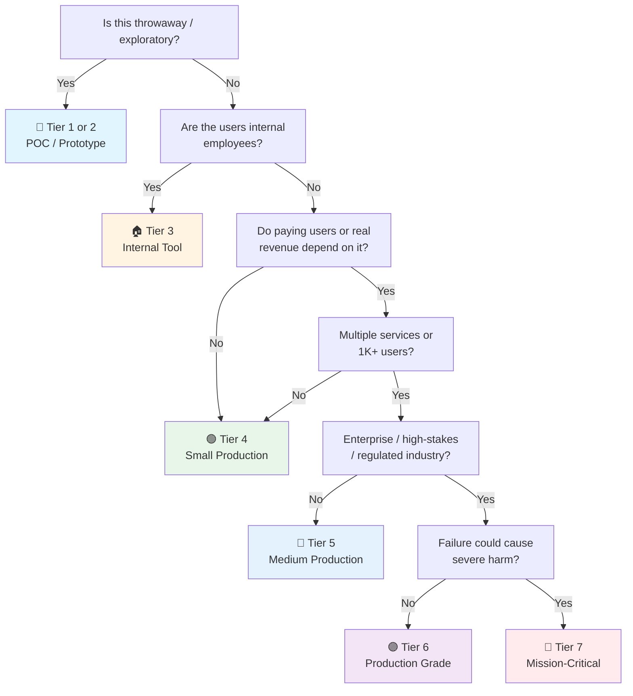

# Cypress E2E Testing Checklist

> The **Cypress-specific** checklist — a deep dive into the Cypress framework for end-to-end and component testing.
> Companion to the general [[qa]] checklist (§4 E2E Testing). Compare with [[playwright]] when choosing a framework.
> Covers Cypress 13+, Component Testing, Cypress Cloud, and cypress-image-snapshot.
> Last updated: 2026-08-07

---

## 1. Setup & Configuration

- [ ] **Install Cypress** — `npm install -D cypress` (or `yarn add -D cypress`, `pnpm add -D cypress`). Cypress bundles its own Electron browser and Node.js runtime.
- [ ] **Open Cypress** — `npx cypress open` launches the Test Runner GUI (interactive mode). First run scaffolds `cypress/` folder structure.
- [ ] **Project structure created**:
  ```
  project/
  ├── cypress/
  │   ├── e2e/                    # E2E spec files (*.cy.js or *.cy.ts)
  │   ├── fixtures/               # Test data (JSON, CSV, etc.)
  │   ├── support/
  │   │   ├── commands.js         # Custom commands
  │   │   ├── e2e.js              # E2E support file (runs before every spec)
  │   │   └── component.js        # Component testing support file
  │   └── downloads/              # Downloaded files from tests
  ├── cypress.config.js           # Main configuration (replaces cypress.json in v10+)
  └── .gitignore                  # Add: cypress/downloads/, cypress/screenshots/, cypress/videos/
  ```
- [ ] **`cypress.config.js` configured** — Core settings:
  ```js
  const { defineConfig } = require('cypress');
  module.exports = defineConfig({
    e2e: {
      baseUrl: 'http://localhost:3000',
      specPattern: 'cypress/e2e/**/*.cy.{js,ts}',
      supportFile: 'cypress/support/e2e.js',
      viewportWidth: 1280,
      viewportHeight: 720,
      video: false,                    // disable video unless debugging
      screenshotOnRunFailure: true,
      retries: { runMode: 2, openMode: 0 },
      defaultCommandTimeout: 10000,
    },
    component: {
      devServer: { framework: 'react', bundler: 'vite' },
      specPattern: 'src/**/*.cy.{js,ts,jsx,tsx}',
    },
  });
  ```
- [ ] **TypeScript configured** (if applicable):
  ```bash
  npm install -D typescript @types/node
  ```
  Add `cypress/tsconfig.json`:
  ```json
  {
    "compilerOptions": {
      "target": "es5",
      "lib": ["es5", "dom"],
      "types": ["cypress", "node"]
    },
    "include": ["**/*.ts"]
  }
  ```
- [ ] **`baseUrl` set** — Avoids `cy.visit('/')` ambiguity. Cypress prepends it to all relative URLs.
- [ ] **Environment variables** — Use `cypress.env.json` (local, gitignored) or `CYPRESS_*` env vars in CI:
  ```json
  {
    "apiUrl": "http://localhost:8080/api",
    "testUserEmail": "test@example.com"
  }
  ```
- [ ] **`.gitignore` updated** — Exclude generated artifacts:
  ```
  cypress/screenshots/
  cypress/videos/
  cypress/downloads/
  cypress.env.json
  ```

---

## 2. Core Commands & Assertions

- [ ] **Querying elements** — Prefer `cy.get('[data-cy=submit]')` with `data-cy` attributes. Avoid CSS selectors tied to implementation detail (`.btn-primary`). Never use text content that might be localized.
- [ ] **Traversal** — `cy.find()`, `.first()`, `.last()`, `.eq(n)`, `.contains()`, `.within()` to scope queries to a parent.
- [ ] **Actions** — `.click()`, `.dblclick()`, `.rightclick()`, `.type()`, `.clear()`, `.check()`, `.uncheck()`, `.select()`, `.trigger()`, `.focus()`, `.blur()`, `.scrollIntoView()`, `.scrollTo()`.
- [ ] **Typing special keys** — `cy.get('input').type('{enter}')`, `{esc}`, `{backspace}`, `{selectall}`, `{movetostart}`, `{movetoend}`.
- [ ] **Assertions (chai + chai-jquery)** —
  ```js
  cy.get('.status').should('have.text', 'Active');
  cy.get('button').should('be.disabled');
  cy.get('input').should('have.value', 'hello');
  cy.get('.list').should('have.length', 5);
  cy.get('.modal').should('be.visible');
  cy.url().should('include', '/dashboard');
  cy.title().should('eq', 'My App');
  ```
- [ ] **Retry-ability understood** — Cypress automatically retries commands preceding an assertion until it passes or times out. Only the *last* command in a chain retries. Use `.should()` callback for complex retry logic:
  ```js
  cy.get('.result').should(($el) => {
    expect($el).to.have.length.greaterThan(0);
    expect($el.first().text()).to.match(/loaded/i);
  });
  ```
- [ ] **`.then()` vs `.should()`** — `.then()` runs once (no retry); `.should()` retries. Use `.then()` for transformations, `.should()` for assertions.
- [ ] **Waiting** — Never use `cy.wait(Number)` (hard-coded delays). Use route aliases or `cy.intercept()` with assertion patterns:
  ```js
  cy.intercept('GET', '/api/users').as('getUsers');
  cy.visit('/users');
  cy.wait('@getUsers').its('response.statusCode').should('eq', 200);
  ```

---

## 3. Custom Commands

- [ ] **Create reusable commands** — Define in `cypress/support/commands.js`:
  ```js
  Cypress.Commands.add('login', (email, password) => {
    cy.session([email, password], () => {
      cy.visit('/login');
      cy.get('[data-cy=email]').type(email);
      cy.get('[data-cy=password]').type(password);
      cy.get('[data-cy=submit]').click();
      cy.url().should('include', '/dashboard');
    });
  });
  ```
- [ ] **Overwrite existing commands** — Customize default behavior:
  ```js
  Cypress.Commands.overwrite('visit', (originalFn, url, options) => {
    return originalFn(url, { ...options, onBeforeLoad(win) {
      // Disable animations globally
      const style = document.createElement('style');
      style.textContent = '* { transition: none !important; animation: none !important; }';
      win.document.head.appendChild(style);
    }});
  });
  ```
- [ ] **TypeScript declarations** — For type-safe custom commands, extend the Cypress namespace:
  ```ts
  declare global {
    namespace Cypress {
      interface Chainable {
        login(email: string, password: string): Chainable<void>;
        dataCy(value: string): Chainable<JQuery<HTMLElement>>;
      }
    }
  }
  ```
- [ ] **`data-cy` helper command** — Convenience shorthand:
  ```js
  Cypress.Commands.add('dataCy', (value) => cy.get(`[data-cy=${value}]`));
  // Usage: cy.dataCy('submit-btn').click();
  ```

---

## 4. Component Testing

- [ ] **Enable component testing** — Configure `component` block in `cypress.config.js` with the correct framework + bundler:
  ```js
  component: {
    devServer: {
      framework: 'react',     // 'vue', 'next', 'svelte', 'solid'
      bundler: 'vite',        // 'webpack'
    },
  }
  ```
- [ ] **Mount components** — Use framework-specific `mount()`:
  ```js
  // React
  import { mount } from 'cypress/react18';
  it('renders button', () => {
    mount(<Button onClick={cy.stub().as('click')}>Click me</Button>);
    cy.get('button').should('have.text', 'Click me').click();
    cy.get('@click').should('have.been.calledOnce');
  });
  ```
- [ ] **Component testing vs E2E** — Component tests run in isolation (no server needed, faster). Use for: component behavior, prop variations, state transitions, accessibility. Use E2E for: full user flows, cross-page interactions, real API calls.
- [ ] **Mock dependencies in component tests** — Stub context providers, API calls, and router:
  ```js
  mount(<UserCard userId={1} />, {
    props: { user: mockUser },
  });
  ```
- [ ] **Styles loaded** — Ensure component tests load the same CSS/theme as production. Use `cypress/support/component.js` to import global styles.

---

## 5. API Stubbing & Network Control

- [ ] **`cy.intercept()` for route interception** — The modern replacement for `cy.route()` / `cy.server()`:
  ```js
  // Stub a response
  cy.intercept('GET', '/api/users', { fixture: 'users.json' }).as('getUsers');

  // Modify a response
  cy.intercept('GET', '/api/users', (req) => {
    req.reply((res) => {
      res.body.push({ id: 99, name: 'Injected User' });
    });
  });

  // Simulate network failure
  cy.intercept('POST', '/api/orders', { forceNetworkError: true });

  // Simulate slow response
  cy.intercept('GET', '/api/data', (req) => {
    req.on('response', (res) => { res.setThrottle(1000); });
  });
  ```
- [ ] **Fixtures for test data** — Store in `cypress/fixtures/`:
  ```js
  cy.intercept('GET', '/api/products', { fixture: 'products.json' });
  // Or load dynamically:
  cy.fixture('users.json').then((users) => { /* use users */ });
  ```
- [ ] **Wait for network calls** — Always alias and wait, never use `cy.wait(ms)`:
  ```js
  cy.intercept('GET', '/api/**').as('apiCall');
  cy.visit('/page');
  cy.wait('@apiCall');
  ```
- [ ] **Test error states** — Stub 500s, 404s, timeouts to verify error UI:
  ```js
  cy.intercept('GET', '/api/data', { statusCode: 500, body: { error: 'Server Error' } });
  cy.visit('/dashboard');
  cy.get('[data-cy=error-message]').should('be.visible');
  ```
- [ ] **Real API vs stubs** — Use stubs for speed and determinism; use real APIs in a separate smoke test suite against staging for integration confidence.

---

## 6. Authentication & Session Management

- [ ] **`cy.session()` for login caching** — Cache authenticated state across tests (Cypress 12+):
  ```js
  Cypress.Commands.add('login', (email, password) => {
    cy.session([email, password], () => {
      cy.visit('/login');
      cy.get('[data-cy=email]').type(email);
      cy.get('[data-cy=password]').type(password);
      cy.get('[data-cy=submit]').click();
      cy.url().should('include', '/dashboard');
    }, {
      validate() {
        cy.request('/api/me').its('status').should('eq', 200);
      },
    });
  });

  // Usage in beforeEach:
  beforeEach(() => {
    cy.login('admin@example.com', 'password');
    cy.visit('/admin');
  });
  ```
- [ ] **API-based login (bypass UI)** — For speed, authenticate via `cy.request()` instead of UI:
  ```js
  Cypress.Commands.add('loginByApi', (email, password) => {
    cy.session([email, password], () => {
      cy.request('POST', '/api/auth/login', { email, password }).then((res) => {
        window.localStorage.setItem('token', res.body.token);
      });
    });
  });
  ```
- [ ] **Multiple roles** — Create separate sessions for different user roles:
  ```js
  cy.login('admin@test.com', 'pass');   // admin session
  cy.login('user@test.com', 'pass');    // user session (separate cache key)
  ```
- [ ] **`cy.origin()` for cross-origin** — Required when auth redirects to an external IdP (Auth0, Okta, Google):
  ```js
  cy.origin('https://auth.example.com', () => {
    cy.get('[name=email]').type('user@example.com');
    cy.get('[name=password]').type('password');
    cy.get('button[type=submit]').click();
  });
  ```
- [ ] **Logout between tests** — `cy.session()` caches per test; use `Cypress.session.clearAllSavedSessions()` in `after()` if tests depend on clean auth state.

---

## 7. Parallel Execution (Cypress Cloud)

- [ ] **Cypress Cloud account** — Sign up at [cloud.cypress.io](https://cloud.cypress.io). Link project with `projectId` in `cypress.config.js`.
- [ ] **Record runs** — Use `--record` flag to send results to Cypress Cloud:
  ```bash
  npx cypress run --record --key <project-key>
  ```
- [ ] **Parallel flag** — Run specs across CI machines:
  ```bash
  npx cypress run --record --parallel --group "E2E"
  ```
- [ ] **CI machine configuration** — Each parallel machine runs the SAME command. Cypress Cloud distributes specs across machines and balances load:
  ```yaml
  # GitHub Actions example
  strategy:
    matrix:
      containers: [1, 2, 3, 4]
  steps:
    - uses: cypress-io/github-action@v6
      with:
        record: true
        parallel: true
        group: "E2E Chrome"
      env:
        CYPRESS_RECORD_KEY: ${{ secrets.CYPRESS_RECORD_KEY }}
  ```
- [ ] **Run grouping** — Separate groups for E2E, component, smoke tests:
  ```bash
  npx cypress run --record --group "Smoke Tests" --spec "cypress/e2e/smoke/**"
  npx cypress run --record --group "Full E2E" --spec "cypress/e2e/full/**"
  ```
- [ ] **Spec balancing** — Cypress Cloud auto-balances spec files across machines based on historical duration (Smart Orchestration). No manual splitting needed.
- [ ] **Cost awareness** — Cypress Cloud has a free tier (500 test results/month). Parallel runs consume results per spec file. Monitor usage.

---

## 8. Visual Regression Testing

- [ ] **`cypress-image-snapshot`** (community) — Plugin for screenshot comparison:
  ```bash
  npm install -D @simonsmith/cypress-image-snapshot
  ```
  Register in `cypress/support/e2e.js`:
  ```js
  const { addMatchImageSnapshotCommand } = require('@simonsmith/cypress-image-snapshot/command');
  addMatchImageSnapshotCommand({
    failureThreshold: 0.03,
    failureThresholdType: 'percent',
    customDiffConfig: { threshold: 0.1 },
    capture: 'viewport',
  });
  ```
- [ ] **Snapshot commands** —
  ```js
  // Full page
  cy.matchImageSnapshot();

  // Specific element
  cy.get('[data-cy=header]').matchImageSnapshot('header-desktop');

  // With custom options
  cy.matchImageSnapshot({ clip: { x: 0, y: 0, width: 800, height: 600 } });
  ```
- [ ] **Update snapshots** — When intentional UI changes occur:
  ```bash
  npx cypress run --env updateSnapshots=true
  ```
- [ ] **Cypress Cloud Visual Testing** (built-in) — Cypress Cloud offers native visual regression with diff UI, without plugins. Requires `--record`. Compare against baseline per branch.
- [ ] **Stabilize before snapshots** — Wait for animations to finish, fonts to load, images to render:
  ```js
  cy.get('img').should('have.prop', 'complete', true);
  cy.window().then((win) => {
    // Wait for all fonts loaded
    return win.document.fonts.ready;
  });
  cy.matchImageSnapshot();
  ```
- [ ] **Environment consistency** — Snapshots are OS/font-sensitive. Run visual tests only in a fixed CI environment (Docker image). Never compare local Mac screenshots against Linux CI baselines.

---

## 9. CI Integration

- [ ] **Headless run** — `npx cypress run` (no GUI). Default browser: Electron. Specify: `--browser chrome` or `--browser firefox`.
- [ ] **Official GitHub Action** — `cypress-io/github-action@v6`:
  ```yaml
  name: E2E Tests
  on: [push]
  jobs:
    cypress-run:
      runs-on: ubuntu-latest
      steps:
        - uses: actions/checkout@v4
        - uses: cypress-io/github-action@v6
          with:
            start: npm run dev
            wait-on: 'http://localhost:3000'
            wait-on-timeout: 120
            browser: chrome
            record: true
          env:
            CYPRESS_RECORD_KEY: ${{ secrets.CYPRESS_RECORD_KEY }}
            GITHUB_TOKEN: ${{ secrets.GITHUB_TOKEN }}
  ```
- [ ] **Start app + wait** — Use `start` + `wait-on` in the GitHub Action, or a separate step:
  ```bash
  npm run dev & npx wait-on http://localhost:3000
  npx cypress run
  ```
- [ ] **Docker image** — Use `cypress/browsers` or `cypress/included` images for consistent CI environments:
  ```yaml
  container: cypress/browsers:node-20.9.0-chrome-118.0.5993.88-1-ff-118.0.2-edge-118.0.2088.46-1
  ```
- [ ] **Artifacts on failure** — Upload screenshots and videos:
  ```yaml
  - uses: actions/upload-artifact@v4
    if: failure()
    with:
      name: cypress-screenshots
      path: cypress/screenshots
  - uses: actions/upload-artifact@v4
    if: failure()
    with:
      name: cypress-videos
      path: cypress/videos
  ```
- [ ] **Split by spec groups** — Use `--spec` to run only relevant specs per CI job (smoke on PR, full on merge to main).
- [ ] **Caching** — Cache `~/.cache/Cypress` (Linux), `~/Library/Caches/Cypress` (macOS), or `%LOCALAPPDATA%\Cypress\Cache` (Windows) to avoid re-downloading Cypress binary.

---

## 10. Debugging & Time-Travel

- [ ] **Time-travel debugging** — Cypress snapshots the DOM after every command. Hover over commands in the Test Runner log to see the DOM at that exact moment. Click to pin a snapshot.
- [ ] **`cy.pause()`** — Pauses execution; step through commands one-by-one in the Test Runner:
  ```js
  cy.get('[data-cy=login]').click();
  cy.pause();  // pause here, step through subsequent commands
  cy.url().should('include', '/dashboard');
  ```
- [ ] **`cy.debug()`** — Breaks into browser DevTools debugger at that point:
  ```js
  cy.get('.result').debug();  // DevTools pauses here
  ```
- [ ] **`debugger` statement** — Add `debugger` in `.then()` callbacks to break in DevTools:
  ```js
  cy.get('.items').then((items) => {
    debugger;  // inspect items in DevTools
  });
  ```
- [ ] **Console output** — Use `cy.log()` for test-relevant messages visible in Test Runner:
  ```js
  cy.log(`Found ${count} items`);
  ```
- [ ] **Verbose logging** — Run with debug environment variables:
  ```bash
  DEBUG=cypress:cli,cypress:server npx cypress run
  ```
- [ ] **Screenshots on failure** — Automatic by default. Use `cy.screenshot('debug-state')` for manual captures:
  ```js
  afterEach(function() {
    if (this.currentTest.state === 'failed') {
      cy.screenshot(`failed-${this.currentTest.title}`);
    }
  });
  ```
- [ ] **Command log inspection** — Each command in the Test Runner shows: the DOM snapshot, request/response bodies (for `cy.intercept`), and assertion details. Click "Print to console" to get the full object.

---

## 11. Common Patterns

- [ ] **Page Object Model (POM)** — Encapsulate page interactions:
  ```js
  // cypress/pages/LoginPage.js
  class LoginPage {
    visit() { cy.visit('/login'); }
    fillEmail(email) { cy.get('[data-cy=email]').type(email); }
    fillPassword(pw) { cy.get('[data-cy=password]').type(pw); }
    submit() { cy.get('[data-cy=submit]').click(); }
    login(email, pw) { this.visit(); this.fillEmail(email); this.fillPassword(pw); this.submit(); }
  }
  export default new LoginPage();
  ```
- [ ] **API helpers** — Reusable `cy.request()` wrappers for setup/teardown:
  ```js
  Cypress.Commands.add('createUser', (overrides = {}) => {
    return cy.request('POST', '/api/test/users', {
      email: 'test@example.com',
      name: 'Test User',
      ...overrides,
    }).its('body');
  });

  Cypress.Commands.add('deleteUser', (id) => {
    return cy.request('DELETE', `/api/test/users/${id}`);
  });
  ```
- [ ] **Database seeding via API** — Reset state before each test:
  ```js
  beforeEach(() => {
    cy.request('POST', '/api/test/reset-db');
    cy.request('POST', '/api/test/seed');
  });
  ```
- [ ] **Handling modals & dialogs** — Stub `window:confirm` and `window:alert`:
  ```js
  cy.on('window:confirm', () => false);  // dismiss confirm dialog
  cy.on('window:alert', cy.stub().as('alert'));
  // Later: cy.get('@alert').should('have.been.calledWith', 'Saved!');
  ```
- [ ] **File upload** — `cy.get('input[type=file]').selectFile('cypress/fixtures/image.png')` (Cypress 9.3+).
- [ ] **iframes** — Use `cypress-iframe` plugin or `cy.get('iframe').its('0.contentDocument.body')`:
  ```js
  cy.get('iframe').its('0.contentDocument').should('exist')
    .its('body').should('not.be.undefined')
    .then(cy.wrap).find('[data-cy=inner-button]').click();
  ```
- [ ] **Multi-tab / new windows** — Cypress does NOT support multiple browser tabs. Stub `window.open` to open in the same tab:
  ```js
  cy.visit('/page', { onBeforeLoad(win) { win.open = cy.stub().as('windowOpen'); } });
  ```
- [ ] **Test tags / filtering** — Use `cypress-grep` or Cypress Cloud tags to selectively run tests:
  ```js
  it('critical flow', { tags: ['@smoke', '@critical'] }, () => { /* ... */ });
  ```
  ```bash
  npx cypress run --env grepTags=@smoke
  ```

---

## 12. Plugins & Ecosystem

- [ ] **`cypress-testing-library`** — Use Testing Library queries for accessible selectors:
  ```bash
  npm install -D @testing-library/cypress
  ```
  ```js
  cy.findByRole('button', { name: /submit/i }).click();
  cy.findByLabelText(/email/i).type('test@example.com');
  ```
- [ ] **`cypress-axe`** — Accessibility testing in E2E:
  ```js
  cy.injectAxe();
  cy.checkA11y(null, { rules: { 'color-contrast': { enabled: false } } });
  ```
- [ ] **`cypress-real-events`** — Fire native browser events (hover, real click vs synthetic):
  ```js
  cy.get('.tooltip-trigger').realHover();
  cy.get('.menu').should('be.visible');
  ```
- [ ] **`cypress-wait-until`** — Custom retry logic:
  ```js
  cy.waitUntil(() => cy.get('.count').then($el => parseInt($el.text()) >= 5));
  ```
- [ ] **Preprocessor plugins** — `@cypress/webpack-preprocessor` or `@cypress/vite-dev-server` for advanced bundling (TypeScript, module aliases, code splitting).

---

## 13. Pitfalls & Anti-Patterns

- [ ] **No `cy.wait(ms)`** — Hard-coded waits are flaky and slow. Always wait for network responses, DOM state, or use assertions that retry.
- [ ] **No conditional testing** — `if/else` on DOM state leads to flaky tests. Use deterministic setup instead:
  ```js
  // BAD: if modal exists, close it
  cy.get('body').then(($body) => {
    if ($body.find('.modal').length) {
      cy.get('.modal-close').click();
    }
  });

  // GOOD: ensure deterministic state in beforeEach
  cy.request('POST', '/api/test/dismiss-all-modals');
  ```
- [ ] **Avoid `cy.visit()` in every test** — Use `cy.session()` to cache login state. Only `cy.visit()` the specific page under test.
- [ ] **Test isolation** — Each test must be independent. Use `beforeEach()` to reset state. No shared state across `it()` blocks.
- [ ] **Don't test implementation** — Test behavior (user sees, user can do), not internal state (React state, Vue reactivity). If refactoring breaks the test without changing behavior, the test is wrong.
- [ ] **Avoid `cy.get('body').find()` chains** — They break retry-ability. Use scoped selectors: `cy.get('[data-cy=container]').find('.item')`.
- [ ] **Don't over-stub** — Stubbing everything makes tests pass even when the real app is broken. Reserve stubs for external dependencies and error simulations. Run a smoke suite against real APIs.
- [ ] **Flaky test quarantine** — When a test flakes, don't just add retries. Investigate root cause (race condition? shared state? animation?). Cypress Cloud's Flake Detection helps identify patterns.
- [ ] **Cypress single-tab limitation** — Cannot test multi-tab flows or OAuth popups that open new tabs. Use `cy.origin()` for cross-origin within the same tab, or stub `window.open`.
- [ ] **Version pinning** — Pin Cypress version in `package.json` (not `^13.x`). Major versions can break plugins and custom commands.

---

## 14. When to Choose Cypress vs Playwright

> Both are excellent. This is not "better/worse" — it's "right tool for this context."

| Factor | Cypress | Playwright |
|---|---|---|
| **Browser support** | Chromium (Chrome/Edge), Firefox, WebKit (experimental in v13+) | Chromium, Firefox, WebKit (full, first-class) |
| **Multi-tab / iframes** | ❌ Single-tab only; iframes require workarounds | ✅ Full multi-tab, multi-page, iframes native |
| **Cross-origin** | `cy.origin()` (v9.6+), limited | Native, seamless |
| **Language** | JavaScript/TypeScript only | JS/TS, Python, Java, .NET, Go |
| **Debugging UX** | ✅ Excellent time-travel, visual Test Runner | Good trace viewer, less visual |
| **Component testing** | ✅ Built-in (React, Vue, Svelte, Angular) | ❌ Not supported natively |
| **API testing** | `cy.request()` — basic | `request` context — full-featured, multiple contexts |
| **Network interception** | `cy.intercept()` — powerful | `page.route()` — equally powerful |
| **Parallel execution** | Cypress Cloud (paid, $) | Free, any CI (sharding built-in) |
| **Visual regression** | Cypress Cloud Visual Testing or `cypress-image-snapshot` | `toHaveScreenshot()` built-in (free) |
| **Speed** | Slightly slower (Electron wrapper) | Faster (direct browser protocol) |
| **Community / ecosystem** | Large, many plugins | Rapidly growing, Microsoft-backed |
| **Mobile testing** | Viewport emulation only | Viewport + device emulation (more accurate) |
| **Learning curve** | Low — great docs, intuitive API | Medium — more concepts (contexts, pages, locators) |
| **CI cost** | Cloud required for parallel (paid) | Free parallel via sharding on any CI |
| **Best for** | Component testing, teams wanting fast setup, visual debugging, JS/TS shops | Multi-browser requirements, multi-language teams, complex cross-origin/multi-tab flows |

### Choose Cypress when:
- You need **component testing** (built-in, no separate tool)
- Your team is **JavaScript/TypeScript only**
- You value the **time-travel debugging** and Test Runner GUI
- Your app doesn't need multi-tab, multi-page, or complex cross-origin flows
- You want the **fastest path** from zero to first E2E test
- You already use Cypress Cloud and the cost is acceptable

### Choose Playwright when:
- You need **true multi-browser** testing (Safari/WebKit is first-class)
- You need **multi-tab**, popups, or complex cross-origin auth flows
- Your team uses **Python, Java, .NET, or Go**
- You want **free parallel execution** on any CI
- You need **mobile device emulation** accuracy
- Budget constraints prevent Cypress Cloud adoption

### Use both when:
- Cypress for **component tests** + Playwright for **E2E** (each tool's strength)
- Different apps in a monorepo have different requirements

---

## Quick Sanity Check

- [ ] Cypress installed, `cypress.config.js` configured with `baseUrl`
- [ ] `data-cy` attributes used for element selection (not CSS/text selectors)
- [ ] `cy.session()` used for login caching (no UI login in every test)
- [ ] `cy.intercept()` aliases + `cy.wait('@alias')` instead of `cy.wait(ms)`
- [ ] Tests are isolated — each `it()` block can run independently
- [ ] Screenshots on failure enabled, videos disabled in CI (unless debugging)
- [ ] Custom commands defined for repeated flows (login, data seeding)
- [ ] CI runs headless with artifacts uploaded on failure
- [ ] No conditional tests, no hard-coded waits, no shared state
- [ ] Visual regression snapshots stabilized (fonts, images, animations)
- [ ] Flaky tests tracked and quarantined (not silently retried)
- [ ] `cypress.env.json` in `.gitignore`, secrets via CI env vars

---

## Project Tier Scoping Matrix

> **How to use this table:** Pick your tier, then focus only on sections marked ✅ (required) or 🟡 (recommended). Skip ❌ sections — they'd be over-engineering.
>
> **Legend:** ✅ Required · 🟡 Recommended / partial · ❌ Skip

### Tier Descriptions

| # | Tier | Description | Typical Team | Users | Lifespan |
|---|---|---|---|---|---|
| 1 | 🧪 **POC / Spike** | Validate an idea. Maybe a smoke test. | 1 dev | Internal only | Days–weeks |
| 2 | 🔧 **Prototype / MVP** | Waiting for user validation. Might become real. | 1–2 devs | Beta testers | Weeks–months |
| 3 | 🏠 **Internal Tool** | Real users (employees), real traffic. No external exposure. | 1–3 devs | Employees | Ongoing |
| 4 | 🟢 **Small Production** | Single service/app, low traffic. Early revenue. | 1–2 devs | < 1K users | Ongoing |
| 5 | 🔵 **Medium Production** | Multiple services or higher traffic. Real revenue. | 2–5 devs | 1K–100K users | Ongoing |
| 6 | 🟣 **Production Grade** | Full rigor — high-stakes SaaS, enterprise product. | 5+ devs | 100K+ users | Long-term |
| 7 | 🔴 **Mission-Critical / Regulated** | Healthcare, finance, safety systems. Failure = severe harm. | 10+ devs | Varies | Decades |

### Which Tier Am I?



### Checklist Applicability by Tier

| # | Section | 🧪 POC | 🔧 Prototype | 🏠 Internal | 🟢 Small Prod | 🔵 Medium Prod | 🟣 Production Grade | 🔴 Mission-Critical |
|---|---|:---:|:---:|:---:|:---:|:---:|:---:|:---:|
| 1 | Setup & Configuration | ✅ basic | ✅ | ✅ | ✅ + TS | ✅ + env vars | ✅ + full | ✅ + audited |
| 2 | Core Commands & Assertions | ✅ | ✅ | ✅ | ✅ | ✅ | ✅ | ✅ + formal |
| 3 | Custom Commands | ❌ | 🟡 login only | ✅ | ✅ + helpers | ✅ + POM | ✅ + full | ✅ + documented |
| 4 | Component Testing | ❌ | ❌ | 🟡 key components | ✅ | ✅ + coverage | ✅ + visual | ✅ + accessible |
| 5 | API Stubbing & Network | ❌ | 🟡 happy path | ✅ | ✅ + errors | ✅ + throttle | ✅ + full matrix | ✅ + chaos |
| 6 | Authentication | ❌ | 🟡 API login | ✅ + session | ✅ + roles | ✅ + cross-origin | ✅ + token rotation | ✅ + formal |
| 7 | Parallel Execution (Cloud) | ❌ | ❌ | ❌ | 🟡 if slow | ✅ 2-4 machines | ✅ 4-8 machines | ✅ + SLA |
| 8 | Visual Regression | ❌ | ❌ | ❌ | 🟡 key pages | ✅ | ✅ + CI gate | ✅ + approved diffs |
| 9 | CI Integration | ❌ | 🟡 on PR | ✅ | ✅ + artifacts | ✅ + parallel | ✅ + full pipeline | ✅ + signed |
| 10 | Debugging & Time-Travel | ✅ | ✅ | ✅ | ✅ | ✅ | ✅ | ✅ |
| 11 | Common Patterns | 🟡 basics | 🟡 | ✅ | ✅ | ✅ + tags | ✅ + POM | ✅ + formal |
| 12 | Plugins & Ecosystem | ❌ | ❌ | 🟡 testing-lib | ✅ + axe | ✅ + full | ✅ + full | ✅ + validated |
| 13 | Pitfalls & Anti-Patterns | ✅ | ✅ | ✅ | ✅ | ✅ | ✅ | ✅ |
| 14 | Cypress vs Playwright | 🟡 decide | 🟡 decide | 🟡 decide | ✅ decide | ✅ | ✅ | ✅ |

---

## Sources

- Complements [[qa]] (§4 E2E Testing, §6 CI Integration).
- Official docs: [docs.cypress.io](https://docs.cypress.io)
- Cypress Cloud: [cloud.cypress.io](https://cloud.cypress.io)
- Cypress Docker images: [github.com/cypress-io/cypress-docker-images](https://github.com/cypress-io/cypress-docker-images)
- Plugin ecosystem: [cypress.io/plugins](https://www.cypress.io/plugins)
- Compare with [[playwright]] for multi-browser/multi-language needs.
