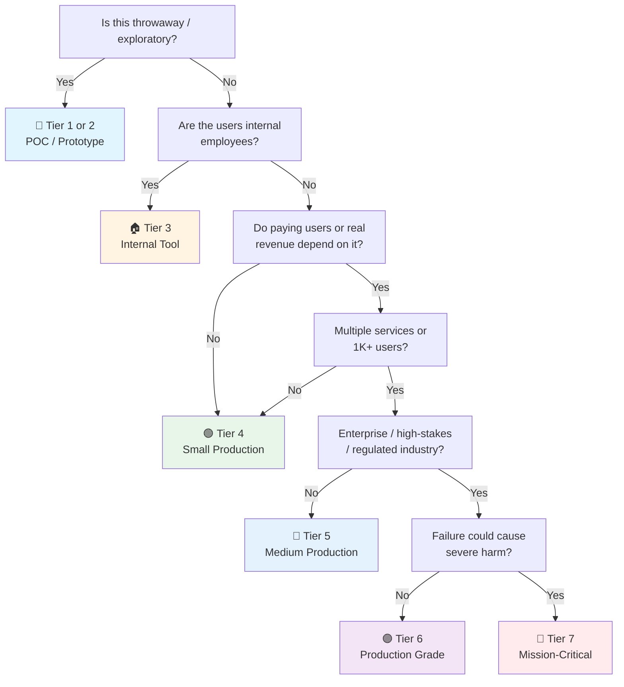

# JUnit 5 Testing Checklist

> The **Java/JVM testing framework** checklist — JUnit Jupiter (JUnit 5) patterns, lifecycle, assertions, and ecosystem integration.
> Horizontal: applies to any Java/Kotlin project — Spring Boot, Micronaut, Quarkus, plain JVM.
> Complements [[QA]] (test strategy, pyramid, shift-left), [[Release]] (CI test gates), and the domain checklists' testing sections.
> Stack note: Panomete Platform runs Spring Boot 4.1 — §6 (Spring Boot Test) and §4 (TestContainers) are critical path.
> Last updated: 2026-08-07

---

## 1. Test Lifecycle & Annotations

- [ ] **@Test on every test method** — Each test method annotated with `@Test` (JUnit Jupiter). No public methods silently running as tests — the annotation is explicit.
- [ ] **@BeforeEach / @AfterEach for per-test setup/teardown** — Instance-level lifecycle: runs before/after every `@Test`. Used for resetting state, initializing test data, closing resources scoped to one test.
- [ ] **@BeforeAll / @AfterAll for expensive shared setup** — Static (or `@TestInstance(PER_CLASS)`) lifecycle: runs once per test class. Reserved for truly expensive resources — DB connections, HTTP servers, container starts. Not for data that should be fresh per test.
- [ ] **@TestInstance lifecycle chosen deliberately** — `PER_METHOD` (default, JUnit 4-compatible) vs `PER_CLASS` (shared instance, allows non-static `@BeforeAll`). Picked once per project, documented. `PER_CLASS` enables constructor injection and non-static lifecycle methods but risks shared mutable state.
- [ ] **@DisplayName for human-readable test names** — Every test has a `@DisplayName("should reject empty email")` for reporting and IDE readability. Method names stay technical; display names tell the story.
- [ ] **@Nested for grouping related tests** — Inner `@Nested` classes group tests by scenario or behavior (e.g., `@Nested class WhenUserExists`, `@Nested class WhenUserNotFound`). Each nested class gets its own `@BeforeEach`. Keeps large test classes navigable.
- [ ] **@Disabled with reason and ticket** — `@Disabled("PAN-1234 — flaky on CI, investigating")` on skipped tests. Never `@Disabled` without a reason and a tracking ticket. Disabled tests are defects-in-waiting.
- [ ] **@Tag for filtering** — Tests tagged by category (`@Tag("slow")`, `@Tag("integration")`, `@Tag("smoke")`). CI runs tag subsets: `@Tag("unit")` on every commit, `@Tag("integration")` nightly.
- [ ] **@Timeout on risky tests** — `@Timeout(value = 5, unit = SECONDS)` on tests that could hang (network calls, deadlocks). Prevents suite hangs from masking real failures.
- [ ] **@RepeatedTest for flake detection** — `@RepeatedTest(100)` during development to prove a test is deterministic. Not left in production suites.
- [ ] **Execution order controlled when needed** — `@TestMethodOrder(MethodOrderer.OrderAnnotation.class)` with `@Order(1)` when order matters (integration tests with state). Unit tests remain order-independent.

## 2. Assertions

### 2.1 JUnit Jupiter Assertions (Built-in)

- [ ] **assertEquals / assertNotEquals** — Value equality with optional `Supplier<String>` message for failure context. `assertEquals(expected, actual, () -> "User " + id + " mismatch")`.
- [ ] **assertTrue / assertFalse / assertNull / assertNotNull** — Boolean and null checks. Always pass a failure message: `assertTrue(result.isValid(), "Validation should pass for " + input)`.
- [ ] **assertThrows for exception testing** — `assertThrows(IllegalArgumentException.class, () -> service.process(null))`. Capture the return value to assert on the exception message or fields.
- [ ] **assertAll for grouped assertions** — `assertAll("user", () -> assertEquals("John", user.getName()), () -> assertEquals(30, user.getAge()))`. All assertions run even if one fails — full picture on failure.
- [ ] **assertDoesNotThrow for no-exception verification** — `assertDoesNotThrow(() -> service.process(validInput))` when the expected behavior is "no exception thrown."
- [ ] **assertTimeout / assertTimeoutPreemptively** — Performance-sensitive tests with a time bound. `assertTimeoutPreemptively` actually kills the test thread; `assertTimeout` only fails after completion.
- [ ] **assertIterableEquals / assertArrayEquals** — Collection and array equality. Use `assertIterableEquals` for `List`/`Set` comparisons with order-sensitive checks.
- [ ] **assertLinesMatch for text/log comparison** — Regex-friendly line-by-line comparison. Great for asserting log output, error messages, or generated text.

### 2.2 AssertJ (Fluent Assertions)

- [ ] **assertThat() as primary assertion entry point** — `assertThat(user).isNotNull()` — fluent, IDE-discoverable, self-documenting. Preferred over raw JUnit assertions for complex objects.
- [ ] **Collection assertions** — `assertThat(users).hasSize(3).extracting("name").contains("Alice", "Bob").doesNotContainNull()`. Far more readable than nested JUnit asserts.
- [ ] **Exception assertions** — `assertThatThrownBy(() -> service.process(null)).isInstanceOf(IllegalArgumentException.class).hasMessageContaining("null")`. Captures and asserts in one chain.
- [ ] **Soft assertions for full failure reporting** — `SoftAssertions softly = new SoftAssertions(); softly.assertThat(...); softly.assertAll();` — collects all failures before reporting. Equivalent to `assertAll` but with AssertJ fluency.
- [ ] **Custom assertions for domain objects** — `assertThat(user).hasEmail("john@example.com").isActive()`. Generated via AssertJ assertion generator or hand-written. Makes tests read like acceptance criteria.
- [ ] **Recursive comparison** — `assertThat(actual).usingRecursiveComparison().ignoringFields("id", "createdAt").isEqualTo(expected)`. Deep object graph comparison without manual field-by-field asserts.
- [ ] **JSON assertions (assertj-json / json-unit)** — `assertThat(jsonString).isEqualTo("{\"name\":\"John\"}")` with lenient mode for field ordering. Essential for API response testing.

### 2.3 Hamcrest (Matcher-based)

- [ ] **Used only when already in the codebase** — Hamcrest (`assertThat(x, is(equalTo(y)))`) is legacy in most Java projects. New code uses AssertJ. Migrate existing Hamcrest tests incrementally.
- [ ] **Custom matchers for complex predicates** — `assertThat(result, hasProperty("status", is("ACTIVE")))`. Useful when the predicate is reusable across many tests. Otherwise prefer AssertJ conditions.
- [ ] **No mixing within a test** — Pick one assertion library per test method. `assertThat` (AssertJ) and `assertThat` (Hamcrest) have the same name — imports determine behavior, and mixing confuses readers.

## 3. Parameterized Tests

- [ ] **@ParameterizedTest with @ValueSource** — `@ValueSource(strings = {"a", "b", "c"})` for simple parameter sets. Replaces copy-pasted test methods that differ only in input.
- [ ] **@CsvSource for multi-parameter tests** — `@CsvSource({"1, ONE", "2, TWO", "3, THREE"})` for input/expected pairs. Auto-converts types.
- [ ] **@CsvFileSource for large datasets** — `@CsvFileSource(resources = "/test-data/users.csv")` when test data exceeds a few rows. CSV file lives in `src/test/resources/`.
- [ ] **@EnumSource for enum coverage** — `@EnumSource(value = Status.class, names = {"ACTIVE", "PENDING"})` to test all or selected enum values. Ensures every enum variant is handled.
- [ ] **@MethodSource for complex factory methods** — `@MethodSource("provideUsers")` referencing a `static Stream<Arguments>` method. Used when test data requires construction logic.
- [ ] **@ArgumentsSource for reusable providers** — Custom `ArgumentsProvider` implementation for test data shared across test classes. Promotes DRY test data.
- [ ] **@ParameterizedTest + @NullSource / @EmptySource** — `@NullAndEmptySource` to test null and empty string handling explicitly. Boundary cases that production code *will* see.
- [ ] **DisplayName per invocation** — `@ParameterizedTest(name = "{index}: process({0}) → {1}")` for clear failure reporting. Know which parameter set failed without digging.
- [ ] **ArgumentConverter for custom types** — `@ConvertWith(UserConverter.class)` when CSV/MethodSource produces strings that need conversion to domain objects.

## 4. TestContainers Integration

- [ ] **TestContainers dependency configured** — `org.testcontainers:testcontainers`, `org.testcontainers:junit-jupiter`, and the module for your database (`org.testcontainers:postgresql`). Version managed via BOM.
- [ ] **@Testcontainers + @Container on the class** — `@Testcontainers` on the test class, `@Container` on the `static` container field. Container lifecycle managed by JUnit extension.
- [ ] **Containers started once, shared across tests** — `static final` container with `@BeforeAll` startup. Avoid per-test container restart — 30-second container starts kill suite speed.
- [ ] **Dynamic datasource configuration** — `@DynamicPropertySource` (Spring) or `@Testcontainers` JUnit integration to inject container host/port into application config. No hardcoded ports.
- [ ] **PostgreSQL / MySQL container for DB tests** — Real database engine, not H2. Schema compatibility, constraint behavior, and SQL dialect match production. `PostgreSQLContainer<>("postgres:16")`.
- [ ] **Redis / Kafka / RabbitMQ containers for middleware** — `GenericContainer` or module-specific containers for integration tests that touch message brokers or caches.
- [ ] **Docker Compose integration** — `@Testcontainers` with `DockerComposeContainer` for multi-service setups. Matches docker-compose.yml used in dev/staging environments.
- [ ] **Container reuse across test classes** — `testcontainers.reuse.enable=true` in `.testcontainers.properties` + `.withReuse(true)` on containers. Containers persist between test class runs during development (CI always cleans up).
- [ ] **Wait strategies configured** — `.waitingFor(Wait.forHttp("/health").forPort(8080))` to ensure containers are ready before tests run. No arbitrary `Thread.sleep()`.
- [ ] **Init scripts for schema seeding** — `.withInitScript("schema.sql")` or `.withCopyFileToContainer()` for pre-populating containers with schema and seed data.
- [ ] **CI environment supports Docker** — CI runners have Docker available (Docker-in-Docker or Docker socket mount). TestContainers requires Docker daemon access. Documented in CI config.

## 5. Mockito

- [ ] **@ExtendWith(MockitoExtension.class) on test classes** — Enables `@Mock`, `@InjectMocks`, `@Spy` annotations. No manual `MockitoAnnotations.openMocks()` calls.
- [ ] **@Mock for collaborators** — `@Mock UserRepository userRepository;` — mock the boundary (external calls, DB, HTTP), not internal logic.
- [ ] **@InjectMocks for the class under test** — `@InjectMocks UserService userService;` — Mockito injects mocks into the service. Constructor injection preferred over field injection.
- [ ] **when().thenReturn() for stubbing** — `when(userRepository.findById(1L)).thenReturn(Optional.of(user));` — explicit stubs with clear input/output.
- [ ] **verify() for interaction checking** — `verify(emailService).sendWelcome(user.getEmail());` — verify side effects happened. Use `verifyNoInteractions()` to confirm nothing was called.
- [ ] **Argument matchers used correctly** — `any()`, `anyLong()`, `eq()`, `argThat()`. Never mix raw values and matchers in the same call — `eq()` wraps raw values when other args use matchers.
- [ ] **ArgumentCaptor for complex verification** — `ArgumentCaptor<Email> captor = ArgumentCaptor.forClass(Email.class); verify(emailService).send(captor.capture()); assertThat(captor.getValue().getTo()).isEqualTo(...);`.
- [ ] **@Spy for partial mocking** — `@Spy` on real objects when you need to verify some calls but let others execute. Used sparingly — partial mocks are a code smell indicator.
- [ ] **Mockito strict stubs (default)** — `MockitoExtension` enforces strict stubbing by default. Unused stubs fail the test — catches dead stubs from refactored code.
- [ ] **No mocking of value objects or DTOs** — Create real instances of `User`, `Order`, `Address`. Mocking data classes creates brittle tests that break on every field addition.
- [ ] **Mockito.reset() avoided** — Resetting mocks between tests indicates shared mock state. Use `@Mock` (fresh per test with MockitoExtension) instead.
- [ ] **Mockito Answer for dynamic behavior** — `when(repo.save(any())).thenAnswer(inv -> { User u = inv.getArgument(0); u.setId(42L); return u; });` — for callbacks, ID generation, or state-dependent returns.

## 6. Spring Boot Test

### 6.1 Full Context (@SpringBootTest)

- [ ] **@SpringBootTest for integration tests** — Loads full application context. Used for end-to-end component tests (service → repository → database). Expensive — use sparingly.
- [ ] **@SpringBootTest(webEnvironment = RANDOM_PORT)** — Starts embedded server on random port for HTTP-level integration tests. `TestRestTemplate` or `WebTestClient` for requests.
- [ ] **@SpringBootTest(webEnvironment = DEFINED_PORT) avoided** — Hardcoded ports conflict in parallel execution. Always RANDOM_PORT unless testing port-specific configuration.
- [ ] **@ActiveProfiles for test configuration** — `@ActiveProfiles("test")` loads `application-test.yml`. Test-specific DB URLs, feature flags, reduced logging. Never use default profile in tests.
- [ ] **@TestPropertySource for overrides** — `@TestPropertySource(properties = {"spring.datasource.url=jdbc:tc:postgresql:16:///testdb"})` for inline config overrides.
- [ ] **@DirtiesContext used sparingly** — `@DirtiesContext(classMode = AFTER_CLASS)` when a test modifies the ApplicationContext. Context reload is expensive — minimize use.
- [ ] **@MockBean for replacing Spring beans** — `@MockBean PaymentGateway gateway;` replaces the real bean in the context with a Mockito mock. Used for external service isolation in integration tests.
- [ ] **@SpyBean for partial bean mocking** — `@SpyBean AuditService audit;` wraps the real bean, allowing selective stubbing while preserving real behavior for other methods.

### 6.2 Slice Testing

- [ ] **@WebMvcTest for controller layer** — Loads only the web layer (controllers, @ControllerAdvice, filters). No service/repository beans — use `@MockBean` for dependencies. Fast, focused.
- [ ] **@DataJpaTest for repository layer** — Loads only JPA repositories, entities, and an embedded/test DB. Auto-configures `TestEntityManager`. `@AutoConfigureTestDatabase(replace = NONE)` to use TestContainers instead of H2.
- [ ] **@JsonTest for JSON serialization** — Loads only Jackson configuration. Tests `@JsonFormat`, custom serializers/deserializers, and DTO mapping without the full context.
- [ ] **@RestClientTest for REST clients** — Tests `RestClient`/`RestTemplate` configuration with `MockRestServiceServer`. Validates request building, headers, error handling.
- [ ] **@MyBatisTest / @JooqTest for alternative ORMs** — Slice tests for non-JPA persistence layers. Same pattern: load only the relevant slice.

### 6.3 Test Utilities & Patterns

- [ ] **TestRestTemplate / WebTestClient** — `@Autowired TestRestTemplate restTemplate;` for `@SpringBootTest(RANDOM_PORT)` integration tests. `WebTestClient` for reactive/WebFlux apps.
- [ ] **MockMvc for controller testing** — `@Autowired MockMvc mockMvc;` in `@WebMvcTest`. `mockMvc.perform(get("/api/users/1")).andExpect(status().isOk()).andExpect(jsonPath("$.name").value("John"))`.
- [ ] **@Sql for test data loading** — `@Sql(scripts = "classpath:test-data/users.sql")` to execute SQL before/after tests. `@Sql(executionPhase = AFTER_TEST_METHOD)` for cleanup.
- [ ] **@Transactional on integration tests** — Auto-rollback after each test. But: only works for single-datasource, single-transaction tests. Doesn't test actual commit behavior. Use `@Commit` selectively for commit-path testing.
- [ ] **@AutoConfigureTestDatabase strategy chosen** — `replace = ANY` (default, uses embedded DB) vs `replace = NONE` (uses TestContainers). For Panomete: `replace = NONE` with TestContainers PostgreSQL.
- [ ] **Spring profiles for environment simulation** — `@ActiveProfiles({"test", "external-mocks"})` for layered test configurations. Compose profiles for different test scenarios.

## 7. Coverage & JaCoCo

- [ ] **JaCoCo Maven/Gradle plugin configured** — `jacoco-maven-plugin` (Maven) or `jacoco` plugin (Gradle) with exec and report goals. Generates `.exec` data file and HTML/XML reports.
- [ ] **Line + branch coverage enabled** — JaCoCo measures line, branch, method, class, instruction, and complexity coverage. Line + branch are the primary metrics.
- [ ] **Coverage thresholds enforced** — `check` goal with `minimum` rules: 80% line coverage on business logic packages, 0% on generated code. Fails the build when coverage drops.
- [ ] **Exclusion rules for non-testable code** — Exclude DTOs, configuration classes, `main()` methods, generated code (MapStruct, Lombok). `.classfiles.excludes` in JaCoCo config.
- [ ] **Diff coverage in CI** — PR-level coverage report showing coverage of *changed lines only*. A PR that adds 50 untested lines should fail even if overall coverage is 85%.
- [ ] **HTML report in CI artifacts** — JaCoCo HTML report uploaded as CI artifact. Developers can browse uncovered lines without running tests locally.
- [ ] **SonarQube integration** — JaCoCo XML report consumed by SonarQube for trend tracking, quality gates, and per-package breakdown.
- [ ] **Coverage is a floor, not a ceiling** — 80% on business logic is the minimum. The *right* 80% matters more than the number. Mutation testing (§8) validates coverage quality.

## 8. Parallel Execution

- [ ] **junit-platform.properties configured** — `src/test/resources/junit-platform.properties` with `junit.jupiter.execution.parallel.enabled=true`. Enables parallel test execution.
- [ ] **Parallel mode chosen per scope** — `junit.jupiter.execution.parallel.mode.classes.default=concurrent` (classes run in parallel, methods sequential within a class) is the safest default. `concurrent` for methods requires thread-safe tests.
- [ ] **Thread count configured** — `junit.jupiter.execution.parallel.config.strategy=dynamic` (auto based on CPU cores) or `fixed` with explicit count. CI runners have different core counts — dynamic adapts.
- [ ] **@ResourceLock for shared resources** — `@ResourceLock("database")` on tests that modify shared state (DB, files). JUnit serializes tests with the same lock. Prevents race conditions in parallel suites.
- [ ] **@Isolated for truly serial tests** — `@Isolated` on tests that cannot run in parallel with anything (e.g., tests that modify system properties or global singletons).
- [ ] **No shared mutable state** — Each test creates its own objects, DB rows, files. Shared static fields = parallel execution nightmare. `@BeforeAll` creates shared *immutable* resources only.
- [ ] **ThreadLocal for test-scoped state** — When tests need thread-local context (security context, locale), use `ThreadLocal` or JUnit's `ExtensionContext.Store`. Never static fields.
- [ ] **Database parallelism strategy** — Separate schemas/databases per parallel thread, or `@ResourceLock("database")` to serialize DB-touching tests. Connection pool sized for parallelism.
- [ ] **TestContainers in parallel** — Shared container via `static` field + `@BeforeAll`, or container-per-thread with dynamic ports. Never share a container port across parallel tests.
- [ ] **CI sharding for large suites** — Beyond in-process parallelism: split test classes across CI runners. Gradle `--parallel` + test distribution, or Maven Surefire `forkCount`.

## 9. Advanced Patterns

- [ ] **Custom JUnit 5 extensions** — `@ExtendWith` for cross-cutting test concerns: timing, logging, database reset, API rate limiting. Extensions compose better than base classes.
- [ ] **@RegisterExtension for programmatic extensions** — `@RegisterExtension static MyExtension ext = new MyExtension();` when the extension needs constructor configuration.
- [ ] **Test fixtures / builders** — `UserBuilder.aUser().withName("John").withEmail("john@test.com").build()` — fluent builders for test data. Eliminates constructor sprawl and makes intent clear.
- [ ] **ArchUnit for architecture tests** — `@ArchTest` rules that enforce package dependencies, naming conventions, annotation usage. `noClasses().that().resideInAPackage("..service..").should().accessClassesThat().resideInAPackage("..controller..")`.
- [ ] **Awaitility for async testing** — `await().atMost(5, SECONDS).untilAsserted(() -> assertThat(eventBus.getEvents()).hasSize(1));` — replaces `Thread.sleep()` in async/event-driven tests.
- [ ] **@TestFactory for dynamic tests** — `@TestFactory Stream<DynamicTest>` for generating tests at runtime. Useful when test cases come from external sources (files, APIs).
- [ ] **Lifecycle callbacks via ExtensionContext** — Extensions that run before/after all tests, per class, per method. `BeforeAllCallback`, `AfterEachCallback`, etc. More composable than inheritance.
- [ ] **Conditional test execution** — `@EnabledOnOs(OS.LINUX)`, `@EnabledIfEnvironmentVariable(named = "CI", matches = "true")`, `@EnabledIf("isDockerAvailable")`. Skip tests based on runtime conditions.
- [ ] **Test interfaces for shared behavior** — Default methods on interfaces with `@Test` annotations. Multiple test classes implement the interface to inherit test methods. Replaces abstract base test classes.
- [ ] **Mutation testing (PIT)** — PITest mutates production code, tests should detect the mutation. `mvn org.pitest:pitest-maven:mutationCoverage`. Run on business logic packages in CI or nightly. Kills "green but meaningless" coverage.

## 10. Common Pitfalls

- [ ] **No Thread.sleep() in tests** — Use Awaitility, TestContainers wait strategies, or `@Timeout`. Sleep-based tests are flaky and slow.
- [ ] **No catch-and-assert on exceptions** — Use `assertThrows` or `assertThatThrownBy`. `try { ... } catch (Exception e) { assertEquals(...) }` silently passes if no exception is thrown.
- [ ] **No assertion on mock verify alone** — `verify(mock).method()` without asserting the result. Verify confirms interaction happened, not that the system behaved correctly. Assert on outcomes, verify on side effects.
- [ ] **No @BeforeAll for per-test data** — `@BeforeAll` runs once. If test data should be fresh per test, use `@BeforeEach`. Shared `@BeforeAll` data leads to test interdependence.
- [ ] **No H2 in integration tests** — H2 is not PostgreSQL/MySQL. SQL dialect differences, constraint behavior, and index usage differ. Use TestContainers for real database engines.
- [ ] **No @SpringBootTest for unit tests** — Loading the full Spring context for a unit test wastes 5–15 seconds per test. Use `@WebMvcTest`, `@DataJpaTest`, or plain Mockito for unit-level tests.
- [ ] **No asserting on implementation details** — Tests should verify behavior (output, state changes, side effects), not internal method calls. Testing internals = refactoring breaks tests without bugs.
- [ ] **No ignored test without ticket** — `@Disabled` or `@Ignore` without a tracking issue = permanent dead code. Every disabled test has an owner and a deadline.
- [ ] **No random data without seeds** — `Random` or `UUID` in tests without deterministic seeds = non-reproducible failures. Use `@FixedSeed` or seeded `Random` for reproducible randomness.
- [ ] **No time-dependent tests without Clock injection** — `LocalDateTime.now()` in production code makes tests time-dependent. Inject `Clock` and use `Clock.fixed()` in tests.
- [ ] **No static mutable state** — `static` fields modified by tests = parallel execution failures and order-dependent tests. Use instance fields or `ThreadLocal`.
- [ ] **No copy-pasted test methods** — 10 methods differing only in input = `@ParameterizedTest`. Copy-paste tests are maintenance debt that never gets paid.

---

## Quick Sanity Check Before Merge

- [ ] All `@Test` methods have meaningful `@DisplayName`
- [ ] No `@Disabled` without ticket reference and reason
- [ ] Assertions use AssertJ or JUnit Jupiter (no mixing, no Hamcrest in new code)
- [ ] Integration tests use TestContainers, not H2
- [ ] Spring tests use slice annotations (`@WebMvcTest`, `@DataJpaTest`) where possible
- [ ] `@MockBean` / `@SpyBean` only in integration tests, `@Mock` in unit tests
- [ ] JaCoCo coverage ≥ 80% on business logic packages
- [ ] No `Thread.sleep()` — use Awaitility or wait strategies
- [ ] Parameterized tests replace duplicated test methods
- [ ] Parallel execution enabled with `@ResourceLock` on shared-resource tests
- [ ] Test names follow project convention (`Method_Scenario_Expected` or `Given_When_Then`)
- [ ] No shared mutable static state between tests

---

## Project Tier Scoping Matrix

> **How to use this table:** Pick your tier first, then focus only on the sections marked ✅ (required) or 🟡 (recommended). Skip ❌ sections entirely — they'd be over-engineering for your context.
>
> **Legend:** ✅ Required · 🟡 Recommended / partial · ❌ Skip

### Tier Descriptions

| # | Tier | Description | Typical Team | Users | Lifespan |
|---|---|---|---|---|---|
| 1 | 🧪 **POC / Spike** | Validate an idea. Maybe a smoke test. | 1 dev | Internal only | Days–weeks |
| 2 | 🔧 **Prototype / MVP** | Waiting for integration or user validation. Might become real. | 1–2 devs | Beta testers | Weeks–months |
| 3 | 🏠 **Internal Tool** | Real users (employees), real traffic. No external exposure or paying customers. | 1–3 devs | Employees | Ongoing |
| 4 | 🟢 **Small Production** | Single service/app, low traffic. Real users, maybe early revenue. | 1–2 devs | < 1K users | Ongoing |
| 5 | 🔵 **Medium Production** | Multiple services or higher traffic. Real revenue or user base that matters. | 2–5 devs | 1K–100K users | Ongoing |
| 6 | 🟣 **Production Grade** | Full rigor — high-stakes SaaS, enterprise product, or large user base. | 5+ devs | 100K+ users | Long-term |
| 7 | 🔴 **Mission-Critical / Regulated** | Healthcare (HIPAA), finance (PCI-DSS), safety systems. Failure = severe harm. | 10+ devs | Varies | Decades |

### Which Tier Am I?

### Checklist Applicability by Tier

| # | Section | 🧪 POC | 🔧 Prototype | 🏠 Internal | 🟢 Small Prod | 🔵 Medium Prod | 🟣 Production Grade | 🔴 Mission-Critical |
|---|---|:---:|:---:|:---:|:---:|:---:|:---:|:---:|
| 1 | Lifecycle & Annotations | 🟡 @Test only | 🟡 + lifecycle | ✅ + @Nested/@Tag | ✅ + @Timeout | ✅ + full | ✅ + @RepeatedTest | ✅ + formal V&V |
| 2 | Assertions | 🟡 JUnit basic | 🟡 + AssertJ | ✅ AssertJ standard | ✅ + soft assert | ✅ + custom assert | ✅ + recursive cmp | ✅ + formal oracle |
| 3 | Parameterized Tests | ❌ | 🟡 @ValueSource | ✅ + @CsvSource | ✅ + @EnumSource | ✅ + @MethodSource | ✅ + @ArgumentsSource | ✅ + exhaustive |
| 4 | TestContainers | ❌ | 🟡 single DB | ✅ + middleware | ✅ + compose | ✅ + reuse | ✅ + CI-integrated | ✅ + prod-parity |
| 5 | Mockito | 🟡 basic mock | 🟡 + verify | ✅ + strict stubs | ✅ + captor | ✅ + Answer | ✅ + custom ext | ✅ + formal |
| 6 | Spring Boot Test | ❌ | 🟡 @SpringBootTest | ✅ + slice tests | ✅ + @MockBean | ✅ + @WebMvcTest full | ✅ + profiles | ✅ + audit trail |
| 7 | Coverage (JaCoCo) | ❌ | ❌ | 🟡 basic report | ✅ 80% threshold | ✅ + diff coverage | ✅ + SonarQube | ✅ + regulatory |
| 8 | Parallel Execution | ❌ | ❌ | ❌ | 🟡 classes parallel | ✅ + @ResourceLock | ✅ + CI sharding | ✅ + deterministic |
| 9 | Advanced Patterns | ❌ | ❌ | 🟡 builders | 🟡 + ArchUnit | ✅ + Awaitility + PIT | ✅ + @TestFactory | ✅ + formal V&V |
| 10 | Common Pitfalls | 🟡 read only | 🟡 read only | ✅ enforce | ✅ enforce | ✅ enforce | ✅ enforce + audit | ✅ enforce + sign-off |

---

## Sources

- Complements [[qa]] (test strategy & pyramid), [[Release]] (CI test gates), [[Security]] (SAST/DAST).
- JUnit 5 User Guide: https://junit.org/junit5/docs/current/user-guide/
- Spring Boot Testing: https://docs.spring.io/spring-boot/docs/current/reference/html/features.html#features.testing
- TestContainers: https://www.testcontainers.org/
- AssertJ: https://assertj.github.io/doc/
- JaCoCo: https://www.jacoco.org/jacoco/trunk/doc/
- PITest: https://pitest.org/
- ArchUnit: https://www.archunit.org/
- Awaitility: https://github.com/awaitility/awaitility
