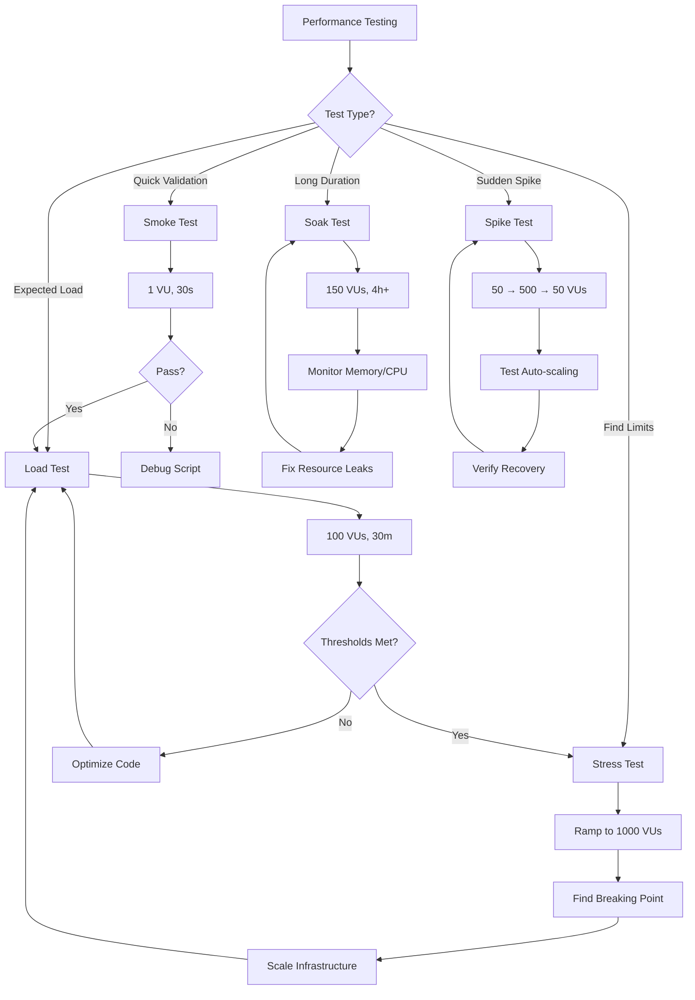

# k6 Performance Testing Checklist

> Comprehensive load testing with k6 (Grafana Labs). Covers script structure, scenarios, thresholds, custom metrics, distributed testing, CI integration, and real-world patterns.
> Companion to the general [QA checklist](qa.md). For Spring Boot APIs and Go services.
> Last updated: 2026-08-07

---

## Quick Sanity Check

Before running any performance test:

- [ ] **Baseline established** — Single-user test passes, response times < 100ms for health endpoints
- [ ] **Environment isolated** — Test environment matches production (CPU, memory, DB, network)
- [ ] **Data prepared** — Test data volume matches expected production load (10K+ users, 100K+ records)
- [ ] **Thresholds defined** — p95 latency, error rate, throughput targets documented
- [ ] **Monitoring active** — Application metrics (CPU, memory, DB connections) being collected
- [ ] **Rollback plan** — Database cleanup script ready, can restore to pre-test state

---

## 1. Setup & Installation

- [ ] **Install k6** — Choose your platform:
  ```bash
  # macOS (Homebrew)
  brew install k6
  
  # Windows (Chocolatey)
  choco install k6
  
  # Linux (Debian/Ubuntu)
  sudo gpg -k
  sudo gpg --no-default-keyring --keyring /usr/share/keyrings/k6-archive-keyring.gpg --keyserver hksps://keyserver.ubuntu.com --recv-keys C5AD17C747E3415A3642D57D77C6C491D6AC1D69
  echo "deb [signed-by=/usr/share/keyrings/k6-archive-keyring.gpg] https://dl.k6.io/deb stable main" | sudo tee /etc/apt/sources.list.d/k6.list
  sudo apt-get update
  sudo apt-get install k6
  
  # Docker
  docker pull grafana/k6
  docker run --rm -i grafana/k6 run - <script.js
  ```

- [ ] **Verify installation**:
  ```bash
  k6 version
  # Expected: k6 v0.50.0 (or newer)
  ```

- [ ] **Essential extensions** (optional):
  ```bash
  # k6 with extensions (xk6)
  go install go.k6.io/xk6/cmd/xk6@latest
  xk6 build --with github.com/grafana/xk6-output-prometheus-remote
  xk6 build --with github.com/grafana/xk6-dashboard
  ```

- [ ] **Project structure**:
  ```
  performance-tests/
  ├── scripts/
  │   ├── smoke.js           # Quick validation (1 VU, 30s)
  │   ├── load.js            # Normal load test
  │   ├── stress.js          # Find breaking point
  │   └── soak.js            # Long-duration test (4h+)
  ├── data/
  │   ├── users.csv          # Test user credentials
  │   └── products.json      # Product catalog
  ├── lib/
  │   ├── auth.js            # Login helper
  │   └── assertions.js      # Custom checks
  ├── config/
  │   ├── thresholds.json    # Threshold definitions
  │   └── scenarios.json     # Scenario configurations
  └── reports/
      └── (generated HTML/JSON reports)
  ```

---

## 2. Script Structure

k6 scripts have four lifecycle functions. Understanding the execution model is critical.

- [ ] **Script anatomy** — Complete template:
  ```javascript
  import http from 'k6/http';
  import { check, sleep } from 'k6';
  import { Trend, Counter, Rate } from 'k6/metrics';
  
  // INIT context: runs once per VU at startup
  // Import modules, define custom metrics, load test data
  const BASE_URL = __ENV.BASE_URL || 'http://localhost:8080';
  const users = open('./data/users.csv').split('\n');
  
  // Custom metrics (defined in init context)
  const loginDuration = new Trend('login_duration');
  const failedLogins = new Counter('failed_logins');
  const errorRate = new Rate('errors');
  
  // SETUP: runs once before all VUs start
  export function setup() {
    // Authenticate, create test data, warm up caches
    const res = http.post(`${BASE_URL}/api/auth/login`, JSON.stringify({
      username: 'admin',
      password: 'admin123'
    }), {
      headers: { 'Content-Type': 'application/json' }
    });
    
    check(res, { 'setup login successful': (r) => r.status === 200 });
    
    // Return data to be passed to default() and teardown()
    return { authToken: res.json('token') };
  }
  
  // DEFAULT: runs repeatedly by each VU during the test
  export default function(data) {
    // data contains the object returned from setup()
    const headers = {
      'Authorization': `Bearer ${data.authToken}`,
      'Content-Type': 'application/json'
    };
    
    // Perform requests
    const res = http.get(`${BASE_URL}/api/users`, { headers });
    
    // Validate responses
    check(res, {
      'status is 200': (r) => r.status === 200,
      'response time < 500ms': (r) => r.timings.duration < 500,
      'has users array': (r) => Array.isArray(r.json('data'))
    });
    
    // Record custom metrics
    errorRate.add(res.status !== 200);
    
    // Think time (simulate real user behavior)
    sleep(Math.random() * 2 + 1); // 1-3 seconds
  }
  
  // TEARDOWN: runs once after all VUs finish
  export function teardown(data) {
    // Cleanup: delete test data, invalidate tokens
    http.del(`${BASE_URL}/api/auth/logout`, null, {
      headers: { 'Authorization': `Bearer ${data.authToken}` }
    });
    console.log('Teardown complete');
  }
  ```

- [ ] **Init context rules** — What you CAN do:
  - Import modules (`import http from 'k6/http'`)
  - Load files from disk (`open('./data/users.csv')`)
  - Define custom metrics
  - Read environment variables (`__ENV.MY_VAR`)
  
  What you CANNOT do:
  - Make HTTP requests
  - Access VU-specific data
  - Use `console.log` (use it in default() instead)

- [ ] **Data passing between lifecycle functions**:
  ```javascript
  export function setup() {
    return {
      testStartTime: Date.now(),
      sharedData: { users: ['alice', 'bob'] }
    };
  }
  
  export default function(data) {
    console.log(`Test started at ${data.testStartTime}`);
    console.log(`Users: ${data.sharedData.users.join(', ')}`);
  }
  
  export function teardown(data) {
    const duration = Date.now() - data.testStartTime;
    console.log(`Test ran for ${duration}ms`);
  }
  ```

---

## 3. Scenarios

Scenarios define how VUs (virtual users) are scheduled over time. Choose based on your test goal.

- [ ] **Stages (simple ramp-up/down)** — Gradual load increase:
  ```javascript
  export const options = {
    stages: [
      { duration: '2m', target: 20 },   // Ramp up to 20 VUs over 2 minutes
      { duration: '5m', target: 20 },   // Stay at 20 VUs for 5 minutes
      { duration: '2m', target: 100 },  // Ramp up to 100 VUs over 2 minutes
      { duration: '5m', target: 100 },  // Stay at 100 VUs for 5 minutes
      { duration: '2m', target: 0 },    // Ramp down to 0 VUs over 2 minutes
    ],
  };
  ```

- [ ] **Ramping VUs** — Precise control over VU count:
  ```javascript
  export const options = {
    scenarios: {
      contacts: {
        executor: 'ramping-vus',
        startVUs: 0,
        stages: [
          { duration: '2m', target: 50 },
          { duration: '3m', target: 50 },
          { duration: '2m', target: 0 },
        ],
        gracefulRampDown: '30s', // Allow in-flight requests to complete
      },
    },
  };
  ```

- [ ] **Constant arrival rate** — Fixed requests per second (RPS):
  ```javascript
  export const options = {
    scenarios: {
      api_load: {
        executor: 'constant-arrival-rate',
        rate: 100,              // 100 iterations per timeUnit
        timeUnit: '1s',         // per second = 100 RPS
        duration: '10m',
        preAllocatedVUs: 50,    // VUs to allocate at start
        maxVUs: 200,            // Max VUs to spawn if needed
      },
    },
  };
  ```
  **Use when**: You want to simulate a fixed request rate regardless of response time. k6 will spawn more VUs if responses are slow.

- [ ] **Ramping arrival rate** — Gradually increase RPS:
  ```javascript
  export const options = {
    scenarios: {
      stress_test: {
        executor: 'ramping-arrival-rate',
        startRate: 10,
        timeUnit: '1s',
        preAllocatedVUs: 20,
        maxVUs: 500,
        stages: [
          { target: 50, duration: '2m' },   // Ramp to 50 RPS
          { target: 50, duration: '5m' },   // Stay at 50 RPS
          { target: 200, duration: '5m' },  // Ramp to 200 RPS
          { target: 200, duration: '5m' },  // Stay at 200 RPS
          { target: 0, duration: '2m' },    // Ramp down
        ],
      },
    },
  };
  ```

- [ ] **Per-VU iterations** — Each VU runs a fixed number of iterations:
  ```javascript
  export const options = {
    scenarios: {
      batch_test: {
        executor: 'per-vu-iterations',
        vus: 50,
        iterations: 100,        // Each VU runs 100 iterations
        maxDuration: '30m',     // Safety limit
      },
    },
  };
  ```

- [ ] **Constant VUs** — Fixed number of VUs for entire duration:
  ```javascript
  export const options = {
    scenarios: {
      soak_test: {
        executor: 'constant-vus',
        vus: 30,
        duration: '4h',
      },
    },
  };
  ```

- [ ] **Shared iterations** — VUs share a pool of iterations:
  ```javascript
  export const options = {
    scenarios: {
      quick_burst: {
        executor: 'shared-iterations',
        vus: 50,
        iterations: 1000,       // 1000 iterations total, shared by 50 VUs
        maxDuration: '5m',
      },
    },
  };
  ```

- [ ] **Multiple scenarios in one script** — Test different endpoints simultaneously:
  ```javascript
  export const options = {
    scenarios: {
      users: {
        executor: 'constant-arrival-rate',
        rate: 50,
        timeUnit: '1s',
        duration: '10m',
        exec: 'getUser',        // Function to execute
        preAllocatedVUs: 20,
        maxVUs: 100,
      },
      orders: {
        executor: 'ramping-vus',
        startVUs: 0,
        stages: [
          { duration: '2m', target: 30 },
          { duration: '6m', target: 30 },
          { duration: '2m', target: 0 },
        ],
        exec: 'createOrder',
      },
    },
  };
  
  export function getUser() {
    http.get(`${BASE_URL}/api/users/123`);
  }
  
  export function createOrder() {
    http.post(`${BASE_URL}/api/orders`, JSON.stringify({
      productId: 456,
      quantity: 1
    }));
  }
  ```

---

## 4. Thresholds

Thresholds are pass/fail criteria. If any threshold fails, k6 exits with non-zero status (useful for CI).

- [ ] **Standard thresholds** — Common SLOs:
  ```javascript
  export const options = {
    thresholds: {
      http_req_duration: ['p(95)<500', 'p(99)<1000'],  // 95% < 500ms, 99% < 1s
      http_req_failed: ['rate<0.01'],                  // < 1% errors
      http_reqs: ['rate>100'],                         // > 100 RPS throughput
      checks: ['rate>0.95'],                           // > 95% checks pass
    },
  };
  ```

- [ ] **Threshold operators**:
  ```javascript
  thresholds: {
    http_req_duration: [
      'avg<200',           // Average < 200ms
      'med<300',            // Median < 300ms
      'p(90)<400',          // 90th percentile < 400ms
      'p(95)<500',          // 95th percentile < 500ms
      'p(99)<1000',         // 99th percentile < 1s
      'max<2000',           // Max < 2s
      'min<50',             // Min > 50ms (detect caching)
    ],
  }
  ```

- [ ] **Threshold for specific requests** — Tag-based filtering:
  ```javascript
  export const options = {
    thresholds: {
      'http_req_duration{name:Login}': ['p(95)<300'],     // Login endpoint
      'http_req_duration{name:GetUser}': ['p(95)<200'],   // User lookup
      'http_req_duration{name:CreateOrder}': ['p(95)<800'], // Order creation
    },
  };
  
  export default function() {
    http.post(`${BASE_URL}/api/login`, payload, {
      tags: { name: 'Login' }
    });
    
    http.get(`${BASE_URL}/api/users/123`, {
      tags: { name: 'GetUser' }
    });
  }
  ```

- [ ] **Custom metric thresholds**:
  ```javascript
  import { Trend, Rate } from 'k6/metrics';
  
  const loginDuration = new Trend('login_duration');
  const cacheHitRate = new Rate('cache_hit_rate');
  
  export const options = {
    thresholds: {
      login_duration: ['p(95)<400', 'avg<250'],
      cache_hit_rate: ['rate>0.85'],  // > 85% cache hit rate
    },
  };
  
  export default function() {
    const res = http.post(`${BASE_URL}/api/login`, payload);
    loginDuration.add(res.timings.duration);
    
    const isCacheHit = res.headers['X-Cache'] === 'HIT';
    cacheHitRate.add(isCacheHit);
  }
  ```

- [ ] **Abort on threshold failure** — Stop test immediately:
  ```javascript
  export const options = {
    thresholds: {
      http_req_failed: [{
        threshold: 'rate>0.5',  // Abort if > 50% errors
        abortOnFail: true,
        delayAbortError: '10s', // Wait 10s before aborting
      }],
    },
  };
  ```

---

## 5. Custom Metrics

k6 provides four metric types for tracking custom performance data.

- [ ] **Trend** — Tracks min, max, avg, percentiles (like `http_req_duration`):
  ```javascript
  import { Trend } from 'k6/metrics';
  
  const dbQueryTime = new Trend('db_query_time');
  const paymentProcessing = new Trend('payment_processing');
  
  export default function() {
    const start = Date.now();
    const result = db.query('SELECT * FROM users WHERE id = 123');
    dbQueryTime.add(Date.now() - start);
    
    const paymentStart = Date.now();
    processPayment(order);
    paymentProcessing.add(Date.now() - paymentStart);
  }
  ```

- [ ] **Counter** — Cumulative sum (total requests, errors, bytes):
  ```javascript
  import { Counter } from 'k6/metrics';
  
  const apiCalls = new Counter('api_calls');
  const errors = new Counter('errors');
  const bytesTransferred = new Counter('bytes_transferred');
  
  export default function() {
    const res = http.get(`${BASE_URL}/api/data`);
    apiCalls.add(1);
    bytesTransferred.add(res.body.length);
    
    if (res.status >= 400) {
      errors.add(1);
    }
  }
  ```

- [ ] **Gauge** — Current value, tracks min/max (active connections, queue size):
  ```javascript
  import { Gauge } from 'k6/metrics';
  
  const activeConnections = new Gauge('active_connections');
  const queueDepth = new Gauge('queue_depth');
  
  export default function() {
    const metrics = http.get(`${BASE_URL}/api/metrics`).json();
    activeConnections.add(metrics.connections);
    queueDepth.add(metrics.queue_size);
  }
  ```

- [ ] **Rate** — Percentage of non-zero values (error rate, success rate):
  ```javascript
  import { Rate } from 'k6/metrics';
  
  const errorRate = new Rate('errors');
  const cacheHitRate = new Rate('cache_hits');
  const timeoutRate = new Rate('timeouts');
  
  export default function() {
    const res = http.get(`${BASE_URL}/api/data`);
    
    // Add 1 for error, 0 for success
    errorRate.add(res.status >= 400);
    
    // Add 1 for cache hit, 0 for miss
    const isCacheHit = res.headers['X-Cache'] === 'HIT';
    cacheHitRate.add(isCacheHit);
    
    // Add 1 for timeout, 0 otherwise
    timeoutRate.add(res.timings.duration > 5000);
  }
  ```

- [ ] **Combining metrics** — Full example:
  ```javascript
  import { Trend, Counter, Gauge, Rate } from 'k6/metrics';
  
  const orderDuration = new Trend('order_duration');
  const ordersCreated = new Counter('orders_created');
  const activeOrders = new Gauge('active_orders');
  const orderErrorRate = new Rate('order_errors');
  
  export const options = {
    thresholds: {
      order_duration: ['p(95)<1000', 'avg<500'],
      orders_created: ['count>1000'],      // At least 1000 orders
      order_errors: ['rate<0.05'],         // < 5% error rate
    },
  };
  
  export default function() {
    const start = Date.now();
    const res = http.post(`${BASE_URL}/api/orders`, JSON.stringify(orderData));
    
    orderDuration.add(Date.now() - start);
    ordersCreated.add(1);
    orderErrorRate.add(res.status >= 400);
    
    // Fetch current active orders
    const active = http.get(`${BASE_URL}/api/orders/active`).json('count');
    activeOrders.add(active);
  }
  ```

---

## 6. Data Generation & Parameterization

Avoid testing with the same data every iteration. Use parameterization to simulate realistic traffic.

- [ ] **SharedArray** — Memory-efficient data sharing across VUs:
  ```javascript
  import { SharedArray } from 'k6/data';
  
  // Load once, share across all VUs (read-only)
  const users = new SharedArray('users', function() {
    return open('./data/users.csv').split('\n').map(line => {
      const [username, password] = line.split(',');
      return { username, password };
    });
  });
  
  export default function() {
    // Each VU gets a different user (round-robin)
    const user = users[__VU % users.length];
    
    http.post(`${BASE_URL}/api/login`, JSON.stringify({
      username: user.username,
      password: user.password
    }));
  }
  ```

- [ ] **CSV parsing** — Load structured data:
  ```javascript
  import { SharedArray } from 'k6/data';
  import papaparse from 'https://jslib.k6.io/papaparse/5.1.1/index.js';
  
  const products = new SharedArray('products', function() {
    const csvData = open('./data/products.csv');
    return papaparse.parse(csvData, { header: true }).data;
  });
  
  export default function() {
    const product = products[Math.floor(Math.random() * products.length)];
    
    http.post(`${BASE_URL}/api/orders`, JSON.stringify({
      productId: product.id,
      name: product.name,
      price: parseFloat(product.price),
      quantity: Math.floor(Math.random() * 5) + 1
    }));
  }
  ```

- [ ] **JSON data files**:
  ```javascript
  import { SharedArray } from 'k6/data';
  
  const scenarios = new SharedArray('scenarios', function() {
    return JSON.parse(open('./data/test-scenarios.json'));
  });
  
  export default function() {
    const scenario = scenarios[__ITER % scenarios.length];
    
    const res = http.post(`${BASE_URL}${scenario.endpoint}`, 
      JSON.stringify(scenario.payload),
      { headers: scenario.headers }
    );
    
    check(res, {
      [`scenario ${scenario.name} passed`]: (r) => r.status === scenario.expectedStatus
    });
  }
  ```

- [ ] **Random data generation** — Faker-style:
  ```javascript
  import { Faker } from 'https://cdn.jsdelivr.net/npm/@faker-js/faker@8.4.0/+esm';
  
  const faker = new Faker();
  
  export default function() {
    const user = {
      firstName: faker.person.firstName(),
      lastName: faker.person.lastName(),
      email: faker.internet.email(),
      phone: faker.phone.number(),
      address: {
        street: faker.location.streetAddress(),
        city: faker.location.city(),
        zipCode: faker.location.zipCode()
      }
    };
    
    http.post(`${BASE_URL}/api/users`, JSON.stringify(user));
  }
  ```

- [ ] **Environment-based data** — Different data per environment:
  ```javascript
  const ENV = __ENV.ENVIRONMENT || 'staging';
  
  const config = {
    staging: {
      baseUrl: 'https://staging-api.example.com',
      users: open('./data/staging-users.csv').split('\n'),
    },
    production: {
      baseUrl: 'https://api.example.com',
      users: open('./data/prod-users.csv').split('\n'),
    }
  };
  
  export default function() {
    const user = config[ENV].users[__VU % config[ENV].users.length];
    http.get(`${config[ENV].baseUrl}/api/users/${user.id}`);
  }
  ```

---

## 7. Correlation (Dynamic Values)

Extract dynamic values (tokens, IDs, CSRF) from responses and use in subsequent requests.

- [ ] **Extract JSON values**:
  ```javascript
  export default function() {
    // Login and extract token
    const loginRes = http.post(`${BASE_URL}/api/auth/login`, 
      JSON.stringify({ username: 'user1', password: 'pass123' })
    );
    
    const authToken = loginRes.json('token');
    const userId = loginRes.json('user.id');
    
    check(loginRes, {
      'login successful': (r) => r.status === 200,
      'token received': () => authToken !== null,
    });
    
    // Use extracted values in next request
    const userRes = http.get(`${BASE_URL}/api/users/${userId}`, {
      headers: { 'Authorization': `Bearer ${authToken}` }
    });
  }
  ```

- [ ] **Extract from HTML (CSRF tokens, etc.)**:
  ```javascript
  import { parseHTML } from 'k6/html';
  
  export default function() {
    // Get form with CSRF token
    const formRes = http.get(`${BASE_URL}/login`);
    const doc = parseHTML(formRes.body);
    const csrfToken = doc.find('input[name=_csrf]').attr('value');
    
    // Submit form with CSRF token
    const submitRes = http.post(`${BASE_URL}/login`, {
      username: 'user1',
      password: 'pass123',
      _csrf: csrfToken
    });
  }
  ```

- [ ] **Extract array elements**:
  ```javascript
  export default function() {
    // Get list of products
    const listRes = http.get(`${BASE_URL}/api/products`);
    const products = listRes.json('data');
    
    // Pick a random product
    const randomProduct = products[Math.floor(Math.random() * products.length)];
    
    // Get details for that product
    http.get(`${BASE_URL}/api/products/${randomProduct.id}`);
  }
  ```

- [ ] **Chained requests** — Multi-step workflow:
  ```javascript
  export default function() {
    // Step 1: Create order
    const createRes = http.post(`${BASE_URL}/api/orders`, JSON.stringify({
      productId: 123,
      quantity: 2
    }));
    const orderId = createRes.json('id');
    
    check(createRes, { 'order created': (r) => r.status === 201 });
    
    // Step 2: Add payment
    const paymentRes = http.post(`${BASE_URL}/api/orders/${orderId}/payment`, 
      JSON.stringify({
        method: 'credit_card',
        amount: createRes.json('total')
      })
    );
    const paymentId = paymentRes.json('paymentId');
    
    // Step 3: Confirm order
    http.post(`${BASE_URL}/api/orders/${orderId}/confirm`, JSON.stringify({
      paymentId: paymentId
    }));
  }
  ```

---

## 8. Think Time & Pacing

Real users don't hammer the server. Add delays to simulate realistic behavior.

- [ ] **Fixed sleep** — Constant delay:
  ```javascript
  import { sleep } from 'k6';
  
  export default function() {
    http.get(`${BASE_URL}/api/products`);
    sleep(2);  // Wait 2 seconds before next iteration
  }
  ```

- [ ] **Random sleep** — Variable delay (more realistic):
  ```javascript
  import { sleep } from 'k6';
  import { randomIntBetween } from 'https://jslib.k6.io/k6-utils/1.4.0/index.js';
  
  export default function() {
    http.get(`${BASE_URL}/api/products`);
    sleep(randomIntBetween(1, 5));  // 1-5 seconds
    
    http.get(`${BASE_URL}/api/cart`);
    sleep(randomIntBetween(2, 8));  // 2-8 seconds
  }
  ```

- [ ] **Pacing** — Control iteration rate:
  ```javascript
  import { pace } from 'https://jslib.k6.io/k6-utils/1.4.0/index.js';
  
  export default function() {
    const start = Date.now();
    
    http.get(`${BASE_URL}/api/products`);
    http.get(`${BASE_URL}/api/cart`);
    
    const elapsed = Date.now() - start;
    pace(10);  // Ensure each iteration takes at least 10 seconds
    // If requests took 3s, sleep for 7s
    // If requests took 12s, no sleep (already exceeded pace)
  }
  ```

- [ ] **User journey pacing** — Different delays per action:
  ```javascript
  export default function() {
    // Browse products (quick)
    http.get(`${BASE_URL}/api/products`);
    sleep(randomIntBetween(1, 3));
    
    // View product details (longer read time)
    http.get(`${BASE_URL}/api/products/123`);
    sleep(randomIntBetween(5, 15));
    
    // Add to cart (quick decision)
    http.post(`${BASE_URL}/api/cart`, JSON.stringify({ productId: 123 }));
    sleep(randomIntBetween(2, 5));
    
    // Checkout (filling forms)
    http.post(`${BASE_URL}/api/checkout`, JSON.stringify(checkoutData));
    sleep(randomIntBetween(10, 30));  // Long wait after purchase
  }
  ```

- [ ] **No sleep (stress testing)** — Maximum load:
  ```javascript
  // For stress/breakpoint tests, omit sleep to find limits
  export default function() {
    http.get(`${BASE_URL}/api/health`);
    // No sleep - hammer the server
  }
  ```

---

## 9. Test Types

Different test types answer different questions. Use the right one for your goal.

- [ ] **Smoke test** — Quick validation (30s-1m):
  ```javascript
  export const options = {
    vus: 1,
    duration: '30s',
  };
  ```
  **Goal**: Verify script works, no syntax errors, endpoints respond.

- [ ] **Load test** — Simulate expected production load (10-30m):
  ```javascript
  export const options = {
    stages: [
      { duration: '5m', target: 100 },   // Ramp to 100 VUs
      { duration: '20m', target: 100 },  // Stay at 100 VUs
      { duration: '5m', target: 0 },     // Ramp down
    ],
    thresholds: {
      http_req_duration: ['p(95)<500'],
      http_req_failed: ['rate<0.01'],
    },
  };
  ```
  **Goal**: Validate system handles expected load within SLOs.

- [ ] **Stress test** — Find breaking point (30m-1h):
  ```javascript
  export const options = {
    stages: [
      { duration: '10m', target: 200 },
      { duration: '10m', target: 400 },
      { duration: '10m', target: 600 },
      { duration: '10m', target: 800 },
      { duration: '10m', target: 1000 },
    ],
  };
  ```
  **Goal**: Identify maximum capacity, observe failure modes.

- [ ] **Soak test** — Long duration (4h-24h):
  ```javascript
  export const options = {
    stages: [
      { duration: '30m', target: 150 },
      { duration: '4h', target: 150 },
      { duration: '30m', target: 0 },
    ],
  };
  ```
  **Goal**: Detect memory leaks, connection pool exhaustion, resource degradation.

- [ ] **Spike test** — Sudden load surge (5-10m):
  ```javascript
  export const options = {
    stages: [
      { duration: '2m', target: 50 },    // Normal load
      { duration: '1m', target: 500 },   // Spike!
      { duration: '2m', target: 500 },   // Sustain spike
      { duration: '2m', target: 50 },    // Return to normal
      { duration: '1m', target: 0 },
    ],
  };
  ```
  **Goal**: Test auto-scaling, circuit breakers, graceful degradation.

- [ ] **Breakpoint test** — Push until failure:
  ```javascript
  export const options = {
    scenarios: {
      breakpoint: {
        executor: 'ramping-arrival-rate',
        startRate: 10,
        timeUnit: '1s',
        preAllocatedVUs: 50,
        maxVUs: 2000,
        stages: [
          { target: 100, duration: '2h' },  // Keep increasing until failure
        ],
      },
    },
    thresholds: {
      http_req_failed: [{ threshold: 'rate>0.5', abortOnFail: true }],
      http_req_duration: [{ threshold: 'p(99)>5000', abortOnFail: true }],
    },
  };
  ```
  **Goal**: Find exact breaking point (max RPS before degradation).

---

## 10. Distributed Testing

Scale beyond a single machine for large-scale tests.

- [ ] **k6 Cloud** — Managed distributed testing:
  ```bash
  # Install k6 cloud CLI
  k6 cloud script.js
  
  # Or use API
  export K6_CLOUD_TOKEN=your_token_here
  k6 cloud --project-id 12345 script.js
  ```
  **Features**: Multi-region load generation, real-time dashboards, historical trends.

- [ ] **k6 Operator (Kubernetes)** — Run distributed tests on K8s:
  ```yaml
  # test-job.yaml
  apiVersion: k6.io/v1alpha1
  kind: TestRun
  metadata:
    name: load-test
  spec:
    parallelism: 10              # 10 pods running k6
    script:
      configMap:
        name: k6-test-script
        file: load-test.js
    arguments: "--out json=results.json"
    runner:
      image: grafana/k6:latest
      resources:
        requests:
          cpu: "500m"
          memory: "512Mi"
        limits:
          cpu: "1000m"
          memory: "1Gi"
  ```
  
  ```bash
  # Apply test
  kubectl apply -f test-job.yaml
  
  # Monitor
  kubectl logs -l k6-test=load-test -f
  ```

- [ ] **ConfigMap for test script**:
  ```bash
  kubectl create configmap k6-test-script --from-file=load-test.js
  ```

- [ ] **Multi-region testing** — Deploy pods in different regions:
  ```yaml
  spec:
    parallelism: 20
    runner:
      nodeSelector:
        topology.kubernetes.io/region: us-east-1
  ```
  Run multiple TestRun resources in different regions for global load.

- [ ] **Collecting results** — Aggregate from all pods:
  ```yaml
  spec:
    arguments: "--out csv=/tmp/results.csv"
    runner:
      volumeMounts:
        - name: results
          mountPath: /tmp
    volumes:
      - name: results
        persistentVolumeClaim:
          claimName: k6-results-pvc
  ```

---

## 11. CI Integration

Fail builds when performance regresses.

- [ ] **GitHub Actions** — Basic workflow:
  ```yaml
  name: Performance Tests
  
  on:
    push:
      branches: [main]
    pull_request:
      branches: [main]
  
  jobs:
    k6-test:
      runs-on: ubuntu-latest
      steps:
        - uses: actions/checkout@v4
        
        - name: Install k6
          run: |
            sudo gpg -k
            sudo gpg --no-default-keyring --keyring /usr/share/keyrings/k6-archive-keyring.gpg --keyserver hksps://keyserver.ubuntu.com --recv-keys C5AD17C747E3415A3642D57D77C6C491D6AC1D69
            echo "deb [signed-by=/usr/share/keyrings/k6-archive-keyring.gpg] https://dl.k6.io/deb stable main" | sudo tee /etc/apt/sources.list.d/k6.list
            sudo apt-get update
            sudo apt-get install k6
        
        - name: Run k6
          run: k6 run scripts/load.js
          env:
            BASE_URL: https://staging.example.com
        
        - name: Upload results
          if: always()
          uses: actions/upload-artifact@v4
          with:
            name: k6-results
            path: results.json
  ```

- [ ] **Fail on threshold** — k6 exits with non-zero status when thresholds fail:
  ```bash
  # k6 automatically returns exit code 99 if thresholds fail
  k6 run script.js || exit 1
  ```

- [ ] **JSON output for analysis**:
  ```yaml
  - name: Run k6
    run: k6 run --out json=results.json scripts/load.js
    
  - name: Check thresholds
    run: |
      # Parse JSON results
      jq -r '.metrics.http_req_duration.values["p(95)"]' results.json
  ```

- [ ] **Conditional thresholds** — Different thresholds per branch:
  ```javascript
  const isMain = __ENV.GITHUB_REF === 'refs/heads/main';
  
  export const options = {
    thresholds: {
      http_req_duration: isMain ? ['p(95)<300'] : ['p(95)<500'],
      http_req_failed: isMain ? ['rate<0.005'] : ['rate<0.01'],
    },
  };
  ```

- [ ] **GitLab CI**:
  ```yaml
  performance_test:
    image: grafana/k6:latest
    script:
      - k6 run scripts/load.js --out json=results.json
    artifacts:
      reports:
        performance: results.json
      when: always
  ```

- [ ] **Jenkins Pipeline**:
  ```groovy
  pipeline {
    agent any
    stages {
      stage('Performance Test') {
        steps {
          sh 'k6 run scripts/load.js --out json=results.json'
        }
        post {
          always {
            archiveArtifacts artifacts: 'results.json'
          }
        }
      }
    }
  }
  ```

---

## 12. Reporting

Export results for analysis and dashboards.

- [ ] **HTML report** — Built-in summary:
  ```bash
  k6 run --out html=report.html scripts/load.js
  ```

- [ ] **JSON output** — For custom analysis:
  ```bash
  k6 run --out json=results.json scripts/load.js
  
  # Query results with jq
  jq 'select(.type=="Point") | select(.metric=="http_req_duration") | .data.value' results.json
  ```

- [ ] **Prometheus remote write** — Real-time metrics to Prometheus:
  ```bash
  # Build k6 with Prometheus extension
  xk6 build --with github.com/grafana/xk6-output-prometheus-remote
  
  # Run with Prometheus output
  K6_PROMETHEUS_RW_SERVER_URL=http://localhost:9090/api/v1/write \
  K6_PROMETHEUS_RW_TREND_STATS="p(95),p(99),avg,med,max,min,count" \
  ./k6 run scripts/load.js
  ```

- [ ] **InfluxDB** — Time-series storage:
  ```bash
  k6 run --out influxdb=http://localhost:8086/k6 scripts/load.js
  ```

- [ ] **Grafana dashboards** — Pre-built dashboard:
  1. Import dashboard ID `2587` from Grafana.com
  2. Connect to InfluxDB/Prometheus data source
  3. Real-time visualization of all k6 metrics

- [ ] **Custom summary** — Control console output:
  ```javascript
  export function handleSummary(data) {
    return {
      'stdout': textSummary(data, { indent: ' ', enableColors: true }),
      'results.json': JSON.stringify(data),
      'summary.html': htmlSummary(data),
    };
  }
  
  import { textSummary } from 'https://jslib.k6.io/k6-summary/0.0.2/index.js';
  import { htmlSummary } from 'https://jslib.k6.io/k6-summary/0.0.2/index.js';
  ```

- [ ] **Slack notifications** — Alert on threshold failures:
  ```javascript
  import http from 'k6/http';
  
  export function handleSummary(data) {
    const failedThresholds = Object.entries(data.metrics)
      .filter(([_, m]) => m.thresholds && Object.values(m.thresholds).some(t => !t.ok))
      .map(([name]) => name);
    
    if (failedThresholds.length > 0) {
      http.post('https://hooks.slack.com/services/YOUR/WEBHOOK/URL', 
        JSON.stringify({
          text: `🚨 Performance test failed!\nThresholds: ${failedThresholds.join(', ')}`
        })
      );
    }
    
    return { 'stdout': textSummary(data) };
  }
  ```

---

## 13. Common Patterns

Real-world patterns for Spring Boot APIs and Go services.

- [ ] **Authentication flow** — Login once, reuse token:
  ```javascript
  import { SharedArray } from 'k6/data';
  
  const users = new SharedArray('users', function() {
    return JSON.parse(open('./data/users.json'));
  });
  
  export function setup() {
    const user = users[0];
    const res = http.post(`${BASE_URL}/api/auth/login`, JSON.stringify({
      username: user.username,
      password: user.password
    }));
    
    return { token: res.json('token') };
  }
  
  export default function(data) {
    const headers = {
      'Authorization': `Bearer ${data.token}`,
      'Content-Type': 'application/json'
    };
    
    http.get(`${BASE_URL}/api/protected`, { headers });
  }
  ```

- [ ] **Database connection pool testing** — Monitor active connections:
  ```javascript
  import { Gauge } from 'k6/metrics';
  
  const dbConnections = new Gauge('db_connections_active');
  
  export default function() {
    // Make API call that uses DB
    http.get(`${BASE_URL}/api/users`);
    
    // Fetch connection pool metrics from Spring Boot Actuator
    const metrics = http.get(`${BASE_URL}/actuator/metrics/jdbc.connections.active`).json();
    dbConnections.add(measurements[0].value);
    
    check(metrics, {
      'connection pool < 50': (m) => m.measurements[0].value < 50
    });
  }
  ```

- [ ] **Circuit breaker testing** — Verify resilience patterns:
  ```javascript
  import { Rate } from 'k6/metrics';
  
  const circuitOpenRate = new Rate('circuit_open');
  
  export default function() {
    const res = http.get(`${BASE_URL}/api/external-service`, {
      timeout: '5s'
    });
    
    // Spring Boot Resilience4j returns 503 when circuit is open
    circuitOpenRate.add(res.status === 503);
    
    if (res.status === 503) {
      console.log('Circuit breaker is OPEN - fallback active');
      sleep(5);  // Wait before retrying
    } else {
      sleep(1);
    }
  }
  ```

- [ ] **Cache effectiveness** — Measure cache hit rate:
  ```javascript
  import { Rate } from 'k6/metrics';
  
  const cacheHitRate = new Rate('cache_hit');
  
  export default function() {
    const res = http.get(`${BASE_URL}/api/products/123`);
    
    // Spring Boot adds X-Cache header
    const isCacheHit = res.headers['X-Cache'] === 'HIT';
    cacheHitRate.add(isCacheHit);
    
    check(res, {
      'cache hit': () => isCacheHit,
      'response time < 50ms (cached)': (r) => isCacheHit && r.timings.duration < 50
    });
  }
  ```

- [ ] **Pagination load** — Test list endpoints with large datasets:
  ```javascript
  export default function() {
    const page = Math.floor(Math.random() * 100) + 1;  // Random page 1-100
    const pageSize = 50;
    
    const res = http.get(`${BASE_URL}/api/users?page=${page}&size=${pageSize}`);
    
    check(res, {
      'has data': (r) => r.json('content').length > 0,
      'total pages reasonable': (r) => r.json('totalPages') < 1000
    });
  }
  ```

---

## 14. Common Pitfalls

Avoid these mistakes that invalidate test results.

- [ ] **Testing against shared environments** — Other users/teams affect results. Use isolated test environment.

- [ ] **Insufficient test data** — Testing with 10 users when production has 100K. Prepare realistic data volume.

- [ ] **Ignoring think time** — VUs hammer server without delays. Add realistic sleep() between requests.

- [ ] **Single endpoint testing** — Only testing `/api/health`. Test realistic user journeys with multiple endpoints.

- [ ] **No baseline** — Running tests without knowing current performance. Establish baseline before optimization.

- [ ] **Ignoring resource metrics** — Only looking at response time. Monitor CPU, memory, DB connections, network I/O.

- [ ] **Testing from wrong location** — Load generator far from server. Use same region/VPC as production.

- [ ] **Not warming up** — First requests are slow (JIT, connection pools, caches). Use setup() or warm-up stage.

- [ ] **Hardcoded data** — All VUs use same user/product. Use SharedArray with varied data.

- [ ] **Ignoring error responses** — Not checking if requests succeeded. Always use check() to validate responses.

- [ ] **Too short duration** — 30s test doesn't reveal memory leaks. Use 10m+ for load tests, 4h+ for soak tests.

- [ ] **Not cleaning up** — Test data accumulates, affects future tests. Use teardown() or cleanup scripts.

- [ ] **Ignoring network limits** — Load generator saturates its own network/CPU. Monitor load generator resources.

- [ ] **No version control** — Scripts not in git. Track scripts, data, thresholds in version control.

- [ ] **One-off testing** — Only running tests manually. Integrate into CI/CD pipeline.

---

## Tier Matrix



| Tier | Test Type | Duration | VUs | Goal | When to Use |
|------|-----------|----------|-----|------|-------------|
| **T1** | Smoke | 30s | 1 | Validate script | Before every test run |
| **T2** | Load | 30m | 100-200 | Validate SLOs | Before release, weekly |
| **T3** | Stress | 1h | Ramp to 1000 | Find limits | Quarterly, after major changes |
| **T4** | Soak | 4h+ | 150 | Detect leaks | Monthly, before major releases |
| **T5** | Spike | 10m | 50→500→50 | Test resilience | Quarterly, after auto-scaling changes |
| **T6** | Breakpoint | 2h+ | Ramp until fail | Max capacity | Annually, capacity planning |

---

## Quick Start Examples

- [ ] **Minimal smoke test**:
  ```javascript
  import http from 'k6/http';
  import { check } from 'k6';
  
  export const options = {
    vus: 1,
    duration: '30s',
  };
  
  export default function() {
    const res = http.get('http://localhost:8080/api/health');
    check(res, { 'status is 200': (r) => r.status === 200 });
  }
  ```

- [ ] **Basic load test**:
  ```javascript
  import http from 'k6/http';
  import { check, sleep } from 'k6';
  
  export const options = {
    stages: [
      { duration: '2m', target: 50 },
      { duration: '5m', target: 50 },
      { duration: '2m', target: 0 },
    ],
    thresholds: {
      http_req_duration: ['p(95)<500'],
      http_req_failed: ['rate<0.01'],
    },
  };
  
  export default function() {
    const res = http.get('http://localhost:8080/api/users');
    check(res, { 'status is 200': (r) => r.status === 200 });
    sleep(1);
  }
  ```

- [ ] **Run commands**:
  ```bash
  # Smoke test
  k6 run scripts/smoke.js
  
  # Load test with environment variable
  BASE_URL=https://staging.example.com k6 run scripts/load.js
  
  # With JSON output
  k6 run --out json=results.json scripts/load.js
  
  # With HTML report
  k6 run --out html=report.html scripts/load.js
  
  # Distributed (k6 cloud)
  k6 cloud scripts/load.js
  
  # Distributed (Kubernetes)
  kubectl apply -f test-job.yaml
  ```

---

## Resources

- **Official docs**: https://k6.io/docs/
- **Examples**: https://github.com/grafana/k6/tree/master/examples
- **Grafana dashboards**: https://grafana.com/grafana/dashboards/2587
- **k6 extensions**: https://grafana.com/docs/k6/latest/extensions/
- **Community**: https://community.grafana.com/c/k6/

---

## Checklist Summary

**Before test**:
- [ ] Environment isolated and matches production
- [ ] Test data prepared (realistic volume)
- [ ] Baseline performance documented
- [ ] Monitoring active (app + infrastructure)
- [ ] Cleanup script ready

**During test**:
- [ ] Smoke test passes first
- [ ] Thresholds defined and meaningful
- [ ] Think time included (except stress tests)
- [ ] Response validation with check()
- [ ] Resource metrics monitored

**After test**:
- [ ] Results analyzed (percentiles, not just averages)
- [ ] Thresholds reviewed (adjust if needed)
- [ ] Reports archived for trending
- [ ] Issues documented and tracked
- [ ] Test data cleaned up

**Continuous improvement**:
- [ ] Tests in version control
- [ ] Integrated into CI/CD
- [ ] Run regularly (weekly/monthly)
- [ ] Thresholds tightened over time
- [ ] New scenarios added as features ship