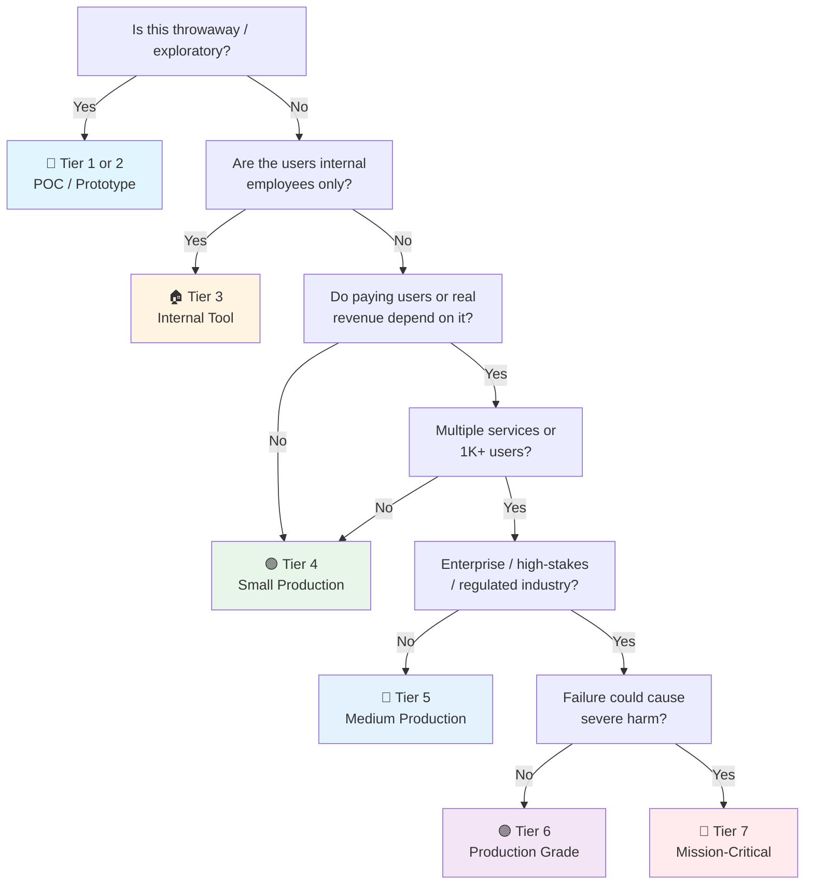

# Mutation Testing Checklist

> **Mutation testing** validates test *quality* by injecting artificial bugs (mutants) into production code and checking whether your test suite detects them. A mutant that *survives* (tests still pass) reveals a gap; a mutant that is *killed* (tests fail) confirms the test catches that class of defect.
> Complements [[qa]] §4 Quality Metrics, [[pytest]] (Python), and [[junit]] (Java). For projects of all languages — JavaScript/TypeScript, Java, C#/.NET, and Python.
> Last updated: 2026-08-07

---

## 1. What & Why

- [ ] **Core concept** — A mutation testing tool creates many small variants (mutants) of your source code — each with a single artificial bug. Your test suite is run against every mutant. If at least one test fails, the mutant is **killed**. If all tests still pass, the mutant **survived**, meaning your tests have a blind spot for that kind of defect.
- [ ] **Why coverage alone isn't enough** — Code coverage tells you which lines were *executed*, not which bugs would be *detected*. A test that calls a function but never asserts on the return value achieves 100 % coverage while detecting zero bugs. Mutation testing exposes this gap directly.
  ```python
  # 100% line coverage, but mutation score = 0%
  def is_adult(age: int) -> bool:
      return age >= 18

  def test_is_adult():
      is_adult(25)  # Called but no assertion — mutant `return age < 18` survives
  ```
- [ ] **Mutation score metric** — `Mutation Score = Killed / (Killed + Survived) × 100`. This is the single number that measures how effectively your tests detect bugs. Higher is better; 80 %+ is considered strong for production code.
- [ ] **Relationship to branch/condition coverage** — Branch coverage ensures both sides of every `if` are executed. Mutation testing goes further: it verifies that each side produces a *detectably different* outcome. A suite can have 100 % branch coverage but a low mutation score if assertions are weak.
- [ ] **What mutation testing is NOT** — It is not a replacement for coverage, integration tests, or code review. It is a *complement* that measures test effectiveness. It also does not find bugs in production code — it finds weaknesses in the test suite.
- [ ] **Cost model** — Each mutant requires a full test-suite run. A 5,000-line module with 300 mutants and a 10-second test suite means ~50 minutes of wall time (before parallelization). Understanding this cost upfront is essential for planning.

---

## 2. Tools Overview

### Stryker Mutator (JavaScript / TypeScript)

- [ ] **Install** — Stryker is the de-facto standard for JS/TS projects:
  ```bash
  npm install --save-dev @stryker-mutator/core @stryker-mutator/jest-runner
  # Or for Vitest:
  npm install --save-dev @stryker-mutator/core @stryker-mutator/vitest-runner
  ```
- [ ] **Initialize config** — `npx stryker init` walks through an interactive setup:
  ```bash
  npx stryker init
  # Creates stryker.conf.json (or stryker.conf.mjs)
  ```
- [ ] **Example `stryker.conf.json`** for Jest:
  ```json
  {
    "$schema": "./node_modules/@stryker-mutator/core/schema/stryker-schema.json",
    "packageManager": "npm",
    "testRunner": "jest",
    "coverageAnalysis": "perTest",
    "mutate": ["src/**/*.ts", "!src/**/*.spec.ts"],
    "thresholds": {
      "high": 80,
      "low": 60,
      "break": 70
    },
    "concurrency": 4,
    "timeoutMS": 10000,
    "reporters": ["html", "clear-text", "json"]
  }
  ```
- [ ] **Run** — `npx stryker run`. Produces HTML report in `reports/mutation/html/index.html`.

### Stryker Mutator (Java)

- [ ] **Install** — Stryker also supports Java via a separate package:
  ```bash
  # Gradle
  plugins {
      id 'stryker-mutator.stryker-gradle' version '0.1.0'
  }
  ```
  ```groovy
  // build.gradle
  stryker {
      mutate = ['src/main/java/**/*.java']
      testRunner = 'junit5'
      thresholds = [high: 80, low: 60, break: 70]
  }
  ```

### Stryker Mutator (C# / .NET)

- [ ] **Install** — `dotnet-stryker` is a global .NET tool:
  ```bash
  dotnet tool install -g dotnet-stryker
  ```
- [ ] **Example `stryker-config.json`**:
  ```json
  {
    "stryker-config": {
      "solution": "MyProject.sln",
      "project": "MyProject.csproj",
      "target-framework": "net8.0",
      "mutate": ["!**/Program.cs", "!**/Startup.cs"],
      "thresholds": {
        "high": 80,
        "low": 60,
        "break": 70
      },
      "reporters": ["html", "json"],
      "concurrency": 4,
      "coverage-analysis": "perTest"
    }
  }
  ```
- [ ] **Run** — `dotnet stryker`. Output in `StrykerOutput/`.

### PIT (Java — Pitest)

- [ ] **Maven plugin** — the standard for Java projects using JUnit 5:
  ```xml
  <!-- pom.xml -->
  <plugin>
    <groupId>org.pitest</groupId>
    <artifactId>pitest-maven</artifactId>
    <version>1.16.1</version>
    <dependencies>
      <dependency>
        <groupId>org.pitest</groupId>
        <artifactId>pitest-junit5-plugin</artifactId>
        <version>1.2.1</version>
      </dependency>
    </dependencies>
    <configuration>
      <targetClasses>
        <param>com.example.service.*</param>
        <param>com.example.domain.*</param>
      </targetClasses>
      <targetTests>
        <param>com.example.*</param>
      </targetTests>
      <mutators>
        <mutator>DEFAULTS</mutator>
        <mutator>STRONGER</mutator>
      </mutators>
      <mutationThreshold>80</mutationThreshold>
      <timeoutConstant>10000</timeoutConstant>
      <threads>4</threads>
      <outputFormats>
        <outputFormat>HTML</outputFormat>
        <outputFormat>XML</outputFormat>
      </outputFormats>
    </configuration>
  </plugin>
  ```
- [ ] **Gradle plugin** — for Gradle-based projects:
  ```groovy
  // build.gradle
  plugins {
      id 'info.solidsoft.pitest' version '1.15.0'
  }
  pitest {
      targetClasses = ['com.example.service.*', 'com.example.domain.*']
      targetTests = ['com.example.*']
      pitestVersion = '1.16.1'
      threads = 4
      outputFormats = ['HTML', 'XML']
      mutationThreshold = 80
      timeoutConst = 10000
      timestampedReports = false
  }
  ```
- [ ] **Run** — `./mvnw org.pitest:pitest-maven:mutationCoverage` or `./gradlew pitest`. Reports in `target/pit-reports/` or `build/reports/pitest/`.

### mutmut (Python)

- [ ] **Install and configure**:
  ```bash
  pip install mutmut
  ```
- [ ] **`pyproject.toml`** or `setup.cfg` configuration:
  ```toml
  [tool.mutmut]
  paths_to_mutate = "src/"
  tests_dir = "tests/"
  runner = "python -m pytest -x --timeout=30"
  also_copy = ["conftest.py", "tests/"]
  ```
- [ ] **Run**:
  ```bash
  mutmut run              # Run all mutations
  mutmut results          # Show survived/killed summary
  mutmut show 5           # Show details of mutant #5
  mutmut junitxml         # Export JUnit XML for CI
  ```

### cosmic-ray (Python alternative)

- [ ] **Install** — more features than mutmut, slower but more flexible:
  ```bash
  pip install cosmic-ray
  cosmic-ray init my-session src/ -- tests/
  cosmic-ray run my-session
  cosmic-ray cr-report my-session
  cosmic-ray cr-html my-session --output report.html
  ```
- [ ] **When to choose cosmic-ray over mutmut** — when you need distributed execution, custom operators, or detailed per-operator reporting. mutmut is simpler and faster for most projects.

---

## 3. Common Mutators

> Each mutator type represents a class of bug. Understanding them helps you write tests that kill specific mutant families.

### Conditional Boundary

- [ ] **What it does** — shifts comparison boundaries by one:
  ```java
  // Original
  if (age > 18) { return "adult"; }

  // Mutant
  if (age >= 18) { return "adult"; }
  ```
  ```python
  # Original
  if score > 90:
      return "A"

  # Mutant
  if score >= 90:
      return "A"
  ```
- [ ] **Test to kill it** — add a test at the exact boundary value (`age = 18`, `score = 90`).

### Conditionals Negation

- [ ] **What it does** — flips comparison operators:
  ```java
  // Original
  if (balance > 0) { allowWithdrawal(); }

  // Mutant
  if (balance <= 0) { allowWithdrawal(); }
  ```
  ```python
  # Original
  if user.is_active:
      send_notification(user)

  # Mutant (negated)
  if not user.is_active:
      send_notification(user)
  ```
- [ ] **Test to kill it** — test with values on both sides of the condition (`balance = 0` and `balance = 100`).

### Arithmetic Operator Replacement

- [ ] **What it does** — swaps arithmetic operators:
  ```java
  // Original
  int total = price * quantity;

  // Mutant
  int total = price / quantity;
  ```
  ```python
  # Original
  discount = original_price * rate

  # Mutant
  discount = original_price + rate
  ```
- [ ] **Test to kill it** — assert exact numeric results with known inputs (`price=10, quantity=3 → total=30`).

### Return Value Mutations

- [ ] **What it does** — changes boolean/numeric/string return values:
  ```java
  // Original
  public boolean isValid() { return true; }

  // Mutant
  public boolean isValid() { return false; }
  ```
  ```python
  # Original
  def calculate_tax(amount):
      return amount * 0.2

  # Mutant
  def calculate_tax(amount):
      return amount * 0.0
  ```
- [ ] **Test to kill it** — assert on the exact return value, not just "not None" or "truthy".

### Boundary / Increment Mutations

- [ ] **What it does** — swaps `++` for `--` and vice versa:
  ```java
  // Original
  for (int i = 0; i < items.size(); i++) { process(items.get(i)); }

  // Mutant
  for (int i = 0; i < items.size(); i--) { process(items.get(i)); }
  ```
- [ ] **Test to kill it** — the mutant usually causes a timeout (infinite loop), so timeout detection kills it. But for non-loop increments, assert on loop count or iteration-dependent state.

### Void Method Call Removal

- [ ] **What it does** — removes calls to void methods entirely:
  ```java
  // Original
  public void processOrder(Order order) {
      validate(order);
      saveToDatabase(order);
      sendConfirmation(order);
  }

  // Mutant (validate removed)
  public void processOrder(Order order) {
      saveToDatabase(order);
      sendConfirmation(order);
  }
  ```
- [ ] **Test to kill it** — verify side effects: assert that `validate` was called, the DB row exists, or the email was sent.

### String Literal Mutations

- [ ] **What it does** — changes string values or empties them:
  ```typescript
  // Original
  const greeting = `Hello, ${name}!`;

  // Mutant
  const greeting = `Goodbye, ${name}!`;
  // Or: const greeting = ``;
  ```
  ```python
  # Original
  error_message = "Invalid email address"

  # Mutant
  error_message = ""
  ```
- [ ] **Test to kill it** — assert on exact string content or key substrings.

### Exception Mutations

- [ ] **What it does** — removes throws or changes exception types:
  ```java
  // Original
  if (amount < 0) { throw new IllegalArgumentException("Negative amount"); }

  // Mutant (throw removed)
  if (amount < 0) { /* no exception */ }
  ```
  ```python
  # Original
  if not email:
      raise ValueError("Email is required")

  # Mutant
  if not email:
      pass  # Exception removed
  ```
- [ ] **Test to kill it** — use `pytest.raises` / `assertThrows` to verify the exception is raised with the correct type and message.

---

## 4. Configuration Essentials

- [ ] **Mutator selection** — start with the default set, add `STRONGER` (PIT) or extra mutators as the suite matures:
  ```xml
  <!-- PIT: progressive mutator sets -->
  <mutators>
    <mutator>DEFAULTS</mutator>          <!-- Phase 1: basic -->
    <!-- <mutator>STRONGER</mutator> --> <!-- Phase 2: add after basics killed -->
    <!-- <mutator>ALL</mutator> -->       <!-- Phase 3: maximum rigor -->
  </mutators>
  ```
- [ ] **Threshold setting formula** — base threshold on current score, then ratchet up:
  ```
  Initial threshold  = current_mutation_score - 5   (buffer for flaky mutants)
  Target threshold   = min(current + 10, tier_target)
  CI break threshold = target - 5                   (allow slight regression)
  ```
  Example: current score = 65 %, tier target = 80 %:
  - Set `mutationThreshold = 60` now
  - Set goal to reach 75 within 2 sprints
  - Set `break` threshold at 55 to prevent backsliding

- [ ] **Concurrency tuning** — use all available cores but leave headroom for the OS:
  ```json
  // Stryker
  "concurrency": 6   // On an 8-core machine: cores - 2
  ```
  ```xml
  <!-- PIT -->
  <threads>6</threads>
  ```
  ```ini
  # mutmut: no built-in parallelism, use xargs or GNU parallel
  mutmut run & mutmut run --use-coverage & wait
  ```

- [ ] **Timeout calibration** — set to 2–3× the slowest test in your suite to catch infinite loops without wasting time:
  ```json
  // Stryker: base timeout = test suite time × factor + per-test overhead
  "timeoutMS": 10000,
  "timeoutFactor": 1.5
  ```
  ```xml
  <!-- PIT -->
  <timeoutConstant>10000</timeoutConstant>  <!-- milliseconds -->
  <timeoutFactor>1.25</timeoutFactor>
  ```

- [ ] **Exclude patterns** — skip generated code, migrations, configs, and test files:
  ```json
  // Stryker
  "mutate": [
    "src/**/*.ts",
    "!src/**/*.spec.ts",
    "!src/**/*.d.ts",
    "!src/generated/**",
    "!src/migrations/**"
  ]
  ```
  ```xml
  <!-- PIT -->
  <excludedClasses>
    <param>*Test</param>
    <param>*Builder</param>
    <param>*Config</param>
  </excludedClasses>
  <excludedMethods>
    <param>toString</param>
    <param>hashCode</param>
    <param>equals</param>
  </excludedMethods>
  ```

- [ ] **Custom mutators** — extend when default mutators miss domain-specific bug classes:
  ```python
  # mutmut: custom mutator via plugin
  # In conftest.py or a separate module registered in setup.cfg
  def mutate_bool_to_int(context):
      """Replace True/False with 1/0 to catch truthy-check bugs."""
      for node in context.ast.walk():
          if isinstance(node, ast.Constant) and isinstance(node.value, bool):
              yield node, ast.Constant(value=int(not node.value))
  ```

---

## 5. Mutation Score Targets by Tier

- [ ] **Set tier-appropriate targets** — higher criticality demands higher mutation scores:
- [ ] **Incremental improvement** — don't jump from 0 % to 80 % in one sprint. Improve 5–10 % per iteration.
- [ ] **Document rationale** — the team should understand *why* a target was chosen, not just enforce it.

| Tier | Target Score | Rationale |
|---|---|---|
| 🧪 POC / Spike | ❌ Skip entirely | Code is throwaway; mutation testing ROI is negative |
| 🔧 Prototype / MVP | 🟡 40 % | Basic sanity — ensure core happy-path bugs are caught |
| 🏠 Internal Tool | ✅ 60 % | Reasonable quality for employee-facing tools |
| 🟢 Small Production | ✅ 70 % | Production-ready — paying users or real traffic |
| 🔵 Medium Production | ✅ 80 % | High confidence — multiple services or 1K+ users |
| 🟣 Production Grade | ✅ 85 % | Enterprise quality — high-stakes SaaS or large user base |
| 🔴 Mission-Critical | ✅ 90 %+ | Maximum safety — healthcare, finance, safety systems |

---

## 6. CI Integration

### Nightly Full Run (GitHub Actions)

- [ ] **Complete workflow** for running mutation testing every night:
  ```yaml
  # .github/workflows/mutation-testing-nightly.yml
  name: Mutation Testing (Nightly)
  on:
    schedule:
      - cron: '0 2 * * *'  # 2 AM UTC daily
    workflow_dispatch:       # Allow manual trigger

  jobs:
    mutation-test:
      runs-on: ubuntu-latest
      timeout-minutes: 120   # Hard cap to prevent runaway costs
      steps:
        - uses: actions/checkout@v4

        - name: Setup Node.js
          uses: actions/setup-node@v4
          with:
            node-version: '20'
            cache: 'npm'

        - name: Install dependencies
          run: npm ci

        - name: Run unit tests (gate check)
          run: npm test -- --coverage --passWithNoTests=false

        - name: Run Stryker mutation testing
          run: npx stryker run
          env:
            STRYKER_DASHBOARD_API_KEY: ${{ secrets.STRYKER_DASHBOARD_API_KEY }}

        - name: Upload mutation report
          uses: actions/upload-artifact@v4
          if: always()
          with:
            name: mutation-report
            path: reports/mutation/
            retention-days: 30

        - name: Notify on failure
          if: failure()
          uses: actions/github-script@v7
          with:
            script: |
              github.rest.issues.create({
                owner: context.repo.owner,
                repo: context.repo.repo,
                title: '🧬 Mutation testing threshold breached',
                body: `Mutation score dropped below threshold. [View run](${context.serverUrl}/${context.repo.owner}/${context.repo.repo}/actions/runs/${context.runId})`,
                labels: ['quality', 'mutation-testing']
              })
  ```

### PR Incremental Mode

- [ ] **Only mutate changed files** — fast enough for PR feedback:
  ```yaml
  # .github/workflows/mutation-testing-pr.yml
  name: Mutation Testing (PR)
  on:
    pull_request:
      branches: [main, develop]
      paths:
        - 'src/**/*.ts'
        - 'src/**/*.java'
        - 'src/**/*.py'

  jobs:
    mutation-test-incremental:
      runs-on: ubuntu-latest
      timeout-minutes: 30
      steps:
        - uses: actions/checkout@v4
          with:
            fetch-depth: 0  # Full history for diff

        - name: Setup Node.js
          uses: actions/setup-node@v4
          with:
            node-version: '20'
            cache: 'npm'

        - name: Install dependencies
          run: npm ci

        - name: Run Stryker (diff mode)
          run: npx stryker run --since main
          env:
            STRYKER_DASHBOARD_API_KEY: ${{ secrets.STRYKER_DASHBOARD_API_KEY }}

        - name: Comment PR with results
          if: always()
          uses: actions/github-script@v7
          with:
            script: |
              const fs = require('fs');
              const report = JSON.parse(fs.readFileSync('reports/mutation/mutation.json', 'utf8'));
              const score = report.mutationScore;
              const emoji = score >= 80 ? '✅' : score >= 60 ? '🟡' : '❌';
              github.rest.issues.createComment({
                owner: context.repo.owner,
                repo: context.repo.repo,
                issue_number: context.issue.number,
                body: `## 🧬 Mutation Testing Results\n\n${emoji} **Score: ${score.toFixed(1)}%**\n\n- Killed: ${report.killed}\n- Survived: ${report.survived}\n- Timeout: ${report.timeout}\n- No coverage: ${report.noCoverage}`
              });
  ```

### Dashboard & Reporting

- [ ] **Stryker Dashboard** — free hosted dashboard for trend tracking:
  ```json
  // stryker.conf.json
  {
    "dashboard": {
      "project": "github.com/owner/repo",
      "version": "main",
      "module": "src"
    },
    "reporters": ["html", "dashboard", "json"]
  }
  ```
- [ ] **PIT + SonarQube** — integrate with SonarQube for unified quality view:
  ```xml
  <!-- PIT outputs XML that SonarQube can ingest -->
  <outputFormats>
    <outputFormat>XML</outputFormat>
  </outputFormats>
  ```
  ```yaml
  # SonarQube properties
  sonar.mutation.reportPath=target/pit-reports/mutations.xml
  sonar.mutation.threshold=80
  ```
- [ ] **Notification strategy** — notify on threshold breach, not every run. Use Slack/Teams webhooks or GitHub Issues. Avoid alert fatigue.

---

## 7. Incremental Mutation Testing

- [ ] **Why incremental** — full runs take 30–120 minutes. Incremental runs on PR diffs take 2–10 minutes, enabling per-PR feedback.

### Stryker Diff Mode

- [ ] **`--since` flag** — only mutate files changed since a given branch/commit:
  ```bash
  npx stryker run --since main
  ```
- [ ] **Config-level `since`** — persistent diff configuration:
  ```json
  {
    "since": {
      "enabled": true,
      "baseBranch": "main",
      "ignoreChangesIn": [
        "**/*.md",
        "**/*.json",
        "**/package-lock.json"
      ]
    }
  }
  ```
- [ ] **Diff + baseline** — combine diff mode with a baseline report to skip mutants that were already survived in the baseline (known survivors):
  ```json
  {
    "baseline": {
      "enabled": true,
      "fallbackVersion": "v1.0.0"
    }
  }
  ```

### PIT History File

- [ ] **History input/output** — PIT caches results between runs:
  ```xml
  <configuration>
    <historyInputFile>pit-history.bin</historyInputFile>
    <historyOutputFile>pit-history.bin</historyOutputFile>
  </configuration>
  ```
- [ ] **CI caching** — store history file as a CI artifact:
  ```yaml
  - name: Download PIT history
    uses: actions/cache@v4
    with:
      path: pit-history.bin
      key: pit-history-${{ github.ref }}
      restore-keys: pit-history-

  - name: Run PIT
    run: ./mvnw org.pitest:pitest-maven:mutationCoverage

  - name: Save PIT history
    uses: actions/cache/save@v4
    with:
      path: pit-history.bin
      key: pit-history-${{ github.ref }}-${{ github.sha }}
  ```

### mutmut Manual Diff Approach

- [ ] **mutmut + coverage filtering** — mutmut doesn't have built-in diff mode; use coverage analysis to scope:
  ```bash
  # 1. Get list of changed files
  CHANGED=$(git diff --name-only origin/main -- 'src/*.py')

  # 2. Run mutmut only on changed files
  for file in $CHANGED; do
      mutmut run --paths-to-mutate "$file"
  done

  # 3. Aggregate results
  mutmut results
  ```

### CI Caching Strategies

- [ ] **Cache mutant results** — store baseline results to skip already-killed mutants:
  ```yaml
  - name: Cache mutation results
    uses: actions/cache@v4
    with:
      path: .mutmut-cache
      key: mutmut-${{ hashFiles('src/**') }}
      restore-keys: mutmut-
  ```
- [ ] **Artifact-based baseline** — upload full-run results as artifacts, download in PR runs for comparison.

---

## 8. Cost Optimization

- [ ] **Coverage analysis first** — mutation testing on uncovered code is pure waste. Run coverage first; only mutate code with ≥70 % coverage:
  ```bash
  # Run coverage first
  pytest --cov=src --cov-report=term-missing --cov-fail-under=70

  # Then mutation test only the covered modules
  mutmut run --paths-to-mutate src/core/ src/services/
  ```
- [ ] **Parallelization strategies** — the single biggest time-saver:
  ```
  Formula: wall_time = (num_mutants × test_suite_time) / concurrency
  
  Example: 500 mutants × 5s suite / 8 cores = ~5 minutes (vs 42 minutes serial)
  ```
  ```json
  // Stryker: set concurrency to cores - 2 (leave room for OS + test runner overhead)
  "concurrency": 6
  ```
- [ ] **Timeout tuning** — kill infinite-loop mutants fast. Set `timeoutMS` to 2–3× your p99 test time:
  ```json
  // If your slowest test takes 3 seconds:
  "timeoutMS": 8000,
  "timeoutFactor": 1.5
  ```
- [ ] **Diff-based scope** — only mutate what changed (see §7). Reduces mutant count from hundreds to single-digits per PR.
- [ ] **Selective mutators** — disable expensive or low-value mutators:
  ```json
  // Stryker: disable string mutators if they produce too many equivalents
  "excludedMutations": [
    "StringLiteral",
    "BlockStatement"
  ]
  ```
- [ ] **File exclusions** — skip generated code, boilerplate, configs:
  ```json
  "mutate": [
    "src/**/*.ts",
    "!src/generated/**",
    "!src/types/**",
    "!src/**/*.config.ts",
    "!src/index.ts"
  ]
  ```
- [ ] **Baseline comparison** — don't re-run mutants that are known survivors from the last full run. Use Stryker's baseline or PIT's history file.

---

## 9. Interpreting Results

### Killed Mutants

- [ ] **What it means** — your test suite detected the artificial bug. This is the desired outcome.
- [ ] **No action needed** — but verify it's not a false kill (test failing for unrelated reasons like a timeout).

### Survived Mutants

- [ ] **What it means** — tests passed despite the code being changed. This is a **real gap** in your test suite.
- [ ] **Example analysis**:
  ```python
  # Original code
  def calculate_discount(price, is_vip):
      if is_vip:
          return price * 0.8
      return price

  # Mutant: 0.8 changed to 0.9 (arithmetic mutator)
  def calculate_discount(price, is_vip):
      if is_vip:
          return price * 0.9  # ← mutation
      return price
  ```
  **Why it survived:** Test used `price = 100` and only checked `result < 100`, not the exact value.
  **Fix:**
  ```python
  def test_vip_discount():
      assert calculate_discount(100, is_vip=True) == 80.0  # Exact assertion
  ```

### Equivalent Mutants

- [ ] **What they are** — mutants that produce identical behavior to the original. They can never be killed and inflate the denominator unfairly.
- [ ] **How to detect** — look for mutants where the mutated code is logically identical:
  ```java
  // Original
  if (list.isEmpty()) { return Collections.emptyList(); }

  // Mutant: isEmpty() → !isEmpty()
  // This is NOT equivalent — different behavior

  // But:
  int x = a + 0;  // Mutant: a + 1 → different → NOT equivalent
  int y = a * 1;  // Mutant: a * 2 → different → NOT equivalent
  ```
- [ ] **How to document** — add comments or annotations to mark known equivalents:
  ```java
  // MUTANT-EQUIVALENT: Changing && to || here has no effect because
  // the second condition is always true when the first is true.
  if (user.isAdmin() && user.hasPermission("admin_panel")) {
      showAdminPanel();
  }
  ```
  ```python
  # @mutmut: equivalent — swapping return values here has no effect
  # because the caller only checks truthiness, and both are truthy.
  def get_default_config():
      return {"debug": False}
  ```
- [ ] **Stryker ignore annotations**:
  ```typescript
  // Stryker disable next-line
  const defaultValue = process.env.PORT ?? "3000";

  // Or block-level:
  // Stryker disable all
  function generatedCode() { /* ... */ }
  // Stryker restore all
  ```

### Timeout Mutants

- [ ] **What it means** — the mutant caused the test suite to hang (usually an infinite loop or extreme slowdown).
- [ ] **Is it killed?** — Most tools count timeouts as killed, since the mutant's effect is detectable.
- [ ] **Action** — if timeouts are frequent, your timeout is too generous. Tighten it.

### No-Coverage Mutants

- [ ] **What it means** — the mutant is in code that no test executes. The mutation is irrelevant because the code is never reached.
- [ ] **Action** — either write tests for that code (increasing coverage) or exclude it from mutation testing.

### Reading Reports

- [ ] **HTML report** — interactive, shows each mutant with source location, status, and the exact change. Open `reports/mutation/html/index.html` (Stryker) or `target/pit-reports/index.html` (PIT).
- [ ] **JSON report** — machine-readable for dashboards and custom tooling:
  ```json
  {
    "mutationScore": 78.5,
    "killed": 157,
    "survived": 38,
    "timeout": 3,
    "noCoverage": 2,
    "mutants": [
      {
        "id": "1",
        "mutatorName": "ArithmeticOperator",
        "location": { "file": "src/service.ts", "line": 42 },
        "status": "Survived",
        "replacement": "price / quantity"
      }
    ]
  }
  ```

---

## 10. Remediation

### Triage Priorities

- [ ] **Fix in this order** — highest ROI first:
  1. **No-coverage mutants** — fastest fix: write a basic test for uncovered code
  2. **Survived conditional boundary mutants** — add boundary test cases
  3. **Survived arithmetic mutants** — add exact-value assertions
  4. **Survived return value mutants** — assert on return values, not just "not None"
  5. **Survived negation mutants** — add tests for both branches of conditions
  6. **Survived void-method mutants** — verify side effects
  7. **Equivalent mutants** — document and exclude (don't waste time "killing" them)

### Specific Test Patterns

- [ ] **Killing boundary mutants** — test at exact boundary values:
  ```python
  # Mutant: age >= 18 → age > 18
  def test_adult_at_boundary():
      assert is_adult(18) is True    # Kills mutant: age > 18 would fail here
      assert is_adult(17) is False   # Kills mutant: age >= 18 would also fail here

  @pytest.mark.parametrize("age,expected", [
      (17, False),  # Just below
      (18, True),   # Exact boundary
      (19, True),   # Just above
  ])
  def test_age_boundary_cases(age, expected):
      assert is_adult(age) == expected
  ```

- [ ] **Killing arithmetic mutants** — use exact-value assertions with known inputs:
  ```python
  # Mutant: price * quantity → price + quantity
  def test_total_price_exact():
      assert calculate_total(10, 3) == 30  # 10 * 3, not 10 + 3
      assert calculate_total(0, 5) == 0    # Edge: zero price
      assert calculate_total(7, 1) == 7    # Edge: quantity of 1

  def test_percentage_calculation():
      # Mutant: amount * 0.2 → amount * 0.8
      assert calculate_tax(100) == 20.0    # 100 * 0.2 = 20, not 80
  ```

- [ ] **Killing return value mutants** — always assert exact return values:
  ```java
  // Mutant: return true → return false
  @Test
  void shouldReturnTrueForValidInput() {
      assertTrue(validator.isValid("test@example.com"));  // Not: assertNotNull
  }

  @Test
  void shouldReturnFalseForInvalidInput() {
      assertFalse(validator.isValid("not-an-email"));
  }
  ```

- [ ] **Killing negation mutants** — test both sides of every condition:
  ```python
  # Mutant: if is_active → if not is_active
  def test_active_user_gets_notification():
      user = User(is_active=True)
      assert should_notify(user) is True

  def test_inactive_user_skips_notification():
      user = User(is_active=False)
      assert should_notify(user) is False
  ```

- [ ] **Killing exception mutants** — verify exception type AND message:
  ```python
  # Mutant: raise ValueError → (removed)
  def test_negative_amount_raises():
      with pytest.raises(ValueError, match="Negative amount"):
          process_payment(-100)

  def test_zero_amount_raises():
      with pytest.raises(ValueError, match="Amount must be positive"):
          process_payment(0)
  ```

### Handling Equivalent Mutants

- [ ] **Identify** — a mutant is equivalent if the mutated code produces identical output for all possible inputs.
- [ ] **Refactor to eliminate** — sometimes the code structure itself creates equivalents:
  ```java
  // BEFORE: equivalent mutant likely
  int result = (x > 0) ? x : 0;
  // Mutant: x > 0 → x >= 0. For x=0, both return 0. EQUIVALENT.

  // AFTER: refactored to avoid equivalent
  int result = Math.max(x, 0);
  // No equivalent mutant possible here
  ```
- [ ] **Document** — when refactoring isn't feasible, add inline documentation:
  ```python
  # EQUIVALENT: Swapping `>` to `>=` here has no effect because
  # len(items) is always > 0 at this point (guaranteed by caller).
  if len(items) > 0:
      process(items[0])
  ```

---

## 11. Advanced Patterns

### Combining with Property-Based Testing

- [ ] **Hypothesis (Python)** — property-based tests generate random inputs that kill many mutants at once:
  ```python
  from hypothesis import given, strategies as st

  @given(st.integers(min_value=0, max_value=200))
  def test_age_always_returns_bool(age):
      result = is_adult(age)
      assert isinstance(result, bool)

  @given(st.floats(min_value=0, max_value=10000, allow_nan=False))
  def test_discount_never_negative(price):
      assert calculate_discount(price, is_vip=True) >= 0

  @given(st.text(min_size=1, max_size=255))
  def test_username_validation_never_crashes(name):
      # Kills exception-removal mutants
      result = validate_username(name)
      assert isinstance(result, bool)
  ```

- [ ] **jqwik (Java)** — property-based testing for JVM:
  ```java
  @Property
  void discount_is_never_negative(@ForAll @DoubleRange(min = 0, max = 10000) double price) {
      double discount = PricingService.calculateDiscount(price, true);
      assertThat(discount).isGreaterThanOrEqualTo(0.0);
  }

  @Property
  void age_classification_is_exhaustive(@ForAll @IntRange(min = 0, max = 200) int age) {
      String category = AgeClassifier.classify(age);
      assertThat(category).isIn("child", "teen", "adult", "senior");
  }
  ```

### Mutation Testing for Test Code

- [ ] **Meta-mutation** — mutate your test code to find redundant assertions, unnecessary tests, or dead test logic:
  ```python
  # If this mutant survives, the assertion is redundant:
  # Mutant: assert x > 0 → assert x >= 0
  def test_positive_number():
      result = generate_positive()
      assert result > 0  # If mutant `>= 0` survives, test is weak
      assert result != 0  # This kills the mutant for result=0
  ```
- [ ] **When to use** — for critical test suites where false confidence is dangerous (e.g., security-critical assertions).

### Mutation Score as Documentation

- [ ] **Living specification** — a high mutation score documents that the test suite actually enforces the specification. Include mutation score badges in README:
  ```markdown
  
  ```
- [ ] **Code review signal** — PRs that decrease mutation score should be flagged just like PRs that decrease coverage.

### Baseline Tracking Over Time

- [ ] **Trend tracking** — plot mutation score over time in your CI dashboard. It should trend upward:
  ```yaml
  # Custom dashboard step: append score to a CSV artifact
  - name: Track mutation score trend
    run: |
      SCORE=$(jq '.mutationScore' reports/mutation/mutation.json)
      echo "$(date -I),${SCORE}" >> mutation-trend.csv

  - name: Upload trend data
    uses: actions/upload-artifact@v4
    with:
      name: mutation-trend
      path: mutation-trend.csv
  ```
- [ ] **Regression detection** — if mutation score drops by >2 % between runs, alert the team.

---

## 12. Common Pitfalls

- [ ] **Running mutation testing before coverage is adequate** — if coverage < 70 %, most mutants will be "no coverage." Fix coverage first; mutation testing on uncovered code is pure waste.
- [ ] **Treating mutation score like coverage** — 100 % mutation score is almost never achievable (equivalent mutants, defensive code). Set realistic tier-based targets.
- [ ] **Ignoring equivalent mutants** — they inflate the denominator and demoralize the team. Identify, document, and exclude them from the score calculation.
- [ ] **Running full suite on every PR** — mutation testing is 10–100× slower than unit tests. Use incremental/diff mode for PRs, full runs nightly.
- [ ] **Not tuning timeouts** — default timeouts are too generous. A mutant that causes a 30-second timeout when tests normally run in 3 seconds wastes CI minutes. Calibrate to 2–3× p99 test time.
- [ ] **Mutating generated/boilerplate code** — generated code, type definitions, and configs produce many equivalent mutants and waste time. Exclude them.
- [ ] **Using only default mutators** — default mutators miss domain-specific bugs. Add custom mutators for your error-prone patterns (e.g., date arithmetic, currency rounding).
- [ ] **Not parallelizing** — running mutation tests serially on an 8-core machine wastes 87.5 % of available compute. Always set concurrency to cores - 2.
- [ ] **Asserting too loosely** — `assert result is not None` or `assertTrue(result > 0)` won't kill arithmetic or return-value mutants. Assert exact values.
- [ ] **Skipping remediation** — running mutation testing without acting on survivors is theater. Every survived mutant should be triaged: fix, document as equivalent, or accept the risk.
- [ ] **Mutating test files** — mutating test code by accident inflates mutant count and produces confusing results. Always exclude test directories from mutation scope.
- [ ] **Not caching between runs** — re-killing the same mutants every run wastes time. Use PIT history, Stryker baseline, or CI caching.
- [ ] **Alert fatigue** — notifying on every run, not just threshold breaches. Configure notifications for failures only.
- [ ] **Not updating thresholds** — leaving the threshold at the initial value while the score improves. Ratchet thresholds up as the suite matures.

---

## 13. Quick Sanity Check Before Running

- [ ] All unit tests pass (`pytest` / `mvn test` / `npm test` — zero failures)
- [ ] Code coverage ≥ 70 % on target modules (mutation testing on uncovered code is wasteful)
- [ ] Mutation testing tool installed and version-pinned in dev dependencies
- [ ] Config file present and committed (`stryker.conf.json`, `pom.xml` plugin block, `pyproject.toml`)
- [ ] Target classes/files correctly specified (production code only, not tests)
- [ ] Test files excluded from mutation scope
- [ ] Generated/boilerplate code excluded (`!src/generated/**`, `!src/types/**`)
- [ ] Timeout calibrated to 2–3× the slowest test in the suite
- [ ] Concurrency set to `CPU cores - 2` (leave headroom for OS and test runner)
- [ ] Threshold set to current score - 5 % (prevents backsliding without being unrealistic)
- [ ] CI pipeline configured (nightly full run, PR incremental run)
- [ ] Report output directory accessible and uploaded as CI artifact
- [ ] Team briefed on how to interpret results (killed vs survived vs equivalent)
- [ ] Baseline established — current mutation score recorded as starting point
- [ ] Remediation plan in place — survivors will be triaged within one sprint

---

## 14. Project Tier Scoping Matrix

> **How to use this table:** Pick your tier first, then focus only on the sections marked ✅ (required) or 🟡 (recommended). Skip ❌ sections entirely — they'd be over-engineering for your context.
>
> **Legend:** ✅ Required · 🟡 Recommended / partial · ❌ Skip

### Which Tier Am I?



### Mutation Testing Checklist Applicability by Tier

| # | Section | 🧪 POC | 🔧 Prototype | 🏠 Internal | 🟢 Small Prod | 🔵 Medium Prod | 🟣 Production Grade | 🔴 Mission-Critical |
|---|---|:---:|:---:|:---:|:---:|:---:|:---:|:---:|
| 1 | What & Why | ❌ | 🟡 skim | ✅ | ✅ | ✅ | ✅ | ✅ |
| 2 | Tools Overview | ❌ | 🟡 pick one | ✅ install | ✅ + config | ✅ + full stack | ✅ + all langs | ✅ + vetted |
| 3 | Common Mutators | ❌ | ✅ review | ✅ | ✅ | ✅ + custom | ✅ + domain-specific | ✅ + all |
| 4 | Configuration Essentials | ❌ | 🟡 basic | ✅ | ✅ + tuning | ✅ + thresholds | ✅ + strict | ✅ + audited |
| 5 | Score Targets | ❌ | 🟡 40 % | ✅ 60 % | ✅ 70 % | ✅ 80 % | ✅ 85 % | ✅ 90 %+ |
| 6 | CI Integration | ❌ | ❌ | 🟡 nightly | ✅ nightly | ✅ + PR mode | ✅ + dashboard | ✅ + gates |
| 7 | Incremental Testing | ❌ | ❌ | ❌ | 🟡 diff mode | ✅ diff + cache | ✅ + baseline | ✅ + full history |
| 8 | Cost Optimization | ❌ | ❌ | 🟡 basic | ✅ | ✅ + parallel | ✅ + selective | ✅ + all strategies |
| 9 | Interpreting Results | ❌ | ✅ | ✅ | ✅ | ✅ + equivalents | ✅ + reports | ✅ + audit trail |
| 10 | Remediation | ❌ | 🟡 ad-hoc | ✅ | ✅ + priority | ✅ + systematic | ✅ + tracked | ✅ + required |
| 11 | Advanced Patterns | ❌ | ❌ | ❌ | 🟡 PBT | ✅ PBT + meta | ✅ + baseline tracking | ✅ + all |
| 12 | Common Pitfalls | ❌ | ✅ review | ✅ | ✅ + code review | ✅ + linting | ✅ + enforcement | ✅ + formal process |
| 13 | Quick Sanity Check | ❌ | ❌ | 🟡 partial | ✅ | ✅ | ✅ | ✅ |

---

## 15. Sources

- [[qa]] — general QA checklist, §4 Quality Metrics (test effectiveness)
- [[pytest]] — Python testing with pytest (companion for mutmut workflows)
- [[junit]] — Java testing with JUnit 5 (companion for PIT workflows)
- PIT (Pitest) documentation — https://pitest.org/
- PIT quick start — https://pitest.org/quickstart/
- Stryker Mutator (JS/TS) — https://stryker-mutator.io/docs/stryker-js/introduction/
- Stryker Mutator (C#/.NET) — https://stryker-mutator.io/docs/stryker-net/introduction/
- Stryker Dashboard — https://dashboard.stryker-mutator.io/
- mutmut — https://github.com/boxed/mutmut
- cosmic-ray — https://cosmic-ray.readthedocs.io/
- Mutation Testing (Wikipedia) — https://en.wikipedia.org/wiki/Mutation_testing
- "Mutation Testing: History, Recent Advances and Open Problems" (Jia & Harman, 2011) — https://ieeexplore.ieee.org/document/5979226
- Equivalent Mutant Detection Survey — https://www.sciencedirect.com/science/article/pii/S0950584920301633
