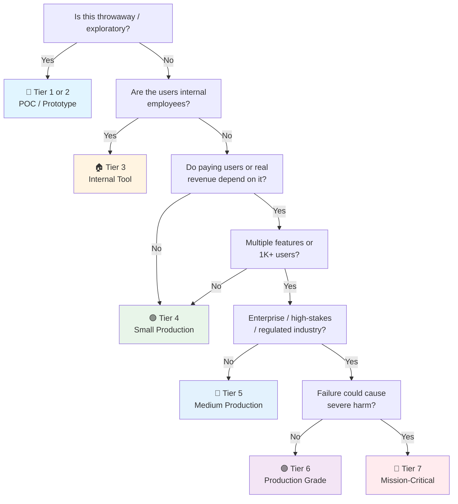

# Playwright E2E Testing Checklist

> The **Playwright framework** checklist — from `npm init` to production-grade E2E in CI.
> Horizontal: applies to any web app (SPA, SSR, static). Complements [[QA]] (E2E section §4), [[Frontend Launch]], and [[Release]] (CI test gates).
> Last updated: 2026-08-07

---

## 1. Setup & Configuration

- [ ] **Installed via official package** — `npm init playwright@latest` scaffolds config, test dir, and example. Not a manual install — the wizard gets browsers, folder structure, and GitHub Actions right.
- [ ] **`playwright.config.ts` committed and reviewed** — Not the generated default. `baseURL`, `timeout`, `retries`, `workers`, `projects`, and `reporter` are all intentional choices, not leftovers.
- [ ] **Browsers selected deliberately** — Chromium for fast CI feedback, + Firefox + WebKit for production-grade apps. Don't test all three on every PR — tier it (Chromium on PR, multi-browser on main/nightly).
- [ ] **`baseURL` configured** — Set once in config, not repeated in every test. Points to localhost:dev-server for local, preview deploy URL for CI.
- [ ] **`webServer` block configured** — Playwright starts the dev server automatically for local runs. `reuseExistingServer: !process.env.CI` so CI uses the already-deployed preview.
- [ ] **TypeScript enabled** — `playwright.config.ts` (not `.js`), strict mode on. Type safety catches locator typos and API misuse at compile time, not at runtime.
- [ ] **`tsconfig.json` includes test paths** — IDE autocomplete works for page objects, test helpers, and shared types. No implicit `any` leaking into test code.
- [ ] **`.gitignore` covers artifacts** — `test-results/`, `playwright-report/`, `blob-report/`, and screenshot baselines if they're too large for the repo (or use Git LFS for baselines).

## 2. Page Objects & Test Structure

- [ ] **Page Object Model (POM) adopted** — One class per page/component. Encapsulates selectors + actions. Tests read like user intent (`await loginPage.loginAs(user)`), not CSS selectors.
- [ ] **Page objects return `this` or meaningful values** — Chainable actions (`await page.click().then(...)`) and assertions on returned state. Not void methods that silently do nothing on failure.
- [ ] **No selectors in test files** — All locators live in page objects or a shared `locators.ts`. Test files contain only orchestration and assertions.
- [ ] **Test isolation enforced** — Each test is independent. No shared state across tests. `test.describe` groups related tests but each `test()` starts from a clean page.
- [ ] **`beforeEach` sets up, `afterEach` tears down** — Navigation to starting page, auth state restoration, and data cleanup in hooks — not copy-pasted into every test.
- [ ] **Fixtures over globals** — Playwright's `test.extend()` for custom fixtures (authenticated page, seeded DB, API client). Not global `before` hooks that leak state.
- [ ] **Test naming convention** — `test('user can complete checkout with credit card', ...)` — describes behavior, not implementation. Grep-able for triage.
- [ ] **Folder structure mirrors app structure** — `tests/auth/`, `tests/checkout/`, `tests/dashboard/` — not one flat `tests/` directory with 200 files.

## 3. Locators & Selectors

- [ ] **User-facing locators preferred** — `getByRole()`, `getByLabel()`, `getByPlaceholder()`, `getByText()`. Resilient to refactoring, accessible by design. If a role doesn't exist, that's an a11y bug worth fixing.
- [ ] **`getByTestId()` as escape hatch** — For elements with no semantic meaning (dynamic content, complex widgets). Add `data-testid` to production code deliberately — not `id` or `class` that change with CSS refactors.
- [ ] **Chained locators for scoping** — `page.locator('.card').getByRole('button')` narrows scope. Not `page.locator('.card button')` which is fragile and non-semantic.
- [ ] **`filter()` for disambiguation** — `getByRole('listitem').filter({ hasText: 'Item A' })` selects the right item in a list. Not nth-child selectors that break on reorder.
- [ ] **No XPath unless truly necessary** — CSS and Playwright's built-in locators cover 99% of cases. XPath is fragile, unreadable, and slower to debug.
- [ ] **`first()`, `last()`, `nth()` used sparingly** — Index-based selection breaks on dynamic content. Prefer filtering by content or attribute.
- [ ] **Locators auto-wait** — No manual `waitForSelector()` before actions. Playwright's auto-waiting handles visibility, stability, and actionability. Manual waits = test smell.
- [ ] **Locator reuse via page object properties** — `this.submitButton = page.getByRole('button', { name: 'Submit' })` defined once, used in multiple methods. Not re-declared inline.

## 4. Assertions & Matchers

- [ ] **Playwright's web-first assertions** — `expect(locator).toBeVisible()`, `toHaveText()`, `toHaveURL()`, `toHaveValue()`. These auto-retry until timeout. Not `expect(await locator.textContent()).toBe(...)` which snapshots once and fails on timing.
- [ ] **`expect(page).toHaveURL()` after navigation** — Verifies the route changed, not just that a button was clicked. Catches silent navigation failures.
- [ ] **`expect(response).toBeOK()` for API calls** — When intercepting network, assert the response status. Don't just check UI state — verify the backend responded correctly.
- [ ] **Negative assertions explicit** — `expect(locator).not.toBeVisible()` for elements that should be hidden. `toBeHidden()` vs `not.toBeVisible()` — know the difference (hidden = in DOM but not visible; not visible = might not exist).
- [ ] **`toMatchAriaSnapshot()` for complex UI** — Asserts the accessibility tree shape. Catches structural regressions that text/content assertions miss.
- [ ] **Soft assertions for non-critical checks** — `expect.soft()` collects failures without aborting the test. Use for secondary validations (analytics fired, optional UI element). Not for the primary behavior under test.
- [ ] **Custom matchers for domain logic** — `expect(order).toHaveStatus('confirmed')` via `expect.extend()`. Keeps test files readable and assertion logic DRY.
- [ ] **Assertion timeout explicit where needed** — `expect(locator).toBeVisible({ timeout: 10_000 })` for slow animations or API-driven renders. Default 5s timeout is fine for most cases — don't globally inflate it.

## 5. Network Interception & Mocking

- [ ] **`page.route()` for API mocking** — Intercept and mock API responses for deterministic tests. Not testing against a flaky staging API — mock the boundary, test the frontend logic.
- [ ] **`page.waitForResponse()` for verification** — Assert that the right API call was made with the right payload. `expect(request.postDataJSON()).toEqual({ ... })`.
- [ ] **Network conditions simulated** — `page.route('**/*', route => route.continue())` with latency injection, offline simulation, or error responses. Test loading states and error handling, not just happy paths.
- [ ] **`har` recording for API discovery** — `page.routeFromHAR()` records real API traffic, then replays it. Great for onboarding tests against complex backends without understanding every endpoint.
- [ ] **Partial mocking, not full isolation** — Mock only the APIs under test; let others pass through. Full mocking hides integration bugs that E2E should catch.
- [ ] **WebSocket interception if needed** — `page.on('websocket', ws => ...)` for real-time features. Mock the WS messages for deterministic testing of chat, live updates, etc.

## 6. Authentication & Session Management

- [ ] **`storageState` for session reuse** — Log in once, save cookies/localStorage to a JSON file, restore in `beforeEach`. No login form submission per test — saves 2-5s per test × hundreds of tests.
- [ ] **Global setup for auth** — `globalSetup` script authenticates once and writes `storageState.json`. All projects reference it. Not per-test login.
- [ ] **Multiple roles as separate projects** — `projects: [{ name: 'admin', use: { storageState: 'admin.json' }}, { name: 'user', use: { storageState: 'user.json' }}]`. Tests run as each role without re-authenticating.
- [ ] **API-based auth for speed** — `request.post('/api/auth/login')` to get tokens, then inject via `storageState`. Faster and more reliable than UI-based login in setup.
- [ ] **Token expiry tested** — Inject an expired token, verify the app redirects to login or refreshes. The most common auth bug is untested.
- [ ] **Logout verified** — After logout, assert `storageState` is cleared and protected routes redirect. Not just "the logout button was clicked."
- [ ] **SSO/OAuth mocked in tests** — Intercept the OAuth callback, inject a test token. Don't depend on real Google/GitHub login in CI.

## 7. Parallel Execution & Sharding

- [ ] **`workers` configured for CI** — `workers: process.env.CI ? 4 : undefined` (unlimited locally). CI workers = CPU cores available. Too many = flaky from resource contention.
- [ ] **`fullyParallel: true` in config** — Tests within a file run in parallel, not just files across workers. Massive speedup for independent tests.
- [ ] **`test.describe.configure({ mode: 'serial' })` when needed** — For tests that share state (multi-step flows). Default parallel mode breaks dependent tests.
- [ ] **CI sharding configured** — `--shard=1/4` through `--shard=4/4` across 4 CI runners. Playwright's `--shard` is the correct approach — not splitting test files manually.
- [ ] **`--reporter=blob` for sharded CI** — Each shard produces a blob report, merged with `playwright merge-reports`. Not HTML per shard (unreadable).
- [ ] **No shared resources in parallel** — Tests don't write to the same DB row, file, or localStorage key. Parallel execution exposes shared-state bugs that sequential runs hide.
- [ ] **`test.describe.configure({ mode: 'parallel' })` explicit** — When you know tests in a describe block are independent, mark it. Don't rely on the default.

## 8. Visual Regression (toHaveScreenshot)

- [ ] **`expect(page).toHaveScreenshot()` on key pages** — Homepage, dashboard, checkout summary — pages where layout matters. Not every page (too many baselines to maintain).
- [ ] **`maxDiffPixelRatio` tuned** — `toHaveScreenshot({ maxDiffPixelRatio: 0.01 })` allows 1% difference (fonts, anti-aliasing). Default 0 is too strict for cross-platform.
- [ ] **Snapshot naming is stable** — Custom snapshot names: `toHaveScreenshot('checkout-summary.png')`. Not auto-generated names that change on refactor.
- [ ] **CI uses consistent environment** — Same OS, same browser version, same viewport for baseline and comparison. Linux CI baselines ≠ macOS local baselines. Generate baselines in CI.
- [ ] **`animations: 'disabled'` in config** — CSS animations and transitions cause pixel diffs. Disable them globally for visual tests, or use `expect(page).toHaveScreenshot({ animations: 'disabled' })`.
- [ ] **Dynamic content masked** — `toHaveScreenshot({ mask: [page.locator('.timestamp')] })` for elements that change (clocks, avatars, ads). Not ignored — masked with a colored overlay.
- [ ] **`--update-snapshots` for intentional changes** — When UI changes deliberately, run `npx playwright test --update-snapshots` to regenerate baselines. Review the diff before committing.
- [ ] **Element-level screenshots when needed** — `expect(locator).toHaveScreenshot()` for specific components. Not full-page when only one widget changed.
- [ ] **Full-page screenshots for scroll layouts** — `toHaveScreenshot({ fullPage: true })` for pages with content below the fold. Default viewport-only misses footer/layout issues.

## 9. Video, Screenshots & Artifacts

- [ ] **`screenshot: 'only-on-failure'` in config** — Every failed test gets a screenshot. Not `'on'` (too many files) or `'off'` (blind debugging).
- [ ] **`video: 'retain-on-failure'` in CI** — Record video, keep only failures. Essential for debugging flaky tests that can't be reproduced locally.
- [ ] **`trace: 'on-first-retry'` in CI** — Full trace (DOM snapshots, network, console, actions) captured on retry. The trace viewer is the single best debugging tool — use it.
- [ ] **Artifacts uploaded to CI** — `playwright-report/`, `test-results/`, and traces attached to the CI run. Not left on the runner to be deleted.
- [ ] **Custom screenshots on key steps** — `await page.screenshot({ path: 'test-results/step-3-after-submit.png' })` at critical moments. Helps debugging without re-running.
- [ ] **`testInfo.attach()` for CI reporting** — Attach screenshots, traces, and custom data to the test report. Visible in GitHub Actions summary and HTML report.

## 10. CI Integration

- [ ] **GitHub Actions / CI workflow exists** — `playwright.yml` generated by the wizard, then customized. Not "we'll add CI later" — it's day-one infrastructure.
- [ ] **Browsers installed in CI** — `npx playwright install --with-deps` in the CI setup step. Not assumed from the runner image.
- [ ] **Preview deploy tested** — E2E runs against the PR's preview URL (Vercel, Netlify, Cloudflare Pages). Not localhost in CI — that tests the build, not the deployment.
- [ ] **Test results as PR comment** — Playwright's `--reporter=github` or a custom action posts pass/fail summary on the PR. Visible without clicking into CI logs.
- [ ] **Flaky test detection** — `retries: process.env.CI ? 2 : 0` in config. Flaky tests reported via `--reporter=flaky` or CI dashboard. Not silently retried and ignored.
- [ ] **Timeout budget enforced** — `timeout: 30_000` per test, `expect.timeout: 5_000` globally. Tests that hang are worse than tests that fail — they block the pipeline.
- [ ] **Cache browser binaries** — Cache `~/.cache/ms-playwright` between CI runs. Downloading 300MB of browsers on every run wastes 30+ seconds.
- [ ] **Merge gate requires green E2E** — Branch protection requires the E2E job. Not "E2E is advisory" — that's how broken UI ships.

## 11. Debugging & Trace Viewer

- [ ] **Trace viewer used for failures** — `npx playwright show-trace trace.zip` opens the interactive timeline: DOM snapshots, network log, console output, action replay. First tool for any failure investigation.
- [ ] **`page.pause()` for interactive debugging** — Opens Playwright Inspector mid-test. Step through actions, inspect selectors, try locators live. Not `console.log()` debugging.
- [ ] **`--debug` flag for single test** — `npx playwright test my-test.spec.ts --debug` runs one test with Inspector open. Not the whole suite in debug mode.
- [ ] **`--headed` and `--slow-mo` for visual debugging** — See what the test is doing. `--slow-mo=250` adds 250ms between actions — fast enough to follow, slow enough to see.
- [ ] **`console.log` captured in report** — `page.on('console', msg => ...)` logs browser console to test output. Catches JS errors that don't throw but break behavior.
- [ ] **`page.on('pageerror')` for uncaught exceptions** — Fails the test on any uncaught JS error. Silent errors = silent bugs.
- [ ] **Network log in trace** — Every request/response captured in the trace. API debugging without DevTools network tab.

## 12. Mobile Emulation & Responsive

- [ ] **Device descriptors in projects** — `devices['iPhone 15']`, `devices['Pixel 7']` as separate projects. Viewport, userAgent, touch support, device scale factor all set correctly.
- [ ] **Touch interactions tested** — `page.tap()`, `page.touchscreen.tap()` for mobile. Not all interactions work the same with touch vs mouse.
- [ ] **Responsive breakpoints covered** — Test at mobile (375px), tablet (768px), and desktop (1280px) widths. Not just desktop scaled down.
- [ ] **`viewport` explicitly set per project** — Not relying on default 1280×720. Match your actual user distribution (check analytics).
- [ ] **Orientation tested** — `devices['iPhone 15 landscape']` if the app has landscape-specific behavior (video players, games, maps).
- [ ] **`isMobile: true` for mobile projects** — Enables touch events, mobile viewport behavior, and mobile user agent. Not just a small viewport.

## 13. Common Patterns

- [ ] **`test.step()` for readable test flow** — `await test.step('Add item to cart', async () => { ... })` creates collapsible sections in the report. Complex tests become readable.
- [ ] **`page.waitForLoadState('networkidle')` sparingly** — Only when truly waiting for all network activity. Prefer `waitForResponse()` or `waitForSelector()` for specific conditions.
- [ ] **Data-testid convention enforced** — Lint rule or PR review checklist ensures `data-testid` attributes are present on testable elements. Not added as an afterthought.
- [ ] **Test utilities extracted** — `testHelpers.ts` for common operations (wait for toast, dismiss modal, scroll to element). Not duplicated across test files.
- [ ] **Environment variables for config** — `process.env.BASE_URL`, `process.env.API_KEY` — not hardcoded. `.env.test` for local, CI secrets for pipeline.
- [ ] **`test.skip()` with reason** — `test.skip(browserName === 'webkit', 'Known WebKit issue #123')` — not silent skip. Every skip has a reason and a tracking issue.
- [ ] **`test.fixme()` for known failures** — Marks a test as expected-to-fail without breaking CI. Tracked and fixed, not forgotten.
- [ ] **Tagging for selective runs** — `test('checkout', { tag: '@smoke' }, ...)` then `npx playwright test --grep @smoke` for quick validation. Not running the full suite for every change.
- [ ] **`test.describe` for grouping** — Group related tests (auth flows, checkout variants). `describe.configure({ mode: 'parallel' })` when tests are independent.

## 14. Pitfalls & Anti-Patterns

- [ ] **No hardcoded waits** — `page.waitForTimeout(3000)` is a flake factory. Replace with `waitForSelector()`, `waitForResponse()`, or `waitForLoadState()`. If you must wait, there's a condition you haven't identified.
- [ ] **No test interdependence** — Test B doesn't depend on Test A's side effects. Each test sets up its own state. Shared mutable state = flaky + unparallelizable.
- [ ] **No assertions on implementation details** — Don't assert CSS class names, internal component state, or DOM structure that users can't see. Assert what the user sees and does.
- [ ] **No `// @ts-ignore` in tests** — Type errors in tests are bugs. Fix the types or the page object, don't suppress the error.
- [ ] **No over-mocking** — Mock external APIs (payment, email, analytics), not your own backend. E2E against a real backend catches integration bugs that mocks hide.
- [ ] **No screenshot-only assertions** — Visual regression supplements functional assertions, not replaces them. A screenshot can pass while the button does nothing.
- [ ] **No flaky test retries as a fix** — `retries: 3` hides flakiness. Fix the root cause (timing, shared state, animation). Retries are a safety net, not a solution.
- [ ] **No `try/catch` swallowing errors** — If a test step fails, let it fail. Catching and continuing creates false positives that erode trust.
- [ ] **No test data in production** — Test against staging/preview with synthetic data. Never run E2E against production — data corruption, side effects, and regulatory risk.
- [ ] **No `page.evaluate()` as a crutch** — If you're executing JS in the page to check state, you're testing implementation. Use locators and assertions on visible content.

---

## Quick Sanity Check Before Shipping E2E Suite

- [ ] Config committed with intentional `baseURL`, `timeout`, `retries`, `workers`, `projects`
- [ ] Page objects encapsulate all selectors — no raw selectors in test files
- [ ] Locators use `getByRole()` / `getByTestId()` — no XPath or fragile CSS
- [ ] Assertions are web-first (`toBeVisible`, `toHaveText`) — not snapshot-and-compare
- [ ] Auth uses `storageState` — no per-test login form submissions
- [ ] Network mocking is partial (boundary APIs only), not full isolation
- [ ] Visual regression on key pages with `animations: 'disabled'` and baselines from CI environment
- [ ] `trace: 'on-first-retry'`, `video: 'retain-on-failure'`, `screenshot: 'only-on-failure'` configured
- [ ] CI workflow green: browsers installed, sharded, results uploaded, merge-gated
- [ ] No `waitForTimeout()` — all waits are condition-based
- [ ] Flaky tests tracked with owner and fix deadline — not silently retried
- [ ] Mobile device projects configured if app serves mobile users

---

## Project Tier Scoping Matrix

> **How to use this table:** Pick your tier first, then focus only on the sections marked ✅ (required) or 🟡 (recommended). Skip ❌ sections entirely — they'd be over-engineering for your context.
>
> **Legend:** ✅ Required · 🟡 Recommended / partial · ❌ Skip

### Tier Descriptions

| # | Tier | Description | Typical Team | Users | Lifespan |
|---|---|---|---|---|---|
| 1 | 🧪 **POC / Spike** | Validate an idea. Smoke test only. | 1 dev | Internal only | Days–weeks |
| 2 | 🔧 **Prototype / MVP** | User validation. Basic happy paths. | 1–2 devs | Beta testers | Weeks–months |
| 3 | 🏠 **Internal Tool** | Real employee users. Core flows covered. | 1–3 devs | Employees | Ongoing |
| 4 | 🟢 **Small Production** | Real users, early revenue. Critical journeys in CI. | 1–2 devs | < 1K users | Ongoing |
| 5 | 🔵 **Medium Production** | Multiple features, growing user base. Full E2E rigor. | 2–5 devs | 1K–100K users | Ongoing |
| 6 | 🟣 **Production Grade** | High-stakes SaaS/enterprise. Multi-browser, visual reg, sharding. | 5+ devs | 100K+ users | Long-term |
| 7 | 🔴 **Mission-Critical / Regulated** | HIPAA, PCI-DSS, safety. Formal evidence, full audit trail. | 10+ devs | Varies | Decades |

### Which Tier Am I?

### Checklist Applicability by Tier

| # | Section | 🧪 POC | 🔧 Prototype | 🏠 Internal | 🟢 Small Prod | 🔵 Medium Prod | 🟣 Production Grade | 🔴 Mission-Critical |
|---|---|:---:|:---:|:---:|:---:|:---:|:---:|:---:|
| 1 | Setup & Configuration | 🟡 minimal | ✅ | ✅ | ✅ | ✅ | ✅ + env parity | ✅ + locked versions |
| 2 | Page Objects & Structure | ❌ | 🟡 basic helpers | ✅ POM | ✅ + fixtures | ✅ + typed | ✅ + shared lib | ✅ + formal contracts |
| 3 | Locators & Selectors | 🟡 testId | ✅ semantic | ✅ | ✅ + lint | ✅ + enforced | ✅ + component locators | ✅ + full audit |
| 4 | Assertions & Matchers | 🟡 basic | ✅ | ✅ web-first | ✅ + soft | ✅ + custom | ✅ + snapshot | ✅ + evidence-grade |
| 5 | Network Interception | ❌ | 🟡 happy path mock | ✅ partial | ✅ + error sim | ✅ + HAR replay | ✅ + full mocking | ✅ + contract verified |
| 6 | Authentication | ❌ | 🟡 manual login | ✅ storageState | ✅ + multi-role | ✅ + API auth | ✅ + SSO mock + expiry | ✅ + MFA + audit |
| 7 | Parallel & Sharding | ❌ | ❌ | 🟡 parallel | ✅ + workers | ✅ + sharding | ✅ + multi-runner | ✅ + deterministic |
| 8 | Visual Regression | ❌ | ❌ | ❌ | 🟡 key pages | ✅ + baselines | ✅ + multi-browser | ✅ + per-release gate |
| 9 | Video & Screenshots | ❌ | 🟡 on failure | ✅ | ✅ + trace | ✅ + artifacts | ✅ + full capture | ✅ + signed evidence |
| 10 | CI Integration | ❌ | 🟡 manual run | ✅ PR gate | ✅ + merge block | ✅ + sharded | ✅ + multi-env | ✅ + audit trail |
| 11 | Debugging & Trace | 🟡 --headed | ✅ Inspector | ✅ + trace | ✅ + CI traces | ✅ + flaky triage | ✅ + dashboards | ✅ + formal RCA |
| 12 | Mobile Emulation | ❌ | ❌ | 🟡 viewport | ✅ + 1 device | ✅ + multi-device | ✅ + real devices | ✅ + accessibility |
| 13 | Common Patterns | ❌ | 🟡 steps | ✅ | ✅ + tags | ✅ + utilities | ✅ + shared lib | ✅ + formal process |
| 14 | Pitfalls | 🟡 aware | ✅ | ✅ | ✅ + lint rules | ✅ + enforced | ✅ + automated gates | ✅ + compliance audit |

---

## Sources

- Complements [[QA]] §4 (E2E Testing), [[Frontend Launch]], [[Release]] §2 (CI test gates).
- Playwright official docs: https://playwright.dev/docs
- Page Object Model pattern: https://playwright.dev/docs/pom
- Test generation & codegen: `npx playwright codegen` for rapid test scaffolding.
