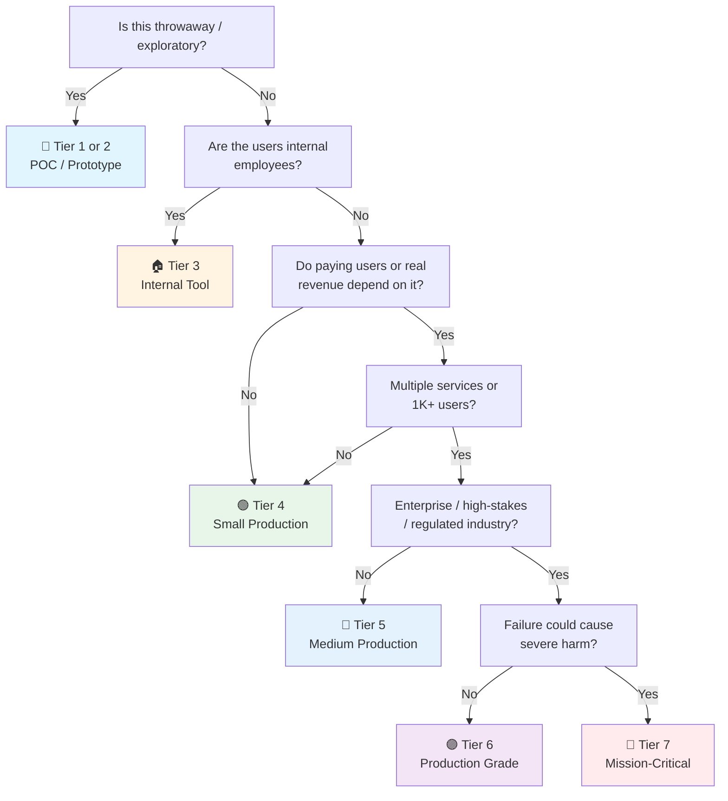

# Pytest Checklist

> Comprehensive Python testing with pytest. Covers fixtures, parametrize, markers, plugins, coverage, and patterns.
> Companion to the general [QA checklist](qa.md). For Python 3.10+ projects including AI/ML workloads.
> Last updated: 2026-08-07

---

## 1. Project Setup

- [ ] **Install pytest** — `uv add --dev pytest` (or `pip install pytest`). Core framework only.
- [ ] **Essential plugins**:
  ```bash
  uv add --dev pytest-cov          # Coverage reporting
  uv add --dev pytest-xdist        # Parallel test execution
  uv add --dev pytest-mock         # Mocking via mocker fixture
  uv add --dev pytest-asyncio      # Async test support (asyncio, trio)
  uv add --dev pytest-randomly     # Randomize test order (catch hidden dependencies)
  uv add --dev pytest-timeout      # Kill tests that hang
  ```
- [ ] **Optional but useful**:
  ```bash
  uv add --dev pytest-sugar        # Prettier output
  uv add --dev pytest-instafail    # Show failures as they happen
  uv add --dev hypothesis          # Property-based testing
  uv add --dev factory-boy         # Test data factories
  uv add --dev responses           # HTTP request mocking
  uv add --dev pytest-httpx        # Mock httpx requests
  ```
- [ ] **`pyproject.toml` configuration** — single source of truth:
  ```toml
  [tool.pytest.ini_options]
  testpaths = ["tests"]
  python_files = ["test_*.py"]
  python_classes = ["Test*"]
  python_functions = ["test_*"]
  addopts = [
      "-ra",                    # Show extra summary for all except passed
      "--strict-markers",       # Fail on unregistered markers
      "--strict-config",        # Fail on unknown config options
      "--tb=short",             # Shorter tracebacks
  ]
  markers = [
      "slow: marks tests as slow (deselect with '-m \"not slow\"')",
      "integration: marks tests requiring external services",
      "smoke: quick health-check tests for CI gate",
  ]
  filterwarnings = [
      "error",                  # Turn warnings into errors
      "ignore::DeprecationWarning",
  ]
  ```

---

## 2. Test Organization

- [ ] **Directory structure** — mirror source layout:
  ```
  project/
  ├── src/
  │   └── myapp/
  │       ├── __init__.py
  │       ├── core/
  │       │   ├── auth.py
  │       │   └── config.py
  │       ├── features/
  │       │   ├── users/
  │       │   │   ├── service.py
  │       │   │   └── repository.py
  │       │   └── items/
  │       │       └── ...
  │       └── utils/
  │           └── helpers.py
  └── tests/
      ├── conftest.py                # Root fixtures shared across all tests
      ├── core/
      │   ├── conftest.py            # Fixtures specific to core tests
      │   ├── test_auth.py
      │   └── test_config.py
      ├── features/
      │   ├── users/
      │   │   ├── test_service.py
      │   │   └── test_repository.py
      │   └── items/
      │       └── ...
      ├── integration/
      │   ├── conftest.py            # Integration-specific fixtures (DB, HTTP)
      │   └── test_api_endpoints.py
      ├── e2e/
      │   └── test_user_flows.py
      └── factories/                 # factory_boy factory definitions
          ├── __init__.py
          └── user_factory.py
  ```
- [ ] **Naming conventions** — `test_*.py` for files, `test_*` for functions, `Test*` for classes.
- [ ] **conftest.py hierarchy** — pytest auto-discovers conftest.py files. Root `conftest.py` for global fixtures, subdirectory ones for scoped fixtures. No imports needed — pytest injects them.
- [ ] **Separate test types** — unit tests (fast, isolated), integration tests (need services), e2e tests (full stack). Use markers or directories to select.
- [ ] **`__init__.py` in test dirs** — not required by pytest, but helps IDE navigation and imports.
- [ ] **Test data isolation** — each test should be independent. Use fixtures to create fresh state, not shared mutable globals.

---

## 3. Fixtures

- [ ] **Basic fixture** — reusable setup/teardown:
  ```python
  import pytest

  @pytest.fixture
  def sample_user():
      """Create a test user."""
      return User(name="Alice", email="alice@example.com")

  def test_user_greeting(sample_user):
      assert sample_user.greeting() == "Hello, Alice"
  ```
- [ ] **Fixture scope** — control lifetime:
  ```python
  @pytest.fixture(scope="function")   # Default: fresh per test
  @pytest.fixture(scope="class")      # Once per test class
  @pytest.fixture(scope="module")     # Once per test module
  @pytest.fixture(scope="session")    # Once per test session
  @pytest.fixture(scope="package")    # Once per package
  ```
- [ ] **Yield fixtures** — setup + teardown with cleanup:
  ```python
  @pytest.fixture
  def db_session():
      """Create a DB session with rollback after each test."""
      session = create_test_session()
      yield session
      session.rollback()
      session.close()

  @pytest.fixture(scope="session")
  def app_server():
      """Start a test server for the entire session."""
      server = start_test_server()
      yield server
      server.stop()
  ```
- [ ] **Fixture composition** — fixtures depend on other fixtures:
  ```python
  @pytest.fixture
  def db():
      return create_engine("sqlite:///:memory:")

  @pytest.fixture
  def session(db):
      with Session(db) as s:
          yield s

  @pytest.fixture
  def user_repo(session):
      return UserRepository(session)
  ```
- [ ] **`autouse=True`** — auto-applied without explicit request (use sparingly):
  ```python
  @pytest.fixture(autouse=True)
  def reset_singletons():
      """Reset all singletons between tests."""
      SingletonRegistry.clear()
      yield
      SingletonRegistry.clear()
  ```
- [ ] **`request` fixture** — access test metadata:
  ```python
  @pytest.fixture
  def db_name(request):
      """Create a unique DB name per test."""
      return f"test_db_{request.node.name}"
  ```
- [ ] **`tmp_path` fixture** — temporary directory (auto-cleaned):
  ```python
  def test_file_writing(tmp_path):
      config_file = tmp_path / "config.json"
      config_file.write_text('{"debug": true}')
      assert load_config(config_file)["debug"] is True
  ```
- [ ] **`monkeypatch` fixture** — modify env, sys.path, attributes:
  ```python
  def test_api_key(monkeypatch):
      monkeypatch.setenv("API_KEY", "test-key-123")
      assert get_api_key() == "test-key-123"

  def test_module_attr(monkeypatch):
      monkeypatch.setattr("myapp.config.DEBUG", True)
      assert is_debug_mode() is True
  ```
- [ ] **Fixture parametrization** — multiple values per fixture:
  ```python
  @pytest.fixture(params=["sqlite", "postgres", "mysql"])
  def db_engine(request):
      engine = create_engine(request.param)
      yield engine
      engine.dispose()

  def test_query(db_engine):
      # Runs 3 times, once per DB engine
      assert db_engine.execute("SELECT 1").scalar() == 1
  ```
- [ ] **`pytest.fixture` with `ids`** — readable test names:
  ```python
  @pytest.fixture(params=[1, 100, 999999], ids=["small", "medium", "large"])
  def batch_size(request):
      return request.param
  ```

---

## 4. Parametrize

- [ ] **Basic parametrize** — data-driven tests:
  ```python
  @pytest.mark.parametrize("input_val,expected", [
      ("hello", "HELLO"),
      ("World", "WORLD"),
      ("", ""),
  ])
  def test_to_upper(input_val, expected):
      assert input_val.upper() == expected
  ```
- [ ] **Multiple parameters** — cartesian product:
  ```python
  @pytest.mark.parametrize("x", [1, 2, 3])
  @pytest.mark.parametrize("y", [10, 20])
  def test_multiply(x, y):
      # Runs 6 times: (1,10), (1,20), (2,10), (2,20), (3,10), (3,20)
      assert multiply(x, y) == x * y
  ```
- [ ] **`ids` for readability** — meaningful test names:
  ```python
  @pytest.mark.parametrize("status_code,expected", [
      (200, "OK"),
      (404, "Not Found"),
      (500, "Internal Server Error"),
  ], ids=["success", "not-found", "server-error"])
  def test_status_messages(status_code, expected):
      assert get_status_message(status_code) == expected
  ```
- [ ] **`pytest.param` with marks** — mark individual cases:
  ```python
  @pytest.mark.parametrize("input_val,expected", [
      pytest.param("hello", "HELLO", id="normal"),
      pytest.param("", "", id="empty"),
      pytest.param(None, "", id="none", marks=pytest.mark.xfail(reason="Known bug")),
  ])
  def test_to_upper(input_val, expected):
      assert to_upper_safe(input_val) == expected
  ```
- [ ] **Indirect parametrization** — pass params through fixtures:
  ```python
  @pytest.fixture
  def user(request):
      """Create a user with the given role."""
      return create_user(role=request.param)

  @pytest.mark.parametrize("user", ["admin", "editor", "viewer"], indirect=True)
  def test_permissions(user):
      assert user.role in VALID_ROLES
  ```
- [ ] **CSV/JSON-driven tests** — load from external files:
  ```python
  import json
  from pathlib import Path

  TEST_DATA = json.loads((Path(__file__).parent / "test_data.json").read_text())

  @pytest.mark.parametrize("case", TEST_DATA["cases"], ids=lambda c: c["name"])
  def test_from_json(case):
      result = process(case["input"])
      assert result == case["expected"]
  ```
- [ ] **`parametrize` with `fixture`** — combine both:
  ```python
  @pytest.mark.parametrize("format", ["json", "csv", "xml"])
  def test_export(format, tmp_path):
      exporter = Exporter(format=format, output_dir=tmp_path)
      exporter.export(data)
      assert (tmp_path / f"output.{format}").exists()
  ```

---

## 5. Markers

- [ ] **Built-in markers**:
  ```python
  @pytest.mark.skip(reason="Not implemented yet")
  @pytest.mark.skipif(sys.platform == "win32", reason="Linux-only feature")
  @pytest.mark.skipif(sys.version_info < (3, 12), reason="Requires Python 3.12+")
  @pytest.mark.xfail(reason="Known bug #123")
  @pytest.mark.xfail(raises=ValueError, reason="Should raise ValueError")
  @pytest.mark.timeout(30)  # From pytest-timeout plugin
  ```
- [ ] **Custom markers** — register in `pyproject.toml`:
  ```toml
  [tool.pytest.ini_options]
  markers = [
      "slow: marks tests as slow (deselect with '-m \"not slow\"')",
      "integration: marks tests requiring external services",
      "smoke: quick health-check tests for CI gate",
      "gpu: marks tests requiring GPU",
      "flaky: known flaky tests (run with retries)",
  ]
  ```
- [ ] **Apply markers**:
  ```python
  @pytest.mark.slow
  def test_large_dataset():
      # This test takes 30+ seconds
      ...

  @pytest.mark.integration
  def test_database_connection():
      # Requires a running PostgreSQL instance
      ...

  @pytest.mark.smoke
  def test_health_endpoint(client):
      # Quick check for CI gate
      response = client.get("/health")
      assert response.status_code == 200
  ```
- [ ] **Select/deselect markers** — CLI usage:
  ```bash
  pytest -m "not slow"                    # Skip slow tests
  pytest -m "smoke"                       # Only smoke tests
  pytest -m "integration and not slow"    # Integration but not slow
  pytest -m "gpu or integration"          # Either GPU or integration
  pytest -m "not (slow or gpu)"           # Neither slow nor GPU
  ```
- [ ] **Class/module markers** — apply to all tests:
  ```python
  @pytest.mark.integration
  class TestDatabase:
      def test_create(self): ...
      def test_read(self): ...
      def test_update(self): ...
  ```
- [ ] **`pytestmark`** — module-level marker:
  ```python
  import pytest
  pytestmark = pytest.mark.slow  # All tests in this module are slow
  ```

---

## 6. Plugins

### pytest-cov (Coverage)

- [ ] **Install and configure**:
  ```bash
  uv add --dev pytest-cov
  ```
  ```toml
  [tool.pytest.ini_options]
  addopts = ["--cov=src", "--cov-report=term-missing", "--cov-report=html"]
  ```
- [ ] **CLI usage**:
  ```bash
  pytest --cov=src/myapp                    # Coverage for specific package
  pytest --cov=src --cov-report=html        # HTML report in htmlcov/
  pytest --cov=src --cov-report=xml         # XML for CI (codecov, coveralls)
  pytest --cov=src --cov-fail-under=80      # Fail if coverage < 80%
  pytest --cov=src --cov-branch             # Branch coverage (if/else paths)
  ```
- [ ] **`.coveragerc` or `[tool.coverage.run]`**:
  ```toml
  [tool.coverage.run]
  source = ["src"]
  omit = [
      "*/tests/*",
      "*/migrations/*",
      "*/__init__.py",
  ]
  branch = true

  [tool.coverage.report]
  exclude_lines = [
      "pragma: no cover",
      "if TYPE_CHECKING:",
      "if __name__ == .__main__.",
      "raise NotImplementedError",
  ]
  show_missing = true
  fail_under = 80
  ```

### pytest-xdist (Parallel Execution)

- [ ] **Install and use**:
  ```bash
  uv add --dev pytest-xdist
  ```
  ```bash
  pytest -n auto          # Auto-detect CPU count
  pytest -n 4             # Use 4 workers
  pytest -n logical       # Use logical CPU count (hyperthreading)
  ```
- [ ] **Scope-aware distribution**:
  ```bash
  pytest -n auto --dist loadscope   # Group by module/class
  pytest -n auto --dist loadfile    # Group by file
  ```
- [ ] **Avoid shared state** — xdist runs tests in separate processes. Session-scoped fixtures run once per worker, not once globally. Use file-based locks if needed.
- [ ] **`pytest-xdist` + `pytest-cov`** — works together:
  ```bash
  pytest -n auto --cov=src --cov-report=html
  ```

### pytest-mock (Mocking)

- [ ] **Install and basic usage**:
  ```bash
  uv add --dev pytest-mock
  ```
  ```python
  def test_send_email(mocker):
      mock_send = mocker.patch("myapp.email.send_email")
      send_welcome_email("user@example.com")
      mock_send.assert_called_once_with("user@example.com", "Welcome!")

  def test_api_call(mocker):
      mock_get = mocker.patch("requests.get")
      mock_get.return_value.json.return_value = {"status": "ok"}
      result = fetch_data()
      assert result == {"status": "ok"}
  ```
- [ ] **`mocker.spy`** — spy on method calls without replacing:
  ```python
  def test_logging(mocker):
      spy = mocker.spy(logger, "info")
      process_order(order)
      spy.assert_called_with("Order processed", order_id=123)
  ```
- [ ] **`mocker.patch.object`** — patch specific attributes:
  ```python
  def test_config(mocker):
      mocker.patch.object(settings, "DEBUG", True)
      assert is_debug_mode() is True
  ```
- [ ] **Async mocking**:
  ```python
  async def test_async_api(mocker):
      mock_fetch = mocker.patch("myapp.api.fetch_data", new_callable=AsyncMock)
      mock_fetch.return_value = {"data": "test"}
      result = await get_data()
      assert result == {"data": "test"}
  ```

### pytest-asyncio (Async Tests)

- [ ] **Install and configure**:
  ```bash
  uv add --dev pytest-asyncio
  ```
  ```toml
  [tool.pytest.ini_options]
  asyncio_mode = "auto"  # Auto-detect async tests (no @pytest.mark.asyncio needed)
  # Or "strict" to require explicit marking
  ```
- [ ] **Async test functions**:
  ```python
  import pytest

  @pytest.mark.asyncio  # Not needed if asyncio_mode = "auto"
  async def test_async_function():
      result = await async_operation()
      assert result == "expected"
  ```
- [ ] **Async fixtures**:
  ```python
  @pytest.fixture
  async def async_client():
      async with httpx.AsyncClient() as client:
          yield client

  @pytest.mark.asyncio
  async def test_api(async_client):
      response = await async_client.get("https://api.example.com")
      assert response.status_code == 200
  ```
- [ ] **`pytest-asyncio` + `pytest-mock`**:
  ```python
  @pytest.mark.asyncio
  async def test_async_with_mock(mocker):
      mock_db = mocker.AsyncMock()
      mock_db.fetch_one.return_value = {"id": 1, "name": "Alice"}
      result = await get_user(mock_db, 1)
      assert result["name"] == "Alice"
  ```

---

## 7. Coverage Configuration

- [ ] **Set coverage targets** — aim for 80%+ on business logic, 60%+ overall:
  ```toml
  [tool.coverage.report]
  fail_under = 80
  ```
- [ ] **Exclude non-testable code**:
  ```toml
  [tool.coverage.run]
  omit = [
      "*/tests/*",
      "*/migrations/*",
      "*/__init__.py",
      "*/conftest.py",
      "*/factories/*",
  ]
  ```
- [ ] **Exclude specific lines**:
  ```python
  def debug_only_function():  # pragma: no cover
      # This only runs in debug mode
      ...

  if TYPE_CHECKING:  # Auto-excluded
      from myapp.types import MyType
  ```
- [ ] **Branch coverage** — catch missing else/elif paths:
  ```toml
  [tool.coverage.run]
  branch = true
  ```
- [ ] **Coverage in CI** — upload to codecov/coveralls:
  ```yaml
  # .github/workflows/test.yml
  - name: Run tests with coverage
    run: pytest --cov=src --cov-report=xml
  - name: Upload to Codecov
    uses: codecov/codecov-action@v4
    with:
      file: ./coverage.xml
  ```
- [ ] **Diff coverage** — only measure new/changed code:
  ```bash
  pip install diff-cover
  pytest --cov=src --cov-report=xml
  diff-cover coverage.xml --compare-branch=origin/main
  ```

---

## 8. Common Patterns

- [ ] **Arrange-Act-Assert (AAA)** — structure every test:
  ```python
  def test_user_creation():
      # Arrange
      user_data = {"name": "Alice", "email": "alice@example.com"}

      # Act
      user = create_user(user_data)

      # Assert
      assert user.name == "Alice"
      assert user.email == "alice@example.com"
      assert user.id is not None
  ```
- [ ] **Test doubles** — stubs, mocks, fakes:
  ```python
  # Stub: returns canned data
  class StubEmailService:
      def send(self, to, subject, body):
          return True

  # Mock: records calls for verification
  def test_welcome_email(mocker):
      mock_email = mocker.Mock()
      send_welcome_email(mock_email, "user@example.com")
      mock_email.send.assert_called_once()

  # Fake: working implementation (in-memory DB, etc.)
  class FakeDatabase:
      def __init__(self):
          self._data = {}
      def save(self, key, value):
          self._data[key] = value
      def get(self, key):
          return self._data.get(key)
  ```
- [ ] **Context managers in tests**:
  ```python
  def test_file_handling(tmp_path):
      with open(tmp_path / "test.txt", "w") as f:
          f.write("test content")
      # File is automatically closed
      assert (tmp_path / "test.txt").read_text() == "test content"
  ```
- [ ] **Exception testing**:
  ```python
  def test_division_by_zero():
      with pytest.raises(ZeroDivisionError):
          divide(10, 0)

  def test_validation_error():
      with pytest.raises(ValueError, match="must be positive"):
          validate_age(-5)

  def test_custom_exception():
      with pytest.raises(AuthenticationError) as exc_info:
          authenticate("wrong_password")
      assert exc_info.value.code == "INVALID_CREDENTIALS"
  ```
- [ ] **Warning testing**:
  ```python
  def test_deprecation_warning():
      with pytest.warns(DeprecationWarning, match="Use new_function instead"):
          old_function()
  ```
- [ ] **Capture stdout/stderr**:
  ```python
  def test_cli_output(capsys):
      run_cli_command(["--version"])
      captured = capsys.readouterr()
      assert "v1.2.3" in captured.out
      assert captured.err == ""
  ```
- [ ] **Test classes** — group related tests:
  ```python
  class TestUserService:
      @pytest.fixture
      def service(self, db_session):
          return UserService(db_session)

      def test_create_user(self, service):
          user = service.create("Alice", "alice@example.com")
          assert user.name == "Alice"

      def test_create_duplicate_email(self, service):
          service.create("Alice", "alice@example.com")
          with pytest.raises(DuplicateEmailError):
              service.create("Bob", "alice@example.com")
  ```

---

## 9. Advanced Patterns

- [ ] **Property-based testing with Hypothesis**:
  ```python
  from hypothesis import given, strategies as st

  @given(st.text(min_size=1, max_size=100))
  def test_string_length(name):
      assert len(name) >= 1
      assert len(name) <= 100

  @given(st.integers(min_value=0, max_value=150))
  def test_age_validation(age):
      user = User(name="Test", age=age)
      assert 0 <= user.age <= 150
  ```
- [ ] **Snapshot testing** — `syrupy` or `pytest-snapshot`:
  ```python
  def test_api_response(snapshot):
      response = client.get("/api/users/1")
      assert response.json() == snapshot
  ```
- [ ] **Database testing with transactions**:
  ```python
  @pytest.fixture
  def db_session():
      """Each test gets a fresh transaction that rolls back."""
      connection = engine.connect()
      transaction = connection.begin()
      session = Session(bind=connection)
      yield session
      session.close()
      transaction.rollback()
      connection.close()
  ```
- [ ] **Testcontainers for integration tests**:
  ```python
  from testcontainers.postgres import PostgresContainer

  @pytest.fixture(scope="session")
  def postgres_url():
      with PostgresContainer("postgres:16") as pg:
          yield pg.get_connection_url()
  ```
- [ ] **Freezegun for time-dependent tests**:
  ```python
  from freezegun import freeze_time

  @freeze_time("2026-01-01 12:00:00")
  def test_new_year_promotion():
      assert is_promotion_active() is True
  ```
- [ ] **Custom assertion helpers**:
  ```python
  # tests/helpers.py
  def assert_user_valid(user):
      assert user.id is not None
      assert user.email is not None
      assert "@" in user.email
      assert len(user.name) > 0

  # test_user.py
  def test_user_creation():
      user = create_user("Alice", "alice@example.com")
      assert_user_valid(user)
  ```
- [ ] **Data-driven tests from CSV/JSON**:
  ```python
  import csv
  from pathlib import Path

  def load_test_cases():
      cases = []
      with open(Path(__file__).parent / "test_cases.csv") as f:
          reader = csv.DictReader(f)
          for row in reader:
              cases.append(pytest.param(row["input"], row["expected"], id=row["name"]))
      return cases

  @pytest.mark.parametrize("input_val,expected", load_test_cases())
  def test_from_csv(input_val, expected):
      assert process(input_val) == expected
  ```

---

## 10. Pitfalls

- [ ] **Shared mutable state** — never use module-level variables or class attributes that tests modify. Use fixtures to create fresh state.
- [ ] **Test interdependence** — tests should pass in any order. Use `pytest-randomly` to catch hidden dependencies.
- [ ] **Slow tests in CI** — mark slow tests and exclude from fast CI runs: `pytest -m "not slow"`.
- [ ] **Flaky tests** — don't ignore them. Mark with `@pytest.mark.flaky`, fix the root cause (timing, network, shared state), or delete.
- [ ] **Mocking too much** — if you mock everything, you're testing your mocks, not your code. Use real dependencies when possible (testcontainers, in-memory DBs).
- [ ] **Assertion messages** — always explain what failed:
  ```python
  # Bad
  assert response.status_code == 200

  # Good
  assert response.status_code == 200, f"Expected 200, got {response.status_code}: {response.text}"
  ```
- [ ] **`is` vs `==`** — use `is` for identity (None, True, False), `==` for equality:
  ```python
  assert result is None      # Correct
  assert result == None      # Wrong (works but bad practice)
  ```
- [ ] **Testing private methods** — test the public API, not implementation details. Private methods should be tested indirectly through public methods.
- [ ] **Hardcoded paths** — use `tmp_path`, `tmpdir`, or `pathlib.Path(__file__).parent` for test data.
- [ ] **Global fixture side effects** — `autouse=True` fixtures affect all tests. Keep them idempotent and fast.
- [ ] **Async/sync confusion** — never call async functions without `await` in async tests. Use `pytest-asyncio` with `asyncio_mode = "auto"`.
- [ ] **Database leaks** — always rollback or use transactions in tests. Never commit test data to a shared test DB.
- [ ] **Environment variable pollution** — use `monkeypatch.setenv()` to set env vars in tests. Never rely on the host environment.
- [ ] **`time.sleep()` in tests** — avoid unless absolutely necessary. Use `freezegun` or async event waiting instead.

---

## Quick Sanity Check

- [ ] `pytest` runs — all tests pass
- [ ] `pytest --cov=src` shows coverage — above target threshold
- [ ] `pytest -n auto` passes — tests work in parallel (no shared state)
- [ ] `pytest -m "not slow"` is fast — quick feedback loop for development
- [ ] `pytest -m smoke` passes — CI gate tests are green
- [ ] `pytest --tb=short` shows clear errors — failures are easy to debug
- [ ] No flaky tests — `pytest --count=10` (with pytest-repeat) shows consistency
- [ ] `pytest-randomly` passes — test order doesn't matter
- [ ] Coverage report generated — `htmlcov/index.html` opens in browser
- [ ] All markers registered — `pytest --strict-markers` doesn't fail
- [ ] Fixtures documented — complex fixtures have docstrings explaining scope and behavior
- [ ] Test data isolated — each test creates its own data via fixtures

---

## Project Tier Scoping Matrix

> **How to use this table:** Pick your tier first, then focus only on the sections marked ✅ (required) or 🟡 (recommended). Skip ❌ sections entirely — they'd be over-engineering for your context. This matrix adapts testing rigor to project maturity.
>
> **Legend:** ✅ Required · 🟡 Recommended / partial · ❌ Skip

### Tier Descriptions

| # | Tier | Description | Typical Team | Users | Lifespan |
|---|---|---|---|---|---|
| 1 | 🧪 **POC / Spike** | Validate an idea. Throwaway code. `print()` is fine. | 1 dev | Internal only | Days–weeks |
| 2 | 🔧 **Prototype / MVP** | Waiting for integration or user validation. Might become real. | 1–2 devs | Beta testers | Weeks–months |
| 3 | 🏠 **Internal Tool** | Real users (employees), real traffic. No external exposure or paying customers. | 1–3 devs | Employees | Ongoing |
| 4 | 🟢 **Small Production** | Single service, few endpoints, low traffic. Real users, maybe early revenue. | 1–2 devs | < 1K users | Ongoing |
| 5 | 🔵 **Medium Production** | Multiple services or higher traffic. Real revenue or user base that matters. | 2–5 devs | 1K–100K users | Ongoing |
| 6 | 🟣 **Production Grade** | Full rigor — high-stakes SaaS, enterprise product, or large user base. | 5+ devs | 100K+ users | Long-term |
| 7 | 🔴 **Mission-Critical / Regulated** | Healthcare (HIPAA), finance (PCI-DSS), safety systems. Failure = severe harm. | 10+ devs | Varies | Decades |

### Which Tier Am I?



### Pytest Checklist Applicability by Tier

| # | Section | 🧪 POC | 🔧 Prototype | 🏠 Internal | 🟢 Small Prod | 🔵 Medium Prod | 🟣 Production Grade | 🔴 Mission-Critical |
|---|---|:---:|:---:|:---:|:---:|:---:|:---:|:---:|
| 1 | Project Setup | 🟡 basic pytest | ✅ + pytest-cov | ✅ + plugins | ✅ + full config | ✅ + CI integration | ✅ + strict mode | ✅ + audit trail |
| 2 | Test Organization | ❌ | 🟡 flat structure | ✅ directories | ✅ + separation | ✅ + integration dir | ✅ + e2e dir | ✅ + formal suites |
| 3 | Fixtures | 🟡 basic | ✅ | ✅ + scoped | ✅ + composition | ✅ + parametrized | ✅ + advanced | ✅ + documented |
| 4 | Parametrize | 🟡 basic | ✅ | ✅ + ids | ✅ + indirect | ✅ + data-driven | ✅ + external files | ✅ + generated |
| 5 | Markers | ❌ | 🟡 skip/xfail | ✅ custom | ✅ + selection | ✅ + CI gates | ✅ + full taxonomy | ✅ + compliance tags |
| 6 | Plugins | 🟡 pytest-cov | ✅ cov + mock | ✅ + xdist | ✅ + asyncio | ✅ + full stack | ✅ + custom plugins | ✅ + vetted plugins |
| 7 | Coverage | ❌ | 🟡 basic report | ✅ 70% target | ✅ 80% target | ✅ + branch | ✅ + diff coverage | ✅ + 95% + mutation |
| 8 | Common Patterns | 🟡 basic assert | ✅ AAA | ✅ + exceptions | ✅ + test doubles | ✅ + full patterns | ✅ + helpers | ✅ + formal framework |
| 9 | Advanced Patterns | ❌ | ❌ | 🟡 hypothesis | 🟡 snapshot | ✅ property-based | ✅ + testcontainers | ✅ + chaos testing |
| 10 | Pitfalls | ❌ | 🟡 review | ✅ checklist | ✅ + code review | ✅ + linting | ✅ + static analysis | ✅ + formal process |

---

## Sources

- Pytest documentation — https://docs.pytest.org/
- Pytest plugin index — https://docs.pytest.org/en/stable/reference/plugin_list.html
- Hypothesis (property-based testing) — https://hypothesis.readthedocs.io/
- Coverage.py — https://coverage.readthedocs.io/
- `[[qa]]` — general QA checklist (tick first)
