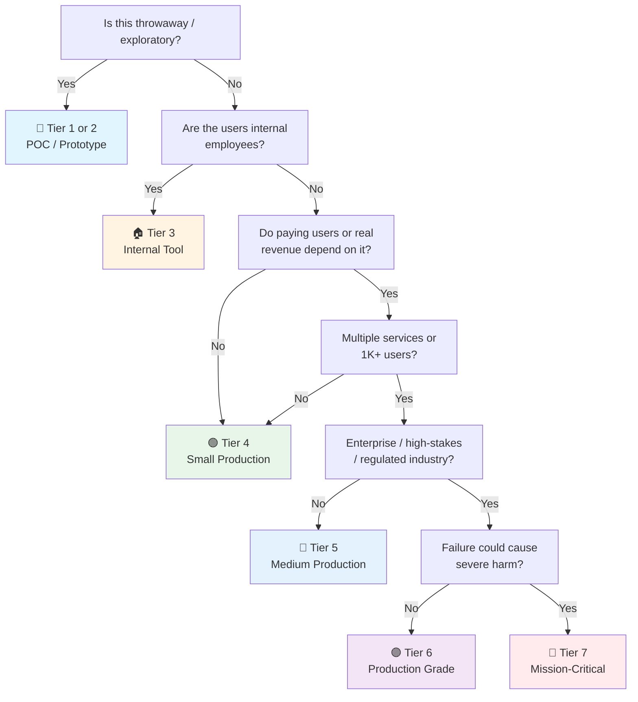

# QA / Testing Checklist

> The **quality strategy** checklist — what "tested" means across the whole system.
> Horizontal: applies to APIs, web, mobile, batch, infra — the pyramid is the same, the tools change.
> Complements [[Release]] (test gates in CI), [[Security]] (SAST/DAST §9), and every domain checklist's testing section.
> Deep references: SWEBOK Testing chapter ([[SWEBOK v4 - Book Checklist]]), your QA vault.
> Last updated: 2026-08-05

---

## 1. Test Strategy (The Pyramid)

- [ ] **Test pyramid understood and applied** — Many unit tests (fast, isolated) → fewer integration tests (real components) → minimal E2E (critical flows only). Inverted pyramid = slow, flaky, expensive.
- [ ] **Strategy documented** — What's tested at each level, what's automated, what's manual, and *why*. One paragraph per level, not a novel.
- [ ] **Business logic ≥ 80% unit coverage** — The domain rules, validators, calculations. Not UI glue, not framework wiring.
- [ ] **Coverage is a floor, not a goal** — 80% on business logic, but the *right* 80%. Untested critical path beats tested trivial path. Mutation testing (see §7) tells you if coverage is meaningful.
- [ ] **Tests are fast** — Unit suite < 2 min, integration < 10 min. Slow suites get skipped → skipped tests are untested code.

## 2. Unit Testing

- [ ] **Framework chosen per stack** — xUnit/Jest/Vitest/pytest/JUnit/Go test — whatever the ecosystem standard is (see framework checklists). Consistency over novelty.
- [ ] **Test naming convention** — `Method_Scenario_Expected` or `Given_When_Then` — picked once, used everywhere.
- [ ] **AAA structure** — Arrange, Act, Assert. Every test readable in 10 seconds.
- [ ] **One behavior per test** — Multiple asserts on the same behavior OK; multiple behaviors in one test = debugging hell.
- [ ] **No test interdependence** — No shared mutable state, no order dependence, no "runs only after test X". `--random-order` in CI proves it.
- [ ] **Mocks used sparingly** — Mock the *boundary* (DB, HTTP, clock), not the internals. Over-mocking = testing the mock, not the code.
- [ ] **Edge cases covered** — Empty input, null, boundary values, overflow, timezone changes, unicode. Happy path only = 20% of the work.

## 3. Integration Testing

- [ ] **Real dependencies, not doubles** — Testcontainers (Postgres/MySQL/Redis), real message brokers, real filesystems. In-memory substitutes (H2, fake Redis) lie → see [[Database]] checklists.
- [ ] **Database tests** — Migrations applied fresh, seed data controlled, transactions rolled back between tests (Respawn/`TRUNCATE`).
- [ ] **API contract tests** — Request/response against the OpenAPI spec: happy path + key error cases. Contract drift caught in CI, not by angry consumers → [[API Launch]].
- [ ] **Auth tested** — 401 unauthenticated, 403 unauthorized, token expiry, role boundaries. The most-tested security path should be automated.
- [ ] **Persistence round-trips** — Write → read → update → delete for every entity. ORM mapping errors live here.

## 4. E2E Testing

- [ ] **Critical user journeys only** — Login → navigate → create → edit → delete (per domain: order flow, signup flow, batch run flow). 10 solid journeys beat 100 brittle ones.
- [ ] **Playwright/Cypress standard** — Multi-browser (Chromium + Firefox + WebKit), parallel, screenshots on failure, video for flake forensics.
- [ ] **E2E in CI, not just locally** — Against a real deployed environment (preview/staging), not against mocks. That's the whole point.
- [ ] **Visual regression** — `toHaveScreenshot()` on key pages. Catch layout drift that functional tests miss.
- [ ] **Flake management** — Retry policy explicit, flaky tests quarantined and fixed within a sprint. A flaky suite erodes trust in everything.

## 5. Test Data Management

- [ ] **Factories over fixtures** — factory_boy / Factory Bot / builders generate realistic data programmatically. Frozen JSON fixtures rot.
- [ ] **Test data isolated** — Each test gets its own data (unique emails, timestamps). No shared DB rows across tests.
- [ ] **Seed strategy for environments** — Staging has representative data (volume + variety), not production copies (PII!). Synthetic data generators for realistic shapes.
- [ ] **No production data in tests** — GDPR/regulatory violation + flaky tests. Anonymized subsets only, and only where truly needed.

## 6. CI Integration (Test Gates)

- [ ] **Tests run on every PR** — Unit + integration in CI, E2E on preview deploys. Merging with red tests = broken pipeline culture → [[Release]] §2.
- [ ] **Pipeline stages ordered** — Lint → type-check → unit (fast feedback) → integration → build → deploy preview → E2E → promote. Fail fast at the cheapest stage.
- [ ] **Coverage reported per PR** — Diff coverage (new lines) more useful than absolute. Block on *decreasing* coverage, not on a magic number.
- [ ] **Test artifacts collected** — JUnit XML, coverage HTML, Playwright reports uploaded to CI. Failure analysis without artifacts = guesswork.
- [ ] **Parallelization** — Test sharding across CI runners. 40-minute suites die; 5-minute suites run on every commit.

## 7. Advanced Techniques (Medium+ Tiers)

- [ ] **Mutation testing** — Stryker (JS/TS/Java/C#) or mutmut (Python): mutate code, tests should fail. Kills "green but meaningless" coverage. Run on core business logic in CI or nightly.
- [ ] **Property-based testing** — Hypothesis (Python), fast-check (JS), QuickTheories (Java): random inputs, invariants verified. Amazing for parsers, validators, serialization.
- [ ] **Contract testing (consumer-driven)** — Pact for service-to-service contracts. Consumer expectations verified against provider before deploy. Microservice must-have → [[Microservice Launch]].
- [ ] **Load/performance tests** — k6, Gatling, Locust: peak-traffic scenarios with SLOs asserted (p95 < X, error rate < Y). Not "how fast can it go" — "does it hold under expected load" → [[Database]] §4.
- [ ] **Chaos testing** — Game days: kill a dependency, fail a replica, throttle network. Verify graceful degradation actually works → [[Release]] §8 rollback practice overlaps.
- [ ] **Accessibility tests automated** — axe-core in unit + E2E. A11y regressions blocked in CI → [[Frontend Launch]].

## 8. Quality Metrics & Reporting

- [ ] **Metrics that matter** — Pass rate, flake rate, coverage trend, defect escape rate (bugs found in prod / total bugs), MTTR for failing builds.
- [ ] **DORA-informed** — Change failure rate and deployment frequency trended. High CFR = testing strategy problem, not a people problem → [[Release]] §10.
- [ ] **Defect triage** — Bugs triaged against acceptance criteria before fixing ("is this actually a defect, or a spec gap?"). QA findings verified against the criteria, not just forwarded.

---

## Quick Sanity Check Before Launch

- [ ] Unit suite green, < 2 min, business logic ≥ 80% covered
- [ ] Integration tests against real dependencies (Testcontainers), not in-memory fakes
- [ ] E2E journeys green against staging/preview in CI
- [ ] Auth paths (401/403/expiry) automated
- [ ] No flaky tests — flake rate tracked and trending down
- [ ] Coverage reported per PR, diff coverage not decreasing
- [ ] Mutation testing on core logic (medium+ tiers)
- [ ] Load test done against expected peak with SLO assertions (medium+ tiers)

---

## Project Tier Scoping Matrix

> **How to use this table:** Pick your tier first, then focus only on the sections marked ✅ (required) or 🟡 (recommended). Skip ❌ sections entirely — they'd be over-engineering for your context.
>
> **Legend:** ✅ Required · 🟡 Recommended / partial · ❌ Skip

### Tier Descriptions

| # | Tier | Description | Typical Team | Users | Lifespan |
|---|---|---|---|---|---|
| 1 | 🧪 **POC / Spike** | Validate an idea. Maybe a smoke test. | 1 dev | Internal only | Days–weeks |
| 2 | 🔧 **Prototype / MVP** | Waiting for integration or user validation. Might become real. | 1–2 devs | Beta testers | Weeks–months |
| 3 | 🏠 **Internal Tool** | Real users (employees), real traffic. No external exposure or paying customers. | 1–3 devs | Employees | Ongoing |
| 4 | 🟢 **Small Production** | Single service/app, low traffic. Real users, maybe early revenue. | 1–2 devs | < 1K users | Ongoing |
| 5 | 🔵 **Medium Production** | Multiple services or higher traffic. Real revenue or user base that matters. | 2–5 devs | 1K–100K users | Ongoing |
| 6 | 🟣 **Production Grade** | Full rigor — high-stakes SaaS, enterprise product, or large user base. | 5+ devs | 100K+ users | Long-term |
| 7 | 🔴 **Mission-Critical / Regulated** | Healthcare (HIPAA), finance (PCI-DSS), safety systems. Failure = severe harm. | 10+ devs | Varies | Decades |

### Which Tier Am I?

### Checklist Applicability by Tier

| # | Section | 🧪 POC | 🔧 Prototype | 🏠 Internal | 🟢 Small Prod | 🔵 Medium Prod | 🟣 Production Grade | 🔴 Mission-Critical |
|---|---|:---:|:---:|:---:|:---:|:---:|:---:|:---:|
| 1 | Test Strategy | 🟡 smoke only | 🟡 basic pyramid | ✅ | ✅ | ✅ | ✅ | ✅ + formal |
| 2 | Unit Testing | ❌ | 🟡 critical logic | ✅ | ✅ ≥ 80% | ✅ + mutation | ✅ + property | ✅ + formal |
| 3 | Integration Testing | ❌ | 🟡 DB round-trip | ✅ + Testcontainers | ✅ + contract | ✅ + auth paths | ✅ + full | ✅ + formal |
| 4 | E2E Testing | ❌ | ❌ | 🟡 top 5 journeys | ✅ + CI | ✅ + visual reg | ✅ + multi-browser | ✅ + formal |
| 5 | Test Data | ❌ | 🟡 fixtures | ✅ + factories | ✅ + isolated | ✅ + env seeds | ✅ + anonymized | ✅ + regulatory |
| 6 | CI Integration | ❌ | 🟡 test on PR | ✅ | ✅ + coverage gate | ✅ + sharding | ✅ + full pipeline | ✅ + signed evidence |
| 7 | Advanced Techniques | ❌ | ❌ | 🟡 load basic | 🟡 if needed | ✅ + mutation + contract | ✅ + chaos + property | ✅ + formal V&V |
| 8 | Quality Metrics | ❌ | ❌ | 🟡 pass rate | 🟡 + flake rate | ✅ + escape rate | ✅ + DORA trend | ✅ + regulatory audit |

---

## Sources

- Complements [[Release]] (CI test gates), [[Security]] (SAST/DAST), [[Database]] (integration test real engines).
- Domain testing sections: [[API Launch]], [[Frontend Launch]], [[Microservice Launch]].
- SWEBOK v4 Testing chapter — [[SWEBOK v4 - Book Checklist]].
