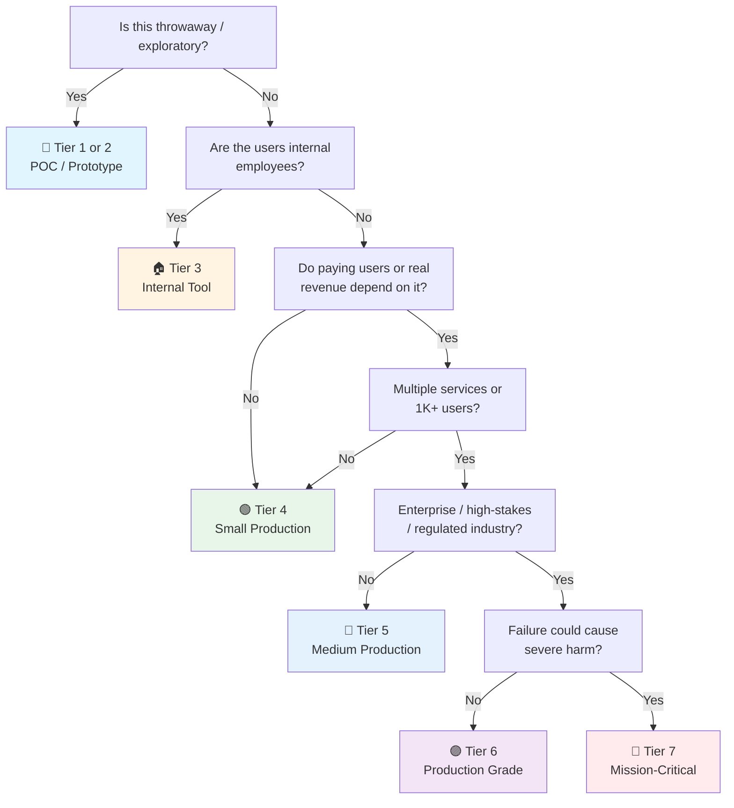

# Testcontainers Checklist

> Real dependency containers for integration tests — no mocks, no stubs, no "works on my machine."
> Multi-language: Java (Spring Boot 4.1), Go, Node.js, Python. Covers lifecycle, reuse, CI optimization, and production patterns.
> Companion to the [Pytest checklist](pytest.md) and general [QA checklist](qa.md).
> Last updated: 2026-08-07

---

## 1. Setup by Language

### Java (Spring Boot 4.1 / JUnit 5)

- [ ] **Add dependencies** — `build.gradle.kts`:
  ```kotlin
  dependencies {
      testImplementation("org.testcontainers:testcontainers:1.20.+")
      testImplementation("org.testcontainers:junit-jupiter:1.20.+")
      // Service-specific modules:
      testImplementation("org.testcontainers:postgresql:1.20.+")
      testImplementation("org.testcontainers:mysql:1.20.+")
      testImplementation("org.testcontainers:kafka:1.20.+")
      testImplementation("org.testcontainers:elasticsearch:1.20.+")
      testImplementation("org.testcontainers:rabbitmq:1.20.+")
      testImplementation("org.testcontainers:localstack:1.20.+")
  }
  ```
- [ ] **Maven equivalent** — `pom.xml`:
  ```xml
  <dependency>
      <groupId>org.testcontainers</groupId>
      <artifactId>testcontainers-bom</artifactId>
      <version>1.20.4</version>
      <type>pom</type>
      <scope>import</scope>
  </dependency>
  ```
- [ ] **JUnit 5 extension** — add `@Testcontainers` on the test class:
  ```java
  @Testcontainers
  @SpringBootTest
  class OrderServiceIntegrationTest {
      @Container
      static PostgreSQLContainer<?> postgres = new PostgreSQLContainer<>("postgres:16");
  }
  ```

### Go

- [ ] **Install** — `go get github.com/testcontainers/testcontainers-go`:
  ```bash
  go get github.com/testcontainers/testcontainers-go
  go get github.com/testcontainers/testcontainers-go/modules/postgres
  ```
- [ ] **Basic usage**:
  ```go
  func TestPostgresQuery(t *testing.T) {
      ctx := context.Background()
      pg, err := postgres.Run(ctx, "postgres:16",
          postgres.WithDatabase("testdb"),
          postgres.WithUsername("test"),
          postgres.WithPassword("test"),
          testcontainers.WithWaitStrategy(
              wait.ForLog("database system is ready to accept connections"),
          ),
      )
      testcontainers.CleanupContainer(t, pg)
      require.NoError(t, err)

      connStr, err := pg.ConnectionString(ctx, "sslmode=disable")
      require.NoError(t, err)
      // Use connStr with database/sql or pgx
  }
  ```

### Node.js (TypeScript)

- [ ] **Install** — `npm install -D testcontainers @testcontainers/postgresql`:
  ```bash
  npm install -D testcontainers
  npm install -D @testcontainers/postgresql  # Service modules
  ```
- [ ] **Basic usage**:
  ```typescript
  import { PostgreSqlContainer } from "@testcontainers/postgresql";

  describe("UserRepository", () => {
      let container: StartedPostgreSqlContainer;

      beforeAll(async () => {
          container = await new PostgreSqlContainer("postgres:16")
              .withDatabase("testdb")
              .start();
      }, 30_000); // 30s timeout for container start

      afterAll(async () => {
          await container.stop();
      });

      it("should save and retrieve a user", async () => {
          const pool = new Pool({ connectionString: container.getConnectionUri() });
          // ... test code
          await pool.end();
      });
  });
  ```

### Python

- [ ] **Install** — `uv add --dev testcontainers`:
  ```bash
  uv add --dev testcontainers[postgres,redis,kafka]
  ```
- [ ] **Basic usage**:
  ```python
  from testcontainers.postgres import PostgresContainer

  def test_database_operations():
      with PostgresContainer("postgres:16") as pg:
          url = pg.get_connection_url()
          # Connect and test
          assert run_migration(url) is True
  ```
- [ ] **Session-scoped fixture** (pytest integration):
  ```python
  import pytest
  from testcontainers.postgres import PostgresContainer

  @pytest.fixture(scope="session")
  def postgres_url():
      with PostgresContainer("postgres:16") as pg:
          yield pg.get_connection_url()
  ```

---

## 2. Container Lifecycle

### @Container & @Testcontainers (Java)

- [ ] **`@Testcontainers`** — enables lifecycle management on the test class:
  ```java
  @Testcontainers
  class MyIntegrationTest {
      // Static = shared across all test methods (class-level)
      @Container
      static PostgreSQLContainer<?> postgres = new PostgreSQLContainer<>("postgres:16");

      // Instance = fresh per test method (test-level)
      @Container
      GenericContainer<?> redis = new GenericContainer<>("redis:7")
          .withExposedPorts(6379);
  }
  ```
- [ ] **Static vs instance containers** — choose wisely:
  - **Static `@Container`**: started once before all tests, stopped after all tests. Fast but shared state risk.
  - **Instance `@Container`**: started/stopped per test method. Isolated but slower.
- [ ] **`@DynamicPropertySource`** — wire container properties into Spring:
  ```java
  @Testcontainers
  @SpringBootTest
  class OrderRepositoryTest {
      @Container
      static PostgreSQLContainer<?> postgres = new PostgreSQLContainer<>("postgres:16");

      @DynamicPropertySource
      static void configureProperties(DynamicPropertyRegistry registry) {
          registry.add("spring.datasource.url", postgres::getJdbcUrl);
          registry.add("spring.datasource.username", postgres::getUsername);
          registry.add("spring.datasource.password", postgres::getPassword);
      }
  }
  ```
- [ ] **`@ServiceConnection` (Spring Boot 3.1+)** — auto-wire without manual property registration:
  ```java
  @Testcontainers
  @SpringBootTest
  class OrderRepositoryTest {
      @Container
      @ServiceConnection  // Auto-configures spring.datasource.*
      static PostgreSQLContainer<?> postgres = new PostgreSQLContainer<>("postgres:16");

      @Container
      @ServiceConnection  // Auto-configures spring.data.redis.*
      static GenericContainer<?> redis = new GenericContainer<>("redis:7")
          .withExposedPorts(6379);
  }
  ```

### GenericContainer (All Languages)

- [ ] **Java GenericContainer** — for any image:
  ```java
  GenericContainer<?> myService = new GenericContainer<>("myapp:latest")
      .withExposedPorts(8080)
      .withEnv("DATABASE_URL", postgres.getJdbcUrl())
      .withEnv("REDIS_URL", "redis://redis:6379")
      .waitingFor(Wait.forHttp("/health").forPort(8080));
  ```
- [ ] **Go GenericContainer** — `GenericContainerRequest`:
  ```go
  req := testcontainers.GenericContainerRequest{
      ContainerRequest: testcontainers.ContainerRequest{
          Image:        "myapp:latest",
          ExposedPorts: []string{"8080/tcp"},
          Env:          map[string]string{"LOG_LEVEL": "debug"},
          WaitingFor:   wait.ForHTTP("/health"),
      },
      Started: true,
  }
  container, err := testcontainers.GenericContainer(ctx, req)
  ```

---

## 3. Reuse Strategy

- [ ] **Enable reuse** — `~/.testcontainers.properties`:
  ```properties
  testcontainers.reuse.enable=true
  ```
- [ ] **Mark containers reusable** (Java):
  ```java
  PostgreSQLContainer<?> postgres = new PostgreSQLContainer<>("postgres:16")
      .withReuse(true);  // Container survives test run
  ```
- [ ] **How reuse works**:
  - Container hash is computed from image, env vars, exposed ports, command, etc.
  - If a matching container exists, it's reused (not recreated).
  - Containers are labeled `org.testcontainers.hash` and survive JVM restarts.
  - **You must clean state manually** — each test run reuses the same container.
- [ ] **When to use reuse**:
  - ✅ Local development — save 10-30s per test run on container startup.
  - ✅ Large integration suites where container boot dominates.
  - ❌ CI environments — unpredictable state between builds.
  - ❌ Tests that mutate container state without cleanup.
- [ ] **Reaper container** — `testcontainers` uses Ryuk (`testcontainers/ryuk`) to clean up containers on JVM exit. With `reuse=true`, Ryuk is still active but skips reused containers.
- [ ] **Disable Ryuk in CI** (sometimes needed in Docker-in-Docker):
  ```properties
  testcontainers.ryuk.disabled=true
  ```

---

## 4. Singleton Containers

- [ ] **Pattern** — one container for all tests in the suite:
  ```java
  public abstract class AbstractIntegrationTest {
      static final PostgreSQLContainer<?> POSTGRES;

      static {
          POSTGRES = new PostgreSQLContainer<>("postgres:16");
          POSTGRES.start();
      }

      @DynamicPropertySource
      static void properties(DynamicPropertyRegistry registry) {
          registry.add("spring.datasource.url", POSTGRES::getJdbcUrl);
          registry.add("spring.datasource.username", POSTGRES::getUsername);
          registry.add("spring.datasource.password", POSTGRES::getPassword);
      }
  }
  ```
- [ ] **Benefits** — single container boot for the entire suite. Fast.
- [ ] **Risks** — test pollution if state leaks between test classes.
- [ ] **Mitigation** — each test class should:
  - Use transactions with rollback, OR
  - Use unique schema/database per test class, OR
  - Clean data in `@AfterEach` / `@BeforeEach`.
- [ ] **Go singleton** — package-level variable:
  ```go
  var (
      postgresContainer testcontainers.Container
      postgresURL       string
  )

  func TestMain(m *testing.M) {
      ctx := context.Background()
      c, err := postgres.Run(ctx, "postgres:16",
          postgres.WithDatabase("testdb"),
      )
      if err != nil { panic(err) }
      postgresContainer = c
      postgresURL, _ = c.ConnectionString(ctx, "sslmode=disable")
      code := m.Run()
      testcontainers.TerminateContainer(c)
      os.Exit(code)
  }
  ```

---

## 5. Parallel Execution Safety

- [ ] **The problem** — parallel tests (JUnit 5 `@Execution(CONCURRENT)`, pytest-xdist, `go test -parallel`) can collide on shared containers.
- [ ] **Strategy 1: One container per parallel worker**:
  ```java
  // JUnit 5 parallel execution
  @Testcontainers
  @Execution(ExecutionMode.CONCURRENT)
  class ParallelTest {
      @Container
      // Instance-level = each parallel test gets its own container
      PostgreSQLContainer<?> postgres = new PostgreSQLContainer<>("postgres:16");
  }
  ```
- [ ] **Strategy 2: Shared container + database-per-test**:
  ```java
  @Container
  static PostgreSQLContainer<?> postgres = new PostgreSQLContainer<>("postgres:16");

  @BeforeEach
  void setup() {
      // Each test gets a unique schema
      String schema = "test_" + UUID.randomUUID().toString().replace("-", "");
      jdbcTemplate.execute("CREATE SCHEMA " + schema);
      jdbcTemplate.execute("SET search_path TO " + schema);
  }

  @AfterEach
  void cleanup() {
      jdbcTemplate.execute("DROP SCHEMA " + schema + " CASCADE");
  }
  ```
- [ ] **Strategy 3: Port allocation** — Testcontainers uses random host ports. Multiple containers on the same host port never conflict.
- [ ] **pytest-xdist + testcontainers**:
  ```python
  @pytest.fixture(scope="session")
  def postgres_url(worker_id):
      """Each xdist worker gets its own container."""
      with PostgresContainer("postgres:16") as pg:
          yield pg.get_connection_url()
  ```
- [ ] **Go parallel tests** — use `t.Parallel()` with unique databases:
  ```go
  func TestParallel(t *testing.T) {
      t.Parallel()
      dbName := fmt.Sprintf("test_%s", strings.ReplaceAll(t.Name(), "/", "_"))
      _, _ = db.Exec(fmt.Sprintf("CREATE DATABASE %q", dbName))
      defer db.Exec(fmt.Sprintf("DROP DATABASE %q", dbName))
      // Connect to dbName and test
  }
  ```
- [ ] **Lock files** — for singleton patterns, use file locks to prevent race conditions:
  ```java
  // Prevents multiple JVMs from starting the same container simultaneously
  static final Lock lock = new ReentrantLock();
  ```

---

## 6. CI Optimization

### Image Pre-Pull

- [ ] **Pull images before tests run** — avoids timeout on first use:
  ```yaml
  # .github/workflows/test.yml
  steps:
    - name: Pull test images
      run: |
        docker pull postgres:16
        docker pull redis:7
        docker pull confluentinc/cp-kafka:7.6.0
        docker pull localstack/localstack:3
    - name: Run integration tests
      run: ./gradlew integrationTest
  ```
- [ ] **Java pre-pull utility** — warm up before tests:
  ```java
  @BeforeAll
  static void pullImages() {
      new ImagePullPolicy() { /* custom policy */ };
      // Or use Docker CLI:
      new GenericContainer<>("postgres:16").getDockerImageName();
  }
  ```

### Docker Layer Caching

- [ ] **GitHub Actions** — cache Docker layers:
  ```yaml
  - name: Set up Docker Buildx
    uses: docker/setup-buildx-action@v3

  - name: Cache Docker layers
    uses: actions/cache@v4
    with:
      path: /tmp/.buildx-cache
      key: ${{ runner.os }}-buildx-${{ hashFiles('**/Dockerfile') }}
      restore-keys: |
        ${{ runner.os }}-buildx-
  ```
- [ ] **Docker volume cache** — faster than GitHub Actions cache:
  ```yaml
  - name: Cache Docker images
    uses: ScribeMD/docker-cache@0.5.0
    with:
      key: docker-${{ runner.os }}-${{ hashFiles('**/docker-compose*.yml') }}
  ```
- [ ] **GitLab CI** — Docker-in-Docker with layer caching:
  ```yaml
  variables:
    DOCKER_TLS_CERTDIR: ""
    DOCKER_DRIVER: overlay2
  services:
    - docker:dind
  ```
- [ ] **Self-hosted runners** — Docker daemon persists layers automatically. No extra config needed.

### Test Parallelization

- [ ] **Split suites across CI nodes**:
  ```yaml
  # GitHub Actions matrix
  strategy:
    matrix:
      shard: [1, 2, 3, 4]
  steps:
    - run: ./gradlew integrationTest --tests "*Suite${{ matrix.shard }}*"
  ```
- [ ] **JUnit 5 parallel configuration** — `junit-platform.properties`:
  ```properties
  junit.jupiter.execution.parallel.enabled=true
  junit.jupiter.execution.parallel.mode.default=concurrent
  junit.jupiter.execution.parallel.config.strategy=dynamic
  junit.jupiter.execution.parallel.config.dynamic.factor=2
  ```
- [ ] **Resource limits** — cap parallel containers to avoid OOM:
  ```yaml
  # Docker daemon.json or CI runner config
  "default-ulimits": {
    "memlock": { "Name": "memlock", "Hard": -1, "Soft": -1 }
  }
  ```

---

## 7. Service Modules

### PostgreSQL

- [ ] **Java**:
  ```java
  @Container
  static PostgreSQLContainer<?> postgres = new PostgreSQLContainer<>("postgres:16")
      .withDatabaseName("testdb")
      .withUsername("test")
      .withPassword("test")
      .withInitScript("schema.sql")
      .withCopyToContainer(
          MountableFile.forClasspathResource("seed-data.sql"),
          "/docker-entrypoint-initdb.d/seed.sql"
      );
  ```
- [ ] **Go**:
  ```go
  pg, err := postgres.Run(ctx, "postgres:16",
      postgres.WithDatabase("testdb"),
      postgres.WithInitScripts("schema.sql", "seed-data.sql"),
  )
  ```
- [ ] **Connection string**:
  ```java
  String jdbcUrl = postgres.getJdbcUrl();     // jdbc:postgresql://localhost:54321/testdb
  String host = postgres.getHost();           // localhost (or Docker host)
  Integer port = postgres.getFirstMappedPort(); // random mapped port
  ```

### MySQL

- [ ] **Java**:
  ```java
  @Container
  static MySQLContainer<?> mysql = new MySQLContainer<>("mysql:8.0")
      .withDatabaseName("testdb")
      .withUsername("test")
      .withPassword("test")
      .withCommand("--character-set-server=utf8mb4", "--collation-server=utf8mb4_unicode_ci");
  ```
- [ ] **Go**:
  ```go
  mysqlC, err := mysql.Run(ctx, "mysql:8.0",
      mysql.WithDatabase("testdb"),
      mysql.WithUsername("test"),
      mysql.WithPassword("test"),
  )
  ```

### Redis / Valkey

- [ ] **Java (GenericContainer)**:
  ```java
  @Container
  static GenericContainer<?> redis = new GenericContainer<>("redis:7")
      .withExposedPorts(6379)
      .withCommand("redis-server", "--appendonly", "yes")
      .waitingFor(Wait.forLogMessage(".*Ready to accept connections.*", 1));
  ```
- [ ] **Valkey** (Redis fork):
  ```java
  GenericContainer<?> valkey = new GenericContainer<>("valkey/valkey:8")
      .withExposedPorts(6379);
  ```
- [ ] **Go**:
  ```go
  redisC, err := redis.Run(ctx, "redis:7",
      redis.WithSnapshotting(10, 1),
      redis.WithLogLevel(redis.LogLevelVerbose),
  )
  uri, _ := redisC.ConnectionString(ctx)
  ```
- [ ] **Python**:
  ```python
  from testcontainers.redis import RedisContainer

  with RedisContainer("redis:7") as redis:
      client = redis.get_client()
      client.set("key", "value")
      assert client.get("key") == b"value"
  ```

### Kafka

- [ ] **Java**:
  ```java
  @Container
  static KafkaContainer kafka = new KafkaContainer(
      DockerImageName.parse("confluentinc/cp-kafka:7.6.0")
  );

  @DynamicPropertySource
  static void kafkaProperties(DynamicPropertyRegistry registry) {
      registry.add("spring.kafka.bootstrap-servers", kafka::getBootstrapServers);
  }
  ```
- [ ] **Kraft mode** (no ZooKeeper, faster startup):
  ```java
  KafkaContainer kafka = new KafkaContainer(
      DockerImageName.parse("confluentinc/cp-kafka:7.6.0")
  ).withKraft();  // KRaft mode — no ZooKeeper dependency
  ```
- [ ] **Go**:
  ```go
  kafkaC, err := kafka.Run(ctx, "confluentinc/cp-kafka:7.6.0")
  brokers, _ := kafkaC.Brokers(ctx)
  ```
- [ ] **Python**:
  ```python
  from testcontainers.kafka import KafkaContainer

  with KafkaContainer("confluentinc/cp-kafka:7.6.0") as kafka:
      bootstrap = kafka.get_bootstrap_server()
      # Configure producer/consumer with bootstrap
  ```
- [ ] **Multiple topics** — create topics after container starts:
  ```java
  @AfterAll
  static void createTopics() {
      AdminClient admin = AdminClient.create(
          Map.of(AdminClientConfig.BOOTSTRAP_SERVERS_CONFIG, kafka.getBootstrapServers())
      );
      admin.createTopics(List.of(new NewTopic("orders", 1, (short) 1)));
  }
  ```

### Elasticsearch

- [ ] **Java**:
  ```java
  @Container
  static ElasticsearchContainer elasticsearch = new ElasticsearchContainer(
      "docker.elastic.co/elasticsearch/elasticsearch:8.12.0"
  ).withEnv("xpack.security.enabled", "false")
   .withEnv("ES_JAVA_OPTS", "-Xms512m -Xmx512m");

  @DynamicPropertySource
  static void esProperties(DynamicPropertyRegistry registry) {
      registry.add("spring.elasticsearch.uris", elasticsearch::getHttpHostAddress);
  }
  ```
- [ ] **Go**:
  ```go
  esC, err := elasticsearch.Run(ctx,
      "docker.elastic.co/elasticsearch/elasticsearch:8.12.0",
      elasticsearch.WithPassword("changeme"),
  )
  address, _ := esC.Address(ctx)
  ```
- [ ] **Memory limit** — ES is memory-hungry. Cap at 512MB for tests:
  ```java
  .withEnv("ES_JAVA_OPTS", "-Xms512m -Xmx512m")
  ```

### RabbitMQ

- [ ] **Java**:
  ```java
  @Container
  static RabbitMQContainer rabbitmq = new RabbitMQContainer("rabbitmq:3.13-management")
      .withQueue("orders", true, false, null)
      .withExchange("events", "topic", true);

  @DynamicPropertySource
  static void rmqProperties(DynamicPropertyRegistry registry) {
      registry.add("spring.rabbitmq.host", rabbitmq::getHost);
      registry.add("spring.rabbitmq.port", () -> rabbitmq.getAmqpPort());
      registry.add("spring.rabbitmq.username", rabbitmq::getAdminUsername);
      registry.add("spring.rabbitmq.password", rabbitmq::getAdminPassword);
  }
  ```

### LocalStack (AWS Services)

- [ ] **Java**:
  ```java
  @Container
  static LocalStackContainer localstack = new LocalStackContainer(
      DockerImageName.parse("localstack/localstack:3")
  ).withServices(LocalStackContainer.Service.S3, LocalStackContainer.Service.SQS);

  @Bean
  AmazonS3 s3Client() {
      return AmazonS3ClientBuilder.standard()
          .withEndpointConfiguration(localstack.getEndpointConfiguration(S3))
          .withCredentials(localstack.getDefaultCredentialsProvider())
          .build();
  }
  ```
- [ ] **Go**:
  ```go
  localstackC, err := localstack.Run(ctx, "localstack/localstack:3",
      localstack.WithServices("s3", "sqs", "dynamodb"),
  )
  endpoint, _ := localstackC.Endpoint(ctx, "http")
  ```
- [ ] **Python**:
  ```python
  from testcontainers.localstack import LocalStackContainer

  with LocalStackContainer("localstack/localstack:3") as ls:
      endpoint = ls.get_endpoint()
      s3 = boto3.client("s3",
          endpoint_url=endpoint,
          aws_access_key_id="test",
          aws_secret_access_key="test",
          region_name="us-east-1",
      )
  ```
- [ ] **Services available** — S3, SQS, SNS, DynamoDB, Lambda, API Gateway, Kinesis, Secrets Manager, etc.

---

## 8. Custom Containers

### From Dockerfile

- [ ] **Java** — `ImageFromDockerfile`:
  ```java
  GenericContainer<?> myApp = new GenericContainer<>(
      new ImageFromDockerfile()
          .withDockerfile(Paths.get("./Dockerfile"))
          .withBuildArg("VERSION", "1.0.0")
          .withFileFromPath(".", Paths.get("."))
  ).withExposedPorts(8080);
  ```
- [ ] **Go** — build from Dockerfile:
  ```go
  req := testcontainers.ContainerRequest{
      FromDockerfile: testcontainers.FromDockerfile{
          Context:    ".",
          Dockerfile: "Dockerfile",
          BuildArgs:  map[string]*string{"VERSION": &version},
      },
      ExposedPorts: []string{"8080/tcp"},
      WaitingFor:   wait.ForHTTP("/health"),
  }
  ```
- [ ] **Node.js**:
  ```typescript
  const container = await new GenericContainer(
      new ImageFromDockerfile()
          .withDockerfile("./Dockerfile")
          .withBuildArgs({ NODE_ENV: "test" })
  ).withExposedPorts(3000).start();
  ```

### Docker Compose

- [ ] **Java** — `DockerComposeContainer`:
  ```java
  @Container
  static DockerComposeContainer<?> compose = new DockerComposeContainer<>(
      new File("src/test/resources/docker-compose.yml")
  ).withExposedService("postgres_1", 5432,
      Wait.forListeningPort()
  ).withExposedService("redis_1", 6379,
      Wait.forListeningPort()
  );
  ```
- [ ] **Compose file** — `docker-compose.yml` for tests:
  ```yaml
  version: "3.8"
  services:
    postgres:
      image: postgres:16
      environment:
        POSTGRES_DB: testdb
        POSTGRES_USER: test
        POSTGRES_PASSWORD: test
      ports:
        - "5432"
    redis:
      image: redis:7
      ports:
        - "6379"
    myapp:
      build: .
      depends_on:
        - postgres
        - redis
      environment:
        DATABASE_URL: jdbc:postgresql://postgres:5432/testdb
        REDIS_URL: redis://redis:6379
      ports:
        - "8080"
  ```
- [ ] **Go** — Docker Compose module:
  ```go
  compose, err := testcontainers.NewLocalDockerCompose(
      []string{"docker-compose.yml"}, "my_project",
  )
  execError := compose.WithCommand([]string{"up", "-d"}).Invoke()
  defer compose.WithCommand([]string{"down", "-v"}).Invoke()
  ```
- [ ] **Python** — Docker Compose support:
  ```python
  from testcontainers.compose import DockerCompose

  with DockerCompose("src/test/resources") as compose:
      host, port = compose.get_service_port("myapp", 8080)
      response = requests.get(f"http://{host}:{port}/health")
  ```
- [ ] **Wait for services in compose** — use `withExposedService` + wait strategy:
  ```java
  compose.withExposedService("myapp_1", 8080,
      Wait.forHttp("/health").forStatusCode(200)
  );
  ```

---

## 9. Network Configuration

### Custom Networks

- [ ] **Create a shared network**:
  ```java
  Network network = Network.newNetwork();

  @Container
  static PostgreSQLContainer<?> postgres = new PostgreSQLContainer<>("postgres:16")
      .withNetwork(network)
      .withNetworkAliases("db");

  @Container
  static GenericContainer<?> app = new GenericContainer<>("myapp:latest")
      .withNetwork(network)
      .withEnv("DATABASE_URL", "jdbc:postgresql://db:5432/test")
      .dependsOn(postgres);
  ```

### Network Aliases

- [ ] **Inter-container communication via alias**:
  ```java
  // Container A is accessible as "redis" within the network
  GenericContainer<?> redis = new GenericContainer<>("redis:7")
      .withNetwork(network)
      .withNetworkAliases("redis");

  // Container B can connect to redis:6379
  GenericContainer<?> app = new GenericContainer<>("myapp:latest")
      .withNetwork(network)
      .withEnv("REDIS_URL", "redis://redis:6379");
  ```
- [ ] **Go network aliases**:
  ```go
  network, _ := testcontainers.GenericNetwork(ctx, testcontainers.GenericNetworkRequest{
      NetworkRequest: testcontainers.NetworkRequest{Name: "testnet"},
  })
  pg, _ := postgres.Run(ctx, "postgres:16",
      testcontainers.WithNetwork(network),
      testcontainers.WithNetworkAliases("db"),
  )
  ```

### Inter-Container Communication Patterns

- [ ] **Service discovery via aliases** — app connects to `db:5432`, `redis:6379` using Docker network DNS.
- [ ] **Dependency ordering** — use `.dependsOn()` to ensure containers start in order:
  ```java
  GenericContainer<?> app = new GenericContainer<>("myapp:latest")
      .dependsOn(postgres, redis, kafka)
      .waitingFor(Wait.forHttp("/ready"));
  ```
- [ ] **Host access from container** — containers accessing host services:
  ```java
  // Java: access host machine from inside container
  .withExtraHost("host.docker.internal", "host-gateway")
  ```
  ```go
  // Go: access host
  testcontainers.WithExtraHosts("host.docker.internal:host-gateway")
  ```

---

## 10. Wait Strategies

- [ ] **Why wait strategies matter** — containers take time to initialize. Without proper waits, tests start before the service is ready → flaky failures.

### Log-Based Wait

- [ ] **Wait for specific log message**:
  ```java
  // Java
  .waitingFor(Wait.forLogMessage(".*database system is ready to accept connections.*\\s", 1))

  // Go
  wait.ForLog("database system is ready to accept connections")

  // Node.js
  .withWaitStrategy(Wait.forLogMessage(/Ready to accept connections/))
  ```
- [ ] **Common log patterns**:
  ```java
  // PostgreSQL
  Wait.forLogMessage(".*database system is ready to accept connections.*\\s", 1)
  // MySQL
  Wait.forLogMessage(".*ready for connections.*\\s", 2)  // MySQL logs it twice
  // Redis
  Wait.forLogMessage(".*Ready to accept connections.*\\s", 1)
  // Kafka
  Wait.forLogMessage(".*started \\(kafka.server.KafkaServer\\).*\\s", 1)
  // Elasticsearch
  Wait.forLogMessage(".*started.*\\s", 1)
  ```

### HTTP-Based Wait

- [ ] **Wait for health endpoint**:
  ```java
  // Basic HTTP check
  Wait.forHttp("/health").forPort(8080).forStatusCode(200)

  // With timeout and path
  Wait.forHttp("/actuator/health")
      .forPort(8080)
      .forStatusCode(200)
      .withReadTimeout(Duration.ofSeconds(10))
      .withStartupTimeout(Duration.ofMinutes(2))

  // HTTPS
  Wait.forHttp("/health").usingTls().forStatusCode(200)
  ```
- [ ] **Go**:
  ```go
  wait.ForHTTP("/health").WithPort("8080/tcp").WithStatusCodeMatcher(
      func(status int) bool { return status == 200 },
  )
  ```

### Port-Based Wait

- [ ] **Wait for port to be listening**:
  ```java
  Wait.forListeningPort()

  // With timeout
  Wait.forListeningPort().withStartupTimeout(Duration.ofMinutes(1))
  ```
- [ ] **Limitation** — port open ≠ service ready. Use log or HTTP waits for databases.

### Composite Wait Strategies

- [ ] **Combine strategies**:
  ```java
  // Wait for BOTH port and log message
  Wait.forAll(
      Wait.forListeningPort(),
      Wait.forLogMessage(".*Ready.*\\s", 1)
  )

  // Wait for ANY of these (first one wins)
  Wait.forAny(
      Wait.forLogMessage(".*Ready.*\\s", 1),
      Wait.forHttp("/health").forPort(8080)
  )
  ```

### Custom Wait Strategies

- [ ] **Shell command wait**:
  ```java
  Wait.forSuccessfulCommand(
      new ExecCommand("pg_isready", "-U", "test")
  )
  ```
- [ ] **Custom Java wait strategy**:
  ```java
  .waitingFor(new AbstractWaitStrategy() {
      @Override
      protected void waitUntilReady() {
          // Custom logic: poll until condition met
          Awaitility.await()
              .atMost(60, TimeUnit.SECONDS)
              .until(() -> myService.isReady());
      }
  })
  ```

---

## 11. Spring Boot Integration

### @ServiceConnection (Spring Boot 3.1+)

- [ ] **Auto-configure from container** — no manual property mapping:
  ```java
  @Testcontainers
  @SpringBootTest
  class OrderServiceTest {
      @Container
      @ServiceConnection
      static PostgreSQLContainer<?> postgres = new PostgreSQLContainer<>("postgres:16");

      @Container
      @ServiceConnection
      static GenericContainer<?> redis = new GenericContainer<>("redis:7")
          .withExposedPorts(6379);

      @Container
      @ServiceConnection
      static KafkaContainer kafka = new KafkaContainer(
          DockerImageName.parse("confluentinc/cp-kafka:7.6.0")
      );
  }
  ```
- [ ] **Supported containers** — `@ServiceConnection` works with:
  - `PostgreSQLContainer` → `spring.datasource.*`
  - `MySQLContainer` → `spring.datasource.*`
  - `GenericContainer` (redis image) → `spring.data.redis.*`
  - `KafkaContainer` → `spring.kafka.*`
  - `RabbitMQContainer` → `spring.rabbitmq.*`
  - `ElasticsearchContainer` → `spring.elasticsearch.*`
  - `MongoDBContainer` → `spring.data.mongodb.*`
  - `CassandraContainer` → `spring.cassandra.*`
  - `Neo4jContainer` → `spring.neo4j.*`

### @DynamicPropertySource (Pre-3.1 / Custom)

- [ ] **Manual property registration**:
  ```java
  @DynamicPropertySource
  static void configureProperties(DynamicPropertyRegistry registry) {
      registry.add("spring.datasource.url", postgres::getJdbcUrl);
      registry.add("spring.datasource.username", postgres::getUsername);
      registry.add("spring.datasource.password", postgres::getPassword);
      registry.add("app.kafka.brokers", kafka::getBootstrapServers);
      registry.add("app.redis.host", () -> redis.getHost() + ":" + redis.getFirstMappedPort());
  }
  ```

### Test Slices

- [ ] **`@DataJpaTest` with Testcontainers**:
  ```java
  @DataJpaTest
  @Testcontainers
  @AutoConfigureTestDatabase(replace = AutoConfigureTestDatabase.Replace.NONE)
  class UserRepositoryTest {
      @Container
      @ServiceConnection
      static PostgreSQLContainer<?> postgres = new PostgreSQLContainer<>("postgres:16");

      @Autowired
      UserRepository repository;

      @Test
      void findByEmail() {
          repository.save(new User("alice@example.com"));
          assertThat(repository.findByEmail("alice@example.com")).isPresent();
      }
  }
  ```

### Application Context Caching

- [ ] **Avoid context restarts** — Spring caches `ApplicationContext` by configuration. If test classes share the same container config, Spring reuses the context:
  ```java
  // Both test classes use the SAME static container → same context
  abstract class BaseIntegrationTest {
      @Container
      @ServiceConnection
      static PostgreSQLContainer<?> postgres = new PostgreSQLContainer<>("postgres:16");
  }

  class OrderTest extends BaseIntegrationTest { }  // Reuses context
  class UserTest extends BaseIntegrationTest { }   // Reuses context
  ```
- [ ] **Context cache pitfall** — different `@DynamicPropertySource` values = new context. Keep container config consistent across test classes.

---

## 12. Common Patterns

### Database Migration Testing

- [ ] **Run Flyway/Liquibase migrations in container**:
  ```java
  @Container
  @ServiceConnection
  static PostgreSQLContainer<?> postgres = new PostgreSQLContainer<>("postgres:16");

  // Spring Boot auto-runs migrations on startup
  // Or manually:
  @Test
  void migrationsApply() {
      Flyway flyway = Flyway.configure()
          .dataSource(postgres.getJdbcUrl(), postgres.getUsername(), postgres.getPassword())
          .load();
      assertThat(flyway.migrate().migrationsExecuted).isGreaterThan(0);
  }
  ```

### Seeding Test Data

- [ ] **Init scripts** — run SQL on container startup:
  ```java
  .withInitScript("test-data.sql")
  // Or copy to entrypoint:
  .withCopyToContainer(
      MountableFile.forClasspathResource("seed.sql"),
      "/docker-entrypoint-initdb.d/seed.sql"
  )
  ```
- [ ] **Programmatic seeding**:
  ```java
  @BeforeEach
  void seedData() {
      jdbcTemplate.execute("TRUNCATE users, orders CASCADE");
      jdbcTemplate.execute("INSERT INTO users (email) VALUES ('test@example.com')");
  }
  ```

### File Mounting

- [ ] **Mount config files**:
  ```java
  .withCopyToContainer(
      MountableFile.forClasspathResource("elasticsearch.yml"),
      "/usr/share/elasticsearch/config/elasticsearch.yml"
  )
  ```
- [ ] **Mount volumes**:
  ```java
  .withFileSystemBind("./test-data", "/data", BindMode.READ_ONLY)
  ```

### Health Check Pattern

- [ ] **Custom readiness probe**:
  ```java
  GenericContainer<?> myService = new GenericContainer<>("myapp:latest")
      .withExposedPorts(8080)
      .waitingFor(
          Wait.forHttp("/actuator/health/readiness")
              .forPort(8080)
              .forStatusCode(200)
              .withStartupTimeout(Duration.ofMinutes(2))
      );
  ```

### Container Logs for Debugging

- [ ] **Capture and inspect logs**:
  ```java
  @Test
  void debugContainerLogs() {
      String logs = container.getLogs();
      assertThat(logs).contains("Started application");

      // Or use Slf4jLogConsumer
      container.followOutput(new Slf4jLogConsumer(log));
  }
  ```

---

## 13. Pitfalls

- [ ] **Container startup timeout** — default is 60s. Increase for heavy images:
  ```java
  .withStartupTimeout(Duration.ofMinutes(5))
  ```
- [ ] **Port conflicts** — never hardcode host ports. Always use Testcontainers' random port mapping:
  ```java
  // WRONG: .withExposedPorts(5432) and then hardcode localhost:5432
  // RIGHT: use postgres.getFirstMappedPort() or postgres.getJdbcUrl()
  ```
- [ ] **Docker daemon not running** — Testcontainers fails with "Could not find a valid Docker environment." Fix:
  - Ensure Docker Desktop / Docker Engine is running.
  - In CI, add `docker info` step before tests.
  - Set `DOCKER_HOST` env var if using a remote daemon.
- [ ] **OOM kills** — Elasticsearch and Kafka are memory-hungry. Cap JVM heap:
  ```java
  .withEnv("ES_JAVA_OPTS", "-Xms256m -Xmx256m")
  ```
- [ ] **Reused containers with stale state** — when `reuse=true`, always clean up:
  ```java
  @BeforeEach
  void cleanState() {
      jdbcTemplate.execute("TRUNCATE ALL TABLES CASCADE");
      redisClient.flushAll();
  }
  ```
- [ ] **Ryuk cleanup failures** — in CI (especially GHA), Ryuk may not clean up. Add explicit cleanup:
  ```yaml
  - name: Cleanup containers
    if: always()
    run: docker ps -aq | xargs -r docker rm -f
  ```
- [ ] **Docker-in-Docker (DinD) networking** — containers can't resolve each other by alias. Use `host.docker.internal` or `TESTCONTAINERS_HOST_OVERRIDE`.
- [ ] **Windows/Mac Docker Desktop performance** — file mounting is slow. Use volumes instead of bind mounts for test data.
- [ ] **CI runner disk space** — Docker images eat space. Prune regularly:
  ```yaml
  - name: Prune Docker
    run: docker system prune -af --volumes
  ```
- [ ] **Parallel test flakiness** — shared static containers + parallel execution = race conditions. Use one of the strategies in Section 5.
- [ ] **Forgetting `@Testcontainers`** — containers won't start without the annotation on the test class.
- [ ] **Missing wait strategy** — container "started" ≠ service "ready". Always specify a wait strategy.
- [ ] **Leaking containers** — without Ryuk or proper lifecycle management, containers persist. Check with `docker ps` after test runs.
- [ ] **Testcontainers version mismatch** — BOM version must match all module versions. Use dependency management:
  ```kotlin
  // build.gradle.kts
  dependencies {
      testImplementation(platform("org.testcontainers:testcontainers-bom:1.20.4"))
      testImplementation("org.testcontainers:postgresql")  // version from BOM
  }
  ```

---

## Quick Sanity Check

- [ ] `docker info` succeeds — Docker daemon is accessible
- [ ] `docker pull postgres:16` works — network + registry access OK
- [ ] Single container test passes — `@Testcontainers` + `@Container` lifecycle works
- [ ] Container logs show readiness message — wait strategy is correct
- [ ] Mapped port differs from container port — no hardcoded port assumptions
- [ ] Tests pass with `reuse=true` — state cleanup is correct
- [ ] Tests pass in parallel — no shared-state collisions
- [ ] CI pipeline runs in < 5 minutes — image pre-pull + caching working
- [ ] `@ServiceConnection` auto-configures correctly — no manual property leaks
- [ ] `docker ps` after test run is clean — Ryuk cleaned up all containers
- [ ] Memory usage is reasonable — no OOM kills during suite execution
- [ ] Custom Dockerfile builds successfully — `ImageFromDockerfile` works
- [ ] Docker Compose services communicate — network aliases resolve
- [ ] Test logs are inspectable — `container.getLogs()` returns useful output

---

## Project Tier Scoping Matrix

> **How to use this table:** Pick your tier first, then focus only on the sections marked ✅ (required) or 🟡 (recommended). Skip ❌ sections entirely — they'd be over-engineering for your context.
>
> **Legend:** ✅ Required · 🟡 Recommended / partial · ❌ Skip

### Tier Descriptions

| # | Tier | Description | Typical Team | Users | Lifespan |
|---|---|---|---|---|---|
| 1 | 🧪 **POC / Spike** | Validate an idea. Throwaway code. | 1 dev | Internal only | Days–weeks |
| 2 | 🔧 **Prototype / MVP** | Waiting for integration or user validation. | 1–2 devs | Beta testers | Weeks–months |
| 3 | 🏠 **Internal Tool** | Real users (employees), real traffic. | 1–3 devs | Employees | Ongoing |
| 4 | 🟢 **Small Production** | Single service, few endpoints, low traffic. | 1–2 devs | < 1K users | Ongoing |
| 5 | 🔵 **Medium Production** | Multiple services or higher traffic. | 2–5 devs | 1K–100K users | Ongoing |
| 6 | 🟣 **Production Grade** | Full rigor — high-stakes SaaS, enterprise product. | 5+ devs | 100K+ users | Long-term |
| 7 | 🔴 **Mission-Critical / Regulated** | Healthcare, finance, safety systems. | 10+ devs | Varies | Decades |

### Which Tier Am I?



### Testcontainers Checklist Applicability by Tier

| # | Section | 🧪 POC | 🔧 Prototype | 🏠 Internal | 🟢 Small Prod | 🔵 Medium Prod | 🟣 Production Grade | 🔴 Mission-Critical |
|---|---|:---:|:---:|:---:|:---:|:---:|:---:|:---:|
| 1 | Setup | 🟡 single lang | ✅ multi-lang | ✅ + BOM | ✅ + version mgmt | ✅ + CI config | ✅ + locked versions | ✅ + SBOM |
| 2 | Container Lifecycle | 🟡 basic | ✅ @Container | ✅ + GenericContainer | ✅ + full lifecycle | ✅ + all patterns | ✅ + custom strategies | ✅ + audited |
| 3 | Reuse Strategy | ❌ | 🟡 local dev | ✅ reuse enable | ✅ + cleanup | ✅ + conditional | 🟡 CI-only | ❌ never reuse |
| 4 | Singleton Containers | ❌ | 🟡 simple | ✅ base class | ✅ + isolation | ✅ + schema-per-test | ✅ + full isolation | ✅ + transactions |
| 5 | Parallel Safety | ❌ | ❌ | 🟡 basic | ✅ strategy chosen | ✅ + DB-per-test | ✅ + worker isolation | ✅ + formal locks |
| 6 | CI Optimization | ❌ | 🟡 pre-pull | ✅ pre-pull | ✅ + layer cache | ✅ + matrix sharding | ✅ + full pipeline | ✅ + reproducible |
| 7 | Service Modules | 🟡 postgres only | ✅ + redis | ✅ + kafka | ✅ full stack | ✅ + localstack | ✅ all services | ✅ + custom images |
| 8 | Custom Containers | ❌ | 🟡 Dockerfile | ✅ + Compose | ✅ + multi-stage | ✅ + compose v2 | ✅ + build cache | ✅ + signed images |
| 9 | Network Config | ❌ | ❌ | 🟡 basic | ✅ aliases | ✅ + custom network | ✅ + inter-service | ✅ + segmented |
| 10 | Wait Strategies | 🟡 port only | ✅ log-based | ✅ + HTTP | ✅ + composite | ✅ + custom | ✅ + health probes | ✅ + circuit breaker |
| 11 | Spring Boot Integration | ❌ | 🟡 @DynamicProperty | ✅ @ServiceConnection | ✅ + test slices | ✅ + context caching | ✅ + profiles | ✅ + contract tests |
| 12 | Common Patterns | ❌ | 🟡 basic | ✅ migrations | ✅ + seeding | ✅ + full patterns | ✅ + helpers | ✅ + formal framework |
| 13 | Pitfalls | ❌ | 🟡 review | ✅ checklist | ✅ + monitoring | ✅ + dashboards | ✅ + alerting | ✅ + formal process |

---

## Sources

- Testcontainers documentation — https://testcontainers.com/
- Testcontainers for Java — https://java.testcontainers.org/
- Testcontainers for Go — https://golang.testcontainers.org/
- Testcontainers for Node.js — https://node.testcontainers.org/
- Testcontainers for Python — https://testcontainers-python.readthedocs.io/
- Spring Boot Testcontainers support — https://docs.spring.io/spring-boot/reference/testing/testcontainers.html
- `[[qa]]` — general QA checklist (tick first)
- `[[pytest]]` — Python testing with pytest
