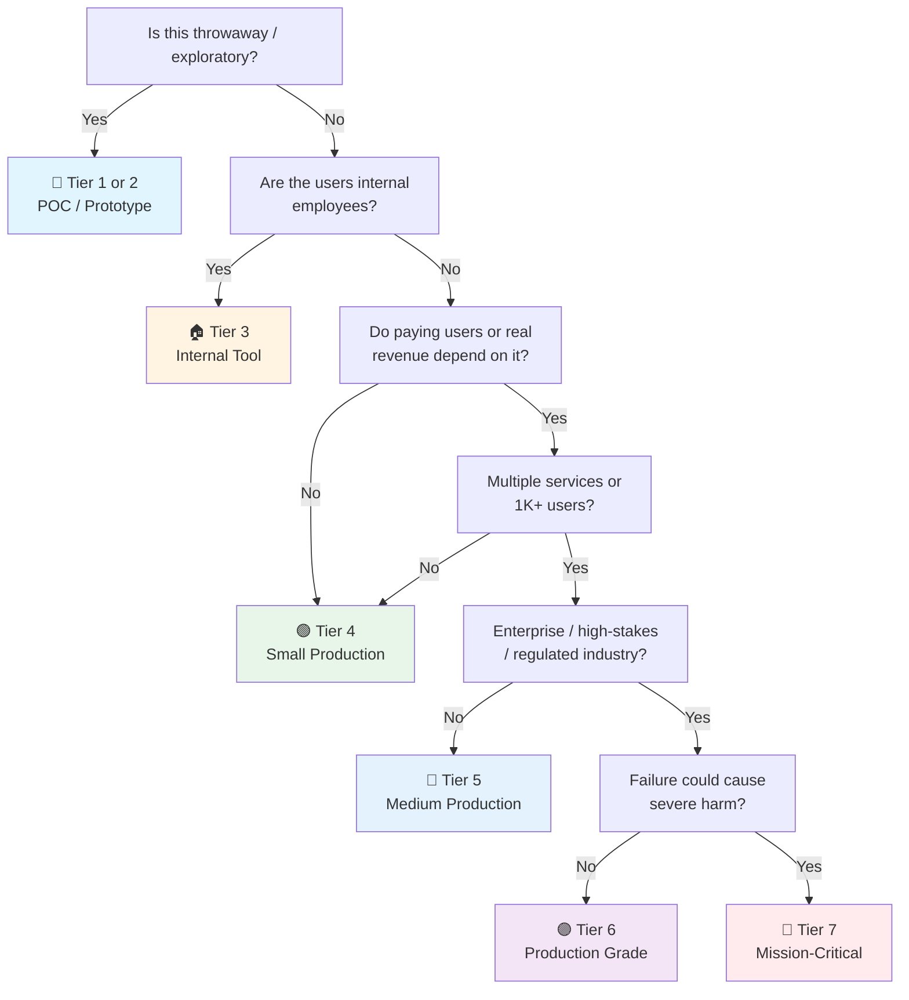

# Release / Deployment Checklist

> The **process** of shipping a change safely — versioning → build → stage → rollout → verify → rollback.
> Domain-specific readiness gates: [[API Launch]] (backend), [[Frontend Launch]] (web), [[Microservice Launch]] (multi-service).
> Framework-agnostic. Works for API services, web apps, batch jobs, mobile backends — anything deployable.
> Last updated: 2026-08-05

---

## 1. Versioning & Artifacts

- [ ] **Semantic versioning** — `MAJOR.MINOR.PATCH`. Breaking change → MAJOR bump. New feature (backward-compatible) → MINOR. Bug fix → PATCH. Pre-release suffix for staged rollout: `1.4.0-rc.1`.
- [ ] **Changelog updated** — Keep a Changelog format (Added / Changed / Deprecated / Removed / Fixed / Security). Each release entry links to PRs/issues.
- [ ] **Git tag** — Tag the release commit: `git tag v1.4.0 && git push --tags`. Annotated tags with release notes.
- [ ] **SBOM generated** — Software Bill of Materials for the artifact (syft, trivy, or CI plugin). List all dependencies + versions. Required for supply-chain compliance.
- [ ] **Artifact signed** — Sign containers (cosign), binaries, or npm packages. Verify signatures in the deployment step. Prevents tampered artifacts.
- [ ] **Artifact registry** — Push to registry (GHCR, Docker Hub, ECR, npm) with immutable tags (`v1.4.0`, not just `latest`). `latest` is a convenience pointer, never a deployment target.

## 2. Build & CI

- [ ] **Reproducible build** — Lockfile committed (package-lock, uv.lock, go.sum, Cargo.lock). Pinned base images (digest, not tag). Same commit → same artifact.
- [ ] **CI pipeline green** — Lint → type-check → unit tests → integration tests → security scan (SAST/SCA) → build. Every commit on the release branch.
- [ ] **Tests run against the artifact** — Not just the source tree. Build first, test the built artifact, deploy that same artifact. No "works locally" surprises.
- [ ] **Security scans clean** — SAST (code), SCA (deps, e.g. Dependabot/Trivy), secret scan (gitleaks/trufflehog) all pass. Criticals and high CVEs resolved or explicitly waived with a ticket. Full security domain → [[Security]].
- [ ] **CI is the only path to production** — No manual builds, no `docker build` on a laptop then push. The pipeline owns artifact creation.

## 3. Environment Promotion

- [ ] **Environment chain defined** — dev → staging → production (add pre-prod if regulated). Each environment mirrors production config as closely as possible.
- [ ] **Config per environment** — 12-factor: config in env vars / secret store per environment. No hardcoded environment-specific values in code.
- [ ] **Secrets per environment** — Staging secrets ≠ production secrets. Vault/K8s Secrets/KMS. Never reuse prod credentials in lower environments.
- [ ] **Staging deployed first** — Every release passes staging before production. Staging has real-ish data and traffic patterns (or at least smoke-tested).
- [ ] **Environment parity check** — Same versions of dependencies, same OS/runtime, same feature flags. "Works on staging" should mean "works in prod."

## 4. Database Migrations

- [ ] **Backup before migrate** — Production DB backed up (and restore *tested*) before any migration runs. Point-in-time recovery available.
- [ ] **Migrations versioned & ordered** — Alembic / Flyway / Liquibase / Prisma migrations in version control. Applied in order, never edited after release.
- [ ] **Expand-contract pattern** — For breaking schema changes: Phase 1 add new column/table (old code still works) → deploy → Phase 2 backfill → Phase 3 switch code → Phase 4 drop old column. Never one-shot destructive migration.
- [ ] **Migration run strategy** — Run migrations *before* app rollout (separate step), or app-upgrade-on-startup with locking. Never both app instances and migration racing.
- [ ] **Downgrade path** — Every migration has a documented rollback (down migration) or a known restore-from-backup procedure. Test it in staging.

## 5. Rollout Strategy

- [ ] **Rollout strategy chosen** — Match the risk: feature flags (dark deploy) → canary (5-10% traffic) → blue-green (full swap with instant revert) → progressive delivery (10/25/50/100%). Don't just `kubectl rollout restart` and hope.
- [ ] **Feature flags for risky changes** — Deploy code dark, enable in production without redeploy. Kill switch for broken features. Not the same as env vars (flags are runtime, env vars are build-time).
- [ ] **Canary criteria defined** — Error rate, latency, SLO budget, business metric (conversion). Promotion to 100% only when canary metrics are healthy.
- [ ] **Zero-downtime** — Rolling/blue-green/canary, not stop-then-start. Health checks gate new instances before traffic is routed to them.
- [ ] **Traffic shifting** — Edge LB / service mesh / deployment controller handles gradual traffic. Sticky sessions avoided or justified.

## 6. Pre-Deploy Gates

- [ ] **Relevant Launch checklist ticked** — [[API Launch]] for backend changes, [[Frontend Launch]] for web changes, [[Microservice Launch]] for system-wide changes. Unticked box = not ready to release.
- [ ] **Readiness probes** — Liveness + readiness endpoints healthy in staging. DB, cache, external dependencies reachable.
- [ ] **Runbook available** — Deployment steps, verification steps, and rollback steps documented and current. On-call has access.
- [ ] **Release owner named** — One person accountable for the release: monitors rollout, makes the call to continue/rollback/abort.
- [ ] **Maintenance window considered** — High-traffic times avoided unless zero-downtime is proven. Regulated systems may require scheduled windows + approval.

## 7. Post-Deploy Verification

- [ ] **Smoke tests in production** — Critical path exercised against the deployed artifact: login, health, top flows. Automated (Playwright, curl assertions) where possible.
- [ ] **Metrics watched** — Error rate, latency (p95/p99), request rate, resource usage compared against pre-deploy baseline. Spike = investigate, don't assume.
- [ ] **Logs scanned** — New error patterns, stack traces, or unexpected warnings from the new version.
- [ ] **SLOs respected** — Error budget not exhausted during rollout. If deployment violates SLO → rollback.
- [ ] **Alerting configured** — Relevant alerts armed *before* deploy (5xx spike, high latency, circuit open, DB down), not after something breaks.

## 8. Rollback

- [ ] **Rollback plan exists and is *practiced*** — The team has done it at least once (game day or staging drill). First rollback under real pressure is a failure of preparation.
- [ ] **Rollback triggers defined** — Concrete numbers: error rate > X%, latency p95 > Y ms for Z minutes, SLO burn. Not "if it feels broken."
- [ ] **Rollback mechanism** — Revert artifact (previous immutable tag), not `git revert`. Blue-green: swap back. Canary: drop to 0%. Feature flag: disable.
- [ ] **Data rollback considered** — If migration already ran: down-migration, restore-from-backup, or forward-fix. Know which one applies to *this* release before you start.
- [ ] **Rollback is fast** — Target: < 15 minutes to full revert. If it takes hours, the process needs work.

## 9. Communication & Notifications

- [ ] **Release notes written** — User-facing summary of what changed, what's fixed, known issues. Not the raw changelog.
- [ ] **Stakeholders notified** — Support team, on-call, product owner informed *before* and *after* release. "We shipped X; watch for Y."
- [ ] **On-call notified** — The person answering the page knows a release just happened and what changed. Context for triage.
- [ ] **Downtime communicated** — If any downtime is expected: announced in advance (status page, email, in-app notice). No silent outages.

## 10. Post-Release Review

- [ ] **Incident? Postmortem within 5 days** — Blameless RCA: timeline, root cause, corrective actions with owners and due dates. Track actions to completion.
- [ ] **Release metrics recorded** — Deployment time, rollback rate, change failure rate, MTTR. These are DORA metrics — trend them over time.
- [ ] **Checklist feedback loop** — Anything that went wrong that a checklist item would have caught? Add it to the relevant checklist. Checklists evolve with experience.
- [ ] **Artifacts retained** — Release artifacts, SBOMs, and logs retained per retention policy (regulatory minimum if applicable).

---

## Quick Sanity Check Before Release

- [ ] Release branch/tag created, CI green end-to-end
- [ ] Changelog + release notes written, PRs linked
- [ ] SBOM generated, artifact signed and pushed with immutable tag
- [ ] Staging deployed and smoke-tested (relevant Launch checklist ticked)
- [ ] DB migrations backed up, ordered, downgrade path known
- [ ] Rollout strategy chosen (canary/blue-green/flags) with promotion criteria
- [ ] On-call and stakeholders notified
- [ ] Alerts armed, dashboards open, baseline metrics recorded
- [ ] Rollback plan practiced and triggers defined in numbers
- [ ] Release owner named

---

## Project Tier Scoping Matrix

> **How to use this table:** Pick your tier first, then focus only on the sections marked ✅ (required) or 🟡 (recommended). Skip ❌ sections entirely — they'd be over-engineering for your context.
>
> **Legend:** ✅ Required · 🟡 Recommended / partial · ❌ Skip

### Tier Descriptions

| # | Tier | Description | Typical Team | Users | Lifespan |
|---|---|---|---|---|---|
| 1 | 🧪 **POC / Spike** | Validate an idea. Throwaway code. `git push` is fine. | 1 dev | Internal only | Days–weeks |
| 2 | 🔧 **Prototype / MVP** | Waiting for integration or user validation. Might become real. | 1–2 devs | Beta testers | Weeks–months |
| 3 | 🏠 **Internal Tool** | Real users (employees), real traffic. No external exposure or paying customers. | 1–3 devs | Employees | Ongoing |
| 4 | 🟢 **Small Production** | Single service/app, low traffic. Real users, maybe early revenue. | 1–2 devs | < 1K users | Ongoing |
| 5 | 🔵 **Medium Production** | Multiple services or higher traffic. Real revenue or user base that matters. | 2–5 devs | 1K–100K users | Ongoing |
| 6 | 🟣 **Production Grade** | Full rigor — high-stakes SaaS, enterprise product, or large user base. | 5+ devs | 100K+ users | Long-term |
| 7 | 🔴 **Mission-Critical / Regulated** | Healthcare (HIPAA), finance (PCI-DSS), safety systems. Failure = severe harm. Adds formal verification, regulatory audit. | 10+ devs | Varies | Decades |

### Which Tier Am I?

### Checklist Applicability by Tier

| # | Section | 🧪 POC | 🔧 Prototype | 🏠 Internal | 🟢 Small Prod | 🔵 Medium Prod | 🟣 Production Grade | 🔴 Mission-Critical |
|---|---|:---:|:---:|:---:|:---:|:---:|:---:|:---:|
| 1 | Versioning & Artifacts | ❌ | 🟡 git tag only | ✅ semver + tag | ✅ + changelog | ✅ + SBOM | ✅ + signed | ✅ + signed + audit |
| 2 | Build & CI | ❌ | 🟡 basic pipeline | ✅ lint + test | ✅ + scans | ✅ + artifact-tested | ✅ + full pipeline | ✅ + provenance |
| 3 | Environment Promotion | ❌ | 🟡 dev → prod | ✅ + staging | ✅ | ✅ + parity checks | ✅ + pre-prod | ✅ + change control |
| 4 | Database Migrations | ❌ | 🟡 simple up-only | ✅ + backup | ✅ + ordered | ✅ + expand-contract | ✅ + downgrade tested | ✅ + formal approval |
| 5 | Rollout Strategy | ❌ | ❌ | 🟡 rolling | 🟡 + health gates | ✅ canary/blue-green | ✅ + progressive delivery | ✅ + verified rollout |
| 6 | Pre-Deploy Gates | ❌ | 🟡 sanity | ✅ Launch + probes | ✅ | ✅ + runbook | ✅ + owner + window | ✅ + approval board |
| 7 | Post-Deploy Verification | ❌ | 🟡 manual smoke | ✅ + smoke script | ✅ + metrics | ✅ + SLO check | ✅ + baseline diff | ✅ + formal verification |
| 8 | Rollback | ❌ | 🟡 redeploy old | ✅ + plan | ✅ + triggers | ✅ + practiced | ✅ + < 15 min | ✅ + rehearsed + audited |
| 9 | Communication | ❌ | 🟡 tell the team | ✅ + on-call | ✅ | ✅ + stakeholders | ✅ + release notes | ✅ + regulatory notice |
| 10 | Post-Release Review | ❌ | ❌ | 🟡 if incident | 🟡 | ✅ + metrics | ✅ + DORA trend | ✅ + formal RCA |

---

## Sources

- Complements [[API Launch]], [[Frontend Launch]], [[Microservice Launch]] — those are the *readiness* gates, this is the *process*.
- [[Security]] — the *product safety* checklist (this file only gates pipeline security).
- DORA metrics: deployment frequency, lead time, change failure rate, MTTR.
