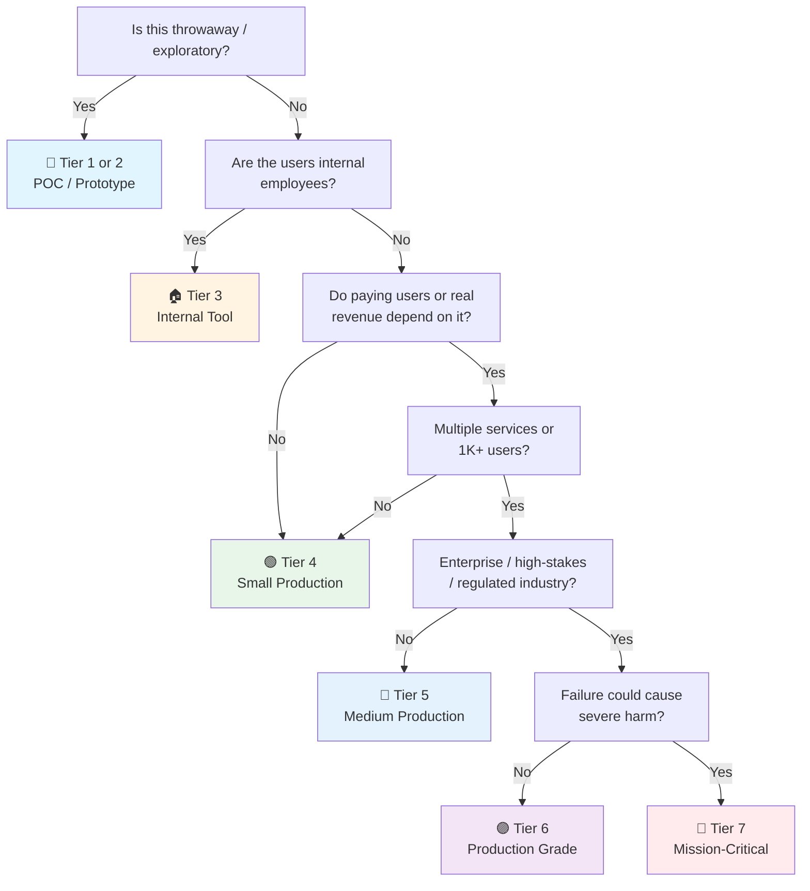

# Security Checklist

> The **product safety** checklist — system-wide security across all domains.
> Complements [[Release]] (process safety) and the domain gates: [[API Launch]], [[Frontend Launch]], [[Microservice Launch]].
> Framework-agnostic: APIs, web, mobile, batch, infra — the principles are the same.
> Items marked `→ [[Release]]` are gates shared with the release process (kept as 1-line checks here; the process owns the details).
> Last updated: 2026-08-05

---

## 1. Threat Modeling & Security Requirements

- [ ] **Threat model done before build** — STRIDE (Spoofing, Tampering, Repudiation, Information disclosure, DoS, Elevation of privilege) walked through the architecture. Not a document that exists — a session that happened.
- [ ] **Trust boundaries identified** — Where does data cross trust zones (internet → edge → service → DB → third party)? Each boundary gets explicit controls.
- [ ] **Attack surface minimized** — No unnecessary endpoints, ports, admin panels, debug routes, or exposed tooling. Every public route is deliberate.
- [ ] **Security requirements in stories** — Auth, validation, rate limiting, audit are acceptance criteria, not afterthoughts.
- [ ] **Security review for consequential changes** — Architecture, auth, data-handling changes get a design review before implementation.

## 2. Authentication & Authorization

- [ ] **AuthN: verify identity** — Passwords hashed (bcrypt/argon2, cost ≥ 12) → [[01 Cryptography Basics]]. No MD5/SHA1, no plaintext, ever.
- [ ] **MFA for privileged access** — Admin/ops accounts require a second factor. Service accounts use short-lived credentials (OIDC/Workload Identity over static keys).
- [ ] **Session/JWT policy** — Access tokens short-lived (≤ 15 min), signed RS256/ES256, issuer/audience validated. Refresh tokens rotated on use, stored HttpOnly+Secure.
- [ ] **AuthZ: check everywhere** — Authorization on every endpoint/service, not just the gateway. Role or claim-based policies; deny by default.
- [ ] **Password reset & account recovery** — Time-limited tokens, no account enumeration in responses ("user not found" vs "wrong password" — same message).
- [ ] **Rate limiting on auth endpoints** — Login, register, password reset, token refresh: per-IP + per-account limits. Lockout/backoff for repeated failures.
- [ ] **Session invalidation** — Logout kills tokens server-side. Password change revokes all other sessions. Suspended accounts blocked immediately.

## 3. Input Validation & Injection Prevention

- [ ] **Validate everything at the boundary** — Type, length, range, format, allowed values. Allowlists over denylists. Reject early, reject loudly.
- [ ] **SQL injection** — Parameterized queries / ORM everywhere. No string-built SQL. SQLi is the #1 critical → [[02 Secure Coding Practices]].
- [ ] **XSS** — Auto-escaping templates, sanitize rendered user content (DOMPurify), never disable escaping → [[03 API Security]].
- [ ] **Command injection / SSRF** — No shell from user input. Validate/allowlist URLs before server-side fetches. Block internal network targets (169.254.169.254, localhost, internal CIDRs).
- [ ] **File uploads** — Extension + MIME allowlist, content sniffing off, size limits, scan for malware, store outside web root, serve with `Content-Disposition`.
- [ ] **Deserialization safety** — No unsafe deserialization of untrusted data (pickle, Java serialization, `yaml.load`). Use safe formats (JSON) with schema validation.
- [ ] **Mass assignment / over-posting** — DTOs/schemas define exactly which fields are accepted. No `req.body` → entity blind mapping.

## 4. Secrets Management

- [ ] **No secrets in code** — No keys, tokens, passwords, connection strings in source, config files, or client bundles. Ever. → [[02 Secrets Management]]
- [ ] **Vault/KMS in production** — HashiCorp Vault, cloud KMS/Secrets Manager, or K8s Secrets (encrypted). Secret store per environment — staging ≠ prod.
- [ ] **.env / user-secrets for local dev** — Git-ignored. `.env.example` documents what's needed without values.
- [ ] **Secret rotation** — Rotation schedule exists (90 days typical for long-lived, immediate for exposed). Key rotation for signing keys with grace period for verification.
- [ ] **Secret scanning in CI** — gitleaks/trufflehog on every commit/PR. Leaked secret → revoke, not just delete the commit.
- [ ] **No secrets in logs** — Structured logging redacts tokens, passwords, PII. Test: grep prod logs for known test values.

## 5. Supply Chain & Dependency Security

- [ ] **SBOM generated** — Every artifact carries a Software Bill of Materials (syft/trivy/CI plugin) → gate in [[Release]] §1.
- [ ] **Artifact signing** — Containers/binaries signed (cosign), signatures verified at deploy → gate in [[Release]] §1.
- [ ] **SCA in CI** — Dependency scanning (Dependabot, Renovate, Trivy, Snyk) on every PR. Critical/high CVEs fixed or explicitly waived with ticket → gate in [[Release]] §2.
- [ ] **Dependencies pinned** — Lockfiles committed, base images pinned by digest. No floating `latest`.
- [ ] **Deprecated/abandoned deps tracked** — A library with no maintainer and known CVEs is a liability. Schedule replacements.
- [ ] **Registry trust** — Only approved registries (GHCR/ECR/Artifactory). No random packages from unvetted sources. If private registry: scan on push.

## 6. TLS & Transport Security

- [ ] **TLS everywhere** — HTTPS on all traffic: external, internal, inter-service. No plaintext HTTP in production → [[03 Network & TLS]].
- [ ] **Auto-renewed certificates** — Let's Encrypt / cert-manager / cloud LB managed. Expiry monitoring + alerting (30/14/7 days).
- [ ] **HSTS** — `Strict-Transport-Security: max-age=31536000; includeSubDomains` on all responses. Preload list where possible.
- [ ] **TLS version & ciphers** — TLS 1.2 minimum, 1.3 preferred. Weak ciphers (3DES, RC4, export-grade) disabled. Test with `sslscan`/`testssl.sh`.
- [ ] **mTLS for service-to-service (if mesh)** — Mutual TLS between internal services when the risk profile demands it (regulated, high-value data).

## 7. Security Headers & Hardening

- [ ] **Security headers set** — `X-Content-Type-Options: nosniff`, `X-Frame-Options: DENY` (or CSP `frame-ancestors`), `Referrer-Policy`, `Permissions-Policy`.
- [ ] **CSP configured** — Content-Security-Policy with no `unsafe-inline`/`unsafe-eval`. Start in `Report-Only`, collect violations, then enforce → [[03 API Security]].
- [ ] **CORS restricted** — Allowlist of known origins, never `*` with credentials. Preflight correctly handled.
- [ ] **Default-deny ports & firewalls** — Only required ports open. Admin/diagnostic ports (SSH, DB, Docker API) not internet-exposed.
- [ ] **Container hardening** — Non-root user, read-only root FS where possible, no privileged mode, dropped capabilities, no shell in prod image.
- [ ] **Runtime scanning** — Container/image scanning in the cluster (Trivy operator, Falco for runtime anomalies) at medium+ tiers.

## 8. Data Protection

- [ ] **Encryption at rest** — DB volumes, object storage, backups encrypted. Cloud-managed keys (KMS) or LUKS/VeraCrypt for self-hosted.
- [ ] **Encryption in transit** — TLS (§6) + application-level encryption for highly sensitive fields (tokens, PII columns) with a key hierarchy.
- [ ] **PII minimization** — Collect only what's needed. Mask in logs/UI. Separate PII from core data where practical → see [[API Launch]] data privacy items.
- [ ] **Data retention & deletion** — Retention policy enforced (scheduled purge). User deletion = real deletion (or full anonymization) within SLA.
- [ ] **Backup security** — Backups encrypted and access-controlled. Restore tested periodically. Backup compromise = data compromise.
- [ ] **Key management** — Keys in KMS/Vault, never in code. Access to keys audited. Key lifecycle (creation, rotation, revocation) documented.

## 9. Security Testing

- [ ] **SAST in CI** — Static analysis (Semgrep, CodeQL, SonarQube, bandit, gosec) on every PR. Fail on critical/high → gate in [[Release]] §2.
- [ ] **DAST on staging** — Dynamic scanning (OWASP ZAP, Burp) against a running environment. Scheduled, not one-off.
- [ ] **Penetration test schedule** — Annual for production-grade; before launch for regulated. External tester + remediation tracking. → [[14 Security]]
- [ ] **Auth tested in CI** — 401 for no auth, 403 for wrong role, token expiry/revocation tested as part of the test suite.
- [ ] **Fuzzing for parsers** — If you accept complex input (files, protobuf, XML), fuzz it. OSS-Fuzz or in-pipeline fuzzing for critical parsers.
- [ ] **Dependency exploit tests** — Automated check that known-exploitable versions (KEV catalog) are not in the dependency tree.

## 10. Security Monitoring & Incident Response

- [ ] **Security-relevant events logged** — Failed logins, authZ denials, rate-limit hits, privilege changes, secret access, admin actions. Audit trail with timestamps + actor.
- [ ] **Anomaly detection** — Alerts on: auth failure spikes, unusual data egress, new admin accounts, config drift, unexpected service-to-service calls.
- [ ] **Log centralization** — Security logs shipped to a central store with retention (90+ days, regulatory minimum if applicable). Not only local disk.
- [ ] **Incident response plan** — Roles (commander, comms, tech lead), severity levels, escalation paths, contact list. Written down, not in someone's head.
- [ ] **IR practiced** — Tabletop exercise or game day at least yearly. "Break" a scenario (leaked key, breach alert, ransomware) and walk the response.
- [ ] **Blameless postmortem for security incidents** — RCA with corrective actions, tracked to completion → pattern in [[Release]] §10.

## 11. Compliance & Regulatory

- [ ] **Requirements identified** — GDPR, HIPAA, PCI-DSS, SOC 2, or industry rules that *actually apply* (not all of them). Map requirements to controls.
- [ ] **Data residency** — Data stored/processed in permitted regions. Cloud provider region locked where required.
- [ ] **Consent & rights** — Consent captured and honored (GDPR/CCPA). Erasure/export/portability flows implemented and tested.
- [ ] **Audit evidence** — Controls documented so an auditor can verify them: access reviews, vulnerability reports, IR records, training.
- [ ] **Access reviews** — Periodic (quarterly/annual) review of who has access to what. Revoke stale access. Document the review.
- [ ] **Security training** — Team does security training (phishing awareness, secure coding). New hires included.

## 12. AI/LLM Security

- [ ] **Prompt injection awareness** — Untrusted user input can manipulate model behavior. System prompts isolated from user content. Never grant the model tools/actions that a malicious prompt could trigger.
- [ ] **No secrets to the model** — Internal context, API keys, or PII never sent to LLM providers unless explicitly required and sanctioned. Prompt logging may capture them.
- [ ] **Output sanitization** — Model output treated as untrusted: sanitize before rendering (XSS), validate before executing (tool calls, code), never `eval`.
- [ ] **Data leakage controls** — RAG/context assembled with least privilege: only the data the user is authorized to see enters the context window. Tenant isolation preserved.
- [ ] **Abuse/abuse monitoring** — Rate limits on AI endpoints (token cost = DoS surface), content policy violations logged, jailbreak attempts flagged.
- [ ] **Vendor assessment** — LLM provider: data retention policy, where data is processed, training opt-out. Signed DPA if regulated.

---

## Quick Sanity Check Before Launch

- [ ] Threat model reviewed for the shipped architecture
- [ ] All endpoints authN + authZ (401/403 verified in CI)
- [ ] No secrets in code, config, logs, or client bundles (scanner-verified)
- [ ] SAST + SCA green, criticals fixed or waived with ticket
- [ ] TLS 1.2+/1.3, HSTS set, certificates auto-renewing
- [ ] Security headers + CSP enforced (not report-only) in production
- [ ] SQLi/XSS/SSRF/command injection patterns absent (reviewed + scanned)
- [ ] Encryption at rest and in transit verified
- [ ] Security events logged centrally, retention policy set
- [ ] Incident response plan exists with named roles
- [ ] Applicable compliance requirements mapped to controls

---

## Project Tier Scoping Matrix

> **How to use this table:** Pick your tier first, then focus only on the sections marked ✅ (required) or 🟡 (recommended). Skip ❌ sections entirely — they'd be over-engineering for your context.
>
> **Legend:** ✅ Required · 🟡 Recommended / partial · ❌ Skip

### Tier Descriptions

| # | Tier | Description | Typical Team | Users | Lifespan |
|---|---|---|---|---|---|
| 1 | 🧪 **POC / Spike** | Validate an idea. Throwaway code. `print()` is fine. | 1 dev | Internal only | Days–weeks |
| 2 | 🔧 **Prototype / MVP** | Waiting for integration or user validation. Might become real. | 1–2 devs | Beta testers | Weeks–months |
| 3 | 🏠 **Internal Tool** | Real users (employees), real traffic. No external exposure or paying customers. | 1–3 devs | Employees | Ongoing |
| 4 | 🟢 **Small Production** | Single service/app, low traffic. Real users, maybe early revenue. | 1–2 devs | < 1K users | Ongoing |
| 5 | 🔵 **Medium Production** | Multiple services or higher traffic. Real revenue or user base that matters. | 2–5 devs | 1K–100K users | Ongoing |
| 6 | 🟣 **Production Grade** | Full rigor — high-stakes SaaS, enterprise product, or large user base. | 5+ devs | 100K+ users | Long-term |
| 7 | 🔴 **Mission-Critical / Regulated** | Healthcare (HIPAA), finance (PCI-DSS), safety systems. Failure = severe harm. Adds formal verification, regulatory audit. | 10+ devs | Varies | Decades |

### Which Tier Am I?

### Checklist Applicability by Tier

| # | Section | 🧪 POC | 🔧 Prototype | 🏠 Internal | 🟢 Small Prod | 🔵 Medium Prod | 🟣 Production Grade | 🔴 Mission-Critical |
|---|---|:---:|:---:|:---:|:---:|:---:|:---:|:---:|
| 1 | Threat Modeling | ❌ | 🟡 light review | ✅ | ✅ | ✅ | ✅ | ✅ + formal |
| 2 | AuthN & AuthZ | ❌ | 🟡 basic JWT | ✅ | ✅ | ✅ + MFA | ✅ + MFA + audit | ✅ + regulatory |
| 3 | Input Validation | 🟡 basics | ✅ | ✅ | ✅ | ✅ | ✅ + fuzzing | ✅ + formal |
| 4 | Secrets Management | 🟡 .env only | ✅ .env + scan | ✅ + vault | ✅ | ✅ + rotation | ✅ + KMS hierarchy | ✅ + HSM |
| 5 | Supply Chain | ❌ | 🟡 lockfile + audit | ✅ + SCA | ✅ + SBOM | ✅ + signed | ✅ + provenance | ✅ + attestation |
| 6 | TLS & Transport | 🟡 HTTPS only | ✅ | ✅ | ✅ | ✅ + mTLS if mesh | ✅ + cipher audit | ✅ + regulatory |
| 7 | Headers & Hardening | ❌ | 🟡 basics | ✅ | ✅ + CSP | ✅ + runtime scan | ✅ + hardened images | ✅ + compliance |
| 8 | Data Protection | ❌ | 🟡 at-rest basics | ✅ | ✅ + PII mask | ✅ + key mgmt | ✅ + KMS hierarchy | ✅ + regulatory |
| 9 | Security Testing | ❌ | 🟡 SAST in CI | ✅ + SAST | ✅ + DAST | ✅ + pen-test | ✅ + scheduled pen-test | ✅ + formal audit |
| 10 | Monitoring & IR | ❌ | ❌ | 🟡 basic alerts | ✅ + central logs | ✅ + anomaly detection | ✅ + IR plan + drills | ✅ + full IR + regulatory |
| 11 | Compliance | ❌ | ❌ | 🟡 if regulated | 🟡 if regulated | ✅ + access reviews | ✅ + audit evidence | ✅ + full framework |
| 12 | AI/LLM Security | 🟡 if AI is the POC | 🟡 | 🟡 if used | ✅ if used | ✅ + guardrails | ✅ + vendor DPA | ✅ + audit trail |

---

## Sources

- Complements [[Release]] (process gates: SBOM, signing, SAST/SCA, secret scan — 1-line checks here, details there).
- Domain gates: [[API Launch]], [[Frontend Launch]], [[Microservice Launch]] — their Security sections are the per-domain view; this is the system-wide view.
- Deep references: OWASP Top 10, OWASP ASVS, STRIDE threat modeling, KEV catalog.
