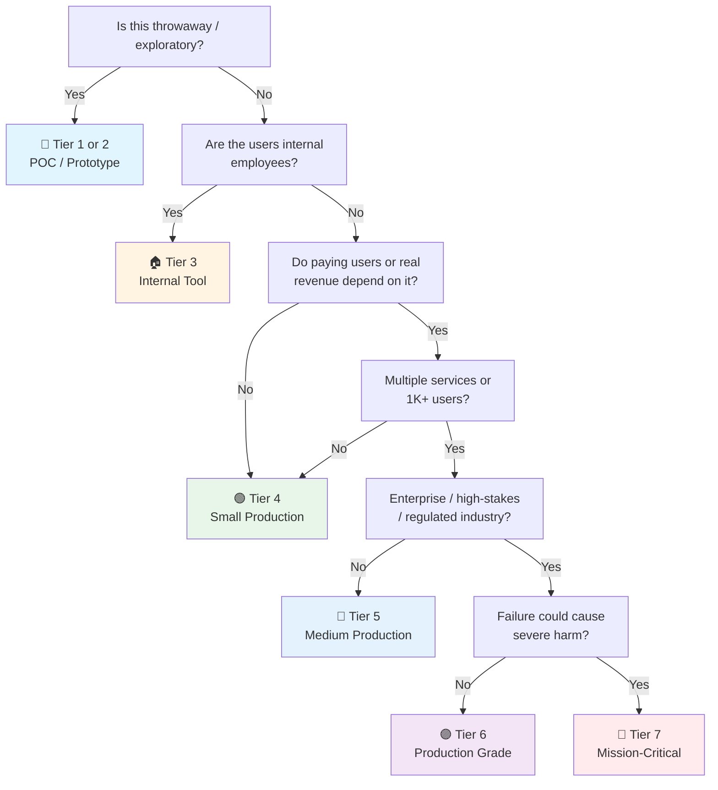

# Security Checklist

> The **product safety** checklist — system-wide security across all domains.
> Complements [[Release]] (process safety) and the domain gates: [[API Launch]], [[Frontend Launch]], [[Microservice Launch]].
> Framework-agnostic: APIs, web, mobile, batch, infra — the principles are the same.
> Items marked `→ [[Release]]` are gates shared with the release process (kept as 1-line checks here; the process owns the details).
> Last updated: 2026-08-07 (audited — aligned with OWASP API Security Top 10 2023 + OWASP LLM Top 10 2025)

---

## 1. Threat Modeling & Security Requirements
> **Deep dive:** [[threat-modeling]] — STRIDE walkthrough, attack trees, PASTA, LINDDUN, risk rating, treatment decisions.

- [ ] **Threat model done before build** — STRIDE (Spoofing, Tampering, Repudiation, Information disclosure, DoS, Elevation of privilege) walked through the architecture. Not a document that exists — a session that happened.
- [ ] **Threat model is living** — Refresh triggers defined: architecture change, new trust boundary or integration, major dependency change, and every security incident. A model that isn't maintained is a fossil.
- [ ] **Abuse/misuse cases defined** — For every user story, ask "how could an attacker abuse this?" Abuse cases alongside use cases as acceptance criteria. Not optional for auth, payments, or data-handling features.
- [ ] **Trust boundaries identified** — Where does data cross trust zones (internet → edge → service → DB → third party)? Each boundary gets explicit controls.
- [ ] **Attack surface minimized** — No unnecessary endpoints, ports, admin panels, debug routes, or exposed tooling. Every public route is deliberate.
- [ ] **Security requirements in stories** — Auth, validation, rate limiting, audit are acceptance criteria, not afterthoughts.
- [ ] **Security review for consequential changes** — Architecture, auth, data-handling changes get a design review before implementation.
- [ ] **Security champions assigned** — At least one developer per team with extra security training, first point of contact for security questions, reviews security aspects of changes. Security expertise multiplied, not bottlenecked.

## 2. Authentication & Authorization

- [ ] **AuthN: verify identity** — Passwords hashed (bcrypt/argon2, cost ≥ 12) → [[01 Cryptography Basics]]. No MD5/SHA1, no plaintext, ever.
- [ ] **MFA for privileged access** — Admin/ops accounts require a second factor. Service accounts use short-lived credentials (OIDC/Workload Identity over static keys).
- [ ] **Session/JWT policy** — Access tokens short-lived (≤ 15 min), signed RS256/ES256, issuer/audience validated. Refresh tokens rotated on use, stored HttpOnly+Secure. Algorithm allowlist enforced (no `none`, no HS256-with-RSA-key confusion).
- [ ] **Session fixation prevention** — Session ID regenerated after successful authentication. Never accept session IDs from URLs or untrusted sources.
- [ ] **OAuth2/OIDC flow correctness** — PKCE on public clients (SPA/mobile), redirect URIs allowlisted exactly, `state` parameter on every authorization request, `nonce` validated, no implicit flow (`response_type=token`). Broken OAuth is a top-10 API risk → [[01 Authentication Security]].
- [ ] **Session lifetime limits** — Idle timeout (e.g. 15–30 min) and absolute expiry enforced. Remember-me tokens re-authenticate before sensitive actions, not just extend sessions forever.
- [ ] **Cryptographic API usage correct** — Use CSPRNG (not Math.random/time-based), AES-GCM/ChaCha20-Poly1305 (not ECB/CBC without authentication), unique nonces per encryption, no custom crypto. Cryptographic libraries are easy to misuse — follow library guidance exactly.
- [ ] **AuthZ: check everywhere** — Authorization on every endpoint/service, not just the gateway. Role or claim-based policies; deny by default.
- [ ] **Object-level authorization (IDOR/BOLA)** — Every object access checks ownership: `GET /orders/123` verifies the caller owns order 123. The #1 API security risk (OWASP API1) — test with account A's token on account B's resources.
- [ ] **Function-level authorization (BFLA)** — Admin/privileged endpoints enforce roles server-side. Hiding a button is not authorization — try calling the endpoint directly.
- [ ] **Password reset & account recovery** — Time-limited tokens, no account enumeration in responses ("user not found" vs "wrong password" — same message, same timing).
- [ ] **Rate limiting on auth endpoints** — Login, register, password reset, token refresh: per-IP + per-account limits. Lockout/backoff for repeated failures. Protects against credential stuffing and brute force.
- [ ] **Session invalidation** — Logout kills tokens server-side. Password change revokes all other sessions. Suspended accounts blocked immediately.

## 3. Input Validation & Injection Prevention

- [ ] **Validate everything at the boundary** — Type, length, range, format, allowed values. Allowlists over denylists. Reject early, reject loudly.
- [ ] **SQL injection** — Parameterized queries / ORM everywhere. No string-built SQL. SQLi is the #1 critical → [[02 Secure Coding Practices]].
- [ ] **XSS** — Auto-escaping templates, sanitize rendered user content (DOMPurify), never disable escaping → [[03 API Security]].
- [ ] **Command injection / SSRF** — No shell from user input. Validate/allowlist URLs before server-side fetches. Block internal network targets (169.254.169.254, localhost, internal CIDRs).
- [ ] **XXE prevented** — XML parsers configured with DTDs and external entities disabled (or prefer JSON). XXE still hits apps that parse XML/SAML/SOAP → [[01 Common Web Attacks]].
- [ ] **Path traversal & archive extraction** — User-supplied paths normalized and confined to their sandbox (no `../` escape). Archive extraction (zip/tar) sanitized — Zip Slip writes outside the target directory.
- [ ] **File uploads** — Extension + MIME allowlist, content sniffing off, size limits, scan for malware, store outside web root, serve with `Content-Disposition`.
- [ ] **Deserialization safety** — No unsafe deserialization of untrusted data (pickle, Java serialization, `yaml.load`). Use safe formats (JSON) with schema validation.
- [ ] **Mass assignment / over-posting** — DTOs/schemas define exactly which fields are accepted. No `req.body` → entity blind mapping.
- [ ] **Open redirect prevented** — `redirect`/`next`/`returnTo` parameters validated against an allowlist of known paths/origins. Open redirects enable phishing and OAuth token theft.
- [ ] **CSRF protection on state-changing operations** — CSRF tokens (synchronizer or double-submit cookie) on every POST/PUT/DELETE/ PATCH. Anti-CSRF headers validated server-side. SameSite cookie attribute set (Strict or Lax).
- [ ] **Race conditions / TOCTOU mitigated** — Time-of-Check-Time-of-Use vulnerabilities identified and addressed: balance checks, coupon redemption, inventory decrements, permission checks followed by action. Use transactions, optimistic locking, or idempotency keys.
- [ ] **API resource consumption bounded** — Pagination caps, body/size limits, request timeouts on every endpoint (not just auth). GraphQL: query depth/complexity limits, introspection disabled in production. OWASP API4.
- [ ] **Error handling — no information leakage** — Generic error messages in production (no stack traces, no SQL errors, no internal paths). Detailed errors logged server-side, generic responses to client. Debug/verbose modes disabled.

## 4. Secrets Management
> **Deep dive:** [[secrets-management]] — Vault/KMS setup, gitleaks/trufflehog, rotation schedules, .env patterns, pipeline secret isolation.

- [ ] **No secrets in code** — No keys, tokens, passwords, connection strings in source, config files, or client bundles. Ever. → [[02 Secrets Management]]
- [ ] **Vault/KMS in production** — HashiCorp Vault, cloud KMS/Secrets Manager, or K8s Secrets (encrypted). Secret store per environment — staging ≠ prod.
- [ ] **.env / user-secrets for local dev** — Git-ignored. `.env.example` documents what's needed without values.
- [ ] **Secret rotation** — Rotation schedule exists (90 days typical for long-lived, immediate for exposed). Key rotation for signing keys with grace period for verification. Prefer short-lived/ephemeral credentials (Workload Identity, STS) over rotating long-lived ones.
- [ ] **Secret scanning in CI** — gitleaks/trufflehog on every commit/PR. Leaked secret → revoke, not just delete the commit.
- [ ] **No secrets in logs** — Structured logging redacts tokens, passwords, PII. Test: grep prod logs for known test values.

## 5. Supply Chain & Dependency Security
> **Deep dive:** [[sca-supply-chain]] — Dependabot/Trivy/Snyk config, SBOM (syft), cosign signing, IaC scanning, KEV catalog, remediation SLAs.

- [ ] **SBOM generated** — Every artifact carries a Software Bill of Materials (syft/trivy/CI plugin) → gate in [[Release]] §1.
- [ ] **Artifact signing** — Containers/binaries signed (cosign), signatures verified at deploy → gate in [[Release]] §1.
- [ ] **SCA in CI** — Dependency scanning (Dependabot, Renovate, Trivy, Snyk) on every PR. Critical/high CVEs fixed or explicitly waived with ticket → gate in [[Release]] §2.
- [ ] **Dependencies pinned** — Lockfiles committed, base images pinned by digest. No floating `latest`.
- [ ] **Deprecated/abandoned deps tracked** — A library with no maintainer and known CVEs is a liability. Schedule replacements.
- [ ] **Registry trust** — Only approved registries (GHCR/ECR/Artifactory). No random packages from unvetted sources. If private registry: scan on push.
- [ ] **Dependency confusion prevented** — Internal package names scoped or reserved on public registries; packages resolved from the intended registry only. Attackers squat public names that exist privately → [[02 Dependency & Supply Chain]].
- [ ] **Dependency changes reviewed** — Lockfile diffs reviewed like code: new transitive deps checked for typosquatting (name tricks, recent publish date, low downloads, lookalike authors). Supply-chain attacks ride in on innocent-looking bumps.
- [ ] **IaC security scanning** — Terraform/CloudFormation/Kubernetes manifests scanned (Checkov, tfsec, KICS). Misconfigurations (public buckets, permissive IAM, privileged containers) caught before deploy.
- [ ] **Vulnerability remediation SLAs** — Time-bound fix targets: Critical ≤ 7 days, High ≤ 30 days, Medium ≤ 90 days, Low by backlog priority. SLAs documented, tracked, and reported. Exceptions require risk acceptance sign-off.

## 6. TLS & Transport Security

- [ ] **TLS everywhere** — HTTPS on all traffic: external, internal, inter-service. No plaintext HTTP in production → [[03 Network & TLS]].
- [ ] **Auto-renewed certificates** — Let's Encrypt / cert-manager / cloud LB managed. Expiry monitoring + alerting (30/14/7 days).
- [ ] **HSTS** — `Strict-Transport-Security: max-age=31536000; includeSubDomains` on all responses. Preload list where possible.
- [ ] **TLS version & ciphers** — TLS 1.2 minimum, 1.3 preferred. Weak ciphers (3DES, RC4, export-grade) disabled. Test with `sslscan`/`testssl.sh`.
- [ ] **mTLS for service-to-service (if mesh)** — Mutual TLS between internal services when the risk profile demands it (regulated, high-value data).

## 7. Security Headers & Hardening
> **Deep dive:** [[container-cloud-security]] — Dockerfile hardening, K8s Pod Security Standards, RBAC, admission controllers (OPA/Kyverno).

- [ ] **Security headers set** — `X-Content-Type-Options: nosniff`, `X-Frame-Options: DENY` (or CSP `frame-ancestors`), `Referrer-Policy`, `Permissions-Policy`.
- [ ] **CSP configured** — Content-Security-Policy with no `unsafe-inline`/`unsafe-eval`. Start in `Report-Only`, collect violations, then enforce → [[03 API Security]].
- [ ] **CORS restricted** — Allowlist of known origins, never `*` with credentials. Preflight correctly handled.
- [ ] **Host header validation** — Server accepts only known hostnames; rejects mismatches. Prevents host-header injection (password-reset poisoning, cache poisoning, routing attacks).
- [ ] **HTTP request smuggling awareness** — Proxy/gateway and app must agree on message boundaries (Content-Length vs Transfer-Encoding). Disable request rewriting that desyncs parsing; test with smuggling payloads if behind a CDN/WAF.
- [ ] **Default-deny ports & firewalls** — Only required ports open. Admin/diagnostic ports (SSH, DB, Docker API) not internet-exposed.
- [ ] **Container hardening** — Non-root user, read-only root FS where possible, no privileged mode, dropped capabilities, no shell in prod image → [[03 Container & Cloud Security]].
- [ ] **Runtime scanning** — Container/image scanning in the cluster (Trivy operator, Falco for runtime anomalies) at medium+ tiers.
- [ ] **Email authentication (if product sends mail)** — SPF + DKIM + DMARC configured and enforced (quarantine/reject), no open relay. Prevents spoofing your domain for phishing.

## 8. Data Protection

- [ ] **Data classified** — Data classified (public/internal/confidential/restricted); controls and handling rules follow the class. Classification drives masking, retention, and access decisions → see [[Data-Classification-Schema]] template.
- [ ] **Encryption at rest** — DB volumes, object storage, backups encrypted. Cloud-managed keys (KMS) or LUKS/VeraCrypt for self-hosted.
- [ ] **Encryption in transit** — TLS (§6) + application-level encryption for highly sensitive fields (tokens, PII columns) with a key hierarchy.
- [ ] **PII minimization** — Collect only what's needed. Mask in logs/UI. Separate PII from core data where practical → see [[API Launch]] data privacy items.
- [ ] **No production data in non-prod** — Dev/staging uses masked or synthetic data, not copied production DBs. Prod data in test environments is how PII leaks and compliance breaks → [[Data-Masking-Anonymization-Rules]] template.
- [ ] **Data retention & deletion** — Retention policy enforced (scheduled purge). User deletion = real deletion (or full anonymization) within SLA.
- [ ] **Backup security** — Backups encrypted and access-controlled. Restore tested periodically. Backup compromise = data compromise.
- [ ] **Immutable backups** — Backups stored immutably (WORM/object-lock) so ransomware can't encrypt or delete them. Separate restore path and credentials from production.
- [ ] **Key management** — Keys in KMS/Vault, never in code. Access to keys audited. Key lifecycle (creation, rotation, revocation) documented.

## 9. Security Testing
> **Deep dive:** [[sast]] (Semgrep/CodeQL/bandit/gosec) · [[dast]] (OWASP ZAP/Burp/Nuclei) · [[penetration-testing]] (scoping, methodology, remediation).

- [ ] **SAST in CI** — Static analysis (Semgrep, CodeQL, SonarQube, bandit, gosec) on every PR. Fail on critical/high → gate in [[Release]] §2.
- [ ] **DAST on staging** — Dynamic scanning (OWASP ZAP, Burp) against a running environment. Scheduled, not one-off.
- [ ] **Penetration test schedule** — Annual for production-grade; before launch for regulated. External tester + remediation tracking. → [[14 Security]]
- [ ] **Auth tested in CI** — 401 for no auth, 403 for wrong role, token expiry/revocation tested as part of the test suite. Plus IDOR checks: account A cannot read/write account B's resources.
- [ ] **Fuzzing for parsers** — If you accept complex input (files, protobuf, XML), fuzz it. OSS-Fuzz or in-pipeline fuzzing for critical parsers.
- [ ] **Dependency exploit tests** — Automated check that known-exploitable versions (KEV catalog) are not in the dependency tree.
- [ ] **Fixes regression-tested** — Remediated vulnerabilities get a regression test that reproduces the original attack. A fix without a test is a hope.

## 10. Security Monitoring & Incident Response
> **Deep dive:** [[incident-response]] — IR plan structure, severity matrix, roles, tabletop exercises, blameless postmortems, breach notification.

- [ ] **Security-relevant events logged** — Failed logins, authZ denials, rate-limit hits, privilege changes, secret access, admin actions. Audit trail with timestamps + actor → [[04 Monitoring & Incident Response]].
- [ ] **Log integrity protected** — Security/audit logs append-only and tamper-evident (off-host, WORM storage, or signed). A log the attacker can edit is evidence they will delete.
- [ ] **Anomaly detection** — Alerts on: auth failure spikes, unusual data egress, new admin accounts, config drift, unexpected service-to-service calls.
- [ ] **Log centralization** — Security logs shipped to a central store with retention (90+ days, regulatory minimum if applicable). Not only local disk.
- [ ] **Attack surface monitoring** — External visibility: new subdomains/endpoints/certificates discovered and reviewed. Shadow IT and forgotten services are how attackers enter.
- [ ] **Incident response plan** — Roles (commander, comms, tech lead), severity levels, escalation paths, contact list. Written down, not in someone's head.
- [ ] **IR practiced** — Tabletop exercise or game day at least yearly. "Break" a scenario (leaked key, breach alert, ransomware) and walk the response.
- [ ] **Blameless postmortem for security incidents** — RCA with corrective actions, tracked to completion → pattern in [[Release]] §10.
- [ ] **Breach notification plan** — Regulator deadlines known and mapped (GDPR 72h, sector rules), customer communication templates ready, legal sign-off path defined, one owner decides "is this reportable?" → [[Data-Breach-Response-Plan]] template.
- [ ] **Security metrics tracked** — MTTD (mean time to detect), MTTR (mean time to remediate), vulnerability age distribution, patch cadence, open criticals. Metrics inform decisions, not punish teams.
- [ ] **Alert fatigue managed** — False-positive rate measured and reduced. Alerts tuned quarterly. High-noise alerts suppressed or improved, not ignored.

## 11. Compliance & Regulatory

- [ ] **Requirements identified** — GDPR, HIPAA, PCI-DSS, SOC 2, or industry rules that *actually apply* (not all of them). Map requirements to controls → [[04 Compliance & Frameworks]].
- [ ] **Data residency** — Data stored/processed in permitted regions. Cloud provider region locked where required.
- [ ] **Consent & rights** — Consent captured and honored (GDPR/CCPA). Erasure/export/portability flows implemented and tested.
- [ ] **Privacy impact assessment** — PIA done before processing new categories of personal data or changing how existing data is used/shared. Documented, reviewed, approved → [[Privacy-Impact-Assessment]] template.
- [ ] **Audit evidence** — Controls documented so an auditor can verify them: access reviews, vulnerability reports, IR records, training.
- [ ] **Access reviews** — Periodic (quarterly/annual) review of who has access to what. Revoke stale access. Document the review.
- [ ] **Security training** — Team does security training (phishing awareness, secure coding). New hires included.
- [ ] **Breach notification obligations mapped** — Regulatory reporting deadlines and formats for your applicable frameworks, cross-referenced with the operational plan in §10.

## 12. AI/LLM Security
> **Deep dive:** [[llm-security]] — OWASP LLM Top 10 (2025) implementation, guardrails, agent identity, vector isolation, token limits.

> Aligned with OWASP Top 10 for LLM Applications (2025). Apply per architecture: chat-only, RAG, or agentic (tool-calling) systems each weight different risks.

- [ ] **Prompt injection defended (direct + indirect)** — Direct: untrusted user input must not override system instructions. Indirect: retrieved content (web pages, docs, email, tool output) can carry injected instructions — treat every context source as hostile. Never grant the model tools/actions a malicious prompt could trigger → LLM01.
- [ ] **System prompt protected** — No secrets, credentials, or sensitive business logic in system prompts (extractable by questioning). Separate system instructions from user-influenced context. Monitor outputs for prompt regurgitation → LLM07.
- [ ] **No secrets or PII to the model** — Internal context, API keys, or PII never sent to LLM providers unless explicitly required and sanctioned. Provider prompt logging may capture them; scrub inputs at the boundary → LLM02.
- [ ] **Output sanitization** — Model output treated as untrusted: sanitize before rendering (XSS), validate before executing (tool calls, code, SQL), never `eval`. Apply the same validation rules as any other untrusted input → LLM05.
- [ ] **RAG/vector isolation** — Tenant isolation at namespace/index level in vector stores (not just metadata filters). Retrieval is least-privilege: only data the user is authorized to see enters the context. Audit retrieval operations; watch for embedding poisoning → LLM08.
- [ ] **Excessive agency prevented** — Agents get per-agent identity (not shared service accounts), a tool allowlist, and scoped, revocable delegation (user `act` claims). Consequential actions (refunds, deletes, sends) require human approval or hard policy checks → LLM06.
- [ ] **Model & dataset supply chain vetted** — AI Bill of Materials (models, datasets, tools, agents) with provenance. No untrusted model/pickle loading; fine-tuning only on vetted data with lineage. External agents/MCP servers treated as untrusted → LLM03/LLM04.
- [ ] **Unbounded consumption bounded** — Token and request rate limits per user/agent/application, cost quotas with alerting, loop detection for runaway agents. Token cost is an economic DoS surface → LLM10.
- [ ] **Hallucination mitigation** — Model outputs verified against authoritative sources when used for decisions, code generation, or user-facing content. Never trust unverified model output for security-critical paths → LLM09.
- [ ] **Vendor assessment** — LLM provider: data retention policy, where data is processed, training opt-out. Signed DPA if regulated.

## 13. Infrastructure & Cloud Security
> **Deep dive:** [[container-cloud-security]] — Cloud IAM least privilege, network segmentation, CSPM, runtime detection (Falco), DNS security.

> The environment your app runs in is an attack surface of its own. Cloud misconfigurations (public databases, over-permissioned accounts, forgotten subdomains) are among the most common breach causes — often easier to exploit than a code vulnerability.

- [ ] **Cloud IAM least privilege** — No root/admin accounts for routine work. Service accounts/roles scoped to minimum permissions. No long-lived access keys where short-lived (STS/Workload Identity) works. Unused credentials removed → [[03 Container & Cloud Security]].
- [ ] **No public exposure of internal resources** — Databases, caches, message queues, storage buckets not internet-reachable. Storage buckets default-private; a public bucket is a deliberate, reviewed decision, not a default.
- [ ] **Network segmentation** — Public-facing load balancers in public subnets; data stores and internal services in private subnets. Security groups / NSGs default-deny; only required ports opened between tiers.
- [ ] **Egress filtering** — Outbound traffic from services restricted to known destinations (NAT gateway + egress allowlist, or service mesh policies). Prevents data exfiltration and stops SSRF from pivoting to internal services.
- [ ] **Cloud audit logging enabled** — CloudTrail (AWS), Cloud Audit Logs (GCP), Activity Log (Azure) enabled and shipped to central, tamper-resistant storage. Every privileged action is attributable to an identity.
- [ ] **WAF configured (if internet-facing)** — Web Application Firewall in front of public apps with managed rule sets (OWASP Top 10 coverage). Tuned to reduce false positives — not set-and-forget.
- [ ] **DDoS protection** — Cloud-native (AWS Shield, Cloud Armor) or CDN-based absorption for public endpoints. Rate-based rules for known attack patterns.
- [ ] **DNS security** — DNSSEC enabled where supported. Domain registered with registrar lock. No dangling DNS records pointing to unclaimed/deleted resources (subdomain takeover).
- [ ] **Managed service hardening** — RDS / managed DBs: encryption on, public access off, security group restricted to app tier only. Object storage: versioning on critical buckets, MFA delete, lifecycle policies.
- [ ] **Security posture monitoring (CSPM)** — Cloud Security Posture Management tool (Security Hub, Defender for Cloud, Wiz, Prowler) running continuously. CIS Benchmark compliance checked. Drift from secure baseline detected and alerted, not discovered during an incident.

## 14. CI/CD & Deployment Security

> The pipeline is the path to production. Compromise the pipeline and you compromise every deployment — this is how supply-chain attacks (SolarWinds, Codecov) spread. The [[Release]] checklist covers *what gates to run*; this section covers *protecting the pipeline itself*.

- [ ] **Branch protection enforced** — `main` / `release` branches: required reviews, no direct push, no force push, status checks must pass before merge. The production branch is where production code lives — protect it.
- [ ] **Pipeline secret isolation** — Secrets not exposed to pull-request builds from forks or untrusted contributors. PR-triggered workflows get read-only or no secrets. Secrets scoped to the job that needs them, not globally visible.
- [ ] **No untrusted input in pipeline scripts** — `pull_request_target`, `github.event.comment.body`, branch names, PR titles, issue labels: never interpolated into shell commands or used to select which Action runs. This is the primary vector for pipeline injection → [[02 Dependency & Supply Chain]].
- [ ] **Self-hosted runner isolation** — If self-hosted: ephemeral (destroyed after each job), isolated network, no standing access to prod secrets. Shared/managed runners only for untrusted builds. A compromised runner is a persistent backdoor.
- [ ] **Pinned third-party CI components** — GitHub Actions / CI steps pinned by commit SHA, not by tag. Base images pinned by digest (§5). Tags can be moved by the owner; SHAs are immutable.
- [ ] **Production deployment approval** — Deploy to production requires explicit approval gate (human or automated policy check). No auto-deploy from `main` without a checkpoint someone owns.
- [ ] **Rollback capability** — Every deployment can be rolled back quickly and the rollback path is tested, not theoretical. Blue-green or canary for production-grade tiers. Rollback rehearsed in game days.
- [ ] **Environment separation** — Dev / staging / prod use separate cloud accounts or hard-isolated namespaces. No shared credentials across environments. Production access is just-in-time (requested, granted, expires), not standing.
- [ ] **Deployment audit trail** — Every production deployment recorded: who approved, what changed, when, which commit, which artifacts. Immutable history that survives for incident investigation.

---

## Quick Sanity Check Before Launch

- [ ] Threat model reviewed for the shipped architecture
- [ ] All endpoints authN + authZ (401/403 verified in CI)
- [ ] Object-level authorization (IDOR) verified — cross-account access attempts fail
- [ ] Session fixation prevented (ID regenerated post-auth)
- [ ] No secrets in code, config, logs, or client bundles (scanner-verified)
- [ ] SAST + SCA green, criticals fixed or waived with ticket
- [ ] IaC manifests scanned (no public buckets, permissive IAM, privileged containers)
- [ ] TLS 1.2+/1.3, HSTS set, certificates auto-renewing
- [ ] Security headers + CSP enforced (not report-only) in production
- [ ] SQLi/XSS/SSRF/XXE/command injection patterns absent (reviewed + scanned)
- [ ] CSRF protection on all state-changing operations
- [ ] Race conditions/TOCTOU mitigated for critical flows (payments, inventory, permissions)
- [ ] Error handling generic in production (no stack traces, no internal paths)
- [ ] Encryption at rest and in transit verified
- [ ] No production data in non-prod environments (masked/synthetic verified)
- [ ] Backups immutable/WORM and restore-tested
- [ ] Security events logged centrally with integrity protection, retention policy set
- [ ] Incident response plan exists with named roles
- [ ] Vulnerability remediation SLAs documented and tracked
- [ ] Applicable compliance requirements mapped to controls
- [ ] No public DBs, caches, or storage buckets (cloud audit / CSPM verified)
- [ ] Cloud audit logging enabled (CloudTrail / Activity Logs) and shipped off-host
- [ ] Production branch protected (no direct push, required reviews, status checks pass)
- [ ] No pipeline secrets exposed to fork PRs or untrusted builds
- [ ] Production deploy requires approval gate; rollback path tested
- [ ] CI Actions pinned by SHA, dependencies pinned by digest

---

## Project Tier Scoping Matrix

> **How to use this table:** Pick your tier first, then focus only on the sections marked ✅ (required) or 🟡 (recommended). Skip ❌ sections entirely — they'd be over-engineering for your context.
>
> **Legend:** ✅ Required · 🟡 Recommended / partial · ❌ Skip

### Tier Descriptions

| # | Tier | Description | Typical Team | Users | Lifespan |
|---|---|---|---|---|---|
| 1 | 🧪 **POC / Spike** | Validate an idea. Throwaway code. `print()` is fine. | 1 dev | Internal only | Days–weeks |
| 2 | 🔧 **Prototype / MVP** | Waiting for integration or user validation. Might become real. | 1–2 devs | Beta testers | Weeks–months |
| 3 | 🏠 **Internal Tool** | Real users (employees), real traffic. No external exposure or paying customers. | 1–3 devs | Employees | Ongoing |
| 4 | 🟢 **Small Production** | Single service/app, low traffic. Real users, maybe early revenue. | 1–2 devs | < 1K users | Ongoing |
| 5 | 🔵 **Medium Production** | Multiple services or higher traffic. Real revenue or user base that matters. | 2–5 devs | 1K–100K users | Ongoing |
| 6 | 🟣 **Production Grade** | Full rigor — high-stakes SaaS, enterprise product, or large user base. | 5+ devs | 100K+ users | Long-term |
| 7 | 🔴 **Mission-Critical / Regulated** | Healthcare (HIPAA), finance (PCI-DSS), safety systems. Failure = severe harm. Adds formal verification, regulatory audit. | 10+ devs | Varies | Decades |

### Which Tier Am I?

### Checklist Applicability by Tier

| # | Section | 🧪 POC | 🔧 Prototype | 🏠 Internal | 🟢 Small Prod | 🔵 Medium Prod | 🟣 Production Grade | 🔴 Mission-Critical |
|---|---|:---:|:---:|:---:|:---:|:---:|:---:|:---:|
| 1 | Threat Modeling & Requirements | ❌ | 🟡 light review | ✅ | ✅ + abuse cases | ✅ + champions | ✅ + formal review | ✅ + regulatory |
| 2 | AuthN & AuthZ | ❌ | 🟡 basic JWT | ✅ | ✅ + session fix + IDOR | ✅ + MFA + OAuth/PKCE | ✅ + MFA + audit | ✅ + regulatory |
| 3 | Input Validation | 🟡 basics | ✅ | ✅ + CSRF | ✅ + TOCTOU | ✅ + race cond + XXE | ✅ + fuzzing | ✅ + formal |
| 4 | Secrets Management | 🟡 .env only | ✅ .env + scan | ✅ + vault | ✅ | ✅ + rotation | ✅ + KMS hierarchy | ✅ + HSM |
| 5 | Supply Chain | ❌ | 🟡 lockfile + audit | ✅ + SCA | ✅ + SBOM | ✅ + signed + IaC | ✅ + provenance + SLA | ✅ + attestation |
| 6 | TLS & Transport | 🟡 HTTPS only | ✅ | ✅ | ✅ | ✅ + mTLS if mesh | ✅ + cipher audit | ✅ + regulatory |
| 7 | Headers & Hardening | ❌ | 🟡 basics | ✅ | ✅ + CSP | ✅ + runtime scan | ✅ + hardened images | ✅ + compliance |
| 8 | Data Protection | ❌ | 🟡 at-rest basics | ✅ | ✅ + PII mask | ✅ + key mgmt + non-prod masking | ✅ + KMS hierarchy | ✅ + regulatory |
| 9 | Security Testing | ❌ | 🟡 SAST in CI | ✅ + SAST | ✅ + DAST | ✅ + pen-test | ✅ + scheduled pen-test | ✅ + formal audit |
| 10 | Monitoring & IR | ❌ | ❌ | 🟡 basic alerts | ✅ + central logs | ✅ + metrics + anomaly | ✅ + IR plan + drills | ✅ + full IR + regulatory |
| 11 | Compliance | ❌ | ❌ | 🟡 if regulated | 🟡 if regulated | ✅ + access reviews | ✅ + audit evidence + PIA | ✅ + full framework |
| 12 | AI/LLM Security | 🟡 if AI is the POC | 🟡 | 🟡 if used | ✅ if used | ✅ + guardrails + agency | ✅ + DPA + vector isolation | ✅ + audit trail |
| 13 | Infrastructure & Cloud | ❌ | 🟡 default-private resources | ✅ + network segmentation | ✅ + cloud audit logs | ✅ + WAF + egress filter | ✅ + CSPM + DDoS | ✅ + regulatory + DNSSEC |
| 14 | CI/CD & Deployment | ❌ | 🟡 branch protection | ✅ + env separation | ✅ + deploy approval | ✅ + runner isolation + pinning | ✅ + full audit trail | ✅ + signed pipeline + attestation |

---

## Sources

- Complements [[Release]] (process gates: SBOM, signing, SAST/SCA, secret scan — 1-line checks here, details there).
- Domain gates: [[API Launch]], [[Frontend Launch]], [[Microservice Launch]] — their Security sections are the per-domain view; this is the system-wide view.
- Deep references: OWASP Top 10, OWASP ASVS, OWASP API Security Top 10 (2023), OWASP Top 10 for LLM Applications (2025), STRIDE threat modeling, KEV catalog.
- **Technique deep dives** (companion files in this folder):
  - [[threat-modeling]] — STRIDE, attack trees, PASTA, LINDDUN, risk rating
  - [[secrets-management]] — Vault/KMS, gitleaks, rotation, .env patterns
  - [[sast]] — Semgrep, CodeQL, bandit, gosec
  - [[dast]] — OWASP ZAP, Burp, Nuclei
  - [[sca-supply-chain]] — Dependabot, Trivy, syft, cosign, Checkov
  - [[container-cloud-security]] — Docker, Kubernetes, cloud IAM, CSPM
  - [[penetration-testing]] — scoping, methodology, report handling
  - [[incident-response]] — IR plan, severity matrix, tabletop, postmortem
  - [[llm-security]] — OWASP LLM Top 10 (2025), guardrails, agent identity
