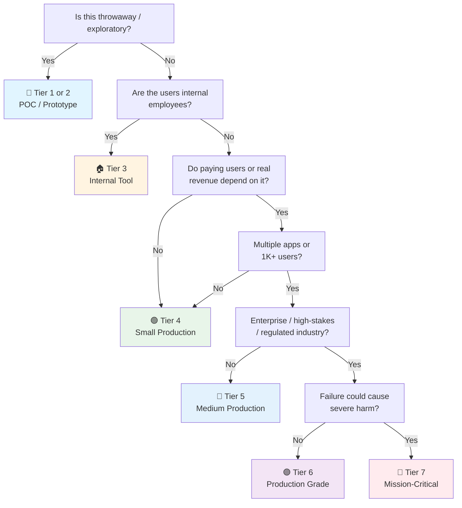

# Angular Launch Checklist

> Tick every box before an Angular app hits production. Framework companion to [[Frontend Launch]]. Angular is opinionated — lean into it.
> Last updated: 2026-09-14 (added Architecture & Code Organization, Real-Time & Live Data, SEO & Metadata — cascade from [[web]])

---

## 1. Project Setup

- [ ] **Angular CLI** — `ng new project --strict --style=scss`. `ng update @angular/cli @angular/core` for upgrades.
- [ ] **Standalone components** — default since v17. No `NgModule` unless you're migrating legacy code or need `@NgModule` for specific module-scoped providers.
- [ ] **TypeScript strict** — `tsconfig.json`: `strict: true`, `noUncheckedIndexedAccess`, `noPropertyAccessFromIndexSignature`. Angular's strict templates: `strictTemplates: true` in `angularCompilerOptions`.
- [ ] **pnpm** (optional) — `ng config cli.packageManager pnpm`. Angular officially supports it.
- [ ] **ESLint** — `@angular-eslint`. Replaced deprecated TSLint since v12. `ng lint` in CI.

---

## 2. Architecture & Code Organization

- [ ] **Feature-based folder structure** — Organize by domain (`src/app/features/users/`, `features/orders/`) or an Nx-style workspace with libs (`libs/feature/users`, `libs/shared/ui`). Components, services, models co-located per feature. Not type-based splits at the root (`components/`, `services/`, `models/`) — type-based dies at ~20 files.
- [ ] **Standalone components + lazy-loaded feature routes** — Each feature exposes one standalone entry component, loaded via `loadComponent` / `loadChildren`. Feature = route = bundle boundary.
- [ ] **Dependency rule points inward** — Domain libs (models, business logic, types) never import UI libs. UI imports from domain, never the reverse (Clean Architecture).
- [ ] **Module boundaries enforced in CI** — `eslint-plugin-boundaries`, or Nx `enforce-module-boundaries` with lib tags (`type:feature`, `scope:users`). Nothing imports upward or sideways across features except through the public export.
- [ ] **Limited barrel files** — One `public-api.ts` per lib (Nx convention) or `index.ts` per feature boundary at most. Deep-import within a feature. Barrels everywhere drag whole libs into bundles and kill tree-shaking.
- [ ] **Shared code promoted on third use** — Don't abstract on first or second use. Promote into a `shared/` or `feature/` lib: validated types, API client, guards, design tokens, utils — not speculative "common" components.
- [ ] **Specs co-located** — `user-card.component.spec.ts` next to `user-card.component.ts`. The CLI scaffolds it this way by default; keep it.
- [ ] **API types generated, not hand-written** — `openapi-typescript`, orval, or `ng-openapi-gen` from the backend's OpenAPI spec. Hand-maintained response interfaces drift.
- [ ] **Angular 17+ control flow syntax** — `@if` / `@for` / `@switch` everywhere. No legacy `*ngIf` / `*ngFor` in new code — consistent templates, smaller generated output.

---

## 3. Signals (Angular 17+)

- [ ] **`signal()` over `BehaviorSubject`** — reactive state within components and services. `count = signal(0)`. Read: `count()`. Set: `count.set(5)`. Update: `count.update(v => v + 1)`.
- [ ] **`computed()`** — derived state. `doubleCount = computed(() => this.count() * 2)`. Lazy, memoized, auto-tracks deps.
- [ ] **`effect()`** — side effects when signals change. `effect(() => console.log(this.count()))`. Auto-cleanup on destroy. Not for state derivation — use `computed` for that.
- [ ] **`input()` / `output()`** — replace `@Input()` and `@Output()`. `name = input<string>()`. `submit = output<FormData>()`. Type-safe.
- [ ] **`model()`** — two-way binding without `@Input` + `@Output` boilerplate. `value = model(0)`. `[(value)]` in parent.
- [ ] **`linkedSignal()`** — signal that resets when source changes. Good for dependent form state.
- [ ] **`resource()` (experimental)** — declarative async data loading with signals. Wraps HTTP calls with loading/error states. Only replace RxJS for simple fetch scenarios where stream cancellation and retry aren't needed.

---

## 4. State Management

- [ ] **Signals for local state** — component-level state: `signal()`, `computed()`. No store needed for UI state.
- [ ] **NgRx SignalStore** — for global state. Lightweight, signal-based. `withState`, `withComputed`, `withMethods`. Replaces classic `@ngrx/store` (RxJS-based).
- [ ] **No NgRx for new projects** — unless team is already deep in RxJS + NgRx. SignalStore is simpler, smaller bundle.
- [ ] **TanStack Query (Angular)** — `@tanstack/angular-query-experimental`. For server state. `injectQuery`, `injectMutation`. Auto-caching, refetch.
- [ ] **URL as state** — `ActivatedRoute.queryParams` (or `input() + withComponentInputBinding()`). Filters, pagination in URL.

---

## 5. Components

- [ ] **`OnPush` change detection** — default. Signals + `OnPush` = optimal rendering. `markForCheck()` only when needed.
- [ ] **Control flow syntax** — `@if`, `@for`, `@switch` in templates. No more `*ngIf`, `*ngFor`. `@for (item of items; track item.id)` — track is mandatory in v17+.
- [ ] **`@defer`** — lazy-load parts of template. `@defer (on viewport) { <heavy-component /> } @placeholder { <skeleton /> } @loading { <spinner /> } @error { <error /> }`.
- [ ] **`@let`** — declare template-local variables. `@let total = items().reduce(...)`. Replaces complex expressions in bindings.
- [ ] **`ngSrc` / `ngSrcset`** — replace `[src]`. Native lazy-loading, priority hints, preconnect.
- [ ] **`viewChild` / `viewChildren`** — signal-based queries. `canvas = viewChild<ElementRef>('myCanvas')`. No `@ViewChild` decorator.

---

## 6. Dependency Injection

- [ ] **`inject()` function** — replace constructor injection. `private userService = inject(UserService)`. Works anywhere in injection context (components, services, guards, interceptors, directives, pipes).
- [ ] **`providedIn: 'root'`** — tree-shakable singleton services. `@Injectable({ providedIn: 'root' })`. No `providers: []` in NgModule.
- [ ] **Injection token** — `InjectionToken<T>` for non-class dependencies. `export const API_URL = new InjectionToken<string>('API_URL')`.
- [ ] **`takeUntilDestroyed()`** — auto-unsubscribe. `pipe(takeUntilDestroyed())`. No `ngOnDestroy` boilerplate for subscription cleanup.

---

## 7. Routing

- [ ] **Standalone routing** — `provideRouter(routes)`. `Routes = [{ path: '', component: HomeComponent }]`. Lazy: `loadComponent: () => import('./home.component').then(m => m.HomeComponent)`.
- [ ] **Route guards as functions** — `canActivate: [() => inject(AuthService).isLoggedIn()]`. `inject()` in guards.
- [ ] **`withComponentInputBinding()`** — route params → component inputs. `@Input() id!: string` auto-bound from `:id`. Enable in `provideRouter`.
- [ ] **Route resolvers** — `resolve: { user: () => inject(UserService).getUser() }`. Data fetched before navigation. Component receives resolved data via `input()`.
- [ ] **`RouterLink`** — ```<a [routerLink]="['/user', user().id]">```. Active link: `routerLinkActive="active"`.
- [ ] **`ViewTransition`** — `withViewTransitions()` in router. Smooth page transitions with CSS `::view-transition-old/new`. Chrome-only (2024+) but progressively enhanced.

---

## 8. SEO & Metadata

- [ ] **SSR or SSG for public indexable pages** — Angular Universal (`ng add @angular/ssr`) with `provideServerRendering()`, or prerender (`ng build --prerender`) for static marketing/docs pages. CSR-only content is invisible to some crawlers and to social unfurlers. Verify with "View source" (not DevTools).
- [ ] **`Meta` and `Title` services** — Inject Angular's `Title` / `Meta` in a per-route service, or drive titles from route `data` + `title` property on routes. Unique `<title>` (50–60 chars) and `<meta name="description">` (140–160) per page, generated from data — never hard-coded strings.
- [ ] **Open Graph + Twitter cards** — `og:title`, `og:description`, `og:image` (1200×630), `twitter:card` via `Meta.addTag`. Test unfurls in Slack/Discord/X validators before launch.
- [ ] **Structured data (JSON-LD)** — `Organization`, `Product`, `Article`, `BreadcrumbList`, `FAQPage` where applicable. Inject `<script type="application/ld+json">` via `DomSanitizer.bypassSecurityTrustScript` or `Renderer2` — never string-concatenate untrusted data into it. Validate with Google Rich Results Test.
- [ ] **`robots.txt` + `sitemap.xml` generated at build** — Auto-generated sitemap with `lastmod`; referenced in robots.txt. An Angular build step or server route emits them — not hand-maintained.
- [ ] **hreflang for multi-locale** — Correct language/region pairs, self-referencing entries, `x-default`. Only when i18n exists (Angular i18n builds or `@ngx-translate`).
- [ ] **Indexability control** — `noindex` on authenticated, duplicate, parameterized, and staging pages. Staging behind auth + `X-Robots-Tag: noindex` (never rely on robots.txt alone).
- [ ] **Search Console + Bing Webmaster** — Registered, sitemap submitted, crawl errors and 404s monitored after launch.
- [ ] **Core Web Vitals are SEO** — LCP/INP/CLS thresholds are ranking inputs. Lighthouse SEO audit in CI; metadata lint (unique titles, canonical present) for critical routes.

---

## 9. Forms

- [ ] **Reactive forms** — `FormGroup`, `FormControl`, `FormBuilder`. `form = this.fb.group({ email: ['', [Validators.required, Validators.email]]) }`. Type with `FormGroup<{ email: FormControl<string> }>` for strict typing.
- [ ] **Signals with forms** — `form.valueChanges.pipe(takeUntilDestroyed())`. Or `toSignal(form.valueChanges)` for signal-based consumption.
- [ ] **Custom validators** — `function emailDomain(domain: string): ValidatorFn { return (control) => ... }`. Async: `AsyncValidatorFn` returning `Observable<ValidationErrors | null>`.
- [ ] **Form states** — `form.pristine`, `form.dirty`, `form.valid`, `form.invalid`, `form.pending` (for async validators), `form.submitted`. Match every combination: pristine+invalid (no errors shown), dirty+invalid (show errors), valid+submitted (success route).
- [ ] **`[formGroup]` in template** — `[formGroup]="form"`, `formControlName="email"`. Or `[formControl]="form.controls.email"`. Prefer `formControlName` for group forms.
- [ ] **Server-side validation** — Angular only runs client-side rules. Server re-validates all input — display server errors in the same `<mat-error>` or `<div class="error">` component as client-side errors with the form control's `setErrors({ server: message })`.

---

## 10. HTTP & API

- [ ] **`provideHttpClient(withInterceptors([authInterceptor]))`** — functional interceptors. `(req: HttpRequest<unknown>, next: HttpHandlerFn) => ...`.
- [ ] **`httpResource()` (experimental)** — signal-based HTTP. `users = httpResource<User[]>('/api/users')`. Auto-tracks deps, refetch on signal change, loading/error states.
- [ ] **Environment config** — `environment.ts` / `environment.prod.ts`. `provideAppInitializer(() => configService.load())`.
- [ ] **Error interceptor** — catch HTTP errors globally. Show toast, redirect to login on 401.

---

## 11. Real-Time & Live Data

- [ ] **SSE vs WebSocket** — SSE for one-way server→client streams (notifications, activity feeds, LLM tokens). WebSocket only for bidirectional (chat, collaboration, presence). Default to SSE — simpler, works over HTTP/2, auto-reconnects natively.
- [ ] **RxJS as the backbone** — `WebSocketSubject` from `rxjs/webSocket` with reconnect config, or `EventSource` wrapped in `new Observable` / `fromEvent`. Compose live streams with `retryWhen`/`retry({ delay })`, `throttleTime`, `bufferTime` — this is Angular's home turf, use it.
- [ ] **Events write into the server-state cache** — Real-time messages update the TanStack Query Angular cache (`queryClient.setQueryData` / `invalidateQueries`) or a signal-based store (`NgRx SignalStore`, `signal()`). Never a parallel component-local copy of live data — one source of truth.
- [ ] **Reconnection with backoff + jitter** — Exponential backoff with jitter so a server restart doesn't cause a thundering herd. `Last-Event-ID` (SSE) or resume token (WS) so reconnects don't duplicate or drop messages.
- [ ] **Ordering & dedup** — Sequence numbers on server events; dedupe by event ID client-side. Chatty streams: batch UI updates with `auditTime`/`bufferTime` (backpressure).
- [ ] **Optimistic + server-authoritative** — Optimistic UI for the user's own actions, reconciled on server ack. Server wins on conflict.
- [ ] **Auth over the channel** — Cookie-authenticated SSE/WS. Never a token in the query string (leaks into logs).
- [ ] **Cleanup** — Unsubscribe on destroy: `takeUntilDestroyed()` (injection context) or `AsyncPipe` in templates. Close sockets on route change. No zombie connections.
- [ ] **`AsyncPipe` or signals in templates** — Render live observables with `| async` or convert with `toSignal()`. Never manual `.subscribe()` in a component writing to a plain field without cleanup — change detection and leaks both suffer.
- [ ] **SSR caveat** — Sockets/`EventSource` don't exist on the server. Guard subscriptions with `isPlatformBrowser` / `afterNextRender`, or open connections only client-side after hydration.
- [ ] **Scale awareness** — WS doesn't scale on serverless hosts — use SSE, Pusher/Ably, or a dedicated WS server. Per-connection server cost; pub/sub fan-out via Valkey/Redis on the backend; polling fallback when proxies block WS.

---

## 12. Styling

- [ ] **`styleUrl` / `styles`** — component-scoped by default (emulated shadow DOM). `ViewEncapsulation.None` only when needed.
- [ ] **Tailwind CSS** — `@tailwindcss/postcss`. Works with Angular CLI natively. `ng add @angular-builders/custom-webpack` if needed.
- [ ] **Component library** — Angular Material (official, accessible, Material 3 in v18+), PrimeNG, or Spartan UI (Radix port for Angular). Don't build dialogs/tooltips from scratch.
- [ ] **CSS variables for theming** — Angular Material theming uses `@use '@angular/material' as mat;`. Custom themes: `mat.define-theme()`.
- [ ] **Dark mode** — toggle `dark` class on `<html>`. Tailwind `dark:` prefix. Material: `@include mat.all-component-colors($dark-theme)`.

---

## 13. Testing

- [ ] **Jasmine / Karma** — default. `ng test`. Or Jest via `@angular-builders/jest` (faster, parallel).
- [ ] **Component tests** — `TestBed.configureTestingModule({ imports: [MyComponent] }).compileComponents()`. `fixture.componentInstance`, `fixture.detectChanges()`.
- [ ] **`fakeAsync` / `tick`** — control time in tests. `fakeAsync(() => { service.getData(); tick(1000); expect(component.data()).toBeDefined(); })`. Stable time = deterministic flaky tests eliminated.
- [ ] **Service tests** — `TestBed.inject()` + `HttpClientTestingModule`. `httpTestingController.expectOne('/api/users').flush(mockUsers)`. Each test explicitly expects its requests — no orphaned calls.
- [ ] **Playwright** — E2E for critical flows. Angular supports it well. `page.waitForSelector('app-user-list')`.
- [ ] **Accessibility tests** — `@axe-core/playwright` in E2E. Jasmine-axe in unit tests for component-level a11y audits.

---

## 14. Security

- [ ] **No `bypassSecurityTrustHtml`** unless absolutely forced — and only with DOMPurify first.
- [ ] **`DomSanitizer`** — Angular sanitizes `[innerHTML]` by default. Don't bypass it.
- [ ] **No secrets in Angular code** — everything ships to the browser. Environment files contain public keys, not secrets.
- [ ] **CSP compatible** — Angular v18+ supports strict CSP without `unsafe-inline`. Templates are AOT-compiled, styles are component-scoped. Verify in production build with `ng serve --configuration production`.
- [ ] **Auth tokens** — HTTP-only cookies preferred. If localStorage: accept XSS risk, keep TTL short.

---

## 15. Performance

- [ ] **AOT compilation** — default in production. Verify: `ng build --configuration production`.
- [ ] **Tree-shaking** — `providedIn: 'root'` services. Standalone components. Only imported code ships.
- [ ] **Lazy routes** — `loadComponent: () => import(...)`. Every route not on the critical path.
- [ ] **`@defer` for below-fold content** — `@defer (on viewport)`. Reduces initial bundle.
- [ ] **`trackBy` / `track`** — `@for (item of items; track item.id)`. Prevents full-list re-render on mutation or filter.
- [ ] **Angular DevTools** — profiler tab. Detect unnecessary change detection cycles. `ng.profiler.timeChangeDetection()`.
- [ ] **Bundle budget** — `angular.json`: `"budgets": [{ "type": "initial", "maximumWarning": "500kb" }]`. Breaks build if exceeded.

---

## 16. Build & Deploy

- [ ] **`ng build --configuration production`** — AOT, minification, dead code elimination, service worker if configured.
- [ ] **`@angular/pwa`** — `ng add @angular/pwa`. Service worker, manifest, offline support. `ngsw-config.json` for cache strategy.
- [ ] **`angular.json` budgets** — warn at 500KB initial, error at 2MB. Catches accidental dependency bloat at build time before it reaches users.
- [ ] **SSR (Angular Universal)** — `ng add @angular/ssr`. `provideServerRendering()`. Hybrid: some routes CSR, some SSR.
- [ ] **`@ngx-translate` or Angular i18n** — i18n built-in since Angular 9. `ng extract-i18n`. Or `@ngx-translate/core` for runtime switching.
- [ ] **Environment configs** — `fileReplacements` in `angular.json`. `environment.ts` → `environment.prod.ts` at build time.

## 17. AI/LLM Integration

- [ ] **HTTP streaming** — `HttpClient` with `responseType: 'text'` + `reportProgress` or fetch-based `ReadableStream` parsing for SSE. Or `@microsoft/fetch-event-source` for robust event-stream handling.
- [ ] **Never expose provider keys** — Everything in Angular ships to the browser. LLM calls go through your backend (or Angular SSR server routes). Keys stay server-side.
- [ ] **Signal-based AI state** — Chat messages as `signal<Message[]>()`, `computed()` for derived UI state, `httpResource()` (experimental) for AI endpoint calls. `effect()` for side effects like scroll-to-bottom.
- [ ] **Streaming UX** — Append tokens to the last message signal as they arrive. Typing indicator, stop button (`AbortController` / unsubscribe), regenerate + edit affordances.
- [ ] **Markdown rendering** — `ngx-markdown` with sanitization enabled, or `marked` + DOMPurify. Never `bypassSecurityTrustHtml` on model output.
- [ ] **Non-chat AI calls** — RxJS `switchMap` for debounced AI calls, or TanStack Query Angular with `injectQuery`. Cache identical prompts.
- [ ] **Graceful degradation** — Error state with retry, cached fallback, "AI can be wrong" disclaimers where user-facing. Rate-limit UX on 429.

## 18. Data Privacy & Compliance (Frontend-Specific)

- [ ] **Error monitoring scrubbing** — Sentry `beforeSend` strips PII (emails, tokens, form values) from error payloads.
- [ ] **Cookie consent** — GDPR/CCPA banner before analytics fire. Load analytics only after opt-in (or cookieless: Plausible, Umami).
- [ ] **PII minimization** — Don't store user data in localStorage/IndexedDB unnecessarily. Mask sensitive data in UI previews.
- [ ] **Third-party script inventory** — Audit `index.html` script tags and lazy-loaded embeds: what loads, what it collects, where it's sent (EU/US).
- [ ] **Data retention UI** — "Delete my data" / "Export my data" flows calling backend erasure/export endpoints via `HttpClient`.
- [ ] **Privacy policy & terms** — Up-to-date, linked in footer. Cover collection, retention, rights (access/erasure/portability).
- [ ] **Do Not Track / GPC** — Respect `navigator.doNotTrack` and Global Privacy Control where feasible.

---

## Quick Sanity Check

- [ ] `ng build --configuration production` succeeds — zero build errors
- [ ] `ng test` passes — all tests green
- [ ] `ng lint` passes — zero warnings
- [ ] No `console.log` in production (ESLint `no-console` rule)
- [ ] Lighthouse ≥ 90 on mobile
- [ ] `@defer` on all below-fold content
- [ ] All routes lazy-loaded except the initial landing page
- [ ] Service worker registered (if PWA)
- [ ] CSP tested in production mode (templates + styles pass without violations)
- [ ] `track` on every `@for` loop


---

## Project Tier Scoping Matrix

> **How to use this table:** Pick your tier first, then focus only on the sections marked ✅ (required) or 🟡 (recommended). Skip ❌ sections entirely — they'd be over-engineering for your context.
>
> **Legend:** ✅ Required · 🟡 Recommended / partial · ❌ Skip

### Tier Descriptions

| # | Tier | Description | Typical Team | Users | Lifespan |
|---|---|---|---|---|---|
| 1 | 🧪 **POC / Spike** | Validate an idea. Throwaway code. `console.log` is fine. | 1 dev | Internal only | Days–weeks |
| 2 | 🔧 **Prototype / MVP** | Waiting for integration or user validation. Might become real. | 1–2 devs | Beta testers | Weeks–months |
| 3 | 🏠 **Internal Tool** | Real users (employees), real traffic. No external exposure or paying customers. | 1–3 devs | Employees | Ongoing |
| 4 | 🟢 **Small Production** | Single app, few pages, low traffic. Real users, maybe early revenue. | 1–2 devs | < 1K users | Ongoing |
| 5 | 🔵 **Medium Production** | Multiple apps or higher traffic. Real revenue or user base that matters. | 2–5 devs | 1K–100K users | Ongoing |
| 6 | 🟣 **Production Grade** | Full rigor — high-stakes SaaS, enterprise product, or large user base. | 5+ devs | 100K+ users | Long-term |
| 7 | 🔴 **Mission-Critical / Regulated** | Healthcare (HIPAA), finance (PCI-DSS), safety systems. Failure = severe harm. Adds formal verification, regulatory audit. | 10+ devs | Varies | Decades |

### Which Tier Am I?



### Checklist Applicability by Tier

| # | Section | 🧪 POC | 🔧 Prototype | 🏠 Internal | 🟢 Small Prod | 🔵 Medium Prod | 🟣 Production Grade | 🔴 Mission-Critical |
|---|---|:---:|:---:|:---:|:---:|:---:|:---:|:---:|
| 1 | Project Setup | 🟡 | ✅ | ✅ | ✅ | ✅ | ✅ | ✅ |
| 2 | Architecture & Code Organization | 🟡 | 🟡 | ✅ | ✅ | ✅ + boundaries | ✅ + enforced CI | ✅ + formal review |
| 3 | Signals (Angular 17+) | 🟡 | ✅ | ✅ | ✅ | ✅ | ✅ | ✅ |
| 4 | State Management | 🟡 | 🟡 | ✅ | ✅ | ✅ | ✅ | ✅ |
| 5 | Components | 🟡 | ✅ | ✅ | ✅ | ✅ | ✅ | ✅ |
| 6 | Dependency Injection | 🟡 | ✅ | ✅ | ✅ | ✅ | ✅ | ✅ |
| 7 | Routing | 🟡 | ✅ | ✅ | ✅ | ✅ | ✅ | ✅ |
| 8 | SEO & Metadata | ❌ | 🟡 if public | 🟡 if public | ✅ if public | ✅ | ✅ + structured data | ✅ |
| 9 | Forms | 🟡 | ✅ | ✅ | ✅ | ✅ | ✅ | ✅ + audit trail |
| 10 | HTTP & API | 🟡 | ✅ | ✅ | ✅ | ✅ | ✅ | ✅ |
| 11 | Real-Time & Live Data | ❌ | 🟡 if used | 🟡 if used | ✅ if used | ✅ + scale | ✅ + load testing | ✅ + HA/failover |
| 12 | Styling | 🟡 | ✅ | ✅ | ✅ | ✅ | ✅ | ✅ + design system |
| 13 | Testing | ❌ maybe smoke | 🟡 unit | ✅ + component | ✅ + E2E | ✅ + visual reg | ✅ + a11y in CI | ✅ + formal verification |
| 14 | Security (Frontend) | 🟡 no secrets | 🟡 essentials | ✅ | ✅ + CSP | ✅ + pentest | ✅ + hardened | ✅ + formal audit |
| 15 | Performance | ❌ | 🟡 basic CWV | ✅ | ✅ + budgets | ✅ + profiling | ✅ + SLO | ✅ + capacity |
| 16 | Build & Deploy | ❌ | 🟡 basic build | ✅ + CI | ✅ + previews | ✅ + canary + flags | ✅ + full pipeline | ✅ + signed artifacts |
| 17 | AI/LLM Integration | 🟡 if AI is the POC | 🟡 | 🟡 if used | ✅ if used | ✅ | ✅ + guardrails | ✅ + audit trail |
| 18 | Data Privacy & Compliance | ❌ | ❌ | 🟡 minimal | ✅ consent + PII | ✅ + DPA | ✅ full compliance | ✅ + regulatory framework |

---

## Sources

- Angular docs — https://angular.dev/
- `[[Frontend Launch]]` — general frontend checklist (tick first)
