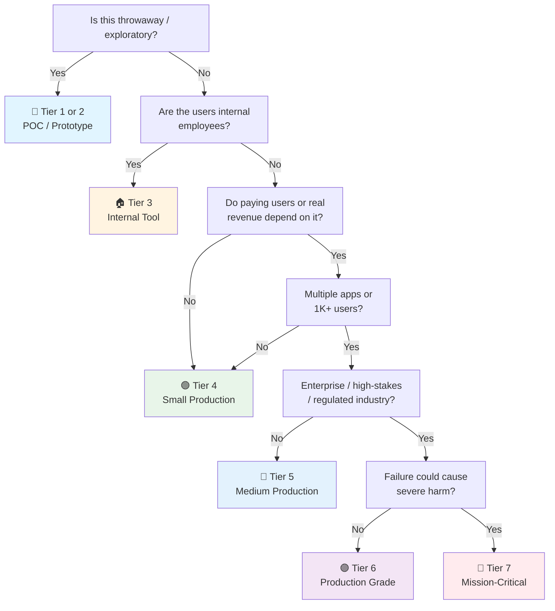

# React / Next.js Frontend Checklist

> Practical, no-fluff checklist for production React + Next.js apps.
> React JS companion to the general [[web]]
> Last updated: 2026-08-05

---

## 1. Project Setup

- [ ] **Next.js App Router** — Default for new projects. Pages Router only if migrating legacy or team refusal.
- [ ] **Vite + React Router 7** — If pure SPA (internal dashboard, no SEO). Lighter, faster dev.
- [ ] **TypeScript strict mode** — `tsconfig.json`: `"strict": true`, plus `noUncheckedIndexedAccess`, `exactOptionalPropertyTypes`, `noUnusedLocals`, `noUnusedParameters`.
- [ ] **Package manager** — pnpm recommended (strict, fast, disk-efficient). Lockfile committed.
- [ ] **ESLint + Prettier** or **Biome** — Biome is faster, single config. Either way: pre-commit hook (lint-staged + husky/lefthook).

## 2. Rendering Model (The Critical Decision)

- [ ] **"use client" vs "use server"** — Components are Server Components by default. Add `"use client"` only when you need hooks, event handlers, browser APIs, or context.
- [ ] **Server Components for data** — Fetch data in Server Components. Pass as props to Client Components. No API routes just to bridge data.
- [ ] **Streaming with Suspense** — `loading.tsx` for route-level. `<Suspense fallback={<Skeleton />}>` for component-level. Users see content faster.
- [ ] **Server Actions** — For form mutations. `action={myServerAction}` instead of `onSubmit` + `fetch`. But know the limits: complex validation or third-party integrations → explicit API route.
- [ ] **ISR / SSG / SSR per route** — Static for marketing pages (`export const revalidate = 3600`). Dynamic for dashboards. SSR for user-specific pages.

## 3. Data Fetching & Server State

- [ ] **TanStack Query (React Query)** — The standard. Every async read goes through a query. Every async write goes through a mutation.
- [ ] **Query key conventions** — `['users', userId, 'posts', { status: 'draft' }]`. Hierarchical, granular, cache-friendly.
- [ ] **Stale time & gc time** — `staleTime` controls refetch. `gcTime` (formerly `cacheTime`) controls eviction. Default staleTime is 0 (too aggressive). Set aggressively for static data, conservatively for real-time.
- [ ] **`placeholderData` & `keepPreviousData`** — Smooth pagination transitions. No layout shift between pages.
- [ ] **Optimistic updates** — `onMutate: async (newTodo) => { await cancelQueries(); const previous = getQueryData(); setQueryData(...); return { previous }; }`. Then `onError: (err, vars, context) => setQueryData(..., context.previous)`.
- [ ] **Prefetch on hover/focus** — `queryClient.prefetchQuery` in `onMouseEnter`. Data ready before user clicks.
- [ ] **Error & loading boundaries** — `<ErrorBoundary>` for crashes. `<Suspense>` for loading. Every async operation has: loading, empty, error, and loaded state rendering.

## 4. Client State Management

- [ ] **Zustand** — For cross-component shared state that isn't server data. No providers, no boilerplate, tiny.
- [ ] **Jotai** — If you prefer atom-based reactivity over store-based. Good for derived state chains.
- [ ] **URL as state** — Search params, filters, pagination → `useSearchParams()`, `useRouter()`. Shareable URLs, back-button works.
- [ ] **Form state** — React Hook Form + Zod. `useForm<z.infer<typeof schema>>({ resolver: zodResolver(schema) })`. Controlled inputs, uncontrolled performance.
- [ ] **Context** — Only for truly global concerns (auth, theme, locale). Not for frequent-update state (re-renders all consumers).
- [ ] **No Redux** — Unless you have a specific, justified need for normalized entity caching with cross-cutting concerns. TanStack Query + Zustand covers 95% of cases with less code.

## 5. Performance

- [ ] **React Compiler (React 19+)** — Opt-in progressively. Automatically memoizes components and hooks. Enable per-directory with eslint plugin.
- [ ] **Bundle splitting** — Route-level is automatic in Next.js (`page.tsx` → separate chunk). Component-level: `next/dynamic(() => import('./HeavyChart'), { loading: () => <Skeleton /> })`.
- [ ] **Image optimization** — `next/image` with `sizes`, `priority` on LCP image, `placeholder="blur"` for local images. Remote images: configure `remotePatterns` in `next.config.ts`.
- [ ] **Font optimization** — `next/font` with `subset` and `display: 'swap'`. Self-host fonts, don't fetch from Google Fonts.
- [ ] **No waterfall data fetching** — Fetch in parallel where possible: `const [users, posts] = await Promise.all([getUsers(), getPosts()])`. Or use RSC to fetch at component level naturally.
- [ ] **Large lists** — `@tanstack/react-virtual` for tables, feeds, any list > 50 items that's in the viewport.
- [ ] **Debounce search inputs** — Not `onChange` → API call. `onChange` → local state → debounce 300ms → API call.
- [ ] **Web Vitals monitoring** — `useReportWebVitals` → analytics. LCP < 2.5s, INP < 200ms, CLS < 0.1. Measure with Lighthouse CI in pipeline.

## 6. Styling & Design

- [ ] **Tailwind CSS** — Utility-first, tree-shakable. Pair with `clsx`/`tailwind-merge` for conditional classes.
- [ ] **Component primitives** — shadcn/ui (copy-paste, not npm dependency), Radix UI (headless, accessible), or Ark UI. Don't build your own modal/dropdown/tooltip from scratch.
- [ ] **Design tokens** — CSS custom properties for colors, spacing, radius. `@theme` in Tailwind v4. Dark mode via class strategy (`dark:` prefix).
- [ ] **Responsive** — Mobile-first with Tailwind breakpoints (`sm:`, `md:`, `lg:`, `xl:`). Test at actual device widths.
- [ ] **Layout components** — `<Container>`, `<Stack>`, `<Grid>` wrappers. Consistent spacing and alignment.

## 7. Forms

- [ ] **React Hook Form** — Uncontrolled by default (best performance). `register()` for simple fields, `Controller` for complex controlled components.
- [ ] **Zod validation** — Schema on the form, not ad-hoc. `z.object({ email: z.string().email() })`. Reuse schemas with backend if shared package.
- [ ] **Server-side validation too** — Client validation is UX, server validation is security. Always validate in Server Action or API route.
- [ ] **Form states** — Idle, submitting (disable button + spinner), success (redirect/toast), error (inline field errors + form-level error).
- [ ] **`useFormStatus`** — Inside form children to get pending state without passing props down. `const { pending } = useFormStatus()`.
- [ ] **`useActionState` (React 19)** — Replaces `useFormState`. `const [state, formAction, isPending] = useActionState(serverAction, initialState)`.

## 8. Routing & Navigation

- [ ] **Nested layouts** — `layout.tsx` preserves state across navigations. Auth layout, dashboard layout, settings layout.
- [ ] **Parallel routes & intercepting routes** — For modals on top of existing pages (photo lightbox, quick-edit drawer). URL changes but background page persists.
- [ ] **Loading UI per route** — `loading.tsx` near `page.tsx`. Automatic Suspense boundary.
- [ ] **Error UI per route** — `error.tsx` near `page.tsx`. Automatic Error Boundary. `reset()` function to retry.
- [ ] **Not found per route** — `not-found.tsx` for route-specific 404 content.
- [ ] **Middleware** — `middleware.ts` for auth guards, redirects, locale detection. Runs on Edge runtime (limited APIs).

## 9. Testing

- [ ] **Vitest** — Fast, Vite-native, Jest-compatible API. Unit tests for utils, hooks, state logic.
- [ ] **React Testing Library** — Test behavior: `screen.getByRole('button', { name: /submit/i })`. Not `screen.getByTestId('submit-btn')`. Use `userEvent`, not `fireEvent`.
- [ ] **MSW (Mock Service Worker)** — Intercept at network level. Components test against realistic API responses. Works with both REST and GraphQL.
- [ ] **Playwright** — E2E for critical flows: login → navigate → create → edit → delete. Also for visual regression with `toHaveScreenshot()`.
- [ ] **Accessibility tests** — `jest-axe` in unit tests. `@axe-core/playwright` in E2E. Catch violations in CI.

## 10. Accessibility (a11y)

- [ ] **Semantic HTML** — `<button>` for actions, `<nav>` for navigation, `<main>` for content, `<form>` for forms. Not `
`.
- [ ] **Heading hierarchy** — One `<h1>`, logical `<h2>` → `<h3>` nesting. Not skipping levels for visual sizing.
- [ ] **Keyboard navigation** — Tab order logical, focus indicators visible (`:focus-visible` ring). Skip-to-content link at top.
- [ ] **ARIA when needed** — `aria-label` on icon-only buttons. `aria-expanded` on toggles. `role` only when HTML semantics can't express it. No ARIA > bad ARIA.
- [ ] **Color contrast** — WCAG AA minimum (4.5:1 normal text, 3:1 large text). Tailwind's default colors pass most. Check with devtools.
- [ ] **Screen reader testing** — Spot-check with VoiceOver (macOS) or NVDA (Windows). Navigate by headings, links, form controls.

## 11. Security (Frontend-Specific)

- [ ] **XSS prevention** — Never `dangerouslySetInnerHTML` without DOMPurify. `{{ __html: content }}` is a gaping hole.
- [ ] **Never `eval`, never `new Function`** in client code. CSP should block anyway.
- [ ] **No secrets in client code** — `NEXT_PUBLIC_*` and `VITE_*` are bundled to the browser. Server-only env vars (no prefix) stay server-side.
- [ ] **Auth token storage** — HTTP-only cookies for auth tokens (not accessible to JS). If forced to use localStorage: accept the XSS risk and keep token lifetime short.
- [ ] **CSP (Content Security Policy)** — Work with backend to set restrictive CSP. No `unsafe-inline`, no `unsafe-eval`. Report-only mode first.
- [ ] **Dependency audit** — `npm audit` / `pnpm audit` in CI. Dependabot/Renovate for automated patches. Frontend has hundreds of transitive deps.

## 12. Build & Deploy

- [ ] **Environment variables** — `NEXT_PUBLIC_*` for client-safe. Server-only vars exposed only in Server Components / Server Actions / API routes.
- [ ] **CI/CD** — Lint → type-check → unit test → build → deploy preview (Vercel/Cloudflare) → E2E → promote to production.
- [ ] **Preview deployments per PR/commit** — Vercel/Netlify/Cloudflare Pages. Shareable URLs for stakeholders.
- [ ] **Static assets with content-hash** — `next build` does this automatically. Immutable cache headers for `/_next/static/*`.
- [ ] **Bundle analysis** — `ANALYZE=true next build` or `@next/bundle-analyzer`. Catch accidentally-large deps.

## 13. Error Handling & Observability

- [ ] **Error boundaries** — `error.tsx` per route. Also a global `<ErrorBoundary>` wrapping the app. Fallback UI, not white screen.
- [ ] **Sentry** — Capture errors with source maps. `Sentry.init()` in `instrumentation.ts` or `sentry.client.config.ts`. Correlate with backend traces.
- [ ] **RUM (Real User Monitoring)** — Core Web Vitals to analytics. Know what users actually experience, not just what synthetic tests show.
- [ ] **Feature flags** — LaunchDarkly, Vercel Flags, or simple DB/edge config. Kill broken features without redeploy.

## 14. AI/LLM Integration

- [ ] **Vercel AI SDK** — `ai` package with React support. `useChat` for chat UIs, `streamText` + `toDataStreamResponse()` for server-side streaming.
- [ ] **RSC streaming** — AI SDK v4+ streams into React Server Components (`toUIMessageStream`). `<Suspense>` boundaries with streaming content. Don't fall back to polling.
- [ ] **Never expose provider keys** — `NEXT_PUBLIC_OPENAI_API_KEY` ships to the browser. All LLM calls run in Server Actions, Route Handlers, or your backend. Server-only env vars (no prefix).
- [ ] **Streaming UI** — `useChat` gives `messages`, `input`, `isLoading`, `stop()`. Render partial markdown as tokens arrive. Abort button with `stop()`, regenerate and edit-message affordances.
- [ ] **Markdown rendering** — `react-markdown` + `rehype-highlight` for code blocks. Sanitize LLM output with DOMPurify before `dangerouslySetInnerHTML`. Never trust model output as HTML.
- [ ] **Non-chat AI calls** — classify/extract/summarize endpoints go through TanStack Query mutations with loading states. Cache identical prompts (response dedup).
- [ ] **Context & prompt management** — System prompts composed server-side, never in client bundles. Trim context window client-side before sending.
- [ ] **Graceful degradation** — Error state with retry, cached fallback responses, "AI can be wrong" disclaimers where output is user-facing. Rate-limit UX on 429.

## 15. Data Privacy & Compliance (Frontend-Specific)

- [ ] **Error monitoring scrubbing** — Sentry `beforeSend` strips emails, tokens, and form values from error payloads. Never send raw PII to error trackers.
- [ ] **Cookie consent** — GDPR/CCPA banner before analytics fire. Load Plausible/PostHog only after opt-in (or use cookieless analytics).
- [ ] **PII minimization** — Don't store user data in localStorage/IndexedDB unnecessarily. Mask sensitive data in UI previews.
- [ ] **Third-party script inventory** — `next/script` audit: what loads, what it collects, where it's sent (EU/US). Remove dead scripts.
- [ ] **Data retention UI** — "Delete my data" / "Export my data" flows calling backend erasure/export endpoints.
- [ ] **Privacy policy & terms** — Up-to-date, linked in footer. Cover collection, retention, rights (access/erasure/portability).
- [ ] **Do Not Track / GPC** — Respect `navigator.doNotTrack` and Global Privacy Control where feasible.

---

## Quick Sanity Check Before Launch

- [ ] All pages have a `<title>` and `<meta name="description">`
- [ ] LCP image has `priority` and `fetchpriority="high"`
- [ ] No console errors in production build
- [ ] Lighthouse score ≥ 90 on mobile (Performance, Accessibility, Best Practices)
- [ ] Forms submit with Enter key
- [ ] Back button works correctly (no redirect loops)
- [ ] Tested on actual mobile devices, not just Chrome DevTools responsive mode
- [ ] 404 page exists and is helpful (not default Next.js page)
- [ ] `robots.txt` and `sitemap.xml` exist (or `generateSitemaps` in Next.js)

---

## Project Tier Scoping Matrix

> **How to use this table:** Pick your tier first, then focus only on the sections marked ✅ (required) or 🟡 (recommended). Skip ❌ sections entirely — they'd be over-engineering for your context.
>
> **Legend:** ✅ Required · 🟡 Recommended / partial · ❌ Skip

### Tier Descriptions

| # | Tier | Description | Typical Team | Users | Lifespan |
|---|---|---|---|---|---|
| 1 | 🧪 **POC / Spike** | Validate an idea. Throwaway code. `console.log` is fine. | 1 dev | Internal only | Days–weeks |
| 2 | 🔧 **Prototype / MVP** | Waiting for integration or user validation. Might become real. | 1–2 devs | Beta testers | Weeks–months |
| 3 | 🏠 **Internal Tool** | Real users (employees), real traffic. No external exposure or paying customers. | 1–3 devs | Employees | Ongoing |
| 4 | 🟢 **Small Production** | Single app, few pages, low traffic. Real users, maybe early revenue. | 1–2 devs | < 1K users | Ongoing |
| 5 | 🔵 **Medium Production** | Multiple apps or higher traffic. Real revenue or user base that matters. | 2–5 devs | 1K–100K users | Ongoing |
| 6 | 🟣 **Production Grade** | Full rigor — high-stakes SaaS, enterprise product, or large user base. | 5+ devs | 100K+ users | Long-term |
| 7 | 🔴 **Mission-Critical / Regulated** | Healthcare (HIPAA), finance (PCI-DSS), safety systems. Failure = severe harm. Adds formal verification, regulatory audit. | 10+ devs | Varies | Decades |

### Which Tier Am I?

### Checklist Applicability by Tier

| # | Section | 🧪 POC | 🔧 Prototype | 🏠 Internal | 🟢 Small Prod | 🔵 Medium Prod | 🟣 Production Grade | 🔴 Mission-Critical |
|---|---|:---:|:---:|:---:|:---:|:---:|:---:|:---:|
| 1 | Project Setup | 🟡 | ✅ | ✅ | ✅ | ✅ | ✅ | ✅ |
| 2 | Rendering Model | 🟡 SPA only | ✅ | ✅ | ✅ | ✅ | ✅ | ✅ |
| 3 | Data Fetching & Server State | 🟡 fetch basics | 🟡 | ✅ | ✅ | ✅ | ✅ | ✅ |
| 4 | Client State Management | 🟡 | 🟡 | ✅ | ✅ | ✅ | ✅ | ✅ |
| 5 | Performance | ❌ | 🟡 basic CWV | ✅ | ✅ + budgets | ✅ + profiling | ✅ + SLO | ✅ + capacity |
| 6 | Styling & Design | 🟡 | ✅ | ✅ | ✅ | ✅ | ✅ | ✅ + design system |
| 7 | Forms | 🟡 | ✅ | ✅ | ✅ | ✅ | ✅ | ✅ + audit trail |
| 8 | Routing & Navigation | 🟡 | ✅ | ✅ | ✅ | ✅ | ✅ | ✅ |
| 9 | Testing | ❌ maybe smoke | 🟡 unit | ✅ + component | ✅ + E2E | ✅ + visual reg | ✅ + a11y in CI | ✅ + formal verification |
| 10 | Accessibility | ❌ | 🟡 basics | ✅ | ✅ WCAG AA | ✅ + audits | ✅ + WCAG AA certified | ✅ + legal/regulatory |
| 11 | Security (Frontend) | 🟡 no secrets | 🟡 essentials | ✅ | ✅ + CSP | ✅ + pentest | ✅ + hardened | ✅ + formal audit |
| 12 | Build & Deploy | ❌ | 🟡 basic build | ✅ + CI | ✅ + previews | ✅ + canary + flags | ✅ + full pipeline | ✅ + signed artifacts |
| 13 | Error Handling & Observability | ❌ | 🟡 error boundary | ✅ + Sentry | ✅ + RUM | ✅ + dashboards | ✅ + SLO/alerting | ✅ + full stack |
| 14 | AI/LLM Integration | 🟡 if AI is the POC | 🟡 | 🟡 if used | ✅ if used | ✅ | ✅ + guardrails | ✅ + audit trail |
| 15 | Data Privacy & Compliance | ❌ | ❌ | 🟡 minimal | ✅ consent + PII | ✅ + DPA | ✅ full compliance | ✅ + regulatory framework |
