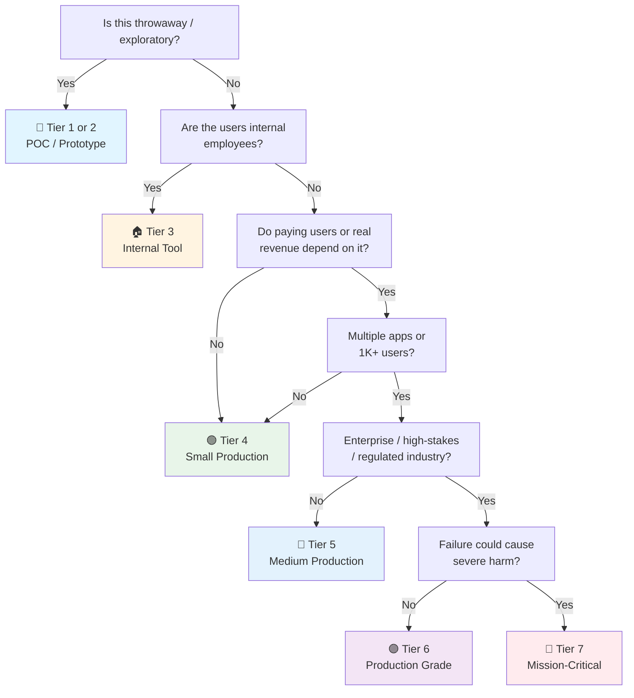

# React Checklist (Library Layer)

> React the UI library — components, hooks, state, rendering, forms, testing. Framework-agnostic to the meta-framework.
> Meta-framework layer: [[next]] (Next.js) · General companion: [[web]] · Launch gate: [[Frontend Launch]]
> Last updated: 2026-09-14 (split from react-js.md — library concerns here, Next.js concerns in [[next]])

---

## 1. Project Setup

- [ ] **Scaffold choice** — Meta-framework (Next.js → [[next]]) for anything public/SEO/full-stack. Vite + React Router 7 for pure SPA (internal dashboard, no SEO). Lighter, faster dev.
- [ ] **React 19** — Compiler, `useActionState`, `useOptimistic`, `use()` available. Don't start new projects on 18 unless dependency-constrained.
- [ ] **TypeScript strict mode** — `tsconfig.json`: `"strict": true`, plus `noUncheckedIndexedAccess`, `exactOptionalPropertyTypes`, `noUnusedLocals`, `noUnusedParameters`.
- [ ] **Package manager** — pnpm recommended (strict, fast, disk-efficient). Lockfile committed.
- [ ] **ESLint + Prettier** or **Biome** — Biome is faster, single config. Either way: pre-commit hook (lint-staged + husky/lefthook). `eslint-plugin-react-hooks` rules are non-negotiable.

## 2. Architecture & Code Organization

- [ ] **Feature-based folders** — `src/features/users/`, `src/features/orders/` with components, hooks, api, schemas co-located per feature. Not type-based (`components/`, `hooks/` at root) — type-based dies at ~20 files.
- [ ] **Module boundaries enforced in CI** — `eslint-plugin-boundaries` or `dependency-cruiser`: `shared/` → `features/` → app shell. No cross-feature imports except through the feature's public export.
- [ ] **Dependency rule points inward** — Domain logic, types, and Zod schemas don't import React or UI details. Components import from logic, never the reverse.
- [ ] **Limited barrel files** — One `index.ts` per feature public boundary at most. Deep-import within a feature. Barrels drag whole libraries into bundles and kill tree-shaking.
- [ ] **Shared code promoted on third use** — `shared/` (or `packages/shared` in monorepo) holds API client, generated types, Zod schemas, design tokens, utils — not speculative "common" components.
- [ ] **Tests co-located** — `user-card.test.tsx` next to `user-card.tsx`. Vitest picks them up by convention.
- [ ] **API types generated, not hand-written** — `openapi-typescript` / orval from the backend's OpenAPI spec (or tRPC end-to-end types). Hand-maintained response types drift.

## 3. Components & Hooks Discipline

- [ ] **Components render, hooks hold logic** — Business logic lives in custom hooks (testable without DOM). Components stay thin and declarative.
- [ ] **Props are explicit contracts** — Typed props, no prop drilling past 2 levels (compose or use context). No boolean-prop explosion (≥3 booleans → variant/compound components).
- [ ] **Never define components inside components** — Remounts on every render, loses state, kills performance.
- [ ] **Custom hooks follow rules of hooks** — No conditional hook calls; `eslint-plugin-react-hooks` enforces. Hooks compose; components consume.
- [ ] **Keys are stable identities** — Never array index as key for reorderable lists. Use stable IDs.
- [ ] **Controlled vs uncontrolled decided per input** — Don't mix. Default: uncontrolled with `defaultValue`, controlled only when you need to react to every keystroke.

## 4. Data Fetching & Server State

- [ ] **TanStack Query (React Query)** — The standard. Every async read goes through a query. Every async write goes through a mutation. (SWR acceptable for simpler apps — it dedupes requests automatically.)
- [ ] **Query key conventions** — `['users', userId, 'posts', { status: 'draft' }]`. Hierarchical, granular, cache-friendly.
- [ ] **Stale time & gc time** — `staleTime` controls refetch. `gcTime` controls eviction. Default staleTime is 0 (too aggressive). Tune per query type: short for real-time, long for static.
- [ ] **`placeholderData` & `keepPreviousData`** — Smooth pagination transitions. No layout shift between pages.
- [ ] **Optimistic updates** — `onMutate`: cancel queries → snapshot → set optimistic data → return snapshot. `onError`: restore snapshot. UI responds instantly, rolls back on error. Or React 19 `useOptimistic`.
- [ ] **Prefetch on hover/focus** — `queryClient.prefetchQuery` in `onMouseEnter`. Data ready before user clicks.
- [ ] **No waterfalls (CRITICAL)** — Independent operations run with `Promise.all([getUsers(), getPosts()])`, never sequential awaits. Check cheap sync conditions before awaiting remote values. Move `await` into the branch that actually uses it.
- [ ] **Error & loading boundaries** — `<ErrorBoundary>` for crashes. `<Suspense>` for loading. Every async operation has: loading, empty, error, and loaded state rendering.
- [ ] **No `useEffect` + `fetch` for server data** — That's reimplementing TanStack Query badly (no cache, no dedup, no retry, race conditions).

## 5. Real-Time & Live Data

- [ ] **SSE vs WebSocket** — SSE for one-way streams (notifications, activity feeds, LLM tokens). WebSocket only for bidirectional (chat, collaboration, presence). Server-side implementation: [[next]] §Server Routes, or your backend.
- [ ] **Events write into the TanStack Query cache** — On message: `queryClient.setQueryData(key, merge)` or `invalidateQueries(key)`. Never a parallel `useState` copy of live data — one source of truth.
- [ ] **Reconnection with backoff + resume** — Exponential backoff with jitter. `Last-Event-ID` (SSE) or resume token (WS). Browser `EventSource` auto-reconnects; custom WS clients don't.
- [ ] **Ordering & dedup** — Sequence numbers on server events, dedupe by event ID. Chatty streams: batch updates, throttle re-renders (backpressure), or flush inside `startTransition`.
- [ ] **Optimistic + server-authoritative** — Optimistic UI for the user's own actions, reconciled on server ack. Server wins on conflict.
- [ ] **Cleanup in `useEffect`** — Return function closes the socket, removes listeners, calls `AbortController.abort()`. No zombie connections after route changes. Watch StrictMode double-mount in dev.
- [ ] **External stores via `useSyncExternalStore`** — Subscribe custom stores/sockets correctly (tearing-safe concurrent rendering). Not `useState` + listener hacks.

## 6. Client State Management

- [ ] **Zustand** — For cross-component shared state that isn't server data. No providers, no boilerplate, tiny.
- [ ] **Jotai** — If you prefer atom-based reactivity over store-based. Good for derived state chains.
- [ ] **URL as state** — Search params, filters, pagination → `useSearchParams()`. Shareable URLs, back-button works.
- [ ] **Form state** — React Hook Form + Zod (§8). Never in a global store.
- [ ] **Context** — Only for truly global concerns (auth, theme, locale). Not for frequent-update state (re-renders all consumers).
- [ ] **No duplicated server state** — Client store never caches what TanStack Query already owns.
- [ ] **No Redux** — Unless you have a specific, justified need for normalized entity caching with cross-cutting concerns. TanStack Query + Zustand covers 95% of cases with less code.

## 7. Performance

- [ ] **React Compiler (React 19+)** — Opt-in progressively. Automatically memoizes components and hooks. Enable per-directory with eslint plugin.
- [ ] **Re-render hygiene** — Functional `setState` for stable callbacks; lazy `useState(() => expensive())` init; derive state during render, not in effects; `startTransition` for non-urgent updates; `useDeferredValue` to keep inputs responsive; refs for transient high-frequency values; subscribe to derived booleans, not raw objects.
- [ ] **`memo`/`useMemo`/`useCallback` with intent** — Only for measured hot paths (or let the Compiler do it). Don't memoize simple primitives — the memo bookkeeping costs more than the re-render.
- [ ] **Code splitting** — `React.lazy` + `<Suspense>` for heavy components below the fold (charts, editors, media players). Route-level splitting is the meta-framework's job → [[next]].
- [ ] **Avoid barrel imports (CRITICAL)** — Import directly from the module, not from index barrel files. Statically analyzable import paths only.
- [ ] **Conditional rendering** — Ternary, not `&&`, when the left side can be `0`/`''` (React renders falsy primitives). Hoist static JSX outside components. `content-visibility: auto` for long off-screen lists.
- [ ] **Large lists** — `@tanstack/react-virtual` for tables, feeds, any list > 50 items that's in the viewport.
- [ ] **Debounce user input** — Not `onChange` → API call. `onChange` → local state → debounce 300ms → API call. Passive listeners for scroll handlers.
- [ ] **Web Vitals** — LCP < 2.5s, INP < 200ms, CLS < 0.1. `web-vitals` library → analytics. Measure with Lighthouse CI in pipeline.

## 8. Styling & Design

- [ ] **Tailwind CSS** — Utility-first, tree-shakable. Pair with `clsx`/`tailwind-merge` for conditional classes.
- [ ] **Component primitives** — shadcn/ui (copy-paste, not npm dependency), Radix UI (headless, accessible), or Ark UI. Don't build your own modal/dropdown/tooltip from scratch.
- [ ] **Design tokens** — CSS custom properties for colors, spacing, radius. `@theme` in Tailwind v4. Dark mode via class strategy (`dark:` prefix) — tested on both themes.
- [ ] **Responsive** — Mobile-first with Tailwind breakpoints (`sm:`, `md:`, `lg:`, `xl:`). Test at actual device widths.
- [ ] **Layout components** — `<Container>`, `<Stack>`, `<Grid>` wrappers. Consistent spacing and alignment.

## 9. Forms

- [ ] **React Hook Form** — Uncontrolled by default (best performance). `register()` for simple fields, `Controller` for complex controlled components.
- [ ] **Zod validation** — Schema on the form, not ad-hoc. `z.object({ email: z.string().email() })`. Reuse schemas with backend if shared package.
- [ ] **Server-side validation too** — Client validation is UX, server validation is security. Always re-validate server-side (where that happens: [[next]] §Server Routes or your API).
- [ ] **Form states** — Idle, submitting (disable button + spinner), success (redirect/toast), error (inline field errors + form-level error).
- [ ] **`useActionState` / `useOptimistic` (React 19)** — `const [state, formAction, isPending] = useActionState(action, initialState)`. Works with any async action — plain handler in SPA, Server Action in Next.
- [ ] **`useFormStatus`** — Inside form children to get pending state without passing props down.

## 10. Routing & Navigation (SPA path)

- [ ] **React Router 7 (framework mode)** — Declarative routes, nested layouts (`<Outlet>`), typed route params. Or TanStack Router for type-safe-by-default routing.
- [ ] **Route-level code splitting** — `lazy()` route components. Every route is its own chunk.
- [ ] **Loaders/actions for data** — React Router 7 loaders fetch in parallel before render; actions handle mutations. Or TanStack Query per component — pick one pattern, not both.
- [ ] **Loading & error UI per route** — `HydrateFallback`, `ErrorBoundary` on routes. Not blank screens.
- [ ] **Auth guards at the router level** — One place checks; components don't re-check.
- [ ] **In a meta-framework, this section is the framework's job** — File-system routing, middleware, layouts → [[next]].

## 11. Testing

- [ ] **Vitest** — Fast, Vite-native, Jest-compatible API. Unit tests for utils, hooks, state logic.
- [ ] **React Testing Library** — Test behavior: `screen.getByRole('button', { name: /submit/i })`. Not `screen.getByTestId('submit-btn')`. Use `userEvent`, not `fireEvent`.
- [ ] **MSW (Mock Service Worker)** — Intercept at network level. Components test against realistic API responses. Works with both REST and GraphQL.
- [ ] **Playwright** — E2E for critical flows: login → navigate → create → edit → delete. Also for visual regression with `toHaveScreenshot()`.
- [ ] **Accessibility tests** — `jest-axe` in unit tests. `@axe-core/playwright` in E2E. Catch violations in CI.
- [ ] **Browser matrix** — Tested on Chrome, Firefox, Safari, and mobile Safari/Chrome on an actual device.

## 12. Accessibility (a11y)

- [ ] **Semantic HTML** — `<button>` for actions, `<nav>` for navigation, `<main>` for content, `<form>` for forms. Not `
`.
- [ ] **Heading hierarchy** — One `<h1>`, logical `<h2>` → `<h3>` nesting. Not skipping levels for visual sizing.
- [ ] **Alt text** — All images have meaningful `alt` (decorative images: `alt=""`).
- [ ] **Keyboard navigation** — Tab order logical, focus indicators visible (`:focus-visible` ring). Skip-to-content link at top.
- [ ] **ARIA when needed** — `aria-label` on icon-only buttons. `aria-expanded` on toggles. `role` only when HTML semantics can't express it. No ARIA > bad ARIA.
- [ ] **Color contrast** — WCAG AA minimum (4.5:1 normal text, 3:1 large text). Tailwind's default colors pass most. Check with devtools.
- [ ] **Screen reader testing** — Spot-check with VoiceOver (macOS) or NVDA (Windows). Navigate by headings, links, form controls.

## 13. Security (Frontend-Specific)

- [ ] **XSS prevention** — Never `dangerouslySetInnerHTML` without DOMPurify. `{{ __html: content }}` is a gaping hole.
- [ ] **Never `eval`, never `new Function`** in client code. CSP should block anyway.
- [ ] **No secrets in client code** — Anything imported into client components ships to the browser. Public env prefixes (`VITE_*`, `NEXT_PUBLIC_*`) are client-visible by design → [[next]] for env handling.
- [ ] **Auth token storage** — HTTP-only cookies for auth tokens (not accessible to JS). If forced to use localStorage: accept the XSS risk and keep token lifetime short.
- [ ] **CSP (Content Security Policy)** — Work with backend to set restrictive CSP. No `unsafe-inline`, no `unsafe-eval`. Report-only mode first.
- [ ] **Dependency audit** — `npm audit` / `pnpm audit` in CI — zero critical/high CVEs. Dependabot/Renovate for automated patches.

## 14. Build & Deploy (SPA / Vite path)

- [ ] **Production build tested locally** — `vite build && vite preview` before shipping.
- [ ] **Environment variables** — Only `VITE_*` reach the client; documented which are required/optional. No secret ever prefixed.
- [ ] **SPA fallback routing** — Server/CDN configured to serve `index.html` for all routes (else deep links 404).
- [ ] **Static hosting with content-hash** — Vite fingerprints assets automatically. Immutable cache headers; `index.html` never cached.
- [ ] **Bundle analysis** — `rollup-plugin-visualizer`. Budgets in CI (initial JS < 200KB gzipped). Catch accidentally-large deps and duplicated libraries.
- [ ] **CI/CD** — Lint → type-check → unit test → build → deploy preview → E2E → promote. Preview URL per PR.
- [ ] **With a meta-framework, build/deploy is the framework's job** → [[next]].

## 15. Error Handling & Observability

- [ ] **Error boundaries** — Global `<ErrorBoundary>` wrapping the app + per-feature boundaries. Fallback UI with retry, not white screen. (`react-error-boundary`.)
- [ ] **Sentry (client)** — `@sentry/react` with source maps uploaded (not public). Breadcrumbs + user context. Correlate with backend traces.
- [ ] **RUM (Real User Monitoring)** — Core Web Vitals from real users, not just synthetic Lighthouse.
- [ ] **Feature flags** — LaunchDarkly, or simple config endpoint. Kill broken features without redeploy. In place before risky changes ship.

## 16. AI/LLM Integration (Client)

- [ ] **Vercel AI SDK `useChat`** — `messages`, `input`, `isLoading`, `stop()`. Render partial markdown as tokens arrive. Abort button, regenerate and edit-message affordances. Streaming server side → [[next]].
- [ ] **Markdown rendering** — `react-markdown` + `rehype-highlight` for code blocks. Sanitize LLM output with DOMPurify before any HTML injection. Never trust model output as HTML.
- [ ] **Non-chat AI calls** — classify/extract/summarize endpoints go through TanStack Query mutations with loading states. Cache identical prompts (response dedup).
- [ ] **Graceful degradation** — Error state with retry, cached fallback responses, "AI can be wrong" disclaimers where output is user-facing. Rate-limit UX on 429.

## 17. Data Privacy & Compliance (Frontend-Specific)

- [ ] **Error monitoring scrubbing** — Sentry `beforeSend` strips emails, tokens, and form values from error payloads. Never send raw PII to error trackers.
- [ ] **Cookie consent** — GDPR/CCPA banner before analytics fire. Load Plausible/PostHog only after opt-in (or use cookieless analytics).
- [ ] **PII minimization** — Don't store user data in localStorage/IndexedDB unnecessarily (version and minimize what you store). Mask sensitive data in UI previews.
- [ ] **Third-party script inventory** — What loads, what it collects, where it's sent (EU/US). Remove dead scripts.
- [ ] **Data retention UI** — "Delete my data" / "Export my data" flows calling backend erasure/export endpoints.
- [ ] **Privacy policy & terms** — Up-to-date, linked in footer. Cover collection, retention, rights (access/erasure/portability).
- [ ] **Do Not Track / GPC** — Respect `navigator.doNotTrack` and Global Privacy Control where feasible.

---

## Quick Sanity Check Before Launch

- [ ] No console errors in production build
- [ ] Lighthouse score ≥ 90 on mobile (Performance, Accessibility, Best Practices)
- [ ] Forms submit with Enter key
- [ ] Back button works correctly (no redirect loops; SPA fallback configured)
- [ ] Tested on actual mobile devices, not just Chrome DevTools responsive mode
- [ ] Error boundary renders, not a white screen
- [ ] No secrets in client bundle (check with bundle analyzer)
- [ ] Feature flags in place for risky changes
- [ ] Meta-framework items → [[next]] Quick Sanity Check

---

## Project Tier Scoping Matrix

> **How to use this table:** Pick your tier first, then focus only on the sections marked ✅ (required) or 🟡 (recommended). Skip ❌ sections entirely — they'd be over-engineering for your context.
>
> **Legend:** ✅ Required · 🟡 Recommended / partial · ❌ Skip

### Tier Descriptions

| # | Tier | Description | Typical Team | Users | Lifespan |
|---|---|---|---|---|---|
| 1 | 🧪 **POC / Spike** | Validate an idea. Throwaway code. `console.log` is fine. | 1 dev | Internal only | Days–weeks |
| 2 | 🔧 **Prototype / MVP** | Waiting for integration or user validation. Might become real. | 1–2 devs | Beta testers | Weeks–months |
| 3 | 🏠 **Internal Tool** | Real users (employees), real traffic. No external exposure or paying customers. | 1–3 devs | Employees | Ongoing |
| 4 | 🟢 **Small Production** | Single app, few pages, low traffic. Real users, maybe early revenue. | 1–2 devs | < 1K users | Ongoing |
| 5 | 🔵 **Medium Production** | Multiple apps or higher traffic. Real revenue or user base that matters. | 2–5 devs | 1K–100K users | Ongoing |
| 6 | 🟣 **Production Grade** | Full rigor — high-stakes SaaS, enterprise product, or large user base. | 5+ devs | 100K+ users | Long-term |
| 7 | 🔴 **Mission-Critical / Regulated** | Healthcare (HIPAA), finance (PCI-DSS), safety systems. Failure = severe harm. Adds formal verification, regulatory audit. | 10+ devs | Varies | Decades |

### Which Tier Am I?

### Checklist Applicability by Tier

| # | Section | 🧪 POC | 🔧 Prototype | 🏠 Internal | 🟢 Small Prod | 🔵 Medium Prod | 🟣 Production Grade | 🔴 Mission-Critical |
|---|---|:---:|:---:|:---:|:---:|:---:|:---:|:---:|
| 1 | Project Setup | 🟡 | ✅ | ✅ | ✅ | ✅ | ✅ | ✅ |
| 2 | Architecture & Code Organization | 🟡 | 🟡 | ✅ | ✅ | ✅ + boundaries | ✅ + enforced CI | ✅ + formal review |
| 3 | Components & Hooks Discipline | 🟡 | ✅ | ✅ | ✅ | ✅ | ✅ | ✅ |
| 4 | Data Fetching & Server State | 🟡 fetch basics | 🟡 | ✅ | ✅ | ✅ | ✅ | ✅ |
| 5 | Real-Time & Live Data | ❌ | 🟡 if used | 🟡 if used | ✅ if used | ✅ + scale | ✅ + load testing | ✅ + HA/failover |
| 6 | Client State Management | 🟡 | 🟡 | ✅ | ✅ | ✅ | ✅ | ✅ |
| 7 | Performance | ❌ | 🟡 basic CWV | ✅ | ✅ + budgets | ✅ + profiling | ✅ + SLO | ✅ + capacity |
| 8 | Styling & Design | 🟡 | ✅ | ✅ | ✅ | ✅ | ✅ | ✅ + design system |
| 9 | Forms | 🟡 | ✅ | ✅ | ✅ | ✅ | ✅ | ✅ + audit trail |
| 10 | Routing & Navigation (SPA) | 🟡 | ✅ | ✅ | ✅ | ✅ | ✅ | ✅ |
| 11 | Testing | ❌ maybe smoke | 🟡 unit | ✅ + component | ✅ + E2E | ✅ + visual reg | ✅ + a11y in CI | ✅ + formal verification |
| 12 | Accessibility | ❌ | 🟡 basics | ✅ | ✅ WCAG AA | ✅ + audits | ✅ + WCAG AA certified | ✅ + legal/regulatory |
| 13 | Security (Frontend) | 🟡 no secrets | 🟡 essentials | ✅ | ✅ + CSP | ✅ + pentest | ✅ + hardened | ✅ + formal audit |
| 14 | Build & Deploy (SPA) | ❌ | 🟡 basic build | ✅ + CI | ✅ + previews | ✅ + canary + flags | ✅ + full pipeline | ✅ + signed artifacts |
| 15 | Error Handling & Observability | ❌ | 🟡 error boundary | ✅ + Sentry | ✅ + RUM | ✅ + dashboards | ✅ + SLO/alerting | ✅ + full stack |
| 16 | AI/LLM Integration (Client) | 🟡 if AI is the POC | 🟡 | 🟡 if used | ✅ if used | ✅ | ✅ + guardrails | ✅ + audit trail |
| 17 | Data Privacy & Compliance | ❌ | ❌ | 🟡 minimal | ✅ consent + PII | ✅ + DPA | ✅ full compliance | ✅ + regulatory framework |

---

## Sources

- General companion: [[web]] · Meta-framework layer: [[next]] · Launch gate: [[Frontend Launch]]
- Split 2026-09-14 from `react-js.md`: library concerns here, Next.js concerns in [[next]].
- Performance rules informed by Vercel Engineering's `react-best-practices` (vercel-labs/agent-skills): waterfalls & bundle size = CRITICAL, re-render/rendering = MEDIUM.
