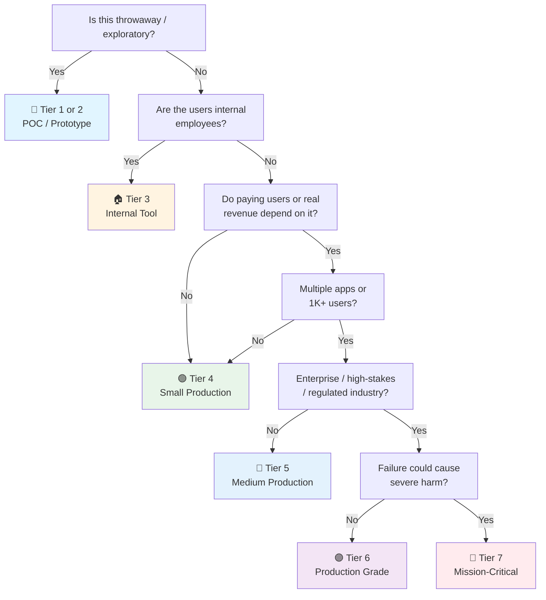

# Svelte Checklist (Library Layer)

> Svelte 5 the UI library — runes, components, stores, client data fetching, forms, testing, a11y. Framework-agnostic to the meta-framework.
> Meta-framework layer: [[sveltekit]] (SvelteKit) · General companion: [[web]] · Launch gate: [[Frontend Launch]]
> Last updated: 2026-09-14 (split from fused svelte.md — library concerns in [[svelte]], SvelteKit concerns here)

---

## 1. Project Setup

- [ ] **Scaffold choice** — SvelteKit (`npx sv create`) for anything public/SEO/full-stack → [[sveltekit]]. Vite SPA (`npm create vite@latest -- --template svelte-ts`) for embeddable widgets and pure internal SPAs with no SEO needs.
- [ ] **TypeScript** — `lang="ts"` in `<script>` blocks. `svelte.config.js`: `vitePlugin: { inspector: true }` for devtools.
- [ ] **pnpm** — fast, strict. Lockfile committed.
- [ ] **ESLint + Prettier** — `@sveltejs/eslint-config`. `svelte-check` for type checking `.svelte` files.
- [ ] **Svelte 5 runes mode** — `compilerOptions: { runes: true }` in config. Runes are the new reactivity model. No `$:`, no `$store`, use `$state`, `$derived`, `$effect`.

## 2. Architecture & Code Organization

- [ ] **Feature-based folders** — `src/lib/features/users/`, `src/lib/features/orders/` with components, stores, api, and Zod schemas co-located per feature. App shell / routes stay thin — routes compose feature modules, no business logic in components.
- [ ] **Alias discipline** — `$lib` → `src/lib` in SvelteKit (→ [[sveltekit]] §1); `@/` path alias in plain Vite. Shared code in `shared/`, features in `features/`. No deep relative imports (`../../../`) crossing feature boundaries.
- [ ] **Module boundaries enforced in CI** — `eslint-plugin-boundaries` or `dependency-cruiser`: `shared` → `features` → app shell. Nothing imports upward or sideways across features except through the feature's public export.
- [ ] **Dependency rule points inward** — Pure TS domain modules (logic, types, Zod schemas) never import Svelte or SvelteKit. Components import from logic, never the reverse.
- [ ] **Limited barrel files** — One `index.ts` per feature public boundary at most. Deep-import within a feature. Barrels hurt tree-shaking and slow down Vite HMR.
- [ ] **Shared code promoted on third use** — Don't abstract on first or second use. `shared/` holds API client, generated types, schemas, design tokens, utils — not speculative "common" components.
- [ ] **Tests co-located** — `user-card.test.ts` next to `UserCard.svelte`. Vitest + `@testing-library/svelte` pick them up by convention.
- [ ] **API types generated, not hand-written** — `openapi-typescript` / orval from the backend's OpenAPI spec. In SvelteKit also use generated `./$types` for load data → [[sveltekit]] §4.

## 3. Runes (Svelte 5 Reactivity)

- [ ] **`$state()`** — reactive variable. `let count = $state(0)`. Any reassignment triggers reactivity. Works in `.svelte`, `.svelte.ts`, `.svelte.js`.
- [ ] **`$derived()`** — computed value. `let double = $derived(count * 2)`. Auto-tracks deps. Lazy — only recomputed when read.
- [ ] **`$effect()`** — side effects. `$effect(() => console.log(count))`. Runs after DOM updates. Auto-cleanup on destroy. `$effect.pre` for pre-DOM effects.
- [ ] **`$props()`** — component props. `let { name, count = 0 } = $props()`. Replaces `export let`. Default values, rest props (`...rest`).
- [ ] **`$bindable()`** — two-way binding prop. `let { value = $bindable(0) } = $props()`. Parent can `<Component bind:value={myVal} />`.
- [ ] **`$inspect()`** — debug reactive values. `$inspect(count)`. Logs whenever value changes. Stripped in production builds.
- [ ] **`$state.snapshot()`** — plain object copy of reactive state. For serialization, logging, non-reactive consumers.

## 4. Stores & State Management

- [ ] **Runes for local state** — `$state()` in components, `$state()` in `.svelte.ts` modules. No store library needed for most cases.
- [ ] **Shared state** — export `$state` from `.svelte.ts` files. Import anywhere. Truly reactive cross-component state without stores or context APIs.
- [ ] **Svelte stores (legacy)** — `writable`, `readable`, `derived`. Still work but runes are the future. `$store` auto-subscribe syntax still valid.
- [ ] **URL state** — SvelteKit `$page.url.searchParams` (→ [[sveltekit]]) or router search params in a SPA. Shareable URLs, back button works. No library needed.
- [ ] **No duplicated server state** — Client state never caches what TanStack Query already owns (§6). Form state stays in the form library (§10), never in a global store.

## 5. Components

- [ ] **Template syntax** — `{#if}`, `{#each items as item (item.id)}`, `{#await promise}`, `{#snippet name()}...{/snippet}`. No JSX — HTML-first. `{#each}` always has a key.
- [ ] **Snippets replace slots** — `{@render children()}` renders snippets or components. Replaces `<slot>` (Svelte 4). Compose UI by passing snippets as props.
- [ ] **Event handlers** — `onclick={handler}` (lowercase). Modifiers: `onclick|preventDefault={handler}`, `onclick|once={handler}`. Callback props for component events.
- [ ] **Props are explicit contracts** — Typed `$props()`, no prop drilling past 2 levels (compose with snippets or shared `.svelte.ts` state). No boolean-prop explosion.
- [ ] **`bind:` directive** — `bind:value={name}` for inputs. `bind:this={element}` for DOM refs. `bind:open={isOpen}` on `<dialog>`. Two-way binding across components via `$bindable()` (§3).
- [ ] **Never define components inside components** — Remounts on every render, loses state, kills performance.

## 6. Data Fetching (Client-Side)

- [ ] **TanStack Query (Svelte)** — for server state. `createQuery`, `createMutation`. Caching, refetch, optimistic updates. The standard for client-fetched data in SPAs and for interactive refetch in SvelteKit apps.
- [ ] **Query key conventions** — `['users', userId, 'posts']`. Hierarchical, granular, cache-friendly.
- [ ] **Stale time & gc time** — tune per query type: short for real-time, long for stable data. Default staleTime 0 is too aggressive.
- [ ] **Optimistic updates** — `onMutate`: cancel queries → snapshot → set optimistic data. `onError`: restore. UI responds instantly, rolls back on error.
- [ ] **No waterfalls** — Independent fetches with `Promise.all`, never sequential awaits.
- [ ] **Every async operation has four states** — loading, empty, error, loaded. `{#await promise}` renders fallbacks; no blank screens.
- [ ] **In SvelteKit, initial page data is `load`'s job** — File routing, universal vs server loads, streaming, `$page.data` invalidation → [[sveltekit]] §4. Client fetching covers post-navigation interactions.

## 7. Real-Time Client-Side Patterns

- [ ] **SSE vs WebSocket** — SSE for one-way server→client streams (notifications, activity feeds, LLM tokens). WebSocket only for bidirectional (chat, collaboration, presence). Default to SSE — simpler, works over HTTP/2, `EventSource` auto-reconnects natively. Server-side implementation → [[sveltekit]] §5 or your backend.
- [ ] **Events write into the server-state cache** — On message: update the TanStack Query Svelte cache (`queryClient.setQueryData` / `invalidateQueries`). In SvelteKit, `invalidateAll()` refreshes `$page.data` → [[sveltekit]] §4. Never a parallel store copy of live data — one source of truth.
- [ ] **Runes for ephemeral socket UI state** — Svelte 5 `$state()` for connection status, unread counts, typing indicators; `$derived()` for computed views of the stream; `$effect()` for subscribe/unsubscribe side effects.
- [ ] **Subscribe/unsubscribe like `useSyncExternalStore`** — Wire external stores/sockets through `$effect` subscriptions (or a store's returned unsubscribe), never ad-hoc listener + state hacks. Deeply reactive stores are Svelte's equivalent of external-store subscriptions.
- [ ] **Reconnection with backoff + resume** — Exponential backoff with jitter. `Last-Event-ID` (SSE) or resume token (WS) so a reconnect doesn't duplicate or drop messages. Browser `EventSource` auto-reconnects; custom WS clients don't.
- [ ] **Ordering & dedup** — Sequence numbers on server events, client dedupes by event ID. Chatty streams: batch/throttle UI updates (backpressure).
- [ ] **Optimistic + server-authoritative** — Optimistic UI for the user's own actions, reconciled on server ack. Server wins on conflict.
- [ ] **Auth over the channel** — Cookie-authenticated SSE/WS; the SvelteKit `handle()` hook is the natural auth point → [[sveltekit]] §6. Never a token in the query string (leaks into logs).
- [ ] **Cleanup** — Close the socket in `onDestroy` (or the `onMount` return function), remove listeners, call `AbortController.abort()`. No zombie connections after route changes.

## 8. Performance

- [ ] **No virtual DOM** — Svelte compiles to direct DOM manipulation. This is the default. No extra configuration needed.
- [ ] **Build-time optimization** — dead code elimination at compile time. Unused CSS purged. Reactive declarations optimized to minimal DOM updates. All automatic — no plugins required.
- [ ] **Code splitting** — `import()` for component-level splitting of heavy below-the-fold components (charts, editors, media players). Route-level splitting is the meta-framework's job → [[sveltekit]] §8.
- [ ] **`{#key}`** — force re-render when expression changes. `{#key item.id}<ExpensiveComponent />{/key}`.
- [ ] **Image optimization** — `@sveltejs/enhanced-img`. `<enhanced:img src="./pic.jpg" alt="..." />`. Auto resizes, generates srcset, lazy-loads.
- [ ] **LCP < 2.5s** — Svelte's compile-time approach typically produces smaller bundles than React/Vue frameworks by default. Verify with Lighthouse. INP < 200ms, CLS < 0.1.
- [ ] **Bundle analysis** — `rollup-plugin-visualizer` on `vite build`. Budgets in CI (initial JS small — keep Svelte's advantage). Catch accidentally-large deps and duplicated libraries.

## 9. Styling

- [ ] **Scoped by default** — `<style>` in `.svelte` files is component-scoped. Zero config. `:global()` for escaping.
- [ ] **Tailwind CSS** — works natively. `@tailwind base/components/utilities` in `app.css`. Or UnoCSS (lighter, tree-shakable).
- [ ] **Component library** — Melt UI (headless, accessible primitives) + shadcn-svelte (styled). Or Skeleton UI (Tailwind-native). Don't build from scratch.
- [ ] **Dark mode** — `tailwind.config`: `darkMode: 'class'`. Toggle `dark` class on `<html>`. Or use SvelteKit's `handle` hook to read `prefers-color-scheme` → [[sveltekit]] §6.
- [ ] **Design tokens** — CSS custom properties for colors, spacing, radius. Tested on both themes.

## 10. Forms

- [ ] **Zod validation** — Schema on the form, not ad-hoc. `z.object({ email: z.string().email() })`. Reuse schemas with backend if shared package.
- [ ] **Felte** — client-side form library for SPAs: validation, touched/dirty tracking, works with Zod (`@felte/validator-zod`). The plain-Svelte counterpart of React Hook Form.
- [ ] **Superforms** — `sveltekit-superforms` + `zod` in SvelteKit apps. Client: `const { form, enhance, errors } = superForm(data.form)`. Field-level errors built-in. Server actions + `use:enhance` underneath → [[sveltekit]] §3.
- [ ] **Form states** — Superforms provides `$submitting`, `$errors`, `$message`, `$tainted`; Felte tracks `isSubmitting`, `errors`, `touched`. Every state is tracked and accessible in template.
- [ ] **Progressive enhancement** — in SvelteKit, forms work without JavaScript; `use:enhance` adds AJAX + validation on top. In a pure SPA, disable submit while pending and handle errors inline.
- [ ] **Server-side validation too** — Client validation is UX, server validation is security. Always re-validate server-side (where that happens: [[sveltekit]] §5 or your API).

## 11. Testing

- [ ] **Vitest** — fast, Vite-native, works with Svelte. `@sveltejs/vite-plugin-svelte`.
- [ ] **`@testing-library/svelte`** — `render(Component, { props })`. `screen.getByRole()`, `screen.getByText()`. Test behavior, not structure.
- [ ] **MSW (Mock Service Worker)** — Intercept at network level. Components test against realistic API responses. Works with REST and GraphQL.
- [ ] **Playwright** — E2E for critical flows: login → navigate → create → edit → delete. First-class SvelteKit support. Visual regression with `toHaveScreenshot()`.
- [ ] **`svelte-check`** — type-check `.svelte` files. Runs in CI. `svelte-check --tsconfig ./tsconfig.json`.
- [ ] **Accessibility tests** — `vitest-axe` / `axe-playwright` in CI. Catch violations before review.

## 12. Accessibility

- [ ] **Semantic HTML** — `{#if}`/`{#each}` encourage native HTML structures. `<button>` for actions, `<a>` for navigation.
- [ ] **`svelte:a11y` compiler warnings treated as errors** — the compiler warns about missing `alt`, unlabeled inputs, positive tabindex, missing `lang`. Fix all warnings — they're free a11y audits. Escalate `a11y-*` warnings to errors in CI (eslint/`svelte-check` threshold), never suppress wholesale.
- [ ] **Heading hierarchy** — One `<h1>`, logical `<h2>` → `<h3>` nesting.
- [ ] **Color contrast** — WCAG AA minimum (4.5:1 normal text, 3:1 large text).
- [ ] **Focus management** — `bind:this={element}` + `element.focus()` after conditional renders. Visible `:focus-visible` rings.
- [ ] **Screen reader testing** — Spot-check with VoiceOver (macOS) or NVDA (Windows). Navigate by headings, links, form controls.

## 13. Security (Frontend)

- [ ] **No `{@html}` without DOMPurify** — `{@html DOMPurify.sanitize(userContent)}`. Never bare `{@html userInput}`. Same for LLM output (§16).
- [ ] **No secrets in client code** — Anything imported into client components ships to the browser. Public env prefixes (`VITE_*` / SvelteKit `PUBLIC_*`) are client-visible by design. Env handling → [[sveltekit]] §1.
- [ ] **Never `eval`, never `new Function`** in client code. CSP should block anyway.
- [ ] **Auth token storage** — HTTP-only cookies for auth tokens (not accessible to JS). If forced to use localStorage: accept the XSS risk and keep token lifetime short.
- [ ] **CSP** — Strict Content Security Policy, report-only first. Svelte's compiled output works well with strict CSPs → [[sveltekit]] §9.
- [ ] **Dependency audit** — `pnpm audit` in CI — zero critical/high CVEs. Dependabot/Renovate for automated patches.

## 14. Build & Deploy (SPA / Vite path)

- [ ] **Production build tested locally** — `vite build && vite preview` before shipping.
- [ ] **SPA fallback routing** — Server/CDN configured to serve `index.html` for all routes (else deep links 404).
- [ ] **Static hosting with content-hash** — Vite fingerprints assets automatically. Immutable cache headers; `index.html` never cached.
- [ ] **Environment variables** — Only `VITE_*` reach the client; documented which are required/optional. No secret ever prefixed.
- [ ] **CI/CD** — Lint → `svelte-check` → unit test → build → deploy preview → E2E → promote. Preview URL per PR.
- [ ] **With SvelteKit, build/deploy is the framework's job** — adapters, prerendering, node vs static output → [[sveltekit]] §10.

## 15. Error Handling

- [ ] **ErrorBoundary components** — Svelte 5 `<svelte:boundary onerror={...}>` wrapping the app + per-feature boundaries. Fallback snippet with retry, not white screen.
- [ ] **Sentry (client)** — `@sentry/svelte` with source maps uploaded (not public). Breadcrumbs + user context. Correlate with backend traces.
- [ ] **RUM (Real User Monitoring)** — Core Web Vitals from real users, not just synthetic Lighthouse.
- [ ] **Feature flags** — Kill broken features without redeploy. In place before risky changes ship.
- [ ] **`handleError` in SvelteKit** — server-side error logging/scrubbing → [[sveltekit]] §6.

## 16. AI/LLM Integration (Client)

- [ ] **Vercel AI SDK Svelte** — `@ai-sdk/svelte` `useChat` for chat UIs. Streaming server route → [[sveltekit]] §11.
- [ ] **Rune-based AI state** — `$state()` for messages and streaming status, `$derived()` for computed UI state, `$effect()` for scroll-to-bottom side effects. `$state.snapshot()` for persistence.
- [ ] **Streaming UX** — `useChat` parses the server stream. Typing indicator, partial markdown, stop button, regenerate + edit messages.
- [ ] **Markdown rendering** — `marked` or `mdsvex` + DOMPurify. Never bare `{@html}` on model output — always `{@html DOMPurify.sanitize(content)}`.
- [ ] **Non-chat AI calls** — TanStack Query Svelte `createMutation` for classify/extract/summarize. Cache identical prompts (response dedup).
- [ ] **Graceful degradation** — Error state with retry, cached fallback, "AI can be wrong" disclaimers where user-facing. Rate-limit UX on 429.

## 17. Data Privacy & Compliance (Frontend-Specific)

- [ ] **Error monitoring scrubbing** — Sentry `beforeSend` strips PII (emails, tokens, form values) from error payloads.
- [ ] **Cookie consent** — GDPR/CCPA banner before analytics fire. Load Plausible/Umami/PostHog only after opt-in.
- [ ] **PII minimization** — Don't store user data in localStorage/IndexedDB unnecessarily. Mask sensitive data in UI previews.
- [ ] **Third-party script inventory** — Audit public env vars + `app.html` (or `index.html`): what loads, what it collects, where it's sent (EU/US). Remove dead scripts.
- [ ] **Data retention UI** — "Delete my data" / "Export my data" flows calling backend erasure/export endpoints via form actions or `fetch`.
- [ ] **Privacy policy & terms** — Up-to-date, linked in footer. Cover collection, retention, rights (access/erasure/portability).
- [ ] **Do Not Track / GPC** — Respect `navigator.doNotTrack` and Global Privacy Control where feasible.

---

## Quick Sanity Check

- [ ] `svelte-check` passes — zero type errors in `.svelte` files
- [ ] `vite build` succeeds — zero build errors
- [ ] No Svelte compiler warnings in console (`a11y-*`, `css-unused-selector`)
- [ ] Lighthouse ≥ 90 on mobile
- [ ] `{#each}` always has a `key` — `{#each items as item (item.id)}`
- [ ] All `` have `alt`, all inputs have labels
- [ ] Error boundary renders, not a white screen
- [ ] No secrets in client bundle (check with bundle analyzer)
- [ ] SvelteKit items → [[sveltekit]] Quick Sanity Check

---

## Project Tier Scoping Matrix

> **How to use this table:** Pick your tier first, then focus only on the sections marked ✅ (required) or 🟡 (recommended). Skip ❌ sections entirely — they'd be over-engineering for your context.
>
> **Legend:** ✅ Required · 🟡 Recommended / partial · ❌ Skip

### Tier Descriptions

| # | Tier | Description | Typical Team | Users | Lifespan |
|---|---|---|---|---|---|
| 1 | 🧪 **POC / Spike** | Validate an idea. Throwaway code. `console.log` is fine. | 1 dev | Internal only | Days–weeks |
| 2 | 🔧 **Prototype / MVP** | Waiting for integration or user validation. Might become real. | 1–2 devs | Beta testers | Weeks–months |
| 3 | 🏠 **Internal Tool** | Real users (employees), real traffic. No external exposure or paying customers. | 1–3 devs | Employees | Ongoing |
| 4 | 🟢 **Small Production** | Single app, few pages, low traffic. Real users, maybe early revenue. | 1–2 devs | < 1K users | Ongoing |
| 5 | 🔵 **Medium Production** | Multiple apps or higher traffic. Real revenue or user base that matters. | 2–5 devs | 1K–100K users | Ongoing |
| 6 | 🟣 **Production Grade** | Full rigor — high-stakes SaaS, enterprise product, or large user base. | 5+ devs | 100K+ users | Long-term |
| 7 | 🔴 **Mission-Critical / Regulated** | Healthcare (HIPAA), finance (PCI-DSS), safety systems. Failure = severe harm. Adds formal verification, regulatory audit. | 10+ devs | Varies | Decades |

### Which Tier Am I?

### Checklist Applicability by Tier

| # | Section | 🧪 POC | 🔧 Prototype | 🏠 Internal | 🟢 Small Prod | 🔵 Medium Prod | 🟣 Production Grade | 🔴 Mission-Critical |
|---|---|:---:|:---:|:---:|:---:|:---:|:---:|:---:|
| 1 | Project Setup | 🟡 | ✅ | ✅ | ✅ | ✅ | ✅ | ✅ |
| 2 | Architecture & Code Organization | 🟡 | 🟡 | ✅ | ✅ | ✅ + boundaries | ✅ + enforced CI | ✅ + formal review |
| 3 | Runes (Svelte 5 Reactivity) | 🟡 | ✅ | ✅ | ✅ | ✅ | ✅ | ✅ |
| 4 | Stores & State Management | 🟡 | 🟡 | ✅ | ✅ | ✅ | ✅ | ✅ |
| 5 | Components | 🟡 | ✅ | ✅ | ✅ | ✅ | ✅ | ✅ |
| 6 | Data Fetching (Client-Side) | 🟡 fetch basics | 🟡 | ✅ | ✅ | ✅ | ✅ | ✅ |
| 7 | Real-Time Client-Side Patterns | ❌ | 🟡 if used | 🟡 if used | ✅ if used | ✅ + scale | ✅ + load testing | ✅ + HA/failover |
| 8 | Performance | ❌ | 🟡 basic CWV | ✅ | ✅ + budgets | ✅ + profiling | ✅ + SLO | ✅ + capacity |
| 9 | Styling | 🟡 | ✅ | ✅ | ✅ | ✅ | ✅ | ✅ + design system |
| 10 | Forms | 🟡 | ✅ | ✅ | ✅ | ✅ | ✅ | ✅ + audit trail |
| 11 | Testing | ❌ maybe smoke | 🟡 unit | ✅ + component | ✅ + E2E | ✅ + visual reg | ✅ + a11y in CI | ✅ + formal verification |
| 12 | Accessibility | ❌ | 🟡 basics | ✅ | ✅ WCAG AA | ✅ + audits | ✅ + WCAG AA certified | ✅ + legal/regulatory |
| 13 | Security (Frontend) | 🟡 no secrets | 🟡 essentials | ✅ | ✅ + CSP | ✅ + pentest | ✅ + hardened | ✅ + formal audit |
| 14 | Build & Deploy (SPA) | ❌ | 🟡 basic build | ✅ + CI | ✅ + previews | ✅ + canary + flags | ✅ + full pipeline | ✅ + signed artifacts |
| 15 | Error Handling | ❌ | 🟡 error boundary | ✅ + Sentry | ✅ + RUM | ✅ + dashboards | ✅ + SLO/alerting | ✅ + full stack |
| 16 | AI/LLM Integration (Client) | 🟡 if AI is the POC | 🟡 | 🟡 if used | ✅ if used | ✅ | ✅ + guardrails | ✅ + audit trail |
| 17 | Data Privacy & Compliance | ❌ | ❌ | 🟡 minimal | ✅ consent + PII | ✅ + DPA | ✅ full compliance | ✅ + regulatory framework |

---

## Sources

- General companion: [[web]] · Meta-framework layer: [[sveltekit]] · Launch gate: [[Frontend Launch]]
- Split 2026-09-14 from fused `svelte.md`: library concerns here, SvelteKit concerns in [[sveltekit]].
- Svelte 5 Docs — https://svelte.dev/
