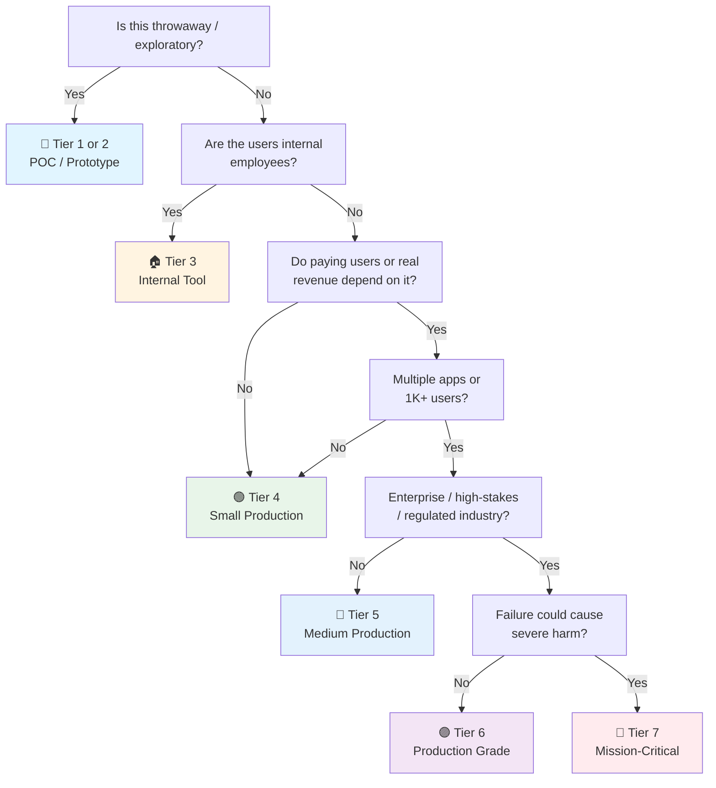

# Svelte Launch Checklist

> Tick every box before a Svelte 5 app hits production. Framework companion to [[Frontend Launch]]. Svelte 5 introduced runes — reactive state without `$:` or stores.
> Last updated: 2026-09-14 (added Architecture & Code Organization, Real-Time & Live Data, SEO & Metadata — cascade from [[web]])

---

## 1. Project Setup

- [ ] **SvelteKit** — `npx sv create`. SvelteKit is to Svelte what Next.js is to React. Use it for everything except embeddable widgets.
- [ ] **TypeScript** — `lang="ts"` in `` in the head. `Organization`, `Product`, `Article`, `BreadcrumbList` where applicable. Validate with Google Rich Results Test.
- [ ] **`robots.txt` + XML sitemap** — Static files, adapter-generated output (`@sveltejs/adapter-static`), or `svelte-sitemap` at build time. Sitemap with `lastmod`, referenced in robots.txt.
- [ ] **hreflang for multi-locale** — Correct language/region pairs, self-referencing entries, `x-default` — built with `$app/paths` when i18n exists.
- [ ] **Indexability control** — `noindex` on authenticated, duplicate, parameterized, and staging pages. Staging behind auth + `X-Robots-Tag: noindex` set in `hooks.server.ts`.
- [ ] **Search Console + Bing Webmaster** — Registered, sitemap submitted, crawl errors and 404s monitored after launch.
- [ ] **Core Web Vitals are SEO** — LCP/INP/CLS are ranking inputs. Svelte ships less JS than most frameworks by default — keep it that way. Lighthouse SEO audit in CI.

---

## 13. Testing

- [ ] **Vitest** — fast, Vite-native, works with Svelte. `@sveltejs/vite-plugin-svelte`.
- [ ] **`@testing-library/svelte`** — `render(Component, { props })`. `screen.getByRole()`, `screen.getByText()`. Test behavior, not structure.
- [ ] **Playwright** — E2E. SvelteKit has first-class support. `page.goto('/login')`, `page.fill()`, `page.click()`.
- [ ] **`svelte-check`** — type-check `.svelte` files. Runs in CI. `svelte-check --tsconfig ./tsconfig.json`.

---

## 14. Accessibility

- [ ] Semantic HTML — `{#if}`/`{#each}` encourage native HTML structures. `<button>` for actions, `<a>` for navigation.
- [ ] Svelte accessibility warnings — compiler warns about missing `alt`, unlabeled inputs, positive tabindex, missing `lang`. Fix all warnings — they're free a11y audits.
- [ ] Focus management — `bind:this={element}` + `element.focus()` after conditional renders.

---

## 15. Security

- [ ] No `{@html}` without DOMPurify — `{@html DOMPurify.sanitize(userContent)}`.
- [ ] No secrets in `$env/static/public` — these are inlined at build time. `$env/static/private` for server-only.
- [ ] CSP — SvelteKit outputs static HTML + minimal JS. Works well with strict CSPs (no `unsafe-inline` needed once `enhanced:img` generates proper `srcset` without inline styles).

---

## 16. SvelteKit Adapters

- [ ] **Adapter choice** — `adapter-auto` (detects environment). `adapter-node` (self-hosted Node). `adapter-vercel`, `adapter-cloudflare`, `adapter-netlify` (serverless edge). `adapter-static` (SPA or fully static).
- [ ] **Edge deployment** — `adapter-cloudflare-workers` or `adapter-vercel`. SvelteKit is edge-ready. SSR at the edge with minimal cold start.

## 17. AI/LLM Integration

- [ ] **Vercel AI SDK Svelte** — `@ai-sdk/svelte` `useChat` for chat UIs. SvelteKit `+server.ts` route streams with `streamText` + `toDataStreamResponse()`.
- [ ] **Never expose provider keys** — `$env/static/public` ships to the browser. LLM keys live in `$env/static/private` / `$env/dynamic/private` only, accessed in `+server.ts` or `+page.server.ts`.
- [ ] **Rune-based AI state** — `$state()` for messages and streaming status, `$derived()` for computed UI state, `$effect()` for scroll-to-bottom side effects. `$state.snapshot()` for persistence.
- [ ] **Streaming UX** — SSE from server route, `useChat` parses the stream. Typing indicator, partial markdown, stop button, regenerate + edit messages.
- [ ] **Markdown rendering** — `marked` or `mdsvex` + DOMPurify. Never bare `{@html}` on model output — always `{@html DOMPurify.sanitize(content)}`.
- [ ] **Non-chat AI calls** — TanStack Query Svelte `createMutation` for classify/extract/summarize. Cache identical prompts (response dedup).
- [ ] **Graceful degradation** — Error state with retry, cached fallback, "AI can be wrong" disclaimers where user-facing. Rate-limit UX on 429.

## 18. Data Privacy & Compliance (Frontend-Specific)

- [ ] **Error monitoring scrubbing** — Sentry `beforeSend` strips PII (emails, tokens, form values) from error payloads.
- [ ] **Cookie consent** — GDPR/CCPA banner before analytics fire. Load Plausible/Umami/PostHog only after opt-in.
- [ ] **PII minimization** — Don't store user data in localStorage/IndexedDB unnecessarily. Mask sensitive data in UI previews.
- [ ] **Third-party script inventory** — `$env/dynamic/public` + `app.html` audit: what loads, what it collects, where it's sent (EU/US). Remove dead scripts.
- [ ] **Data retention UI** — "Delete my data" / "Export my data" flows calling backend erasure/export endpoints via form actions or `fetch`.
- [ ] **Privacy policy & terms** — Up-to-date, linked in footer. Cover collection, retention, rights (access/erasure/portability).
- [ ] **Do Not Track / GPC** — Respect `navigator.doNotTrack` and Global Privacy Control where feasible.

---

## Quick Sanity Check

- [ ] `svelte-check` passes — zero type errors in `.svelte` files
- [ ] `vite build` succeeds — zero build errors
- [ ] No Svelte compiler warnings in console (`a11y-*`, `css-unused-selector`)
- [ ] Lighthouse ≥ 90 on mobile
- [ ] Forms work without JavaScript (try disabling JS in DevTools)
- [ ] Back button works (no redirect loops)
- [ ] `{#each}` always has a `key` — `{#each items as item (item.id)}`
- [ ] All `` have `alt`, all inputs have labels
- [ ] `+layout.svelte` provides consistent chrome without re-renders — SvelteKit preserves layout state across navigations by default
- [ ] Private env vars in `$env/static/private` — never leaked through `$env/static/public` or `$env/dynamic/public`

---

## Project Tier Scoping Matrix

> **How to use this table:** Pick your tier first, then focus only on the sections marked ✅ (required) or 🟡 (recommended). Skip ❌ sections entirely — they'd be over-engineering for your context.
>
> **Legend:** ✅ Required · 🟡 Recommended / partial · ❌ Skip

### Tier Descriptions

| # | Tier | Description | Typical Team | Users | Lifespan |
|---|---|---|---|---|---|
| 1 | 🧪 **POC / Spike** | Validate an idea. Throwaway code. `console.log` is fine. | 1 dev | Internal only | Days–weeks |
| 2 | 🔧 **Prototype / MVP** | Waiting for integration or user validation. Might become real. | 1–2 devs | Beta testers | Weeks–months |
| 3 | 🏠 **Internal Tool** | Real users (employees), real traffic. No external exposure or paying customers. | 1–3 devs | Employees | Ongoing |
| 4 | 🟢 **Small Production** | Single app, few pages, low traffic. Real users, maybe early revenue. | 1–2 devs | < 1K users | Ongoing |
| 5 | 🔵 **Medium Production** | Multiple apps or higher traffic. Real revenue or user base that matters. | 2–5 devs | 1K–100K users | Ongoing |
| 6 | 🟣 **Production Grade** | Full rigor — high-stakes SaaS, enterprise product, or large user base. | 5+ devs | 100K+ users | Long-term |
| 7 | 🔴 **Mission-Critical / Regulated** | Healthcare (HIPAA), finance (PCI-DSS), safety systems. Failure = severe harm. Adds formal verification, regulatory audit. | 10+ devs | Varies | Decades |

### Which Tier Am I?

### Checklist Applicability by Tier

| # | Section | 🧪 POC | 🔧 Prototype | 🏠 Internal | 🟢 Small Prod | 🔵 Medium Prod | 🟣 Production Grade | 🔴 Mission-Critical |
|---|---|:---:|:---:|:---:|:---:|:---:|:---:|:---:|
| 1 | Project Setup | 🟡 | ✅ | ✅ | ✅ | ✅ | ✅ | ✅ |
| 2 | Architecture & Code Organization | 🟡 | 🟡 | ✅ | ✅ | ✅ + boundaries | ✅ + enforced CI | ✅ + formal review |
| 3 | Runes (Svelte 5 Reactivity) | 🟡 | ✅ | ✅ | ✅ | ✅ | ✅ | ✅ |
| 4 | State Management | 🟡 | 🟡 | ✅ | ✅ | ✅ | ✅ | ✅ |
| 5 | SvelteKit Routing & Data Loading | 🟡 | ✅ | ✅ | ✅ | ✅ | ✅ | ✅ |
| 6 | Real-Time & Live Data | ❌ | 🟡 if used | 🟡 if used | ✅ if used | ✅ + scale | ✅ + load testing | ✅ + HA/failover |
| 7 | Components | 🟡 | ✅ | ✅ | ✅ | ✅ | ✅ | ✅ |
| 8 | Styling | 🟡 | ✅ | ✅ | ✅ | ✅ | ✅ | ✅ + design system |
| 9 | Forms | 🟡 | ✅ | ✅ | ✅ | ✅ | ✅ | ✅ + audit trail |
| 10 | Performance | ❌ | 🟡 basic CWV | ✅ | ✅ + budgets | ✅ + profiling | ✅ + SLO | ✅ + capacity |
| 11 | Routing | 🟡 | ✅ | ✅ | ✅ | ✅ | ✅ | ✅ |
| 12 | SEO & Metadata | ❌ | 🟡 if public | 🟡 if public | ✅ if public | ✅ | ✅ + structured data | ✅ |
| 13 | Testing | ❌ maybe smoke | 🟡 unit | ✅ + component | ✅ + E2E | ✅ + visual reg | ✅ + a11y in CI | ✅ + formal verification |
| 14 | Accessibility | ❌ | 🟡 basics | ✅ | ✅ WCAG AA | ✅ + audits | ✅ + WCAG AA certified | ✅ + legal/regulatory |
| 15 | Security (Frontend) | 🟡 no secrets | 🟡 essentials | ✅ | ✅ + CSP | ✅ + pentest | ✅ + hardened | ✅ + formal audit |
| 16 | SvelteKit Adapters | ❌ | 🟡 adapter-auto | ✅ + node | ✅ + platform | ✅ + edge | ✅ + multi-region | ✅ + signed artifacts |
| 17 | AI/LLM Integration | 🟡 if AI is the POC | 🟡 | 🟡 if used | ✅ if used | ✅ | ✅ + guardrails | ✅ + audit trail |
| 18 | Data Privacy & Compliance | ❌ | ❌ | 🟡 minimal | ✅ consent + PII | ✅ + DPA | ✅ full compliance | ✅ + regulatory framework |

---

## Sources

- Svelte 5 Docs — https://svelte.dev/
- SvelteKit Docs — https://kit.svelte.dev/
- `[[Frontend Launch]]` — general frontend checklist (tick first)
