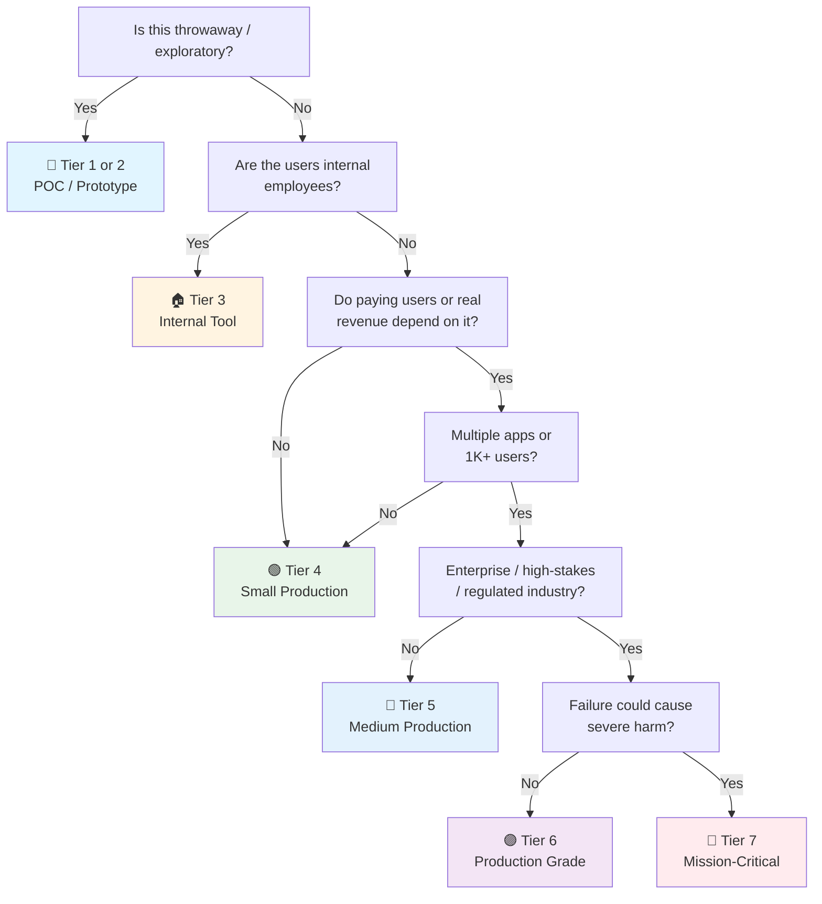

# Vue Launch Checklist

> Tick every box before a Vue 3 app hits production. For Nuxt-specific items, see the Nuxt section. Framework companion to [[Frontend Launch]].
> Last updated: 2026-09-14 (added Architecture & Code Organization, Real-Time & Live Data, SEO & Metadata — cascade from [[web]])

---

## 1. Project Setup

- [ ] **Vite + Vue 3.5+** — `create-vue` (official scaffold). Composition API + `<script setup>` by default.
- [ ] **TypeScript strict** — `tsconfig.json`: `strict: true`. `vue-tsc` for type checking `.vue` files (slower but safer).
- [ ] **pnpm** — strict, fast, disk-efficient. Lockfile committed.
- [ ] **ESLint + Prettier** or **Biome** — Biome is gaining. `@vue/eslint-config-typescript`. Pre-commit: `lint-staged`.
- [ ] **Vue DevTools** — browser extension + Vite plugin (`vite-plugin-vue-devtools`). Browser extension is legacy now.

---

## 2. Architecture & Code Organization

- [ ] **Feature-based folders** — Organize by domain (`src/features/users/`, `src/features/orders/`) with components, composables, api, and stores co-located per feature. Nuxt `pages/` stay thin — they compose feature components, they don't contain business logic. Type-based (`components/`, `composables/` split at root) dies at ~20 files.
- [ ] **Module boundaries enforced in CI** — `eslint-plugin-boundaries` or `dependency-cruiser`: `shared/` → `features/` → app-shell. Nothing imports upward or sideways across features except through a feature's public export.
- [ ] **Dependency rule points inward** — Domain logic, types, and Zod schemas don't import Vue, Nuxt, or UI details. Components and composables import from logic, never the reverse.
- [ ] **Limited barrel files** — One `index.ts` per feature public boundary at most. Deep-import within a feature. Barrels drag whole libraries into client bundles and kill tree-shaking.
- [ ] **Shared code promoted on third use** — Don't abstract on first or second use. `shared/` (or `packages/shared` in a monorepo) holds validated types, API client, Zod schemas, design tokens, utils — not speculative "common" components.
- [ ] **Nuxt layers & directory boundaries** — `composables/` = logic, `components/` = UI, `server/` = API; server code never imports from the app side. Nuxt layers (`extends`) share config/components/modules across apps without copy-paste.
- [ ] **Tests co-located** — `UserCard.test.ts` next to `UserCard.vue`. Vitest picks them up by convention.
- [ ] **API types generated, not hand-written** — `openapi-typescript` / orval from the backend's OpenAPI spec. Hand-maintained response types drift.
- [ ] **Nuxt auto-import caveats** — Auto-imports hide dependencies and break when code moves into shared packages or libraries. Explicit imports in `shared/` and anything extracted from the app. Auto-imports only scan certain directories (`composables/`, `utils/`, `components/`) — files nested deeper or elsewhere need manual imports.

---

## 3. Composition API & Script Setup

- [ ] **`<script setup lang="ts">`** — default. No `setup()` function boilerplate.
- [ ] **`ref` vs `reactive`** — `ref()` for primitives and single values. `reactive()` only for objects with known shape (rare — `ref` with object works fine).
- [ ] **`computed`** — derived state. Never mutate a computed. Use writable computed for v-model support.
- [ ] **`watch` vs `watchEffect`** — `watch` for explicit deps. `watchEffect` for auto-tracking. `watchEffect` runs immediately.
- [ ] **`defineProps`, `defineEmits`, `defineExpose`** — compiler macros. No imports needed. Type-safe: `defineProps<{ items: Item[] }>()`.
- [ ] **`provide`/`inject`** — for deeply nested component trees. Not a replacement for Pinia — use for component-level dependency injection.
- [ ] **`useTemplateRef` (Vue 3.5+)** — typed template refs. `const input = useTemplateRef<HTMLInputElement>('myInput')`. Replaces string refs.
- [ ] **No Options API mixing** — pick one style per component. Composition API is the future.

---

## 4. State Management

- [ ] **Pinia** — official state management. `defineStore('name', () => { ... })`. Setup stores (composition-style) over options stores.
- [ ] **TanStack Query (Vue Query)** — for all server state. `useQuery`, `useMutation`. Namespaced keys: `['users', userId]`.
- [ ] **URL as state** — `useRoute().query` + `useRouter().push`. Filters, pagination, search in URL params.
- [ ] **No Vuex** — deprecated. Pinia is the replacement.
- [ ] **Form state** — `vee-validate` + `zod`. `useForm({ validationSchema: toFormValidator(zodSchema) })`. Field-level error messages.

---

## 5. Real-Time & Live Data

- [ ] **SSE vs WebSocket** — SSE for one-way server→client streams (notifications, activity feeds, LLM tokens) — trivial in a Nitro server route. WebSocket (Socket.IO, Pusher, Ably) only for bidirectional (chat, collaboration, presence). Default to SSE — simpler, works over HTTP/2, auto-reconnects natively.
- [ ] **Events write into the server-state cache** — On message: TanStack Query Vue `queryClient.setQueryData(key, merge)` or `invalidateQueries(key)` — or in Nuxt, update `useState` / call `useAsyncData`'s `refresh()`. Never a parallel `ref()` copy of live data — one source of truth.
- [ ] **Reconnection with backoff + resume** — Exponential backoff with jitter. `Last-Event-ID` (SSE) or resume token (WS) so a reconnect doesn't duplicate or drop messages. Browser `EventSource` auto-reconnects; custom WS clients don't.
- [ ] **Ordering & dedup** — Sequence numbers on server events, client dedupes by event ID. Chatty streams: batch/throttle reactive UI updates (backpressure).
- [ ] **Optimistic + server-authoritative** — Optimistic UI for the user's own actions, reconciled on server ack. Server wins on conflict.
- [ ] **Auth over the channel** — Cookie-authenticated SSE/WS. Never a token in the query string (leaks into logs).
- [ ] **Cleanup in `onUnmounted` / `onScopeDispose`** — Close the socket, remove listeners, call `AbortController.abort()`. Composables register teardown with `onScopeDispose` so cleanup works in any effect scope, not just components. No zombie connections after route changes.
- [ ] **SSE via Nitro server routes** — `server/api/` with h3's `createEventStream` + `defineEventHandler`. Correct `text/event-stream` headers, no proxy buffering.
- [ ] **Scale awareness** — WS doesn't scale on serverless (Vercel/Netlify functions) — use SSE, Pusher/Ably, or a dedicated WS server. Per-connection server cost; pub/sub fan-out via Valkey/Redis; fallback to polling when proxies block WS.

---

## 6. Routing (Vue Router 4)

- [ ] **`createRouter` with `createWebHistory`** — HTML5 history mode. No hash unless legacy support needed.
- [ ] **Route meta** — `meta: { requiresAuth: true, title: 'Dashboard' }`. Navigation guards check `route.meta`.
- [ ] **`beforeEach` guard** — auth check, redirect to login. `router.beforeEach((to, from, next) => { ... })`.
- [ ] **Lazy-loaded routes** — `component: () => import('./views/Heavy.vue')`. Automatic code splitting.
- [ ] **Nested routes** — `children: [...]` with `<router-view>` in parent. Persistent layouts.
- [ ] **Scroll behavior** — `scrollBehavior(to, from, savedPosition)`. Restore scroll on back navigation.

---

## 7. SEO & Metadata

- [ ] **`useHead` / `useSeoMeta`** — Nuxt composables for per-page meta (SSR-safe, reactive). `@unhead/vue` for plain Vite SPAs. `<Title>`, `<Meta>`, `<Link>` components for declarative head in templates.
- [ ] **Crawlability first** — CSR-only content is invisible to some crawlers and to social unfurlers. SSR or prerender public, indexable pages (`nitro.prerender`, `routeRules` with `swr`/`isr`). Verify with "View source" (not DevTools) that content is in the initial HTML.
- [ ] **Metadata per route** — Unique `<title>` (50–60 chars), `<meta name="description">` (140–160), canonical URL. Generated from route/page data via `useSeoMeta`, never hard-coded strings.
- [ ] **Open Graph + Twitter cards** — `og:title`, `og:description`, `og:image` (1200×630), `twitter:card` — `useSeoMeta` covers most of it. Test unfurls in Slack/Discord/X validators before launch.
- [ ] **Structured data (JSON-LD)** — Inject via `useHead({ script: [{ type: 'application/ld+json', innerHTML: JSON.stringify(schema) }] }`. `Organization`, `Product`, `Article`, `BreadcrumbList`, `FAQPage` where applicable. Validate with Google Rich Results Test; only mark up content visible on the page.
- [ ] **`robots.txt` + XML sitemap** — `@nuxtjs/sitemap` module (auto-generated with `lastmod`); sitemap referenced in robots.txt. Segmented sitemaps for large sites (> 50K URLs per file).
- [ ] **hreflang for multi-locale** — With `@nuxtjs/i18n`: correct language/region pairs, self-referencing entries, `x-default`. Only when i18n exists.
- [ ] **Indexability control** — `noindex` on authenticated, duplicate, parameterized, and staging pages. Staging behind auth + `X-Robots-Tag: noindex` (never rely on robots.txt alone to hide content).
- [ ] **Search Console + Bing Webmaster** — Registered, sitemap submitted, crawl errors and 404s monitored after launch.
- [ ] **Core Web Vitals are SEO** — LCP/INP/CLS thresholds are ranking inputs. Lighthouse SEO audit in CI; metadata lint (unique titles, canonical present) for critical routes.

---

## 8. Styling

- [ ] **UnoCSS** or **Tailwind CSS** — UnoCSS is faster, smaller, Vue-native. Tailwind has larger ecosystem. Pick one.
- [ ] **`<style scoped>`** — component-scoped styles. No leakage. `:deep()` for child component styling.
- [ ] **CSS Modules** — `<style module>` for programmatic access. `$style.container`.
- [ ] **Component library** — PrimeVue (most complete), shadcn-vue (Radix port), or Naive UI (Tree-shakable, great TS). Don't build modals/dropdowns from scratch.
- [ ] **Dark mode** — `useDark()` from VueUse. Toggle `dark` class on `<html>`. Tailwind `dark:` prefix.

---

## 9. Performance

- [ ] **`<Suspense>`** — async component loading with fallback. Still experimental but stable in 3.5+.
- [ ] **`<KeepAlive>`** — cache component instances. Preserve form state across tab switches.
- [ ] **`v-memo`** — skip re-render when deps unchanged. For heavy lists: `
`.
- [ ] **`shallowRef` / `shallowReactive`** — only top-level reactivity. For large data structures where nested tracking isn't needed.
- [ ] **Virtual scrolling** — `@tanstack/vue-virtual` or `vue-virtual-scroller`. Lists > 100 items.
- [ ] **Image optimization** — `@nuxt/image` (Nuxt) or `vite-plugin-image-optimizer`. Lazy loading: `loading="lazy"`.
- [ ] **LCP < 2.5s** — `vite-plugin-vue-inspector` to find render bottlenecks.

---

## 10. Forms

- [ ] **vee-validate + zod** — `useForm({ validationSchema: toFormValidator(schema) })`. Field-level errors. `ErrorMessage` component or `errorMessage` from `useField`.
- [ ] **Server-side validation too** — Zod schema on both ends if possible. Client = UX, server = security.
- [ ] **Form states handled** — Idle, submitting (disable + spinner), success (redirect/toast), error (inline fields + form-level).

---

## 11. Composables (Reusable Logic)

- [ ] **`useFetch` / `useAsyncData`** — wrapped TanStack Query or custom composable with loading/error/data states.
- [ ] **VueUse** — `useStorage`, `useDark`, `useToggle`, `useDebounceFn`, `useThrottleFn`. Don't write your own.
- [ ] **Composable naming** — `use*` prefix. Auto-imported by `unplugin-auto-import`.

---

## 12. Testing

- [ ] **Vitest** — fast, Vite-native. `@vue/test-utils` for component mounting.
- [ ] **Component tests** — `mount(Component, { props, slots })`. `wrapper.find()`, `wrapper.emitted()`. Test behavior, not implementation.
- [ ] **MSW (Mock Service Worker)** — API mocking at network level. Components test against realistic responses.
- [ ] **Playwright** — E2E for critical flows. Also visual regression with `toHaveScreenshot()`.
- [ ] **`@vue/test-utils` best practices** — prefer `findByText`/`findByRole`. Avoid `findComponent` (couples tests to structure).

---

## 13. Accessibility

- [ ] Semantic HTML — `<button>` for actions, `<nav>` for nav. Vue templates are HTML-first — use it.
- [ ] `v-bind` for ARIA — `:aria-expanded="isOpen"`, `:aria-label="'Close ' + title"`.
- [ ] Focus management — `nextTick(() => ref.value?.focus())` after v-if reveals content.
- [ ] Heading hierarchy — one `<h1>`, nested `<h2>` → `<h3>`.
- [ ] Screen reader tested at least once — VoiceOver or NVDA.

---

## 14. Security

- [ ] No `v-html` without sanitization — use `DOMPurify.sanitize(userContent)`.
- [ ] No secrets in `VITE_*` env vars — these ship to the browser.
- [ ] Auth tokens in HTTP-only cookies, not localStorage.
- [ ] CSP configured → [[03 API Security]].

---

## 15. Nuxt 3 (SSR / Full-Stack)

- [ ] **Nuxt modules** — `@nuxt/image`, `@nuxt/fonts`, `@nuxt/scripts`, `nuxt-security`. Don't DIY.
- [ ] **`useFetch` / `useAsyncData`** — built-in. Auto-deduped, cached, SSR-safe. Replaces manual `fetch` + `useState`.
- [ ] **Server routes** — `server/api/` directory. `defineEventHandler`. Good for lightweight APIs, proxies, webhooks.
- [ ] **`nuxt.config.ts`** — `app.head` for global meta, `routeRules` for per-route caching/ISR, `nitro.prerender` for static.
- [ ] **Hybrid rendering** — `routeRules: { '/blog/**': { swr: 3600 }, '/admin/**': { ssr: false } }`. Per-route rendering strategy.
- [ ] **`useHead` composable** — per-page meta. `<Title>`, `<Meta>`, `<Link>`, `<Script>` components for declarative head.

## 16. AI/LLM Integration

- [ ] **Vercel AI SDK Vue** — `@ai-sdk/vue` `useChat` composable for chat UIs. Server route (`server/api/chat.ts` in Nuxt) streams with `streamText` + `toDataStreamResponse()`.
- [ ] **Never expose provider keys** — `VITE_*` / `NUXT_PUBLIC_*` ship to the browser. All LLM calls go through server routes or your backend. Keys live in server-only env (`NUXT_SECRET_*` / `.env` server-side).
- [ ] **Streaming UX** — SSE from server route, `useChat` parses the stream. Typing indicator, partial markdown, stop button, regenerate + edit messages.
- [ ] **Markdown rendering** — `markdown-it` or `marked` + DOMPurify sanitization. Never `v-html` raw model output.
- [ ] **AI state with Pinia** — chat history, pending status, and streamed messages in a Pinia store when multiple components share them. `$state`-style local refs for single-view chats.
- [ ] **Non-chat AI calls** — TanStack Query (Vue Query) mutations with loading/error states. Cache identical prompts (response dedup). Debounce expensive AI calls.
- [ ] **Graceful degradation** — Error state with retry, cached fallback, "AI can be wrong" disclaimers where user-facing. Rate-limit UX on 429.

## 17. Data Privacy & Compliance (Frontend-Specific)

- [ ] **Error monitoring scrubbing** — Sentry `beforeSend` strips PII (emails, tokens, form values) from error payloads.
- [ ] **Cookie consent** — GDPR/CCPA banner before analytics fire. Load Plausible/Umami/PostHog only after opt-in.
- [ ] **PII minimization** — Don't store user data in localStorage/IndexedDB unnecessarily. Mask sensitive data in UI previews.
- [ ] **Third-party script inventory** — `@nuxt/scripts` audit: what loads, what it collects, where it's sent (EU/US). Remove dead scripts.
- [ ] **Data retention UI** — "Delete my data" / "Export my data" flows calling backend erasure/export endpoints.
- [ ] **Privacy policy & terms** — Up-to-date, linked in footer. Cover collection, retention, rights (access/erasure/portability).
- [ ] **Do Not Track / GPC** — Respect `navigator.doNotTrack` and Global Privacy Control where feasible.

---

## Quick Sanity Check

- [ ] No console errors in production build
- [ ] `vite build` succeeds — no type errors, no warnings
- [ ] Lighthouse ≥ 90 on mobile
- [ ] Forms submit with Enter key
- [ ] Back button works (no redirect loops)
- [ ] Tested on actual mobile device
- [ ] All `` have `alt`, all `<a>` have `href` or `@click` with keyboard support
- [ ] No `v-if` on `<Transition>` root — use `v-show` or wrap in inner element

---

## Project Tier Scoping Matrix

> **How to use this table:** Pick your tier first, then focus only on the sections marked ✅ (required) or 🟡 (recommended). Skip ❌ sections entirely — they'd be over-engineering for your context.
>
> **Legend:** ✅ Required · 🟡 Recommended / partial · ❌ Skip

### Tier Descriptions

| # | Tier | Description | Typical Team | Users | Lifespan |
|---|---|---|---|---|---|
| 1 | 🧪 **POC / Spike** | Validate an idea. Throwaway code. `console.log` is fine. | 1 dev | Internal only | Days–weeks |
| 2 | 🔧 **Prototype / MVP** | Waiting for integration or user validation. Might become real. | 1–2 devs | Beta testers | Weeks–months |
| 3 | 🏠 **Internal Tool** | Real users (employees), real traffic. No external exposure or paying customers. | 1–3 devs | Employees | Ongoing |
| 4 | 🟢 **Small Production** | Single app, few pages, low traffic. Real users, maybe early revenue. | 1–2 devs | < 1K users | Ongoing |
| 5 | 🔵 **Medium Production** | Multiple apps or higher traffic. Real revenue or user base that matters. | 2–5 devs | 1K–100K users | Ongoing |
| 6 | 🟣 **Production Grade** | Full rigor — high-stakes SaaS, enterprise product, or large user base. | 5+ devs | 100K+ users | Long-term |
| 7 | 🔴 **Mission-Critical / Regulated** | Healthcare (HIPAA), finance (PCI-DSS), safety systems. Failure = severe harm. Adds formal verification, regulatory audit. | 10+ devs | Varies | Decades |

### Which Tier Am I?

### Checklist Applicability by Tier

| # | Section | 🧪 POC | 🔧 Prototype | 🏠 Internal | 🟢 Small Prod | 🔵 Medium Prod | 🟣 Production Grade | 🔴 Mission-Critical |
|---|---|:---:|:---:|:---:|:---:|:---:|:---:|:---:|
| 1 | Project Setup | 🟡 | ✅ | ✅ | ✅ | ✅ | ✅ | ✅ |
| 2 | Architecture & Code Organization | 🟡 | 🟡 | ✅ | ✅ | ✅ + boundaries | ✅ + enforced CI | ✅ + formal review |
| 3 | Composition API & Script Setup | 🟡 | ✅ | ✅ | ✅ | ✅ | ✅ | ✅ |
| 4 | State Management | 🟡 | 🟡 | ✅ | ✅ | ✅ | ✅ | ✅ |
| 5 | Real-Time & Live Data | ❌ | 🟡 if used | 🟡 if used | ✅ if used | ✅ + scale | ✅ + load testing | ✅ + HA/failover |
| 6 | Routing (Vue Router 4) | 🟡 | ✅ | ✅ | ✅ | ✅ | ✅ | ✅ |
| 7 | SEO & Metadata | ❌ | 🟡 if public | 🟡 if public | ✅ if public | ✅ | ✅ + structured data | ✅ |
| 8 | Styling | 🟡 | ✅ | ✅ | ✅ | ✅ | ✅ | ✅ + design system |
| 9 | Performance | ❌ | 🟡 basic CWV | ✅ | ✅ + budgets | ✅ + profiling | ✅ + SLO | ✅ + capacity |
| 10 | Forms | 🟡 | ✅ | ✅ | ✅ | ✅ | ✅ | ✅ + audit trail |
| 11 | Composables | ❌ | 🟡 | ✅ | ✅ | ✅ | ✅ | ✅ |
| 12 | Testing | ❌ maybe smoke | 🟡 unit | ✅ + component | ✅ + E2E | ✅ + visual reg | ✅ + a11y in CI | ✅ + formal verification |
| 13 | Accessibility | ❌ | 🟡 basics | ✅ | ✅ WCAG AA | ✅ + audits | ✅ + WCAG AA certified | ✅ + legal/regulatory |
| 14 | Security (Frontend) | 🟡 no secrets | 🟡 essentials | ✅ | ✅ + CSP | ✅ + pentest | ✅ + hardened | ✅ + formal audit |
| 15 | Nuxt 3 (SSR / Full-Stack) | ❌ SPA only | 🟡 | ✅ if SSR | ✅ | ✅ | ✅ | ✅ |
| 16 | AI/LLM Integration | 🟡 if AI is the POC | 🟡 | 🟡 if used | ✅ if used | ✅ | ✅ + guardrails | ✅ + audit trail |
| 17 | Data Privacy & Compliance | ❌ | ❌ | 🟡 minimal | ✅ consent + PII | ✅ + DPA | ✅ full compliance | ✅ + regulatory framework |

---

## Sources

- Vue 3 Docs — https://vuejs.org/
- `[[Frontend Launch]]` — general frontend checklist (tick first)
- Nuxt 3 Docs — https://nuxt.com/
