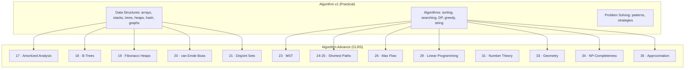

# Algorithm Advance — Advanced Topics (CLRS)

> **Source:** *Introduction to Algorithms* (CLRS) by Cormen, Leiserson, Rivest, Stein — 4th Edition
> Advanced topics that complement the practical Algorithm v1 notes.

## What Is This?

This vault extends [[Algorithm Overview|Algorithm v1]] with **advanced algorithm topics** from CLRS that the v1 notes don't cover. Where v1 focuses on practical implementations and interview patterns, Algorithm Advance covers the theory, proofs, and advanced structures that deepen understanding.

## Structure

### 01 Data Structures

| File | CLRS Ch | Topic | v1 Gap |
|---|---|---|---|
| [[17_Amortized_Analysis]] | Ch 17 | Aggregate, accounting, potential methods | ❌ Not in v1 |
| [[18_B-Trees]] | Ch 18 | Disk-based search trees, B⁺-trees | ❌ Not in v1 |
| [[19_Fibonacci_Heaps]] | Ch 19 | Lazy consolidation, O(1) DECREASE-KEY | ❌ Not in v1 |
| [[20_van_Emde_Boas_Trees]] | Ch 20 | O(lg lg u) integer priority queues | ❌ Not in v1 |
| [[21_Disjoint_Sets]] | Ch 21 | Union-Find, path compression, Ackermann | ❌ Not in v1 |

### 02 Algorithms

| File | CLRS Ch | Topic | v1 Gap |
|---|---|---|---|
| [[23_Minimum_Spanning_Trees]] | Ch 23 | Kruskal's, Prim's, cut property | 🟡 Partial |
| [[24_Single_Source_Shortest_Paths]] | Ch 24 | Bellman-Ford, Dijkstra's, DAG-SP | 🟡 Partial |
| [[25_All_Pairs_Shortest_Paths]] | Ch 25 | Floyd-Warshall, Johnson's | ❌ Not in v1 |
| [[26_Maximum_Flow]] | Ch 26 | Ford-Fulkerson, Edmonds-Karp, min-cut | ❌ Not in v1 |
| [[29_Linear_Programming]] | Ch 29 | Simplex, duality, LP modeling | ❌ Not in v1 |
| [[31_Number_Theory_and_Cryptography]] | Ch 31 | RSA, primality testing, CRT | 🟡 Partial |
| [[33_Computational_Geometry]] | Ch 33 | Cross products, convex hull, sweep line | ❌ Not in v1 |
| [[34_NP_Completeness]] | Ch 34 | P vs NP, reductions, NPC problems | ❌ Not in v1 |
| [[35_Approximation_Algorithms]] | Ch 35 | Vertex cover, TSP, set cover approx | ❌ Not in v1 |

## How v1 and v2 Relate

## When to Study What

| Your Goal | Start Here |
|---|---|
| **Interview prep** | v1 first — data structures, sorting, DP, greedy |
| **Deepen DS knowledge** | [[18_B-Trees]], [[19_Fibonacci_Heaps]], [[21_Disjoint_Sets]] |
| **Graph problems** | [[23_Minimum_Spanning_Trees]], [[24_Single_Source_Shortest_Paths]], [[26_Maximum_Flow]] |
| **Optimization** | [[29_Linear_Programming]] — resource allocation, scheduling |
| **Cryptography** | [[31_Number_Theory_and_Cryptography]] — RSA, modular arithmetic |
| **Theory/academia** | [[34_NP_Completeness]], [[35_Approximation_Algorithms]] |
| **Performance analysis** | [[17_Amortized_Analysis]] — understanding average-case bounds |

## Related

- [[Algorithm Overview]] — The practical foundation
- [[18_B-Trees]] → links back to v1's [[01 Trees & BSTs]]
- [[19_Fibonacci_Heaps]] → links back to v1's [[01 Heaps & Priority Queues]]
- [[21_Disjoint_Sets]] → links back to v1's [[01 Graphs]]
- [[23_Minimum_Spanning_Trees]] → links back to v1's [[02 Greedy Algorithms]]
- [[31_Number_Theory_and_Cryptography]] → links back to v1's [[02 Math Algorithms]]
