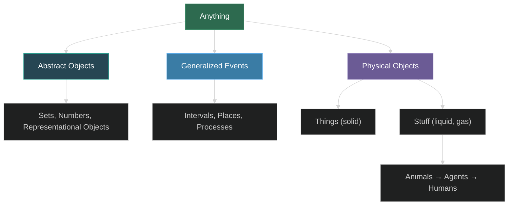

---
tags:
  - logic
  - reasoning
  - planning
  - knowledge-representation
  - artificial-intelligence
source: "Russell & Norvig, Artificial Intelligence: A Modern Approach, Ch 7-12"
---

# Logic and Reasoning

> Covers Russell & Norvig Chapters 7–12: from propositional logic through first-order logic, inference algorithms, classical planning, real-world planning, and knowledge representation.

---

## Chapter 7 — Logical Agents

### Knowledge-Based Agents

A **knowledge-based agent** operates with a **knowledge base (KB)** — a set of sentences expressed in a knowledge representation language. The agent uses two core operations:

- **TELL**: add new sentences to the KB
- **ASK**: query the KB; the answer must follow from what has been told

The agent follows a cycle: TELL percepts → ASK for action → TELL the chosen action. This separates the **knowledge level** (what the agent knows/goals) from the **implementation level**.

The **declarative approach** builds agents by TELLing knowledge; the **procedural approach** encodes behavior directly as code. Successful agents typically combine both.

### The Wumpus World

A 4×4 grid cave environment used as a testbed for logical agents:

- **Sensors**: Stench (near wumpus), Breeze (near pit), Glitter (gold), Bump (wall), Scream (wumpus killed)
- **Actions**: Forward, TurnLeft, TurnRight, Grab, Shoot, Climb
- **Characteristics**: partially observable, deterministic, static, single-agent, sequential

The agent must reason from percepts to deduce safe squares, wumpus/pit locations, etc. This illustrates the power of logical inference over purely reactive approaches.

### Propositional Logic — Syntax

**Atomic sentences**: single proposition symbols (e.g., P, Q, W₁,₃)

**Complex sentences** built from five connectives:

| Connective | Name | Meaning |
|---|---|---|
| ¬ | Negation | "not" |
| ∧ | Conjunction | "and" |
| ∨ | Disjunction | "or" |
| ⇒ | Implication | "if...then" |
| ⇔ | Biconditional | "if and only if" |

Operator precedence: ¬, ∧, ∨, ⇒, ⇔ (highest to lowest).

### Propositional Logic — Semantics

A **model** fixes the truth value of every proposition symbol. The semantics defines truth of complex sentences recursively:

- ¬P is true iff P is false
- P ∧ Q is true iff both are true
- P ∨ Q is true iff at least one is true
- P ⇒ Q is true unless P is true and Q is false
- P ⇔ Q is true iff both are the same

**Truth tables** enumerate all possible models.

### Entailment and Inference

- **Entailment** (α |= β): β is true in every model where α is true. Equivalently, M(α) ⊆ M(β).
- **Inference** (KB ⊢ᵢ α): algorithm i derives α from KB.
- **Soundness**: derives only entailed sentences.
- **Completeness**: derives all entailed sentences.

**Model checking** enumerates all possible models — sound and complete, but O(2ⁿ).

### Propositional Theorem Proving

Key concepts:
- **Logical equivalence** (α ≡ β): true in the same set of models
- **Validity**: true in all models (tautology)
- **Satisfiability**: true in some model
- **Deduction theorem**: α |= β iff (α ⇒ β) is valid

#### Inference Rules
- **Modus Ponens**: from α ⇒ β and α, infer β
- **And-Elimination**: from α ∧ β, infer α (or β)

#### Resolution

A single, complete inference rule:

```
ℓ₁ ∨ ... ∨ ℓₖ,    m₁ ∨ ... ∨ mₙ
———————————————————————————————————
ℓ₁ ∨ ... ∨ ℓᵢ₋₁ ∨ ℓᵢ₊₁ ∨ ... ∨ ℓₖ ∨ m₁ ∨ ... ∨ mⱼ₋₁ ∨ mⱼ₊₁ ∨ ... ∨ mₙ
```

where ℓᵢ and mⱼ are complementary literals.

**Proof by contradiction**: to show KB |= α, show (KB ∧ ¬α) is unsatisfiable. Convert to **Conjunctive Normal Form (CNF)** and apply resolution until the **empty clause** (contradiction) is derived.

**CNF conversion** steps: eliminate ⇔, eliminate ⇒, move ¬ inward (De Morgan), distribute ∨ over ∧.

#### Horn Clauses and Definite Clauses

- **Definite clause**: disjunction with exactly one positive literal; equivalent to (P₁ ∧ ... ∧ Pₘ) ⇒ Q
- **Horn clause**: at most one positive literal

Restricted but important: enables efficient forward/backward chaining.

#### Forward Chaining

Data-driven: start from known facts, apply Modus Ponens forward until goal is reached or fixed point.

- Sound and complete for definite clauses
- **Linear time** for Horn clauses
- Basis for **production systems** (OPS-5, XCON/R1) and **cognitive architectures** (ACT, SOAR)

#### Backward Chaining

Goal-directed: work backward from query, finding implications whose conclusion matches.

- Sound and complete (with cycle detection)
- Basis for **logic programming** (Prolog)

### Effective Propositional Model Checking (SAT Solvers)

#### DPLL Algorithm

Complete backtracking with three improvements:
1. **Early termination**: detect satisfiable/unsatisfiable clauses before complete model
2. **Pure symbol heuristic**: assign symbols that appear with only one sign
3. **Unit clause heuristic**: force assignments for clauses with one remaining literal (**unit propagation**)

Modern enhancements: component analysis, intelligent backtracking, clause learning, random restarts.

#### WALKSAT

Local search: start with random assignment, flip variables to minimize unsatisfied clauses. Combines min-conflicts with random walk. Sound (when it returns a model) but not complete (cannot prove unsatisfiability).

### Agents Based on Propositional Logic

- **Successor-state axioms**: Fᵗ⁺¹ ⇔ ActionCausesFᵗ ∨ (Fᵗ ∧ ¬ActionCausesNotFᵗ) — solves the **frame problem**
- **SATPLAN**: encode planning as satisfiability — construct KB with initial state, successor-state axioms, goal, then find model via SAT solver
- **Hybrid agent**: combines logical inference for state estimation with search for planning

---

## Chapter 8 — First-Order Logic

### Motivation

Propositional logic lacks expressiveness: must write separate axioms for each instance. First-order logic (FOL) adds **objects**, **relations**, and **quantifiers**.

### Ontological and Epistemological Commitments

| Language | Ontological | Epistemological |
|---|---|---|
| Propositional logic | facts | true/false/unknown |
| First-order logic | facts, objects, relations | true/false/unknown |
| Temporal logic | + times | true/false/unknown |
| Probability theory | facts | degree of belief ∈ [0,1] |

### Syntax

**Terms** refer to objects:
- **Constant symbols**: John, Richard
- **Function symbols**: LeftLeg(John), Father(Richard)
- **Variables**: x, y, z

**Atomic sentences** state facts: Predicate(Term₁, Term₂, ...)

**Quantifiers**:
- **Universal** (∀): ∀x King(x) ⇒ Person(x) — "all kings are persons"
- **Existential** (∃): ∃x Crown(x) ∧ OnHead(x, John) — "John has a crown on his head"

Critical: ∀ pairs with ⇒ (not ∧), ∃ pairs with ∧ (not ⇒).

**De Morgan for quantifiers**:
- ∀x ¬P ≡ ¬∃x P
- ¬∀x P ≡ ∃x ¬P

**Equality**: Father(John) = Henry means both terms refer to the same object.

### Semantics

A **model** contains:
- A **domain** (non-empty set of objects)
- An **interpretation** mapping constant symbols → objects, predicate symbols → relations, function symbols → functions

∀x P is true iff P is true for every extended interpretation (every domain element assigned to x).
∃x P is true iff P is true for at least one extended interpretation.

### Using First-Order Logic

Domains illustrated:
- **Kinship**: Parent, Sibling, Mother (function), definitions via biconditionals
- **Numbers**: Peano axioms — NatNum(0), ∀n NatNum(n) ⇒ NatNum(S(n)), addition defined recursively
- **Sets**: membership (∈), subset (⊆), intersection, union via axioms
- **Wumpus world**: quantified over time and space, single axiom per rule (vs. propositional's per-square copies)

### Knowledge Engineering

Seven-step process:
1. **Identify the task**
2. **Assemble relevant knowledge**
3. **Decide on vocabulary** (ontology)
4. **Encode general knowledge** (axioms)
5. **Encode specific problem instance**
6. **Pose queries**
7. **Debug the knowledge base**

Example: **Electronic circuits domain** — encode gates (AND, OR, XOR, NOT), terminals, signals, connectivity, then verify circuit functionality.

---

## Chapter 9 — Inference in First-Order Logic

### Propositional vs. First-Order Inference

**Universal Instantiation (UI)**: from ∀v α, infer SUBST({v/g}, α) for any ground term g.

**Existential Instantiation (EI)**: from ∃v α, infer SUBST({v/k}, α) for new Skolem constant k.

**Propositionalization**: instantiate all quantified sentences, then use propositional algorithms. Problem: infinitely many ground terms when function symbols exist. Herbrand's theorem guarantees a finite proof exists if the sentence is entailed.

First-order entailment is **semidecidable**: algorithms exist that say "yes" to every entailed sentence, but no algorithm can also say "no" to every non-entailed sentence.

### Unification

**Unification** finds substitutions making two expressions identical:

UNIFY(Knows(John, x), Knows(y, Bill)) = {x/Bill, y/John}

Key algorithm: recursively compare structures, building substitution. The **occur check** prevents unifying x with f(x). The **most general unifier (MGU)** places fewest restrictions.

**Standardizing apart**: rename variables to avoid clashes before unification.

### Generalized Modus Ponens

A **lifted** inference rule: from atomic sentences p₁', ..., pₙ' and implication (p₁ ∧ ... ∧ pₙ ⇒ q), if θ makes SUBST(θ, pᵢ') = SUBST(θ, pᵢ) for all i, then infer SUBST(θ, q).

### Forward Chaining (First-Order)

Start from known facts, apply rules whose premises are satisfied, add conclusions, repeat.

- **Datalog**: first-order definite clauses without function symbols — inference is decidable
- **Efficient matching**: Rete algorithm, incremental forward chaining, conjunct ordering (NP-hard in general, but tractable for many real-world rules)
- **Production systems**: OPS-5, XCON/R1, cognitive architectures (ACT, SOAR)
- **Magic sets**: rewrite rules based on goal to avoid irrelevant inferences

### Backward Chaining (First-Order)

Work backward from query through implications.

- Basis for **logic programming** and **Prolog**
- **Depth-first search** with choice points and trail for variable bindings
- **Compiled Prolog**: Warren Abstract Machine (WAM), continuation-passing style

Prolog features beyond pure logic: database semantics, built-in arithmetic, side effects, omitted occur check.

### Resolution (First-Order)

**Skolemization**: replace existentially quantified variables with Skolem functions/constants.

Resolution refutation: convert KB ∧ ¬α to CNF, apply resolution until empty clause.

**Unification** makes resolution efficient — no need to propositionalize. Each resolvent is obtained by unifying complementary literals and factoring.

---

## Chapter 10 — Classical Planning

### Planning vs. Problem-Saving

Classical planning uses a **factored representation** (states as conjunctions of fluents) rather than atomic states. Actions are described by **schemas** rather than explicitly enumerated.

### PDDL (Planning Domain Definition Language)

- **States**: conjunctions of ground, functionless, positive atoms (database semantics)
- **Action schemas**: name, parameters, PRECOND (conjunction of literals), EFFECT (conjunction of literals — positive adds, negative deletes)
- **Goals**: conjunction of literals
- **Solution**: sequence of actions transforming initial state to goal

The frame problem is solved by specifying only what changes.

### Forward State-Space Search

Search forward from initial state. Can use domain-independent heuristics:
- **Ignore preconditions**: count unsatisfied goal literals
- **Ignore delete lists**: assume actions only add (makes problem monotonic, enabling relaxed-plan heuristics like h⁺ and hᴍᴀₓ)

### Backward (Relevant-Actions) Search

Search backward from goal. Only relevant actions are considered. Avoids irrelevant states but has branching factor issues.

### Planning Graphs

A **planning graph** is a leveled structure alternating between **proposition levels** (sets of literals) and **action levels** (sets of applicable actions with mutual-exclusion relations).

- Provides polynomial-size approximation to the exponential state space
- **hᵍʳᵃᵖʰ**: number of levels to add all goal propositions without mutex
- **hˡᵉᵛᵉˡₛ**: level at which each goal first appears (sum or max)

### GRAPHPLAN Algorithm

1. Expand planning graph level by level
2. At each level, check if all goals appear without mutex
3. If yes, search backward through the graph for a valid plan (using mutex constraints)
4. If no plan found and graph has leveled off → no solution exists

### SATPLAN

Encode planning as propositional satisfiability:
- Propositions for each fluent/action at each time step
- Successor-state axioms, precondition axioms, action exclusion axioms
- Use SAT solver (DPLL) to find satisfying model → extract plan

Try increasing time horizons until solution found or upper bound exceeded.

### Other Approaches

- **Partial-order planning**: maintains partial ordering of actions; commits to ordering only when necessary
- **Planning as CSP**: encode as constraint satisfaction problem

---

## Chapter 11 — Planning and Acting in the Real World

### Time, Schedules, and Resources

Extend classical planning with:
- **Durations** on actions
- **Resource constraints**: consumable (e.g., bolts) and reusable (e.g., machines)
- **Makespan**: total plan duration to minimize

**"Plan first, schedule later"** approach: generate partially ordered plan, then schedule temporal/resource constraints.

**Critical path method**: find longest path through action graph.

### Hierarchical Planning

**High-Level Actions (HLAs)**: abstract actions that decompose into primitive action sequences.

- A **refinement** of an HLA is one possible implementation
- **Reachability analysis**: determine if a high-level plan achieves goals without full decomposition
- **Search through plan space**: refine HLAs only as needed

### Conditional Planning

For partially observable environments:
- **Conditional plans** (aka contingency plans): branches based on observations
- **Sensorless (conformant) planning**: plan that works without any observations
- **Conditional planning with sensing**: interleaving planning and execution

### Multi-Agent Planning

- **Cooperative**: agents share goals (e.g., multi-robot teams)
- **Competitive**: agents have conflicting goals (game theory, Chapter 17)
- Communication, coordination, and negotiation mechanisms

### Real-World Systems

- **NASA's Remote Agent**: autonomous spacecraft planning (Deep Space 1)
- **Hubble Space Telescope scheduling**: constraint-based scheduling
- **Job-shop scheduling**: manufacturing, logistics applications

---

## Chapter 12 — Knowledge Representation

### Ontological Engineering

Building general-purpose ontologies that organize knowledge about the world into a hierarchy:



### Categories and Objects

- **Categories** organize objects by shared properties
- **Inheritance**: properties of a category apply to its members
- **Reification**: treating categories, events, etc., as objects in their own right

### Events and Processes

- **Situation calculus**: fluents change in discrete situations triggered by actions
- **Event calculus**: events have temporal extent; effects persist unless undone
- **Processes** (continuous events): e.g., *Walking*, *Flowing* — extend over time intervals

### Reasoning with Categories

- **Nonmonotonic logics**: conclusions can be retracted with new information (closed-world assumption, default reasoning)
- **Circumscription**: minimize the extension of certain predicates
- **Default logic**: rules with exceptions (birds typically fly, penguins don't)

### Knowledge Engineering in Practice

- **CYC project**: attempt to encode millions of commonsense facts
- **WordNet**: lexical database with synsets and semantic relations
- **Semantic Web**: RDF, OWL for machine-readable knowledge on the web

### Shopping Example

A comprehensive example of an Internet shopping agent that integrates:
- Ontology of products, stores, prices
- Temporal reasoning about delivery
- Planning with multiple constraints
- Default reasoning about availability

---

## Key Connections Across Chapters

| Concept | Propositional (Ch7) | First-Order (Ch8-9) | Planning (Ch10-11) | KR (Ch12) |
|---|---|---|---|---|
| Representation | Proposition symbols | Objects, relations, quantifiers | PDDL action schemas | Ontologies, categories |
| Inference | DPLL, resolution, forward/backward | Unification, lifted resolution | GRAPHPLAN, SATPLAN | Nonmonotonic reasoning |
| State | Assignment to symbols | Ground atoms | Conjunction of fluents | Situation/event calculus |
| Frame problem | Successor-state axioms | Quantified successor-state axioms | Implicit in PDDL effects | Event calculus |
| Scalability | Exponential (2ⁿ) | Semidecidable | Heuristic-guided search | Cyc, Semantic Web |


## Related

- [[AI Overview]] — All AI topics
- [[02_Search_and_CSP]] — Search-based problem-solving
- [[04_Uncertainty_and_Decisions]] — Probabilistic reasoning
- [[05_Machine_Learning]] — Learning from data
