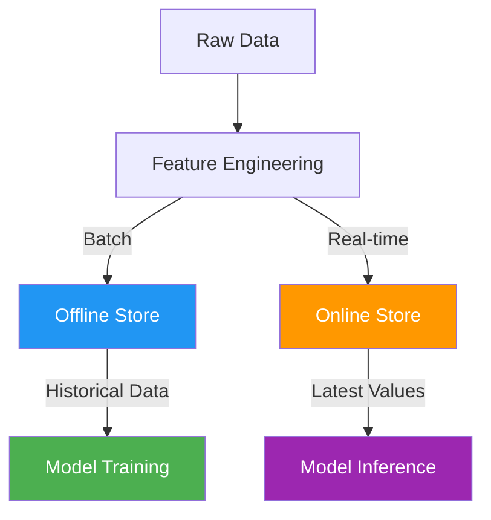
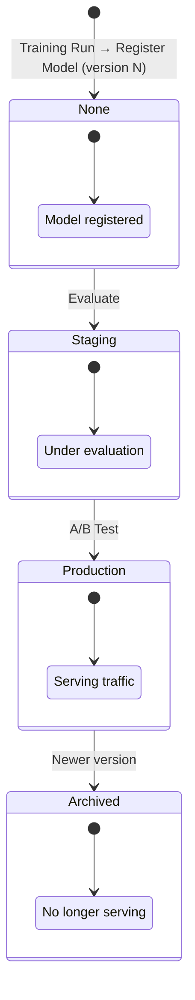
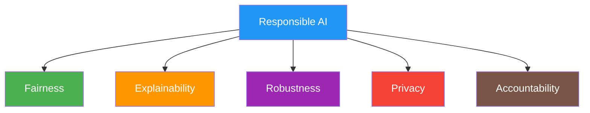

# AI ↔ SE Intersection: AI for Software Engineering and SE for AI

> **SWEBOK Alignment:** This note bridges [[Software Engineering]] and [[Artificial Intelligence]], covering the bidirectional relationship where AI techniques improve SE practices AND where SE principles govern the engineering of AI/ML systems. Related SWEBOK Knowledge Areas: [[KA Software Quality]], [[KA Software Testing]], [[KA Software Maintenance]], [[KA Software Configuration Management]], [[KA Software Engineering Process]].

---

## Overview: The Two Directions

The intersection of AI and SE is **bidirectional**:

| Direction | Focus | Key Question |
|---|---|---|
| **AI for SE** (Intelligent SE) | Applying ML/AI to improve software engineering tasks | *Can AI write, test, review, and predict software better?* |
| **SE for AI** (Engineering AI Systems) | Applying SE discipline to build reliable ML systems | *How do we engineer ML systems with the rigor of traditional software?* |

These two directions are converging in the field of **AI Engineering** — the discipline of building production AI systems with SE rigor.

---

## Part I: AI for Software Engineering

> Using AI/ML techniques to automate, assist, or improve traditional SE activities.

### 1. Defect Prediction

**Goal:** Predict which software modules are likely to contain defects before they manifest in production.

#### Approach
- **Static code metrics** (lines of code, cyclomatic complexity, coupling, cohesion) fed into classifiers (Random Forest, SVM, Neural Networks)
- **Process metrics** (commit frequency, author experience, code churn, time between changes)
- **Deep learning** approaches using code embeddings (CodeBERT, GraphCodeBERT) to learn defect-prone patterns directly from source

#### Key Techniques
- **Supervised classification**: Train on historical defect data (e.g., PROMISE datasets, NASA MDP)
- **Cross-project prediction**: Transfer learning from projects with defect data to new projects
- **Just-in-time prediction**: Predict defect-introducing commits rather than modules
- **Imbalanced learning**: Defect data is inherently imbalanced — use SMOTE, cost-sensitive learning, or anomaly detection

#### Evaluation
- **Metrics**: Precision, Recall, F1-score, AUC-ROC, Balance (optimal point on ROC)
- **Challenge**: High recall with acceptable precision — missing defects is costlier than false alarms
- **Practical impact**: Guides code review prioritization and testing resource allocation

#### Notable Tools & Research
- **PROMISE repository**: Standard defect prediction datasets
- **CodeBERT / UniXcoder**: Pre-trained models for code understanding
- **CrossVul / VulDeePecker**: Deep learning vulnerability prediction

---

### 2. Test Generation

**Goal:** Automatically generate test cases that achieve high coverage, find real bugs, or satisfy specific criteria.

#### AI-Driven Approaches
| Technique | Description | Strengths |
|---|---|---|
| **Search-Based (SBST)** | Genetic algorithms to evolve test inputs maximizing coverage | Works on any program, no training data needed |
| **Neural Test Generation** | LLMs (GPT-4, CodeLlama, StarCoder) generate unit tests from code/docstrings | Natural test intent, handles complex APIs |
| **Reinforcement Learning** | Agent learns to explore program states to maximize coverage | Handles complex state spaces |
| **Fuzzing (ML-guided)** | Neural network learns to generate inputs that trigger new paths (e.g., NEUZZ, MTFuzz) | Effective for security testing |
| **Mutation Testing** | AI predicts which mutants are killed, reducing execution cost | Prioritizes high-value test cases |

#### LLM-Based Test Generation (Emerging)
- **Codex / Copilot**: Generate tests from function signatures and docstrings
- **ChatGPT / Claude**: Conversational test generation with specification understanding
- **Challenges**: Tests may be syntactically valid but semantically shallow; "test illusion" — passing tests that don't actually verify behavior
- **Best practice**: Use LLM-generated tests as starting points, augment with property-based testing

#### Tools
- **EvoSuite** (Java, SBST), **Pynguin** (Python, SBST)
- **AFL / libFuzzer** (coverage-guided fuzzing)
- **Sapienz** (Facebook — SBST for mobile app testing)
- **Randoop** (random test generation for Java)

---

### 3. Code Review Automation

**Goal:** Automate or augment the human code review process with AI-powered analysis.

#### Capabilities
- **Review comment generation**: LLMs analyze diffs and suggest review comments
- **Defect detection in reviews**: Identify common bug patterns (null dereferences, resource leaks, concurrency issues)
- **Code style enforcement**: Automated style and convention checking beyond linting
- **Review prioritization**: Predict which changes are most likely to have defects, prioritize review effort
- **Reviewer recommendation**: Match code changes to the most qualified reviewers based on expertise

#### State of the Art (2024-2026)
- **CodeReviewer** (Microsoft): Pre-trained on 9M code changes and review comments
- **T5-based models**: Fine-tuned on review comment generation
- **LLM integration**: GitHub Copilot code review, Amazon CodeGuru Reviewer
- **Pull Request analysis**: Automated PR summaries, risk assessment, and suggested reviewers

#### Challenges
- **False positives**: Over-flagging benign code patterns reduces developer trust
- **Context sensitivity**: Reviews require understanding of system architecture, not just local code
- **Comment quality**: Automated comments must be actionable and non-trivial
- **Adoption**: Developers resist tools that slow down the review process

---

### 4. Vulnerability Analysis

**Goal:** Detect, classify, and remediate security vulnerabilities using AI techniques.

#### Approaches
- **Static analysis + ML**: Augment traditional SAST tools with ML to reduce false positives
- **Vulnerability detection from source code**: Deep learning models trained on vulnerable/non-vulnerable code pairs
- **Binary analysis**: Neural networks analyzing compiled binaries for vulnerability patterns
- **Dependency analysis**: Predicting which third-party libraries will have future vulnerabilities
- **Natural language processing**: Mining CVE/NVD descriptions to understand vulnerability patterns

#### Key Models & Tools
| Tool/Model | Approach | Scope |
|---|---|---|
| **VulDeePecker** | Deep learning on code gadgets | C/C++ buffer overflows |
| **Devign** | Graph neural networks on code ASTs | Multi-type vulnerabilities |
| **LineVul** | Transformer-based line-level prediction | Focuses localization |
| **CodeQL** | Semantic code analysis (rule-based + ML augmentation) | Multi-language |
| **Semgrep** | Pattern-based + ML prioritization | Multi-language |

#### Vulnerability Lifecycle AI
1. **Discovery**: ML identifies potential vulnerabilities in new code
2. **Triage**: AI prioritizes findings by severity and exploitability
3. **Remediation**: LLMs suggest patches and fixes
4. **Verification**: Automated testing confirms the fix works

---

### 5. Code Completion & Generation

**Goal:** Predict and generate code at token, line, function, or module level.

#### Evolution
1. **N-gram models** (2012-2015): Statistical language models for code
2. **RNN/LSTM** (2016-2019): Neural language models with longer context
3. **Transformer-based** (2020-2023): CodeBERT, CodeGPT, Codex, StarCoder
4. **Large Language Models** (2023-2026): GPT-4, Claude, Gemini, DeepSeek-Coder — multi-file understanding, repository-level context

#### Key Architectures
- **Fill-in-the-Middle (FIM)**: Models trained to complete code given both prefix and suffix context
- **Repository-level models**: Graph-based attention over entire codebases (e.g., RepoCoder, RepoHyper)
- **Multi-modal**: Combining code, documentation, type signatures, and test cases

#### Impact & Metrics
- **GitHub Copilot**: ~30% acceptance rate for suggestions, 55% faster task completion in studies
- **Cursor, Windsurf, Aider**: AI-native IDEs with deep codebase understanding
- **Metrics**: Acceptance rate, keystroke savings, task completion time, code correctness

#### Concerns
- **Hallucinated APIs**: LLMs may suggest non-existent functions or incorrect parameter signatures
- **License compliance**: Generated code may reproduce GPL-licensed patterns
- **Skill atrophy**: Over-reliance may reduce developers' foundational understanding
- **Security**: Generated code may contain subtle vulnerabilities

---

### 6. Code Search & Retrieval

**Goal:** Find relevant code snippets, functions, or examples from large codebases or open-source repositories.

#### Techniques
- **Semantic code search**: Encode code and natural language queries into a shared embedding space
- **Dense retrieval**: Use pre-trained models (CodeBERT, UniXcoder) to embed code, then use vector similarity (cosine, FAISS)
- **Sparse retrieval**: Traditional IR (BM25) on code tokens, augmented with query expansion
- **Hybrid retrieval**: Combine dense + sparse for better recall

#### Applications
- **API usage search**: "How do I read a CSV file in Python?" → find relevant code examples
- **Clone detection**: Identify semantically similar code across repositories
- **Code reuse**: Find existing implementations before writing new code
- **Stack Overflow integration**: Link error messages to relevant code solutions

#### Tools
- **GitHub Code Search**: Neural code search across all public repos
- **Sourcegraph**: Enterprise code search with AI-powered context
- **OpenAI Embeddings API**: Build custom code search over private codebases

---

### 7. Requirements Traceability

**Goal:** Automatically create and maintain links between requirements, design, code, tests, and other artifacts.

#### AI Techniques
- **Information Retrieval (IR)**: TF-IDF, LSI, LDA to find semantic similarity between requirement text and code/test artifacts
- **Deep Learning**: Sentence-BERT, CodeBERT to encode requirement and code semantics
- **Active Learning**: Human-in-the-loop to iteratively improve trace link accuracy
- **Link pattern mining**: Learn patterns from existing traces to predict new ones

#### Challenges
- **Vocabulary mismatch**: Requirements use domain language, code uses technical language
- **Granularity**: Mapping between coarse requirements and fine-grained code units
- **Maintenance**: Links become stale as requirements and code evolve
- **Evaluation**: Oracle traces are expensive to create; precision/recall trade-offs

#### Tools
- **ReqSim**: Requirements similarity analysis
- **TraceLab**: Research platform for traceability experiments
- **EALICS / TraceME**: Commercial traceability tools

---

### 8. Effort Estimation

**Goal:** Predict the effort (person-hours, story points, cost) required for software development tasks.

#### AI Approaches
| Method | Description | When to Use |
|---|---|---|
| **Case-Based Reasoning (CBR)** | Find similar past projects, adapt their effort | When historical data is available |
| **Neural Networks** | Learn non-linear relationships between features and effort | Large datasets with many features |
| **Ensemble Methods** | Random Forest, Gradient Boosting on project metrics | Best overall accuracy |
| **Transfer Learning** | Adapt models from one organization/project to another | Cross-company estimation |
| **LLM-assisted** | Use LLMs to analyze task descriptions and estimate complexity | Sprint planning, backlog grooming |

#### Features Used
- **Size metrics**: Function points, use case points, story points, lines of code
- **Complexity**: Technical complexity factors, architectural novelty
- **Team**: Team size, experience, distributed vs. co-located
- **Process**: Development methodology, tooling maturity
- **Historical**: Past project velocity, defect rates

#### Challenges
- **Optimism bias**: Human estimates are systematically low; AI can help calibrate
- **Data scarcity**: Many organizations lack detailed historical data
- **Context dependence**: Effort depends on factors not captured in metrics
- **Uncertainty communication**: Point estimates mislead; probabilistic estimates are better

---

## Part II: Software Engineering for AI (SE for AI)

> Applying SE principles — modularity, testing, versioning, monitoring, CI/CD — to the development and operation of ML/AI systems.

### The SE for AI Challenge

Traditional software is **deterministic**: same input → same output. ML systems are **probabilistic**: behavior depends on training data, hyperparameters, and runtime data distribution. This creates unique engineering challenges:

| Traditional SE | SE for AI (ML Engineering) |
|---|---|
| Code is the primary artifact | Data + Code + Model are all artifacts |
| Unit tests verify logic | Model tests verify statistical properties |
| Bugs are in code | "Bugs" can be in data, features, or model |
| Deployment = ship code | Deployment = ship code + model + data pipeline |
| Monitoring = uptime/errors | Monitoring = uptime + accuracy + drift |
| Version control = Git | Version control = Git + DVC + model registry |

---

### 1. ML Pipelines

**Definition:** An end-to-end workflow that orchestrates the steps from raw data to deployed model predictions.

#### Standard Pipeline Stages

#### Pipeline Orchestration Tools
| Tool | Approach | Strengths |
|---|---|---|
| **Kubeflow Pipelines** | Kubernetes-native, containerized steps | Scalable, cloud-native |
| **Apache Airflow** | DAG-based workflow orchestration | Mature, extensible |
| **MLflow** | Lightweight experiment tracking + deployment | Simple, Python-native |
| **Dagster** | Data-aware pipeline orchestration | Strong typing, testing |
| **ZenML** | MLOps framework with stack abstraction | Provider-agnostic |
| **Prefect** | Modern workflow orchestration | Dynamic workflows |

#### Pipeline Design Principles
- **Reproducibility**: Every pipeline run should produce identical results given identical inputs
- **Idempotency**: Re-running a stage should not create duplicates or side effects
- **Modularity**: Each stage is independently testable and replaceable
- **Observability**: Every stage emits metrics and logs for debugging
- **Versioning**: Data, code, and configurations are all versioned

---

### 2. Data Versioning

**Goal:** Track changes to datasets over time, enabling reproducibility and rollback.

#### Why It Matters
- ML models are only as good as their training data
- "Which data was this model trained on?" must be answerable
- Regulatory requirements (GDPR, EU AI Act) demand data lineage
- Debugging model regressions requires comparing data versions

#### Approaches
- **DVC (Data Version Control)**: Git-like interface for large files; stores data in S3/GCS/Azure while tracking metadata in Git
- **Delta Lake / Apache Iceberg**: Versioned data lakehouse tables with ACID transactions
- **LakeFS**: Git-like branching for data lakes
- **Git LFS**: Large file storage for smaller datasets
- **Dolt**: SQL database with Git-like version control

#### Data Versioning Best Practices
1. **Hash-based tracking**: Content-addressed storage (like Git objects)
2. **Metadata capture**: Schema, statistics, lineage, collection methodology
3. **Diff & compare**: Ability to diff two dataset versions (rows added/removed/changed)
4. **Tagging**: Tag dataset versions with experiment or model identifiers
5. **Lineage**: Track which dataset version produced which model version

---

### 3. Model Monitoring

**Goal:** Continuously observe deployed models for performance degradation, data quality issues, and behavioral changes.

#### What to Monitor
| Category | Metrics | Alert Triggers |
|---|---|---|
| **Performance** | Accuracy, precision, recall, F1, AUC | Degradation below threshold |
| **Data Quality** | Missing values, schema violations, outliers | Sudden spikes in nulls/outliers |
| **Data Drift** | Feature distribution shifts (PSI, KL-divergence) | Significant distribution change |
| **Concept Drift** | Relationship between features and target changes | Model predictions diverge from reality |
| **Operational** | Latency, throughput, error rate, resource usage | SLA violations |
| **Fairness** | Demographic parity, equalized odds | Bias metrics exceed thresholds |

#### Monitoring Tools
- **Evidently AI**: Open-source ML monitoring with rich reports
- **WhyLabs / whylogs**: Statistical profiling of data and model outputs
- **Arize AI**: ML observability platform
- **Seldon Alibi Detect**: Outlier and drift detection
- **NannyML**: Post-deployment model monitoring without ground truth

#### Drift Detection Methods
- **Statistical tests**: KS test, Chi-squared test, PSI (Population Stability Index)
- **Distance measures**: KL-divergence, JS-divergence, Wasserstein distance
- **Sequential methods**: ADWIN, DDM, Page-Hinkley test
- **Model-based**: Train a classifier to distinguish old vs. new data

---

### 4. A/B Testing for ML Models

**Goal:** Statistically compare two model versions in production to determine which performs better.

#### Process
1. **Hypothesis**: New model (treatment) will improve metric X over current model (control)
2. **Randomization**: Randomly assign users/requests to control or treatment
3. **Metric collection**: Track business metrics (conversion, engagement, revenue) and ML metrics (accuracy, latency)
4. **Statistical analysis**: T-tests, Bayesian analysis, multi-armed bandit approaches
5. **Decision**: Ship the winner, iterate, or run another experiment

#### ML-Specific A/B Testing Challenges
- **Delayed feedback**: Conversions may happen days after the model prediction
- **Interference**: Models may affect each other through shared state (e.g., recommendation diversity)
- **Novelty effects**: Users may initially engage more with a new model, then revert
- **Metric sensitivity**: ML improvements (e.g., 0.1% accuracy gain) may not translate to business impact
- **Infrastructure complexity**: Serving two models simultaneously requires traffic splitting infrastructure

#### Advanced Approaches
- **Multi-armed bandits**: Dynamically allocate traffic to the better-performing model
- **Contextual bandits**: Optimize model selection per user context
- **Interleaving**: Mix results from both models in a single ranking (common in search/recommendation)
- **Shadow mode**: Run new model alongside production, compare outputs without serving them

---

### 5. Feature Stores

**Definition:** A centralized repository for storing, managing, and serving ML features for training and inference.

#### Why Feature Stores?
- **Feature reuse**: Avoid re-computing features across teams and models
- **Consistency**: Same feature definitions for training and serving (training-serving skew prevention)
- **Freshness**: Real-time feature computation for online models
- **Governance**: Track feature lineage, ownership, and usage

#### Architecture

#### Feature Store Tools
| Tool | Type | Strengths |
|---|---|---|
| **Feast** | Open-source | Provider-agnostic, lightweight |
| **Tecton** | Managed | Real-time features, enterprise |
| **Hopsworks** | Open-source | Full ML platform with feature store |
| **Databricks Feature Store** | Managed | Unity Catalog integration |
| **Amazon SageMaker Feature Store** | Managed | AWS ecosystem |
| **Vertex AI Feature Store** | Managed | GCP ecosystem |

#### Feature Store Design Patterns
- **Batch features**: Computed on a schedule (daily/hourly) from data warehouse
- **Streaming features**: Computed in real-time from event streams (Kafka, Kinesis)
- **On-demand features**: Computed at request time from raw inputs
- **Feature views**: Logical grouping of related features with shared freshness requirements

---

### 6. Model Serving

**Goal:** Deploy trained models as production services that accept input and return predictions.

#### Serving Patterns
| Pattern | Description | Use Case |
|---|---|---|
| **Online (REST/gRPC)** | Synchronous request-response | Real-time predictions |
| **Batch** | Process large datasets offline | Nightly scoring, bulk predictions |
| **Streaming** | Process events as they arrive | Real-time anomaly detection |
| **Edge** | Deploy on mobile/IoT devices | Low-latency, offline-capable |

#### Serving Infrastructure
- **TensorFlow Serving**: High-performance serving for TF models
- **Triton Inference Server** (NVIDIA): Multi-framework, GPU-optimized
- **Seldon Core**: Kubernetes-native model serving with advanced features
- **KServe (formerly KFServing)**: Kubernetes-based, serverless model serving
- **BentoML**: Framework-agnostic model packaging and serving
- **Ray Serve**: Scalable, composable model serving
- **vLLM**: High-throughput LLM serving with PagedAttention

#### Model Optimization for Serving
- **Quantization**: Reduce model precision (FP32 → INT8/INT4) for faster inference
- **Pruning**: Remove redundant parameters
- **Distillation**: Train a smaller model to mimic a larger one
- **ONNX Runtime**: Cross-framework model optimization
- **TensorRT**: NVIDIA GPU optimization

---

### 7. ML Design Patterns

> Reusable solutions to common ML engineering problems. (Reference: *Machine Learning Design Patterns* by Lakshmanan, Robinson, & Munn, O'Reilly 2020)

#### Embedding Pattern
- **Problem**: High-cardinality categorical features (user IDs, product IDs) are difficult for ML models
- **Solution**: Learn dense vector representations that capture semantic relationships
- **Implementation**: Embedding layers in neural networks, pre-trained embeddings (Word2Vec, sentence-transformers)
- **Use cases**: Recommendation systems, NLP, search ranking

#### Feature Store Pattern
- **Problem**: Feature engineering is duplicated across training and serving; training-serving skew
- **Solution**: Centralized feature computation and storage with consistent access patterns
- **See**: [[#5. Feature Stores]] above

#### Model Serving Pattern
- **Problem**: Models trained in Python need to serve in production with low latency
- **Solution**: Decouple model training from serving; package models with standardized interfaces
- **See**: [[#6. Model Serving]] above

#### Batch Serving Pattern
- **Problem**: Some predictions are needed for millions of items, not real-time
- **Solution**: Pre-compute predictions in batch, store in a lookup table or cache
- **Implementation**: Spark/Beam jobs → feature store → batch prediction → results DB
- **Use cases**: Email campaign targeting, content pre-ranking, risk scoring

#### Transform Pattern
- **Problem**: Preprocessing logic in training must exactly match serving preprocessing
- **Solution**: Package preprocessing as part of the model artifact (TF Transform, sklearn Pipeline)
- **Implementation**: `TFTransform`, `sklearn.pipeline`, `FeatureUnion`

#### Cascade Pattern
- **Problem**: A single model can't handle all cases well
- **Solution**: Chain models — simple model handles easy cases, complex model handles hard cases
- **Use cases**: Multi-stage recommendation (candidate generation → ranking), cascading classifiers

#### Checkpoint Pattern
- **Problem**: Long training runs can fail; need to resume without starting over
- **Solution**: Save model state at regular intervals; resume from last checkpoint
- **Implementation**: Framework checkpointing (PyTorch `save`, TF `ModelCheckpoint`)

#### Neutral / Ensemble Pattern
- **Problem**: Single models have blind spots
- **Solution**: Combine multiple models (bagging, boosting, stacking, or simple averaging)
- **Use cases**: Kaggle competitions, production systems requiring robustness

---

## Part III: MLOps Concepts

> The intersection of ML, DevOps, and Data Engineering — operationalizing ML systems reliably and efficiently.

### Definition

**MLOps** (Machine Learning Operations) = applying DevOps principles to the ML lifecycle. It encompasses:
- **Continuous Integration (CI)**: Testing code, data, and models
- **Continuous Delivery (CD)**: Automated model deployment
- **Continuous Training (CT)**: Automated retraining on new data
- **Continuous Monitoring (CM)**: Tracking model performance in production

### MLOps Maturity Levels

| Level | Description | Characteristics |
|---|---|---|
| **Level 0: Manual** | Manual process, notebooks | No automation, manual deployment |
| **Level 1: ML Pipeline** | Automated training pipeline | CT, pipeline orchestration, feature store |
| **Level 2: CI/CD/CT/CM** | Full MLOps automation | Automated testing, deployment, monitoring |

---

### CI/CD for ML

#### Continuous Integration for ML
Traditional CI tests code; ML CI must also test:
- **Data tests**: Schema validation, statistical tests, data quality checks
- **Model tests**: Performance benchmarks, fairness checks, robustness tests
- **Pipeline tests**: End-to-end pipeline validation
- **Infrastructure tests**: Serving infrastructure configuration

#### CI Pipeline for ML

#### Continuous Delivery for ML
- **Model packaging**: Bundle model + preprocessing + dependencies (Docker, BentoML, MLflow)
- **Shadow deployment**: Run new model alongside production, compare outputs
- **Canary deployment**: Route small % of traffic to new model, monitor, gradually increase
- **Blue-green deployment**: Swap entire traffic between old and new model
- **Multi-armed bandit**: Dynamically route traffic based on performance

#### Tools for ML CI/CD
- **GitHub Actions / GitLab CI**: General CI/CD with ML extensions
- **ZenML**: MLOps pipeline framework with CI/CD integration
- **DVC**: Data version control + CI/CD pipeline definitions
- **CML (Continuous Machine Learning)**: Git-based ML CI/CD by DVC team
- **Kubeflow**: End-to-end ML platform on Kubernetes

---

### Model Registry

**Definition:** A centralized repository for managing the lifecycle of trained ML models.

#### Capabilities
- **Version management**: Track model versions with metadata
- **Stage transitions**: `None → Staging → Production → Archived`
- **Metadata**: Training data version, hyperparameters, metrics, lineage
- **Artifact storage**: Model files, preprocessing artifacts, config
- **Access control**: Who can promote, deploy, or retire models
- **Approval workflows**: Required reviews before production deployment

#### Tools
- **MLflow Model Registry**: Open-source, integrated with MLflow Tracking
- **Weights & Biases (W&B)**: Experiment tracking + model registry
- **Amazon SageMaker Model Registry**: AWS-managed
- **Vertex AI Model Registry**: GCP-managed
- **Neptune.ai**: Metadata store + model registry
- **DVC + CML**: Git-based model versioning

#### Model Registry Workflow

---

### Experiment Tracking

**Definition:** Systematic logging of ML experiments — parameters, metrics, artifacts, and results.

#### What to Track
- **Hyperparameters**: Learning rate, batch size, architecture choices, regularization
- **Metrics**: Training loss, validation accuracy, custom business metrics
- **Artifacts**: Model checkpoints, visualizations, confusion matrices
- **Environment**: Library versions, hardware, random seeds
- **Data**: Dataset version, feature set used, data splits
- **Code**: Git commit hash, code diff

#### Tools Comparison
| Tool | Type | Strengths |
|---|---|---|
| **MLflow Tracking** | Open-source | Lightweight, Python-native |
| **Weights & Biases** | Managed/Cloud | Rich visualizations, collaboration |
| **Neptune.ai** | Managed | Metadata focus, team features |
| **Comet ML** | Managed | Experiment comparison, GPU tracking |
| **TensorBoard** | Open-source | Deep learning visualization |
| **Sacred + Omniboard** | Open-source | Flexible, MongoDB backend |

#### Best Practices
1. **Log everything**: It's cheaper to log too much than to re-run experiments
2. **Reproducibility**: Always log random seeds, data versions, and environment
3. **Comparison**: Design experiments to be comparable (same validation set, same metrics)
4. **Naming**: Use consistent naming conventions for runs and experiments
5. **Collaboration**: Share experiment results with the team, not just model files

---

### Data Drift Detection

**Definition:** Identifying when the distribution of input data in production differs from the training data.

#### Types of Drift
| Type | Description | Detection Method |
|---|---|---|
| **Data drift (covariate shift)** | Input feature distributions change | Statistical tests on feature distributions |
| **Concept drift** | Relationship between features and target changes | Monitor model performance over time |
| **Label drift** | Target variable distribution changes | Compare label distributions |
| **Prediction drift** | Model output distribution changes | Monitor prediction histograms |

#### Detection Methods
- **Statistical tests**: Kolmogorov-Smirnov (KS), Chi-squared, Mann-Whitney U
- **Distance metrics**: Population Stability Index (PSI), KL-divergence, JS-divergence, Wasserstein distance
- **Sequential methods**: ADWIN (Adaptive Windowing), DDM (Drift Detection Method), Page-Hinkley
- **Model-based**: Train a domain classifier to distinguish old vs. new data

#### Remediation Strategies
- **Retrain**: Update model on recent data (scheduled or triggered)
- **Online learning**: Continuously update model as new data arrives
- **Ensemble**: Add a model trained on recent data to the ensemble
- **Feature update**: Adjust features to capture new patterns
- **Human review**: Alert data scientists for investigation

---

## Part IV: Responsible AI

> Engineering AI systems that are fair, transparent, robust, and aligned with human values.

### The Responsible AI Pillars

---

### 1. Fairness

**Goal:** Ensure AI systems do not discriminate against individuals or groups based on protected attributes (race, gender, age, etc.).

#### Fairness Definitions
| Definition | Meaning | Metric |
|---|---|---|
| **Demographic Parity** | Equal positive prediction rates across groups | P(Ŷ=1\|A=0) = P(Ŷ=1\|A=1) |
| **Equal Opportunity** | Equal true positive rates across groups | P(Ŷ=1\|Y=1,A=0) = P(Ŷ=1\|Y=1,A=1) |
| **Equalized Odds** | Equal TPR and FPR across groups | Both TPR and FPR equalized |
| **Predictive Parity** | Equal precision across groups | P(Y=1\|Ŷ=1,A=0) = P(Y=1\|Ŷ=1,A=1) |
| **Individual Fairness** | Similar individuals get similar predictions | Lipschitz condition on model |

#### Bias Sources
- **Historical bias**: Training data reflects past discrimination
- **Representation bias**: Underrepresentation of certain groups in training data
- **Measurement bias**: Different data quality across groups
- **Aggregation bias**: One model for all groups when groups need different models
- **Evaluation bias**: Using non-representative benchmarks

#### Mitigation Techniques
- **Pre-processing**: Re-sampling, re-weighting, or transforming training data (e.g., `AIF360` Reweighing)
- **In-processing**: Add fairness constraints during training (e.g., adversarial debiasing, fairness-regularized loss)
- **Post-processing**: Adjust model outputs to satisfy fairness criteria (e.g., threshold adjustment)
- **Fairness-aware feature selection**: Remove or decorrelate proxy variables

#### Tools
- **IBM AI Fairness 360 (AIF360)**: Comprehensive fairness toolkit
- **Microsoft Fairlearn**: Fairness assessment and mitigation
- **Google What-If Tool**: Interactive fairness exploration
- **Aequitas**: Bias and fairness audit toolkit

---

### 2. Explainability (XAI)

**Goal:** Make AI decisions understandable to humans — enabling trust, debugging, regulatory compliance, and accountability.

#### Types of Explanations
| Type | Scope | Methods |
|---|---|---|
| **Global** | Explain the overall model behavior | Feature importance, partial dependence, SHAP summary |
| **Local** | Explain a single prediction | LIME, SHAP, counterfactual explanations |
| **Model-specific** | Leverage model internals | Attention weights (transformers), tree paths (XGBoost) |
| **Model-agnostic** | Work for any model | LIME, SHAP, permutation importance |

#### Key XAI Methods
- **SHAP (SHapley Additive exPlanations)**: Game-theoretic feature attribution; consistent, locally accurate
- **LIME (Local Interpretable Model-agnostic Explanations)**: Perturb input, fit local linear model
- **Attention Visualization**: Show which input tokens a transformer attends to (limited faithfulness)
- **Counterfactual Explanations**: "If feature X had been Y instead of Z, the prediction would have changed"
- **Concept-based explanations**: TCAV — test sensitivity to high-level concepts
- **Integrated Gradients**: Attribute predictions to input features along a baseline path

#### Explainability for Different Model Types
- **Linear models**: Coefficients are directly interpretable
- **Decision trees**: Feature importance, decision paths
- **Deep learning**: Attention maps, GradCAM (vision), integrated gradients
- **LLMs**: Prompt-based explanations, chain-of-thought, mechanistic interpretability (emerging)

#### Regulatory Drivers
- **EU AI Act (2024)**: Requires transparency and explainability for high-risk AI systems
- **GDPR Article 22**: Right to explanation for automated decisions
- **US Algorithmic Accountability Act**: Impact assessments for automated systems

---

### 3. Robustness

**Goal:** Ensure AI systems behave reliably under adversarial conditions, distribution shifts, and unexpected inputs.

#### Threats to Robustness
| Threat | Description | Example |
|---|---|---|
| **Adversarial attacks** | Small perturbations to inputs cause misclassification | Pixel changes fool image classifier |
| **Data poisoning** | Malicious training data corrupts model | Backdoor attacks on training pipeline |
| **Distribution shift** | Production data differs from training | Weather model trained on temperate data deployed in tropics |
| **Out-of-distribution inputs** | Inputs unlike anything in training data | Medical AI encountering rare condition |
| **Evasion attacks** | Adversarial inputs designed to bypass detection | Spam email crafted to evade filters |

#### Robustness Techniques
- **Adversarial training**: Train on adversarial examples to improve robustness
- **Input validation**: Detect and reject anomalous inputs (OOD detection)
- **Certified defenses**: Mathematically guarantee robustness within perturbation bounds (randomized smoothing)
- **Ensemble methods**: Combine multiple models for more robust predictions
- **Formal verification**: Prove model properties for specific input ranges
- **Robustness testing**: Red-teaming, stress testing, chaos engineering for ML

#### Tools
- **Microsoft Counterfit**: Adversarial attack tool for AI systems
- **IBM Adversarial Robustness Toolbox (ART)**: Attack and defense library
- **TextAttack**: NLP adversarial attack framework
- **Foolbox**: Python toolbox for adversarial attacks

---

### 4. Privacy in AI

- **Differential Privacy**: Add calibrated noise to training or inference to prevent memorization of individual data points
- **Federated Learning**: Train models across decentralized data without sharing raw data
- **Secure Multi-Party Computation**: Compute on encrypted data from multiple parties
- **Data minimization**: Collect and use only the data necessary for the task

---

### 5. AI Governance & Accountability

- **Model cards**: Standardized documentation for ML models (intended use, limitations, fairness evaluation)
- **Datasheets for datasets**: Documentation of dataset creation, composition, and intended use
- **AI impact assessments**: Systematic evaluation of potential harms before deployment
- **Auditing**: Third-party review of AI systems for compliance with fairness, transparency, and safety standards

---

## Part V: AI Engineering Challenges

> Fundamental challenges that make engineering AI systems harder than traditional software.

### 1. Data Quality

**The foundation of ML — garbage in, garbage out.**

#### Dimensions of Data Quality
| Dimension | Description | Detection |
|---|---|---|
| **Accuracy** | Data correctly represents real-world entities | Cross-reference with authoritative sources |
| **Completeness** | All required data is present | Missing value analysis |
| **Consistency** | Data doesn't contradict itself across sources | Cross-table validation |
| **Timeliness** | Data is current and up-to-date | Staleness checks |
| **Validity** | Data conforms to defined formats/ranges | Schema validation |
| **Uniqueness** | No unintended duplicates | Deduplication checks |

#### Data Quality Tools
- **Great Expectations**: Data validation and profiling framework
- **Pandas Profiling / ydata-profiling**: Automated EDA reports
- **Deequ (Amazon)**: Data quality on Apache Spark
- **Soda**: Data quality monitoring
- **Monte Carlo**: Data observability platform

#### Data Quality in ML Pipelines
- **Schema validation**: Enforce expected types, ranges, and relationships
- **Statistical validation**: Check distributions, correlations, and outliers
- **Freshness checks**: Ensure data isn't stale before training
- **Bias detection**: Check for representation gaps across demographic groups
- **Label quality**: Audit labels for noise, consistency, and agreement (inter-annotator agreement)

---

### 2. Concept Drift

**Definition:** The statistical relationship between input features and the target variable changes over time, causing model performance to degrade.

#### Types of Concept Drift
| Type | Description | Example |
|---|---|---|
| **Sudden (abrupt)** | Rapid change in concept | COVID-19 changing consumer behavior overnight |
| **Gradual** | Slow transition between concepts | Shifting consumer preferences over months |
| **Incremental** | Small, continuous changes | Evolving spam tactics |
| **Recurring** | Concepts cycle (seasonality) | Holiday shopping patterns |
| **Blurred** | Gradual overlap between old and new concepts | Style evolution in fashion |

#### Detection vs. Adaptation
- **Detection**: Monitor performance metrics, statistical tests on input/output distributions
- **Adaptation**: Retrain, online learning, ensemble with drift-aware weighting

#### Frameworks
- **River**: Online learning library for Python
- **Alibi Detect**: Drift detection for tabular, image, and text data
- **NannyML**: Performance estimation without ground truth
- **Frouros**: Drift detection library by Telefonica

---

### 3. Reproducibility

**Goal:** Ensure that ML experiments can be exactly reproduced by anyone, at any time.

#### Sources of Non-Reproducibility
- **Random seeds**: Non-deterministic initialization and data shuffling
- **Hardware differences**: GPU floating-point non-determinism
- **Library versions**: Subtle differences between library versions
- **Data changes**: Training data modified between runs
- **Hyperparameters**: Unreported or undocumented settings
- **Environment**: OS, driver versions, cloud provider differences

#### Reproducibility Checklist
- [ ] **Fix random seeds** for all libraries (Python, NumPy, PyTorch/TF, CUDA)
- [ ] **Version control** all code (Git)
- [ ] **Version data** (DVC, Delta Lake)
- [ ] **Pin dependencies** (requirements.txt, poetry.lock, conda environment.yml)
- [ ] **Log all hyperparameters** (experiment tracking tool)
- [ ] **Record environment** (Docker image hash, OS, GPU driver)
- [ ] **Document preprocessing** steps explicitly
- [ ] **Save model artifacts** with versioned metadata
- [ ] **Containerize** training (Docker) for environment reproducibility
- [ ] **Report metrics** with confidence intervals (multiple runs with different seeds)

#### Tools for Reproducibility
- **DVC**: Data and pipeline versioning
- **MLflow**: Experiment logging and model artifacts
- **Docker**: Environment containerization
- **Hydra / OmegaConf**: Configuration management
- **Weights & Biases**: Experiment tracking and reporting

---

### 4. Additional AI Engineering Challenges

#### The Data Flywheel Problem
- Models need data → data comes from users → users need good models
- Cold start: How to bootstrap when you have neither data nor users?
- Strategy: Start with rule-based systems, collect data, gradually introduce ML

#### Technical Debt in ML Systems
- **Glue code**: Custom integration between ML frameworks and production systems
- **Pipeline jungles**: Complex, tangled data preprocessing pipelines
- **Dead experimental code paths**: Unused features and experiments left in code
- **Feedback loops**: Model predictions influence future training data
- **Configuration debt**: Untested or undocumented configuration combinations

#### Scaling Challenges
- **Training at scale**: Distributed training (data parallelism, model parallelism, pipeline parallelism)
- **Inference at scale**: Load balancing, batching, caching, model optimization
- **Data at scale**: Efficient storage, processing, and retrieval of large datasets
- **Feature computation at scale**: Real-time feature engineering for millions of users

#### Organizational Challenges
- **Skill gaps**: ML engineers need both SE and data science skills
- **Tooling fragmentation**: Too many tools, too much integration work
- **Cross-functional collaboration**: Data scientists, engineers, product managers must align
- **Measurement**: Hard to attribute business impact to ML improvements

---

## SWEBOK Knowledge Area Mapping

| SWEBOK KA | AI for SE Topics | SE for AI Topics |
|---|---|---|
| **Software Requirements** | Requirements tracing, NLP for requirements analysis | ML requirements specification, model cards |
| **Software Design** | AI-assisted architecture design | ML system design, serving architecture |
| **Software Construction** | Code completion, code generation | ML pipeline development, feature engineering |
| **Software Testing** | Test generation, mutation testing, fuzzing | Model testing, A/B testing, robustness testing |
| **Software Maintenance** | Defect prediction, code review | Model monitoring, retraining, concept drift |
| **Software Configuration Mgmt** | AI for change impact analysis | Data versioning, model registry, experiment tracking |
| **Software Engineering Mgmt** | Effort estimation, risk prediction | MLOps maturity, AI governance |
| **Software Quality** | Vulnerability analysis, code quality prediction | Fairness, explainability, robustness |
| **Software Engineering Process** | Process mining, automation | CI/CD for ML, MLOps pipelines |
| **Software Engineering Econ** | Cost estimation AI | ML ROI, technical debt in ML |

---

## Key References & Further Reading

### Books
- 📘 *Machine Learning Design Patterns* — Lakshmanan, Robinson, Munn (O'Reilly, 2020)
- 📘 *Designing Machine Learning Systems* — Chip Huyen (O'Reilly, 2022)
- 📘 *Building Machine Learning Powered Applications* — Emmanuel Ameisen (O'Reilly, 2020)
- 📘 *Reliable Machine Learning* — Cathy Chen et al. (O'Reilly, 2022)
- 📘 *AI Engineering* — Chip Huyen (O'Reilly, 2025)
- 📘 *SWEBOK Guide v4.0* — IEEE (2024)
- 📘 *Software Engineering for Machine Learning: A Case Study* — Amershi et al. (ICSE-SEIP, 2019)

### Papers
- 📄 *Hidden Technical Debt in Machine Learning Systems* — Sculley et al. (NeurIPS, 2015)
- 📄 *Rules of Machine Learning: Best Practices for ML Engineering* — Zinkevich (Google, 2018)
- 📄 *On the Criteria To Be Used in Decomposing Systems into Modules* — Parnas (1972) — foundational SE thinking
- 📄 *Software Engineering for AI-Enabled Systems (SE4AI)* — Microsoft Research
- 📄 *A Survey on Software Engineering for Artificial Intelligence* — Chou et al. (2024)

### Frameworks & Tools (Summary)
- **MLOps**: MLflow, Kubeflow, ZenML, DVC, Airflow
- **Model Monitoring**: Evidently, WhyLabs, Arize, NannyML
- **Feature Stores**: Feast, Tecton, Hopsworks
- **Responsible AI**: Fairlearn, AIF360, SHAP, LIME
- **Model Serving**: Triton, KServe, BentoML, Ray Serve
- **Code Intelligence**: GitHub Copilot, CodeBERT, StarCoder

---

## Connections

- Related: [[Software Engineering Fundamentals]]
- Related: [[Machine Learning Fundamentals]]
- Related: [[DevOps and Continuous Delivery]]
- Related: [[Data Engineering]]
- Related: [[Software Quality Assurance]]
- Related: [[Software Architecture]]
- Related: [[Ethics in Computing]]
- Builds on: [[Probability and Statistics for SE]]
- Builds on: [[Software Testing Techniques]]
- Enables: [[Intelligent Software Development Tools]]

---

*Last updated: 2026-07-21 | SWEBOK v4.0 aligned*
