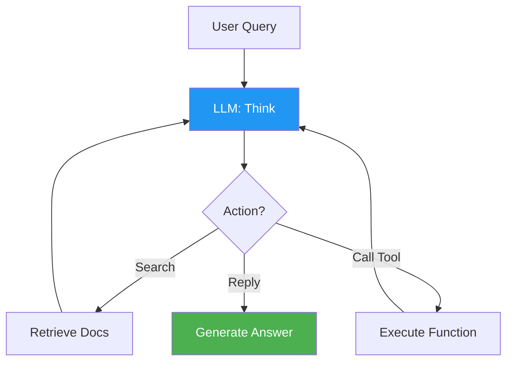
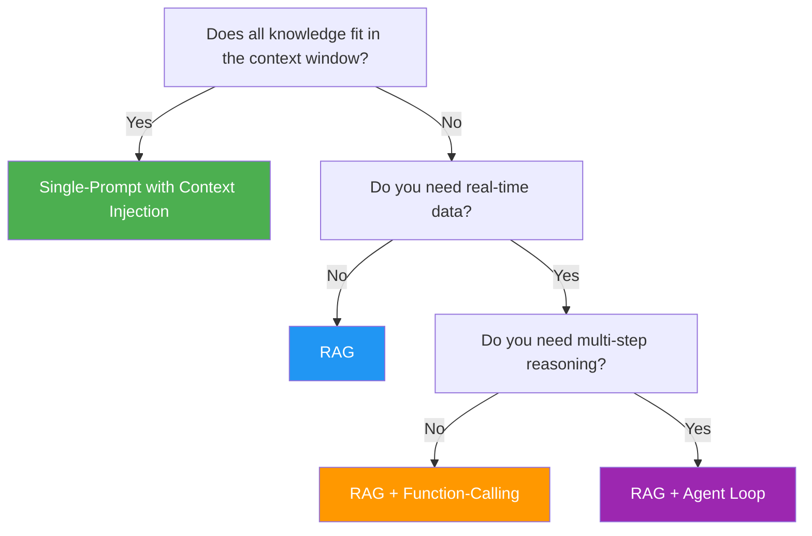

---
tags:
  - llm
  - rag
  - agents
  - function-calling
  - production-patterns
  - grounding
  - artificial-intelligence
source: Interview preparation
created: 2026-08-31
---

# 10 — LLM Production Patterns: RAG, Agents, Function-Calling

> Core AI Engineer vocabulary. Know **what** each pattern is, **when** to use it, and **why** you chose one over another.

---

## The Four Core Patterns

| Pattern | What It Is | When It Fits | Trade-off |
|---|---|---|---|
| **RAG (Retrieve-Augment-Generate)** | Retrieve relevant docs → inject into prompt → LLM generates | Knowledge base too large for prompt; need grounding in facts | Adds retrieval latency; retrieval quality determines output quality |
| **Function-calling / Tool-use** | LLM decides to call a function (e.g., `get_price(sku)`) | Action has side effects; need external system calls; decision is reversible | Less predictable; harder to test; can hallucinate function calls |
| **Agent loop** | LLM iteratively decides next step (search → reason → search → reply) | Multi-step conditional reasoning; complex tool sequencing | High latency; unpredictable cost; can loop forever |
| **Single-prompt with context injection** | Pre-retrieve everything, one LLM call | Small context, predictable, fast, cheap | Doesn't scale to large knowledge bases; context window limits |

---

## Pattern 1: RAG (Retrieve-Augment-Generate)

### How It Works

### Key Components

1. **Chunking** — How you split documents before embedding. Too small = lost context. Too large = diluted relevance. Common: 256-512 token chunks with overlap.
2. **Retrieval** — Semantic search over embeddings (see [[02 Vector Databases]]). Can be dense (vector), sparse (BM25/keyword), or hybrid (both).
3. **Augmentation** — Inject retrieved documents into the system prompt as context. The LLM sees: `System: You are a helpful assistant. Context: [docs]. User: [query]`
4. **Generation** — LLM produces answer grounded in retrieved context, with citations.

### When to Use RAG

- Knowledge base is too large for the context window
- Need factual grounding (reduce hallucination)
- Knowledge changes frequently (update the vector DB, not the model)
- Need auditability (show which documents the answer came from)

### When NOT to Use RAG

- Small, static knowledge that fits in the system prompt
- Real-time data that changes during the conversation (use function-calling instead)
- Tasks requiring multi-step reasoning across multiple retrievals (use agent loop)

### RAG Quality Factors

| Factor | Impact |
|---|---|
| **Chunk size** | Too small = lost context; too large = diluted relevance |
| **Embedding model** | Better embeddings = better retrieval |
| **Retrieval strategy** | Hybrid (dense + sparse) typically beats either alone |
| **Reranking** | A second-pass model re-scores candidates; significant quality boost |
| **Prompt template** | How you frame the context matters — "Answer ONLY from the provided context" |

---

## Pattern 2: Function-Calling / Tool-Use

### How It Works

1. Define functions with schemas: `get_price(sku: string) → {price: number, currency: string}`
2. LLM receives user query + available function definitions
3. LLM **decides** whether to call a function (vs. reply directly)
4. If yes, LLM outputs a function call (name + arguments)
5. Your code executes the function, returns the result to the LLM
6. LLM generates the final answer incorporating the function result

### When to Use

- Need real-time data (current price, stock, weather)
- Need to perform actions (send email, create order, update database)
- Structured data lookup (exact SKU match, not fuzzy search)

### When NOT to Use

- The function result is deterministic and you can pre-compute it (just inject it)
- The action is irreversible (create order, charge card) — add human confirmation
- The LLM can hallucinate function calls (OpenAI function-calling is reliable; open-source models vary)

### Safety Considerations

- **Validate function arguments** before execution — never trust LLM output directly
- **Limit blast radius** — functions should be read-only where possible, write with confirmation
- **Rate limit** — an agent loop can call functions rapidly; set per-user limits
- **Audit log** — log every function call with arguments for debugging

---

## Pattern 3: Agent Loop

### How It Works

The LLM decides the next step iteratively: it might search, then reason, then search again, then call a tool, then reply. Each step is one LLM call.

### When to Use

- Multi-step reasoning that requires intermediate results
- Complex queries that need multiple retrievals or tool calls
- The path to the answer isn't known in advance

### Risks

| Risk | Mitigation |
|---|---|
| **Infinite loops** | Max steps limit (e.g., 10 iterations) |
| **Cost explosion** | Budget per query; track token usage |
| **Hallucinated actions** | Validate all function arguments; use read-only tools |
| **Latency** | Set timeout; provide partial results if possible |

### ReAct Pattern (Reasoning + Acting)

The most common agent architecture: the LLM alternates between **Thought** (reasoning about what to do), **Action** (executing a tool), and **Observation** (seeing the result). This is the ReAct pattern (Yao et al., 2023).

---

## Pattern 4: Single-Prompt with Context Injection

### How It Works

Pre-retrieve (or pre-compute) everything the LLM needs, inject it into the system prompt, and make one LLM call. No retrieval at query time, no function calls, no iteration.

### When to Use

- Small context (fits in the model's context window)
- Predictable, deterministic data
- Low latency requirements
- Cost-sensitive applications

### Example

Your take-home's approach: 30 SKUs + short FAQ fit in the context window. The catalog and FAQ are injected into the system prompt via `replace()`. One LLM call produces the answer. This is the right choice for the problem size.

> **Decision principle:** Start with the simplest pattern that works. Upgrade to RAG when the knowledge base outgrows the context window. Add function-calling when you need real-time data. Add agent loops only when multi-step reasoning is required.

---

## Key Vocabulary

| Term | Definition |
|---|---|
| **Grounding** | Tying LLM output to retrieved facts — the output is "grounded" in real data, not invented |
| **Hallucination** | LLM invents facts that aren't in the context or training data |
| **Context window** | How much text the model can see at once (e.g., 128K tokens for GPT-4o) |
| **Temperature** | Randomness; 0 = deterministic, 1 = creative. Use 0-0.3 for factual tasks |
| **Token** | ~4 chars of English or ~1 Thai syllable; pricing is per-token |
| **System prompt** | Instructions that define the LLM's behavior; separate from user messages |
| **Chunking** | Splitting documents into embeddable pieces before vector storage |
| **Hybrid retrieval** | Combining dense (vector) and sparse (BM25) retrieval for better recall |

---

## Decision Framework

---

## Related

- [[02 Vector Databases]] — The retrieval layer for RAG
- [[11_Prompt_Engineering_and_Security]] — Prompt design and injection defense
- [[13_LLM_Evaluation_and_Guardrails]] — How to evaluate if your pattern is working
- [[09_AI_SE_Intersection]] — MLOps, model serving, monitoring
- [[AI Overview]] — All AI topics