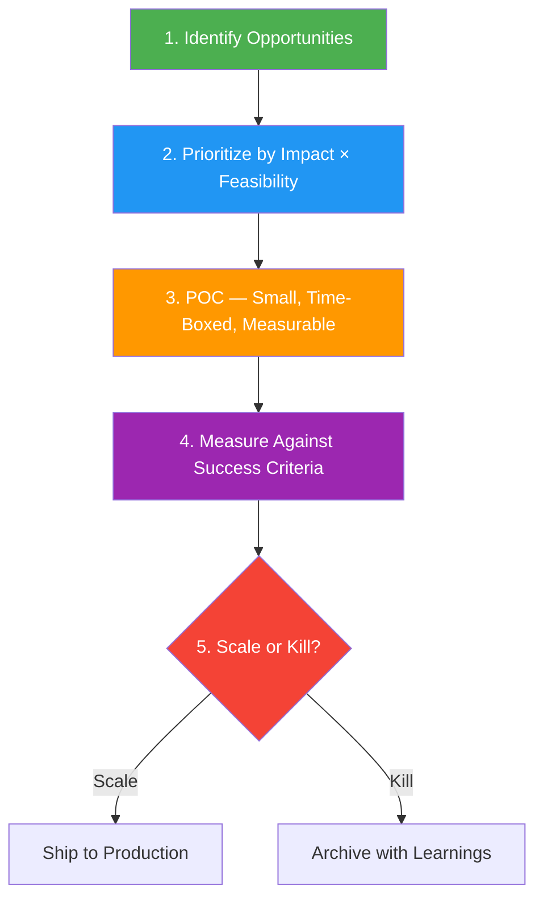

# 12 — AI ROI Translation & Roadmap Thinking

> The gap area for most engineers. Technical decisions **must** be translated into business value. Know the vocabulary and frameworks.

---

## Part I: Technical Claim → ROI Translation

The ability to translate your technical decisions into business outcomes is what separates senior engineers from juniors. Every technical choice has a business justification.

### Translation Table

| Technical Claim | ROI Translation |
|---|---|
| "Deterministic retrieval means prices are always correct" | "Zero hallucination risk on the highest-stakes data (price/stock) — protects revenue and trust" |
| "Provider-neutral config" | "We can swap to the cheapest/best model per use case without re-platforming — cost flexibility" |
| "23 tests + 5 integration tests" | "Regression safety — we can ship AI changes without fearing silent breakage" |
| "Prompt injection mitigations" | "Security-by-design — reduces the risk surface before we ship to real customers" |
| "Keyword search over 30 SKUs" | "Right-sized solution — no unnecessary infra cost for a 30-item catalog" |
| "Single-prompt with context injection" | "Lowest latency and cost per query — fits the problem size; no over-engineering" |
| "Opaque error messages to users" | "No information leakage — protects internal architecture from attackers" |

### The ROI Translation Formula

```
Technical Claim → Business Metric → Why It Matters → Revenue/Cost/Risk Impact
```

**Example:**
- Technical: "We use pgvector for semantic search"
- Metric: "95% recall on product search"
- Why: "Customers find what they need faster"
- Impact: "Higher conversion rate, lower support tickets"

---

## Part II: AI Roadmap Thinking Framework

### The 5-Step Framework



### Step 1: Identify Opportunities

Where does AI save time, make money, or create value?

| Category | Examples |
|---|---|
| **Automation** | Chat deflection, document processing, data entry |
| **Optimization** | Ad targeting, pricing, inventory, supply chain |
| **Augmentation** | Content drafting, code generation, decision support |
| **New Products** | AI-powered features that didn't exist before |

### Step 2: Prioritize by Impact × Feasibility

Score each opportunity on two axes:

| Axis | Factors |
|---|---|
| **Business Impact** | Revenue potential, cost savings, customer retention, strategic importance |
| **Feasibility** | Data availability, model maturity, team capability, integration complexity, time to value |

**Prioritization matrix:**

```
High Impact, High Feasibility  → DO NOW
High Impact, Low Feasibility   → INVESTIGATE (build data, hire, partner)
Low Impact, High Feasibility   → QUICK WIN (build for momentum)
Low Impact, Low Feasibility    → DEPRIORITIZE
```

### Step 3: POC (Proof of Concept)

- **Time-boxed:** 2-4 weeks
- **Measurable:** Define success criteria BEFORE building
- **Minimal:** Build the smallest thing that proves the hypothesis
- **Template:** Your take-home is a POC — it demonstrates the concept, not the final product

### Step 4: Measure

Define success metrics before building:

| Metric | What It Measures | Example |
|---|---|---|
| **Handoff rate** | How often the bot escalates to human | Target: <30% |
| **Response accuracy** | % of answers that are correct (sampled) | Target: >95% |
| **CSAT / NPS** | Customer satisfaction with AI interactions | Target: >4.0/5 |
| **Cost per reply** | Total cost (LLM + infra) per interaction | Target: <฿0.50 |
| **Latency** | Time to first response | Target: <2 seconds |

### Step 5: Scale or Kill

| If... | Then... |
|---|---|
| Metrics met or exceeded targets | Scale to production; expand scope |
| Metrics partially met | Iterate; fix the gap; re-measure |
| Metrics clearly missed | Kill the project; document learnings |

> **The hardest decision is killing a project that technically works but doesn't deliver business value.** Be ready to do it.

---

## Part III: Where to Apply AI at ITOPPLUS (Example Answer)

> Practice this answer for the interview:

"Three places, in priority order:

1. **Chat Center — AI Chatbot** (the obvious win). My take-home is a POC for exactly this. Deflection rate and accuracy are measurable. Impact: reduced support costs, faster response times.

2. **AUTODIGI — Ad Optimization.** If there's historical campaign data, ML can find patterns humans miss on budget allocation, bidding, and audience targeting. Impact: better ROAS (return on ad spend) for SME merchants.

3. **Content Drafting for SME Merchants.** Ad copy, product descriptions, social media posts. Saves the content team time. Impact: faster time-to-market for merchant campaigns.

I'd prioritize by impact × feasibility, POC each, measure, and scale the winners."

---

## Part IV: Key Concepts for the Interview

### Build vs Buy

| Factor | Build | Buy |
|---|---|---|
| **Core competency** | Yes | No |
| **Differentiation** | Yes | No |
| **Time to market** | Slow | Fast |
| **Customization** | Full | Limited |
| **Upfront cost** | High (team) | Low (subscription) |
| **Long-term cost** | Lower | Higher (vendor lock-in) |

### Total Cost of Ownership (TCO) for AI

| Cost Category | Examples |
|---|---|
| **Infrastructure** | GPU/CPU, cloud hosting, vector DB |
| **API costs** | LLM API calls (per-token), embedding API |
| **Team** | ML engineers, data engineers, prompt engineers |
| **Operations** | Monitoring, retraining, incident response |
| **Compliance** | Security audits, privacy reviews, governance |

### Risk-Adjusted ROI

Not all AI projects succeed. Adjust your ROI by the probability of success:

```
Expected ROI = (Probability of Success × Projected Value) - (Probability of Failure × Cost)
```

- **High-risk projects** (novel tech, no data, uncertain market): 10-30% success probability
- **Medium-risk projects** (proven tech, some data): 50-70%
- **Low-risk projects** (established pattern, abundant data): 80-95%

---

## Key Takeaways

| Takeaway | Why It Matters |
|---|---|
| **Every technical decision has a business justification** | If you can't explain it in business terms, you haven't thought it through |
| **Impact × Feasibility** | The one prioritization framework you need to know |
| **Define success BEFORE building** | "How do you know it's working?" must be answerable before you write code |
| **Scale or kill** | The hardest and most important decision in AI roadmapping |
| **Right-sized solutions** | Choosing keyword search over vector DB for 30 SKUs is a feature, not a limitation |

---

## Related

- [[10_LLM_Production_Patterns]] — The patterns you're making ROI decisions about
- [[13_LLM_Evaluation_and_Guardrails]] — How to measure success
- [[08_AI_Ethics_and_Future]] — Governance and accountability
- [[09_AI_SE_Intersection]] — ML technical debt, organizational challenges
- [[AI Overview]] — All AI topics