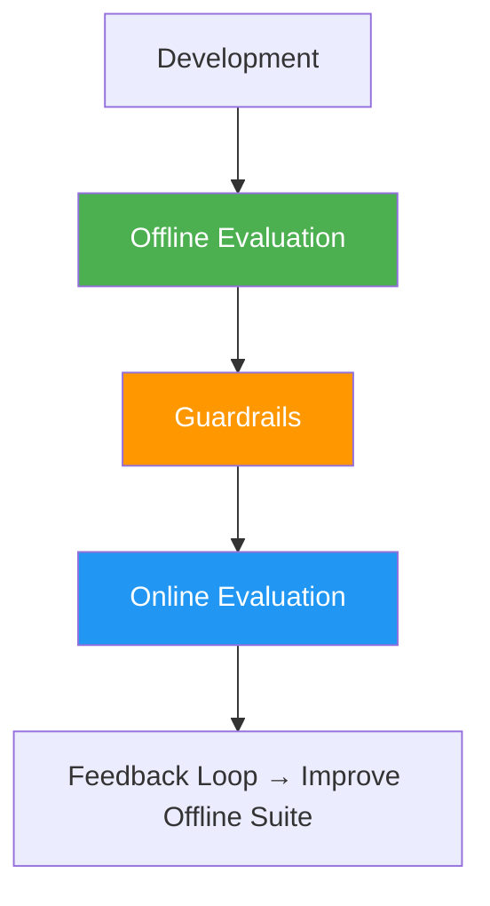
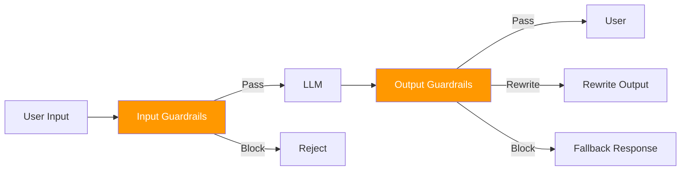
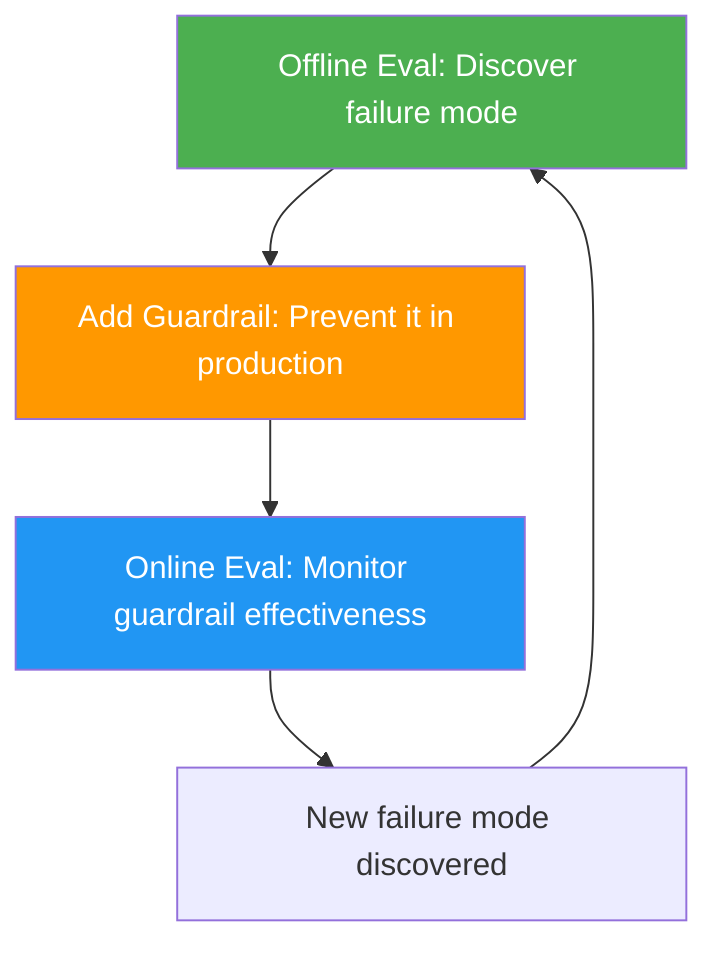

# 13 — LLM Evaluation & Guardrails

> "How do you know your AI feature is working?" — **The question that separates shippers from tinkerers.**

---

## The Three-Layer Evaluation Framework



| Layer | When | What It Tests | Analogy |
|---|---|---|---|
| **Offline Eval** | Before deployment | Does the system work on known scenarios? | Unit tests + integration tests |
| **Guardrails** | At request time | Is this request/response safe and valid? | Input validation + output sanitization |
| **Online Eval** | In production | Is the system working for real users? | Production monitoring + observability |

---

## Layer 1: Offline Evaluation

### What to Test

| Test Type | What It Verifies | Example |
|---|---|---|
| **Correctness** | Does the answer match expected output? | "Product X costs ฿500" → answer must contain ฿500 |
| **Faithfulness** | Is the answer grounded in the provided context? | Answer must not contain facts not in the retrieved documents |
| **Relevance** | Does the answer address the user's question? | "How do I reset my password?" → answer must be about password reset |
| **Safety** | Does the answer avoid harmful content? | Medical advice, hate speech, PII disclosure |
| **Format** | Does the output match the expected schema? | JSON with required fields, correct types |

### Evaluation Methods

| Method | How It Works | Best For | Limitation |
|---|---|---|---|
| **Exact match / Assertions** | Compare output to expected string or check conditions | Deterministic tasks (prices, formats) | Brittle for natural language |
| **LLM-as-Judge** | Use a stronger LLM to score the output | Open-ended responses, tone, helpfulness | Costly; potential judge bias |
| **Human evaluation** | Real humans review samples | Gold standard for quality | Slow, expensive, inconsistent |
| **Reference-based metrics** | ROUGE, BLEU, BERTScore | Summarization, translation | Doesn't capture factual correctness |
| **Retrieval metrics** | Recall@k, MRR, NDCG | RAG retrieval quality | Doesn't measure generation quality |

### Building an Eval Suite

```
eval_suite/
├── test_cases.json        # Input → expected output pairs
├── golden_dataset.json    # Known-good Q&A pairs
├── edge_cases.json        # Tricky scenarios (injection, out-of-scope, multi-lingual)
└── eval_runner.py         # Runs all tests, reports pass/fail
```

**Best practices:**
- Run on every PR (CI/CD integration)
- Build from real user queries (not synthetic ones)
- Include edge cases: injection attempts, empty queries, very long queries, Thai + English mix
- Track eval scores over time — don't let them degrade

---

## Layer 2: Guardrails (Runtime)

Guardrails are **inline checks** that run on every request and response. They're the safety net between the user and the LLM.

### Input Guardrails

| Guardrail | What It Checks | Action If Triggered |
|---|---|---|
| **Content moderation** | Harmful, illegal, or policy-violating content | Block request; return policy message |
| **Prompt injection detection** | Instruction-override patterns | Block request; flag for review |
| **PII detection** | Phone numbers, emails, ID numbers in user input | Mask or block; log for compliance |
| **Rate limiting** | Too many requests from one user/IP | 429 response; exponential backoff |
| **Input length** | Excessively long inputs | Truncate or reject |

### Output Guardrails

| Guardrail | What It Checks | Action If Triggered |
|---|---|---|
| **Hallucination detection** | Facts in output not in retrieved context | Flag; re-query; escalate to human |
| **PII/sensitive data leak** | Secrets, system prompts, internal data in output | Strip before sending to user |
| **Format validation** | Invalid JSON, missing required fields | Retry with format error feedback |
| **Toxicity/abuse** | Hate speech, harassment, harmful content | Block response entirely |
| **Medical/legal advice** | Claims of authority on regulated topics | Append disclaimer; or block |

### Guardrail Implementation Patterns



---

## Layer 3: Online Evaluation (Production Monitoring)

### What to Monitor

| Category | Metrics | Alert Triggers |
|---|---|---|
| **Performance** | Accuracy, handoff rate, user satisfaction (👍/👎) | Degradation below threshold |
| **Quality** | Hallucination rate, response relevance (sampled) | Spike in hallucination |
| **Latency** | Time to first token, total response time | SLA breach (>2s) |
| **Cost** | Cost per query, tokens per query | Budget overrun |
| **Usage** | Queries per minute/hour/day, active users | Anomaly (spike or drop) |
| **Safety** | Injection attempts blocked, harmful outputs flagged | Spike in attacks |

### Hallucination Detection Signals

| Signal | What It Means |
|---|---|
| **Fact in response NOT in retrieved context** | Likely hallucination |
| **Price/stock/date in response doesn't match source** | High-confidence hallucination — critical |
| **Response contains "I don't know" but the context has the answer** | Retrieval failure (false negative) |
| **Response is confident but completely wrong** | Most dangerous — needs human review trigger |

### Production Monitoring Stack

| Tool | What It Does |
|---|---|
| **Langfuse / LangSmith** | LLM tracing, cost tracking, evaluation |
| **Arize / Galileo** | LLM observability, drift detection, guardrails |
| **Evidently AI** | Data drift, model quality reports |
| **WhyLabs / whylogs** | Statistical profiling of LLM inputs/outputs |
| **Custom logging** | Log every query + context + response for offline analysis |

---

## Key Metrics Reference

### For RAG Systems

| Metric | Formula / Meaning | Target |
|---|---|---|
| **Recall@k** | Fraction of relevant docs in top-k retrieved | >90% |
| **Faithfulness** | % of claims in response supported by context | >95% |
| **Answer relevance** | Does the response address the question? | >90% |
| **Context precision** | Are retrieved docs relevant to the query? | >80% |

### For Chatbots

| Metric | Meaning | Target |
|---|---|---|
| **Deflection rate** | % of queries resolved without human handoff | >60% |
| **CSAT** | Customer satisfaction score (1-5) | >4.0 |
| **First response time** | Time to first meaningful response | <2s |
| **Resolution rate** | % of conversations where user's problem is solved | >80% |

---

## The Eval-to-Guardrail Lifecycle



**Example:** Offline eval discovers the LLM sometimes gives medical advice → Add "medical advice declination" guardrail → Monitor to see if it's triggered correctly → Discover that "mental health" queries are slipping through → Add to offline eval suite → Update guardrail.

---

## Key Takeaways

| Takeaway | Why It Matters |
|---|---|
| **Offline eval is your CI for AI** | Run on every PR; don't let quality degrade |
| **Guardrails are inline, not batch** | Every request must pass safety checks before reaching the user |
| **Online eval catches what offline misses** | Real users do things you never expected |
| **Hallucination detection needs context comparison** | Can't detect hallucination without comparing output to source |
| **The eval-to-guardrail lifecycle is continuous** | Every production failure becomes a new test case |

---

## Related

- [[10_LLM_Production_Patterns]] — The patterns you're evaluating
- [[11_Prompt_Engineering_and_Security]] — Guardrails overlap with injection defense
- [[12_AI_ROI_and_Roadmap]] — Measuring business impact
- [[09_AI_SE_Intersection]] — MLOps, model monitoring, A/B testing
- [[AI Overview]] — All AI topics