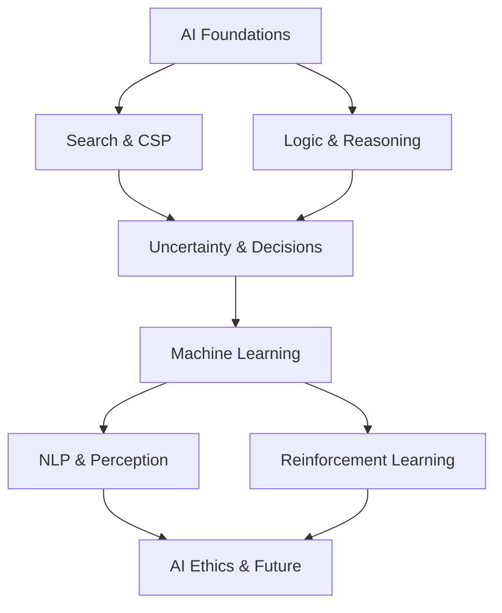

# Artificial Intelligence — Overview

> **Source:** *Artificial Intelligence: A Modern Approach* by Stuart Russell & Peter Norvig (Pearson)

## What Is This?

This vault covers **artificial intelligence** — the theory and practice of building intelligent agents. It fills the last gap in SWEBOK's Computing Foundations KA for AI/ML.

## Files

| File | Topics | Source |
|---|---|---|
| [[01_AI_Foundations]] | What is AI, agent types, rationality, PEAS, environment types, agent architectures | Ch 1–2 |
| [[02_Search_and_CSP]] | Uninformed/informed search, heuristics, local search, game playing, constraint satisfaction | Ch 3–6 |
| [[03_Logic_and_Reasoning]] | Propositional/FOL, inference, planning, knowledge representation | Ch 7–12 |
| [[04_Uncertainty_and_Decisions]] | Probability, Bayes' rule, Bayesian networks, HMMs, MDPs, utility theory, game theory | Ch 13–17 |
| [[05_Machine_Learning]] | Supervised, unsupervised, neural networks, deep learning, ensemble methods | Ch 18–20 |
| [[06_Reinforcement_Learning]] | Passive/active RL, Q-learning, temporal differences, policy search | Ch 21 |
| [[07_NLP_and_Perception]] | Language models, text classification, NLP, computer vision, robotics | Ch 22–25 |
| [[08_AI_Ethics_and_Future]] | Philosophy of AI, ethics, risks, present and future | Ch 26–27 |

## How These Topics Relate

## Reading Paths

| Your Goal | Start Here |
|---|---|
| **What is AI?** | [[01_AI_Foundations]] |
| **Problem-solving** | [[02_Search_and_CSP]] → [[03_Logic_and_Reasoning]] |
| **Machine learning** | [[05_Machine_Learning]] → [[06_Reinforcement_Learning]] |
| **NLP** | [[07_NLP_and_Perception]] |
| **AI in SE** | [[05_Machine_Learning]] → [[08_AI_Ethics_and_Future]] |
| **Probabilistic reasoning** | [[04_Uncertainty_and_Decisions]] |

## Related

- [[Computing Foundation Overview]] — All computing foundation topics
- [[Programming Language Theory/Programming Language Theory Overview|Programming Language Theory]] — Type systems and formal semantics
- [[Algorithm/Algorithm Overview|Algorithms]] — Algorithmic foundations
