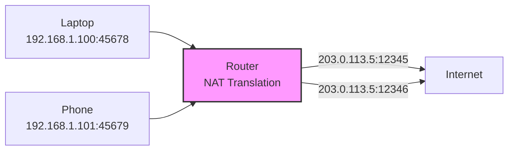

---
tags:
- networking
- programming
- protocols
---

# 01 IP Addressing & Subnetting

Every device on the internet has an IP address. Understanding how addressing works — and how subnetting controls routing — is essential for debugging connectivity issues.

---

## IPv4 — 32 Bits, Dotted Decimal

```
192.168.1.100
 │   │  │  └── Host (8 bits)
 │   │  └──── Host (8 bits)
 │   └────── Subnet (8 bits)
 └────────── Network (8 bits)

Binary: 11000000.10101000.00000001.01100100
```

### Address Classes (Legacy — Replaced by CIDR)

| Class | Range | Default Mask | Purpose |
|:-----:|-------|:----------:|---------|
| A | 1.0.0.0 – 126.255.255.255 | /8 | Large networks |
| B | 128.0.0.0 – 191.255.255.255 | /16 | Medium networks |
| C | 192.0.0.0 – 223.255.255.255 | /24 | Small networks |
| D | 224.0.0.0 – 239.255.255.255 | N/A | Multicast |
| E | 240.0.0.0 – 255.255.255.255 | N/A | Reserved |

---

## CIDR — Classless Inter-Domain Routing

> `/24` means "the first 24 bits are the network portion."

```
192.168.1.0/24
  Network: 192.168.1.0
  Mask:    255.255.255.0 (11111111.11111111.11111111.00000000)
  Hosts:   192.168.1.1 – 192.168.1.254 (254 usable)
  Broadcast: 192.168.1.255
```

### Subnet Reference

| CIDR | Subnet Mask | Hosts | Example |
|:----:|-------------|:-----:|---------|
| /8 | 255.0.0.0 | 16,777,214 | 10.0.0.0/8 |
| /16 | 255.255.0.0 | 65,534 | 172.16.0.0/16 |
| /24 | 255.255.255.0 | 254 | 192.168.1.0/24 |
| /28 | 255.255.255.240 | 14 | Small office subnet |
| /30 | 255.255.255.252 | 2 | Point-to-point link |
| /32 | 255.255.255.255 | 1 | Single host |

---

## Private vs Public Addresses

| Range | CIDR | Use |
|-------|------|-----|
| 10.0.0.0 – 10.255.255.255 | 10.0.0.0/8 | Large private networks |
| 172.16.0.0 – 172.31.255.255 | 172.16.0.0/12 | Medium private networks |
| 192.168.0.0 – 192.168.255.255 | 192.168.0.0/16 | Home/small office |
| 127.0.0.0 – 127.255.255.255 | 127.0.0.0/8 | Loopback (localhost) |
| 169.254.0.0 – 169.254.255.255 | 169.254.0.0/16 | APIPA (auto-config failure) |

---

## NAT — Network Address Translation

> Private IPs can't route on the public internet. NAT translates private ↔ public.



---

## IPv6 — 128 Bits, Hex Notation

```
2001:0db8:85a3:0000:0000:8a2e:0370:7334
 └────────────┬────────────┘ └─────────┬──────────┘
         Network Prefix            Interface ID
         (usually /64)           (usually /64)
```

| IPv4 | IPv6 |
|------|------|
| 32-bit address | 128-bit address |
| ~4.3 billion addresses | 340 undecillion addresses |
| NAT required | No NAT needed (enough addresses) |
| DHCP or manual config | SLAAC (auto-config) or DHCPv6 |

### IPv6 Transition Mechanisms

| Mechanism | How |
|-----------|-----|
| **Dual-stack** | Device runs IPv4 AND IPv6 simultaneously |
| **Tunneling** | IPv6 packets encapsulated in IPv4 |
| **NAT64** | Translate IPv6 ↔ IPv4 at the gateway |

---

## Sources

- RFC 1918 — Address Allocation for Private Internets
- RFC 4632 — Classless Inter-Domain Routing (CIDR)
- RFC 8200 — Internet Protocol Version 6 (IPv6)
