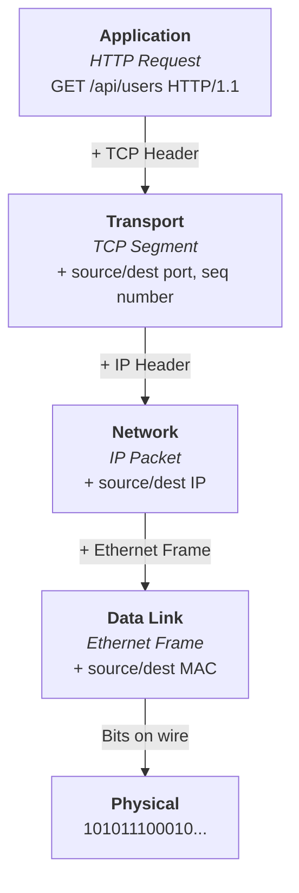
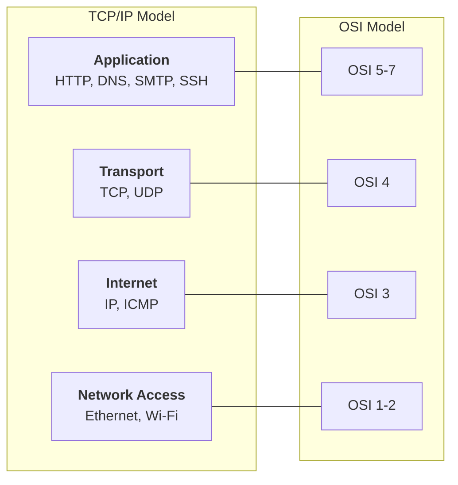

---
tags:
- networking
- programming
- protocols
---

# 01 OSI & TCP/IP Models

The OSI model is a reference. The TCP/IP model is reality. Both describe how data moves from an application on one machine to an application on another.

---

## The OSI 7-Layer Model

```
┌──────────────────────────────────┐
│ 7. Application   │ HTTP, DNS, SMTP, FTP  │ What the user sees
├──────────────────────────────────┤
│ 6. Presentation  │ TLS/SSL, JPEG, ASCII  │ Translation, encryption
├──────────────────────────────────┤
│ 5. Session       │ NetBIOS, RPC, Sockets  │ Connection management
├──────────────────────────────────┤
│ 4. Transport     │ TCP, UDP              │ Reliable delivery (or not)
├──────────────────────────────────┤
│ 3. Network       │ IP, ICMP, OSPF        │ Routing, addressing
├──────────────────────────────────┤
│ 2. Data Link     │ Ethernet, MAC, ARP    │ Hop-to-hop delivery
├──────────────────────────────────┤
│ 1. Physical      │ Cables, radio, fiber  │ Bits on the wire
└──────────────────────────────────┘
```

### Mnemonic (Top to Bottom)
> **A**ll **P**eople **S**eem **T**o **N**eed **D**ata **P**rocessing
> Application → Presentation → Session → Transport → Network → Data Link → Physical

---

## Encapsulation — How Data Flows



> **Encapsulation:** Each layer wraps the data from the layer above in its own header. At the destination, each layer strips its header and passes the remainder up.

---

## TCP/IP Model — What Actually Runs the Internet



---

## What Happens at Each Layer — Backend Developer's View

| Layer | What You Debug | Tool |
|-------|---------------|------|
| **Application** | HTTP errors (4xx, 5xx), DNS resolution | `curl`, `dig`, browser DevTools |
| **Transport** | Connection refused, timeouts, port already in use | `netstat`, `ss`, `telnet` |
| **Network** | Routing issues, unreachable hosts | `ping`, `traceroute`, `ip route` |
| **Data Link** | ARP issues, MAC addresses | `arp -a`, `ip link` |
| **Physical** | Cable unplugged, Wi-Fi down | ...look at the cable |

---

## Key Mental Models

| Concept | What It Means |
|---------|--------------|
| **Hop-by-hop** (Layers 1-3) | Each router along the path makes independent forwarding decisions |
| **End-to-end** (Layer 4) | TCP connection is between the two endpoints. Routers don't track it. |
| **Connection-oriented vs connectionless** | TCP = connection (handshake, state). UDP = connectionless (fire and forget). |
| **Reliable vs unreliable** | TCP guarantees delivery. UDP doesn't. HTTP/3 uses QUIC (UDP-based, reliable via app layer). |

---

## Sources

- ISO/IEC 7498-1:1994 — OSI Basic Reference Model
- RFC 1122 — Requirements for Internet Hosts
- Kurose & Ross. *Computer Networking: A Top-Down Approach.*
