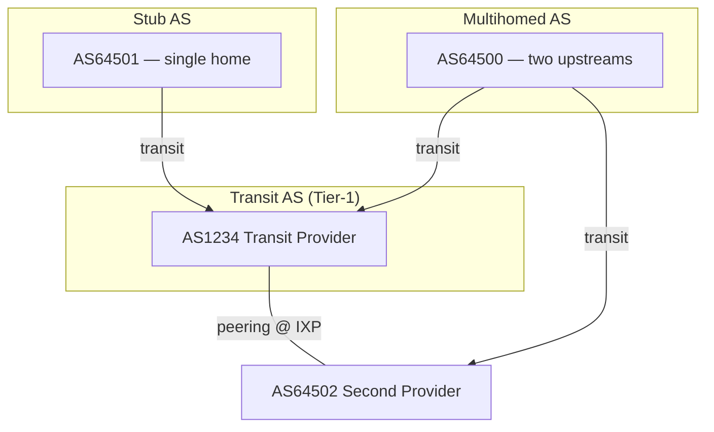

---
tags:
- networking
- programming
- protocols
- routing
---

# 015 Routing - BGP & OSPF

Routing is how packets find their way across the internet. OSPF routes inside your network; BGP routes between networks — the entire internet runs on it.

---

## Routing vs Forwarding

> Routing = *learning* the paths (control plane). Forwarding = *moving* packets using those paths (data plane).

| Concept | What It Is | Analogy |
|---------|-----------|---------|
| **RIB** (Routing Information Base) | Full routing table learned from protocols | Complete road atlas |
| **FIB** (Forwarding Information Base) | Best routes installed for actual forwarding | Turn-by-turn GPS |
| **Routing protocol** | Exchanges routes between routers (OSPF, BGP) | Traffic info broadcast |
| **Longest prefix match** | Most specific route wins (`/24` beats `0.0.0.0/0`) | "Main St 42" beats "somewhere in the city" |

---

## Interior vs Exterior Gateway Protocols

| | IGP (Interior) | EGP (Exterior) |
|--|---------------|----------------|
| **Scope** | Inside one Autonomous System (AS) | Between Autonomous Systems |
| **Protocol** | OSPF, IS-IS, (legacy: RIP, EIGRP) | BGP only |
| **Optimizes for** | Speed of convergence, lowest cost | Policy control, scale |
| **Trust** | Trusts all routers in the AS | Trusts nobody — verifies paths |

A one-liner each for the legacy protocols:

- **RIP** — distance-vector, hop count metric, max 15 hops, effectively dead.
- **EIGRP** — Cisco's hybrid protocol, fast convergence, now mostly replaced by OSPF.

---

## Static Routing

> Manually configured routes. Zero overhead, zero adaptability. Use for default routes to your ISP and tiny networks.

```bash
# Add a static route: via gateway 10.0.0.1
ip route add 192.168.50.0/24 via 10.0.0.1 dev eth0

# Default route — "send everything else here"
ip route add default via 10.0.0.1

# Show the routing table (this IS the RIB on Linux)
ip route show

# What route would the kernel actually use?
ip route get 8.8.8.8
```

**Administrative distance / route precedence:** when two sources advertise the same prefix, the lower preference value wins. Linux defaults: connected/static = 0–1, OSPF = 20, BGP = 20 (eBGP) / 200 (iBGP).

---

## OSPF — Open Shortest Path First

> Link-state IGP. Every router learns the *entire topology*, then runs Dijkstra (SPF) locally to compute the shortest path to every destination.

### How It Works

1. Routers form adjacencies with neighbors (Hello packets, multicast 224.0.0.5)
2. Each router floods **LSAs** describing its links → all routers build identical **LSDB** (link-state database)
3. Every router runs **Dijkstra's SPF** on the LSDB → installs best paths into FIB
4. Topology change → LSA re-flood → SPF recompute in seconds

### Key Concepts

| Concept | Purpose |
|---------|---------|
| **Areas** | Split the LSDB. Area 0 = backbone; all other areas must connect to it. Limits SPF scope and LSA flooding. |
| **DR/BDR** | Designated Router on multi-access segments (Ethernet) — reduces adjacencies from O(n²) to O(n). |
| **Cost metric** | Based on interface bandwidth: `cost = reference-bandwidth / interface-speed`. Lower = better. |
| **ABR / ASBR** | Area Border Router connects areas; AS Boundary Router injects external routes. |
| **OSPFv3** | Same algorithm, reworked for IPv6 (RFC 5340) — carries addresses in LSAs differently, runs per-link. |

### Convergence

OSPF converges in ~1–10s (hello/dead timers 10s/40s default). BFD (Bidirectional Forwarding Detection) cuts failure detection to milliseconds.

---

## BGP — Border Gateway Protocol

> Path-vector EGP. The internet's glue: ~70,000+ Autonomous Systems exchanging reachability via TCP sessions (port 179). BGP is the *only* protocol holding the global internet together.

### Autonomous Systems & Peering

An **AS** is a network under one administrative policy, identified by a 16- or 32-bit **ASN** (e.g. AS15169 = Google).

| Relationship | What It Means | Money |
|--------------|--------------|-------|
| **Transit** | Provider carries your traffic *and* traffic to everyone else | You pay |
| **Peering** | Two ASes exchange traffic between *their own* customers only | Usually settlement-free |
| **IXP** | Internet Exchange Point — a big L2 fabric where hundreds of ASes peer cheaply | Port fee |



- **Stub AS** — one connection to the internet (most companies)
- **Multihomed AS** — 2+ upstreams for redundancy (needs BGP)
- **Transit AS** — carries traffic for others (ISPs)

### eBGP vs iBGP

| | eBGP | iBGP |
|--|------|------|
| Between | Different ASes | Routers in the *same* AS |
| TTL | 1 (directly connected, usually) | Any |
| AS-path | Prepends own ASN on advertise | Unchanged |
| Rule | — | Full mesh required (no route reflectors) — iBGP doesn't re-advertise iBGP-learned routes |

### Key Attributes

| Attribute | Type | Meaning |
|-----------|------|---------|
| **AS-path** | Well-known | List of ASes traversed. Shorter = better. Also loop prevention: reject your own ASN in path. |
| **Local-preference** | Well-known (iBGP only) | Exit preference inside your AS. Higher = better. |
| **MED** (Multi-Exit Discriminator) | Optional | Hint to a neighbor AS which of your entry points to use. Lower = better. |
| **Next-hop** | Well-known | IP of the router to forward to. iBGP doesn't change it — next-hop reachability is a classic iBGP gotcha. |
| **Weight** | Cisco-local | Like local-pref but router-scoped, not propagated. |

### Route Selection Order (simplified)

```
1. Highest weight (Cisco-local)
2. Highest local-preference
3. Locally originated (network/redistribute) > learned
4. Shortest AS-path
5. Lowest origin type (IGP < EGP < incomplete)
6. Lowest MED (from same neighbor AS)
7. eBGP > iBGP
8. Lowest IGP cost to next-hop
9. Oldest route / lowest router-ID
```

**BGP selects on policy, not latency.** A "longer" path may win because someone set local-pref. This is deliberate: BGP encodes business relationships, not physics.

### BGP Hijacking & Security

> BGP has **zero built-in authentication**. Any AS can announce any prefix — and routers believe it.

| Incident | What Happened |
|----------|--------------|
| **YouTube/Pakistan Telecom (2008)** | Pakistan announced a more-specific `/24` for YouTube → global blackhole for hours |
| **Amazon Route 53 (2018)** | Hijacked BGP routes redirected DNS traffic to steal ~$150k in cryptocurrency |
| **Facebook outage (2021)** | Self-inflicted: BGP withdrawals removed Facebook's prefixes globally (DNS servers became unreachable) |

**Mitigations:**

- **RPKI** (RFC 6480) — cryptographically signed **ROAs** (Route Origin Authorizations) declare which AS may originate which prefix. Validators mark announcements Valid / Invalid / NotFound.
- **ROV** (Route Origin Validation) — routers dropping RPKI-Invalid routes. Adoption growing (~50%+ of routes ROA-signed by 2025).
- **BGPsec** (RFC 8205) — signs the full AS-path. Still niche; expensive to deploy.

---

## traceroute — Routing Observability

> Sends packets with incrementing TTL; each router that drops a TTL-expired packet replies with ICMP Time Exceeded → you see the path hop by hop.

```bash
# Classic UDP traceroute (Linux)
traceroute 8.8.8.8

# ICMP-based (survives UDP filters) — most useful
traceroute -I 8.8.8.8
mtr -rwzbc 10 cloudflare.com   # traceroute + ping stats combined

# Show BGP ASNs per hop (who owns each router?)
traceroute -A 1.1.1.1
```

`* * *` means the hop filters ICMP/that probe type — the packet still transits, it just doesn't answer.

---

## Practical: Linux Routing Commands

```bash
ip route show                    # RIB contents
ip route get 93.184.216.34       # exact FIB lookup for one destination
ip rule show                     # policy routing rules (multiple tables)
ip route show table all          # every route in every table

ss -tan state established        # active TCP connections (see sockets note)
ip neigh show                    # ARP/NDP cache — L2 next-hop resolution

# BIRD/FRR — real routing daemons
birdc show protocols             # BIRD: protocol session state
birdc show route for 8.8.8.8 all # BIRD: why this route won
vtysh -c 'show ip bgp summary'   # FRR: BGP neighbor state
vtysh -c 'show ip ospf neighbor' # FRR: OSPF adjacencies
```

See [[036 Troubleshooting Tools]] for the wider diagnostic toolkit and [[012 Ethernet, Switching & VLANs]] for how the next-hop is resolved at L2.

---

## Sources

- RFC 2328 — OSPFv2
- RFC 5340 — OSPF for IPv6 (OSPFv3)
- RFC 4271 — BGP-4
- RFC 6480 — RPKI Architecture
- RFC 8205 — BGPsec Protocol Specification
- *Routing TCP/IP Vol. II* — Doyle, CCIE
- BIRD docs — https://bird.network.cz/
