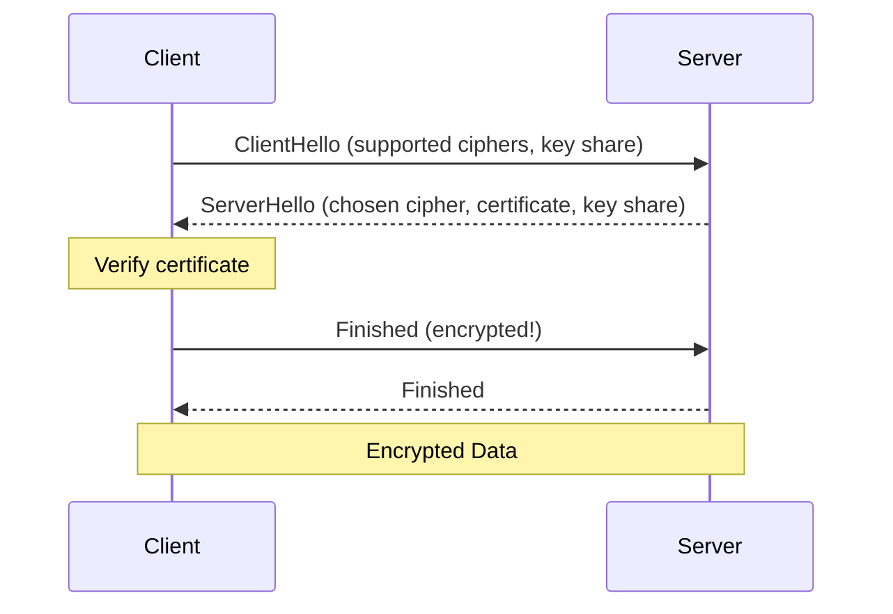

---
tags:
- networking
- programming
- protocols
---

# 02 HTTP & HTTPS

HTTP is the language of the web. Every API call, every page load, every WebSocket connection starts as an HTTP request. Understanding it deeply makes you a better backend developer.

---

## The Anatomy of an HTTP Request

```
POST /api/orders HTTP/1.1                    ← Method, Path, Version
Host: api.example.com                        ← Headers
Authorization: Bearer eyJhbGciOi...
Content-Type: application/json
Content-Length: 89

{"customer_id": 42, "items": [{"product": "Widget", "qty": 2}]}  ← Body
```

### HTTP Methods

| Method | Safe? | Idempotent? | Purpose |
|--------|:---:|:---:|---------|
| **GET** | ✅ | ✅ | Read. No side effects. |
| **POST** | ❌ | ❌ | Create. Each call creates new resource. |
| **PUT** | ❌ | ✅ | Replace (full update). |
| **PATCH** | ❌ | ❌ | Partial update. |
| **DELETE** | ❌ | ✅ | Remove. |
| **HEAD** | ✅ | ✅ | GET but only headers (no body). |
| **OPTIONS** | ✅ | ✅ | CORS preflight. "What methods are allowed?" |

> **Idempotent:** Same request, same result. Safe to retry. POST is not idempotent — retrying creates duplicates.

---

## Status Codes

| Range | Meaning | Examples |
|:-----:|---------|---------|
| **1xx** | Informational | 100 Continue, 101 Switching Protocols (WebSocket) |
| **2xx** | Success | 200 OK, 201 Created, 204 No Content |
| **3xx** | Redirection | 301 Moved Permanently, 302 Found, 304 Not Modified |
| **4xx** | Client Error | 400 Bad Request, 401 Unauthorized, 403 Forbidden, 404 Not Found, 429 Too Many Requests |
| **5xx** | Server Error | 500 Internal Server Error, 502 Bad Gateway, 503 Service Unavailable, 504 Gateway Timeout |

---

## Key Headers

| Header | Purpose |
|--------|---------|
| `Host` | Which site? (required for virtual hosting) |
| `Authorization` | Bearer token, Basic auth |
| `Content-Type` | `application/json`, `multipart/form-data` |
| `Content-Length` | Body size in bytes |
| `Accept` | What response format the client wants |
| `Cache-Control` | `no-cache`, `max-age=3600` |
| `User-Agent` | Client identification |
| `Cookie` / `Set-Cookie` | Session management |
| `CORS headers` | `Access-Control-Allow-Origin`, etc. |

---

## HTTPS — HTTP Over TLS

### TLS 1.3 Handshake



> TLS 1.3: 1 round trip (1-RTT). TLS 1.2: 2 round trips (2-RTT). **~100ms saved on every new connection.**

---

## HTTP/1.1 vs HTTP/2 vs HTTP/3

| | HTTP/1.1 | HTTP/2 | HTTP/3 |
|---|:---:|:---:|:---:|
| **Transport** | TCP | TCP | QUIC (UDP) |
| **Multiplexing** | ❌ (head-of-line blocking) | ✅ (streams) | ✅ (no HoL blocking) |
| **Header Compression** | ❌ | ✅ (HPACK) | ✅ (QPACK) |
| **Server Push** | ❌ | ✅ | ✅ |
| **TLS** | Optional | Required (browsers) | Built-in (QUIC) |
| **Year** | 1997 | 2015 | 2022 |

---

## Spring Boot HTTP Config

```yaml
server:
  port: 8080
  compression:
    enabled: true
  http2:
    enabled: true   # Requires TLS
  ssl:
    key-store: classpath:keystore.p12
    key-store-password: ${KEYSTORE_PASSWORD}
```

```java
// Custom status codes
@ResponseStatus(HttpStatus.CREATED)
@PostMapping("/orders")
public Order create(@Valid @RequestBody CreateOrderRequest request) {
    return orderService.create(request);
}
```

---

## Sources

- RFC 7230-7235 — HTTP/1.1
- RFC 7540 — HTTP/2
- RFC 9000 — QUIC (HTTP/3)
