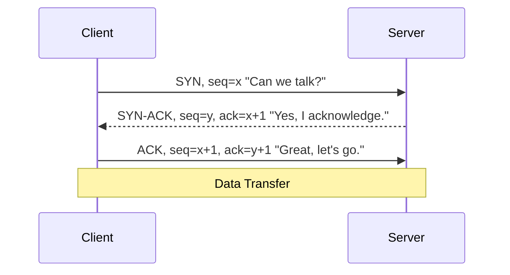
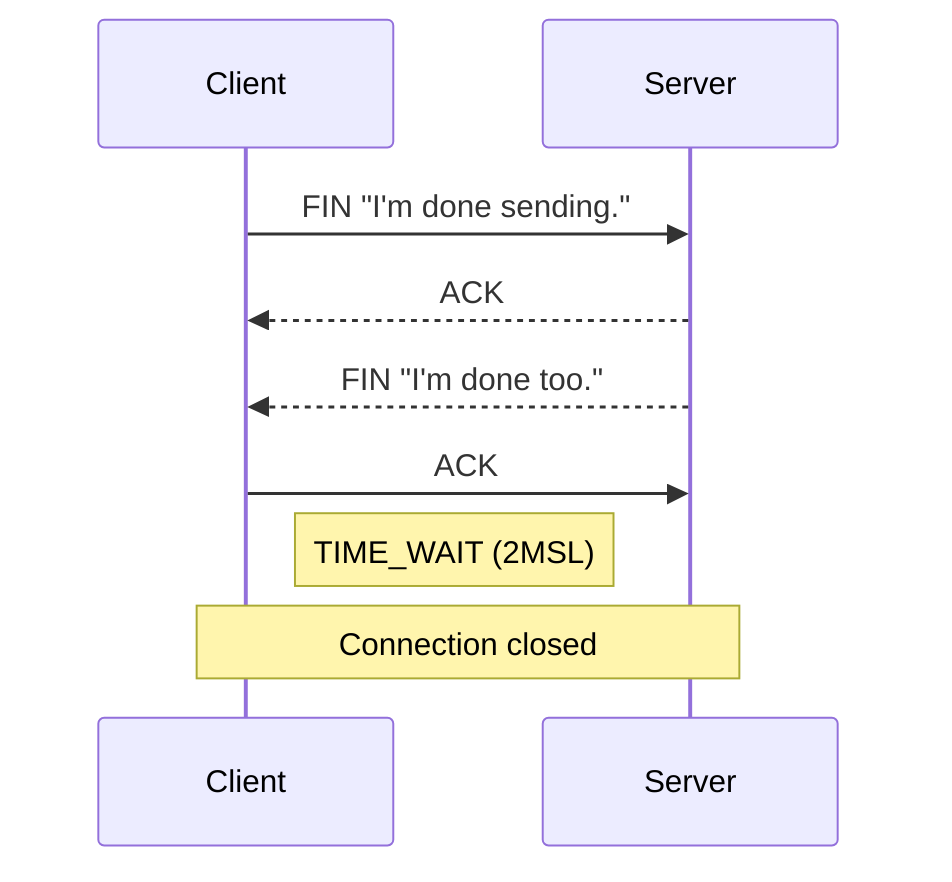

---
tags:
- networking
- programming
- protocols
---

# 02 TCP & UDP

TCP is the reliable workhorse. UDP is the fast-and-loose alternative. Every backend developer must know when to use each.

---

## TCP — Transmission Control Protocol

> Connection-oriented, reliable, ordered, error-checked delivery of a stream of bytes.

### The 3-Way Handshake



### The 4-Way Teardown



---

## TCP Features

| Feature | How |
|---------|-----|
| **Flow Control** | Receiver advertises window size. Sender doesn't overwhelm it. |
| **Congestion Control** | Slow start, congestion avoidance, fast retransmit. |
| **Error Detection** | Checksums on every segment. Corrupt data is retransmitted. |
| **Ordering** | Sequence numbers guarantee data arrives in order. |
| **Retransmission** | Unacknowledged data is resent after timeout. |

### Common TCP States (from `netstat`)

| State | Meaning |
|-------|---------|
| **LISTEN** | Server waiting for connections |
| **SYN_SENT** | Client sent SYN, waiting for SYN-ACK |
| **ESTABLISHED** | Connection active, data flowing |
| **TIME_WAIT** | Waiting 2MSL before closing (prevents old segments) |
| **CLOSE_WAIT** | Remote side closed. Local app hasn't closed yet (LEAK!) |

---

## UDP — User Datagram Protocol

> Connectionless, unreliable, no ordering, no retransmission. Just sends datagrams.

| TCP | UDP |
|-----|-----|
| Connection-oriented (handshake) | Connectionless |
| Guaranteed delivery | Best-effort delivery |
| Ordered | No ordering guarantee |
| Flow + congestion control | None — you control rate |
| Heavy header (20 bytes) | Light header (8 bytes) |
| HTTP, SSH, SMTP, FTP | DNS, VoIP, video streaming, gaming, DHCP |

### When to Use UDP

| ✅ Use UDP | ❌ Use TCP Instead |
|-----------|------------------|
| Real-time (VoIP, video calls) — lost packet < delayed retransmission | File transfers — missing data = corrupt file |
| DNS queries (small, one-packet, fast) | HTTP — web pages must be complete |
| Multiplayer games — latest state > complete history | Email — must arrive intact |
| DHCP — broadcast discovery | Database replication |

---

## QUIC — The Best of Both

> HTTP/3 uses QUIC (built on UDP). It adds TCP-like reliability at the application layer — no head-of-line blocking, faster handshakes, built-in TLS.

---

## Spring Boot — TCP Timeouts

```yaml
server:
  tomcat:
    connection-timeout: 20000   # 20s — close idle connections
    keep-alive-timeout: 5000    # 5s after last request
```

```java
// Custom socket timeout for external HTTP calls
RestTemplate template = new RestTemplate();
SimpleClientHttpRequestFactory factory = new SimpleClientHttpRequestFactory();
factory.setConnectTimeout(5000);   // 5s to establish TCP connection
factory.setReadTimeout(10000);     // 10s to receive response
template.setRequestFactory(factory);
```

---

## Sources

- RFC 793 — TCP
- RFC 768 — UDP
- RFC 9000 — QUIC
