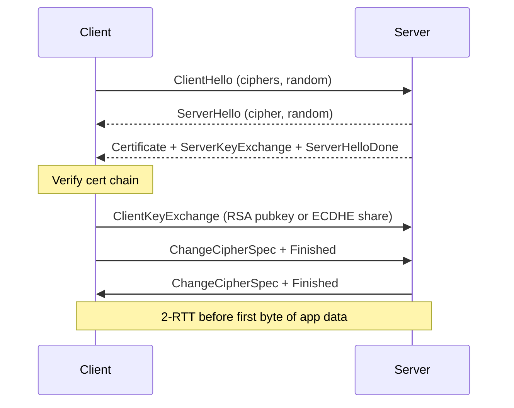
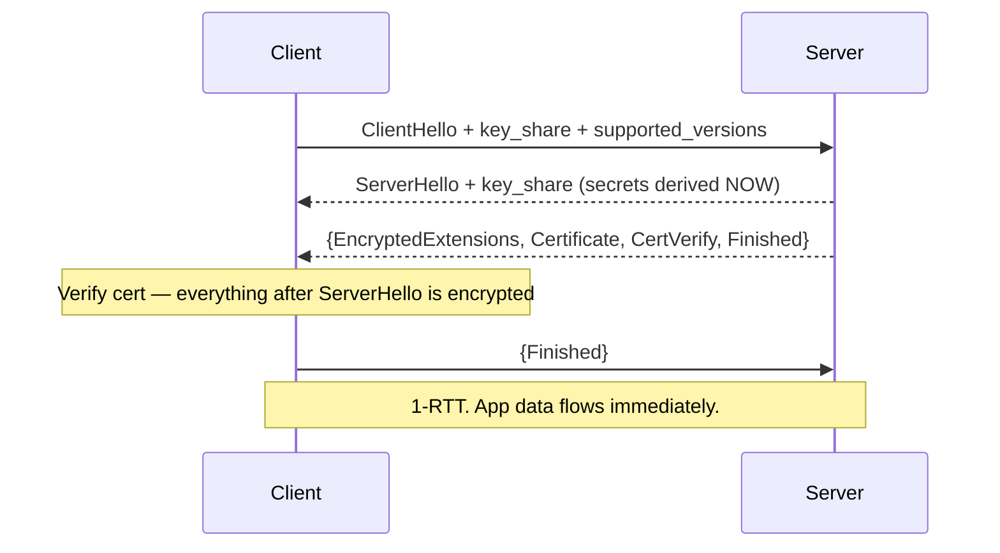
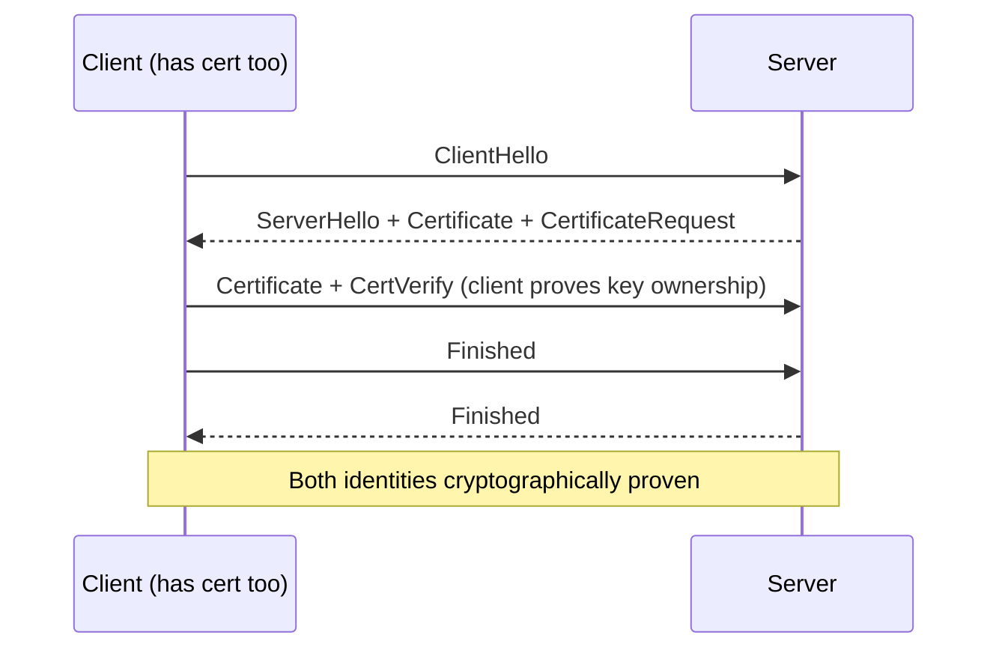

---
tags:
- networking
- security
- protocols
- tls
- pki
---

# 023 TLS & PKI Deep Dive

TLS is why `https://` works. It gives you **confidentiality** (nobody can read), **integrity** (nobody can tamper), and **authenticity** (you're really talking to who you think). PKI is the machinery that makes authenticity possible — certificates, chains, and trust anchors. Every handshake in [[022 HTTP & HTTPS]] runs on this.

---

## Why TLS

| Property | Without TLS | With TLS |
|----------|-------------|----------|
| **Confidentiality** | Coffee-shop wifi sees your password | AES-GCM / ChaCha20 encrypts everything |
| **Integrity** | Attacker rewrites bytes in flight | AEAD tag detects any modification |
| **Authenticity** | DNS poisoning → fake server | X.509 cert chain proves server identity |
| **Forward secrecy** | Record today, decrypt later | Ephemeral keys die with the session |

> TLS 1.3 (RFC 8446) removed everything broken: RSA key exchange, CBC, RC4, SHA-1, renegotiation, compression (CRIME), static DH. Only AEAD ciphers + ECDHE remain.

---

## TLS 1.2 vs TLS 1.3 Handshake

### TLS 1.2 — 2 round trips



### TLS 1.3 — 1 round trip (0-RTT on resumption)



**TLS 1.3 improvements:**
- **1-RTT** handshake (guesses the key share in ClientHello; server confirms in ServerHello)
- **0-RTT resumption**: returning client sends app data in its first packet (replay risk — only for idempotent requests)
- **No RSA key exchange** → perfect forward secrecy is mandatory
- **Encrypted metadata**: certificate, extensions hidden from observers (only SNI was left in the clear — see ECH below)

---

## Cipher Suites Anatomy

TLS 1.2 name format: `TLS_ECDHE_RSA_WITH_AES_256_GCM_SHA384`

| Part | Meaning |
|------|---------|
| `ECDHE` | Key exchange — ephemeral elliptic-curve Diffie-Hellman (PFS!) |
| `RSA` | Authentication — cert signs the handshake (identity, not key exchange) |
| `AES_256_GCM` | AEAD cipher — encrypt + authenticate in one pass |
| `SHA384` | PRF hash for key derivation |

TLS 1.3 collapses this to just `TLS_AES_256_GCM_SHA384` — key exchange and auth moved to extensions, always ECDHE + certs.

**The two AEAD ciphers that matter (2025):**

| Cipher | Speed | Notes |
|--------|-------|-------|
| **AES-128/256-GCM** | Fastest with AES-NI hardware | Default on x86/ARM servers |
| **ChaCha20-Poly1305** | Fastest without AES-NI | Mobile, older ARM. Google's answer to hardware gaps |

> **PFS (Perfect Forward Secrecy):** ephemeral DH keys are generated per session and discarded. Steal the server's private key tomorrow → past recordings still safe. RSA key exchange (now banned) encrypted the premaster secret with the long-term key — one key leak decrypts all history. This is why "harvest now, decrypt later" made PFS non-optional.

---

## X.509 Certificates

A certificate = **public key + identity + CA's signature** over the whole thing.

```
Certificate:
    Data:
        Version: 3
        Serial Number: 04:a1:...          ← unique per CA
        Signature Algorithm: ecdsa-with-SHA384
        Issuer: C=US, O=Let's Encrypt, CN=R11    ← who signed it
        Validity:
            Not Before: Sep  1 00:00:00 2025 GMT
            Not After : Nov 30 23:59:59 2025 GMT ← 90 days for Let's Encrypt
        Subject: CN=api.example.com              ← who it belongs to (legacy field)
        Subject Public Key Info: ECDSA P-256     ← the actual key
        X509v3 extensions:
            Subject Alternative Name:            ← THE field browsers check
                DNS:api.example.com, DNS:www.example.com
            Key Usage: Digital Signature
            Extended Key Usage: TLS Web Server Authentication
            Basic Constraints: CA:FALSE          ← leaf, can't sign others
            Authority Info Access: OCSP, CA Issuers
    Signature Algorithm: ecdsa-with-SHA384
    Signature Value: 30:65:...                   ← CA's seal
```

- **SAN replaced CN** for hostname matching since ~2017 (Chrome ignores CN entirely)
- **Key Usage / EKU** restrict what the cert may do (sign vs encrypt vs server auth vs client auth)
- **CSR (Certificate Signing Request)**: you generate a key pair locally, send pubkey + identity to the CA signed with your private key. The private key never leaves your machine.

---

## Chain of Trust

```
Root CA (self-signed, offline, in OS/browser trust store)
   └── Intermediate CA (signed by root — does the daily work)
          └── Leaf / end-entity cert (signed by intermediate — your server)
```

| Concept | Detail |
|---------|--------|
| **Trust store** | OS (`/etc/ssl/certs`, Windows cert store) + browser lists (Mozilla CCADB). Root CAs pre-installed = trust anchors |
| **Why intermediates** | Root key stays in an HSM, offline. Compromise radius of daily signing keys is limited; roots can be cross-signed during transitions |
| **Validation** | Client walks leaf → intermediate → trusted root, checking signatures, validity dates, and name constraints at each step |
| **Incomplete chain** | #1 self-inflicted failure: server sends only the leaf. Browsers can fetch missing intermediates (AIA), `openssl`/`curl`/mobile often can't → works in Chrome, fails in your app |
| **Self-signed** | Own root, own leaf. Fine for internal mTLS/dev if you distribute your root; terrible for the public web (everyone must manually trust it) |

---

## CAs, Let's Encrypt & ACME

Let's Encrypt (ISRG) issues ~400M certs via **ACME** (RFC 8555) — fully automated, free, 90-day lifetime.

| Challenge | How it proves control | Use when |
|-----------|----------------------|----------|
| **HTTP-01** | Serve `http://example.com/.well-known/acme-challenge/<token>` | Public web server on :80. One cert per hostname, no wildcards |
| **DNS-01** | Create `_acme-challenge.example.com` TXT record | Wildcards (`*.example.com`), servers behind NAT/firewall, no port 80 |
| TLS-ALPN-01 | Special self-signed cert on :443 | Rare; HTTP-01 blocked but DNS automated is hard |

```bash
# certbot: obtain + auto-renew (systemd timer or cron renews at ~day 60)
sudo certbot --nginx -d example.com -d www.example.com
sudo certbot certonly --dns-cloudflare -d '*.example.com' -d example.com  # wildcard via DNS-01

# Test renewal actually works — the #1 certbot production incident
sudo certbot renew --dry-run
```

> 90-day certs aren't a limitation, they're the point: shorter windows shrink exposure to key compromise and force automation. Commercial CAs now sell 1-year certs too; **the CA/B Forum voted to shorten all public certs to 47 days by March 2029** — manual renewal is dead, ACME or it didn't happen.

---

## Certificate Revocation

Problem: key leaked or CA mis-issued *before* expiry. How do clients learn a cert is dead?

| Mechanism | How | Verdict |
|-----------|-----|---------|
| **CRL** | Client downloads CA's full revoked-serial list | Huge files, stale caches. Deprecated |
| **OCSP** | Client asks CA "serial X revoked?" per connection | Leaks your browsing to the CA, adds latency, soft-fail = useless. Deprecated |
| **OCSP stapling** | *Server* fetches the signed OCSP response and staples it to the handshake | Privacy-preserving, fast. The good one |
| **OCSP must-staple** | Cert extension: reject the handshake if no staple | Closes soft-fail hole |

**The 2025/2026 reality:** browsers (Chrome, Safari, Firefox) have all stopped doing client-side CRL/OCSP checks — too slow, too leaky, soft-fail defeated the security anyway. The industry answer is **short-lived certificates** (~6–7 days) where revocation = just wait for expiry. Chrome requires CRLite-style local revocation sets for longer certs; CA/B Forum rules shrink max validity to **47 days by 2029**, making revocation infrastructure mostly moot.

---

## mTLS — Mutual TLS

Standard TLS: client verifies server, server is anonymous. **mTLS: both sides present certificates.**



- Client cert needs `Extended Key Usage: TLS Web Client Authentication`
- Server pins a trust store of acceptable client CAs (often its own internal CA)
- **Where it lives in 2025:** service meshes (Istio/Linkerd auto-mTLS between every pod), zero-trust networks (SPIFFE/SPIRE workloads identities), API gateways replacing bearer tokens for service-to-service
- No passwords, no tokens to leak — identity *is* the connection. See [[035 Network Security]] for the zero-trust model mTLS enables

```bash
# Test mTLS endpoint
openssl s_client -connect api.internal:8443 \
  -cert client.crt -key client.key -CAfile ca.crt
```

---

## SNI & Encrypted Client Hello

- **SNI** (Server Name Indication): ClientHello carries the hostname in cleartext so one IP:443 can serve many certs (virtual hosting for TLS). This is the last big metadata leak — your ISP sees every domain you visit even with TLS 1.3.
- **ECH (Encrypted Client Hello, RFC 9460, Cloudflare/Firefox deployed)**: the real SNI is encrypted inside an "inner" ClientHello, wrapped with a key fetched via **DNS HTTPS/SVCB records** (needs DoH). The outer SNI shows only a generic cover name. By 2025 ECH is live in Firefox + Chrome and major CDNs, but not universal — middleboxes and censors pushed back hard.

---

## Key Types: RSA vs ECDSA vs Ed25519

| | RSA-2048 | RSA-4096 | ECDSA P-256 | Ed25519 |
|---|:---:|:---:|:---:|:---:|
| **Public key size** | 256 B | 512 B | 65 B | 32 B |
| **Signature size** | 256 B | 512 B | ~70 B | 64 B |
| **Sign speed** | Slow | Very slow | Fast | Fast |
| **Handshake cost** | Heavy on CPU | Heavier | Light | Lightest |
| **TLS support** | Universal | Universal | Universal | Growing (OpenSSL 3.x, not yet all CAs/browsers for public certs) |
| **~Equivalent strength** | 112-bit | 140-bit | 128-bit | 128-bit |

> **2025 default: ECDSA P-256** for public TLS certs (smaller chain = faster handshakes on mobile, Let's Encrypt issues them natively). RSA-2048+ when a client is ancient. Ed25519 for SSH and internal mTLS.

---

## Session Resumption & ALPN

### Resumption — avoid paying handshake tax on every reconnect

| Mechanism | Version | How |
|-----------|---------|-----|
| **Session ID** | ≤1.2 | Server caches state, client presents ID. Doesn't scale behind LBs |
| **Session tickets** | 1.2 / 1.3 PSK | Server encrypts state into a ticket, client stores it. Stateless for server — but ticket key becomes a PFS weak point (rotate every few hours) |
| **PSK + 0-RTT** | 1.3 | Resumption derives new keys from PSK + fresh ECDHE; first flight can carry app data |

### ALPN — Application-Layer Protocol Negotiation

One TCP+TLS connection, but is it HTTP/1.1, HTTP/2, or HTTP/3-over-QUIC? Client lists protocols in the ClientHello extension (`h2, http/1.1`); server picks one. **That's the entire HTTP/2 negotiation** — no extra round trip, no upgrade dance.

```bash
openssl s_client -connect example.com:443 -alpn h2,http/1.1 2>/dev/null | grep ALPN
# ALPN protocol: h2
```

---

## Practical openssl / curl Commands

```bash
# Full handshake debug — protocol, cipher, chain, SNI
openssl s_client -connect example.com:443 -servername example.com

# Force a version (test that TLS 1.0/1.1 are really disabled)
openssl s_client -connect example.com:443 -tls1_2

# Inspect a cert without connecting (from file)
openssl x509 -in cert.pem -noout -text

# Pipe from live connection: expiry, subject, SANs
echo | openssl s_client -connect example.com:443 -servername example.com 2>/dev/null \
  | openssl x509 -noout -dates -subject -ext subjectAltName

# Verify the full chain the server sends (catches missing intermediates)
openssl s_client -connect example.com:443 -servername example.com -showcerts < /dev/null
# Look for: "Verify return code: 0 (ok)" and count the certs in the chain

# Generate CSR the proper way (never email private keys!)
openssl req -new -newkey ec -pkeyopt ec_paramgen_curve:prime256v1 \
  -keyout key.pem -out csr.pem -nodes -subj "/CN=api.example.com"

# curl: verbose TLS negotiation + pin a cert
curl -v https://example.com
curl --cacert internal-ca.pem https://api.internal:8443/health

# Expiry monitoring one-liner (alert < 14 days) — wire into cron/Prometheus blackbox
expiry=$(echo | openssl s_client -connect example.com:443 -servername example.com 2>/dev/null \
  | openssl x509 -noout -enddate | cut -d= -f2)
echo "expires: $expiry"
```

---

## Common Failures & Diagnosis

| Symptom | Cause | Diagnosis / Fix |
|---------|-------|-----------------|
| `certificate has expired` | Cert past Not After, or **server clock skew** | `openssl x509 -noout -dates`; check `date` on both ends — NTP fixes surprising amounts of TLS |
| `hostname mismatch` / `CN invalid` | Cert doesn't cover the name you connected to (www vs apex, wildcard doesn't cross dots: `*.example.com` ≠ `a.b.example.com`) | Check SAN list, not CN. Fix the cert or the hostname |
| `unable to get local issuer certificate` | **Incomplete chain** — server sent leaf only | `openssl s_client -showcerts`; configure fullchain.pem (leaf + intermediates) |
| `unknown ca` / self-signed in chain | Internal CA not in client trust store | Distribute CA cert; add to `/etc/ssl/certs` or app truststore. Never "disable verification" |
| `handshake failure`, `no shared cipher` | Client wants TLS1.3/modern suites, server only offers old ones (or vice versa) | `openssl s_client -tls1_2 -cipher DEFAULT`; align min protocol + cipher list |
| Works in browser, fails in app | Browser auto-fetches missing intermediates (AIA); your HTTP client doesn't | Same as incomplete chain. Test with `curl`, not Chrome |
| SNI-related: wrong cert served | LB/backend got no SNI (old client, IP-based connect) | Always pass `-servername` / set Host properly |

---

## Sources

- RFC 8446 — The Transport Layer Security (TLS) Protocol Version 1.3
- RFC 5246 — TLS 1.2 (historic)
- RFC 5280 — X.509 PKI Certificate Profile
- RFC 8555 — Automatic Certificate Management Environment (ACME)
- RFC 6066 — TLS Extensions (SNI), RFC 7301 — ALPN
- RFC 9460 — Encrypted Client Hello (ECH)
- RFC 6960/6961 — OCSP / OCSP Stapling
- CA/Browser Forum Ballot SC-081 — reducing max certificate lifetimes (47 days by 2029)
- Let's Encrypt documentation — challenges & certificate lifecycle
- *Bulletproof TLS and PKI* — Ivan Ristić

Related: [[022 HTTP & HTTPS]] · [[035 Network Security]] · [[021 TCP & UDP]]
