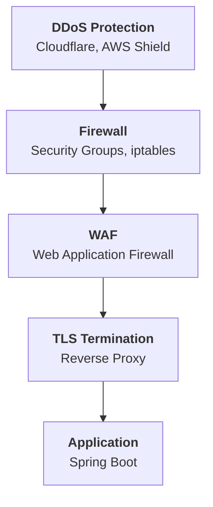

---
tags:
- networking
- programming
- protocols
---

# 03 Network Security

Security at the network layer: protecting data in transit, blocking attackers, and designing zero-trust architectures.

---

## The Defense Stack



---

## Firewalls

> Controls what traffic can reach your server based on IP, port, and protocol.

```bash
# iptables — Linux firewall
# Allow SSH from specific IP
iptables -A INPUT -p tcp -s 203.0.113.5 --dport 22 -j ACCEPT

# Allow HTTP/HTTPS from anywhere
iptables -A INPUT -p tcp --dport 80 -j ACCEPT
iptables -A INPUT -p tcp --dport 443 -j ACCEPT

# Block everything else
iptables -A INPUT -j DROP
```

### AWS Security Groups

```json
{
    "SecurityGroup": "web-sg",
    "Inbound": [
        {"Port": 443, "Source": "0.0.0.0/0",   "Description": "HTTPS"},
        {"Port": 22,  "Source": "10.0.0.0/8",    "Description": "SSH — internal only"},
        {"Port": 8080, "Source": "sg-loadbalancer", "Description": "Only from LB"}
    ]
}
```

| Rule | Why |
|------|-----|
| Never expose databases (3306, 5432, 6379) to `0.0.0.0/0` | Data breach waiting to happen |
| SSH only from internal / VPN IPs | Brute force attacks target port 22 |
| App ports (8080) only from load balancer security group | Direct access bypasses WAF |

---

## WAF — Web Application Firewall

> Firewall at the HTTP level. Blocks SQL injection, XSS, CSRF, and other OWASP attacks before they reach your app.

| WAF | Type |
|-----|------|
| **AWS WAF** | Cloud-native. Rules + rate limiting. |
| **Cloudflare WAF** | CDN + WAF. Managed rules. |
| **ModSecurity** | Open-source. Apache/NGINX module. |

---

## DDoS Protection

| Attack Type | What It Does | Defense |
|-----------|-------------|---------|
| **Volumetric** (L3/L4) | Flood bandwidth with traffic | Cloudflare, AWS Shield. Absorb upstream. |
| **Protocol** (L3/L4) | SYN flood — exhaust connection table | SYN cookies, rate limiting |
| **Application** (L7) | Slowloris — hold connections open | Timeouts. WAF. Rate limiting per IP. |

---

## VPN — Virtual Private Network

> Encrypted tunnel between your machine and a private network.

| Type | Use |
|------|-----|
| **Site-to-Site** | Connect two networks (office ↔ AWS VPC) |
| **Client VPN** | Individual developer → private network |
| **WireGuard** | Modern, fast, simple. Replacing OpenVPN. |

---

## Zero-Trust Networking

> **Never trust, always verify.** No implicit trust based on being "inside the network."

| Traditional | Zero-Trust |
|------------|-----------|
| "Inside the firewall = trusted" | Every request authenticated |
| VPN gives full network access | Identity-aware proxy. Per-service access. |
| Lateral movement easy once inside | Micro-segmentation. Each service isolated. |

---

## mTLS — Mutual TLS

> Standard TLS: client verifies server. mTLS: **both** verify each other. Essential for service-to-service communication.

```yaml
# Spring Boot — require client certificate
server:
  ssl:
    client-auth: need
    trust-store: classpath:truststore.p12
```

---

## Sources

- OWASP Network Security Cheat Sheet
- NIST SP 800-207 — Zero Trust Architecture
