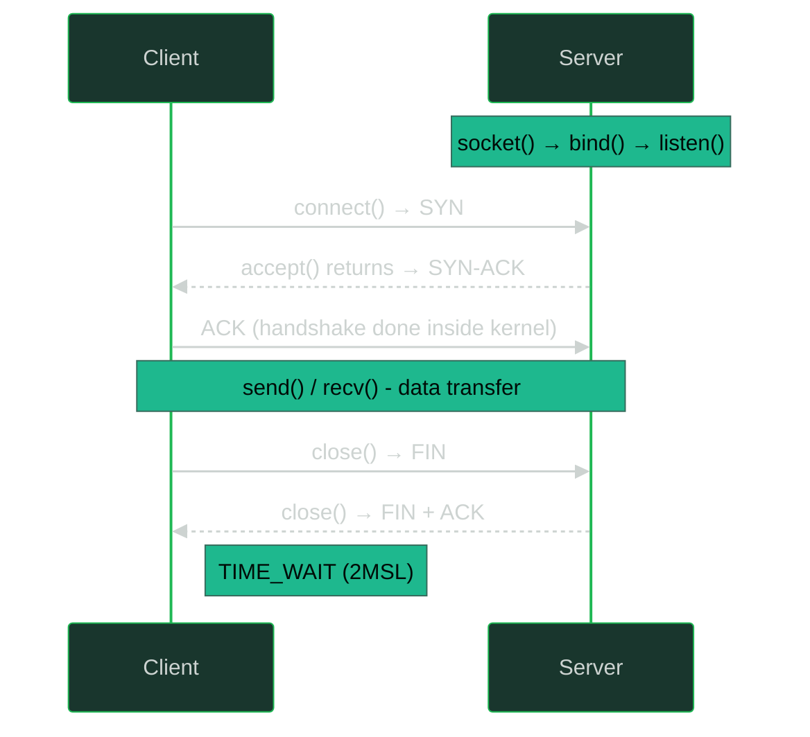

---
tags:
- networking
- programming
- protocols
- sockets
---

# 031 Network Programming & Sockets

Sockets are where your code meets the network. Every HTTP server, database client and container runtime is built on this same ~8-call API, and every scale problem you'll hit (port exhaustion, CLOSE_WAIT leaks, accept queues) lives in its corners.

---

## The Socket API Lifecycle



| Call | Side | What It Does |
|------|------|--------------|
| `socket()` | both | Create an endpoint: family (AF_INET…), type (SOCK_STREAM…), protocol |
| `bind()` | server | Attach to a local IP:port |
| `listen()` | server | Mark as passive + set **backlog** (accept queue size) |
| `accept()` | server | Pop a *completed* handshake from the queue → new connected fd |
| `connect()` | client | Initiate handshake (blocks until ESTABLISHED or error) |
| `send()`/`recv()` | both | Copy bytes to/from kernel socket buffers |
| `close()` | both | Refcount−1; last close starts FIN teardown |

**Key mental model:** `accept()` returns a *new* socket for that connection; the listening socket never carries data. And the handshake happens entirely in the kernel; your app only sees finished connections (unless you tune the SYN/accept queues, see below).

---

## TCP vs UDP Sockets

| | SOCK_STREAM (TCP) | SOCK_DGRAM (UDP) |
|--|-------------------|------------------|
| Model | Byte stream, connected | Message datagrams, connectionless |
| `recv()` returns | Arbitrary chunk of the stream: **no message boundaries!** | Exactly one datagram, or truncated+flag |
| Server | listen/accept per-connection | One socket, `recvfrom()` tells you who sent |
| `sendto()` | – (use `send()` after connect) | Required: destination per datagram |
| Typical | HTTP, DB clients | DNS, metrics, game state |

Protocol semantics recap: [[021 TCP & UDP]]. Message-boundary loss over TCP streams is why you need framing (length prefix or delimiter) in every custom protocol.

---

## Address Families

| Family | Addresses | Use Case |
|--------|-----------|----------|
| `AF_INET` | IPv4 `ip:port` | Standard networked apps |
| `AF_INET6` | IPv6 `[ip]:port` | Dual-stack; `::` binds v4+v6 when `IPV6_V6ONLY=0` |
| `AF_UNIX` | Filesystem path (`/var/run/x.sock`) | **Local IPC: faster than loopback TCP:** no protocol stack, no checksums, no port allocation |

Unix sockets are everywhere in infra: **Docker daemon** (`/var/run/docker.sock`), containerd, systemd, nginx↔php-fpm, PostgreSQL. You can even give an AF_UNIX socket filesystem permissions: an auth mechanism TCP simply doesn't have. Bind-mounting `docker.sock` into a container = handing it root on the host.

---

## Blocking vs Non-blocking

> Blocking: `recv()` sleeps until data arrives, simple, one thread per connection, dies at 10k connections (threads × stacks).
> Non-blocking: syscalls return `EAGAIN`/`EWOULDBLOCK` immediately; you *ask* the kernel which fds are ready instead of waiting on each.

```c
int flags = fcntl(fd, F_GETFL, 0);
fcntl(fd, F_SETFL, flags | O_NONBLOCK);
```

Non-blocking alone means busy-polling (CPU burner). Pair it with **multiplexing:**

| Mechanism | Max fds | Per-call cost | Notes |
|-----------|---------|--------------|-------|
| `select()` | 1024 (FD_SETSIZE) | O(n) scan, rebuilds set every call | Legacy, everywhere |
| `poll()` | unlimited | O(n) scan | select without the fd limit |
| `epoll` (Linux) | millions | O(ready) | The real answer. `epoll_ctl` registers once, `epoll_wait` returns only ready fds |
| `kqueue` (BSD/macOS) | – | O(ready) | Same idea, BSD flavor |

**epoll trigger modes:**

- **Level-triggered (default):** "fd is ready" as long as data remains in the buffer. Safe with blocking-style reads.
- **Edge-triggered:** notified only on the *transition* to ready; you must drain until `EAGAIN` (loop with non-blocking reads) or data sits unread forever. Fewer wakeups, sharper bugs. (nginx uses ET.)

io_uring is the 2020s successor (async submission/completion rings, true kernel-side async), but epoll remains what you'll debug in production. Syscall-level detail: [[01 System Calls & Kernel]].

---

## Connection Pooling & Keep-alive

> TCP handshakes (1 RTT) + TLS (1–2 more RTTs) per request is why pools exist: reuse established connections across many requests.

| Term | Layer | What It Does |
|------|-------|--------------|
| **HTTP Keep-Alive** | L7 (`Connection: keep-alive`) | Reuse the same TCP connection for multiple HTTP requests |
| **HTTP/2 multiplexing** | L7 | Many concurrent streams over ONE TCP connection |
| **TCP keepalive** | L4 (probes on idle socket) | Detect *dead peers*: sends empty ACK probes after idle timeout |

**They are different things.** HTTP keep-alive reuses; TCP keepalive detects corpses.

```bash
# Linux TCP keepalive knobs (defaults are famously lazy)
net.ipv4.tcp_keepalive_time   = 7200  # 2 HOURS idle before first probe
net.ipv4.tcp_keepalive_intvl  = 75    # seconds between probes
net.ipv4.tcp_keepalive_probes = 9     # probes before declaring dead
# Per-socket override: TCP_KEEPIDLE / TCP_KEEPINTVL / TCP_KEEPCNT via setsockopt()
```

Pool sizing rule of thumb: `pool_size ≈ concurrent_requests`, and always set acquire timeouts; an unbounded pool recreates the thundering herd it was meant to prevent.

---

## Ephemeral Ports & TIME_WAIT at Scale

> Every outbound connection consumes an ephemeral port (Linux default range 32768–60999 ≈ **28k ports per (srcIP, dstIP, dstPort) tuple**). Closing side sits in TIME_WAIT for 60s (2MSL). High-churn clients exhaust this.

The math: a proxy opening 500 conn/s to *one* backend = 500 × 60s = 30,000 TIME_WAIT sockets > 28k ports → `EADDRNOTAVAIL` / "cannot assign requested address".

**Fixes, in order of preference:**

1. **Reuse connections** (keep-alive / pooling): the real fix
2. Widen the range: `net.ipv4.ip_local_port_range = 1024 65535`
3. More source IPs / more backend addresses (multiplies the tuple space)
4. `net.ipv4.tcp_tw_reuse = 1`: safe-ish for *outbound* clients (uses TCP timestamps to reuse TIME_WAIT ports after 1s)
5. ❌ **Never `tcp_tw_recycle`:** broke NAT clients (per-IP timestamp check dropped legitimate SYNs behind shared NATs). **Removed from the kernel in 4.12** for exactly this reason.

---

## CLOSE_WAIT = Application Bug

> TIME_WAIT is normal (you closed first). **CLOSE_WAIT is a leak: the peer sent FIN, the kernel ACKed it, and your app never called `close()`.** Files pile up, fd limits hit, restarts "fix" it.

```bash
ss -tan state close-wait        # who's leaking?
lsof -p <pid> | grep -c CLOSE_WAIT
```

The fix is boring and always the same; close on every path:

```java
// Java - try-with-resources closes even on exception
try (Socket s = new Socket("db.internal", 5432);
     var in = s.getInputStream()) {
    // ...
}   // ← close() guaranteed. A bare try/finally with return-in-try bugs = CLOSE_WAIT farm.
```

```go
// Go - defer close immediately after checking the error
resp, err := http.Get("https://api.example.com")
if err != nil { return err }
defer resp.Body.Close()   // ← forgetting this (or not draining the body) leaks the conn
```

---

## SO_REUSEADDR & SO_REUSEPORT

| Option | Problem It Solves |
|--------|-------------------|
| `SO_REUSEADDR` | Bind to a port that has TIME_WAIT sockets from the *previous* server instance; without it, every restart fails with "Address already in use" for up to 60s |
| `SO_REUSEPORT` | **Multiple sockets bind the exact same ip:port:** kernel load-balances incoming SYNs across them |

`SO_REUSEPORT` (Linux 3.9+) is how nginx/HAProxy run one process per core with kernel-level LB, and how zero-downtime restarts hand connections from old to new process. Related: [[032 Load Balancing & Proxies]].

---

## Backlog & SYN Queue Tuning

Two queues sit between a SYN arriving and your `accept()`:

```
SYN → [SYN queue (half-open, size tcp_max_syn_backlog)] 
    → handshake completes → [accept queue (size min(backlog, somaxconn))]
    → accept() pops
```

- **Accept queue overflow:** fast app, slow accept() → SYNs silently dropped (or retransmit storms). Check: `netstat -s | grep -i listen` → "times the listen queue of a socket overflowed"
- **SYN queue overflow / SYN flood:** enable **SYN cookies** (`net.ipv4.tcp_syncookies = 1`, default on): encode connection state in the SYN-ACK sequence number, zero memory until handshake completes

```bash
net.core.somaxconn = 4096              # global cap on listen() backlog (default 4096 on modern kernels)
net.ipv4.tcp_max_syn_backlog = 8192    # SYN queue
# And pass a big backlog to listen(fd, 65535) - it's min(backlog, somaxconn)!
```

---

## Socket Buffers & BDP

> Kernel buffers decouple app speed from wire speed. `SO_RCVBUF`/`SO_SNDBUF` size them (doubled by kernel); Linux autotunes by default.

**Bandwidth-Delay Product (BDP)** = throughput × RTT = bytes "in flight" needed to fill the pipe:

```
1 Gbps × 100ms (US↔EU) = 12.5 MB in flight
→ Default 64KB window = throughput capped at ~5 Mbps regardless of link speed!
```

```bash
net.ipv4.tcp_rmem = 4096 131072 6291456   # min default max (autotune ceiling)
net.core.rmem_max / wmem_max              # hard caps when apps setsockopt explicitly
```

Autotuning usually wins; don't hard-set buffer sizes unless you've measured.

---

## Practical Diagnostics

```bash
ss -s                          # socket summary: counts per state
ss -tan state time-wait | wc -l      # TIME_WAIT pile-up?
ss -tan state close-wait             # LEAK - find the owning process:
ss -tanp state close-wait            # -p shows pid/fd (needs root)

ss -tln 'sport = :8080'        # listening sockets + Recv-Q = accept queue depth
netstat -s | grep -iE 'listen|overflow'   # accept/SYN queue overflows

conntrack -L | wc -l           # NAT table usage
sysctl net.netfilter.nf_conntrack_count   # "conntrack table full" → dropped packets
sysctl net.netfilter.nf_conntrack_max     #   in dmesg; raise max or timeout
```

`Recv-Q` on a LISTEN socket = accept queue backlog *not yet accepted*; persistently non-zero means your app can't accept() fast enough.

---

## Minimal Servers: Java & Go

```java
// Java - classic blocking server (thread-per-connection)
try (var server = new ServerSocket(8080, 128)) {   // 128 = backlog
    server.setReuseAddress(true);                   // SO_REUSEADDR
    while (true) {
        Socket client = server.accept();            // blocks per handshake
        new Thread(() -> {
            try (client) {
                client.getInputStream().transferTo(client.getOutputStream()); // echo
            } catch (IOException ignored) {}
        }).start();
    }
}
// Production: NIO Selector (epoll under the hood) or Netty - not raw threads.
```

```go
// Go - net.Listener (runtime polls epoll for you)
ln, err := net.Listen("tcp", ":8080")   // bind+listen, backlog from net.ListenConfig
if err != nil { log.Fatal(err) }
for {
    conn, err := ln.Accept()            // goroutine per connection = the Go way
    if err != nil { continue }
    go func(c net.Conn) {
        defer c.Close()
        io.Copy(c, c)                   // echo
    }(conn)
}
// Unix socket IPC: net.Listen("unix", "/var/run/app.sock")
```

---

## Sources

- *UNIX Network Programming Vol. 1*: W. Richard Stevens (the socket bible)
- RFC 793: TCP (socket state machine)
- RFC 6191: TCP RTO for TIME_WAIT reuse considerations
- `man 2 socket`, `man 7 epoll`, `man 7 socket`
- Linux kernel docs: `ip-sysctl.rst` (tcp_tw_reuse, somaxconn, tcp_rmem)
- Kernel commit removing tcp_tw_recycle: Linux 4.12 changelog
