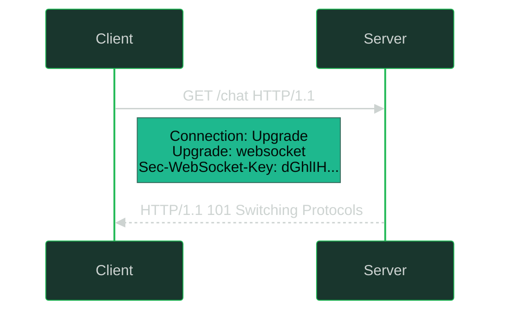

---
tags:
- networking
- programming
- protocols
- websocket
- grpc
---

# 033 Realtime Protocols - WebSockets, SSE & gRPC

HTTP's request/response model can't push: the server can only speak when spoken to. Chat, live dashboards, streaming LLM tokens, multiplayer; all need the server to talk *first*. This note covers the three tools that solve it: **WebSocket** (full-duplex), **SSE** (one-way, HTTP-native), and **gRPC** (the internal microservice workhorse). All of them ride on [[021 TCP & UDP]] and, in the browser, [[022 HTTP & HTTPS]].

---

## Why Plain HTTP Fails for Server Push

| Approach | How | Cost |
|----------|-----|------|
| **Short polling** | Client re-requests every N seconds | Most requests empty. Latency vs load tradeoff. Brutal at scale |
| **Long polling** | Server holds request open until data exists, client reconnects | Better latency, but full HTTP overhead per message, TCP+TLS handshake churn, no true duplex |
| **HTTP/2 Server Push** | Server pushes resources before request | Deprecated in Chrome 2022 ;  only good for cache-filling, not app events |

> The fix: keep **one** connection alive and frame messages on it. That's WebSocket (bidirectional) or SSE (unidirectional).

---

## WebSocket

Full-duplex, persistent, low-overhead messaging over a single TCP connection. Born from HTTP, then leaves it behind.

### The Upgrade Handshake (HTTP 101)


    Note left of S: Upgrade: websocket<br>Sec-WebSocket-Accept: s3pPL...  (key+GUID, SHA-1, base64)
    Note over C,S: Connection stays open - raw WS frames from here on


- The `Sec-WebSocket-Key`/`Accept` exchange proves the server actually speaks WebSocket (not a caching proxy echoing 200)
- Schemes: `ws://` (port 80) and `wss://` (port 443, TLS: required in browsers on HTTPS pages, see [[023 TLS & PKI Deep Dive]])
- After 101, HTTP is gone: **binary framing**, 2–14 byte header vs HTTP's hundreds, no headers per message

### Protocol Mechanics

| Feature | Detail |
|---------|--------|
| **Frames** | Text or binary opcodes, mask bit (client→server always masked ;  prevents cache-poisoning attacks), fragmented messages |
| **Ping/Pong** | Either side pings; peer must pong. Detects dead connections through NAT/firewall idle timeouts |
| **Close** | Close frame with status code (1000 normal, 1001 going away, 1006 abnormal = no close frame at all) |
| **Backpressure** | TCP-level: slow consumer fills buffers, writes block/queue. App must respect `bufferedAmount` / library write queues or OOM |
| **No built-in** | Auth, reconnection, message ordering guarantees across reconnects, heartbeats at app level ;  libraries (Socket.IO, etc.) add these |

### The Scaling Problem

Stateful long connections break the stateless scale-out model behind [[032 Load Balancing & Proxies]]:

- **Sticky sessions:** a client's connection must stay on one backend for its lifetime. LB needs WebSocket awareness (HTTP/1.1 `Upgrade` passthrough; most modern LBs/ALBs do this, but idle timeouts default to 60s and kill quiet sockets)
- **Fan-out across nodes:** user A on node 1, user B on node 2; node 1 can't write to B's socket. Solution: a **broker** (Redis Pub/Sub, NATS, Kafka); every node subscribes, publishes events, delivers to locally-connected clients
- **Connection count:** each socket = FD + memory. 100k concurrent per node is achievable but changes your capacity math vs stateless HTTP

```js
// Node.js (ws) - echo server + Redis fan-out pattern
import { WebSocketServer } from 'ws';
const wss = new WebSocketServer({ port: 8081 });
wss.on('connection', (ws) => {
  ws.on('message', (data) => ws.send(data));   // echo
  ws.send(JSON.stringify({ type: 'welcome' }));
});
```

```bash
# wscat - the curl of WebSockets
npx wscat -c wss://echo.websocket.org
> hello            # type a message, Enter sends
```

---

## SSE: Server-Sent Events

One-way server→client stream **as plain HTTP**. A long-lived `GET` with `Content-Type: text/event-stream`; the server writes newline-delimited events forever.

```
HTTP/1.1 200 OK
Content-Type: text/event-stream
Cache-Control: no-cache

event: price-update
id: 42
data: {"symbol":"BTC","price":68420.15}

data: multi-line data is allowed
data: just repeat the field
```

| Feature | Detail |
|---------|--------|
| **Direction** | Server → client only. Client sends via normal XHR/fetch POST |
| **Auto-reconnect** | Built into the browser `EventSource` API: on drop, reconnects and sends `Last-Event-ID` header ;  server can **resume from that ID** (replay missed events). WebSocket gives you none of this |
| **Wire format** | Text only (UTF-8). Binary → base64 it yourself |
| **HTTP/1.1 limit** | Browsers cap ~6 connections per origin ;  SSE eats one each. **HTTP/2 removes this** (100 streams multiplexed), which is why SSE got practical for multi-tab dashboards |
| **Auth** | Normal HTTP: cookies, `Authorization` via fetch-based clients (raw `EventSource` can't set headers) |

```bash
# curl an SSE stream - note -N (no buffering) or you see nothing until it fills
curl -N -H "Accept: text/event-stream" https://api.example.com/v1/stream
```

```js
// Browser - the whole client
const es = new EventSource('/events');
es.addEventListener('price-update', (e) => {
  const p = JSON.parse(e.data);
  console.log(p.symbol, p.price, 'last-id:', e.lastEventId);
});
es.onerror = () => console.log('reconnecting...'); // automatic
```

> **LLM streaming = SSE.** OpenAI/Anthropic token streams are `text/event-stream` with `data: {delta}` chunks; one-way, resumable, trivially proxied through any HTTP stack. SSE won that use case outright.

---

## WebSocket vs SSE vs Long-Polling vs WebTransport

| | **WebSocket** | **SSE** | **Long-polling** | **WebTransport (HTTP/3)** |
|---|:---:|:---:|:---:|:---:|
| **Direction** | Full-duplex | Server→client | Half-duplex, faked | Full-duplex + datagrams |
| **Protocol** | Own (over TCP) | Plain HTTP | Plain HTTP | QUIC (UDP) |
| **Transport** | TCP | TCP | TCP | QUIC ;  no HoL blocking |
| **Auto-reconnect** | DIY | ✅ Built-in + `Last-Event-ID` | ✅ (it's just requests) | ✅ + 0-RTT resume |
| **Binary** | ✅ | base64 | ✅ | ✅ |
| **Through proxies/LB** | Needs upgrade support | Trivial (it's HTTP) | Trivial | Needs QUIC end-to-end |
| **Auth** | Subprotocol/query param (awkward) | HTTP headers/cookies | HTTP | HTTP |
| **Best for** | Chat, multiplayer, collaborative editing | Dashboards, notifications, **LLM token streaming** | Legacy fallback | Low-latency media, games (2025: Chrome/Edge stable, Firefox shipping) |

**Rules of thumb:**
- Only need server→client? **SSE.** Half the complexity, works through every proxy.
- Both sides talk constantly? **WebSocket.**
- Unreliable-datagram game/media traffic? **WebTransport.**
- Long-polling only exists for ancient clients (Socket.IO falls back to it automatically).

---

## gRPC

Google's RPC framework: **Protobuf IDL + HTTP/2 streams**. The default for internal microservices in 2025, Kubernetes, etcd, Envoy, CockroachDB all speak it.

### The Contract First

```protobuf
// order.proto - the IDL generates typed client & server stubs
syntax = "proto3";
package order.v1;

service OrderService {
  rpc CreateOrder (CreateOrderRequest) returns (Order);            // unary
  rpc WatchOrders (WatchRequest) returns (stream Order);           // server-stream
  rpc BulkUpload (stream OrderRow) returns (UploadSummary);        // client-stream
  rpc Negotiate (stream Offer) returns (stream Offer);             // bidi-stream
}

message Order { string id = 1; double total = 2; int64 created_at = 3; }
```

### Why Microservices Love It

| Property | Detail |
|----------|--------|
| **4 modes** | Unary, server-stream, client-stream, bidi ;  one framework covers request/response *and* realtime push |
| **HTTP/2 streams** | Many RPCs multiplexed on one TCP connection; no head-of-line blocking at stream level; header compression (HPACK) |
| **Protobuf** | Binary, 3–10× smaller than JSON, schema-enforced evolution (field numbers ;  never reuse one), codegen in every language |
| **Deadlines** | Client sets a deadline; gRPC **propagates it downstream** through the whole call chain ;  one timeout budget, no cascading pile-ups. This alone beats REST |
| **Interceptors** | Middleware for auth, logging, retries, tracing ;  cross-cutting once, applied everywhere |
| **Built-in** | Retries, load balancing (client-side), health checks (`grpc.health.v1`), reflection |

### The Browser Limitation → grpc-web

Browsers can't do raw HTTP/2 trailers or arbitrary framing from JS (**you cannot call gRPC directly from a browser.** Solution: **grpc-web**) the browser talks a slightly re-encoded protocol to an Envoy/gRPC-web proxy, which translates to real gRPC upstream. Unary and server-streaming work; client-streaming and bidi are limited. Common pattern instead: public API = REST/JSON or SSE, internal = gRPC.

### Debugging gRPC

```bash
# grpcurl - curl for gRPC (uses server reflection, no .proto needed)
grpcurl -plaintext localhost:50051 list
grpcurl -plaintext localhost:50051 describe order.v1.OrderService
grpcurl -plaintext -d '{"customer_id": 42}' localhost:50051 order.v1.OrderService/CreateOrder

# Watch a server-stream live
grpcurl -plaintext -d '{}' localhost:50051 order.v1.OrderService/WatchOrders

# With TLS + token
grpcurl -H "authorization: Bearer $TOKEN" api.example.com:443 list
```

```java
// Server side (Java) - interceptors + deadline check
ServerInterceptor auth = new ServerInterceptor() { /* read Metadata, validate JWT */ };
Server.builder()
  .addService(ServerInterceptors.intercept(new OrderServiceImpl(), auth))
  .useTransportSecurity(certChain, privateKey)   // gRPC = TLS by default in prod
  .build().start();
```

---

## Long-Lived Connections vs the Real World

NATs, firewalls, and proxies are built to *kill* idle connections. Plan for it:

| Hop | Default behavior | Tuning |
|-----|-----------------|--------|
| **Cloud LB** (ALB, GCLB) | Idle timeout 60s → silent drop (client sees 1006) | Raise timeout, or heartbeat every ~30s (WS ping, SSE comment `:\n\n`) |
| **NAT gateway** | UDP/TCP mapping expires in minutes | Same ;  keepalives refresh the mapping |
| **Corporate proxy / CDN** | May not pass `Upgrade` at all | SSE survives where WS doesn't; fallback logic |
| **K8s ingress (nginx)** | `proxy_read_timeout` 60s | Annotate per-route for WS/SSE paths |

> **Design rule:** assume any connection can die at any instant. Client auto-reconnects (SSE free, WS DIY), server is stateless per-connection or rehydrates state on reconnect (`Last-Event-ID`, cursor/offset replay). Heartbeats are not optional in production.

---

## Choosing: One Table

| Scenario | Pick | Why |
|----------|------|-----|
| Chat app | WebSocket | Both directions, low latency |
| Live dashboard / stock ticker | SSE | One-way, auto-resume, proxy-friendly |
| Streaming LLM tokens | SSE | It's literally what the industry standardized on |
| Notifications | SSE (or push) | One-way, rare |
| Collaborative editing (CRDT) | WebSocket | Frequent bidirectional updates |
| Internal service-to-service | gRPC | Contracts, deadlines, streaming, perf |
| Browser → your backend API | REST + SSE | Universally supported |

---

## Sources

- RFC 6455: The WebSocket Protocol
- WHATWG HTML Standard: Server-Sent Events (`text/event-stream`, `EventSource`)
- RFC 8441: Bootstrapping WebSockets with HTTP/2
- RFC 9220: Bootstrapping WebSockets with HTTP/3
- WebTransport specification (W3C, HTTP/3-based)
- gRPC documentation: grpc.io (core concepts, deadlines, grpc-web)
- Protocol Buffers language guide: protobuf.dev
- *gRPC: Up and Running*: Indrasiri & Silva (O'Reilly)

Related: [[022 HTTP & HTTPS]] · [[021 TCP & UDP]] · [[032 Load Balancing & Proxies]] · [[023 TLS & PKI Deep Dive]]
