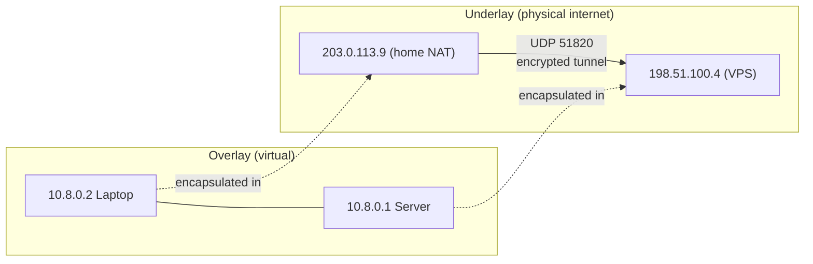

---
tags:
- networking
- security
- vpn
- overlay
---

# 034 VPN & Overlay Networks

A VPN builds a **virtual topology on top of the physical one**: your packets get encrypted and *encapsulated* inside other packets, so two machines on opposite sides of the internet appear to share a LAN segment. Overlays are the same trick inside datacenters — VXLAN turns 3 physical hosts into 10,000 isolated tenant networks. This note covers the tunnel protocols (IPSec, WireGuard), the coordination layer (Tailscale), NAT traversal, and datacenter overlays.

---

## What an Overlay Actually Does



- **Tunneling L3 over L3**: original IP packet → encrypted payload → new UDP/IP header → sent over the real network → decapsulated at the peer
- **Encryption by default**: the underlay (your ISP, hotel wifi) sees only opaque UDP datagrams
- **Virtual addressing**: peers get stable private IPs (10.8.0.x) regardless of where they physically are — identity decoupled from location

### Topologies

| Type | Shape | Use |
|------|-------|-----|
| **Remote-access** | One client → one gateway | Developer → office/VPC |
| **Site-to-site** | Gateway ↔ gateway, whole subnets routed | Office ↔ AWS VPC, branch ↔ DC |
| **Full mesh** | Every peer ↔ every peer directly | Tailscale/WireGuard meshes — no central chokepoint, lowest latency |
| **Hub-and-spoke** | Spokes only talk via hub | Easier routing/firewalling, hub is SPOF + bottleneck |

---

## IPSec — The Enterprise Standard

The IETF suite (RFC 4301+) that ran corporate VPNs for 25 years. Powerful, flexible, *enormous*.

| Component | Role |
|-----------|------|
| **IKEv2** (RFC 7296) | Key exchange & peer auth (certs or PSK), negotiates the security associations. Survives NAT via UDP 4500 encapsulation |
| **ESP** (RFC 4303) | The workhorse — encrypts *and* authenticates payload. UDP 50 → ESP proto 50 |
| **AH** (RFC 4302) | Authentication only, no encryption. Broken by NAT (covers IP header). Deprecated in practice |
| **Tunnel mode** | Whole original IP packet encapsulated → gateway-to-gateway (site-to-site) |
| **Transport mode** | Only payload encapsulated, original IP header kept → host-to-host |
| **strongSwan / libreswan** | The Linux implementations. `ipsec`/`swanctl` config, XFRM kernel stack, EAP for road warriors |

Why it lost mindshare: two-protocol negotiation (IKE + ESP), enormous config surface, painful NAT traversal, cipher agility that includes decades of legacy cruft.

---

## WireGuard — The Replacement

Jason Donenfeld's protocol (Linux mainline since 5.6, RFC 9081 in 2025). **~4,000 lines of code** vs IPSec/OpenVPN's hundreds of thousands.

| Design choice | Consequence |
|---------------|-------------|
| **UDP-only** (default port **51820**) | One firewall rule. Fast NAT traversal |
| **Curve25519 everywhere** (X25519 ECDH, Ed25519 identity, ChaCha20-Poly1305 AEAD, BLAKE2s) | Modern crypto, no cipher negotiation at all — nothing weak to downgrade to |
| **Static key-pair per peer** | Config = list of public keys + allowed IPs. No PKI, no certs, no CA |
| **No handshake state machine** | Roaming/mobile: peer just re-keys every 2 min; "connection" is implicit (recent traffic) |
| **In-kernel implementation** | Faster than IPSec and OpenVPN on the same hardware; near-line-rate on modest CPUs |

```ini
# /etc/wireguard/wg0.conf — the whole server config
[Interface]
PrivateKey = <…>
ListenPort = 51820
Address = 10.8.0.1/24

[Peer]                          # laptop
PublicKey = <laptop-pubkey>
AllowedIPs = 10.8.0.2/32

[Peer]                          # site B — route its whole LAN
PublicKey = <siteB-pubkey>
AllowedIPs = 10.8.0.3/32, 192.168.10.0/24
```

```bash
wg-quick up wg0                 # bring tunnel up
wg show                         # peers, endpoints, handshake age, traffic
wg show wg0 latest-handshakes   # "2 seconds ago" = healthy; growing = peer gone
```

> `AllowedIPs` does double duty: routing table *and* access control. A peer can only send from IPs it's allowed — spoofing another peer's IP is impossible.

---

## Tailscale — WireGuard + a Brain

Raw WireGuard solves tunnels but not **coordination**: who are the peers, what are their keys, how do I get through NAT from a coffee shop? Tailscale runs a coordination server over that gap.

- **tailnet**: your mesh. Devices auth via SSO (Google/GitHub/Okta), the coordination plane distributes WireGuard pubkeys automatically — add a node, it just appears at `100.x.y.z` (CGNAT range)
- **MagicDNS**: `nas.tail1234.ts.net` resolves to its tailnet IP. No hosts-file archaeology
- **NAT traversal**: coordination servers (DERP relays) assist hole punching; DERP relays traffic only when direct UDP fails (~90%+ of connections go direct)
- **Userspace networking** (`tailscale up --tun=userspace-networking`): no root/TUN device — runs in containers, WSL, restricted machines
- **Extras**: ACLs (tag-based, who may reach which ports), subnet routers (expose a LAN), exit nodes, **Tailscale Funnel/Serve** (public HTTPS to a tailnet device), SSH
- Open-source coordination alternative: **Headscale**. Self-hosted control plane, same clients

**Why homelabs love it:** zero firewall holes (all outbound UDP), instant mesh between laptop/homelab/VPS, MagicDNS, free tier covers everything. It replaced "set up OpenVPN + DDNS + port forward + pray."

**ZeroTier** — same category, different internals: own virtual-L2 overlay (emulated switch, real MAC/bridging, multicast), planet/root coordination servers. Pick ZeroTier when you need L2 bridging or fully self-hosted roots; pick Tailscale for the slicker identity/SSO story.

---

## NAT Traversal — The Hard Part

Both peers behind NAT can't be *contacted* — so they simultaneously punch outward and meet:

- **STUN** (RFC 8489): "what's my public IP:port?" — a cheap discovery server
- **Hole punching**: both peers send to each other's discovered address; each NAT sees an outbound packet first and opens the mapping — inbound now matches an "existing flow"
- **TURN** (RFC 8656): when punching fails (symmetric NAT, hostile firewall), relay through a public server — works, costs bandwidth
- **ICE** (RFC 8445): the framework that gathers candidates, tries direct first, falls back to relay. Same machinery WebRTC uses; DERP is Tailscale's equivalent of TURN
- **UDP > TCP for tunnels**: a TCP tunnel means TCP-over-TCP — inner retransmits fight outer retransmits, one lost segment stalls the whole stream (**performance collapse under packet loss**, classically ~10× throughput loss on lossy links). UDP tunnels carry their own crypto/reliability semantics and degrade gracefully. This is why WireGuard/QUIC chose UDP; OpenVPN-over-TCP is the cautionary tale

---

## Split Tunnel vs Full Tunnel

| | **Full tunnel** | **Split tunnel** |
|---|---|---|
| **Routes** | Everything (default route → VPN) | Only specific subnets/peers → VPN |
| **Corporate view** | DLP: all traffic inspected. Slow (hairpin to gateway) | Local/internet traffic bypasses VPN — faster, but unmonitored |
| **Remote worker** | "Compliant" but Netflix dies / latency everywhere | Office subnets via VPN, rest direct |
| **WireGuard/Tailscale** | Exit node enabled | Default — `AllowedIPs = 10.0.0.0/8` only |

Modern zero-trust thinking (see [[035 Network Security]]) favors split tunnel + per-application identity checks over "pipe everything through one gateway."

---

## SD-WAN — In 4 Lines

Site-to-site connectivity as a *managed overlay*: an SD-WAN edge box sits on multiple underlays (MPLS + broadband + 5G) and picks the best path **per packet, per application** — VoIP over the low-latency link, bulk backup over the cheap one, with app-aware routing (it recognizes SaaS/O365 traffic and steers it directly to the internet instead of hairpinning through the DC). Sold by Cisco (Viptela), VMware (VeloCloud), Fortinet, Zscaler. It's the enterprise evolution of hub-and-spoke IPSec: policy-driven path selection instead of static routing.

---

## Datacenter Overlays — VXLAN & Geneve

The multi-tenant problem: VLANs cap at **4094** IDs, are L2-bound, and spanning them across racks is a nightmare. Cloud providers solved it with MAC-in-UDP encapsulation (see [[012 Ethernet, Switching & VLANs]] for the L2 side):

| | **VXLAN** (RFC 7348) | **Geneve** (RFC 8926) |
|---|---|---|
| **Encapsulation** | L2 frame + 8-byte VXLAN header in UDP :4789 | L2 frame + **extensible TLV options** in UDP :6081 |
| **Segments** | VNI = 24 bits → **16.7M** tenant networks | VNI = 24 bits + metadata for security groups, tracing |
| **Deployed by** | VMware NSX, Cisco ACI, Linux bridge, most DC fabrics | AWS (Nitro underlay), Open Virtual Network, Kube-OVN |
| **Effect** | VMs/containers "move" across L3 boundaries keeping IP; overlay L2 over routed L3 fabric (leaf-spine) | Same + programmable in-band telemetry |

In Kubernetes: CNI plugins (Calico VXLAN/IPIP, Flannel, Cilium) use exactly this to give every pod a cluster-wide-routable IP over whatever the physical network is.

---

## Security Considerations

| Concern | Mitigation |
|---------|-----------|
| **Kill switch** | VPN drops → traffic silently exits plaintext. Use firewall rules that block non-tun traffic, or clients with built-in kill switch (WireGuard via `PreUp` iptables, Tailscale `--exit-node` + OS rules) |
| **DNS leak** | Tunnel routes IP traffic but DNS still hits ISP resolver → browsing history exposed. Force DNS through the VPN (WireGuard `DNS =` in config, Tailscale MagicDNS); verify at dnsleaktest.com |
| **Coordination-server trust** | Tailscale/ZeroTier control planes see metadata (peer IPs, keys distribution, DERP relay content-timing). DERP relays see encrypted packets they can't read — but they *can* observe who talks to whom. Self-host (Headscale, ZeroTier private roots) if that matters |
| **Post-quantum** | "Harvest now, decrypt later" applies to VPN traffic too. Tailscale ships ML-KEM hybrid key exchange already; strongSwan/IKEv2 have hybrid PQ proposals (2024+); WireGuard upstream is still classical Curve25519 — watch this space |
| **Blast radius** | Full-mesh tailnet = every device reachable. Segment with ACLs/tags; a compromised laptop shouldn't reach the NAS admin port |

---

## Practical Commands

```bash
# --- WireGuard ---
wg-quick up wg0 && wg show                    # status: peers, handshake, transfer
ping 10.8.0.1                                 # overlay IP reachable?
tcpdump -i wg0 -n                             # see DECAPSULATED inner packets (overlay view)
tcpdump -i eth0 udp port 51820 -n             # see the encrypted underlay
wg genkey | tee priv | wg pubkey              # new keypair in one line

# --- Tailscale ---
tailscale up                                  # join tailnet (auth URL in output)
tailscale status                              # peers + health (direct vs DERP)
tailscale netcheck                            # NAT type, DERP latency, preferred relay
tailscale ip -4 nas                           # resolve a peer's tailnet IP
tailscale ping nas                            # connectivity check: shows path (direct/DERP) + RTT
tailscale up --advertise-routes=192.168.1.0/24  # become subnet router (approve in admin console)
tailscale up --exit-node=vps-exit             # full tunnel via exit node

# --- Diagnostics ---
traceroute -n 10.8.0.1                        # does traffic take the tunnel? (hop 1 = tunnel peer)
mtr 10.8.0.1                                  # sustained path quality
ip route get 10.8.0.2                         # which interface would the kernel use?
```

---

## Sources

- RFC 9081/9082 — WireGuard protocol & formal verification
- RFC 4301, 4303, 7296 — IPSec architecture, ESP, IKEv2
- RFC 7348 — VXLAN; RFC 8926 — Geneve
- RFC 8445, 8489, 8656 — ICE, STUN, TURN
- Tailscale documentation — DERP, MagicDNS, ACLs, userspace networking
- strongSwan documentation — swanctl, EAP, post-quantum proposals
- *WireGuard: The Definitive Guide* — O'Reilly (2025, Donenfeld foreword)

Related: [[035 Network Security]] · [[012 Ethernet, Switching & VLANs]] · [[013 IP Addressing & Subnetting]] · [[014 DNS Deep Dive]]
