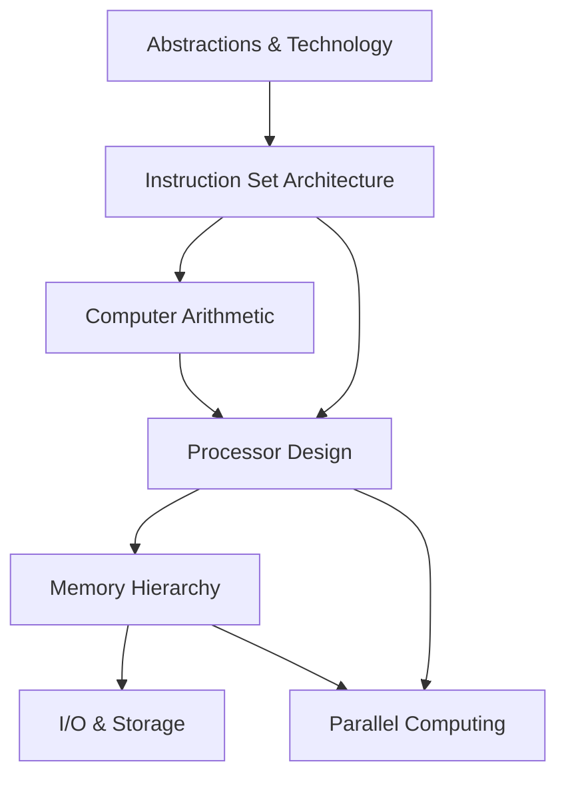

# Computer Organization — Overview

> **Source:** *Computer Organization and Design: The Hardware/Software Interface* by David A. Patterson & John L. Hennessy (Morgan Kaufmann)

## What Is This?

This vault covers **computer architecture and organization** — how computers work from the hardware/software interface up. It fills SWEBOK's Computing Foundations KA for architecture, ISA, arithmetic, processor design, memory hierarchy, I/O, and parallel computing.

## Files

| File | Topics | Source |
|---|---|---|
| [[01_Computer_Abstractions]] | Abstractions, levels of interpretation, performance metrics, power wall, benchmarks | Ch 1 |
| [[02_Instruction_Set_Architecture]] | MIPS ISA, operands, addressing modes, ARM/x86 comparison | Ch 2 |
| [[03_Computer_Arithmetic]] | Integer arithmetic, floating point, IEEE 754, overflow, rounding | Ch 3 |
| [[04_Processor_Design]] | Datapath, pipelining, data hazards, forwarding, control hazards, exceptions | Ch 4 |
| [[05_Memory_Hierarchy]] | Caches (direct-mapped, set-associative), virtual memory, TLB, cache coherence | Ch 5 |
| [[06_IO_and_Storage]] | Dependability, disk storage, flash, I/O buses, DMA, RAID | Ch 6 |
| [[07_Parallel_Computing]] | Multicores, multiprocessors, SIMD, GPU architecture, roofline model | Ch 7 |

## How These Topics Relate

## Reading Paths

| Your Goal | Start Here |
|---|---|
| **How computers work** | [[01_Computer_Abstractions]] → [[02_Instruction_Set_Architecture]] → [[04_Processor_Design]] |
| **Performance optimization** | [[05_Memory_Hierarchy]] → [[07_Parallel_Computing]] |
| **Assembly programming** | [[02_Instruction_Set_Architecture]] |
| **Hardware design** | [[03_Computer_Arithmetic]] → [[04_Processor_Design]] → [[05_Memory_Hierarchy]] |
| **Systems programming** | [[05_Memory_Hierarchy]] → [[06_IO_and_Storage]] |

## Related

- [[Computing Foundation Overview]] — All computing foundation topics
- [[Operating Systems/Operating Systems Overview|Operating Systems]] — OS concepts that build on architecture
- [[Algorithm/Algorithm Overview|Algorithms]] — Algorithmic complexity and data structures
