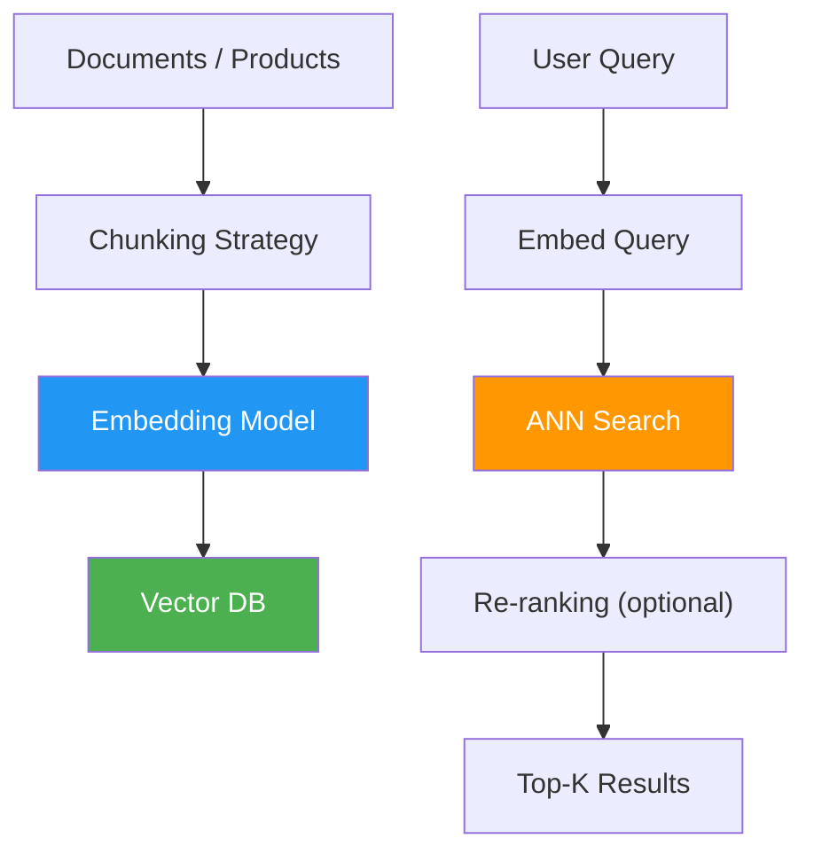

# 02 Vector Databases

> **Core idea:** Vector databases store embeddings (high-dimensional float arrays) and perform fast approximate nearest neighbor (ANN) search. Used for semantic retrieval — "find me things similar to this meaning," not just "things containing this keyword."

---

## What Are Vector Databases?

A vector database is a specialized database that stores, indexes, and queries **vector embeddings** — dense numerical representations of data (text, images, audio) that capture semantic meaning. Unlike traditional databases that match exact values or keywords, vector databases find **similarity**: "what is semantically close to this query?"

### Embeddings Refresher

- **Embedding** = a fixed-length vector (e.g., 768 or 1536 floats) that represents a piece of content in a high-dimensional space
- Similar items have vectors that are "close" (cosine similarity, Euclidean distance, dot product)
- Generated by embedding models: `text-embedding-3-small`, `text-embedding-ada-002`, `all-MiniLM-L6-v2`, etc.

### Why Not Just Use PostgreSQL?

Traditional databases use exact-match indexes (B-trees, hash indexes). Vector search requires **approximate nearest neighbor (ANN)** algorithms that traditional DBs don't provide natively. You need an index built for high-dimensional similarity search.

---

## When to Use Vector Databases

### ✅ Good Use Cases

| Scenario | Why |
|---|---|
| **1,000+ documents/SKUs** where keyword matching breaks down | Semantic search handles synonyms, paraphrases, multilingual queries |
| **Semantic search over unstructured text** (FAQ, support tickets, docs) | "How do I reset my password?" matches "password recovery steps" even with different words |
| **Multi-tenant product catalogs** where each merchant names things differently | "跑步鞋" (Chinese) and "รองเท้าวิ่ง" (Thai) both find running shoes |
| **Recommendation / "similar items"** | Find items with similar embeddings to what the user viewed/purchased |
| **RAG (Retrieval-Augmented Generation)** | Retrieve relevant documents to ground LLM responses |

### ❌ When NOT to Use

| Scenario | Why |
|---|---|
| **Small, structured, exact-match data** (30 SKUs with prices) | Keyword search is simpler, faster, and auditable |
| **When wrong matches have high cost** (quoting wrong price) | Embedding similarity is fuzzy — you can't guarantee exact matches |
| **When you need auditability** | Keyword matches are inspectable; embedding similarity is opaque |
| **When you already have Postgres** and the data is small | pgvector adds vector capability without a new database |

---

## The Four Core Tools

| Tool | Type | Best For | Thai-Market Note |
|---|---|---|---|
| **pgvector** | PostgreSQL extension | You already have Postgres; want vectors + transactions in one DB; operational simplicity | Likely the right production choice for Thai SMEs — they have relational catalogs |
| **Pinecone** | Managed SaaS | Pure vector workloads at scale; no ops burden | Adds a vendor + cost; data leaves your infra |
| **Chroma** | Open-source, embedded | Local dev, prototyping, small-medium datasets | Good for POC; runs in-process |
| **FAISS** | Library (Meta) | High-performance on-prem; you own serving | Best for large-scale, low-latency; no managed service |

### Other Notable Options

| Tool | Differentiator |
|---|---|
| **Qdrant** | Rust-based, high-performance, gRPC API; good for microservices |
| **Weaviate** | GraphQL-native, hybrid search (dense + sparse vectors), built-in vectorizer |
| **Milvus** | Cloud-native, Kubernetes-first, petabyte-scale |
| **LanceDB** | Columnar, serverless, built on Lance format (like Parquet for vectors) |

---

## Index Types: HNSW vs IVF

### HNSW (Hierarchical Navigable Small World)

- **How it works:** Graph-based — builds a multi-layer graph where each node connects to its nearest neighbors. Search traverses the graph from coarse to fine.
- **Fast query** — typically sub-10ms at 95%+ recall
- **Higher memory** — stores the graph structure in RAM
- **Best for:** Low-latency, high-throughput production

### IVF (Inverted File Index)

- **How it works:** Cluster-based — partitions vectors into clusters using k-means. At query time, only searches the nearest clusters.
- **Lower memory** — stores only cluster centroids + vectors
- **Slightly slower** — must search multiple clusters for good recall
- **Best for:** Memory-constrained environments, large datasets

### Which to Choose?

| Factor | HNSW | IVF |
|---|---|---|
| **Query latency** | Lower | Slightly higher |
| **Memory usage** | Higher | Lower |
| **Build time** | Faster | Slower (clustering) |
| **pgvector support** | ✅ | ✅ |
| **Recall at same latency** | Better | Good |

> **pgvector** supports both HNSW and IVF. Start with HNSW for most use cases; switch to IVF if memory is tight.

---

## How to Add Semantic Search (Practical Example)

### Scenario: Product catalog with name + description

**Embedding step (offline/batch):**
```python
# Embed each product's name + description
embedding = embedding_model.embed(
    f"{product.name}: {product.description}"
)
# Store in pgvector alongside the catalog table
INSERT INTO products (name, description, embedding)
VALUES ('Running Shoes', 'Lightweight...', '[0.123, 0.456, ...]');
```

**Query step (runtime):**
```sql
-- Embed the user's query, then find nearest products
SELECT name, description,
       embedding <=> query_embedding AS distance
FROM products
ORDER BY embedding <=> query_embedding
LIMIT 5;
```

**Key design insight:** The `build_context()` interface doesn't change — only the `catalog.search()` implementation swaps from keyword to vector. This is the provider-neutral design pattern.

---

## Vector Database Architecture in Production



---

## Key Vocabulary

| Term | Definition |
|---|---|
| **Embedding** | Dense vector representing semantic meaning of content |
| **ANN (Approximate Nearest Neighbor)** | Fast, approximate similarity search (trades a tiny bit of accuracy for 100-1000x speed) |
| **Cosine similarity** | Most common distance metric for text embeddings; measures angle between vectors |
| **Recall@k** | What fraction of the true top-k nearest neighbors are returned by the ANN index |
| **Chunking** | How you split documents before embedding — affects retrieval quality significantly |
| **Hybrid search** | Combining dense (vector) + sparse (BM25/keyword) retrieval for better results |
| **Reranking** | A second-pass model that re-scores retrieved candidates for higher precision |

---

## Drill Questions

**Q: "How would you add semantic search to your take-home?"**

A: Embed each product's name+description with a small embedding model (e.g., `text-embedding-3-small`), store in pgvector alongside the catalog table, and at query time embed the query and do `ORDER BY embedding <=> query_embedding LIMIT 5`. The `build_context()` interface doesn't change — only the `catalog.search()` implementation swaps from keyword to vector.

**Q: "When would you choose Pinecone over pgvector?"**

A: When the team has no Postgres/DBA expertise, the vector workload is the primary database need (not a side feature), and the operational cost of a managed service is acceptable. For most existing Postgres shops, pgvector is the simpler choice.

**Q: "What are the trade-offs of HNSW vs IVF?"**

A: HNSW gives faster queries at the cost of higher memory (stores the graph). IVF uses less memory at the cost of slightly slower queries (must search multiple clusters). Start with HNSW; switch to IVF if memory is constrained.

---

## Related

- [[02 NoSQL Overview]] — CAP theorem, BASE vs ACID
- [[01 Indexing & Performance]] — B-trees and traditional indexing
- [[10_LLM_Production_Patterns]] — RAG, where vector DBs are the retrieval layer
- [[09_AI_SE_Intersection]] — SE for AI, MLOps