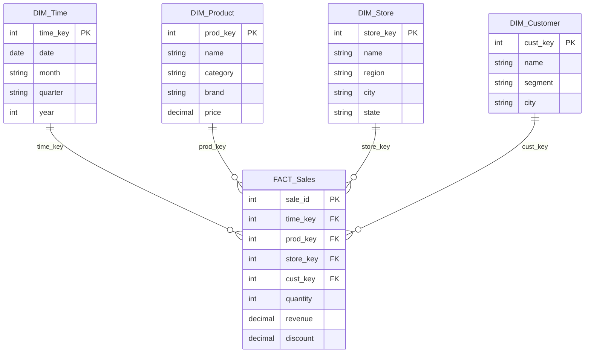
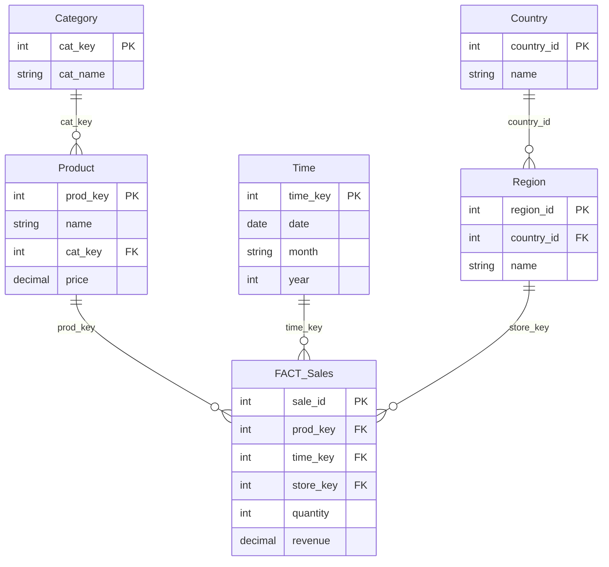
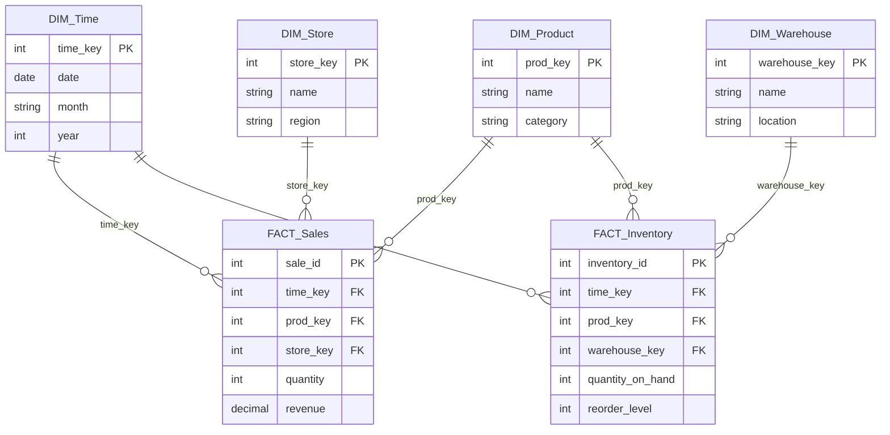
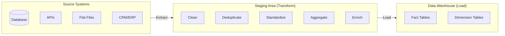
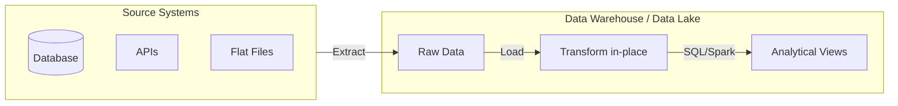
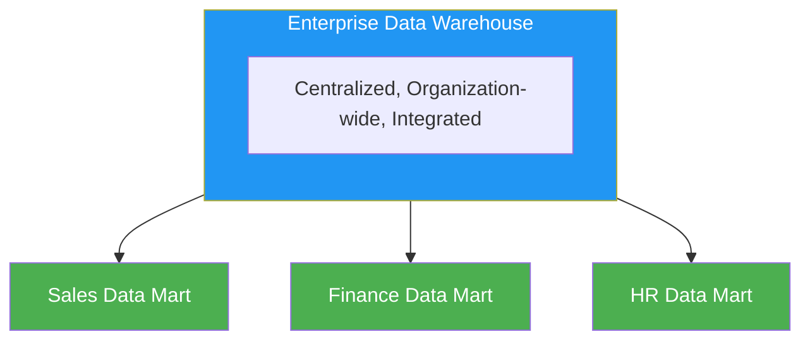
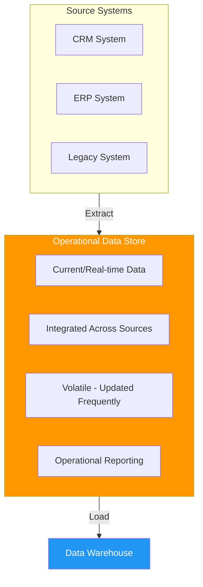

---
tags:
  - data-warehousing
  - data-mining
  - swebok
  - database
  - analytics
  - business-intelligence
source: "Data Warehouse Design — Kimball & Ross; Data Mining Concepts — Tanber, Kamber"
---

Here is the comprehensive markdown content for the Obsidian note:

---

# Data Warehousing & Mining

> [!info] SWEBOK Alignment
> This note covers **Data Warehousing & Mining** as part of the Software Engineering Body of Knowledge (SWEBOK), intersecting software engineering with data management, analytics, and decision support systems.

---

## 1. OLTP vs OLAP

### OLTP — Online Transaction Processing

| Characteristic | OLTP |
|---|---|
| **Purpose** | Day-to-day operational transactions |
| **Operations** | INSERT, UPDATE, DELETE (short, frequent) |
| **Design** | Normalized (3NF) to avoid redundancy |
| **Users** | Front-line workers, clerks, applications |
| **Query complexity** | Simple, point queries |
| **Data volume** | Current, row-level data |
| **Response time** | Milliseconds |
| **Concurrency** | Thousands of concurrent users |
| **Example** | ATM withdrawal, order entry |

### OLAP — Online Analytical Processing

| Characteristic | OLAP |
|---|---|
| **Purpose** | Strategic analysis, decision support |
| **Operations** | SELECT (complex aggregations, joins) |
| **Design** | Denormalized (star/snowflake schema) |
| **Users** | Analysts, managers, executives |
| **Query complexity** | Complex, multi-dimensional |
| **Data volume** | Historical, aggregated data |
| **Response time** | Seconds to minutes |
| **Concurrency** | Dozens of concurrent users |
| **Example** | Quarterly sales by region by product |

### Key Differences Summary

```
OLTP: Optimized for WRITE    → Normalized    → Current data  → Operational
OLAP: Optimized for READ     → Denormalized  → Historical    → Analytical
```

---

## 2. Data Warehouse Architectures

> [!quote] Bill Inmon (Father of Data Warehousing)
> "A data warehouse is a subject-oriented, integrated, time-variant, non-volatile collection of data in support of management's decisions."

### 2.1 Data Warehouse Properties (Inmon's Definition)

| Property | Meaning |
|---|---|
| **Subject-Oriented** | Organized around key subjects (sales, customers) not applications |
| **Integrated** | Data from multiple sources, consistent naming/format/coding |
| **Time-Variant** | Every record has a time dimension; historical data retained |
| **Non-Volatile** | Data is loaded once and not updated; read-only after ETL |

### 2.2 Star Schema



**Characteristics:**
- **One fact table** at center, connected to **multiple dimension tables**
- **Denormalized dimensions** — each dimension is a single flat table
- **Simple joins** — one join per dimension
- **Query performance** — excellent; minimal table joins
- **Storage** — some redundancy in dimension tables
- **Ralph Kimball's** preferred approach (bottom-up)

### 2.3 Snowflake Schema



**Characteristics:**
- **Normalized dimension tables** — dimensions split into sub-dimensions
- **Reduced redundancy** — saves storage
- **More complex queries** — requires more joins
- **Slower queries** — due to additional joins
- **Inmon's** style favors normalization, snowflake aligns closer

### 2.4 Fact Constellation (Galaxy Schema)



**Characteristics:**
- **Multiple fact tables** sharing common dimension tables
- Models **multiple business processes** in one schema
- Supports **cross-process analysis**
- Most complex; enterprise-scale data warehouses
- Dimensions are conformed (shared across facts)

### 2.5 Schema Comparison

| Aspect | Star | Snowflake | Fact Constellation |
|---|---|---|---|
| Fact tables | 1 | 1 | Multiple |
| Dimension structure | Denormalized | Normalized | Mixed |
| Number of joins | Few | Many | Many |
| Query speed | Fast | Slower | Variable |
| Storage | More (redundancy) | Less | Varies |
| Maintenance | Simple | Complex | Most complex |
| Best for | Departmental DW | Large normalized DW | Enterprise DW |

---

## 3. ETL vs ELT Pipelines

### 3.1 ETL — Extract, Transform, Load



1. **Extract** — Pull raw data from heterogeneous sources (databases, APIs, flat files, CRM, ERP)
2. **Transform** — In a staging area: cleanse, deduplicate, apply business rules, conform data types, calculate derived fields
3. **Load** — Write transformed data into target data warehouse tables

**When to use ETL:** Traditional on-premises data warehouses, compliance/regulatory requirements, sensitive data that must be transformed before entering the warehouse.

### 3.2 ELT — Extract, Load, Transform



1. **Extract** — Same as ETL
2. **Load** — Raw data loaded directly into target (data lake/warehouse)
3. **Transform** — Transformation happens inside the target system using its compute power

**When to use ELT:** Cloud data warehouses (BigQuery, Snowflake, Redshift), big data volumes, need for raw data retention, faster ingestion.

### 3.3 ETL vs ELT Comparison

| Aspect | ETL | ELT |
|---|---|---|
| Transform location | Staging server | Inside target system |
| Raw data preserved | No | Yes |
| Best scale | GB–TB | TB–PB |
| Infrastructure | Dedicated ETL server | Leverages cloud compute |
| Compliance | Easier (pre-load filtering) | Requires post-load controls |
| Tools | Informatica, Talend, SSIS | dbt, Spark, SQL in cloud DW |

### 3.4 Common ETL/ELT Tools

- **Commercial:** Informatica PowerCenter, IBM DataStage, Microsoft SSIS, Oracle ODI
- **Open Source:** Apache NiFi, Apache Airflow (orchestration), Talend Open Studio, dbt (transformation)
- **Cloud-Native:** AWS Glue, Azure Data Factory, Google Cloud Dataflow, Fivetran, Stitch

---

## 4. Data Marts, ODS, and EDW

### 4.1 Enterprise Data Warehouse (EDW)



- **Centralized repository** for the entire organization
- **Integrates data** from all departments and systems
- **Single source of truth** — conformed dimensions and facts
- **Long implementation timeline** (months to years)
- **High cost** but maximum enterprise value
- Inmon's approach: **top-down** — build EDW first, then derive data marts

### 4.2 Data Mart

A **subset of a data warehouse** focused on a single department or business area.

| Type | Description | Source |
|---|---|---|
| **Dependent** | Derived from EDW | Enterprise Data Warehouse |
| **Independent** | Built directly from source systems | Operational systems |
| **Hybrid** | Combination of EDW + direct sources | Both |

- **Kimball's approach**: **bottom-up** — build data marts first, then integrate into EDW (via conformed dimensions)
- **Faster to deploy** than full EDW
- **Lower cost**, department-specific

### 4.3 Operational Data Store (ODS)



| Aspect | ODS | Data Warehouse |
|---|---|---|
| **Data age** | Current (real-time/near-real-time) | Historical |
| **Volatility** | Volatile (frequently updated) | Non-volatile (append-only) |
| **Purpose** | Operational reporting, day-to-day | Strategic analysis, trends |
| **Granularity** | Detailed, transaction-level | Aggregated |
| **Update** | Continuous | Batch (scheduled) |

### 4.4 Data Lake (Complementary Concept)

- Stores **raw, unstructured/semi-structured** data in native format
- **Schema-on-read** (vs schema-on-write for DW)
- Supports data science, ML, and exploratory analytics
- Technologies: HDFS, Amazon S3, Azure Data Lake Storage
- **Data Lakehouse**: Hybrid combining lake flexibility with warehouse structure (Delta Lake, Apache Iceberg)

---

## 5. Dimensional Modeling

### 5.1 Key Concepts

| Concept | Definition |
|---|---|
| **Fact** | A measurable, quantitative business event (e.g., sales amount, quantity) |
| **Dimension** | Descriptive context for facts (who, what, where, when) |
| **Grain** | The most atomic level of detail in a fact table |
| **Conformed Dimension** | A dimension shared across multiple fact/data marts with consistent meaning |
| **Degenerate Dimension** | A dimension attribute stored in the fact table (e.g., order number) |
| **Junk Dimension** | Combines multiple low-cardinality flags/indicators into one dimension |

### 5.2 Fact Table Types

| Type | Description | Example |
|---|---|---|
| **Transactional** | One row per business event | Each sale line item |
| **Periodic Snapshot** | One row per time period | Monthly account balance |
| **Accumulating Snapshot** | One row per lifecycle of an entity | Order from placement to delivery |

### 5.3 Grain Declaration

> [!important] Always Declare the Grain
> The grain statement defines exactly what a single row in the fact table represents. Example: "One row per individual product sold per store per day."

### 5.4 Star Schema Design Process

1. **Select the business process** to model (e.g., sales)
2. **Declare the grain** (e.g., one row per transaction line)
3. **Identify the dimensions** (time, product, store, customer)
4. **Identify the facts/measures** (quantity, revenue, discount)

---

## 6. Slowly Changing Dimensions (SCD)

Dimensions change over time (customer moves, product repackaged). SCD strategies handle this:

### Type 0 — Retain Original
- **No change** — dimension value never updates
- Use for: immutable attributes (birthdate, original enrollment date)

### Type 1 — Overwrite
```
BEFORE: Customer 101, City = "New York"
AFTER:  Customer 101, City = "Chicago"   ← overwritten, history lost
```
- **No history** — current value replaces old
- Simple, but loses historical accuracy

### Type 2 — Add New Row (Most Common)
```
┌─────────┬───────────┬────────┬────────────┬────────────┬───────┐
│ sk      │ cust_id   │ name   │ city       │ start_date │end_date│
├─────────┼───────────┼────────┼────────────┼────────────┼───────┤
│ 1001    │ 101       │ Alice  │ New York   │ 2020-01-01 │9999-12│  ← current
│ 1002    │ 101       │ Alice  │ Chicago    │ 2024-03-15 │9999-12│  ← current
└─────────┴───────────┴────────┴────────────┴────────────┴───────┘
```
- **Full history** — new row for each change
- Requires surrogate key (sk) and effective date range
- Fact tables reference the correct version via surrogate key

### Type 3 — Add New Column
```
┌───────────┬──────┬──────────────┬──────────────┐
│ cust_id   │ name │ current_city │ previous_city│
├───────────┼──────┼──────────────┼──────────────┤
│ 101       │ Alice│ Chicago      │ New York     │
└───────────┴──────┴──────────────┴──────────────┘
```
- **Limited history** — stores one previous value
- Rarely used; limited practical value

### Type 4 — Mini-Dimension
- Move rapidly changing attributes (age band, income bracket) to a **separate mini-dimension**
- Fact table references both the main dimension and the mini-dimension
- Avoids inflating the main dimension table

### Type 6 — Hybrid (1+2+3)
- Combines Types 1, 2, and 3: new row (Type 2) + current value column (Type 1) + previous value column (Type 3)

---

## 7. OLAP Operations & Data Cubes

### 7.1 Data Cube

A **data cube** is a multi-dimensional array of values. It generalizes a 2D table to N dimensions.

```
            Q1    Q2    Q3    Q4
           ┌─────┬─────┬─────┬─────┐
  North    │ 120 │ 150 │ 180 │ 200 │
           ├─────┼─────┼─────┼─────┤
  South    │  90 │ 110 │ 130 │ 160 │    Dimension: Region (rows)
           ├─────┼─────┼─────┼─────┤    Dimension: Time/Qtr (cols)
  East     │ 100 │ 140 │ 170 │ 190 │    Measure: Revenue (cells)
           ├─────┼─────┼─────┼─────┤
  West     │  80 │ 100 │ 120 │ 150 │    (This is a 2D "slice")
           └─────┴─────┴─────┴─────┘
```

A full data cube has dimensions for Region, Time, Product, etc., forming a hypercube.

### 7.2 OLAP Operations

#### Roll-Up (Drill-Up) — Aggregation
```
City → State → Region → Country → Total

Monthly → Quarterly → Yearly

"Zoom out" — reduces dimensions or increases level of aggregation
```

#### Drill-Down — Detail
```
Country → Region → State → City

Yearly → Quarterly → Monthly → Daily

"Zoom in" — adds dimensions or decreases level of aggregation
```

#### Slice
```
Selects a single value for one dimension, creating a sub-cube.

Example: WHERE Quarter = 'Q1'
→ Reduces 3D cube (Region × Time × Product) to 2D (Region × Product)
```

#### Dice
```
Selects a sub-cube by specifying ranges on multiple dimensions.

Example: WHERE Quarter IN ('Q1','Q2') AND Region IN ('North','South')
→ Creates a smaller cube from the original
```

#### Pivot (Rotate)
```
Rotates the data axes to change the dimensional orientation.

Rows ↔ Columns swap
Example: Regions as rows, Quarters as columns → Quarters as rows, Regions as columns
```

### 7.3 OLAP Server Architectures

| Type | Description |
|---|---|
| **MOLAP** (Multidimensional OLAP) | Pre-aggregated cubes in multidimensional arrays. Fastest queries, higher storage. |
| **ROLAP** (Relational OLAP) | Queries run directly on relational star/snowflake schemas. Scales to large data, slower queries. |
| **HOLAP** (Hybrid OLAP) | Combines both: detailed data in RDBMS, aggregations in multidimensional storage. |
| **DOLAP** (Desktop OLAP) | Cubes downloaded to client for offline analysis. |

---

## 8. Data Mining Techniques

> [!abstract] Definition
> Data mining is the process of discovering patterns, correlations, and anomalies in large datasets to predict outcomes. It sits at the intersection of statistics, machine learning, and database systems.

### 8.1 Association Rules (Market Basket Analysis)

**Goal:** Discover relationships between items in transactional data.

**Key Metrics:**

| Metric | Formula | Meaning |
|---|---|---|
| **Support** | P(A ∩ B) | How frequently items appear together |
| **Confidence** | P(B \| A) = P(A ∩ B) / P(A) | Probability of B given A |
| **Lift** | Confidence / P(B) | Strength of association vs. random chance |

**Example Rule:** `{bread, butter} → {milk}` with support=5%, confidence=70%, lift=2.3

**Apriori Algorithm:**
1. Find all frequent 1-itemsets (items above minimum support)
2. Generate candidate 2-itemsets from frequent 1-itemsets
3. Prune candidates below minimum support
4. Repeat for k-itemsets until no more frequent itemsets found
5. Generate rules from frequent itemsets above minimum confidence

```
Frequent 1-itemsets: {bread}, {butter}, {milk}, {eggs}
         ↓ Apriori property (all subsets must be frequent)
Frequent 2-itemsets: {bread, butter}, {bread, milk}, {butter, milk}
         ↓
Frequent 3-itemsets: {bread, butter, milk}
         ↓
Rules: bread ∧ butter → milk (conf=0.70)
```

**FP-Growth** — alternative to Apriori that avoids candidate generation by building a compressed FP-tree structure. More efficient for large datasets.

### 8.2 Clustering (Unsupervised Learning)

**Goal:** Group similar data points without predefined labels.

#### K-Means
```
Algorithm:
1. Choose K (number of clusters)
2. Randomly initialize K centroids
3. Assign each point to nearest centroid
4. Recalculate centroids as mean of assigned points
5. Repeat 3-4 until convergence

Pros: Simple, fast, scales well
Cons: Must specify K, sensitive to initialization, assumes spherical clusters, sensitive to outliers
```

#### DBSCAN (Density-Based Spatial Clustering)
```
Algorithm:
1. For each unvisited point p:
   a. Find all points within eps (ε) distance → neighborhood
   b. If neighborhood ≥ minPts → create new cluster
   c. Recursively add density-reachable points to cluster
2. Points not in any cluster → noise/outliers

Parameters: eps (radius), minPts (minimum neighbors)
Pros: No need to specify K, finds arbitrary shapes, handles outliers
Cons: Struggles with varying densities, parameter-sensitive
```

#### Clustering Comparison

| Aspect | K-Means | DBSCAN |
|---|---|---|
| Cluster shape | Spherical/convex | Arbitrary |
| Number of clusters | Must specify K | Auto-detected |
| Outlier handling | Poor | Excellent (noise points) |
| Varying densities | Poor | Moderate |
| Complexity | O(n·K·i) | O(n·log n) with index |

#### Other Clustering Methods
- **Hierarchical** (agglomerative/divisive) — builds a dendrogram
- **Gaussian Mixture Models (GMM)** — probabilistic soft clustering
- **Spectral Clustering** — uses graph Laplacian eigenvalues

### 8.3 Classification (Supervised Learning)

**Goal:** Predict a categorical label for new instances based on training data.

#### Decision Trees
```
                [Income > 50K?]
                /              \
            Yes                 No
            /                     \
    [Age > 30?]              [Student?]
    /        \               /        \
  Yes         No           Yes         No
  /            \           /            \
Buy=Yes    Buy=No     Buy=Yes      Buy=No
```

- **Algorithms:** ID3 (information gain), C4.5 (gain ratio), CART (Gini index)
- **Splitting criteria:** Select attribute that best separates classes
- **Pruning:** Pre-pruning (limit depth) or post-pruning (remove branches that don't improve accuracy)
- **Pros:** Interpretable, handles mixed data types, no feature scaling needed
- **Cons:** Overfitting, unstable (small data changes → different tree)

#### Random Forest
```
Training Data
     │
     ├──► Random Subset 1 ──► Decision Tree 1 ──► Class A
     ├──► Random Subset 2 ──► Decision Tree 2 ──► Class B     ──► Majority Vote ──► FINAL
     ├──► Random Subset 3 ──► Decision Tree 3 ──► Class A
     └──► ...             ──► ...               ──► ...
```

- **Ensemble method** — builds many decision trees and aggregates
- **Bagging** (Bootstrap Aggregating) — each tree trained on a random sample with replacement
- **Feature randomness** — each split considers a random subset of features
- **Pros:** Reduces overfitting, handles high-dimensional data, provides feature importance
- **Cons:** Less interpretable than single tree, slower prediction, memory-intensive

#### Other Classification Methods
- **Naive Bayes** — probabilistic, assumes feature independence
- **Support Vector Machines (SVM)** — finds optimal hyperplane
- **K-Nearest Neighbors (KNN)** — classifies by majority vote of K neighbors
- **Logistic Regression** — linear model for binary classification
- **Neural Networks / Deep Learning** — multi-layer, non-linear

### 8.4 Sequential Pattern Mining

**Goal:** Discover subsequences that appear frequently in sequence databases.

```
Database of customer purchase sequences:
  Customer 1: {laptop} → {mouse, keyboard} → {monitor}
  Customer 2: {laptop} → {mouse} → {monitor, webcam}
  Customer 3: {desktop} → {keyboard} → {monitor}

Frequent sequential pattern (min_support=2):
  {laptop} → {mouse} → {monitor}    (support = 2)
```

**Algorithms:**
- **AprioriAll** — extends Apriori to sequences
- **GSP** (Generalized Sequential Patterns) — uses Apriori property with time constraints
- **PrefixSpan** — pattern-growth approach, more efficient
- **SPADE** — vertical format, uses equivalence classes

**Applications:** Customer behavior analysis, web clickstream mining, DNA sequence analysis, intrusion detection.

### 8.5 Prediction / Regression

**Goal:** Predict a continuous numerical value.

#### Linear Regression
```
y = β₀ + β₁x₁ + β₂x₂ + ... + βₙxₙ + ε

Simple: y = mx + b
Multiple: y = β₀ + β₁x₁ + β₂x₂ + ...

Objective: Minimize sum of squared residuals (OLS)
Evaluation: R², RMSE, MAE
```

#### Other Regression Methods
- **Polynomial Regression** — fits curves (y = ax² + bx + c)
- **Ridge/Lasso Regression** — regularized to prevent overfitting
- **SVR** (Support Vector Regression)
- **Random Forest Regression** — ensemble of regression trees
- **Neural Network Regression**

#### Classification vs Regression

| Aspect | Classification | Regression |
|---|---|---|
| Output | Categorical (discrete) | Continuous (numeric) |
| Example | Spam / Not spam | House price = $350,000 |
| Evaluation | Accuracy, Precision, Recall, F1 | RMSE, MAE, R² |

---

## 9. Business Intelligence (BI)

### 9.1 BI Definition & Components

Business Intelligence encompasses the strategies, technologies, and practices for collecting, integrating, analyzing, and presenting business data to support decision-making.

```
┌──────────────────────────────────────────────────────────┐
│                Business Intelligence Stack                │
├──────────────────────────────────────────────────────────┤
│  Presentation Layer: Dashboards, Reports, Visualizations │
│  ──────────────────────────────────────────────────────  │
│  Analytics Layer: OLAP, Ad-hoc queries, Data Mining      │
│  ──────────────────────────────────────────────────────  │
│  Integration Layer: ETL/ELT, Data Quality, Metadata      │
│  ──────────────────────────────────────────────────────  │
│  Data Layer: Data Warehouse, Data Marts, Data Lakes      │
│  ──────────────────────────────────────────────────────  │
│  Source Layer: ERP, CRM, Flat Files, APIs, IoT           │
└──────────────────────────────────────────────────────────┘
```

### 9.2 Key BI Concepts

| Concept | Description |
|---|---|
| **KPI** (Key Performance Indicator) | Measurable value demonstrating effectiveness (e.g., revenue growth %) |
| **Dashboard** | Visual display of multiple KPIs and metrics in real-time |
| **Report** | Structured presentation of data, often scheduled/static |
| **Ad-hoc Query** | User-driven, on-demand data exploration |
| **Self-Service BI** | Tools enabling non-technical users to create their own analyses |
| **Data Storytelling** | Narrating insights through visualization + context + narrative |
| **Embedded BI** | Analytics integrated into operational applications |

### 9.3 BI Maturity Levels

```
Level 1: Operational Reporting    → "What happened?"
Level 2: Analytical Reporting     → "Why did it happen?"
Level 3: Predictive Analytics     → "What will happen?"
Level 4: Prescriptive Analytics   → "What should we do?"
Level 5: Autonomous/Adaptive AI   → "System decides and acts"
```

### 9.4 BI Tools

- **Enterprise:** Tableau, Power BI, Qlik Sense, Looker, SAP BusinessObjects
- **Open Source:** Apache Superset, Metabase, Redash, Grafana
- **Cloud:** Amazon QuickSight, Google Looker, ThoughtSpot

---

## 10. Metadata & Data Governance

### 10.1 Metadata Types

| Type | Description | Example |
|---|---|---|
| **Technical** | Structure, storage, processing | Table schemas, ETL job logs, indexes |
| **Business** | Definitions, rules, ownership | "Revenue = net sales minus returns" |
| **Operational** | Runtime statistics | Last refresh time, row counts, error rates |

### 10.2 Data Quality Dimensions

| Dimension | Definition |
|---|---|
| **Accuracy** | Data correctly represents the real-world entity |
| **Completeness** | All required data is present |
| **Consistency** | Same data matches across systems |
| **Timeliness** | Data is available when needed |
| **Validity** | Data conforms to defined formats/rules |
| **Uniqueness** | No unintended duplicates |

---

## 11. Diagrams

### Data Warehouse Architecture Overview

```
┌─────────┐  ┌─────────┐  ┌─────────┐  ┌─────────┐
│  CRM    │  │  ERP    │  │  Web    │  │  IoT    │
│  System │  │  System │  │  Logs   │  │  Sensors│
└────┬────┘  └────┬────┘  └────┬────┘  └────┬────┘
     │            │            │            │
     ▼            ▼            ▼            ▼
┌───────────────────────────────────────────────┐
│           ETL / ELT Pipeline                  │
│  Extract ──► Clean ──► Transform ──► Load     │
└──────────────────┬────────────────────────────┘
                   │
          ┌────────┴────────┐
          ▼                 ▼
   ┌────────────┐   ┌────────────┐
   │  ODS       │   │  Data Lake │
   │ (Current)  │   │ (Raw)      │
   └─────┬──────┘   └─────┬──────┘
         │                 │
         ▼                 ▼
   ┌─────────────────────────────┐
   │  Enterprise Data Warehouse  │
   │  (Star/Snowflake Schemas)   │
   └──────────┬──────────────────┘
              │
     ┌────────┼────────┐
     ▼        ▼        ▼
┌────────┐┌────────┐┌────────┐
│ Sales  ││Finance ││  HR    │
│Mart    ││Mart    ││Mart    │
└───┬────┘└───┬────┘└───┬────┘
    │         │         │
    ▼         ▼         ▼
┌──────────────────────────────┐
│   BI / Analytics Layer       │
│   Dashboards │ Reports │ ML  │
└──────────────────────────────┘
```

---

## 12. Summary Table

| Concept | Key Idea |
|---|---|
| OLTP | Operational, normalized, write-optimized |
| OLAP | Analytical, denormalized, read-optimized |
| Star Schema | One fact + flat dimensions, fast queries |
| Snowflake Schema | Normalized dimensions, less storage, more joins |
| Fact Constellation | Multiple facts sharing dimensions |
| ETL | Transform before loading |
| ELT | Load first, transform in target |
| EDW | Centralized, enterprise-wide warehouse |
| Data Mart | Department-specific subset of EDW |
| ODS | Current integrated operational data |
| SCD Type 1 | Overwrite (no history) |
| SCD Type 2 | New row (full history) |
| SCD Type 3 | New column (limited history) |
| Roll-Up | Aggregate to higher level |
| Drill-Down | Disaggregate to finer detail |
| Slice | Fix one dimension value |
| Dice | Fix range on multiple dimensions |
| Association Rules | Find co-occurring items (Apriori) |
| Clustering | Group similar items (K-Means, DBSCAN) |
| Classification | Predict categories (Decision Trees, Random Forest) |
| Sequential Patterns | Find frequent subsequences |
| Regression | Predict continuous values |

---

## Related Notes

- [[Data Modeling]]
- [[Machine Learning Fundamentals]]
- [[Database Systems]]
- [[Software Architecture]]
- [[SWEBOK Knowledge Areas]]

---

## References

- Inmon, W.H. *Building the Data Warehouse* (4th Ed.)
- Kimball, R. & Ross, M. *The Data Warehouse Toolkit* (3rd Ed.)
- Han, J., Kamber, M. & Pei, J. *Data Mining: Concepts and Techniques* (3rd Ed.)
- SWEBOK Guide v4.0 — IEEE
- Chaudhuri, S. & Dayal, U. "An Overview of Data Warehousing and OLAP Technology" (1997)

---

**Summary:**
- Created comprehensive SWEBOK-aligned Obsidian note on **Data Warehousing & Mining**
- Covers all requested topics: OLTP/OLAP, warehouse architectures (star/snowflake/fact constellation), ETL/ELT, data marts, ODS, EDW, data mining techniques (association rules/Apriori, clustering/K-Means/DBSCAN, classification/decision trees/random forest, sequential patterns, regression), BI concepts, dimensional modeling, SCD types, data cubes, and OLAP operations
- Includes ASCII diagrams for schemas, architectures, and algorithm flows
- Formatted with Obsidian callouts (`> [!info]`, `> [!quote]`, `> [!important]`, `> [!abstract]`), wikilinks (`[[...]]`), and markdown tables
