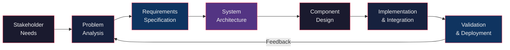
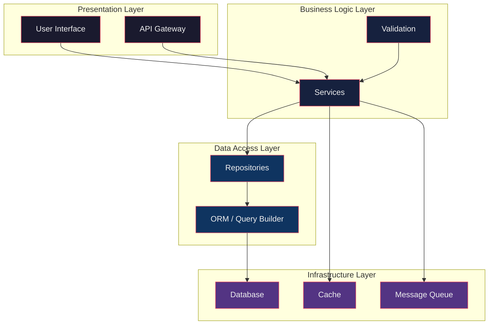
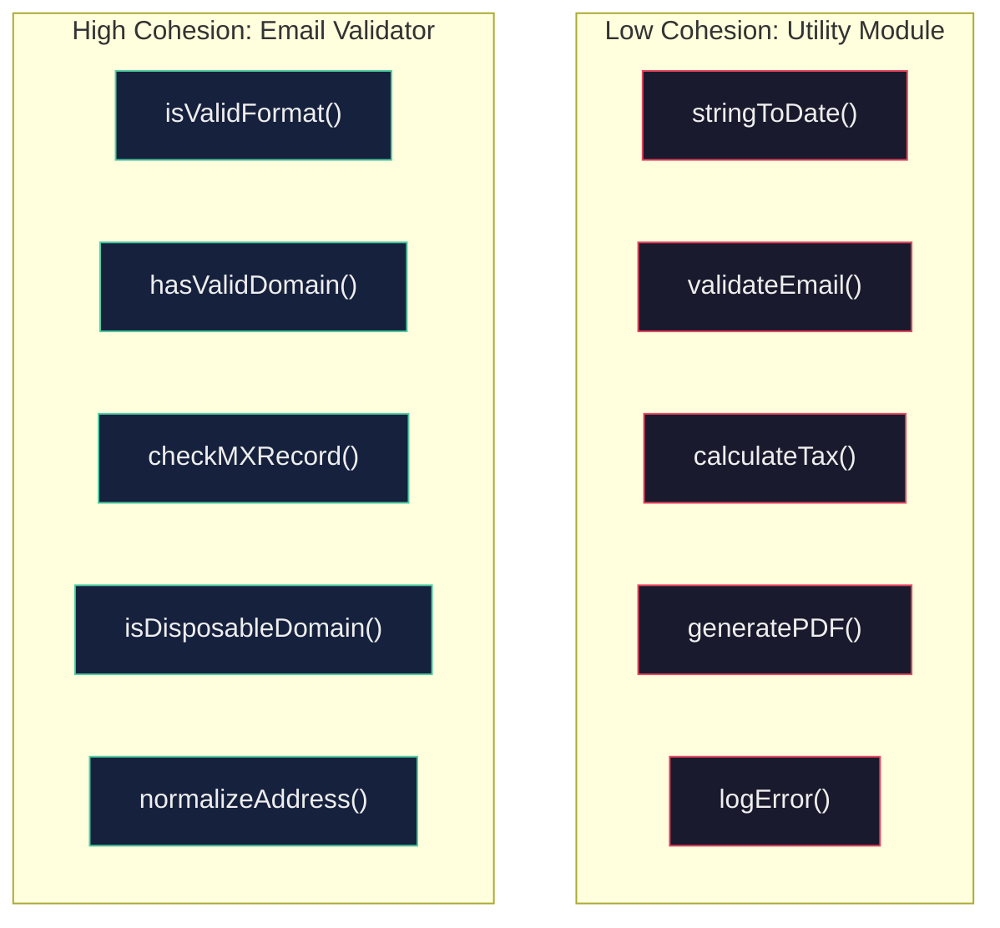
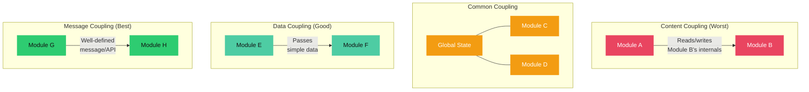
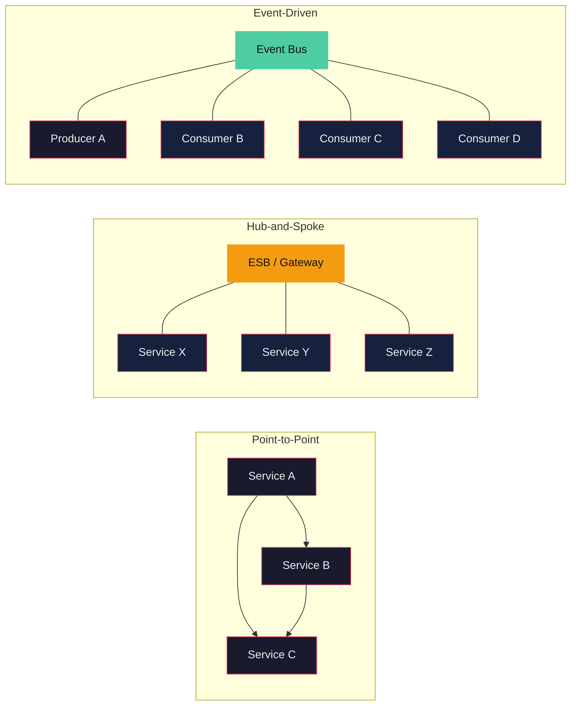
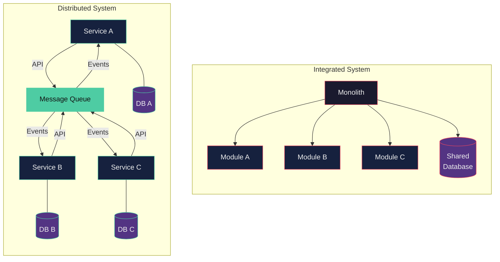
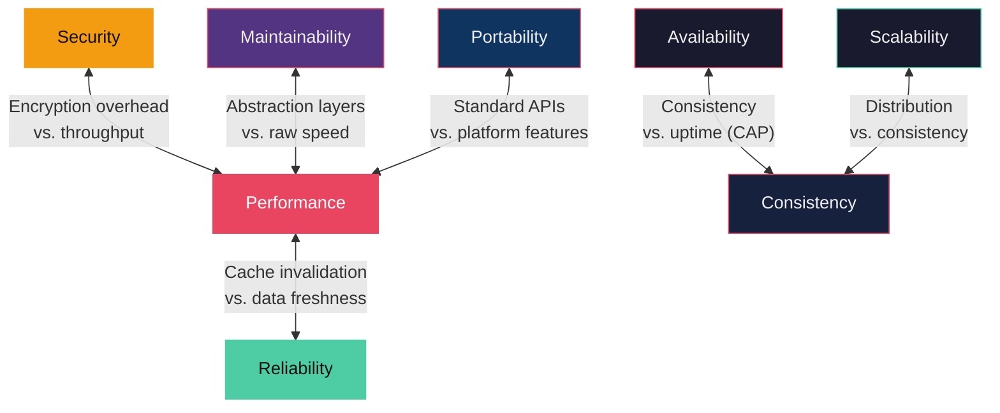
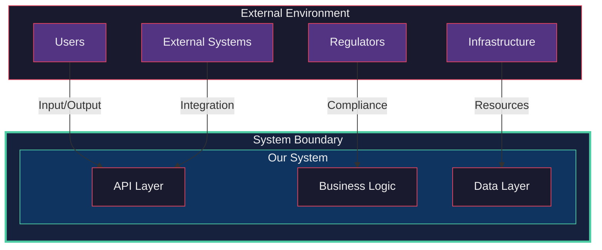

---
tags:
  - computing-foundation
  - swebok
  - systems
  - modularity
  - cohesion
  - coupling
source: "SWEBOK v4 Chapter 16"
topic: "KA 16 - Basic Concepts of a System"
---

# Basic Concepts of a System

> **SWEBOK v4 Chapter 16, Knowledge Area 1 (KA 1)**
> This note covers foundational systems thinking applied to software engineering: what constitutes a system, how to decompose and compose systems, quality attributes, and the system lifecycle.

---

## 1. What Is a System?

A **system** is a set of interconnected components that work together to achieve a defined purpose or function that no single component could accomplish alone. Systems exist at every scale, from a single microservice to a global distributed platform.

### 1.1 Core Properties of a System

| Property | Description |
|---|---|
| **Purpose** | Every system exists to fulfill a specific goal or set of goals |
| **Components** | Discrete elements (hardware, software, people, processes) that perform specific functions |
| **Interconnections** | Relationships and interactions between components (data flows, control signals, dependencies) |
| **Boundaries** | Clear separation between the system and its environment |
| **Emergent Behavior** | Properties that arise from component interactions but do not exist in any single component |
| **Hierarchy** | Systems can be nested: a subsystem of one system may itself be a complete system |
| **Inputs/Outputs** | The system exchanges matter, energy, or information with its environment |

### 1.2 System vs. Non-System

A collection of unrelated parts is **not** a system. The defining criterion is that the components must interact in a coordinated way toward a shared purpose. A drawer full of random tools is a collection; a toolkit organized for automotive repair is a system.

### 1.3 The Systems Perspective in Software Engineering

Software engineering has shifted from a component-centric view (writing individual programs) to a **systems view** where software is one element in a larger sociotechnical system that includes hardware, networks, users, operators, and organizational processes. This perspective is essential for:

- Understanding the real problem before coding a solution
- Designing architectures that handle cross-cutting concerns (security, performance, reliability)
- Managing complexity through decomposition and abstraction
- Ensuring the system as a whole delivers value to stakeholders

---

## 2. Problem-to-Solution Mapping

The most critical step in building a system is understanding the **real problem** before designing a solution. SWEBOK emphasizes a structured approach to this mapping.

### 2.1 Problem Analysis Dimensions

| Dimension | Key Questions | Example Concerns |
|---|---|---|
| **Functional Requirements** | What must the system do? | Use cases, business rules, data transformations |
| **User Interactions** | Who uses the system and how? | UX flows, accessibility, responsiveness, localization |
| **Performance Constraints** | How fast, how much, how many? | Throughput, latency, concurrent users, data volume |
| **Security Requirements** | What must be protected? | Authentication, authorization, encryption, audit trails |
| **Durability/Reliability** | How critical is uptime and data integrity? | Redundancy, failover, backup strategies, SLA targets |
| **Regulatory/Legal** | What laws or standards apply? | GDPR, HIPAA, SOX, industry-specific mandates |
| **Integration** | What external systems must it work with? | APIs, protocols, data formats, legacy systems |

### 2.2 From Problem to Solution Architecture



### 2.3 The Requirements Traceability Chain

Every solution component must trace back to a problem statement. This traceability ensures:

1. **No orphan code**: every component exists for a reason
2. **No missing coverage**: every requirement is addressed by at least one component
3. **Change impact analysis**: when a requirement changes, we know which components are affected

> **Related**: See [[01 Core Concepts]] for foundational programming abstractions that implement these solution components.

---

## 3. System Decomposition

**Decomposition** is the process of breaking a complex system into smaller, more manageable parts. It is the primary weapon against complexity in software engineering.

### 3.1 Why Decompose?

| Problem Without Decomposition | Benefit With Decomposition |
|---|---|
| Cognitive overload: no one can understand the whole | Each part can be understood independently |
| Change ripple: a change in one area affects everything | Changes are localized within components |
| Parallel development is impossible | Teams can work on separate components simultaneously |
| Testing is impractical at full scale | Components can be tested in isolation |
| Reuse is accidental at best | Components can be reused across projects |

### 3.2 Decomposition Strategies

#### Functional Decomposition
Break the system by **what it does**. Each component handles a distinct function.

```
E-Commerce System
├── User Management
│   ├── Authentication
│   ├── Profile Management
│   └── Authorization
├── Product Catalog
│   ├── Search & Filtering
│   ├── Product Details
│   └── Inventory Tracking
├── Order Processing
│   ├── Cart Management
│   ├── Checkout
│   └── Payment Processing
└── Fulfillment
    ├── Shipping
    ├── Tracking
    └── Returns
```

#### Layered Decomposition
Break the system by **level of abstraction**. Each layer depends only on the layer below it.



#### Domain-Driven Decomposition
Break the system by **business domains**. Each component encapsulates a bounded context with its own model, language, and rules.

> **Related**: See [[06 Object-Oriented Programming]] for how encapsulation and class hierarchies support domain decomposition. See also [[Design Patterns Simplify/02 Structural Patterns]] for structural patterns like Composite and Facade that manage decomposed structures.

### 3.3 Decomposition Criteria

A good decomposition satisfies:

- **High cohesion** within each component (it does one thing well)
- **Low coupling** between components (minimal dependencies)
- **Stable interfaces** (the boundaries don't change when internals do)
- **Appropriate granularity** (not too large to understand, not too small to manage)
- **Clear responsibility** (each component has a single owner and purpose)

---

## 4. Modularity

**Modularity** is the degree to which a system is composed of discrete, self-contained units (modules) with well-defined interfaces. It is the structural embodiment of decomposition.

### 4.1 Properties of a Good Module

| Property | Definition | Benefit |
|---|---|---|
| **Encapsulation** | Internal details are hidden behind the interface | Changes inside don't ripple outside |
| **Well-Defined Interface** | Clear contract for what the module exposes | Consumers can rely on stable behavior |
| **Single Responsibility** | The module addresses one concern | Easier to understand, test, and maintain |
| **Independence** | The module can be developed, tested, and deployed separately | Enables parallel work and CI/CD |
| **Replaceability** | A module can be swapped out if the interface is preserved | Supports technology migration and A/B testing |
| **Reusability** | The module can serve multiple contexts | Reduces duplication and accelerates development |

### 4.2 Module Interfaces

An interface defines **what** a module does without revealing **how**. In software, interfaces take many forms:

- **API (Application Programming Interface)**: REST endpoints, gRPC services, GraphQL schemas
- **Function signatures**: parameters, return types, exceptions
- **Abstract classes / protocols**: contracts that implementations must satisfy
- **Events / messages**: asynchronous decoupled communication
- **Shared schemas**: data contracts (Protobuf, Avro, JSON Schema)

### 4.3 Information Hiding

David Parnas's principle of **information hiding** (1972) states that each module should hide a design decision behind its interface. The key decisions to hide include:

1. **Data structure choices** (array vs. hash map vs. tree)
2. **Algorithm selection** (which sorting, which search strategy)
3. **Hardware dependencies** (device-specific I/O)
4. **External system protocols** (which payment gateway, which auth provider)
5. **Representation formats** (internal encoding, compression)

> **Related**: See [[05 Functions & Methods]] for how function-level modularity works. See [[09 Functional Programming]] for how pure functions naturally enforce module boundaries.

---

## 5. Cohesion

**Cohesion** measures how strongly the elements within a single module are related to each other. High cohesion means a module does **one thing well**; low cohesion means it is a grab bag of unrelated responsibilities.

### 5.1 Cohesion Levels (Low to High)

| Level | Type | Description | Example | Rating |
|---|---|---|---|---|
| 1 | **Coincidental** | Elements have no meaningful relationship | A "Utils" class with unrelated helpers | Worst |
| 2 | **Logical** | Elements perform similar operations selected by a flag | A class that handles "print", "display", or "export" based on a type parameter | Poor |
| 3 | **Temporal** | Elements are executed at the same time | An `init()` function that initializes unrelated subsystems | Low |
| 4 | **Procedural** | Elements follow a specific execution order | A function that steps through a pipeline but the steps aren't logically connected | Moderate |
| 5 | **Communicational** | Elements operate on the same data | A module that reads, validates, and transforms a specific record type | Good |
| 6 | **Sequential** | Output of one element is input to the next | A data processing pipeline: parse, transform, serialize | High |
| 7 | **Functional** | All elements contribute to a single, well-defined task | A module that computes a hash, or a module that renders a chart | Best |

### 5.2 Cohesion in Practice



### 5.3 Diagnosing Low Cohesion

Warning signs that a module has low cohesion:

- The module name is vague: "Manager", "Handler", "Utils", "Helper"
- The module has many unrelated public methods
- Changing one feature requires modifying the module even though other features are unrelated
- The module imports from many unrelated domains
- Unit tests for the module require extensive setup covering unrelated scenarios
- The module is a "god class" that has grown to hundreds or thousands of lines

---

## 6. Coupling

**Coupling** measures the degree of interdependence between modules. Low coupling means modules can change independently; high coupling means a change in one module forces changes in others.

### 6.1 Coupling Levels (Low to High)

| Level | Type | Description | Mechanism | Rating |
|---|---|---|---|---|
| 1 | **Message** | Modules communicate only through well-defined messages | Function calls with parameters, events | Best |
| 2 | **Data** | Modules share data structures but not control flow | Passing data objects, parameters | Excellent |
| 3 | **Stamp** | Modules share a data structure but each uses only part of it | Passing a large object when only a few fields are needed | Good |
| 4 | **Control** | One module controls the flow of another by passing control information | Passing a flag that determines what the called module does | Moderate |
| 5 | **External** | Modules share an externally imposed data format or protocol | Both depend on a specific file format or protocol version | Moderate |
| 6 | **Common** | Modules share global data | Global variables, shared mutable state | Poor |
| 7 | **Content** | One module directly accesses or modifies another's internals | Reaching into private fields, monkey-patching | Worst |

### 6.2 Coupling Diagram



### 6.3 Sources of Coupling in Modern Systems

| Source | Example | Mitigation |
|---|---|---|
| **Shared database** | Two services read/write the same table | Separate data stores per service |
| **Synchronous RPC** | Service A blocks waiting for Service B | Async messaging, circuit breakers |
| **Shared library version** | Both modules pinned to same lib version | Dependency injection, version pinning |
| **Hard-coded configuration** | Module A knows Module B's URL | Service discovery, configuration management |
| **Shared build pipeline** | Changes to A force rebuild of B | Independent build artifacts |
| **Tightly coupled deployment** | A and B must deploy together | Independent deployability |

> **Related**: See [[07 Error Handling]] for how coupling propagates error-handling complexity. See [[08 Memory Management]] for shared-memory coupling concerns.

---

## 7. The Coupling-Cohesion Trade-Off

Coupling and cohesion are inversely related in practice: **maximizing cohesion tends to minimize coupling**, and vice versa. They are the two axes of the same design quality space.

### 7.1 The Quality Quadrant

```
                    High Cohesion
                         │
            ┌────────────┼────────────┐
            │   IDEAL    │  COHESIVE  │
            │  MODULE    │  BUT TIGHT │
            │            │  (refactor │
Low ────────┤            │   needed)  ├──────── High
Coupling    │            │            │   Coupling
            │  LOOSE BUT │    WORST   │
            │  SCATTERED │  (rewrite  │
            │  (consolidate)  needed) │
            └────────────┼────────────┘
                         │
                    Low Cohesion
```

### 7.2 Strategies to Improve Both

| Strategy | Effect on Cohesion | Effect on Coupling |
|---|---|---|
| **Extract class/module** | Increases (removes unrelated concerns) | Decreases (smaller interface surface) |
| **Apply SRP (Single Responsibility)** | Increases directly | Decreases indirectly |
| **Dependency injection** | Neutral | Decreases (removes hard wiring) |
| **Event-driven architecture** | Neutral | Decreases (async, temporal decoupling) |
| **Interface segregation** | Increases (focused contracts) | Decreases (depend only on what you use) |
| **Encapsulation** | Increases (hides internals) | Decreases (fewer exposed dependencies) |

### 7.3 Measuring Cohesion and Coupling

| Metric | What It Measures | Tool/Approach |
|---|---|---|
| **LCOM (Lack of Cohesion of Methods)** | How many method pairs share no instance variables | Static analysis tools (SonarQube, CodeClimate) |
| **CBO (Coupling Between Objects)** | Number of classes a class depends on | CK metrics, static analysis |
| **Fan-in / Fan-out** | How many modules depend on this one / how many this one depends on | Dependency graph analysis |
| **Afferent/Efferent Coupling** | Incoming vs. outgoing dependencies | NDepend, JDepend, `madge` |
| **Instability (I = Ce / (Ca + Ce))** | Ratio of efferent to total coupling | Architecture fitness functions |

> **Related**: See [[Design Patterns Simplify/01 Creational Patterns]] for Factory and Builder patterns that reduce coupling by hiding construction logic. See [[Design Patterns Simplify/03 Behavioral Patterns]] for Observer and Mediator patterns that decouple communication.

---

## 8. Subsystem Integration

Once a system is decomposed, the parts must be **integrated** back into a working whole. Integration strategy is a first-class architectural decision.

### 8.1 Integration Mechanisms

| Mechanism | Description | Coupling Level | Use Case |
|---|---|---|---|
| **Direct Function Calls** | One module calls another's function directly | Moderate-High | In-process, same-team modules |
| **Shared Library / SDK** | Both modules depend on a common library | Moderate | Cross-team common utilities |
| **API (REST/GraphQL/gRPC)** | Synchronous request-response over network | Moderate | Service-to-service communication |
| **Message Queue (Kafka, RabbitMQ)** | Asynchronous message passing | Low | Event-driven, high-throughput systems |
| **Shared Database** | Modules read/write a common data store | High | Legacy systems, monoliths |
| **Shared Memory** | Modules access the same memory region | Very High | High-performance computing, embedded |
| **File Exchange** | Modules communicate via files on disk | Low-Moderate | Batch processing, ETL pipelines |
| **Event Bus / Pub-Sub** | Modules publish and subscribe to events | Low | Microservices, reactive systems |

### 8.2 Integration Patterns



### 8.3 Integration Challenges

| Challenge | Description | Mitigation |
|---|---|---|
| **Interface mismatch** | Modules expect different data formats or protocols | Adapter pattern, data transformation layers |
| **Version incompatibility** | Module A expects v1 of Module B's API | API versioning, backward compatibility guarantees |
| **Latency** | Network calls add overhead vs. in-process calls | Caching, batching, async communication |
| **Partial failure** | One module fails while others continue | Circuit breakers, bulkheads, graceful degradation |
| **Data consistency** | Keeping data consistent across modules | Saga pattern, eventual consistency, compensating transactions |
| **Configuration drift** | Modules disagree on shared settings | Centralized configuration, infrastructure as code |

> **Related**: See [[Design Patterns Simplify/02 Structural Patterns]] for Adapter and Bridge patterns used in integration. See [[Computer Networks]] for network-level integration concerns.

---

## 9. System Types

SWEBOK identifies several archetypal system configurations that software engineers should understand.

### 9.1 System Type Taxonomy

| Type | Description | Key Characteristics | Example |
|---|---|---|---|
| **Integrated System** | All components run as a unified whole | Single deployable, shared memory, tight coupling | Monolithic application |
| **Distributed System** | Components run on separate nodes, communicating over a network | Network partition tolerance, eventual consistency, latency | Microservices, cloud platforms |
| **Pooled System** | Resources are shared from a common pool | Resource contention, scheduling, fair allocation | Connection pools, thread pools, cloud IaaS |
| **Converged System** | Pre-integrated hardware + software stack | Reduced integration effort, vendor lock-in risk | Hyper-converged infrastructure, appliance servers |

### 9.2 Integrated vs. Distributed



### 9.3 Choosing a System Type

| Criterion | Integrated | Distributed | Pooled | Converged |
|---|---|---|---|---|
| **Complexity** | Low initially, high at scale | High initially, manageable at scale | Moderate | Low |
| **Scalability** | Vertical only | Horizontal | Elastic | Depends on hardware |
| **Team Autonomy** | Low (shared codebase) | High (independent services) | N/A | Moderate |
| **Deployment Risk** | All-or-nothing | Per-service | Per-pool | Appliance-level |
| **Operational Cost** | Low (single process) | High (network, monitoring) | Moderate | Moderate |
| **Latency** | Minimal (in-process) | Network-bound | Variable | Low |

---

## 10. Hardware-Software Co-Design

Modern systems are rarely pure software. **Hardware-software co-design** considers the system as an integrated hardware + software entity where design decisions in one domain affect the other.

### 10.1 Co-Design Considerations

| Area | Hardware Concern | Software Concern | Trade-Off |
|---|---|---|---|
| **Performance** | CPU architecture, GPU, FPGA, ASIC | Algorithm choice, parallelism, memory access | Hardware acceleration vs. software flexibility |
| **Power** | Thermal design, battery capacity | Idle states, polling frequency, code efficiency | Battery life vs. responsiveness |
| **Memory** | RAM, cache hierarchy, storage type | Data structures, caching strategies, compression | Cost vs. performance |
| **I/O** | Bus width, peripheral interfaces | Driver design, interrupt handling, DMA | Throughput vs. complexity |
| **Reliability** | Redundant components, ECC memory | Error handling, retry logic, data integrity | Cost vs. availability |
| **Security** | TPM, secure enclave, hardware RNG | Encryption, authentication, access control | Performance vs. protection |

### 10.2 Embedded and IoT Considerations

For embedded systems, the hardware-software boundary is especially tight:

- **Resource constraints**: limited CPU, memory, and storage demand efficient software
- **Real-time requirements**: deterministic timing requires careful scheduling
- **Power management**: software must actively manage hardware power states
- **Peripheral integration**: software directly controls sensors, actuators, and communication modules
- **Update mechanisms**: firmware updates must be reliable and atomic (OTA updates)

### 10.3 Cloud and Virtualization

Cloud computing abstracts hardware but does not eliminate co-design concerns:

- **Instance type selection**: compute-optimized vs. memory-optimized vs. GPU instances
- **Storage tiers**: SSD vs. HDD vs. object storage trade cost vs. latency
- **Network topology**: availability zones, regions, edge locations
- **Cost optimization**: right-sizing, spot instances, reserved capacity

> **Related**: See [[Computer Oraganization]] for hardware architecture fundamentals. See [[Operating Systems]] for how the OS mediates between hardware and software.

---

## 11. System Quality Attributes

Quality attributes (also called non-functional requirements or "-ilities") define **how well** a system performs its functions rather than **what** functions it performs.

### 11.1 Core Quality Attributes

| Attribute | Definition | Key Metrics | Design Tactics |
|---|---|---|---|
| **Reliability** | The system performs its required function under stated conditions for a specified period | Mean Time Between Failures (MTBF), failure rate | Redundancy, error detection, graceful degradation |
| **Availability** | The system is operational and accessible when needed | Uptime percentage (99.9% = 8.76 hrs/year downtime) | Failover, load balancing, health monitoring |
| **Maintainability** | The system can be modified to fix defects, adapt to new requirements, or improve quality | Mean Time To Repair (MTTR), change lead time | Modularity, clean code, documentation, automated tests |
| **Testability** | The system can be tested effectively and efficiently | Code coverage, defect detection rate, test execution time | Dependency injection, interface-based design, observability |
| **Portability** | The system can be transferred from one environment to another | Platform independence, migration effort | Abstraction layers, standard APIs, containerization |
| **Performance** | The system responds within acceptable time and resource limits | Latency (p50/p95/p99), throughput, resource utilization | Caching, indexing, parallelism, algorithm optimization |
| **Security** | The system protects data and resources from unauthorized access | Vulnerability count, time to patch, breach impact | Defense in depth, least privilege, encryption, audit logging |
| **Scalability** | The system handles increased load gracefully | Max concurrent users, data volume, request rate | Horizontal scaling, partitioning, async processing |

### 11.2 Quality Attribute Trade-Offs

Quality attributes frequently conflict. Understanding these trade-offs is essential for architectural decision-making.



### 11.3 Quality Attribute Scenarios

Each quality attribute should be specified with a concrete scenario:

| Part | Description | Example |
|---|---|---|
| **Source** | Who or what generates the stimulus | A user, an external system, an attacker |
| **Stimulus** | What event occurs | Login request, hardware failure, data volume spike |
| **Environment** | System state when stimulus occurs | Normal operation, startup, overload, recovery |
| **Artifact** | What part of the system is affected | Authentication module, database, network layer |
| **Response** | What the system does | Authenticate and respond, failover to replica |
| **Response Measure** | How the response is measured | Response < 200ms, failover < 5s, zero data loss |

**Example scenario**: "Under normal load (environment), when 1000 concurrent users submit orders (stimulus), the order processing service (artifact) shall confirm each order (response) within 500ms at the 95th percentile (response measure)."

---

## 12. System Boundaries and Interfaces

A system's **boundary** defines what is inside the system and what is in its environment. **Interfaces** are the points where the system interacts with its environment.

### 12.1 Defining System Boundaries



### 12.2 Interface Types

| Interface Type | Direction | Example |
|---|---|---|
| **User Interface** | Bidirectional (human-system) | Web UI, CLI, mobile app, voice interface |
| **System Interface** | Bidirectional (system-system) | REST API, message queue, shared database |
| **Hardware Interface** | Bidirectional (software-hardware) | Device drivers, sensor inputs, actuator outputs |
| **Environmental Interface** | Unidirectional (environment-system) | Configuration, deployment platform, network infrastructure |
| **Regulatory Interface** | Unidirectional (system-environment) | Audit logs, compliance reports, data exports |

### 12.3 Environmental Constraints

Every system operates within constraints imposed by its environment:

- **Regulatory**: GDPR data residency, HIPAA access controls, financial reporting requirements
- **Technical**: network bandwidth, storage capacity, compute limits, legacy system protocols
- **Organizational**: team skills, budget, timeline, existing processes
- **Physical**: data center location, power availability, cooling requirements
- **Social**: user expectations, accessibility requirements, cultural considerations

### 12.4 Context Diagrams

A **context diagram** (also called a Level 0 data flow diagram or system context diagram) visualizes the system boundary and all external entities. It is the most concise way to communicate scope.

```
┌─────────────────────────────────────────────────────┐
│                    External World                     │
│                                                       │
│  ┌─────────┐     ┌─────────────────┐    ┌─────────┐ │
│  │  Users   │────▶│                 │◀───│ Payment │ │
│  └─────────┘     │                 │    │ Gateway │ │
│                  │   OUR SYSTEM    │    └─────────┘ │
│  ┌─────────┐     │                 │    ┌─────────┐ │
│  │ Admins  │────▶│                 │◀───│ Email   │ │
│  └─────────┘     └─────────────────┘    │ Service │ │
│                       │                 └─────────┘ │
│                       ▼                              │
│                  ┌─────────┐                         │
│                  │ Database│                         │
│                  └─────────┘                         │
└─────────────────────────────────────────────────────┘
```

---

## 13. System Lifecycle

Every system passes through a lifecycle from conception to retirement. Understanding this lifecycle is essential for making architectural decisions that support long-term system health.

### 13.1 Lifecycle Phases


### 13.2 Phase Details

| Phase | Duration | Key Activities | Key Decisions |
|---|---|---|---|
| **Conception** | Weeks to months | Stakeholder analysis, feasibility study, vision definition, initial architecture | Build vs. buy, technology selection, team formation |
| **Development** | Months to years | Requirements, design, implementation, testing, deployment | Architecture patterns, coding standards, testing strategy |
| **Operation** | Years | Monitoring, incident response, capacity management, user support | SLA targets, scaling policies, monitoring strategy |
| **Evolution** | Ongoing | Feature additions, performance optimization, technology upgrades, refactoring | When to refactor vs. rewrite, migration strategy |
| **Retirement** | Weeks to months | Data migration, user notification, decommissioning, archival | Data retention policy, successor system, sunset timeline |

### 13.3 Architecture Decisions Across the Lifecycle

Different phases demand different architectural priorities:

| Phase | Primary Architecture Concern | Example Decision |
|---|---|---|
| **Conception** | Feasibility and vision alignment | Choose a modular monolith to validate the domain quickly |
| **Development** | Buildability and testability | Use dependency injection to enable unit testing |
| **Operation** | Reliability and observability | Add health checks, distributed tracing, structured logging |
| **Evolution** | Changeability and extensibility | Introduce feature flags for gradual rollout |
| **Retirement** | Data extraction and parallel running | Design APIs with versioning to support sunset period |

### 13.4 Technical Debt Across the Lifecycle

Technical debt accumulates when short-term decisions compromise long-term quality. It manifests differently at each phase:

- **Conception**: Over-ambitious scope, under-specified requirements
- **Development**: Quick hacks, skipped tests, copy-paste duplication
- **Operation**: Workarounds for production issues, deferred monitoring
- **Evolution**: Bolt-on features that don't fit the original architecture, deferred refactoring
- **Retirement**: Procrastinated decommissioning, unclear data ownership

> **Related**: See [[Clean Code Simplify]] for practices that minimize technical debt during development. See [[Fundamental Overview]] for the complete Computing Foundations curriculum map.

---

## 14. Putting It All Together: System Design Checklist

When designing or evaluating a system, use this checklist to ensure all fundamental concepts have been addressed:

| # | Concept | Question | Status |
|---|---|---|---|
| 1 | **Purpose** | Is the system's purpose clearly defined and agreed upon? | |
| 2 | **Problem Mapping** | Does every component trace to a requirement? | |
| 3 | **Decomposition** | Is the system broken into manageable, coherent parts? | |
| 4 | **Modularity** | Do modules have well-defined, stable interfaces? | |
| 5 | **Cohesion** | Is each module focused on a single responsibility? | |
| 6 | **Coupling** | Are dependencies between modules minimized and managed? | |
| 7 | **Integration** | Are integration mechanisms appropriate for the coupling level? | |
| 8 | **System Type** | Is the chosen architecture (monolith, distributed, etc.) appropriate? | |
| 9 | **HW/SW Co-Design** | Have hardware constraints and opportunities been considered? | |
| 10 | **Quality Attributes** | Are reliability, availability, maintainability, etc. specified and measured? | |
| 11 | **Boundaries** | Is the system boundary clear with well-defined external interfaces? | |
| 12 | **Lifecycle** | Is there a plan for operation, evolution, and eventual retirement? | |

---

## 15. Key Takeaways

1. **A system is more than its parts.** Emergent behavior arises from component interactions, and the system's value lies in its collective function.

2. **Decomposition is the primary tool for managing complexity.** Break systems into modules with high cohesion and low coupling.

3. **Cohesion and coupling are the twin pillars of module design.** Aim for functional cohesion and message-level coupling wherever possible.

4. **Integration is a first-class design decision.** The mechanism by which modules communicate determines system flexibility, performance, and resilience.

5. **Quality attributes define "how well," not "what."** They are often in tension, and architectural decisions resolve these trade-offs.

6. **Systems have boundaries.** Clearly defining what is inside the system and what is in the environment prevents scope creep and ensures clean interfaces.

7. **Systems have lifecycles.** Design for the full lifecycle, not just the initial release. Plan for evolution and retirement from day one.

---

## Further Reading

- [[Fundamental Overview]] for the complete Computing Foundations curriculum
- [[06 Object-Oriented Programming]] for encapsulation, inheritance, and polymorphism as modular design tools
- [[Design Patterns Simplify/01 Creational Patterns]] for Factory, Builder, and Singleton patterns that manage object creation
- [[Design Patterns Simplify/02 Structural Patterns]] for Adapter, Bridge, Composite, and Facade patterns that manage system structure
- [[Design Patterns Simplify/03 Behavioral Patterns]] for Observer, Strategy, and Mediator patterns that manage component interaction
- [[07 Error Handling]] for handling failures across module boundaries
- [[08 Memory Management]] for understanding resource-level system concerns
- [[Computer Oraganization]] for hardware architecture fundamentals
- [[Operating Systems]] for OS-level system concepts
- [[Computer Networks]] for distributed system communication
- [[Clean Code Simplify]] for practices that maintain system quality during development
