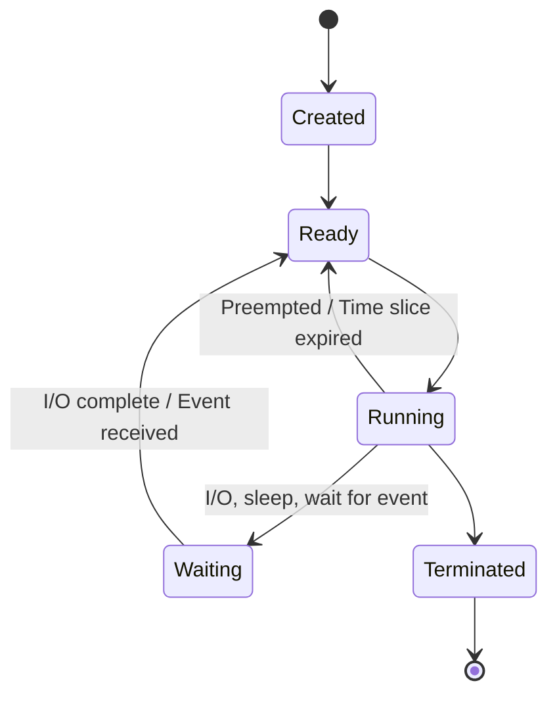

---
tags:
- linux
- os
- programming
---

# 01 Processes & Threads

A process is a running program. A thread is a unit of execution within a process. Understanding both is fundamental to writing performant backend code.

---

## Process

> A process = program in execution. Has its own memory space, file descriptors, and OS resources.

```
┌─────────────────────────────────┐
│ Process                         │
│ ┌─────────────────────────────┐ │
│ │ Code (.text)                 │ │ ← Executable instructions
│ ├─────────────────────────────┤ │
│ │ Data (.data, .bss)           │ │ ← Global/static variables
│ ├─────────────────────────────┤ │
│ │ Heap                         │ │ ← Dynamic allocation (malloc/new)
│ │          ↓ (grows down)      │ │
│ │          ↑ (grows up)        │ │
│ │ Stack                        │ │ ← Function calls, local variables
│ └─────────────────────────────┘ │
│ ┌──────┐ ┌──────┐ ┌──────┐     │
│ │Thread│ │Thread│ │Thread│     │ ← Share memory space
│ └──────┘ └──────┘ └──────┘     │
└─────────────────────────────────┘
```

---

## Process Lifecycle



| State | Meaning |
|-------|---------|
| **New** | Process being created |
| **Ready** | Waiting for CPU |
| **Running** | Executing on CPU |
| **Waiting** | Blocked on I/O, event, or sleep |
| **Terminated** | Finished or killed |

---

## Threads — Lightweight Processes

> Threads share the process's memory space. They're cheaper to create and switch between than processes.

| Process | Thread |
|---------|--------|
| Own memory space | Shares memory with sibling threads |
| IPC needed to communicate | Direct shared memory access |
| Heavyweight (MBs, slow creation) | Lightweight (KBs, fast creation) |
| One crash = one process dies | One crash can corrupt shared memory |
| `Runtime.getRuntime().exec()` | `new Thread(...)` |

### User Threads vs Kernel Threads

| | User Threads | Kernel Threads |
|---|:---:|:---:|
| **Managed by** | User-level library | OS kernel |
| **Context switch cost** | Low (no kernel mode switch) | Higher (kernel mode switch) |
| **Blocking** | One blocks ALL (kernel sees one process) | One blocks independently |
| **Example** | Green threads (early Java), Goroutines (Go) | pthreads, Java threads (modern) |

> Modern Java uses **native threads** (kernel threads). Go uses goroutines (user-level, multiplexed onto kernel threads).

---

## Context Switching

> When the CPU switches from one thread/process to another, it must save and restore the execution context.

```
Save: registers, program counter, stack pointer
Load: registers, program counter, stack pointer of next thread
Cost: ~1-10µs (microseconds)
```

### Why This Matters for Backend Devs

| Problem | Cause | Fix |
|---------|-------|-----|
| High CPU but low throughput | Too many threads. Most time in context switches, not work. | Reduce thread pool size. Use async I/O. |
| `top` shows high `sy` (system CPU) | Excessive system calls or context switches | Batch operations. Use larger buffers. |

```bash
# Check context switch rate
vmstat 1
# cs column = context switches per second
# > 100k = potentially too many threads
```

---

## Spring Boot Thread Pool Tuning

```yaml
server:
  tomcat:
    threads:
      max: 200        # Max worker threads
      min-spare: 10   # Keep alive idle
    accept-count: 100 # Queue when all threads busy
```

```java
// Custom async thread pool
@Bean
public Executor taskExecutor() {
    ThreadPoolTaskExecutor executor = new ThreadPoolTaskExecutor();
    executor.setCorePoolSize(4);              // Always running
    executor.setMaxPoolSize(16);              // Burst capacity
    executor.setQueueCapacity(100);           // Queue before rejecting
    executor.setThreadNamePrefix("async-");
    executor.setRejectedExecutionHandler(new CallerRunsPolicy());
    return executor;
}
```

---

## Sources

- Silberschatz et al. *Operating System Concepts*, Chapters 3–4.
- Linux `man` pages: `fork`, `clone`, `pthreads`
