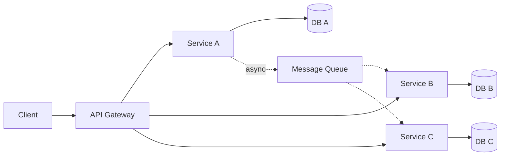

---
tags:
  - distributed-systems
  - swebok
  - software-engineering
  - architecture
  - fault-tolerance
  - consensus
source: "Distributed Systems: Principles and Paradigms — Tanenbaum & Van Steen; Designing Data-Intensive Applications — Kleppmann"
---

# Distributed Systems

> **Source:** *Distributed Systems: Principles and Paradigms* by Tanenbaum & Van Steen; *Designing Data-Intensive Applications* by Kleppmann

---

## 1. What Is a Distributed System?

> A distributed system is a collection of independent computers that appears to its users as a single coherent system. — Tanenbaum

Nodes communicate by **message passing** over a network, introducing challenges of:
- **Partial failure** — some nodes may fail while others continue
- **Concurrency** — multiple nodes operate simultaneously
- **No global clock** — no shared notion of time

---

## 2. Distributed System Models

### 2.1 Client-Server

| Aspect | Detail |
|--------|--------|
| **Structure** | Centralized server(s) provide resources; clients request and consume them |
| **Communication** | Synchronous request-response (HTTP, gRPC, RPC) |
| **Scaling** | Vertical (bigger server) or horizontal (more servers behind load balancer) |
| **Single point of failure** | Server (mitigated by replication and load balancing) |
| **Examples** | Web apps, DNS, traditional databases |

**Variants:**
- **Two-tier:** Client talks directly to server/database
- **Three-tier:** Client → Application server → Database
- **N-tier:** Multiple middleware layers (API gateway, microservices, data layer)

### 2.2 Peer-to-Peer (P2P)

| Aspect | Detail |
|--------|--------|
| **Structure** | All nodes are equal; each acts as both client and server |
| **Communication** | Direct node-to-node; gossip protocols, DHTs |
| **Scaling** | Naturally horizontal; capacity grows with participants |
| **Single point of failure** | None (inherently decentralized) |
| **Examples** | BitTorrent, IPFS, Blockchain networks |

**Key challenges:** Peer discovery, churn (nodes joining/leaving), routing efficiency, Sybil attacks.

### 2.3 Microservices

| Aspect | Detail |
|--------|--------|
| **Structure** | Application decomposed into small, independently deployable services |
| **Communication** | Synchronous (HTTP/gRPC) or asynchronous (message queues, event streams) |
| **Scaling** | Per-service scaling based on load |
| **Data ownership** | Each service owns its data store (database-per-service) |
| **Examples** | Netflix, Amazon, Uber architectures |

**Key challenges:** Service discovery, distributed tracing, data consistency across services, operational complexity.

---

## 3. CAP Theorem

**Brewer's Theorem (2000):** A distributed data store can provide at most **two out of three** guarantees simultaneously:

| Property | Meaning | Example Systems |
|----------|---------|-----------------|
| **Consistency (C)** | Every read receives the most recent write or an error | Traditional RDBMS, Zookeeper |
| **Availability (A)** | Every request receives a (non-error) response, without guarantee of the most recent write | Cassandra, DynamoDB |
| **Partition Tolerance (P)** | The system continues to operate despite network partitions between nodes | Required for any real distributed system |

**Practical interpretation:** Since network partitions are inevitable, the real choice is between **CP** (sacrifice availability during partitions) and **AP** (sacrifice strict consistency during partitions).

| System | CAP Choice | Trade-off |
|--------|------------|-----------|
| HBase, MongoDB (default) | CP | Refuses writes during partition |
| Cassandra, DynamoDB | AP | Returns potentially stale data |
| Google Spanner | CP (with TrueTime) | Uses synchronized clocks to minimize trade-off impact |

> **PACELC Extension:** Even when there is no Partition, choose between Availability and Consistency at normal times (Else, choose Latency vs. Consistency).

---

## 4. Consensus Algorithms

Consensus: a group of nodes agreeing on a single value/state despite failures.

### 4.1 Paxos

| Aspect | Detail |
|--------|--------|
| **Proposer** | Proposes a value |
| **Acceptor** | Votes on proposals; must accept the first proposal it sees (unless overridden) |
| **Learner** | Learns the chosen value |
| **Phases** | 1a: Prepare (with proposal number), 1b: Promise, 2a: Accept, 2b: Accepted |
| **Guarantee** | Safety (agreement) but not liveness (may stall) |
| **Difficulty** | Notoriously hard to implement correctly |

**Multi-Paxos:** Optimizes for stable leaders, skipping Phase 1 for subsequent values.

### 4.2 Raft

Designed for understandability. Decomposes consensus into sub-problems:

| Sub-problem | Mechanism |
|-------------|-----------|
| **Leader election** | Nodes timeout, become candidates, request votes; majority wins |
| **Log replication** | Leader appends entries, replicates to followers; commits on majority ack |
| **Safety** | Leader completeness: a leader has all committed entries |

**States:** Follower → Candidate → Leader

**Implementations:** etcd, Consul, CockroachDB, TiKV.

---

## 5. Distributed Data Structures

### 5.1 Consistent Hashing

Maps both nodes and keys to a ring (0 to 2^k). Each key is assigned to the next node clockwise.

| Property | Benefit |
|----------|---------|
| **Minimal disruption** | Adding/removing a node only reassigns keys adjacent on the ring |
| **Load balancing** | Virtual nodes (replicas on ring) ensure even distribution |
| **Scalability** | O(1) lookup per key |

**Used by:** Amazon DynamoDB, Apache Cassandra, Memcached, Akamai CDN.

### 5.2 CRDTs (Conflict-free Replicated Data Types)

Data structures that can be replicated across nodes and updated independently, with automatic conflict resolution that guarantees convergence.

| Type | Operation | Use Case |
|------|-----------|----------|
| **G-Counter** | Increment only (per-node counters, merged by max) | Distributed counting |
| **PN-Counter** | Increment + decrement (two G-Counters) | Like/dislike counts |
| **G-Set** | Add only (union on merge) | Shopping cart additions |
| **OR-Set** | Add + remove (observed-remove) | Collaborative editing |
| **LWW-Register** | Last-writer-wins by timestamp | Simple key-value |
| **Sequence CRDT** | Ordered insert/delete with position metadata | Real-time collaborative text (Yjs, Automerge) |

**Key property:** All replicas converge to the same state regardless of the order of message delivery.

---

## 6. Fault Tolerance Patterns

### 6.1 Circuit Breaker

Prevents cascading failures by wrapping calls to remote services.

| State | Behavior | Transition |
|-------|----------|------------|
| **Closed** | Requests pass through; failures counted | Opens when failure threshold exceeded |
| **Open** | Requests fail immediately without calling remote service | Transitions to Half-Open after timeout |
| **Half-Open** | Limited requests pass through to test recovery | Closes on success, re-opens on failure |

**Libraries:** Hystrix (Java, legacy), Resilience4j, Polly (.NET), opossum (Node.js).

### 6.2 Bulkhead

Isolates components so failure in one doesn't cascade to others (named after ship bulkhead compartments).

| Strategy | Mechanism |
|----------|-----------|
| **Thread pool isolation** | Separate thread pools per remote service |
| **Connection pool limits** | Cap connections per downstream service |
| **Process isolation** | Run critical services in separate processes/containers |
| **Rate limiting** | Cap requests per consumer/service |

### 6.3 Retry with Backoff

| Strategy | Behavior | Risk |
|----------|----------|------|
| **Immediate retry** | Retry N times without delay | Thundering herd |
| **Fixed backoff** | Wait constant interval between retries | Still synchronized retries |
| **Exponential backoff** | Double wait time each retry (1s, 2s, 4s, 8s...) | Better but still deterministic |
| **Exponential + jitter** | Add random component to backoff | Best; spreads load across time |

**Key:** Always set a maximum retry count and total timeout. Combine with circuit breaker for robustness.

---

## 7. Eventual Consistency

A consistency model where, given no new updates, all replicas will **eventually** converge to the same state.

| Property | Detail |
|----------|--------|
| **Guarantee** | All replicas converge if no new writes occur |
| **No guarantee** | When convergence will happen; reads may return stale data temporarily |
| **Conflict resolution** | Application-specific: last-writer-wins, vector clocks, CRDTs |

**Variants:**
- **Causal consistency:** Operations that are causally related are seen in the same order by all nodes
- **Read-your-writes:** A process always sees its own writes
- **Monotonic reads:** Once you read a value, subsequent reads won't return older values
- **Session consistency:** Combines read-your-writes + monotonic reads within a session

**Used by:** Dynamo-style stores (Cassandra, Riak, Amazon DynamoDB), DNS.

---

## 8. Vector Clocks

A mechanism for tracking causal ordering of events in a distributed system without a global clock.

Each node maintains a vector of logical clocks (one per node).

| Rule | Operation |
|------|-----------|
| **Local event** | Increment own counter: V_i[i]++ |
| **Send message** | Increment own counter, attach vector to message |
| **Receive message** | Element-wise max of local and received vector, then increment own counter |

**Causality check:**
- V1 < V2 (V1 happened before V2) if all elements of V1 <= V2 and at least one is strictly less
- V1 || V2 (concurrent) if neither V1 <= V2 nor V2 <= V1

**Limitation:** Vector size grows linearly with number of nodes. Solutions: dotted version vectors, version vector pruning.

---

## 9. Distributed Transactions

### 9.1 Two-Phase Commit (2PC)

| Phase | Steps |
|-------|-------|
| **Phase 1: Prepare** | Coordinator sends PREPARE to all participants; each votes YES (ready to commit) or NO (abort) |
| **Phase 2: Commit/Abort** | If ALL vote YES: coordinator sends COMMIT; if ANY votes NO: sends ABORT |

| Property | Detail |
|----------|--------|
| **ACID guarantee** | Atomicity across distributed nodes |
| **Blocking** | If coordinator crashes after PREPARE, participants block waiting for decision |
| **Performance** | High latency (2 round trips), locks held during entire protocol |
| **Recovery** | Coordinator must log decisions; participants must log votes |

### 9.2 Saga Pattern

Replaces a single distributed transaction with a sequence of local transactions, each with a compensating action.

| Approach | Mechanism |
|----------|-----------|
| **Choreography** | Each service publishes events; next service reacts. No central coordinator |
| **Orchestration** | A central saga orchestrator directs each step and handles failures |

| Trade-off | 2PC | Saga |
|-----------|-----|------|
| Consistency | Strong (atomic) | Eventual (compensating transactions) |
| Availability | Lower (blocking) | Higher (no distributed locks) |
| Complexity | Protocol complexity | Business logic complexity (compensation) |
| Latency | High (2 round trips) | Lower (sequential local txns) |
| Isolation | Full (locks held) | None (intermediate states visible) |

---

## 10. Distributed Mutual Exclusion

Ensuring only one process accesses a shared resource at a time, without shared memory.

### 10.1 Centralized Approach

A single coordinator grants permission. Simple but coordinator is a single point of failure.

### 10.2 Distributed Approach (Ricart-Agrawala)

1. Node wants to enter critical section (CS); sends REQUEST to all other nodes
2. Receiving node replies REPLY immediately if not in CS and not waiting; otherwise queues the request
3. Node enters CS after receiving REPLY from all other nodes
4. On exiting CS, send REPLY to all queued requests

**Messages:** 2(N-1) per CS entry (N = number of nodes).

### 10.3 Token-Based Approach

A unique token circulates among nodes. Only the node holding the token can enter the CS.

| Property | Detail |
|----------|--------|
| **Advantage** | No starvation (token guarantees access) |
| **Disadvantage** | Token loss requires recovery protocol |
| **Message complexity** | O(1) messages for CS entry (token passed) |

---

## 11. Election Algorithms

### 11.1 Bully Algorithm

1. Node P detects coordinator failure, sends ELECTION to all higher-numbered nodes
2. If no higher node responds, P becomes coordinator and sends COORDINATOR message to all
3. If a higher node responds, it takes over the election

**Messages:** O(N^2) worst case. Highest active node always wins.

### 11.2 Ring Algorithm

1. Node detects failure, sends ELECTION message with its ID to the next active neighbor
2. Each node appends its ID and forwards
3. Message returns to initiator; initiator selects highest ID and sends COORDINATOR message around ring

**Messages:** O(N) for both election and coordinator announcement.

---

## 12. Distributed File Systems

| System | Key Innovation | Consistency |
|--------|---------------|-------------|
| **NFS** | Transparent remote file access via VFS layer | Close-to-open consistency (NFSv4) |
| **HDFS** | Write-once-read-many; data split into blocks replicated across DataNodes | Strong consistency (single writer) |
| **GFS** | Single master, chunk servers, append-heavy workloads | Relaxed consistency for appends |
| **Ceph** | CRUSH algorithm for data placement; no central metadata server | Strong (via RADOS) |
| **IPFS** | Content-addressed P2P filesystem; files identified by hash (CID) | Eventual |

### HDFS Architecture

- **Block replication:** Typically 3 replicas across different racks
- **Rack awareness:** Replicas placed on different racks for fault tolerance
- **Heartbeats:** DataNodes send periodic heartbeats to NameNode

---

## 13. MapReduce

A programming model for processing large datasets in parallel across a distributed cluster.

| Phase | Input | Output | Description |
|-------|-------|--------|-------------|
| **Map** | (key, value) pairs | Intermediate (key, value) pairs | User-defined function processes each input pair |
| **Shuffle & Sort** | Intermediate pairs | Grouped by key | Framework groups all values for each key |
| **Reduce** | (key, [values]) | Final output | User-defined function aggregates values per key |

| Property | Detail |
|----------|--------|
| **Data locality** | Move computation to data, not data to computation |
| **Fault tolerance** | Re-executes failed tasks on other nodes |
| **Limitations** | High latency, batch-only (not for real-time), multi-pass jobs are expensive |

**Successors:** Apache Spark (in-memory, 10-100x faster for iterative jobs), Apache Flink (stream processing).

---

## Key Takeaways

1. **Distributed systems** trade simplicity for scalability, availability, and fault tolerance
2. **CAP theorem** forces a choice between consistency and availability during network partitions
3. **Consensus algorithms** (Paxos, Raft) enable agreement despite failures; Raft was designed for understandability
4. **Consistent hashing** minimizes disruption when nodes join/leave; CRDTs enable conflict-free replication
5. **Fault tolerance patterns** (circuit breaker, bulkhead, retry+backoff) prevent cascading failures
6. **Eventual consistency** trades immediate consistency for availability; vector clocks track causality
7. **2PC** provides strong atomicity but blocks; **Saga pattern** trades isolation for availability
8. **Distributed mutual exclusion** and **election algorithms** are fundamental coordination problems
9. **MapReduce** enables batch processing of massive datasets; Spark and Flink extend it for iterative and streaming workloads

---

## Related

- [[Operating Systems Overview]] — IPC, synchronization, deadlocks
- [[Computer Networks Overview]] — Network protocols and communication
- [[Database Overview]] — Distributed databases, consistency models
- [[Computer Organization Overview]] — Parallel computing architectures

---

## Sources

- Tanenbaum, A. S., & Van Steen, M. *Distributed Systems: Principles and Paradigms* (3rd ed.)
- Kleppmann, M. *Designing Data-Intensive Applications* (2017)
- Lamport, L. "The Part-Time Parliament" (Paxos, 1998)
- Ongaro, D., & Ousterhout, J. "In Search of an Understandable Consensus Algorithm" (Raft, 2014)
- Brewer, E. "CAP Twelve Years Later" (2012)
- SWEBOK v4, Chapter 16 — Computing Foundations
