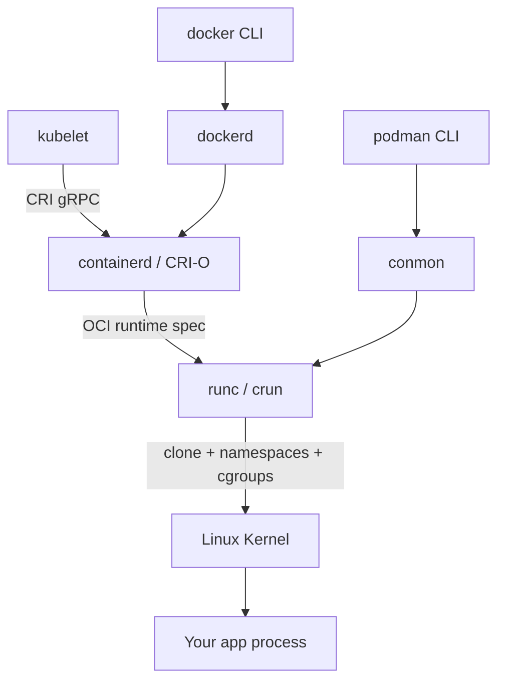

---
tags:
- linux
- os
- programming
- containers
---

# 05 Containers — Namespaces & Cgroups

A container is not a small VM. It's an ordinary Linux process whose *view* of the system is restricted by **namespaces** (what it can see) and whose *resource use* is capped by **cgroups** (what it can consume). One kernel, many isolated worlds. Everything "Docker" does on Linux is user-space tooling wrapped around these two kernel features plus layered filesystems.

See also: [[01 Processes & Threads]] (containers *are* processes), [[02 Memory Management]], [[02 File Systems]] (overlayfs), [[01 System Calls & Kernel]].

---

## Containers = Kernel Features, Not Machines

```
┌─────────── VM ───────────┐   ┌────────── Container ──────────┐
│ App        App           │   │ App          App              │
│ Libs       Libs          │   │ Libs         Libs             │
│ Guest OS   Guest OS      │   └──────┬───────┴──────┬─────────┘
├──────────────────────────┤          │ namespace    │ cgroup
│ Hypervisor               │          ▼ (isolation)  ▼ (limits)
├──────────────────────────┤   ┌───────────────────────────────┐
│ Host OS + Hardware       │   │ ONE shared host kernel        │
└──────────────────────────┘   └───────────────────────────────┘
```

| Property | VM | Container |
|----------|----|-----------|
| Isolation boundary | Hardware (hypervisor) | Kernel (namespaces) |
| Boot time | Seconds–minutes | Milliseconds |
| Overhead | Full guest OS (100s of MB) | Image layers only |
| Density per host | Tens | Hundreds–thousands |
| Kernel | Own, guest-chosen | Shared with host |

---

## The 8 Linux Namespaces

Each namespace wraps one global kernel resource so processes inside see a private instance of it.

| Namespace | Flag (`clone`/`unshare`) | Isolates | Since |
|-----------|--------------------------|----------|-------|
| **mnt** | `CLONE_NEWNS` | Mount points, filesystem tree | 2.4.19 |
| **pid** | `CLONE_NEWPID` | Process ID numbers | 2.6.24 |
| **net** | `CLONE_NEWNET` | Network stack: devices, IPs, ports, routes, iptables | 2.6.29 |
| **ipc** | `CLONE_NEWIPC` | System V IPC, POSIX message queues | 2.6.19 |
| **uts** | `CLONE_NEWUTS` | Hostname and domain name | 2.6.19 |
| **user** | `CLONE_NEWUSER` | UID/GID mapping — root inside ≠ root outside | 3.8 |
| **cgroup** | `CLONE_NEWCGROUP` | View of `/proc/<pid>/cgroup` and cgroup mounts | 4.6 |
| **time** | `CLONE_NEWTIME` | Offsets for `CLOCK_MONOTONIC` and `CLOCK_BOOTTIME` | 5.6 |

```bash
# Create new namespaces and run a shell in them
sudo unshare --mount --pid --fork --uts --ipc --net /bin/bash

# Inspect: what namespaces exist, who's in them
lsns                        # all namespaces on the system
lsns -t pid                 # just PID namespaces
readlink /proc/<pid>/ns/*   # namespace inode IDs of a process

# Join an EXISTING namespace of a running process (what `docker exec` does)
sudo nsenter --target <pid> --mount --uts --ipc --net --pid
sudo nsenter --all --target <pid>

# Everything about a process's namespaces at once
ls -l /proc/$$/ns/
```

---

## PID Namespace — You Are PID 1 Now

- First process in the namespace is **PID 1**; children get 2, 3, … The same process still has a *different* PID on the host.
- PID 1 has special duties a normal app doesn't implement: **reaping orphaned zombies** (`SIGCHLD` + `wait()`). If your container's entrypoint is `python app.py`, zombies from short-lived children pile up forever.
- PID 1 also **ignores default signal actions** — `kill -TERM 1` inside the namespace does nothing unless the app installs a handler. This is why `docker stop` sometimes waits the full 10 s before SIGKILL.

Fix: run a tiny init as PID 1.

```bash
docker run --init myimage          # injects docker-init (tini fork)
# or in the image:
ENTRYPOINT ["tini", "--", "java", "-jar", "app.jar"]
```

```bash
# See PID namespaces from inside vs outside
sudo unshare --pid --fork --mount-proc bash
echo $$        # prints 1 — you are init
ps aux         # mount-proc gave this namespace its own /proc
```

---

## Network Namespace — veth Pairs & Bridges

A net namespace starts **empty**: only `lo` (down). No eth0, no DNS, no routes. You build connectivity with **veth pairs** — virtual ethernet cables where bytes in one end come out the other.

```
        HOST netns                          CONTAINER netns
┌──────────────────────────┐        ┌──────────────────────────┐
│  eth0 (192.168.1.10)     │        │                          │
│      │ NAT/iptables      │        │   eth0 (172.17.0.2)      │
│  docker0 bridge          │        │      ▲                   │
│  (172.17.0.1)            │        │      │                   │
│      ├── vethHOST1 ══════╪════════╪══════╯  (peer end inside)│
│      └── vethHOST2 ══════╪════════╪═══ container 2           │
└──────────────────────────┘        └──────────────────────────┘
```

Docker default bridge wiring: create netns → create veth pair → move one end in, rename to `eth0` → attach host end to `docker0` bridge → assign IP → in the container, default route via `172.17.0.1` → on the host, **iptables MASQUERADE** for outbound, **DNAT** for `-p 8080:80` published ports.

```bash
# Manual namespace networking (what runtimes automate)
sudo ip netns add web
sudo ip link add veth0 type veth peer name veth1
sudo ip link set veth1 netns web
sudo ip link set veth0 up
sudo ip netns exec web ip addr add 10.0.0.2/24 dev veth1
sudo ip netns exec web ip link set veth1 up
sudo ip netns exec web ping 10.0.0.1

ip netns list                       # named namespaces (/var/run/netns)
sudo ip netns exec web ss -tlnp     # run anything inside the netns
sudo nsenter --net=/var/run/netns/web ip a
```

---

## User Namespaces — Rootless Containers

Map container UID 0 to an unprivileged host UID: the process is **root inside, nobody outside**. A container escape lands you as `uid 100000`, not root.

```
Container UID   →  Host UID
      0 (root)  →  100000
      1         →  100001
    ...         →  ...
```

```bash
cat /etc/subuid            # admin:100000:65536 — your UID range
sudo unshare --user --map-root-user id   # uid=0(root) — but only inside
grep -E 'Uid|Gid' /proc/self/status      # real host IDs unchanged

podman run --uidmap 0:100000:65536 alpine id   # rootless podman
```

This is why **Podman** can run fully daemonless and rootless — no root-owned daemon on the host is one less thing to compromise.

---

## Cgroups v2 — The Resource Leash

Namespaces hide resources; cgroups **limit** them. v2 (unified hierarchy, default on modern distros) puts every controller in one tree under `/sys/fs/cgroup`. A process is in exactly one leaf cgroup; children inherit.

| Controller | Key files | Effect |
|------------|-----------|--------|
| **cpu** | `cpu.max` (`"200000 100000"` = 2 CPUs), `cpu.weight` (1–10000, relative share) | Exceed `cpu.max` → **throttled** (process stalls until next period) |
| **memory** | `memory.max` (hard cap), `memory.high` (soft: heavy reclaim + stall), `memory.current` | Exceed `memory.max` → kernel **OOM-kills** a process in the group (Docker shows `OOMKilled`, exit 137) |
| **io** | `io.max` (`"253:0 rbps=1048576 wbps=max"`), `io.weight` | Bandwidth/IOPS caps per block device |
| **pids** | `pids.max` | Fork-bomb stopper: `fork()` returns EAGAIN |

> Throttle vs OOMKill: CPU is a *compressible* resource — overuse gets you paused. Memory is *incompressible* — overuse gets you killed. That asymmetry is why memory limits need headroom and CPU limits mostly just add latency spikes.

```bash
# Build a cgroup by hand (v2)
sudo mkdir /sys/fs/cgroup/demo
echo "+cpu +memory +pids" | sudo tee /sys/fs/cgroup/cgroup.subtree_control
echo "50000 100000"  | sudo tee /sys/fs/cgroup/demo/cpu.max   # 0.5 CPU
echo "64M"           | sudo tee /sys/fs/cgroup/demo/memory.max
echo "50"            | sudo tee /sys/fs/cgroup/demo/pids.max
echo $$              | sudo tee /sys/fs/cgroup/demo/cgroup.procs
# this shell is now limited — try `stress-ng --vm 1 --vm-bytes 128M`

# Inspect what a container sees
cat /sys/fs/cgroup/memory.max
cat /sys/fs/cgroup/cpu.stat        # nr_throttled, throttled_usec — proof of throttling
cat /proc/<pid>/cgroup             # 0::/system.slice/docker-<id>.scope
systemd-cgls                       # whole tree
```

---

## The Container Runtime Stack



| Layer | What it is | What it does |
|-------|-----------|--------------|
| **OCI image/runtime spec** | JSON standards | `config.json` tells a runtime: namespaces, cgroup limits, mounts, argv |
| **runc / crun** | OCI runtime | The *only* part that touches the kernel: `clone()`, `unshare`, cgroup writes, `pivot_root`, then `exec` your app and exit |
| **containerd / CRI-O** | High-level runtime | Image pull/push, layer management, container lifecycle, snapshots; talks to runc per container |
| **CRI** | gRPC interface | How Kubernetes (kubelet) talks to containerd/CRI-O |
| **Docker** | CLI + dockerd + BuildKit | Image building, UX; *runs* containers via containerd → runc |
| **Podman** | CLI, daemonless | Same OCI flow, rootless-friendly, systemd integration |

```bash
# A container is just a process — find it
docker inspect -f '{{.State.Pid}}' mycontainer
sudo ls -l /proc/<pid>/ns/          # its namespaces
sudo cat /proc/<pid>/cgroup         # its cgroup
ps -eo pid,ns,comm | head           # ns column, util-linux ≥ 2.36
```

---

## Images & Layers — OverlayFS Copy-on-Write

An image = **stacked read-only layers** + a JSON config (env, entrypoint). Running adds one **writable layer** on top via overlayfs: reads fall through to lower layers; first write to a file **copies it up** into the writable layer (copy-up). Delete a lower-layer file → a *whiteout* marker hides it (size isn't reclaimed until you rebuild).

```
┌────────────────────────┐
│ Writable layer (upper) │ ← your app's writes, /tmp, logs
├────────────────────────┤
│ Layer: COPY app.jar    │  read-only ─┐
│ Layer: RUN apt-get …   │  read-only  ├ shared by ALL containers
│ Layer: FROM ubuntu     │  read-only ─┘ from this image
└────────────────────────┘
```

```bash
docker history myimage            # layers and sizes
docker inspect -f '{{.GraphDriver.Data}}' <cid>   # lowerdir/upperdir/merged
mount | grep overlay
```

Consequences: layer caching makes builds fast; **write-heavy paths** (databases) suffer copy-up — use volumes (bypass overlay entirely); deleting a huge file your base image contains does *not* shrink your image.

---

## What Containers Do NOT Isolate

- **The kernel itself.** One kernel, one syscall table, one scheduler. A kernel LPE bug (Dirty COW, Dirty Pipe, netfilter UAFs) = every container on the host falls.
- **`/proc` quirks.** `/proc/cpuinfo`, `/proc/meminfo`, `uptime`, `/proc/loadavg` still show **host** values — they're not namespaced. Only `/proc/[pid]` listings follow the PID namespace.
- **Time** (offsets only since 5.6 — and container runtimes don't use it; you can't give a container its own clock rate).
- **`dmesg`** (restricted, not virtualized), kernel modules, hardware clocks.

> A container escape (break out of namespaces → host root) is categorically easier than a VM escape (defeat the hypervisor's hardware-enforced boundary). That's why untrusted multi-tenant code goes in microVMs — see [[05 Virtualization - KVM & Hypervisors]].

### Security defaults

Docker/containerd drop most Linux capabilities (no `CAP_SYS_ADMIN`, ~14 of 38 kept), apply a **seccomp** profile blocking ~40–50 dangerous syscalls (`mount`, `reboot`, `kexec_load`, `bpf`…), and often run with AppArmor/SELinux confinement. Details in [[06 OS Security Model - Capabilities, SELinux & Seccomp]].

---

## The Resource-View Lie (JVM / Go)

Because `/proc/meminfo` and `nproc` show the **host**, an unaware runtime sizes itself for the whole machine inside a 512 MB container → instant OOMKill.

| Runtime | Problem | Fix |
|---------|---------|-----|
| **JVM ≤ 8u131** | Heap sized from host RAM | Upgrade; or `-XX:+UseContainerSupport` (default on since 8u191/10) reads cgroup limits |
| **JVM** | CPU-based GC/JIT threads from host core count | Same flag; `-XX:MaxRAMPercentage=75` beats fixed `-Xmx` in containers |
| **Go ≤ 1.18** | `GOMAXPROCS` = host CPUs → excess context switches & latency | Go 1.19+: still host-based! Use `automaxprocs` or set `GOMAXPROCS` explicitly |
| **.NET ≥ 3.0** | — | Container-aware by default (`DOTNET_SYSTEM_GLOBALIZATION_INVARIANT` era fixes) |

```bash
# What the JVM actually sees
docker run -m 512m eclipse-temurin:21 java -XX:+PrintFlagsFinal -version | grep -i maxheap
# Compare inside:
cat /sys/fs/cgroup/memory.max     # 536870912
head -1 /proc/meminfo             # host total — the lie
```

Rule of thumb: leave ~25 % headroom between app heap and `memory.max` (metaspace, threads, glibc arenas, page cache all count).

---

## Sources

- LWN: *Namespaces in operation* series — https://lwn.net/Articles/531114/ (Michael Kerrisk).
- LWN: *Control Group v2* documentation & *The unified hierarchy* articles.
- Kernel docs: `Documentation/admin-guide/cgroup-v2.rst`, `Documentation/userspace-api/namespaces/`.
- `man` pages: `namespaces(7)`, `cgroups(7)`, `unshare(1)`, `nsenter(1)`, `lsns(8)`, `ip-netns(8)`.
- Nigel Poulton. *Docker Deep Dive* (2024 ed.).
- Liz Rice. *Container Security* (O'Reilly, 2020) — namespaces, capabilities, escapes.
- OCI Runtime Specification — https://github.com/opencontainers/runtime-spec
- JVM container support: JDK-8146115 / `-XX:+UseContainerSupport` docs; Uber `automaxprocs`.
