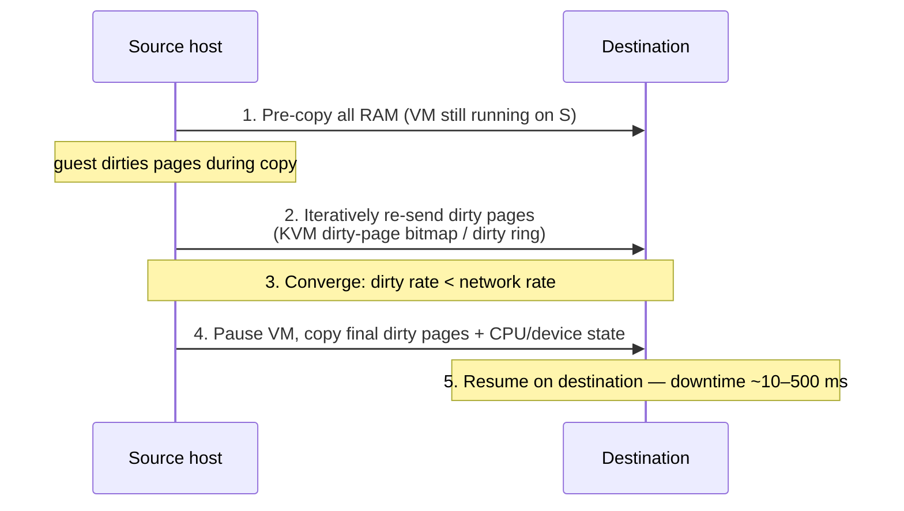

---
tags:
- linux
- os
- programming
- virtualization
---

# 05 Virtualization — KVM & Hypervisors

Virtualization means presenting **virtual hardware** — CPU, RAM, disks, NICs — so an unmodified guest OS believes it owns a real machine. Where containers share one kernel ([[05 Containers - Namespaces & Cgroups]]), every VM boots its *own* kernel on top of a hypervisor. That hardware-enforced boundary is the whole point: it's why banks, clouds, and multi-tenant platforms run VMs.

---

## Type 1 vs Type 2 Hypervisors

| | **Type 1 (bare-metal)** | **Type 2 (hosted)** |
|---|---|---|
| Runs on | Hardware directly | Inside a host OS |
| Examples | VMware ESXi, Xen, Microsoft Hyper-V, Proxmox VE (KVM) | VirtualBox, VMware Workstation/Fusion, Parallels |
| Overhead | Minimal — no host OS in the path | Host OS scheduler/stack in the way |
| Use case | Datacenter, production cloud | Dev laptops, testing |

### Where KVM actually sits

KVM is a **Linux kernel module** (`kvm.ko` + `kvm-intel.ko`/`kvm-amd.ko`) that turns the Linux kernel itself into a hypervisor: it exposes `/dev/kvm` and handles CPU/memory virtualization. **QEMU** is the user-space half — device emulation (disks, NICs, BIOS/UEFI), VM process management. One VM = one QEMU process; each vCPU = one host thread.

> The taxonomy nuance: KVM doesn't run "on bare metal" — the Linux host is technically the hypervisor OS. But since guests run in hardware-assisted isolation and the host kernel *is* the hypervisor, it behaves as Type 1. That's why Proxmox (Debian + KVM) and every major cloud (EC2's older Nitro-predecessors, GCE, Azure Linux hosts) are classified Type 1.

```bash
# Is this machine virtualization-capable?
egrep -c '(vmx|svm)' /proc/cpuinfo    # >0 = VT-x (Intel) or AMD-V
lsmod | grep kvm                       # kvm_intel / kvm_amd loaded?
sudo dnf install qemu-kvm libvirt virt-install   # RHEL-family stack
sudo systemctl enable --now libvirtd
```

---

## CPU Virtualization — A Short History

The problem: x86 has 4 privilege rings, but a guest OS kernel expects ring 0 for itself. It can't have it (the hypervisor needs ring 0), yet **17 sensitive instructions** (e.g. `POPF`, `SGDT`, `LMSW`) don't trap when executed at reduced privilege — they just silently misbehave. Classic **trap-and-emulate** (Popek–Goldberg, 1974) fails on x86: *ring aliasing*.

| Era | Technique | How | Fate |
|-----|-----------|-----|------|
| ~1999 | **Binary translation** (VMware) | Rewrite guest kernel code on the fly; trap-prone instructions replaced with calls to the VMM | Worked on any x86; slow, complex |
| 2003 | **Paravirtualization** (Xen) | *Modify* the guest OS to call the hypervisor directly ("hypercalls") instead of using privileged instructions | Fast, but guests must be ported |
| 2005+ | **Hardware assist: VT-x / AMD-V** | CPU gains a mode *above* ring 0: **root mode** (hypervisor) vs **non-root mode** (guest). Guest runs full-speed in non-root; sensitive events trigger a **VM exit** → hypervisor handles → **VM entry** resumes. State saved in VMCS (Intel) / VMCB (AMD) | The universal answer; KVM exists because of this |
| 2008+ | **EPT (Intel) / NPT or RVI (AMD)** | Hardware **nested page tables**: guest-physical → host-physical translation done by the MMU, no shadow-page bookkeeping | Made memory virtualization ~2× faster |

```
VM entry ──▶ guest runs at full speed (non-root mode)
                 │ sensitive event (I/O, page fault, HLT, CPUID…)
                 ▼
             VM exit ──▶ KVM/QEMU in root mode handles it
                 │
             VM entry ──▶ guest resumes, none the wiser
```

Exits cost ~0.5–2 µs each; hypervisor engineering is largely *exit avoidance*.

---

## Memory Virtualization

Three address levels: **guest virtual → guest physical → host physical**. Pre-EPT, hypervisors kept *shadow page tables* merging both translations — correct but brutally expensive on TLB flushes. With **EPT/NPT** the MMU walks two page tables in hardware; the hypervisor just maintains the G→H map.

Memory overcommit tricks:

| Technique | What it does |
|-----------|--------------|
| **Ballooning** (`virtio-balloon`) | A guest driver inflates a "balloon" of pages on host request; guest OS hands them over thinking they're in use → host reclaims. Cooperative, no guest crash. |
| **KSM** (Kernel Samepage Merging) | Scans host RAM, merges *identical* pages (same OS image across 100 VMs → 1 copy, marked COW). Free density; small CPU cost, security caveat (side channels). |
| **Huge pages** | Back guest RAM with 2 MB/1 GB pages → fewer EPT entries, fewer TLB misses. Standard for latency-sensitive VMs (NFV, databases). |
| **Swap / page-out** | Host swaps cold guest pages. Last resort — guests double-swap unpredictably. |

```bash
cat /sys/kernel/mm/ksm/pages_shared      # KSM activity
grep Huge /proc/meminfo                  # hugepages in use
```

---

## I/O Virtualization — Three Speeds

| Approach | Mechanism | Cost | Example |
|----------|-----------|------|---------|
| **Full emulation** | Virtual hardware (e1000 NIC, IDE disk); every I/O traps → QEMU emulates register-level behavior | Slowest; max exits | QEMU default without flags |
| **Paravirtual (virtio)** | Guest *knows* it's virtual; installs **virtio-net / virtio-blk / virtio-scsi / virtio-balloon** drivers speaking a shared-memory ring protocol (vring) with the host | Near-native; the default everywhere | `-device virtio-net-pci` |
| **Device passthrough (SR-IOV / VT-d / IOMMU)** | Physical device (or one of its SR-IOV **virtual functions**) is DMA-mapped straight into the guest; IOMMU (VT-d/AMD-Vi) enforces isolation | Native speed, ~zero host CPU; loses live migration, pins a device | `<hostdev>` in libvirt XML |

```
emulated:  guest → trap → QEMU → host stack → NIC        (100s of exits/I/O)
virtio:    guest driver ↔ vring (shared mem) ↔ host backend (few exits)
SR-IOV:    guest driver ↔ NIC virtual function             (host bypassed)
```

---

## Live Migration

Move a running VM between hosts with near-zero downtime (**pre-copy**):



Requirements: shared storage (or storage migration too), same CPU feature set (libvirt `cpu mode='custom'` masks differences), fast network vs dirty-page rate (write-heavy VMs may never converge → auto-converge throttles the guest vCPUs).

---

## Nested Virtualization

Running VMs *inside* VMs (CI runners, testing hypervisors in the cloud). Needs the outer hypervisor to expose VMX/SVM to the guest:

```bash
# Host: enable nesting
echo "options kvm-intel nested=1" | sudo tee /etc/modprobe.d/kvm-nested.conf
sudo modprobe -r kvm_intel && sudo modprobe kvm_intel
cat /sys/module/kvm_intel/parameters/nested   # Y
# Guest: verify
egrep -c '(vmx|svm)' /proc/cpuinfo
```

Works on GCP (with a license flag), Azure (Dv3/Ev3+), bare-metal anywhere; slower than level 1 — each level adds exit multiplexing.

---

## VM vs Container — and the Middle Ground

| Dimension | **VM** | **Container** |
|-----------|--------|---------------|
| Isolation boundary | Hardware (hypervisor, VMCS/EPT) | Kernel (namespaces, seccomp) |
| Attack surface escaped-to | Tiny, purpose-built hypervisor | Entire Linux kernel (~350 syscalls, reduced by seccomp) |
| Boot time | Seconds–minutes (full OS) | Milliseconds |
| Image size | GBs (whole OS) | MBs–hundreds of MB |
| Kernel | Guest's own — any OS (Windows, BSD) | Host kernel only, Linux (or Windows) ABI |
| Density | Tens per host | Hundreds–thousands |
| Resource overhead | Per-VM fixed cost (guest OS RAM) | Near zero beyond app |

**When to use which:**
- Untrusted / multi-tenant / third-party code, strong compliance, mixed OSes → **VMs** (or microVMs).
- Your own trusted microservices, fast scaling, CI/CD → **containers**.
- Untrusted code that must start like a container → **microVMs**:

| Tech | What it is |
|------|-----------|
| **Firecracker** (AWS) | Minimal Rust VMM on KVM: ~125 ms boot, <5 MB overhead per VM, virtio-only. Runs **AWS Lambda and Fargate** — container API, VM isolation. |
| **gVisor** (Google) | Not a VM: a user-space kernel (*Sentry*, written in Go) intercepting syscalls via ptrace/KVM platform. Container-compatible, big syscall-compat & perf cost. |
| **Kata Containers** | OCI runtime that puts each container (pod) in a lightweight QEMU/Firecracker VM — drops into Kubernetes via RuntimeClass. |

```yaml
# Kubernetes: pick the sandbox per workload
apiVersion: node.k8s.io/v1
kind: RuntimeClass
metadata: { name: kata }
handler: kata-qemu
```

---

## Practical Commands — libvirt & QEMU

```bash
# VM lifecycle
virsh list --all                 # all domains (VMs)
virsh start|shutdown|destroy web1
virsh console web1               # serial console
virsh dominfo web1               # CPU/RAM/state
virsh dumpxml web1 > web1.xml    # full definition

# Create a VM in one line
sudo virt-install --name web1 --memory 2048 --vcpus 2 \
  --disk size=20 --os-variant debian12 \
  --location https://deb.debian.org/debian/dists/bookworm/

# Disks
qemu-img create -f qcow2 disk.qcow2 20G          # qcow2 = COW, snapshots, thin
qemu-img info disk.qcow2
qemu-img snapshot -l disk.qcow2
virsh snapshot-create-as web1 snap1

# Run QEMU directly (what libvirt does under the hood)
qemu-system-x86_64 -enable-kvm -m 2048 -smp 2 \
  -drive file=disk.qcow2,if=virtio \
  -netdev user,id=n0 -device virtio-net-pci,netdev=n0

# KVM health
ls -l /dev/kvm                   # must exist
kvm_stat -1                      # VM exits by reason — tuning gold
```

---

## Sources

- Keith Adams & Ole Agesen. *A Comparison of Software and Hardware Techniques for x86 Virtualization* (VMware, ASPLOS 2006) — the definitive BT-vs-VT-x paper.
- Intel SDM Vol. 3C: *Virtual-Machine Extensions* (VMCS, VM entry/exit); AMD APM Vol. 2: SVM.
- Kernel docs: `Documentation/virt/kvm/` (API, dirty ring, nested), https://www.linux-kvm.org
- QEMU/libvirt documentation: https://libvirt.org/docs.html, https://www.qemu.org/docs/master/
- Agache et al. *Firecracker: Lightweight Virtualization for Serverless Applications* (NSDI 2020).
- gVisor design docs — https://gvisor.dev/docs/architecture_guide/
- Sotnikov & Keicher. *Virtualization: From Research to Production* (USENIX ;login: 2015) — KVM history.
