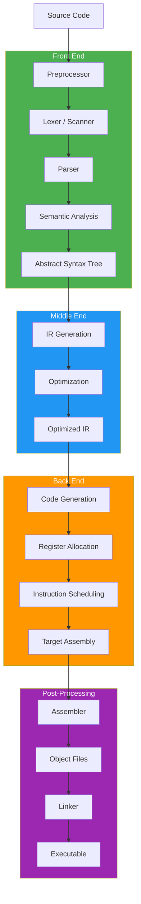
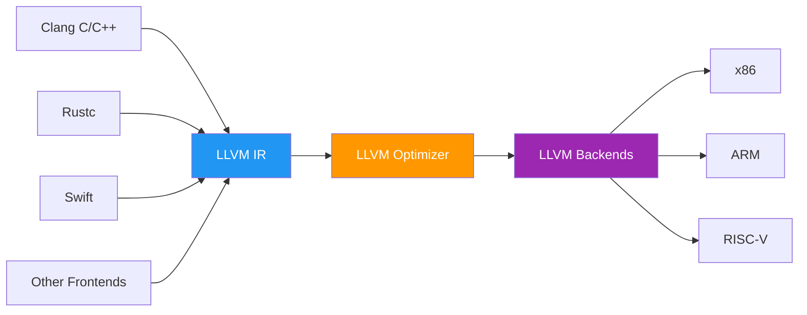

---
tags:
  - compiler
  - language-translation
  - swebok
  - programming-language-theory
  - optimization
source: "Compilers: Principles, Techniques, and Tools (Dragon Book) — Aho, Lam, Sethi, Ullman"
---

# Compiler Design and Language Translation

> **Source:** *Compilers: Principles, Techniques, and Tools* (Dragon Book) by Aho, Lam, Sethi, Ullman; *Engineering a Compiler* by Cooper & Torczon; *Modern Compiler Implementation* by Appel

---

## 1. The Compilation Pipeline

A compiler transforms source code from a high-level language to a low-level target (machine code, bytecode, or another language). The pipeline is traditionally divided into three phases:



| Phase | Input | Output | Key Concerns |
|-------|-------|--------|--------------|
| **Front End** | Source code | AST / IR | Correctness, error detection, language semantics |
| **Middle End** | IR | Optimized IR | Performance, code size, transformations |
| **Back End** | Optimized IR | Target code | Hardware exploitation, register allocation, scheduling |
| **Post-Processing** | Assembly | Executable | Symbol resolution, linking, loading |

### LLVM Architecture



Each frontend produces LLVM IR; the optimizer and backends are shared across all languages.

---

## 2. Preprocessing

The preprocessor handles directives before compilation begins.

| Directive | Purpose | Example |
|-----------|---------|---------|
| **Macro expansion** | Text substitution | `#define PI 3.14159` |
| **File inclusion** | Insert file contents | `#include <stdio.h>` |
| **Conditional compilation** | Include/exclude code | `#ifdef DEBUG ... #endif` |

**Concerns:**
- **Macro hygiene:** Macros don't respect scope or types; can cause subtle bugs
- **Hygienic macros** (Scheme, Rust): automatically rename bindings to avoid capture
- **Module systems** (C++20, Rust, Python): replace textual inclusion with proper module semantics

---

## 3. Lexical Analysis (Scanning)

The lexer converts a character stream into a stream of **tokens**.

### Token, Lexeme, Pattern

| Term | Definition | Example |
|------|-----------|---------|
| **Token** | Category of lexical unit | `NUMBER`, `IDENTIFIER`, `+` |
| **Lexeme** | Actual character sequence | `42`, `count`, `+` |
| **Pattern** | Rule that matches lexemes | `[0-9]+`, `[a-zA-Z_][a-zA-Z0-9_]*`, `\+` |

### Implementation

| Approach | Description | Tools |
|----------|-------------|-------|
| **Hand-written** | Code directly implements DFA transitions | Most production compilers (GCC, Clang) |
| **Generated** | Regular expressions → NFA → DFA → table-driven scanner | Lex, Flex, re2c |

**Key challenges:**
- **Longest match:** `>=` should match `>=`, not `>` followed by `=`
- **Lookahead:** `1.23` vs `1.` followed by `23` — context matters
- **Keywords vs identifiers:** `if` is a keyword, `iffy` is an identifier

---

## 4. Syntax Analysis (Parsing)

The parser converts a token stream into an **Abstract Syntax Tree (AST)**.

### Parsing Strategies

| Strategy | Type | Direction | Lookahead | Handles Left Recursion | Tools |
|----------|------|-----------|-----------|----------------------|-------|
| **LL(k)** | Top-down | Left-to-right, leftmost derivation | k tokens | ❌ No | ANTLR, JavaCC |
| **LR(k)** | Bottom-up | Left-to-right, rightmost derivation | k tokens | ✅ Yes | Yacc, Bison |
| **LALR(1)** | Bottom-up | Merges LR(1) states | 1 token | ✅ Yes | Yacc, Bison |
| **PEG** | Top-down | Ordered choice, greedy | Unlimited | ❌ (with packrat) | PEG.js, pyparsing |
| **GLR** | Both | Handles ambiguous grammars | Arbitrary | ✅ Yes | GLR parsers |

### Parse Tree vs AST

| Parse Tree (Concrete Syntax Tree) | AST (Abstract Syntax Tree) |
|---|---|
| Mirrors grammar productions exactly | Simplified, implementation-oriented |
| Includes all terminals (parentheses, semicolons) | Omits syntactic sugar |
| Useful for IDE features (syntax highlighting, formatting) | Used by compiler for semantic analysis |

### Error Recovery

| Strategy | Description |
|----------|-------------|
| **Panic mode** | Skip tokens until a synchronizing token (e.g., `;`, `}`) |
| **Phrase-level** | Insert/delete/replace tokens to repair the parse |
| **Error productions** | Add grammar rules for common mistakes |
| **Global correction** | Find minimum edit distance to valid program (impractical) |

---

## 5. Semantic Analysis

Verifies that the program's meaning is consistent with the language's rules.

### Type Checking

| Approach | When | Languages |
|----------|------|-----------|
| **Static** | Compile time | C, C++, Java, Rust, Go |
| **Dynamic** | Runtime | Python, Ruby, JavaScript |
| **Type inference** | Compiler deduces types | Haskell, Rust, Kotlin, TypeScript |
| **Gradual** | Optional static typing | TypeScript, mypy |

### Scope Resolution

| Type | Mechanism | Languages |
|------|-----------|-----------|
| **Static (lexical)** | Scope determined by textual structure | C, Java, Python, Rust |
| **Dynamic** | Scope determined by call stack | Some Lisps, Perl (with `local`) |

### Symbol Table

Maps identifiers to their attributes (type, scope, memory location).

| Implementation | Pros | Cons |
|----------------|------|------|
| **Hash table** | O(1) average lookup | No ordering; separate chaining for scope |
| **Tree** | Ordered, easy scope nesting | O(log n) lookup |
| **Stack of hash tables** | Fast, natural scope nesting | Memory overhead for deep scopes |

### Advanced Checks

- **Definite assignment:** Variables must be assigned before use (Java, Rust)
- **Borrow checking (Rust):** At most one mutable reference OR any number of immutable references to a value at any time
- **Null safety:** Nullable vs non-nullable types (Kotlin, Swift, TypeScript)

---

## 6. Intermediate Representations (IR)

The IR bridges the source language and the target machine.

### Types of IR

| IR Type | Description | Used By |
|---------|-------------|---------|
| **Three-address code** | At most one operator per instruction | GCC (GIMPLE), many teaching compilers |
| **SSA (Static Single Assignment)** | Each variable assigned exactly once; φ-functions at join points | LLVM IR, GCC (SSA form), JVM HotSpot |
| **Bytecode** | Stack-based or register-based virtual machine instructions | JVM, CPython, CLR, WebAssembly |
| **Sea of Nodes** | Graph-based IR with no explicit variable assignments | GraalVM, V8 TurboFan |
| **Control Flow Graph** | Nodes = basic blocks; edges = jumps | All optimizing compilers |

### SSA (Static Single Assignment)

```
// Original           // SSA form
x = 1                 x₁ = 1
if (cond)             if (cond)
  x = 2                   x₂ = 2
y = x + 1             x₃ = φ(x₂, x₁)    // merge
                      y₁ = x₃ + 1
```

**φ-function:** selects the correct value based on which predecessor block was taken.

### Bytecode Examples

| VM | Language | Stack/Register | Notes |
|----|----------|----------------|-------|
| **JVM** | Java, Kotlin, Scala | Stack-based | JIT compiled by HotSpot |
| **CPython** | Python | Stack-based | Interpreted; no JIT (until 3.13+) |
| **CLR** | C#, F# | Stack-based | JIT compiled by RyuJIT |
| **WebAssembly** | Many | Stack-based | Runs in browsers and standalone |
| **LuaJIT** | Lua | Register-based | Tracing JIT, extremely fast |

---

## 7. Optimization

### Local Optimizations (within a basic block)

| Technique | What It Does | Example |
|-----------|-------------|---------|
| **Constant folding** | Evaluate constant expressions at compile time | `3 * 4` → `12` |
| **Constant propagation** | Replace variables with known constant values | `x = 5; y = x + 1` → `y = 6` |
| **Dead code elimination** | Remove code that has no effect | `x = 5; x = 10;` → `x = 10` |
| **Common subexpression elimination (CSE)** | Reuse previously computed values | `a*b + a*b` → `t = a*b; t + t` |
| **Strength reduction** | Replace expensive ops with cheaper ones | `x * 2` → `x << 1` |
| **Peephole optimization** | Replace local instruction patterns with better ones | `mov rax, rax` → (delete) |

### Loop Optimizations

| Technique | What It Does |
|-----------|-------------|
| **Loop-invariant code motion (LICM)** | Move invariant computations out of the loop |
| **Loop unrolling** | Replicate loop body to reduce branch overhead |
| **Loop tiling (blocking)** | Restructure loops for cache locality |
| **Loop fusion** | Combine adjacent loops with same bounds |
| **Loop fission** | Split large loops for better cache behavior |
| **Induction variable elimination** | Replace loop counters with pointer arithmetic |

### Advanced Optimizations

| Technique | Description |
|-----------|-------------|
| **Function inlining** | Replace function call with function body |
| **Global value numbering (GVN)** | Eliminate redundant computations across basic blocks |
| **Sparse conditional constant propagation (SCCP)** | Combine constant propagation with dead code elimination |
| **Auto-vectorization** | Convert scalar operations to SIMD instructions |
| **Profile-guided optimization (PGO)** | Use runtime profiling data to guide optimizations |
| **Link-time optimization (LTO)** | Optimize across compilation units at link time |

---

## 8. Code Generation

### Instruction Selection

| Approach | Description | Pros | Cons |
|----------|-------------|------|------|
| **Tree pattern matching** | Match IR subtrees to target instructions | Optimal (dynamic programming) | Complex to implement |
| **Macro expansion** | One IR instruction → sequence of target instructions | Simple | Suboptimal code |
| **DAG-based** | Match DAGs to instruction templates | Handles CSE | More complex |
| **Peephole** | Replace sequences with better equivalents | Simple, effective | Not optimal |

### Register Allocation

| Approach | Description | Used By |
|----------|-------------|---------|
| **Graph coloring** | Build interference graph; color with k colors (= k registers) | GCC, many production compilers |
| **Linear scan** | Process intervals in linear order; assign registers greedily | JVM HotSpot, V8 (fast compile) |
| **Second chance binpacking** | Linear scan with spilling heuristics | Go compiler |

**Spilling:** When not enough registers, store values to memory (stack).

### Calling Conventions

| Convention | Platform | Args | Return | Callee-saved |
|------------|----------|------|--------|--------------|
| **cdecl** | x86 (C) | Stack | EAX | EBX, ESI, EDI, EBP |
| **System V AMD64** | x86-64 Linux/macOS | RDI, RSI, RDX, RCX, R8, R9 | RAX | RBX, RBP, R12-R15 |
| **Microsoft x64** | x86-64 Windows | RCX, RDX, R8, R9 | RAX | RBX, RBP, RDI, RSI, R12-R15 |
| **AAPCS64** | ARM64 | X0-X7 | X0 | X19-X28 |

### Instruction Scheduling

Reorder instructions to avoid pipeline stalls (data hazards, structural hazards).

| Hazard | Description | Solution |
|--------|-------------|----------|
| **Read-after-write (RAW)** | Instruction reads value before it's written | Pipeline interlocks, scheduling |
| **Write-after-write (WAW)** | Two instructions write same register | Register renaming |
| **Write-after-read (WAR)** | Instruction writes before previous reads | Register renaming |

---

## 9. Linkers and Loaders

### Linker Tasks

| Task | Description |
|------|-------------|
| **Symbol resolution** | Match symbol references to definitions across object files |
| **Relocation** | Adjust addresses after combining sections from multiple files |

### Static vs Dynamic Linking

| Aspect | Static | Dynamic |
|--------|--------|---------|
| **When** | At compile/link time | At load time or runtime |
| **Size** | Larger executable (library code included) | Smaller executable (shared library) |
| **Updates** | Recompile to update library | Update library file only |
| **Dependencies** | Self-contained | Requires library files on target system |
| **Examples** | `.a` (Linux), `.lib` (Windows) | `.so` (Linux), `.dll` (Windows), `.dylib` (macOS) |

### Object File Formats

| Format | Platform | Sections |
|--------|----------|----------|
| **ELF** | Linux, Unix | `.text` (code), `.data` (initialized), `.bss` (uninitialized), `.symtab` |
| **PE/COFF** | Windows | `.text`, `.data`, `.rdata`, `.reloc` |
| **Mach-O** | macOS | `__TEXT`, `__DATA`, `__LINKEDIT` |

### Loader Steps

1. Read executable header
2. Create process address space
3. Map executable segments into memory
4. Map shared libraries (dynamic linking)
5. Set up stack (arguments, environment)
6. Transfer control to entry point

---

## 10. Interpreters vs Compilers

| Aspect | Interpreter | Compiler |
|--------|------------|---------|
| **Execution** | Directly executes source/IR | Produces target code first |
| **Startup** | Fast (no compilation step) | Slow (must compile first) |
| **Runtime** | Slower (interpretation overhead) | Faster (native execution) |
| **Error detection** | At runtime | At compile time (more errors caught early) |
| **Debugging** | Easier (source-level) | Harder (need debug symbols) |

### The Spectrum

```
Pure Interpreter  →  Bytecode Interpreter  →  JIT Compiler  →  AOT Compiler
(Python)              (CPython)                 (HotSpot)        (GCC, Clang)
```

### JIT Compilation

| JIT Type | Strategy | Examples |
|----------|----------|---------|
| **Method JIT** | Compile entire methods | HotSpot (client), Dalvik |
| **Tracing JIT** | Compile hot execution traces | LuaJIT, PyPy, HotSpot (server) |
| **Baseline JIT** | Quick compilation, no optimization | V8 Ignition, SpiderMonkey |
| **Optimizing JIT** | Recompile hot code with optimizations | V8 TurboFan, HotSpot C2, GraalVM |

---

## 11. Cross-Compilers

A cross-compiler runs on one platform (**host**) but generates code for another (**target**).

| Use Case | Host | Target |
|----------|------|--------|
| Embedded development | x86 Linux | ARM Cortex-M |
| Mobile apps | x86 macOS | iOS (ARM64), Android (ARM/x86) |
| WebAssembly | Any | Wasm runtime |
| OS kernel development | x86 Linux | Bare-metal x86/ARM |

**Challenges:** Different ABI, different instruction set, different system calls, cross-debugging.

---

## 12. Assemblers

An assembler translates assembly language (mnemonics) into machine code (object files).

### Two-Pass Assembly

| Pass | Task |
|------|------|
| **Pass 1** | Scan labels, build symbol table (label → address) |
| **Pass 2** | Replace labels with addresses, emit machine code |

### Common Assemblers

| Assembler | Platform | Syntax |
|-----------|----------|--------|
| **GNU As (GAS)** | Linux, Unix | AT&T syntax (`movl $5, %eax`) |
| **NASM** | Cross-platform | Intel syntax (`mov eax, 5`) |
| **MASM** | Windows | Intel syntax with high-level directives |
| **LLVM integrated** | Cross-platform | Used internally by LLVM backends |

---

## 13. Garbage Collection

| Strategy | Description | Pros | Cons | Languages |
|----------|-------------|------|------|-----------|
| **Reference counting** | Count references to each object; free when count = 0 | Immediate reclamation, predictable | Cycles require special handling | Python, Swift, PHP |
| **Mark-and-sweep** | Mark reachable objects; sweep unmarked | Handles cycles | Stop-the-world pauses | Early Java, Go (concurrent) |
| **Copying (semi-space)** | Copy live objects to new space; discard old | No fragmentation | 2× memory, pause | JVM young generation |
| **Generational** | Young objects collected more frequently | Most objects die young | Complexity | JVM, .NET, V8 |
| **Concurrent** | GC runs alongside mutator threads | Low pauses | Complex, overhead | ZGC, Shenandoah, G1 |
| **Incremental** | GC in small steps | Bounded pauses | Overhead | Incremental mark-sweep |

---

## Key Takeaways

1. **The compilation pipeline** is divided into front end (source → IR), middle end (optimization), and back end (IR → target)
2. **Lexical analysis** converts characters to tokens using regular expressions and finite automata
3. **Parsing** builds an AST from tokens using context-free grammars; LL and LR are the main strategies
4. **Semantic analysis** checks types, scopes, and language-specific rules; symbol tables track identifiers
5. **SSA form** (each variable assigned once) enables powerful optimizations and is used by LLVM, GCC, JVM
6. **Optimization** operates at local, loop, and global levels; PGO and LTO extend optimization across runtime and link time
7. **Register allocation** (graph coloring or linear scan) and **instruction scheduling** are the back end's hardest problems
8. **Linkers** combine object files via symbol resolution and relocation; dynamic linking enables shared libraries
9. **JIT compilation** bridges interpretation and ahead-of-time compilation, optimizing hot code at runtime
10. **Garbage collection** strategies range from simple reference counting to sophisticated concurrent generational collectors

---

## Related

- [[Programming Language Theory Overview]] — Syntax, type systems, operational semantics
- [[04_Syntax_and_Parsing]] — CFGs, lexing, parsing in depth
- [[05_Type_Systems_and_Judgments]] — Type checking and inference
- [[06_Operational_Semantics]] — Semantic interpretation of ASTs
- [[Computer Organization Overview]] — Target architecture (ISA, memory hierarchy)

---

## Sources

- Aho, A. V., Lam, M. S., Sethi, R., & Ullman, J. D. *Compilers: Principles, Techniques, and Tools* (2nd ed., Dragon Book)
- Cooper, K., & Torczon, L. *Engineering a Compiler* (2nd ed.)
- Appel, A. W. *Modern Compiler Implementation in ML/Java/C*
- Muchnick, S. S. *Advanced Compiler Design and Implementation*
- SWEBOK v4, Chapter 16 — Computing Foundations
